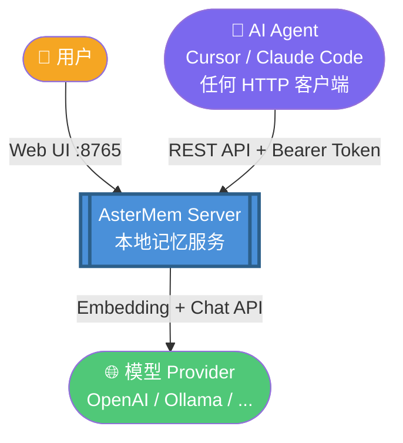
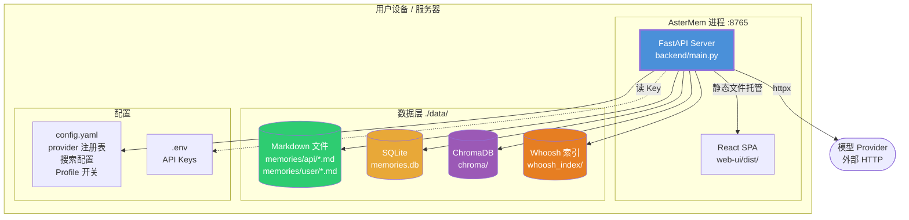
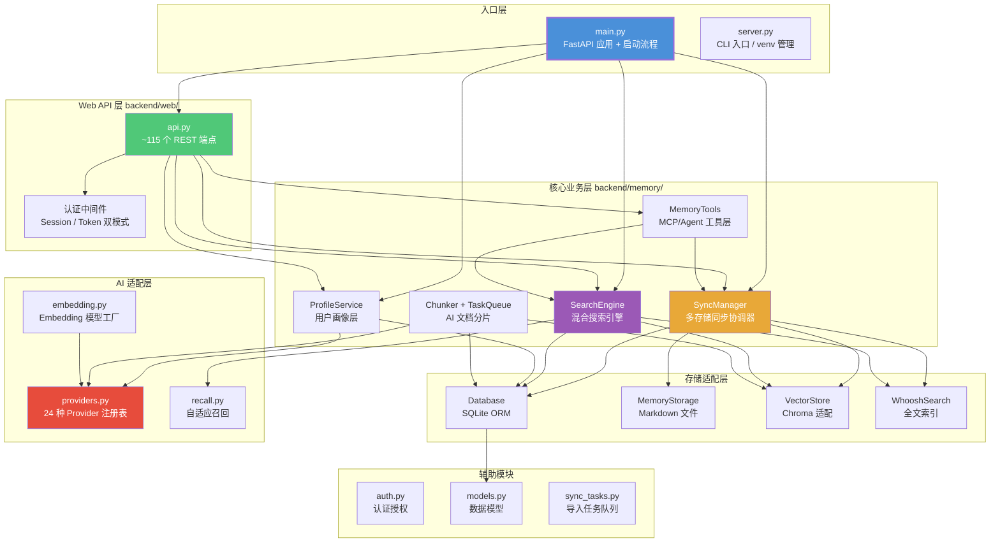
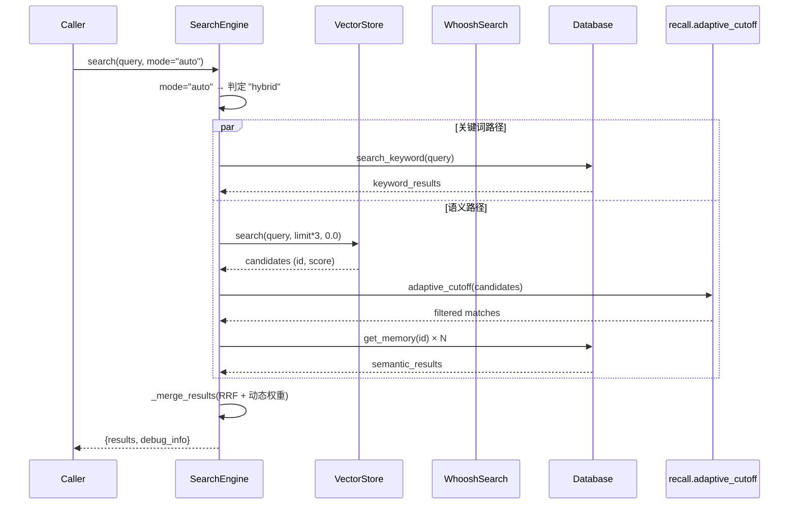
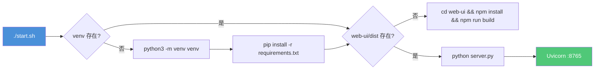
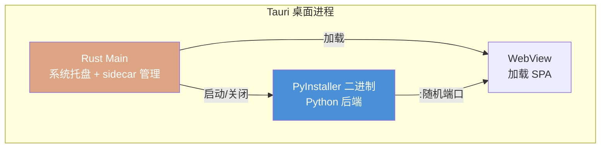

# 02 · C4 架构模型

本章使用 [C4 模型](https://c4model.com/)（Context → Container → Component → Code）从宏观到微观剖析 AsterMem 的架构。

## 2.1 Level 1 — System Context（系统上下文）

AsterMem 作为一个自托管记忆中枢，连接用户、AI Agent 和模型服务三方：



**关键边界**：
- 用户通过浏览器访问 Web UI（FastAPI 内嵌 SPA）
- AI Agent 通过 REST API 操作记忆，认证方式为 Bearer Token（`ast_xxxxx`）
- AsterMem 作为客户端，向外部 Provider 发起 Embedding 和 Chat 请求
- 所有持久化数据存储在 `./data/` 目录，不依赖任何外部数据库服务

## 2.2 Level 2 — Container（容器）

AsterMem 的"容器"不是 Docker 容器，而是部署单元/进程：



**容器职责**：

| 容器 | 技术 | 端口/路径 | 职责 |
|------|------|-----------|------|
| **FastAPI Server** | Python + Uvicorn | :8765 | REST API、Agent 端点、SPA 托管、MCP Server |
| **React SPA** | React 18 + TypeScript | / | 记忆管理、搜索、设置、时间线、知识图谱等 UI |
| **Markdown 存储** | 文件系统 | `./data/memories/` | 人类可读的记忆持久化，支持手工编辑 |
| **SQLite** | SQLite | `./data/memories.db` | 结构化存储：记忆元数据、版本历史、Trunk、实体、Profile、认证 |
| **ChromaDB** | Chroma | `./data/chroma/` | 向量索引（memories + trunks 两个 collection） |
| **Whoosh 索引** | Whoosh | `./data/whoosh_index/` | 全文关键词索引（中文 jieba 分词） |
| **配置文件** | YAML | `./config.yaml` | Provider 注册表、搜索参数、Profile 开关 |
| **环境变量** | dotenv | `./.env` | Provider API Keys（明文不入 config） |

### 端口策略

```
首次启动 → 从 8000-9000 随机选端口 → 写入 config.yaml → 后续固定
Docker 部署 → 固定 8768
桌面版 → Tauri 进程管理（sidecar 模式）
```

### 单进程设计的关键决策

`backend/main.py` 的设计注释明确指出：

> *"Maintain the 'one command to start' deployment experience"*

FastAPI 同时服务 `/api/*`（REST）和 `/assets/*` + `/`（SPA），这是刻意的。好处：
1. 部署极简——一个进程、一个端口
2. 无 CORS 问题——前后端同源
3. 开发时也可分离——`start.sh` 支持 `--dev` 模式

## 2.3 Level 3 — Component（组件）

深入 FastAPI 进程内部，看后端模块的组件划分：



### 组件职责详解

**入口层**

| 组件 | 文件 | 职责 |
|------|------|------|
| `main.py` | `backend/main.py` | FastAPI 应用定义、生命周期管理（startup/shutdown）、所有组件初始化与依赖注入 |
| `server.py` | `server.py` | CLI 入口、venv 自动创建、依赖安装、启动 Uvicorn、`--reset-admin` 离线重置 |

**Web API 层**

| 组件 | 文件 | 职责 |
|------|------|------|
| `api.py` | `backend/web/api.py` | ~115 个 REST 端点，涵盖记忆 CRUD、搜索、配置、认证、导入导出、时间线、知识图谱、Profile、Agent |
| 认证中间件 | api.py 内 | Session Cookie（Web UI）+ Bearer Token（API/Agent）双模式认证 |

**核心业务层**

| 组件 | 文件 | 职责 |
|------|------|------|
| `SyncManager` | `sync.py` | 多存储同步：每次 Memory 写入同步到 MD + SQLite + Chroma + Whoosh |
| `SearchEngine` | `search.py` | 混合搜索引擎：协调关键词与语义搜索，RRF 融合，动态权重 |
| `MemoryTools` | `tools.py` | Agent 工具层：封装为 MCP 友好的操作接口，带 Next Step Hints |
| `ProfileService` | `profile.py` | 用户画像：L1/L2 字段 + L3 AI Claims，Dream 慢循环蒸馏 |
| `Chunker` | `chunker.py` | AI 文档分片：将长文切分为语义连贯的 Trunk，AI 失败降级为启发式 |
| `ChunkingProcessor` | `task_queue.py` | 后台任务队列：异步处理分片，支持中断恢复 |

**存储适配层**

| 组件 | 文件 | 职责 |
|------|------|------|
| `Database` | `database.py` | SQLite 操作：记忆 CRUD、Trunk 管理、版本历史、实体图谱、Whoosh 同步 |
| `MemoryStorage` | `storage.py` | Markdown 文件读写：frontmatter 解析、目录扫描、ZIP 导入导出 |
| `VectorStore` | `vector.py` | ChromaDB 适配：memories + trunks 双 collection，cosine 相似度 |
| `WhooshSearch` | `whoosh_search.py` | Whoosh 全文索引：中文 jieba 分词，文档级 + Trunk 级索引 |

**AI 适配层**

| 组件 | 文件 | 职责 |
|------|------|------|
| `providers.py` | `providers.py` | 24 种 Provider 注册表 + 3 个协议适配器（openai/gemini/anthropic）+ 配置迁移 |
| `embedding.py` | `embedding.py` | Embedding/Chat 模型工厂，根据配置实例化 |
| `recall.py` | `recall.py` | 自适应召回策略：相对锚点截断，替代固定阈值 |

## 2.4 Level 4 — Code（关键代码结构）

选择最核心的 `SearchEngine.search()` 方法做 Code 级别展示：



### RRF 融合算法（核心代码级）

```python
# search.py _merge_results()
# Score = W × 1/(k + rank)   其中 k=60

W_KEYWORD, W_SEMANTIC = self._calculate_dynamic_weights(query)
# 问句 → (1.0, 3.0)  语义主导
# 短词(≤2词) → (2.0, 1.0)  关键词主导
# 中等(3-5词) → (1.0, 2.0)
# 长查询(6+词) → (1.0, 3.0)

for rank, r in enumerate(keyword_results):
    rrf_scores[id] += W_KEYWORD * (1.0 / (60 + rank + 1))
for rank, r in enumerate(semantic_results):
    rrf_scores[id] += W_SEMANTIC * (1.0 / (60 + rank + 1))
```

**设计约束**（代码注释指出）：权重差不超过 3x，确保两条路径都能影响最终排序，避免退化为单路径检索。

## 2.5 部署架构

### 裸机 / 源码部署



### Docker 部署

```mermaid
graph TB
    subgraph "Docker Container"
        App[AsterMem App<br/>Python 3.11-slim]
        Vol1[/data/ volume]
        Vol2[/app/config.yaml/]
    end
    Port[:8768 → 8765]
    App --> Vol1
    App --> Vol2
    App -.->|映射| Port
    style App fill:#4A90D9,color:#fff
```

### Tauri 桌面应用



## 2.6 架构决策记录（ADR 摘要）

| # | 决策 | 理由 |
|---|------|------|
| 1 | **单进程单端口** | 部署极简，无 CORS，"一条命令启动"体验 |
| 2 | **三存储同步（MD+SQLite+Chroma）** | MD 人类可读+备份友好，SQLite 结构化查询，Chroma 语义搜索 |
| 3 | **自适应召回替代固定阈值** | 模型无关、数据量无关，避免静默退化 |
| 4 | **配置驱动 Provider，代码只有 3 个适配器** | 新增 Provider 零代码改动，Key 不入配置文件 |
| 5 | **默认不联网**（builtin ONNX 模型需手动选择） | 尊重离线场景，首次使用不擅自下载 80MB 模型 |
| 6 | **AGPL-3.0 许可证** | 保护开源贡献要求，商业使用需开源衍生作品 |

---

*上一章：[01 · 项目概述](01-overview.md)* · *下一章：[03 · 核心业务流程](03-flows.md)*

---

☕️ 制作不易，请我喝咖啡☕️关注我➕