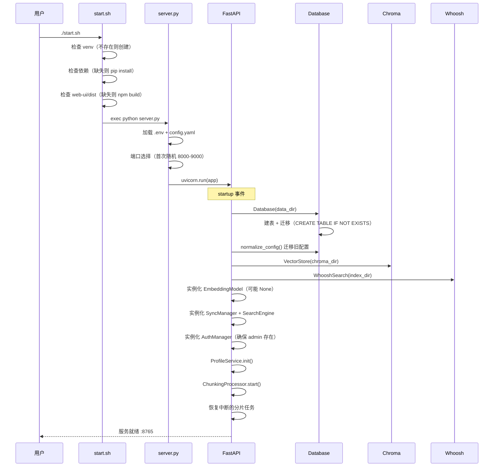
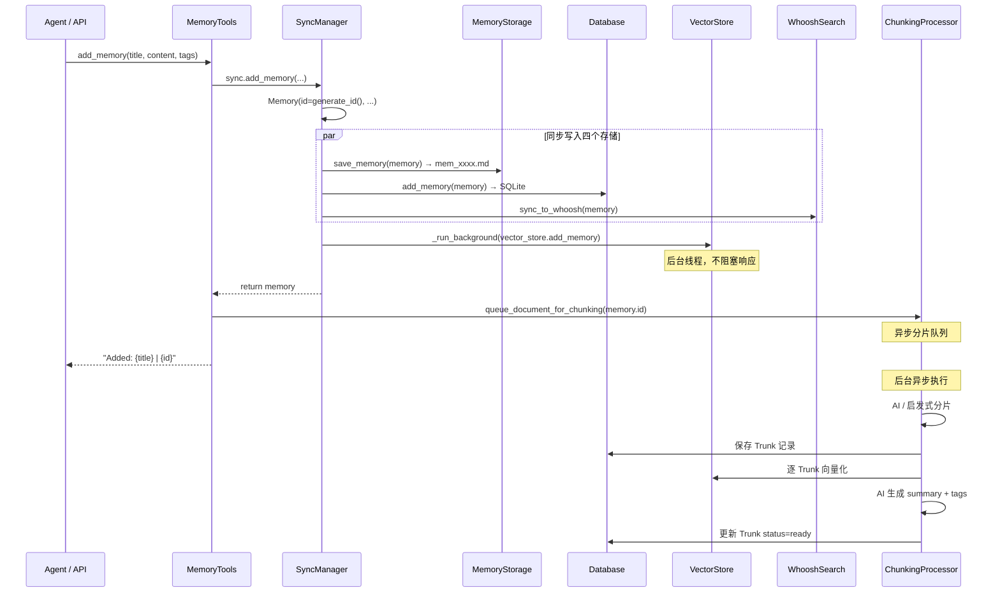
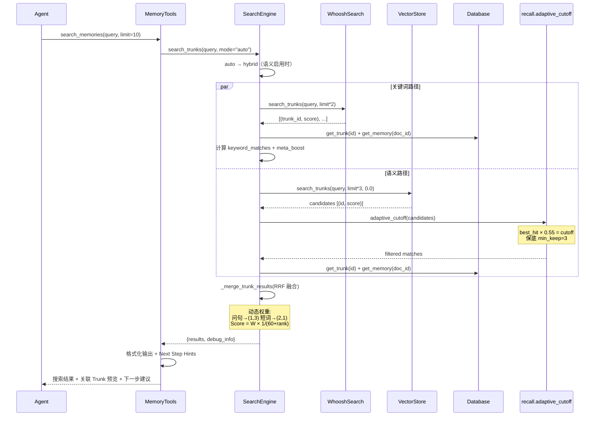
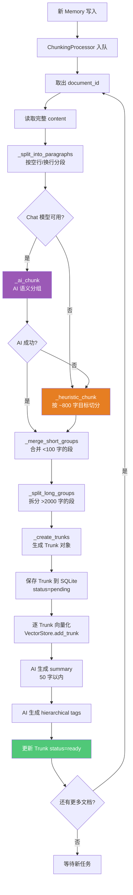
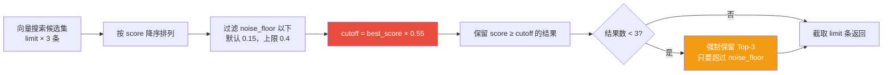
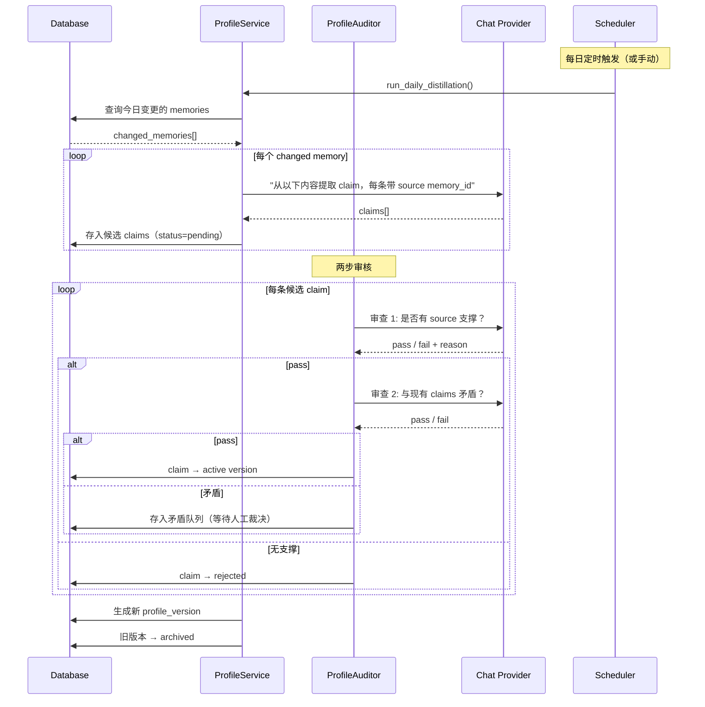
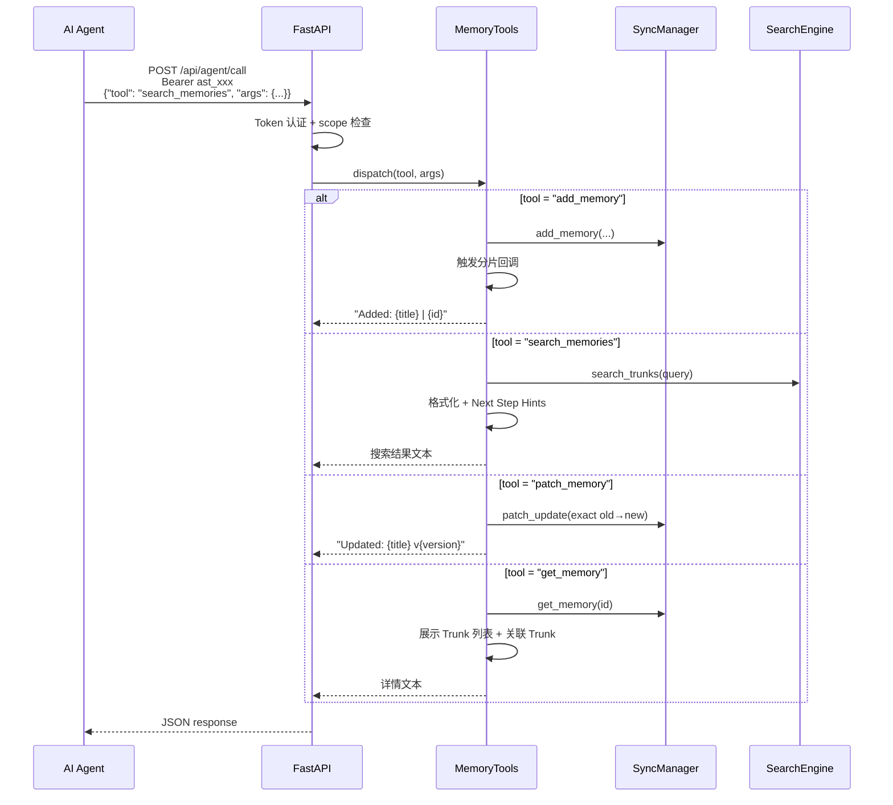
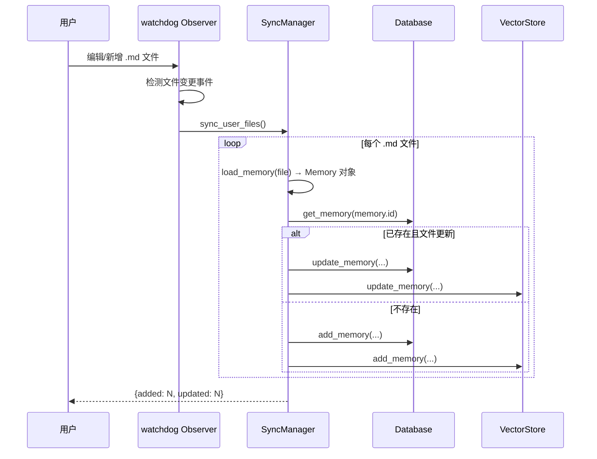
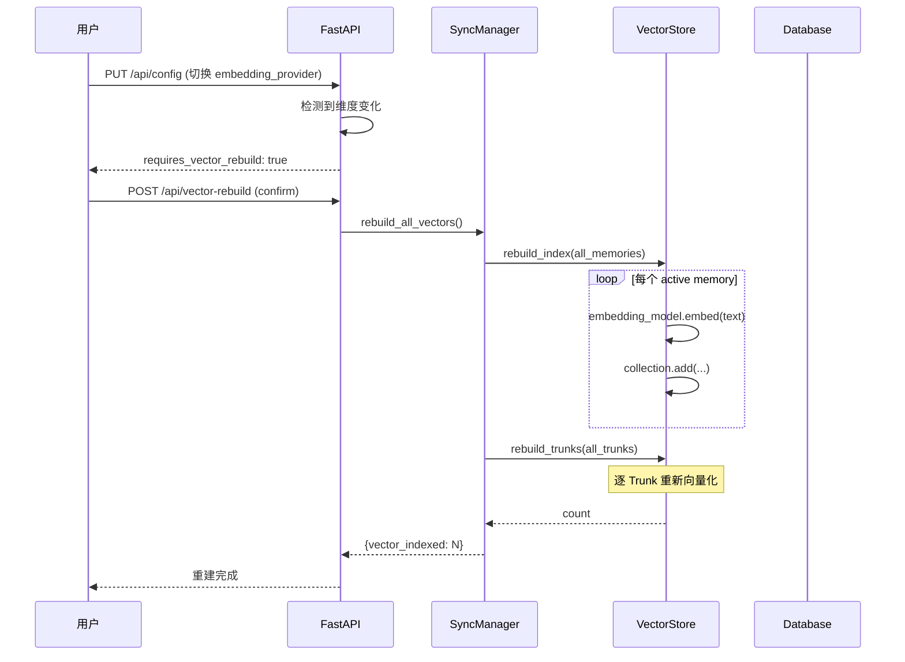

# 03 · 核心业务流程

本章梳理 AsterMem 的 10 大核心业务流程，配 Mermaid 时序图 / 流程图。

## 3.1 系统启动流程



**关键设计**：启动是幂等的——重复执行 `start.sh` 不会重复安装或构建，只启动服务。

## 3.2 记忆创建流程（多存储同步）

这是 AsterMem 最核心的数据流，展示了"一次写入、四处同步"的设计：



**关键设计点**：

1. **响应速度优先**：MD + SQLite + Whoosh 同步写入（快），Chroma 向量化在后台线程（不阻塞）
2. **分片延迟处理**：ChunkingProcessor 异步队列处理，内容变更可触发重新分片
3. **失败隔离**：向量存储失败不影响 Memory 已落盘的数据完整性

## 3.3 混合搜索流程（核心检索路径）



**Next Step Hints 机制**（`tools.py`）：

搜索结果末尾自动附带导航建议，引导 Agent 多轮检索：

```
[Next Steps]
- Semantically similar but not shown: "团队决策记录"(mem_xxx), use get_memory to expand
- Tags from matched content: work/decisions, team, use list_memories_by_tag to broaden
- A single search usually covers only one angle. Try different keywords / synonyms / tags...
```

这是 AsterMem 区别于普通搜索 API 的关键设计——**主动引导 Agent 避免一次搜索就下结论**。

## 3.4 AI 文档分片流程（Chunking）



**AI 分片的 Prompt 设计**（`chunker.py`）：

```
你是文档分片助手。以下是文档的编号段落列表。
请按语义分组，每组应是一个完整的主题或逻辑单元。
直接输出分组结果，格式：1-2, 3, 4-6, 7-9
```

**容错设计**：AI 输出解析时，自动处理幻觉（跳过的段落自动补为独立组）。

## 3.5 自适应召回（Adaptive Recall）



**为什么不用固定阈值？**（`recall.py` 设计注释）

> 生产事故：用户配置 `min_similarity=0.69`，但 Embedding 模型对最精确查询的最高分仅 0.62。语义搜索静默返回 0 条结果，退化为纯关键词搜索，用户毫无感知。

自适应方案让"相关性"成为相对判断——**以当前查询的最佳匹配为锚点**，使阈值与模型和数据量无关。

## 3.6 用户画像蒸馏流程（Profile Layer + Dream）



**三层输出模型**：

| 层级 | 内容 | 数据来源 |
|------|------|----------|
| **L1 Core Traits** | nickname, gender, language, timezone（必填） | AI 蒸馏 + 用户手动编辑 |
| **L2 Optional** | occupation, location, organization, focus, preferences, taboos | AI 蒸馏 + 用户手动编辑 |
| **L3 AI Claims** | 从记忆蒸馏的事实声明，每条带 source memory_id | AI 蒸馏 + 两步审核 |

**硬约束**：每条 claim 必须包含 source memory_id，解析器拒绝无来源的 claim（`profile.py` 注释）。

## 3.7 认证与授权流程

```mermaid
flowchart TD
    Req[HTTP 请求] --> Auth{认证中间件}
    Auth -> IsPub{公开路径?<br/>/api/auth/login 等}
    IsPub -->|是| Pass[放行]
    IsPub -->|否| LoginReq{login_required?}
    LoginReq -->|否| PassNoAuth[放行<br/>用 primary_admin_id]

    LoginReq -->|是| HasSession{Session Cookie 有效?}
    HasSession -->|是| Pass
    HasSession -->|否| HasToken{Bearer Token?}
    HasToken -->|否| Reject401[401 Unauthorized]
    HasToken -->|是| VerifyToken[verify_api_token]
    VerifyToken --> Scope{需要 scope?}
    Scope -->|有权限| Pass
    Scope -->|无权限| Reject403[403 Forbidden]

    style Pass fill:#50C878,color:#fff
    style Reject401 fill:#E74C3C,color:#fff
    style Reject403 fill:#E74C3C,color:#fff
```

**Token Scope 体系**（`auth.py`）：

| Scope | 允许的操作 |
|-------|-----------|
| `read` | 搜索、统计、图谱、时间线、导出 |
| `write` | 记忆 CRUD、标签、导入、探索、时间线更新 |
| `config` | Provider 配置、语义搜索开关、索引重建 |
| `admin` | 账户管理、Token 管理、日志查看 |
| `destructive` | 删除、清空数据、重启操作 |

**默认 Token** 包含 `read` + `write` + `config`。`destructive` REST 调用需二次确认（`confirm` 参数）。

## 3.8 Agent 调用流程（/api/agent/call）



**Agent 工具清单**（15+ 种，见 `tools.py` + SKILL）：

| 工具 | 用途 |
|------|------|
| `add_memory` | 添加记忆（触发分片） |
| `update_memory` | 更新记忆（内容变更触发重新分片） |
| `patch_memory` | 精确文本替换（优于整体更新） |
| `delete_memory` | 归档记忆（软删除） |
| `get_memory` | 获取记忆详情（含 Trunk + 关联） |
| `search_memories` | 搜索（Trunk 级 + Next Step Hints） |
| `list_memories` | 列表（按状态/来源/标签） |
| `list_memories_by_tag` | 按标签筛选 |
| `get_stats` | 统计信息 |
| `quick_search` | 快速语义匹配 |

## 3.9 文件同步流程（用户手工编辑 MD）

AsterMem 支持用户直接编辑 `./data/memories/user/` 目录下的 MD 文件：



## 3.10 向量索引重建流程

当用户切换 Embedding Provider 后，向量维度变化，必须全量重建：



**中断恢复**：重建过程被中断（进程崩溃等），下次启动时自动检测并恢复未完成的重建。

---

*上一章：[02 · C4 架构模型](02-c4-architecture.md)* · *下一章：[04 · 模块结构](04-modules.md)*

---

☕️ 制作不易，请我喝咖啡☕️关注我➕