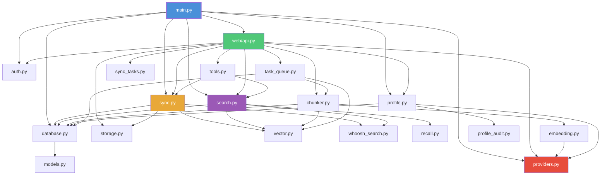
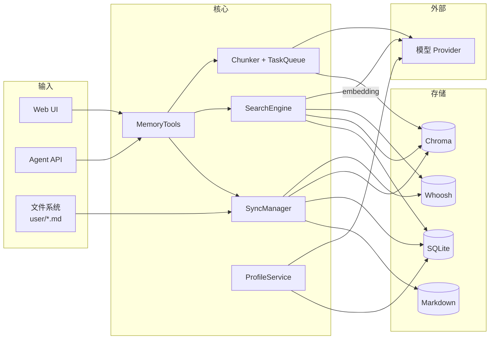

# 04 · 模块结构

## 4.1 完整目录树

```
AsterMem/
├── backend/                    # Python 后端
│   ├── main.py                 # FastAPI 应用 + 启动流程 + 依赖注入 (24KB)
│   ├── memory/                 # 核心业务模块
│   │   ├── __init__.py         # output_language 全局指令管理
│   │   ├── models.py           # 数据模型：Memory, Trunk, SearchResult, TrunkSearchResult (12KB)
│   │   ├── database.py         # SQLite ORM：记忆/Trunk/历史/实体/Profile (23KB)
│   │   ├── storage.py          # Markdown 文件存储 (9KB)
│   │   ├── vector.py           # ChromaDB 向量存储适配 (22KB)
│   │   ├── whoosh_search.py    # Whoosh 全文索引 + jieba 分词
│   │   ├── sync.py             # SyncManager：多存储同步协调 (9KB)
│   │   ├── search.py           # SearchEngine：混合搜索 + RRF 融合 (31KB)
│   │   ├── recall.py           # 自适应召回策略 (5KB)
│   │   ├── providers.py        # 24 种 Provider 注册表 + 协议适配 (60KB)
│   │   ├── embedding.py        # Embedding/Chat 模型工厂
│   │   ├── chunker.py          # AI 文档分片 (16KB)
│   │   ├── task_queue.py       # 后台分片任务队列 + 中断恢复
│   │   ├── sync_tasks.py       # 导入任务管理
│   │   ├── tools.py            # MemoryTools：MCP/Agent 工具层 (45KB)
│   │   ├── auth.py             # 认证授权 + Token 管理 (34KB)
│   │   ├── profile.py          # 用户画像层 (28KB)
│   │   ├── profile_audit.py    # Profile 两步审核器
│   │   ├── usage_tracker.py    # Token 用量统计
│   │   ├── demo_mode.py        # Demo 模式
│   │   └── ...                 # 其他辅助模块
│   └── web/
│       ├── api.py              # ~115 个 REST API 端点 (165KB)
│       └── __init__.py
│
├── web-ui/                     # React 前端
│   ├── src/
│   │   ├── App.tsx             # 路由 + 全局状态
│   │   ├── pages/              # 16+ 页面组件
│   │   │   ├── Login.tsx       # 登录
│   │   │   ├── Dashboard.tsx   # 仪表盘
│   │   │   ├── Memories.tsx    # 记忆管理
│   │   │   ├── AddMemory.tsx   # 新增记忆
│   │   │   ├── MemoryDetail.tsx# 记忆详情
│   │   │   ├── Search.tsx      # 搜索（含 Playground）
│   │   │   ├── Explorer.tsx    # 3D 向量空间浏览器
│   │   │   ├── Settings.tsx    # 设置（Provider 配置）
│   │   │   ├── Timeline.tsx    # 时间线
│   │   │   ├── KnowledgeGraph.tsx # 知识图谱
│   │   │   ├── Profile.tsx     # 用户画像
│   │   │   ├── Admin.tsx       # 管理后台
│   │   │   ├── ApiTokens.tsx   # Token 管理
│   │   │   ├── Import.tsx      # 导入
│   │   │   ├── Devtools.tsx    # 开发者工具
│   │   │   └── ...
│   │   ├── components/         # 通用组件
│   │   ├── locales/            # 10 种语言文件
│   │   │   ├── en.ts
│   │   │   ├── zh-CN.ts
│   │   │   ├── zh-TW.ts
│   │   │   ├── ja.ts
│   │   │   ├── ko.ts
│   │   │   ├── de.ts
│   │   │   ├── es.ts
│   │   │   ├── fr.ts
│   │   │   ├── pt.ts
│   │   │   └── ru.ts
│   │   ├── types.ts            # TypeScript 类型定义
│   │   └── api.ts              # API 客户端
│   ├── index.html
│   ├── vite.config.ts
│   ├── package.json
│   └── tsconfig.json
│
├── skill/                      # AI Agent 集成
│   └── astermem/
│       ├── SKILL.md            # Cursor/Claude Code 技能定义 (10KB)
│       ├── reference.md        # 完整工具参考
│       └── scripts/
│           ├── astermem.sh     # macOS/Linux CLI 包装
│           └── astermem.ps1    # Windows PowerShell CLI 包装
│
├── desktop/                    # Tauri 桌面应用
│   ├── src-tauri/
│   │   ├── src/main.rs         # Rust 后端：sidecar 管理 + 系统托盘
│   │   ├── Cargo.toml
│   │   └── tauri.conf.json
│   └── ...
│
├── deploy/                     # 部署配置
│   ├── systemd/
│   │   └── astermem-demo.service  # Demo 部署 service 文件
│   └── ...
│
├── scripts/                    # 运维脚本
│   ├── astermem.sh             # 用户端 CLI（调用 REST API）
│   └── astermem.ps1
│
├── tests/                      # 测试套件
│   ├── test_search.py          # 搜索引擎测试
│   ├── test_chunker.py         # 分片器测试
│   ├── test_recall.py          # 召回策略测试
│   ├── test_providers.py       # Provider 测试
│   ├── test_models.py          # 数据模型测试
│   ├── test_storage.py         # 存储测试
│   ├── test_database.py        # 数据库测试
│   ├── test_auth.py            # 认证测试
│   ├── test_sync.py            # 同步测试
│   ├── test_vector.py          # 向量存储测试
│   ├── test_profile.py         # Profile 测试
│   ├── test_api.py             # API 测试
│   ├── test_embedding.py       # Embedding 测试
│   ├── test_whoosh_search.py   # Whoosh 测试
│   ├── conftest.py             # pytest fixtures
│   └── ...                     # 共 16 个测试文件
│
├── docs/                       # 文档
│   └── ...
│
├── server.py                   # CLI 入口：venv 管理 + Uvicorn 启动 (812B 核心)
├── start.sh                    # 一键启动（macOS/Linux）
├── start.bat                   # Windows 启动
├── start.ps1                   # Windows PowerShell 启动
├── requirements.txt            # Python 依赖
├── Dockerfile                  # Docker 构建
├── docker-compose.yml          # Docker Compose 配置
├── docker-compose.demo.yml    # Demo 环境配置
├── .env.example                # 环境变量模板
├── config.yaml                 # 运行时配置（自动生成）
├── LICENSE                     # AGPL-3.0
└── README.md                   # 项目说明
```

## 4.2 后端模块依赖关系



## 4.3 模块职责矩阵

### 4.3.1 核心模块

| 模块 | 行数 | 核心类/函数 | 依赖 | 职责 |
|------|------|-------------|------|------|
| **models.py** | 350 | `Memory`, `Trunk`, `SearchResult`, `TrunkSearchResult` + ID 生成器 | 无 | 纯数据模型，无副作用 |
| **database.py** | 650 | `Database` | models | SQLite 全部表操作 |
| **storage.py** | 256 | `MemoryStorage` | models | Markdown 文件读写 |
| **vector.py** | 627 | `VectorStore` | models, embedding | ChromaDB 向量操作 |
| **whoosh_search.py** | — | `WhooshSearch` | whoosh, jieba | 全文索引 |
| **sync.py** | 288 | `SyncManager` | database, storage, vector | 多存储同步协调 |
| **search.py** | 846 | `SearchEngine` | database, vector, recall, whoosh | 混合搜索 + RRF |
| **recall.py** | 133 | `adaptive_cutoff`, `clamp_noise_floor` | 无 | 自适应召回策略 |
| **providers.py** | 1311 | `PROVIDER_CATALOG`, `normalize_config`, `EmbeddingModel` | httpx | 24 种 Provider + 协议适配 |
| **embedding.py** | — | `get_embedding_model`, `get_chat_model` | providers | 模型工厂 |
| **chunker.py** | 487 | `Chunker`, `create_chunker` | models, embedding | AI 文档分片 |
| **task_queue.py** | — | `ChunkingProcessor` | database, vector, chunker | 后台分片队列 |
| **tools.py** | 1194 | `MemoryTools` | sync, search | Agent 工具层 |
| **auth.py** | 1117 | `AuthManager` | database | 认证 + Token |
| **profile.py** | 647 | `ProfileService` | database, providers | 用户画像 |
| **profile_audit.py** | — | `ProfileAuditor` | database, providers | Profile 两步审核 |

### 4.3.2 入口与配置

| 模块 | 职责 |
|------|------|
| **main.py** | FastAPI 应用定义、生命周期管理、组件初始化与依赖注入、SPA 静态文件托管 |
| **server.py** | CLI 入口、venv 自动管理、依赖安装、端口选择、`--reset-admin` 离线密码重置 |
| **start.sh / start.bat** | 幂等启动脚本：venv → 依赖 → UI 构建 → 启动 |
| **config.yaml** | 运行时配置：provider 注册表、搜索参数、auth 设置、profile 开关 |
| **.env** | Provider API Keys（从 .env.example 模板创建） |

### 4.3.3 Web API 层

| 模块 | 行数 | 职责 |
|------|------|------|
| **web/api.py** | 4487 | ~115 个 REST 端点，是整个项目最大的单文件。涵盖：记忆 CRUD、搜索、配置、认证、Token、导入导出、时间线、知识图谱、Profile、Agent Call、API 日志 |

## 4.4 数据流总结

AsterMem 的数据流可以用一张"总线图"概括：



**关键观察**：

1. **SyncManager 是写入总线** — 所有记忆写入都经过它，确保四存储一致
2. **SearchEngine 是读取总线** — 所有搜索请求经它协调多存储查询
3. **Provider 是唯一外部依赖** — 除了 Provider API 调用，系统完全自包含
4. **Markdown 是 Source of Truth** — 数据的最终持久化形式，可直接备份/编辑

## 4.5 前端模块结构

### 页面组件

| 页面 | 核心功能 |
|------|----------|
| **Dashboard** | 统计概览、最近记忆、快速操作 |
| **Memories** | 记忆列表、筛选、批量操作 |
| **AddMemory** | 新增记忆（支持 Markdown、图片、音频） |
| **MemoryDetail** | 记忆详情 + Trunk 列表 + 关联记忆 |
| **Search** | 搜索 Playground（关键词/语义/混合模式切换） |
| **Explorer** | 3D 向量空间可视化（UMAP 降维散点图） |
| **Settings** | Provider 配置、搜索参数、语言、登录保护 |
| **Timeline** | 时间线视图（从记忆提取的事件） |
| **KnowledgeGraph** | 知识图谱（实体 + 关系） |
| **Profile** | 用户画像查看与编辑 |
| **Admin** | 管理后台 |
| **ApiTokens** | API Token 创建与管理 |
| **Import** | 批量导入 |
| **Devtools** | 开发者调试工具 |

### 前端架构特点

- **纯 SPA** — Vite 构建，输出到 `web-ui/dist/`，由 FastAPI 静态托管
- **自建 i18n** — 非依赖 i18next 等库，`locales/` 下每个语言一个 TS 文件
- **无状态管理库** — 使用 React 内置 useState/useContext
- **API 客户端** — `src/api.ts` 封装所有 REST 调用，统一错误处理

## 4.6 桌面应用结构

```
desktop/src-tauri/
├── src/
│   └── main.rs          # Tauri 主进程
├── Cargo.toml           # Rust 依赖
└── tauri.conf.json      # Tauri 配置
```

**桌面应用职责**：

1. **Sidecar 管理** — 启动/关闭打包好的 Python 后端二进制（PyInstaller）
2. **系统托盘** — 最小化到托盘、快速操作
3. **WebView** — 加载 React SPA
4. **自动更新** — GitHub Actions 自动构建 + 发布

## 4.7 测试结构

```
tests/
├── conftest.py              # pytest fixtures（临时数据库、配置）
├── test_search.py           # SearchEngine 单元测试
├── test_chunker.py          # Chunker 分片测试
├── test_recall.py           # adaptive_cutoff 测试
├── test_providers.py        # Provider 配置迁移测试
├── test_models.py           # 数据模型测试
├── test_storage.py          # Markdown 存储测试
├── test_database.py         # SQLite 操作测试
├── test_auth.py             # 认证 + Token 测试
├── test_sync.py             # SyncManager 测试
├── test_vector.py           # VectorStore 测试
├── test_profile.py          # ProfileService 测试
├── test_api.py              # API 端点集成测试
├── test_embedding.py        # Embedding 模型测试
└── test_whoosh_search.py    # Whoosh 全文搜索测试
```

**测试特点**：
- 每个核心模块都有对应测试文件
- `conftest.py` 提供隔离的临时数据库和配置 fixtures
- 测试覆盖核心业务逻辑，但不依赖外部 Provider（网络测试在 CI 中跳过）

---

*上一章：[03 · 核心业务流程](03-flows.md)* · *下一章：[05 · 核心代码走读](05-code-walkthrough.md)*

---

☕️ 制作不易，请我喝咖啡☕️关注我➕