# 3. 系统流程与时序图 (System Flows & Sequence Diagrams)

> **章节编号**: 03/13  
> **预计篇幅**: ~15,000 字  
> **核心图表**: 10+ 张 Mermaid 流程图 + 时序图  
> **覆盖范围**: 所有核心业务流程，细化到函数级别

---

## 3.1 流程总览

本系统的业务流程可以分为 **三大阶段**：

| 阶段 | 名称 | 涉及节点 | 输入 | 输出 |
|------|------|----------|------|------|
| **Phase 1** | 计划流水线 (Planning Pipeline) | anonymize → planner → de_anonymize → break_down | 原始问题 | 细化任务列表 |
| **Phase 2** | 执行循环 (Execution Loop) | task_handler → retrieve/answer → replan → can_be_answered | 任务列表 | 聚合上下文 |
| **Phase 3** | 答案生成 (Answer Generation) | get_final_answer | 聚合上下文 | 最终答案 |

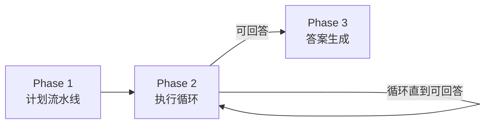

---

## 3.2 流程 1: 端到端主流程 (End-to-End Main Flow)

### 3.2.1 流程图

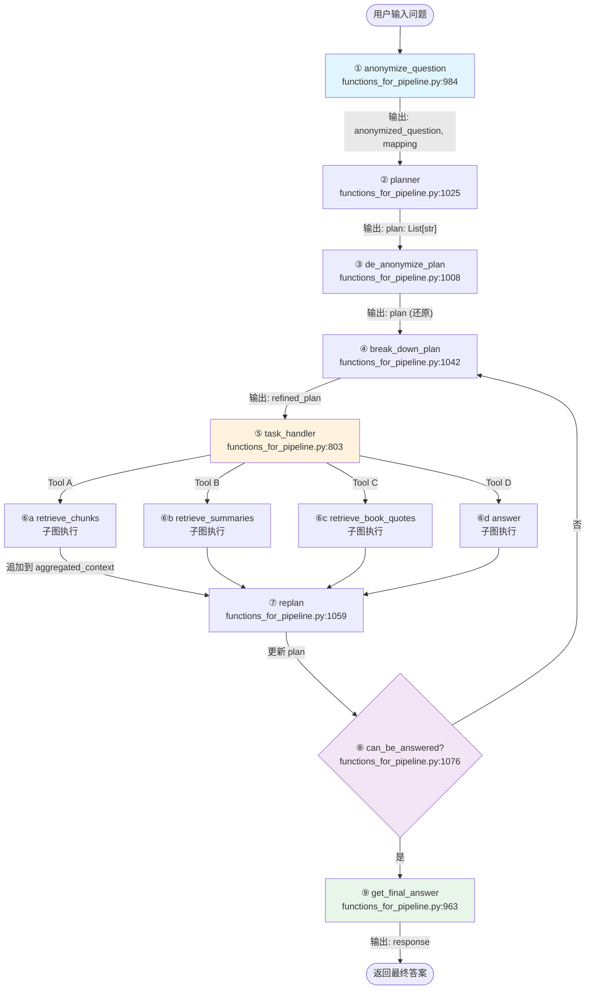

### 3.2.2 详细步骤说明

| 步骤 | 函数 | 文件位置 | 核心逻辑 | 异常处理 |
|------|------|----------|----------|----------|
| ① | `anonymize_queries()` | :984-1005 | 调用 `anonymize_question_chain`，将人名替换为 X/Y/Z | 无显式处理 |
| ② | `plan_step()` | :1025-1039 | 调用 `planner`，生成步骤化计划 | 无显式处理 |
| ③ | `deanonymize_queries()` | :1008-1022 | 调用 `de_anonymize_plan_chain`，还原变量 | 无显式处理 |
| ④ | `break_down_plan_step()` | :1042-1055 | 调用 `break_down_plan_chain`，细化任务 | 无显式处理 |
| ⑤ | `run_task_handler_chain()` | :803-850 | 调用 `task_handler_chain`，选择工具 | ValueError 如果工具无效 |
| ⑥a-d | `run_qualitative_*_workflow()` | :876-961 | 调用子图流式执行 | 无显式处理 |
| ⑦ | `replan_step()` | :1059-1073 | 调用 `replanner`，更新计划 | 无显式处理 |
| ⑧ | `can_be_answered()` | :1076-1101 | 调用 `can_be_answered_already_chain` | 无显式处理 |
| ⑨ | `run_qualtative_answer_workflow_for_final_answer()` | :963-981 | 调用回答子图 | 无显式处理 |

### 3.2.3 时序图

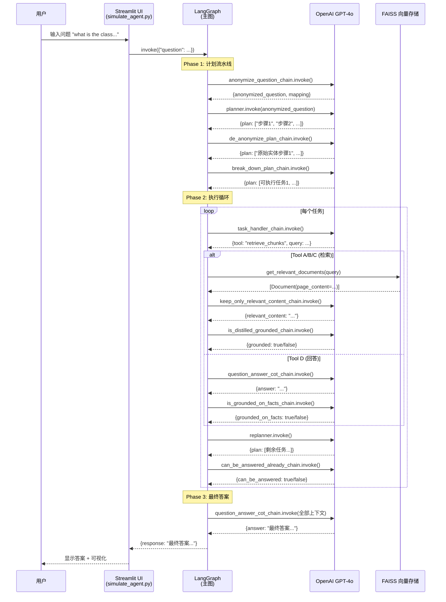

---

## 3.3 流程 2: 问题匿名化流程 (Question Anonymization)

### 3.3.1 流程图

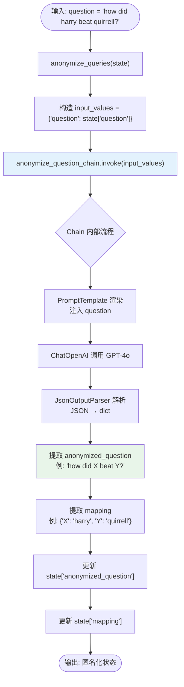

### 3.3.2 详细步骤说明

**步骤 1**: 函数入口 `anonymize_queries(state: PlanExecute)`

- **位置**: `functions_for_pipeline.py:984-1005`
- **输入**: `state["question"]` — 原始自然语言问题
- **输出**: 更新 `state["anonymized_question"]` 和 `state["mapping"]`

**步骤 2**: 调用 `anonymize_question_chain`

该 Chain 的构建（:713-744）：

```python
anonymize_question_chain = anonymize_question_prompt | anonymize_question_llm | anonymize_question_parser
```

- **Prompt**: 包含 2 个示例（"who is harry potter?" → "who is X?"）
- **LLM**: ChatOpenAI(temperature=0, model_name="gpt-4o")
- **Parser**: JsonOutputParser(pydantic_object=AnonymizeQuestion)

**步骤 3**: 输出结构

```python
class AnonymizeQuestion(BaseModel):
    anonymized_question: str  # "how did X beat Y?"
    mapping: dict             # {"X": "harry", "Y": "quirrell"}
    explanation: str          # 解释替换理由
```

### 3.3.3 设计 Rationale

> **为什么需要匿名化？**
>
> 1. **消除先验偏见**: GPT-4o 在预训练中"知道"哈利波特的故事。如果不匿名，LLM 可能基于参数知识而非检索数据制定计划
> 2. **通用性**: 匿名化后的计划更具通用性，可应用于不同领域的同名实体
> 3. **可验证性**: 可以明确区分"LLM 知道什么"和"数据说了什么"
>
> **潜在问题**:
> - 过度匿名化可能丢失语义（如 "who is the Chosen One?" → "who is the X?" 丢失了关键限定）
> - 实体识别错误可能导致错误替换

---

## 3.4 流程 3: 计划生成与细化流程 (Plan Generation & Refinement)

### 3.4.1 流程图

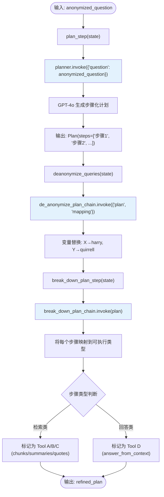

### 3.4.2 详细步骤说明

**计划生成 (planner)**:
- **位置**: `functions_for_pipeline.py:582-600`
- **Prompt 核心**: "come up with a simple step by step plan"
- **输出**: `Plan(steps=["Identify the villain", "Find who helped the villain", ...])`

**去匿名化 (de_anonymize_plan)**:
- **位置**: `functions_for_pipeline.py:747-766`
- **Prompt 核心**: "replace all the variables in the list of tasks with the mapped words"
- **特殊处理**: 转义引号和新行（"the format is json so escape quotes and new lines"）

**计划细化 (break_down_plan)**:
- **位置**: `functions_for_pipeline.py:603-626`
- **Prompt 核心**: 将每个步骤明确为四种工具之一
- **关键约束**: "every step has to be able to be executed by either i/ii/iii/iv"

### 3.4.3 示例流转

```
输入: "how did harry beat quirrell?"

匿名化后: "how did X beat Y?"  mapping: {"X": "harry", "Y": "quirrell"}

planner 输出:
1. Identify who X is
2. Identify who Y is
3. Find the confrontation between X and Y
4. Determine how X defeated Y

去匿名化后:
1. Identify who harry is
2. Identify who quirrell is
3. Find the confrontation between harry and quirrell
4. Determine how harry defeated quirrell

细化后:
1. [Tool A] Search for information about harry
2. [Tool A] Search for information about quirrell
3. [Tool A] Find confrontation details
4. [Tool D] Answer: how did harry defeat quirrell
```

---

## 3.5 流程 4: 任务路由流程 (Task Routing)

### 3.5.1 流程图

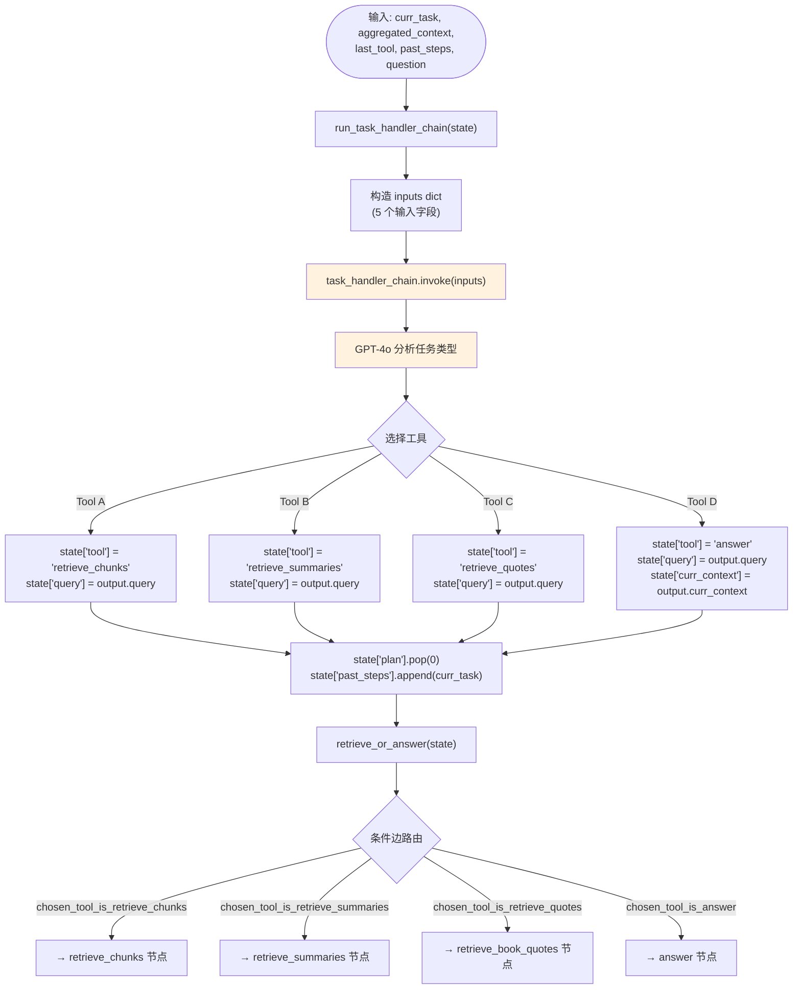

### 3.5.2 详细步骤说明

**关键代码** (`functions_for_pipeline.py:803-850`):

```python
def run_task_handler_chain(state: PlanExecute):
    state["curr_state"] = "task_handler"
    curr_task = state["plan"][0]  # 取第一个任务
    
    inputs = {
        "curr_task": curr_task,
        "aggregated_context": state["aggregated_context"],
        "last_tool": state["tool"],
        "past_steps": state["past_steps"],
        "question": state["question"]
    }
    
    output = task_handler_chain.invoke(inputs)
    
    state["past_steps"].append(curr_task)
    state["plan"].pop(0)  # 移除已处理任务
    
    # 根据工具类型更新状态
    if output.tool == "retrieve_chunks":
        state["query_to_retrieve_or_answer"] = output.query
        state["tool"] = "retrieve_chunks"
    # ... 其他工具类似
```

**路由逻辑** (`functions_for_pipeline.py:854-872`):

```python
def retrieve_or_answer(state: PlanExecute):
    if state["tool"] == "retrieve_chunks":
        return "chosen_tool_is_retrieve_chunks"
    # ... 其他工具
```

> **设计 Rationale**: 将路由逻辑拆分为两步（`run_task_handler_chain` + `retrieve_or_answer`）是因为：
> 1. **关注点分离**: 前者处理 LLM 决策，后者处理图路由
> 2. **可测试性**: 可以独立测试 LLM 决策和路由映射
> 3. **可扩展性**: 新增工具只需添加新的条件分支

---

## 3.6 流程 5: 检索子图流程 (Qualitative Retrieval Sub-graph)

### 3.6.1 流程图

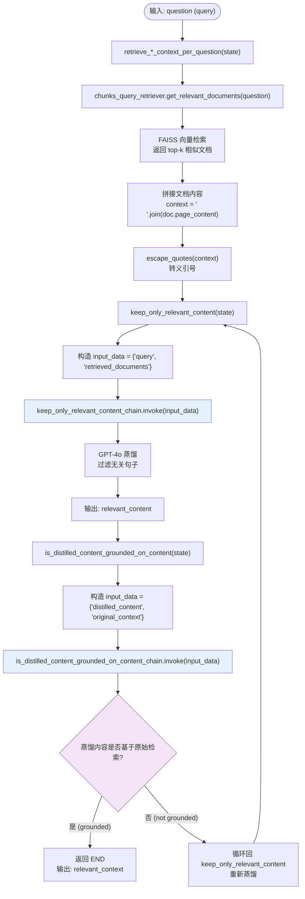

### 3.6.2 三种检索子图的差异

| 维度 | Chunks 子图 | Summaries 子图 | Quotes 子图 |
|------|-------------|----------------|-------------|
| **检索器** | `chunks_query_retriever` | `chapter_summaries_query_retriever` | `book_quotes_query_retriever` |
| **k 值** | 1 | 1 | 10 |
| **元数据** | 无 | chapter 编号 | 无 |
| **蒸馏** | 共享 `keep_only_relevant_content` | 同左 | 同左 |
| **验证** | 共享 `is_distilled_content_grounded_on_content` | 同左 | 同左 |
| **创建函数** | `:437-458` | `:461-482` | `:485-506` |

### 3.6.3 时序图

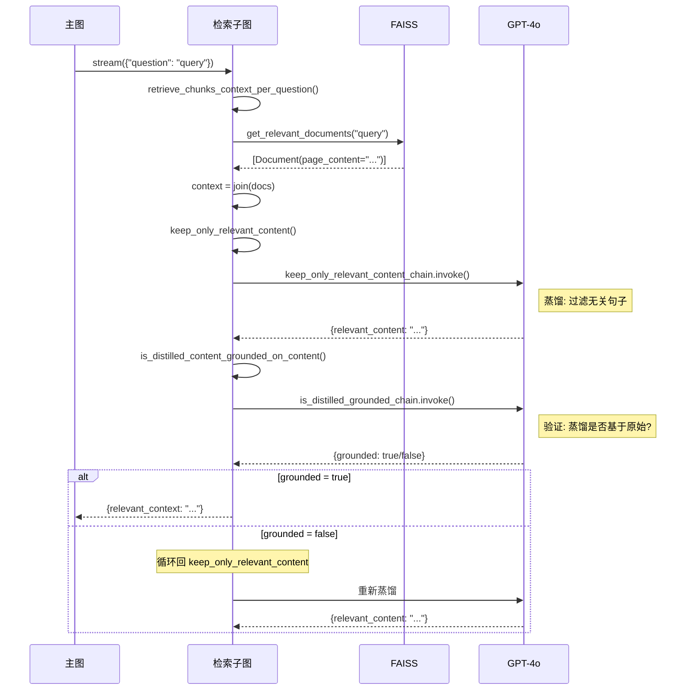

---

## 3.7 流程 6: 回答子图流程 (Answer Sub-graph)

### 3.7.1 流程图

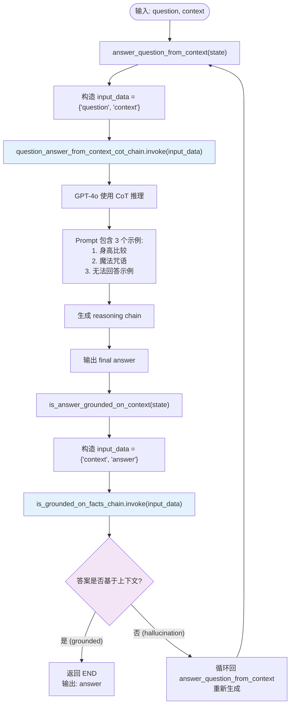

### 3.7.2 CoT Prompt 设计

回答子图的 Prompt 是项目中最精心设计的 Prompt 之一：

```
Examples of Chain-of-Thought Reasoning

Example 1: 身高比较 (简单推理)
Example 2: 魔法咒语 (多步推理)
Example 3: 无法回答示例 (拒绝推理 - 关键!)

Context: {context}
Question: {question}
```

> **设计 Rationale**: Example 3（无法回答示例）是**刻意设计**的负例：
> - 它教会模型：当上下文不足以回答时，应承认不知道
> - 这是防止幻觉的关键机制
> - 示例中明确说："there is no way to determine the reason"

### 3.7.3 幻觉检测机制

```python
def is_answer_grounded_on_context(state):
    context = state["context"]
    answer = state["answer"]
    result = is_grounded_on_facts_chain.invoke({"context": context, "answer": answer})
    grounded_on_facts = result.grounded_on_facts
    
    if not grounded_on_facts:
        return "hallucination"  # 触发循环
    else:
        return "grounded on context"  # 结束子图
```

---

## 3.8 流程 7: 重规划流程 (Re-plan)

### 3.8.1 流程图

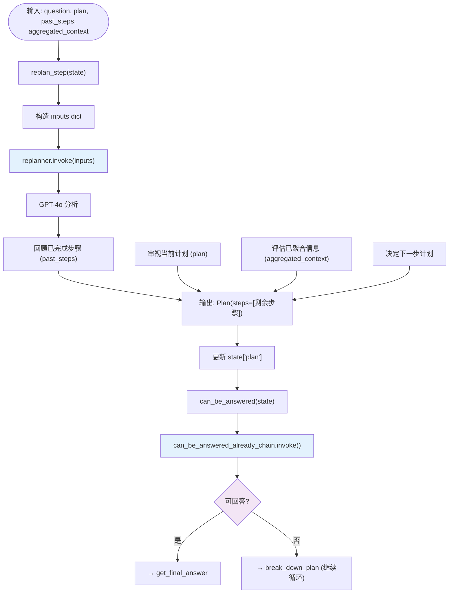

### 3.8.2 Replanner Prompt 设计

```python
replanner_prompt_template ="""
For the given objective, come up with a simple step by step plan...

assume that the answer was not found yet and you need to update the plan accordingly,
so the plan should never be empty.

Your objective was this: {question}
Your original plan was this: {plan}
You have currently done the follow steps: {past_steps}
You already have the following context: {aggregated_context}

Update your plan accordingly. If further steps are needed, fill out the plan with only those steps.
Do not return previously done steps as part of the plan.
"""
```

> **关键约束**: "assume that the answer was not found yet" + "the plan should never be empty"
> - 这强制 replanner 始终产出下一步计划
> - 即使上下文已经足够，也需要通过 `can_be_answered` 显式判断

---

## 3.9 流程 8: 数据预处理流程 (Data Preprocessing Pipeline)

### 3.9.1 流程图

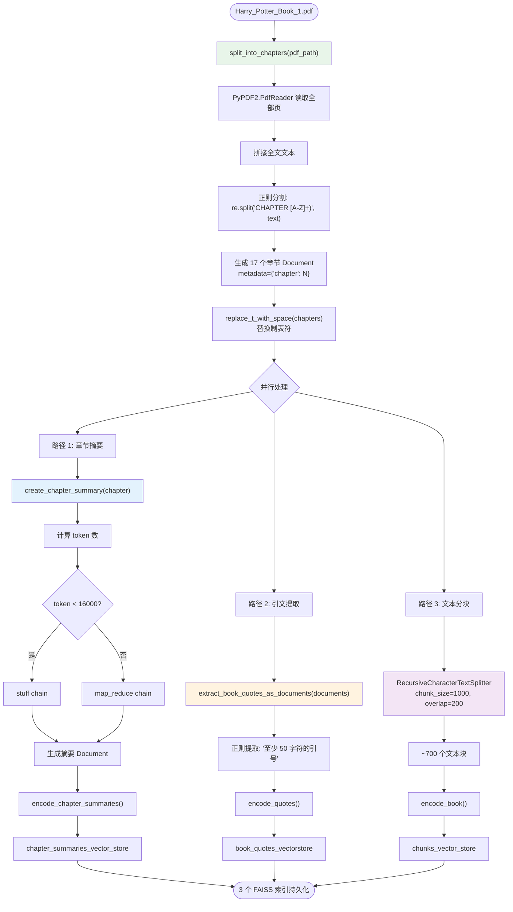

### 3.9.2 详细步骤说明

**章节分割** (`helper_functions.py:59-89`):
- 使用正则 `r'(CHAPTER\s[A-Z]+(?:\s[A-Z]+)*)'` 分割
- 生成 Document 对象，metadata 包含章节号

**章节摘要** (Notebook Cell 16):
- Token 计数决定使用 `stuff` 还是 `map_reduce`
- GPT-3.5-turbo 生成摘要（成本优化）

**引文提取** (`helper_functions.py:92-105`):
- 正则: `r'“(.{50,?)”'` 匹配中文引号内的长文本
- 过滤短引文（min_length=50）

---

## 3.10 流程 9: 评估流程 (Evaluation Pipeline)

### 3.10.1 流程图

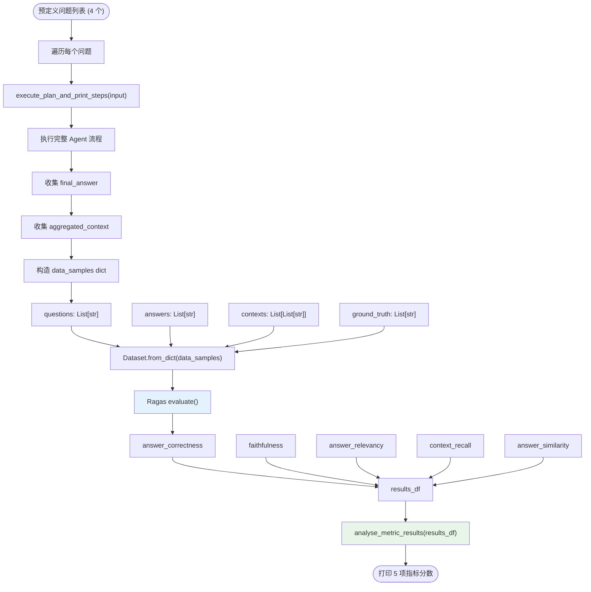

### 3.10.2 评估指标说明

| 指标 | 定义 | 计算方式 | 理想值 |
|------|------|----------|--------|
| **faithfulness** | 答案是否基于检索文档 | NLI 模型判断 | 1.0 |
| **answer_relevancy** | 答案与问题的相关性 | 嵌入相似度 | 1.0 |
| **context_precision** | 检索文档的相关比例 | 人工/模型标注 | 1.0 |
| **context_relevancy** | 检索文档与问题的相关性 | 句子级判断 | 1.0 |
| **answer_similarity** | 答案与 ground truth 的语义相似度 | 嵌入相似度 | 1.0 |
| **answer_correctness** | 答案的事实正确性 | 综合判断 | 1.0 |

---

## 3.11 流程 10: Streamlit 可视化流程

### 3.11.1 流程图

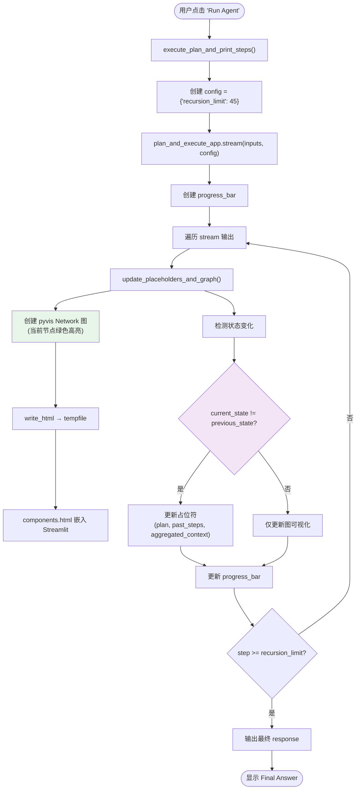

### 3.11.2 可视化组件架构

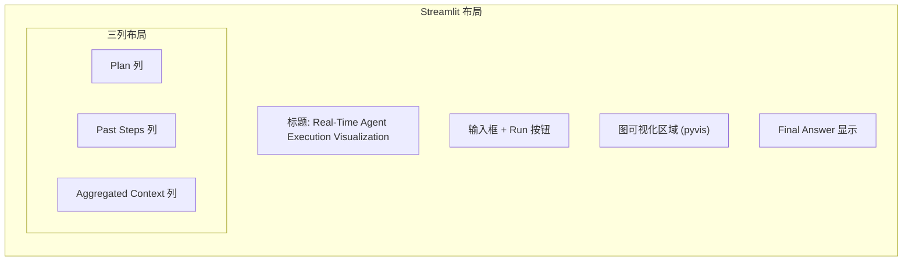

---

## 3.12 流程 11: 异常处理与边界条件

### 3.12.1 异常处理流程

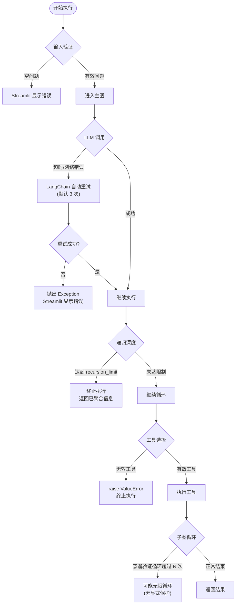

### 3.12.2 边界条件清单

| 边界条件 | 当前处理 | 风险 | 建议 |
|----------|----------|------|------|
| **空问题** | 无显式检查 | LLM 可能返回无效计划 | 增加输入校验 |
| **LLM 超时** | LangChain 自动重试 | 长时间等待 | 设置超时 + 降级 |
| **递归过深** | `recursion_limit=45` | 可能过早终止 | 动态调整限制 |
| **蒸馏循环** | 无显式限制 | 可能无限循环 | 增加最大循环次数 |
| **空检索结果** | 无显式检查 | 空上下文导致 LLM 幻觉 | 增加空结果检测 |
| **上下文溢出** | 无显式检查 | 超出 LLM 上下文窗口 | 增加上下文截断 |
| **无效工具** | raise ValueError | 执行终止 | 默认回退到 Tool A |

---

## 3.13 本章小结

本章详细描述了系统的 **11 个核心业务流程**：

1. **端到端主流程**: 完整的 Phase 1→2→3 流程
2. **问题匿名化**: 消除 LLM 先验偏见
3. **计划生成与细化**: 从问题到可执行任务
4. **任务路由**: 动态选择检索工具或回答
5. **检索子图**: 检索-蒸馏-验证闭环
6. **回答子图**: CoT 推理 + 幻觉检测
7. **重规划**: 动态更新执行计划
8. **数据预处理**: PDF → 3 路向量存储
9. **评估流程**: Ragas 多维度质量评估
10. **Streamlit 可视化**: 实时图状态展示
11. **异常处理**: 边界条件与容错

**下一章**: [04-module-structure.md](./04-module-structure.md) — 深入分析模块结构与依赖关系。

---

☕️ 制作不易，请我喝咖啡☕️关注我➕