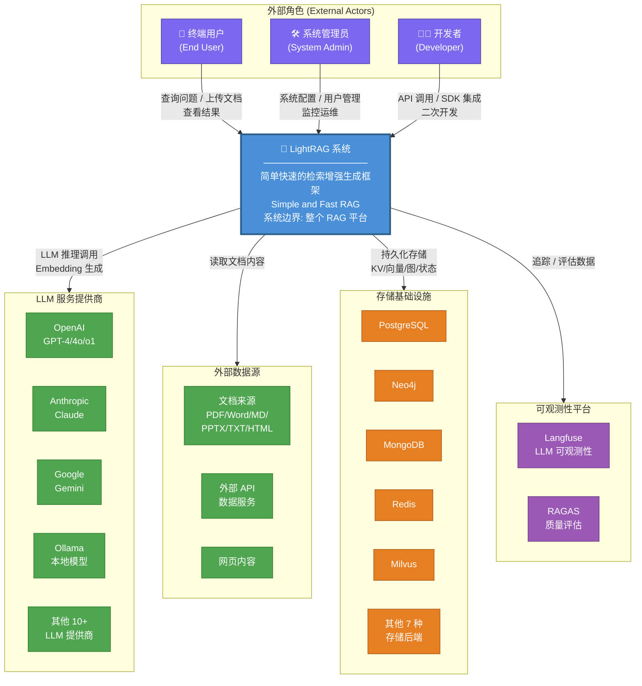
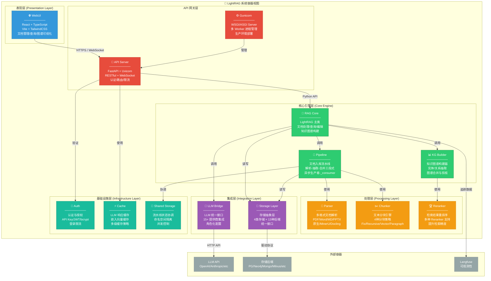
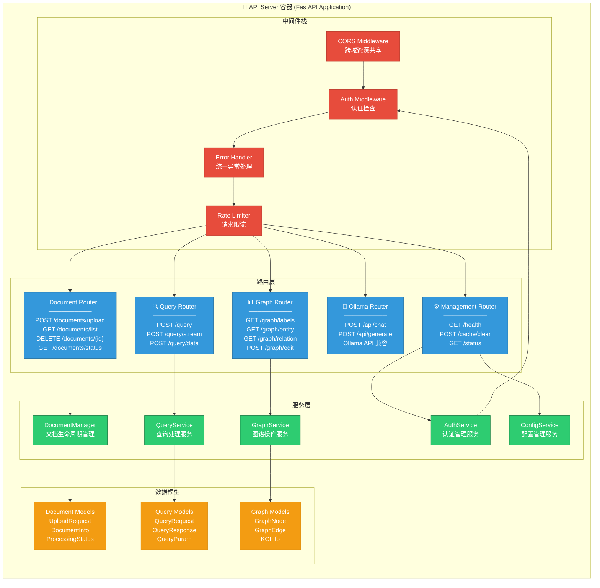
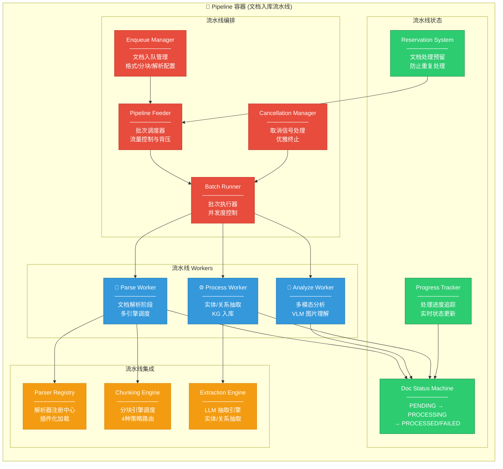
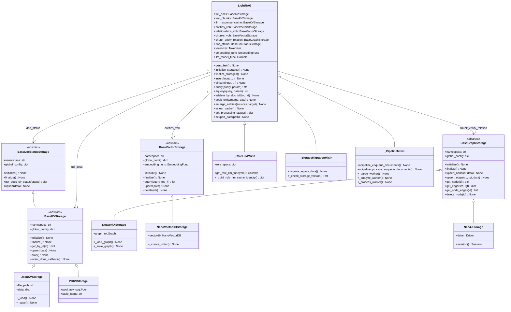

# 第 02 章 C4 架构模型

> **方法论**: C4 Model for Software Architecture
> **作者**: Simon Brown
> **范围**: LightRAG 系统全架构

---

## 2.1 C4 模型概述

### 2.1.1 什么是 C4 模型

C4 模型是由 Simon Brown 提出的软件架构可视化方法，通过四个抽象层级（Context、Container、Component、Code）描述软件系统的架构：

| 层级 | 名称 | 关注点 | 受众 |
|------|------|--------|------|
| **L0** | System Context | 系统与外部实体的关系 | 所有人（含非技术人员） |
| **L1** | Container | 系统内部的主要可执行单元 | 开发 + 运维 |
| **L2** | Component | 容器内部的组件结构与接口 | 开发人员 |
| **L3** | Code | 组件的实现细节（类/接口） | 开发人员 |

### 2.1.2 为什么选择 C4 模型

对于 LightRAG 这样的复杂 RAG 系统，C4 模型具有以下优势：

1. **多层次抽象**: 从高层业务语境到底层代码实现，逐层深入
2. **受众友好**: 不同角色关注不同层级，避免信息过载
3. **可视化强**: 配合 Mermaid 图表，架构一目了然
4. **边界清晰**: 明确系统边界、容器边界、组件边界

### 2.1.3 本文档的 C4 实施

本文档使用以下图表类型对应 C4 各层级：

| C4 层级 | 使用图表类型 | Mermaid 语法 |
|---------|-------------|--------------|
| Context | System Context Diagram | graph TD |
| Container | Container Diagram | graph TD + subgraph |
| Component | Component Diagram | graph TD + subgraph |
| Code | Class Diagram | classDiagram |

---

## 2.2 Context 图（系统上下文图）

### 2.2.1 图表



### 2.2.2 详细解释

#### 系统边界定义

**LightRAG 系统**（蓝色框）是本次架构分析的核心系统边界。系统边界内部包含：

- RAG 核心引擎（文档处理、知识图谱构建、检索增强生成）
- API 服务器（FastAPI 应用）
- WebUI 前端界面
- 存储层抽象与实现
- LLM 集成层
- 文档解析层

系统边界外部是所有与 LightRAG 交互但不属于 LightRAG 的实体。

#### 外部角色分析

**1. 终端用户（End User）**:
- **交互方式**: 通过 WebUI 或 API 上传文档、提交查询、查看结果
- **核心诉求**: 快速获取基于知识库的准确回答
- **使用频率**: 高频（日常问答）
- **技术能力**: 非技术用户为主

**2. 系统管理员（System Admin）**:
- **交互方式**: 通过管理 API、配置文件、Docker/K8s 进行管理
- **核心诉求**: 系统稳定运行、用户权限管理、存储配置
- **使用频率**: 中频（运维操作）
- **技术能力**: 具备运维技能

**3. 开发者（Developer）**:
- **交互方式**: 通过 Python SDK、REST API、源码集成
- **核心诉求**: 二次开发、集成到自有系统、扩展功能
- **使用频率**: 中频（开发阶段高频）
- **技术能力**: 具备编程技能

#### 外部系统分析

**LLM 服务提供商**:
LightRAG 是 LLM 调用方，不生产 LLM 能力。系统设计为 LLM Provider 可插拔，支持 15+ 提供商。主要调用类型包括：
- **Chat Completion**: 实体抽取、关系抽取、查询回答
- **Embedding**: 文本向量化
- **Vision**: 多模态理解（图片分析）

**存储基础设施**:
LightRAG 不内置存储引擎，而是依赖外部存储系统。支持 13 种存储后端，涵盖：
- 关系型数据库（PostgreSQL）
- 图数据库（Neo4j, Memgraph）
- 文档数据库（MongoDB）
- 键值存储（Redis）
- 向量数据库（Milvus, Qdrant, Faiss）
- 搜索引擎（OpenSearch）
- 文件系统（JSON, NetworkX）

**可观测性平台**:
- **Langfuse**: LLM 调用追踪、Token 消耗监控、延迟分析
- **RAGAS**: RAG 质量评估（忠实度、相关性、上下文精确率等）

#### 设计 Rationale

Context 图的设计决策基于以下考量：

1. **明确责任边界**: 清晰区分 LightRAG 自身能力与依赖的外部服务
2. **集成点识别**: 标出所有需要集成的外部系统，便于部署规划
3. **多租户考虑**: 不同用户角色有不同的访问权限和操作范围
4. **可替换性**: 外部 LLM 和存储均可替换，不影响核心系统

---

## 2.3 Container 图（容器视图）

### 2.3.1 图表



### 2.3.2 详细解释

#### 容器定义与职责

**容器**在 C4 模型中指可独立部署和可执行单元。LightRAG 的容器按职责分为六层：

#### 表现层（Presentation Layer）

**WebUI 容器**:
- **技术栈**: React 18 + TypeScript + Vite + TailwindCSS
- **职责**: 提供图形化用户界面
- **核心功能**:
  - 文档上传与管理
  - 查询输入与结果展示
  - 知识图谱可视化
  - 系统状态监控
- **部署方式**: 构建为静态文件，由 FastAPI 内置 StaticFiles 托管
- **关键文件**: `lightrag_webui/src/`

#### API 网关层

**API Server 容器**:
- **技术栈**: FastAPI + Uvicorn
- **职责**: 提供 RESTful API 和 WebSocket 接口
- **核心功能**:
  - 路由分发（document / query / graph / ollama）
  - 请求验证（Pydantic）
  - 认证中间件
  - 错误处理
  - OpenAPI 文档生成
- **关键文件**: `lightrag/api/lightrag_server.py`

**Gunicorn 容器**:
- **职责**: 生产环境多进程管理
- **配置**: `lightrag/api/gunicorn_config.py`
- **与 API Server 关系**: Gunicorn 作为 ASGI 容器运行 FastAPI 应用

#### 核心引擎层

**RAG Core 容器**:
- **职责**: LightRAG 主类，系统的"大脑"
- **核心能力**:
  - 文档插入（insert / ainsert）
  - 查询处理（query / aquery）
  - 知识图谱编辑（edit_entity / edit_relation / merge_entities）
  - 文档删除（adelete_by_doc_id）
  - 缓存管理（aclear_cache）
- **关键文件**: `lightrag/lightrag.py`（5,919 行）

**Pipeline 容器**:
- **职责**: 文档入库流水线管理
- **核心能力**:
  - 文档入队（apipeline_enqueue_documents）
  - 流水线调度（apipeline_process_enqueue_documents）
  - 解析-抽取-合并三段式处理
  - 并发控制与取消
- **关键文件**: `lightrag/pipeline.py`（5,617 行）

**KG Builder 容器**:
- **职责**: 知识图谱构建
- **核心能力**:
  - 实体/关系抽取（extract_entities）
  - 图谱合并（merge_nodes_and_edges）
  - 图谱剪枝与摘要
- **关键文件**: `lightrag/operate.py`（6,255 行）

#### 处理层

**Parser 容器**:
- **职责**: 多格式文档解析
- **支持格式**: PDF, DOCX, PPTX, XLSX, MD, HTML, TXT
- **解析引擎**: Native（内置）/ MinerU / Docling / 第三方
- **关键文件**: `lightrag/parser/`

**Chunker 容器**:
- **职责**: 文本分块
- **策略**: Fix（固定大小）/ Recursive（递归字符）/ Vector（向量语义）/ Paragraph（段落语义）
- **关键文件**: `lightrag/chunker/`

**Reranker 容器**:
- **职责**: 检索结果重排序
- **实现**: 抽象接口 + 多种 Reranker 实现
- **关键文件**: `lightrag/rerank.py`

#### 集成层

**LLM Bridge 容器**:
- **职责**: LLM 提供商统一接口
- **支持**: 15+ 提供商（OpenAI, Anthropic, Gemini, Ollama 等）
- **角色化**: 4 种角色独立配置（EXTRACT / QUERY / KEYWORDS / VLM）
- **关键文件**: `lightrag/llm/`

**Storage Layer 容器**:
- **职责**: 存储后端抽象与实现
- **4 类存储**: KV / Vector / Graph / DocStatus
- **13 种后端**: JSON, PostgreSQL, Neo4j, MongoDB, Redis, Milvus, Qdrant, Faiss, OpenSearch, Memgraph, NetworkX, NanoVectorDB
- **关键文件**: `lightrag/kg/`

#### 基础设施层

**Auth 容器**:
- **职责**: 认证与授权
- **机制**: API Key / JWT / bcrypt 密码哈希
- **关键文件**: `lightrag/api/auth.py`

**Cache Manager 容器**:
- **职责**: LLM 响应缓存
- **策略**: 基于参数哈希的精确匹配缓存
- **关键文件**: `lightrag/utils.py`（handle_cache / save_to_cache）

**Shared Storage 容器**:
- **职责**: 流水线状态协调
- **能力**: 命名空间隔离、并发控制、Pipeline 预留机制
- **关键文件**: `lightrag/kg/shared_storage.py`

#### 设计 Rationale

1. **分层解耦**: 每层只与相邻层通信，降低耦合
2. **单一职责**: 每个容器专注一个功能领域
3. **可独立扩展**: 各层可独立部署和扩展（如 API Server 多实例）
4. **技术异构**: 不同层可使用不同技术栈（Python 后端 + React 前端）

---

## 2.4 Component 图（组件视图）

### 2.4.1 API Server 组件图



### 2.4.2 RAG Core 组件图

```mermaid
graph TB
    subgraph RAGCore["🧠 RAG Core 容器 (LightRAG 主类)"]
        direction TB

        subgraph CoreComponents["核心组件"]
            MainClass["LightRAG<br/>──────────<br/>系统主入口<br/>协调所有子系统<br/>5,919 行代码"]
            QueryParam["QueryParam<br/>──────────<br/>查询参数配置<br/>6种模式<br/>Token控制"]
            RoleConfig["RoleLLMConfig<br/>──────────<br/>角色化LLM配置<br/>4种角色独立配置"]
        end

        subgraph StorageComponents["存储管理"]
            KVStorage["KV Storage<br/>──────────<br/>键值存储接口<br/>5种后端实现"]
            VectorStorage["Vector Storage<br/>──────────<br/>向量存储接口<br/>7种后端实现"]
            GraphStorage["Graph Storage<br/>──────────<br/>图存储接口<br/>6种后端实现"]
            DocStatusStorage["DocStatus Storage<br/>──────────<br/>文档状态接口<br/>5种后端实现"]
            StorageFactory["Storage Factory<br/>──────────<br/>存储后端工厂<br/>动态加载实现"]
        end

        subgraph OperationComponents["操作组件"]
            InsertOps["Insert Operations<br/>──────────<br/>文档插入/分块<br/>自定义KG插入"]
            QueryOps["Query Operations<br/>──────────<br/>多模式查询<br/>关键词抽取"]
            EditOps["Edit Operations<br/>──────────<br/>实体/关系编辑<br/>合并/创建/删除"]
            DeleteOps["Delete Operations<br/>──────────<br/>文档删除<br/>实体/关系删除"]
            ExportOps["Export Operations<br/>──────────<br/>数据导出<br/>图谱导出"]
        end

        subgraph LLMComponents["LLM 集成"]
            LLMBinding["LLM Binding<br/>──────────<br/>LLM绑定选项<br/>异步调用封装"]
            EmbeddingFunc["EmbeddingFunc<br/>──────────<br/>嵌入函数封装<br/>维度校验"]
            PromptMgr["Prompt Manager<br/>──────────<br/>提示词模板<br/>多语言支持"]
            CacheHandler["Cache Handler<br/>──────────<br/>LLM响应缓存<br/>缓存命中统计"]
        end
    end

    MainClass --> QueryParam
    MainClass --> RoleConfig
    MainClass --> StorageFactory
    MainClass --> InsertOps
    MainClass --> QueryOps
    MainClass --> EditOps
    MainClass --> DeleteOps
    MainClass --> ExportOps

    StorageFactory --> KVStorage
    StorageFactory --> VectorStorage
    StorageFactory --> GraphStorage
    StorageFactory --> DocStatusStorage

    InsertOps --> KVStorage
    QueryOps --> VectorStorage
    QueryOps --> GraphStorage
    EditOps --> GraphStorage
    DeleteOps --> KVStorage
    DeleteOps --> VectorStorage
    DeleteOps --> GraphStorage

    InsertOps --> LLMBinding
    QueryOps --> LLMBinding
    EditOps --> LLMBinding
    InsertOps --> EmbeddingFunc
    QueryOps --> EmbeddingFunc
    QueryOps --> PromptMgr
    QueryOps --> CacheHandler

    classDef core fill:#E74C3C,stroke:#C0392B,color:#fff
    classDef storage fill:#3498DB,stroke:#2471A3,color:#fff
    classDef operation fill:#2ECC71,stroke:#1E8449,color:#fff
    classDef llm fill:#9B59B6,stroke:#6C3483,color:#fff

    class MainClass,QueryParam,RoleConfig core
    class KVStorage,VectorStorage,GraphStorage,DocStatusStorage,StorageFactory storage
    class InsertOps,QueryOps,EditOps,DeleteOps,ExportOps operation
    class LLMBinding,EmbeddingFunc,PromptMgr,CacheHandler llm
```



### 2.4.3 Pipeline 组件图



### 2.4.4 详细解释

#### API Server 组件设计

**中间件栈**采用洋葱模型（Onion Model），请求依次经过：

1. **CORS Middleware**: 处理跨域请求，支持可配置的 allowed_origins
2. **Auth Middleware**: 验证 API Key 或 JWT Token
3. **Error Handler**: 统一捕获异常并返回标准错误格式
4. **Rate Limiter**: 对登录等敏感接口进行速率限制

**路由层**按业务域划分为 5 个 Router：

| Router | 前缀 | 核心端点数 | 职责 |
|--------|------|-----------|------|
| Document Router | /documents | 10+ | 文档上传/查询/删除/状态 |
| Query Router | /query | 5+ | 查询/流式查询/数据查询 |
| Graph Router | /graph | 8+ | 图谱查询/编辑/导出 |
| Ollama Router | /api | 4+ | Ollama API 兼容 |
| Management Router | / | 5+ | 健康检查/缓存/配置 |

**服务层**封装业务逻辑，与路由层解耦：

- **DocumentManager**: 管理文档完整生命周期（上传→解析→抽取→入库→删除）
- **QueryService**: 处理查询请求，协调检索与 LLM 生成
- **GraphService**: 提供图谱查询和编辑能力
- **AuthService**: 处理用户认证、Token 生成与验证
- **ConfigService**: 管理系统配置和运行时参数

#### RAG Core 组件设计

**LightRAG 主类**是整个系统的核心，通过多继承组合多个 Mixin：

```python
class LightRAG(_RoleLLMMixin, _StorageMigrationMixin, _PipelineMixin):
    ...
```

- **_RoleLLMMixin**: 提供角色化 LLM 配置能力
- **_StorageMigrationMixin**: 提供存储数据迁移能力
- **_PipelineMixin**: 提供文档入库流水线能力

**存储管理**采用抽象工厂模式：

1. `StorageFactory` 根据配置名称创建具体存储实例
2. 四大存储类型各自独立初始化和关闭
3. 支持不同存储类型的任意组合（如 KV=PostgreSQL + Graph=Neo4j + Vector=Milvus）

**操作组件**按功能域划分：

- **InsertOps**: 处理文档插入、自定义 KG 插入、自定义块插入
- **QueryOps**: 处理 6 种模式的查询、关键词抽取、LLM 调用
- **EditOps**: 处理实体/关系的编辑、创建、合并
- **DeleteOps**: 处理文档/实体/关系的删除，级联清理
- **ExportOps**: 处理图谱数据导出

#### Pipeline 组件设计

**流水线编排**采用生产者-消费者模式：

1. **Enqueue Manager**: 接收文档并入队，配置解析引擎和分块策略
2. **Pipeline Feeder**: 按批次从队列取文档，控制流量
3. **Batch Runner**: 并发执行一批文档的处理
4. **Cancellation Manager**: 监听取消信号，优雅终止处理

**流水线 Workers** 是三段式处理的核心：

1. **Parse Worker**: 将原始文档解析为结构化文本块
2. **Analyze Worker**: 对多模态内容（图片）进行 VLM 分析
3. **Process Worker**: 从文本块中抽取实体/关系，构建知识图谱

**流水线状态**管理文档处理的生命周期：

```
PENDING → PARSING → ANALYZING → PROCESSING → PROCESSED
                          ↓
                       FAILED
```

#### 设计 Rationale

1. **组件化**: 每个组件职责单一，便于独立开发和测试
2. **接口隔离**: 组件通过接口通信，实现可替换
3. **并发安全**: Pipeline 通过信号量和预留机制保证并发安全
4. **可观测性**: 每个组件都有状态追踪和日志记录

---

## 2.5 Code 图（代码/类视图）

### 2.5.1 核心类图



### 2.5.2 存储后端类图

```mermaid
classDiagram
    class StorageFactory {
        <<static>>
        +get_storage_class(name) Callable
        +verify_storage_implementation(type, name) None
    }

    class StorageRegistry {
        <<constant>>
        +STORAGE_IMPLEMENTATIONS: dict
        +STORAGE_ENV_REQUIREMENTS: dict
        +STORAGES: dict
    }

    class BaseKVStorage {
        <<abstract>>
        +get_by_id(id) dict
        +upsert(data) None
        +drop() None
    }

    class BaseVectorStorage {
        <<abstract>>
        +query(query, top_k) list
        +upsert(data) None
    }

    class BaseGraphStorage {
        <<abstract>>
        +upsert_node(id, data) None
        +upsert_edge(src, tgt, data) None
        +get_node(id) dict
        +get_edge(src, tgt) dict
    }

    class BaseDocStatusStorage {
        <<abstract>>
        +get_docs_by_status(status) dict
        +upsert(data) None
    }

    %% KV 实现
    class JsonKVStorage {
        +file_path: str
        +data: dict
    }
    class RedisKVStorage {
        +redis: Redis
    }
    class PGKVStorage {
        +pool: asyncpg.Pool
    }
    class MongoKVStorage {
        +collection: Collection
    }
    class OpenSearchKVStorage {
        +client: OpenSearch
    }

    %% Vector 实现
    class NanoVectorDBStorage {
        +vectordb: NanoVectorDB
    }
    class MilvusVectorDBStorage {
        +collection: Collection
    }
    class PGVectorStorage {
        +pool: asyncpg.Pool
    }
    class FaissVectorDBStorage {
        +index: faiss.Index
    }
    class QdrantVectorDBStorage {
        +client: QdrantClient
    }
    class MongoVectorDBStorage {
        +collection: Collection
    }
    class OpenSearchVectorDBStorage {
        +client: OpenSearch
    }

    %% Graph 实现
    class NetworkXStorage {
        +graph: nx.Graph
    }
    class Neo4JStorage {
        +driver: Driver
    }
    class PGGraphStorage {
        +pool: asyncpg.Pool
    }
    class MongoGraphStorage {
        +collection: Collection
    }
    class MemgraphStorage {
        +driver: Driver
    }
    class OpenSearchGraphStorage {
        +client: OpenSearch
    }

    %% 继承关系
    BaseKVStorage <|-- JsonKVStorage
    BaseKVStorage <|-- RedisKVStorage
    BaseKVStorage <|-- PGKVStorage
    BaseKVStorage <|-- MongoKVStorage
    BaseKVStorage <|-- OpenSearchKVStorage

    BaseVectorStorage <|-- NanoVectorDBStorage
    BaseVectorStorage <|-- MilvusVectorDBStorage
    BaseVectorStorage <|-- PGVectorStorage
    BaseVectorStorage <|-- FaissVectorDBStorage
    BaseVectorStorage <|-- QdrantVectorDBStorage
    BaseVectorStorage <|-- MongoVectorDBStorage
    BaseVectorStorage <|-- OpenSearchVectorDBStorage

    BaseGraphStorage <|-- NetworkXStorage
    BaseGraphStorage <|-- Neo4JStorage
    BaseGraphStorage <|-- PGGraphStorage
    BaseGraphStorage <|-- MongoGraphStorage
    BaseGraphStorage <|-- MemgraphStorage
    BaseGraphStorage <|-- OpenSearchGraphStorage

    BaseDocStatusStorage <|-- BaseKVStorage

    StorageFactory ..> BaseKVStorage : creates
    StorageFactory ..> BaseVectorStorage : creates
    StorageFactory ..> BaseGraphStorage : creates
    StorageFactory ..> BaseDocStatusStorage : creates
```



### 2.5.3 详细解释

#### 抽象基类设计

LightRAG 的存储抽象层基于**模板方法模式**（Template Method Pattern）：

**BaseKVStorage**:
- 定义了键值存储的标准接口
- 所有 KV 实现必须提供 `get_by_id` 和 `upsert`
- 可选方法：`index_done_callback`（批量写入回调）、`drop`（清空数据）

**BaseVectorStorage**:
- 定义了向量存储的标准接口
- 核心方法：`query`（相似度搜索）、`upsert`（向量插入）
- 包含 `embedding_func` 属性，用于维度校验

**BaseGraphStorage**:
- 定义了图存储的标准接口
- 核心方法：`upsert_node`、`upsert_edge`、`get_node`、`get_edge`
- 支持有向图操作

**BaseDocStatusStorage**:
- 定义了文档状态存储的标准接口
- 核心方法：`get_docs_by_status`（按状态查询）、`upsert`（状态更新）
- 继承自 BaseKVStorage，复用键值操作

#### LightRAG 主类设计

**LightRAG** 是整个系统的门面（Facade），通过组合模式聚合所有子系统：

```python
@dataclass
class LightRAG(_RoleLLMMixin, _StorageMigrationMixin, _PipelineMixin):
    # 工作目录与配置
    working_dir: str
    workspace: str = ""
    
    # 存储实例（运行时注入）
    kv_storage: str = "JsonKVStorage"
    vector_storage: str = "NanoVectorDBStorage"
    graph_storage: str = "NetworkXStorage"
    doc_status_storage: str = "JsonDocStatusStorage"
    
    # LLM 配置
    llm_model_func: Callable = field(default_factory=...)
    embedding_func: EmbeddingFunc = field(default_factory=...)
    
    # 存储实例（初始化后填充）
    full_docs: BaseKVStorage = None
    text_chunks: BaseKVStorage = None
    entities_vdb: BaseVectorStorage = None
    chunk_entity_relation: BaseGraphStorage = None
    doc_status: BaseDocStatusStorage = None
```

**关键设计决策**:

1. **Dataclass 装饰器**: 自动生成 `__init__`、`__repr__` 等方法
2. **InitVar 模式**: 使用 `InitVar` 处理初始化参数（如 `addon_params`）
3. **__post_init__**: 在 dataclass 初始化后执行额外配置
4. **Mixin 组合**: 通过多继承组合横切关注点

#### 存储后端实现分析

**JSON 存储（开发/原型）**:
- 实现：`JsonKVStorage`、`JsonDocStatusStorage`
- 存储方式：JSON 文件
- 优点：零配置、易于调试
- 缺点：性能差、不支持并发写入
- 适用：开发环境、小规模数据

**PostgreSQL 存储（生产推荐）**:
- 实现：`PGKVStorage`、`PGVectorStorage`、`PGGraphStorage`、`PGDocStatusStorage`
- 存储方式：PostgreSQL 表 + pgvector 扩展
- 优点：单一数据库、ACID 事务、成熟稳定
- 适用：生产环境、中等规模

**Neo4j 存储（图分析）**:
- 实现：`Neo4JStorage`
- 存储方式：Neo4j 图数据库
- 优点：原生图存储、Cypher 查询、图算法
- 适用：复杂图分析、大规模图谱

**Milvus 存储（向量专用）**:
- 实现：`MilvusVectorDBStorage`
- 存储方式：Milvus 向量数据库
- 优点：高性能向量检索、分布式、GPU 加速
- 适用：大规模向量检索

#### 设计 Rationale

1. **接口与实现分离**: 抽象基类定义接口，具体实现独立演化
2. **里氏替换原则**: 任何存储实现都可替换，不影响客户端代码
3. **依赖倒置原则**: 高层模块（LightRAG）依赖抽象，不依赖具体实现
4. **开闭原则**: 新增存储后端只需实现抽象接口，无需修改现有代码

---

## 2.6 架构边界与交互协议

### 2.6.1 边界定义

| 边界 | 上游 | 下游 | 协议 |
|------|------|------|------|
| **用户-LightRAG** | 终端用户 | API Server | HTTPS / WebSocket |
| **API Server-Core** | API Server | RAG Core | Python 函数调用 |
| **Core-Storage** | RAG Core | 存储后端 | 各存储驱动协议 |
| **Core-LLM** | RAG Core | LLM API | HTTPS (OpenAI 兼容) |
| **Pipeline-Storage** | Pipeline | 存储后端 | 各存储驱动协议 |

### 2.6.2 交互协议

| 交互 | 协议 | 数据格式 | 认证 |
|------|------|----------|------|
| **REST API** | HTTPS | JSON | API Key / JWT |
| **WebSocket** | WSS | JSON (SSE) | API Key |
| **LLM 调用** | HTTPS | JSON (OpenAI API) | API Key |
| **PostgreSQL** | TCP (asyncpg) | 二进制 | 用户名/密码 |
| **Neo4j** | Bolt | 二进制 | 用户名/密码 |
| **MongoDB** | TCP (pymongo) | BSON | 连接字符串 |
| **Redis** | TCP | RESP | 密码 |
| **Milvus** | gRPC/HTTP | Protocol Buffers | 用户名/密码 |

---

## 2.7 本章小结

本章使用 C4 模型对 LightRAG 架构进行了四层深入分析：

1. **Context 图**: 明确了 LightRAG 与外部角色（用户/管理员/开发者）和外部系统（LLM/存储/可观测性）的关系
2. **Container 图**: 将系统分解为 6 层 12 个容器，明确了各容器的职责和技术栈
3. **Component 图**: 深入 API Server、RAG Core、Pipeline 三个核心容器，分析了内部组件结构
4. **Code 图**: 展示了核心类（LightRAG、存储抽象基类、存储实现类）的静态结构

**关键架构特征总结**:

- **分层解耦**: 六层架构，每层职责清晰
- **存储可插拔**: 4 类存储 × 13 种后端，任意组合
- **异步优先**: 全链路 AsyncIO
- **Mixin 组合**: 通过多继承实现关注点分离
- **插件化**: Parser、Chunker、Reranker 均可插拔

下一章将深入分析系统的核心业务流程和时序。

---

> **下一章**: [03-系统流程与时序图.md](./03-系统流程与时序图.md)

---

☕️ 制作不易，请我喝咖啡☕️关注我➕