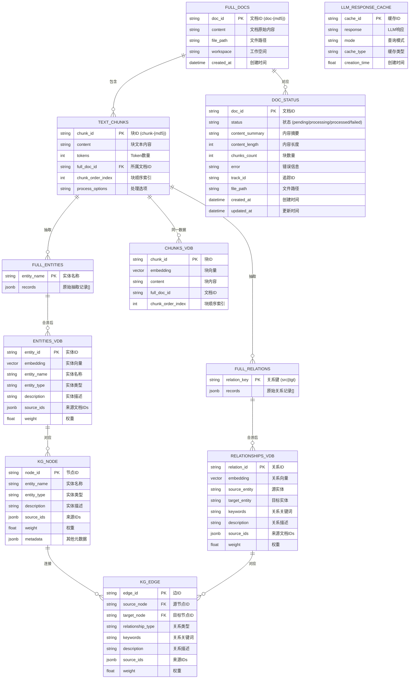
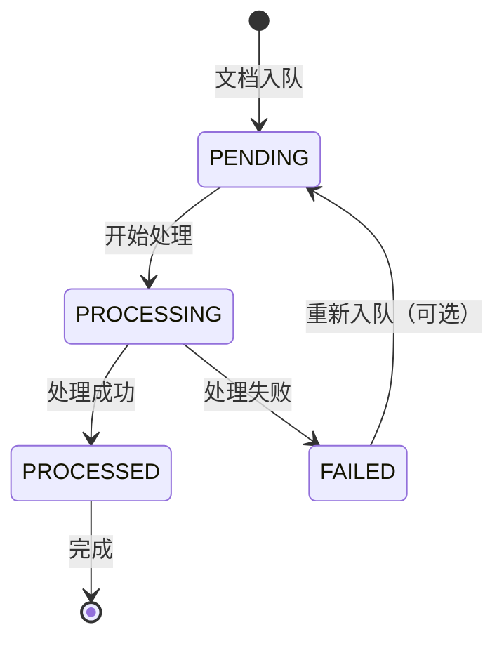
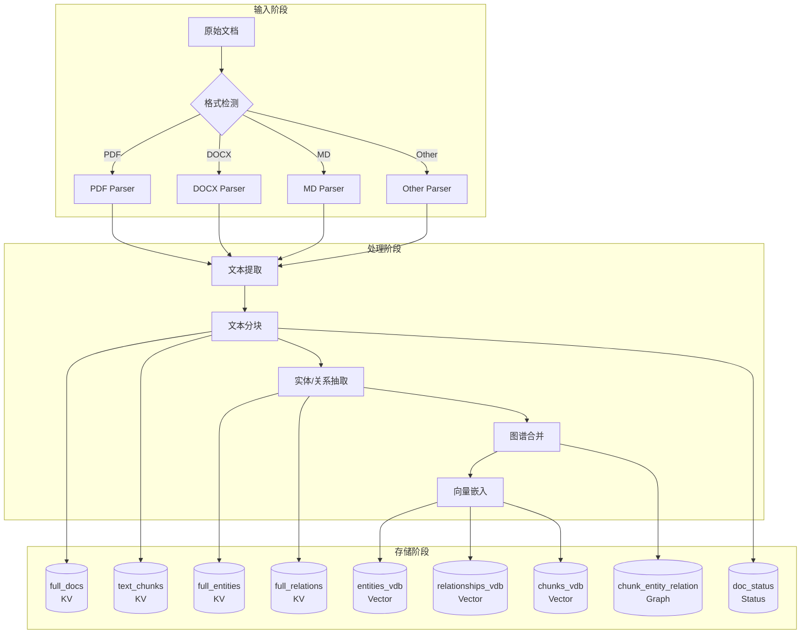
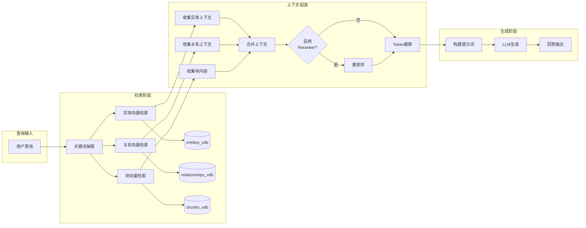

# 第 07 章 数据模型与数据库设计

> **内容**: ER 图、存储后端表结构、缓存策略、数据流向
> **范围**: 全 13 种存储后端的数据模型

---

## 7.1 整体数据架构概览

### 7.1.1 数据模型 ER 图



### 7.1.2 数据架构分层

```
┌─────────────────────────────────────────────────────┐
│                    业务层                            │
│         (Query / Insert / Edit / Delete)            │
├─────────────────────────────────────────────────────┤
│                   协调层 (LightRAG Core)              │
│         (流水线控制 / 合并策略 / 缓存策略)            │
├──────────┬──────────┬──────────┬────────────────────┤
│ KV 存储  │ 向量存储 │ 图存储   │ 文档状态存储       │
│ (文档/块)│ (语义检索)│ (关系)   │ (状态机)           │
├──────────┴──────────┴──────────┴────────────────────┤
│              存储抽象层 (Base*Storage)                │
├─────────────────────────────────────────────────────┤
│          存储后端实现 (13 种后端)                     │
│    (JSON / PostgreSQL / Neo4j / MongoDB / ...)      │
└─────────────────────────────────────────────────────┘
```

---

## 7.2 KV 存储数据模型

### 7.2.1 full_docs（文档存储）

**命名空间**: `full_docs`

| 字段 | 类型 | 说明 | 约束 |
|------|------|------|------|
| `doc_id` | string | 文档唯一 ID | PK，格式: `doc-{md5}` |
| `content` | string | 文档原始内容 | 全文存储 |
| `file_path` | string | 源文件路径 | 可选 |
| `workspace` | string | 工作空间 | 多租户隔离 |
| `content_summary` | string | 内容摘要 | 前 N 字符 |
| `content_length` | int | 内容长度 | 字节数 |
| `process_options` | string | 处理选项 | 解析引擎+分块策略 |
| `created_at` | datetime | 创建时间 | ISO 格式 |

**JSON 实现示例**:
```json
{
    "doc-a1b2c3d4e5f6": {
        "content": "Full document content...",
        "file_path": "/data/inputs/paper.pdf",
        "workspace": "default",
        "content_summary": "Full document content..."[:100],
        "content_length": 15234,
        "process_options": "native|F",
        "created_at": "2026-07-26T10:30:00Z"
    }
}
```

### 7.2.2 text_chunks（文本块存储）

**命名空间**: `text_chunks`

| 字段 | 类型 | 说明 | 约束 |
|------|------|------|------|
| `chunk_id` | string | 块唯一 ID | PK，格式: `chunk-{md5}` |
| `content` | string | 块文本内容 | 全文 |
| `tokens` | int | Token 数量 | 用于截断控制 |
| `full_doc_id` | string | 所属文档 ID | FK → full_docs |
| `chunk_order_index` | int | 块在文档中的顺序 | 从 0 开始 |
| `process_options` | string | 处理选项 | |
| `file_path` | string | 源文件路径 | 可选 |

**TextChunkSchema（TypedDict）**:
```python
class TextChunkSchema(TypedDict):
    tokens: int
    content: str
    full_doc_id: str
    chunk_order_index: int
```

### 7.2.3 llm_response_cache（LLM 响应缓存）

**命名空间**: `llm_response_cache`

| 字段 | 类型 | 说明 | 约束 |
|------|------|------|------|
| `cache_id` | string | 缓存唯一 ID | PK，格式: `mode_type_hash` |
| `response` | Any | LLM 响应内容 | JSON 序列化 |
| `creation_time` | float | 创建时间戳 | Unix 时间戳 |
| `mode` | string | 缓存模式 | query/extract/keywords |
| `cache_type` | string | 缓存类型 | response/embedding |

**缓存键生成**:
```python
cache_key = f"{mode}_{cache_type}_{compute_args_hash(*args)}"
```

### 7.2.4 full_entities（实体原始记录）

**命名空间**: `full_entities`

| 字段 | 类型 | 说明 |
|------|------|------|
| `entity_name` | string | 实体名称（作为键）|
| `records` | jsonb | 原始抽取记录列表 |

**记录结构**:
```json
{
    "Python": [
        {
            "entity_name": "Python",
            "entity_type": "Programming Language",
            "entity_description": "A high-level programming language...",
            "source_id": "chunk-abc123",
            "chunk_id": "chunk-abc123",
            "description": "A high-level programming language..."
        }
    ]
}
```

### 7.2.5 full_relations（关系原始记录）

**命名空间**: `full_relations`

| 字段 | 类型 | 说明 |
|------|------|------|
| `relation_key` | string | 关系键（source||target）|
| `records` | jsonb | 原始关系列表 |

### 7.2.6 entity_chunks / relation_chunks

**命名空间**: `entity_chunks` / `relation_chunks`

用于存储实体/关系与文本块的关联关系，支持快速查找实体/关系对应的源文本块。

---

## 7.3 Vector 存储数据模型

### 7.3.1 entities_vdb（实体向量库）

**命名空间**: `entities`

| 字段 | 类型 | 说明 | 索引 |
|------|------|------|------|
| `id` | string | 实体 ID | PK |
| `vector` | float[] | 实体名称的嵌入向量 | ANN 索引 |
| `entity_name` | string | 实体名称 | 全文索引 |
| `entity_type` | string | 实体类型 | |
| `description` | string | 实体描述 | |
| `source_id` | string | 来源块 ID | |
| `chunk_ids` | string[] | 关联块 IDs | |
| `weight` | float | 权重（出现次数）| |

### 7.3.2 relationships_vdb（关系向量库）

**命名空间**: `relationships`

| 字段 | 类型 | 说明 | 索引 |
|------|------|------|------|
| `id` | string | 关系 ID | PK |
| `vector` | float[] | 关系描述的嵌入向量 | ANN 索引 |
| `source_entity` | string | 源实体名称 | |
| `target_entity` | string | 目标实体名称 | |
| `keywords` | string | 关系关键词 | |
| `description` | string | 关系描述 | |
| `source_id` | string | 来源块 ID | |
| `chunk_ids` | string[] | 关联块 IDs | |
| `weight` | float | 权重 | |

### 7.3.3 chunks_vdb（文本块向量库）

**命名空间**: `chunks`

| 字段 | 类型 | 说明 | 索引 |
|------|------|------|------|
| `id` | string | 块 ID | PK |
| `vector` | float[] | 块内容的嵌入向量 | ANN 索引 |
| `content` | string | 块文本内容 | |
| `full_doc_id` | string | 所属文档 ID | |
| `chunk_order_index` | int | 块顺序 | |
| `file_path` | string | 源文件路径 | |

### 7.3.4 向量检索接口

```python
async def query(
    self,
    query: str,
    top_k: int = 10,
    ids: list[str] | None = None,
) -> list[dict[str, Any]]:
    """
    返回格式:
    [
        {
            "id": "ent-xxx",
            "distance": 0.95,
            "entity_name": "Python",
            "entity_type": "Programming Language",
            ...
        },
        ...
    ]
    """
```

---

## 7.4 Graph 存储数据模型

### 7.4.1 节点（KG Node）

| 属性 | 类型 | 说明 |
|------|------|------|
| `id` | string | 节点 ID（通常为实体名称的哈希）|
| `entity_name` | string | 实体名称 |
| `entity_type` | string | 实体类型 |
| `description` | string | 合并后的实体描述 |
| `source_ids` | string[] | 来源文档 IDs |
| `weight` | float | 实体权重（出现次数）|
| `metadata` | dict | 其他元数据 |

### 7.4.2 边（KG Edge）

| 属性 | 类型 | 说明 |
|------|------|------|
| `id` | string | 边 ID |
| `source` | string | 源节点 ID |
| `target` | string | 目标节点 ID |
| `type` | string | 关系类型 |
| `keywords` | string | 关系关键词 |
| `description` | string | 合并后的关系描述 |
| `source_ids` | string[] | 来源文档 IDs |
| `weight` | float | 关系权重 |

### 7.4.3 图遍历接口

```python
# 获取节点
async def get_node(self, node_id: str) -> dict | None

# 获取边
async def get_edge(self, src: str, tgt: str) -> dict | None

# 获取节点的所有关联边
async def get_node_edges(self, node_id: str) -> list[tuple[str, str]]

# 获取节点度数
async def get_node_degree(self, node_id: str) -> int
```

---

## 7.5 DocStatus 存储数据模型

### 7.5.1 文档状态记录

**命名空间**: `doc_status`

| 字段 | 类型 | 说明 | 约束 |
|------|------|------|------|
| `doc_id` | string | 文档 ID | PK |
| `status` | string | 处理状态 | pending/processing/processed/failed |
| `content` | string | 内容摘要 | 前 N 字符 |
| `content_length` | int | 内容长度 | |
| `chunks_count` | int | 块数量 | |
| `error` | string | 错误信息 | 失败时记录 |
| `track_id` | string | 追踪 ID | 用于查询处理状态 |
| `file_path` | string | 文件路径 | |
| `created_at` | datetime | 创建时间 | |
| `updated_at` | datetime | 更新时间 | |

### 7.5.2 状态机



---

## 7.6 PostgreSQL 表结构（生产推荐方案）

### 7.6.1 表命名规则

```
{lighrag_namespace}_{storage_type}_{workspace}
```

示例:
- `lightrag_kv_full_docs`
- `lightrag_vector_entities`
- `lightrag_graph_nodes`
- `lightrag_doc_status`

### 7.6.2 KV 表结构

```sql
-- KV 存储通用表
CREATE TABLE IF NOT EXISTS {namespace} (
    key TEXT PRIMARY KEY,
    value JSONB NOT NULL,
    created_at TIMESTAMP WITH TIME ZONE DEFAULT NOW(),
    updated_at TIMESTAMP WITH TIME ZONE DEFAULT NOW()
);

-- 创建索引
CREATE INDEX idx_{namespace}_updated ON {namespace}(updated_at);
```

### 7.6.3 Vector 表结构

```sql
-- 向量存储表
CREATE TABLE IF NOT EXISTS {namespace} (
    id TEXT PRIMARY KEY,
    vector vector({embedding_dim}),
    metadata JSONB,
    created_at TIMESTAMP WITH TIME ZONE DEFAULT NOW()
);

-- 创建 ANN 索引
CREATE INDEX idx_{namespace}_vector ON {namespace}
    USING ivfflat (vector vector_cosine_ops)
    WITH (lists = 100);
```

### 7.6.4 Graph 表结构

```sql
-- 节点表
CREATE TABLE IF NOT EXISTS {namespace}_nodes (
    id TEXT PRIMARY KEY,
    properties JSONB NOT NULL,
    created_at TIMESTAMP WITH TIME ZONE DEFAULT NOW(),
    updated_at TIMESTAMP WITH TIME ZONE DEFAULT NOW()
);

-- 边表
CREATE TABLE IF NOT EXISTS {namespace}_edges (
    id TEXT PRIMARY KEY,
    source_id TEXT NOT NULL,
    target_id TEXT NOT NULL,
    properties JSONB NOT NULL,
    created_at TIMESTAMP WITH TIME ZONE DEFAULT NOW(),
    FOREIGN KEY (source_id) REFERENCES {namespace}_nodes(id),
    FOREIGN KEY (target_id) REFERENCES {namespace}_nodes(id)
);

-- 边索引
CREATE INDEX idx_{namespace}_edges_source ON {namespace}_edges(source_id);
CREATE INDEX idx_{namespace}_edges_target ON {namespace}_edges(target_id);
```

---

## 7.7 缓存策略

### 7.7.1 LLM 响应缓存

**缓存粒度**: 参数级精确匹配

**缓存键**: `mode_type_hash(args)`

**存储位置**: `llm_response_cache` (KV Storage)

**过期策略**:
- 无自动过期（手动清理）
- 支持按模式清理（仅清理 query 缓存或 extract 缓存）
- 工具清理: `lightrag-clean-llmqc` CLI

**缓存命中率优化**:
1. 相同查询直接命中
2. 相似查询无法命中（精确匹配）
3. 缓存键包含所有影响输出的参数

### 7.7.2 嵌入缓存

**缓存粒度**: 文本级

**实现**: EmbeddingFunc 内部缓存

**策略**:
- 相同文本不重复计算嵌入
- 批处理减少 API 调用

### 7.7.3 缓存清理接口

```python
async def aclear_cache(self, modes: list[str] | None = None) -> dict:
    """
    清理 LLM 缓存

    参数:
        modes: 要清理的缓存模式
               None = 清理全部
               ["query"] = 仅清理查询缓存
               ["extract"] = 仅清理抽取缓存
    """
```

---

## 7.8 事务与一致性

### 7.8.1 事务模型

LightRAG 采用**最终一致性**模型：

1. **单文档原子性**: 单个文档的处理是原子操作（成功或失败）
2. **跨文档最终一致**: 跨文档的实体合并是最终一致的
3. **存储独立事务**: 各存储后端独立管理事务

### 7.8.2 写入策略

```
文档处理写入顺序:
1. text_chunks (先写入，因为后续步骤依赖)
2. full_entities / full_relations (原始记录)
3. entities_vdb / relationships_vdb (向量)
4. chunk_entity_relation (图)
5. doc_status (最后更新状态)
```

### 7.8.3 失败恢复

1. **文档级隔离**: 单个文档失败不影响其他文档
2. **状态追踪**: 通过 doc_status 追踪处理状态
3. **重试机制**: 失败文档可重新入队处理
4. **幂等设计**: 重复处理同一文档不会产生重复数据

---

## 7.9 数据流向图

### 7.9.1 文档入库数据流



### 7.9.2 查询数据流



---

## 7.10 存储后端选型指南

### 7.10.1 选型决策树

```mermaid
flowchart TD
    Start([选择存储后端]) --> Scale{数据规模?}

    Scale -->|小型 < 1GB| DevMode{使用场景?}
    Scale -->|中型 1-100GB| ProdMode{运维能力?}
    Scale -->|大型 > 100GB{性能要求?}

    DevMode -->|原型/开发| JSON[JSON + NetworkX<br/>+ NanoVectorDB]
    DevMode -->|本地测试| Lite[JSON + NanoVectorDB]

    ProdMode -->|有 DBA| PG[PostgreSQL 全家桶]
    ProdMode -->|无 DBA| Managed[托管数据库]

    Managed -->|AWS| RDS[AWS RDS + ElastiCache]
    Managed -->|阿里云| Aliyun[RDS + Redis]

    ProdMode -->|有 DBA| PG[PostgreSQL 全家桶]

    Scale -->|高并发| Specialized{专项优化?}
    Specialized -->|向量检索| VDB[Milvus / Qdrant]
    Specialized -->|图分析| GraphDB[Neo4j / Memgraph]
    Specialized -->|缓存加速| Cache[Redis 加速]
```

### 7.10.2 后端对比表

| 后端 | 类型 | 性能 | 扩展性 | 运维复杂度 | 适用场景 |
|------|------|------|--------|------------|----------|
| JSON | KV/Status | 低 | 极低 | 极低 | 开发/原型 |
| NetworkX | Graph | 中 | 低 | 低 | 小规模图谱 |
| NanoVectorDB | Vector | 中 | 低 | 低 | 小规模向量 |
| PostgreSQL | 全功能 | 高 | 高 | 中 | 生产通用 |
| Neo4j | Graph | 高 | 高 | 中 | 大规模图谱 |
| MongoDB | 全功能 | 高 | 高 | 中 | 文档存储 |
| Redis | KV/Cache | 极高 | 中 | 中 | 缓存加速 |
| Milvus | Vector | 极高 | 极高 | 高 | 大规模向量 |
| Qdrant | Vector | 高 | 高 | 中 | 向量检索 |
| Faiss | Vector | 极高 | 低 | 低 | 本地向量 |
| OpenSearch | 全功能 | 高 | 高 | 高 | 搜索+分析 |
| Memgraph | Graph | 高 | 高 | 中 | 实时图分析 |

---

## 7.11 本章小结

本章对 LightRAG 的数据模型进行了全面分析：

1. **KV 存储**: full_docs / text_chunks / llm_response_cache / full_entities / full_relations
2. **Vector 存储**: entities_vdb / relationships_vdb / chunks_vdb
3. **Graph 存储**: 节点 + 边的属性图模型
4. **DocStatus 存储**: 文档处理状态机
5. **缓存策略**: LLM 响应缓存 + 嵌入缓存
6. **事务模型**: 最终一致性 + 文档级原子性

**核心设计要点**:
- **多存储协同**: 四种存储类型各司其职
- **可插拔后端**: 13 种后端灵活选择
- **缓存优化**: 减少重复 LLM 调用
- **最终一致性**: 平衡性能与一致性

下一章将深入分析 API 与接口设计。

---

> **下一章**: [07-API与接口设计.md](./07-API与接口设计.md)

---

☕️ 制作不易，请我喝咖啡☕️关注我➕