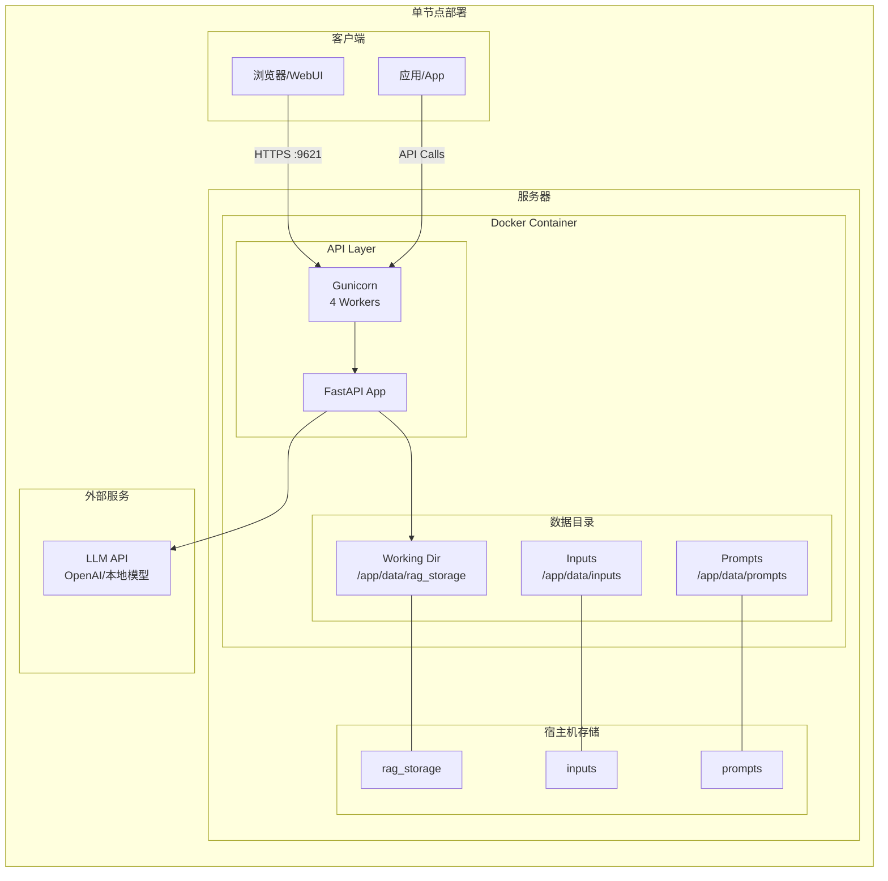
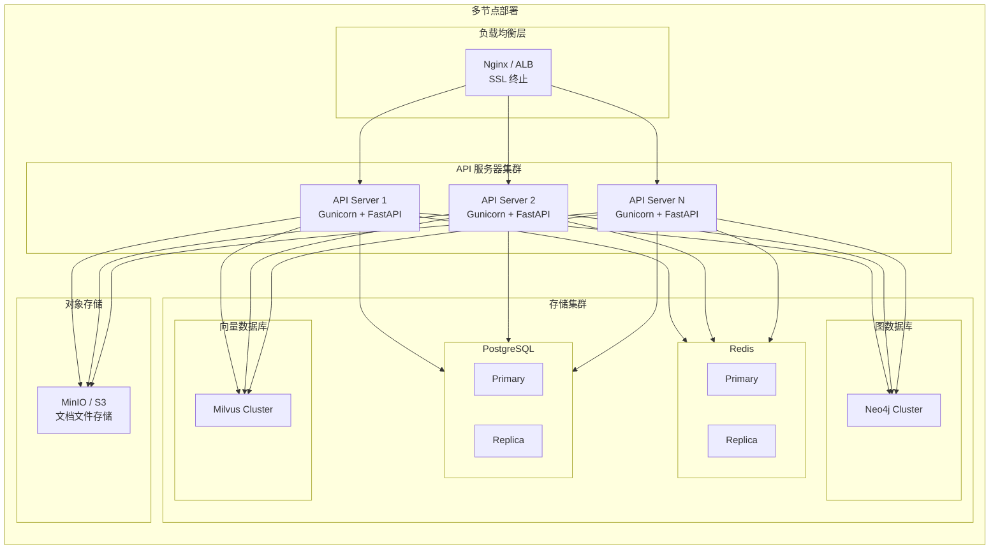
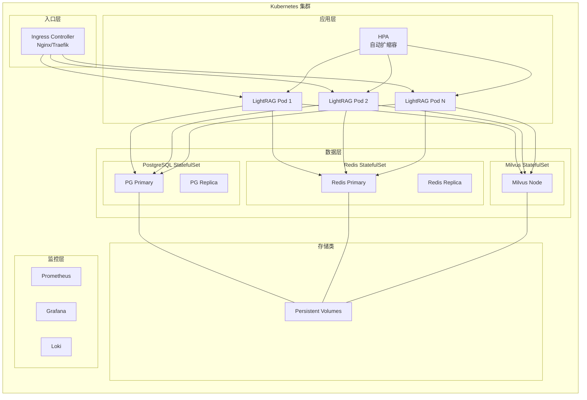
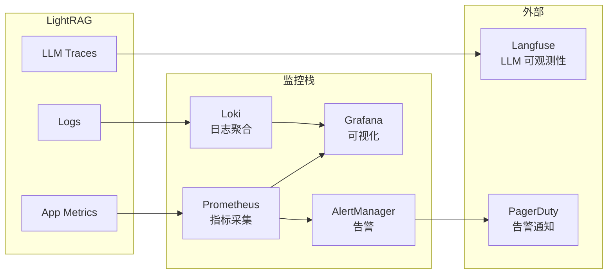

# 第 09 章 部署、运维与基础设施

> **内容**: 部署架构、Docker/K8s/CI/CD、监控、日志、告警、备份
> **范围**: 全栈部署方案

---

## 9.1 部署架构图

### 9.1.1 单节点部署



### 9.1.2 多节点部署



### 9.1.3 Kubernetes 部署



---

## 9.2 Docker 部署

### 9.2.1 Dockerfile 分析

**标准版 Dockerfile**:

```dockerfile
FROM python:3.10-slim

WORKDIR /app

# 安装系统依赖
RUN apt-get update && apt-get install -y \
    build-essential \
    && rm -rf /var/lib/apt/lists/*

# 安装 Python 依赖
COPY pyproject.toml .
RUN pip install --no-cache-dir -e ".[api]"

# 复制应用代码
COPY lightrag/ ./lightrag/

# 创建数据目录
RUN mkdir -p /app/data/rag_storage /app/data/inputs /app/data/prompts

# 暴露端口
EXPOSE 9621

# 启动命令
ENTRYPOINT ["python", "-m", "lightrag.api.lightrag_server"]
```

**Lite 版 Dockerfile.lite**:
- 仅包含核心功能，不包含 API 依赖
- 体积更小，适合嵌入式使用

**PostgreSQL 版 Dockerfile.postgres**:
- 包含 PostgreSQL 驱动
- 适合使用 PostgreSQL 作为存储后端的场景

### 9.2.2 Docker Compose 配置

**基础版 (`docker-compose.yml`)**:

```yaml
services:
  lightrag:
    image: ghcr.io/hkuds/lightrag:latest
    build:
      context: .
      dockerfile: Dockerfile
    ports:
      - "${HOST:-0.0.0.0}:${PORT:-9621}:9621"
    volumes:
      - ./data/rag_storage:/app/data/rag_storage
      - ./data/inputs:/app/data/inputs
      - ./data/prompts:/app/data/prompts
      - ./.env:/app/.env
    deploy:
      restart_policy:
        condition: on-failure
        max_attempts: 10
    environment:
      WORKING_DIR: "/app/data/rag_storage"
      INPUT_DIR: "/app/data/inputs"
      PROMPT_DIR: "/app/data/prompts"
      HOST: "0.0.0.0"
      PORT: "9621"
```

**完整版 (`docker-compose-full.yml`)**:

```yaml
services:
  lightrag:
    # ... 同上
    depends_on:
      postgres:
        condition: service_healthy
      redis:
        condition: service_healthy
      milvus:
        condition: service_started

  postgres:
    image: pgvector/pgvector:pg16
    environment:
      POSTGRES_USER: lightrag
      POSTGRES_PASSWORD: lightrag
      POSTGRES_DB: lightrag
    volumes:
      - postgres_data:/var/lib/postgresql/data
    healthcheck:
      test: ["CMD-SHELL", "pg_isready -U lightrag"]
      interval: 10s
      timeout: 5s
      retries: 5

  redis:
    image: redis:7-alpine
    volumes:
      - redis_data:/data
    healthcheck:
      test: ["CMD", "redis-cli", "ping"]
      interval: 10s
      timeout: 5s
      retries: 5

  milvus:
    image: milvusdb/milvus:latest
    # ... Milvus 配置

volumes:
  postgres_data:
  redis_data:
```

### 9.2.3 多阶段构建

```dockerfile
# 阶段 1: 构建
FROM python:3.10-slim as builder
WORKDIR /build
COPY pyproject.toml .
RUN pip install --no-cache-dir --prefix=/install -e ".[api]"

# 阶段 2: 运行
FROM python:3.10-slim
COPY --from=builder /install /usr/local
COPY lightrag/ ./lightrag/
# ...
```

---

## 9.3 Kubernetes 部署

### 9.3.1 K8s 目录结构

```
k8s-deploy/
├── K8S-README.md           # K8s 部署文档
├── databases/              # 数据库部署 manifests
│   ├── postgres.yaml
│   ├── redis.yaml
│   ├── milvus.yaml
│   └── neo4j.yaml
├── lightrag/               # LightRAG 部署 manifests
│   ├── deployment.yaml
│   ├── service.yaml
│   ├── ingress.yaml
│   ├── configmap.yaml
│   ├── secret.yaml
│   └── hpa.yaml
├── install_lightrag.sh     # 安装脚本
└── uninstall_lightrag.sh   # 卸载脚本
```

### 9.3.2 Deployment 配置

```yaml
apiVersion: apps/v1
kind: Deployment
metadata:
  name: lightrag
  labels:
    app: lightrag
spec:
  replicas: 3
  selector:
    matchLabels:
      app: lightrag
  template:
    metadata:
      labels:
        app: lightrag
    spec:
      containers:
      - name: lightrag
        image: ghcr.io/hkuds/lightrag:latest
        ports:
        - containerPort: 9621
        envFrom:
        - configMapRef:
            name: lightrag-config
        - secretRef:
            name: lightrag-secrets
        volumeMounts:
        - name: data
          mountPath: /app/data
        resources:
          requests:
            memory: "512Mi"
            cpu: "500m"
          limits:
            memory: "2Gi"
            cpu: "2000m"
        livenessProbe:
          httpGet:
            path: /health
            port: 9621
          initialDelaySeconds: 30
          periodSeconds: 10
        readinessProbe:
          httpGet:
            path: /health
            port: 9621
          initialDelaySeconds: 5
          periodSeconds: 5
      volumes:
      - name: data
        persistentVolumeClaim:
          claimName: lightrag-data
```

### 9.3.3 HPA 配置

```yaml
apiVersion: autoscaling/v2
kind: HorizontalPodAutoscaler
metadata:
  name: lightrag-hpa
spec:
  scaleTargetRef:
    apiVersion: apps/v1
    kind: Deployment
    name: lightrag
  minReplicas: 2
  maxReplicas: 10
  metrics:
  - type: Resource
    resource:
      name: cpu
      target:
        type: Utilization
        averageUtilization: 70
  - type: Resource
    resource:
      name: memory
      target:
        type: Utilization
        averageUtilization: 80
```

### 9.3.4 Ingress 配置

```yaml
apiVersion: networking.k8s.io/v1
kind: Ingress
metadata:
  name: lightrag-ingress
  annotations:
    nginx.ingress.kubernetes.io/ssl-redirect: "true"
    cert-manager.io/cluster-issuer: letsencrypt
spec:
  tls:
  - hosts:
    - lightrag.example.com
    secretName: lightrag-tls
  rules:
  - host: lightrag.example.com
    http:
      paths:
      - path: /
        pathType: Prefix
        backend:
          service:
            name: lightrag
            port:
              number: 9621
```

---

## 9.4 CI/CD 配置

### 9.4.1 GitHub Actions 工作流

```yaml
# .github/workflows/ci.yml
name: CI

on:
  push:
    branches: [main]
  pull_request:
    branches: [main]

jobs:
  test:
    runs-on: ubuntu-latest
    strategy:
      matrix:
        python-version: ["3.10", "3.11", "3.12"]
    steps:
    - uses: actions/checkout@v4
    - name: Set up Python
      uses: actions/setup-python@v5
      with:
        python-version: ${{ matrix.python-version }}
    - name: Install dependencies
      run: pip install -e ".[test]"
    - name: Run tests
      run: pytest tests/ -v --cov=lightrag
    - name: Lint
      run: ruff check lightrag/

  docker:
    runs-on: ubuntu-latest
    needs: test
    steps:
    - uses: actions/checkout@v4
    - name: Build Docker image
      run: docker build -t lightrag:test .
    - name: Test Docker image
      run: docker run --rm lightrag:test python -c "import lightrag"
```

### 9.4.2 Pre-commit 配置

```yaml
# .pre-commit-config.yaml
repos:
  - repo: https://github.com/astral-sh/ruff-pre-commit
    rev: v0.5.0
    hooks:
      - id: ruff
        args: [--fix]
      - id: ruff-format

  - repo: https://github.com/pre-commit/pre-commit-hooks
    rev: v4.6.0
    hooks:
      - id: trailing-whitespace
      - id: end-of-file-fixer
      - id: check-yaml
      - id: check-json
```

### 9.4.3 Makefile

```makefile
# Makefile
.PHONY: install test lint format docker

install:
    pip install -e ".[api,test]"

test:
    pytest tests/ -v --cov=lightrag --cov-report=html

lint:
    ruff check lightrag/
    ruff format --check lightrag/

format:
    ruff format lightrag/
    ruff check --fix lightrag/

docker:
    docker build -t lightrag:latest .

docker-push:
    docker tag lightrag:latest ghcr.io/hkuds/lightrag:latest
    docker push ghcr.io/hkuds/lightrag:latest
```

---

## 9.5 监控与可观测性

### 9.5.1 监控架构



### 9.5.2 Prometheus 指标

```python
# 内置指标（通过 prometheus-client）
from prometheus_client import Counter, Histogram, Gauge

# 查询计数
query_counter = Counter(
    "lightrag_queries_total",
    "Total queries",
    ["mode", "status"]
)

# 查询延迟
query_duration = Histogram(
    "lightrag_query_duration_seconds",
    "Query duration",
    ["mode"]
)

# 文档处理计数
doc_counter = Counter(
    "lightrag_documents_total",
    "Total documents",
    ["status"]
)

# 存储操作计数
storage_counter = Counter(
    "lightrag_storage_ops_total",
    "Storage operations",
    ["storage_type", "operation"]
)

# 流水线队列深度
pipeline_queue_gauge = Gauge(
    "lightrag_pipeline_queue_size",
    "Pipeline queue size",
    ["stage"]
)
```

### 9.5.3 Langfuse 集成

```python
# Langfuse 配置
LANGFUSE_PUBLIC_KEY = os.getenv("LANGFUSE_PUBLIC_KEY")
LANGFUSE_SECRET_KEY = os.getenv("LANGFUSE_SECRET_KEY")
LANGFUSE_HOST = os.getenv("LANGFUSE_HOST", "https://cloud.langfuse.com")

# 追踪 LLM 调用
from langfuse import Langfuse
langfuse = Langfuse()

# 创建追踪
trace = langfuse.trace(name="rag-query", user_id=user_id)
generation = trace.generation(
    name="llm-call",
    model=model_name,
    input=prompt,
    output=response,
)
```

### 9.5.4 RAGAS 评估

```python
# lightrag/evaluation/eval_rag_quality.py
from ragas import evaluate
from ragas.metrics import (
    faithfulness,
    answer_relevancy,
    context_precision,
    context_recall,
)

# 评估 RAG 质量
result = evaluate(
    dataset=dataset,
    metrics=[
        faithfulness,
        answer_relevancy,
        context_precision,
        context_recall,
    ],
)
```

---

## 9.6 日志方案

### 9.6.1 日志配置

```python
# lightrag/utils.py - setup_logger
def setup_logger(
    logger_name: str,
    filename: str,
    level: int = logging.INFO,
    max_bytes: int = 10 * 1024 * 1024,  # 10MB
    backup_count: int = 5,
) -> logging.Logger:
    """
    配置日志记录器

    特性:
    - 文件输出（轮转）
    - 控制台输出
    - 结构化格式
    - 性能计时
    """
    logger = logging.getLogger(logger_name)
    logger.setLevel(level)

    # 文件处理器（轮转）
    file_handler = RotatingFileHandler(
        filename,
        maxBytes=max_bytes,
        backupCount=backup_count,
    )

    # 控制台处理器
    console_handler = SafeStreamHandler()

    # 格式
    formatter = logging.Formatter(
        "%(asctime)s - %(name)s - %(levelname)s - %(message)s"
    )
    file_handler.setFormatter(formatter)
    console_handler.setFormatter(formatter)

    logger.addHandler(file_handler)
    logger.addHandler(console_handler)

    return logger
```

### 9.6.2 日志级别

| 级别 | 使用场景 | 示例 |
|------|----------|------|
| DEBUG | 开发调试 | 函数入参、中间状态 |
| INFO | 正常流程 | 文档处理完成、缓存命中 |
| WARNING | 潜在问题 | 配置缺失、降级处理 |
| ERROR | 可恢复错误 | LLM 调用失败、存储超时 |
| CRITICAL | 不可恢复错误 | 存储不可用、系统崩溃 |

### 9.6.3 结构化日志

```python
# 性能计时日志
performance_timing_log("Query completed in %.2fs", duration)

# 结构化字段
logger.info(
    "Document processed",
    extra={
        "doc_id": doc_id,
        "chunks_count": chunks_count,
        "duration": duration,
        "mode": "insert",
    }
)
```

---

## 9.7 告警方案

### 9.7.1 告警规则

```yaml
# Prometheus 告警规则
groups:
  - name: lightrag-alerts
    rules:
      - alert: LightRAGHighErrorRate
        expr: rate(lightrag_queries_total{status="error"}[5m]) > 0.1
        for: 5m
        labels:
          severity: warning
        annotations:
          summary: "High error rate detected"

      - alert: LightRAGSlowQueries
        expr: histogram_quantile(0.95, lightrag_query_duration_seconds) > 10
        for: 5m
        labels:
          severity: warning
        annotations:
          summary: "95th percentile query latency > 10s"

      - alert: LightRAGStorageDown
        expr: lightrag_storage_connected == 0
        for: 1m
        labels:
          severity: critical
        annotations:
          summary: "Storage backend disconnected"

      - alert: LightRAGPipelineStuck
        expr: lightrag_pipeline_queue_size > 1000
        for: 10m
        labels:
          severity: warning
        annotations:
          summary: "Pipeline queue backlog"
```

### 9.7.2 告警通知渠道

| 渠道 | 适用场景 | 配置 |
|------|----------|------|
| Email | 一般告警 | SMTP 配置 |
| Slack | 团队通知 | Webhook URL |
| PagerDuty | 紧急告警 | API Key |
| 企业微信 | 国内团队 | Webhook URL |

---

## 9.8 备份与恢复

### 9.8.1 备份策略

| 数据 | 备份方式 | 频率 | 保留周期 |
|------|----------|------|----------|
| KV Storage (JSON) | 文件复制 | 每日 | 30 天 |
| PostgreSQL | pg_dump | 每日 | 30 天 |
| Neo4j | neo4j-admin dump | 每日 | 30 天 |
| MongoDB | mongodump | 每日 | 30 天 |
| Milvus | milvus-backup | 每周 | 90 天 |
| 文档文件 | rsync | 实时 | 永久 |

### 9.8.2 备份脚本

```bash
#!/bin/bash
# backup.sh

BACKUP_DIR="/backup/lightrag/$(date +%Y%m%d)"
mkdir -p $BACKUP_DIR

# 备份 JSON 存储
cp -r /data/rag_storage $BACKUP_DIR/

# 备份 PostgreSQL
pg_dump -U lightrag lightrag > $BACKUP_DIR/pg_dump.sql

# 备份 MongoDB
mongodump --out=$BACKUP_DIR/mongo

# 清理旧备份（保留 30 天）
find /backup/lightrag -type d -mtime +30 -exec rm -rf {} \;
```

### 9.8.3 恢复流程

```bash
#!/bin/bash
# restore.sh

BACKUP_DIR=$1

# 恢复 JSON 存储
cp -r $BACKUP_DIR/rag_storage /data/

# 恢复 PostgreSQL
psql -U lightrag lightrag < $BACKUP_DIR/pg_dump.sql

# 恢复 MongoDB
mongorestore $BACKUP_DIR/mongo
```

---

## 9.9 本章小结

本章对 LightRAG 的部署和运维方案进行了全面分析：

1. **部署架构**: 单节点、多节点、K8s 三种方案
2. **Docker**: 多版本 Dockerfile + Docker Compose
3. **Kubernetes**: 完整的 manifests + HPA + Ingress
4. **CI/CD**: GitHub Actions + Pre-commit + Makefile
5. **监控**: Prometheus + Grafana + Langfuse
6. **日志**: 结构化日志 + 轮转策略
7. **告警**: Prometheus AlertManager + 多渠道通知
8. **备份**: 定期备份 + 恢复流程

下一章将分析改进建议与未来规划。

---

> **下一章**: [09-改进建议与未来规划.md](./09-改进建议与未来规划.md)

---

☕️ 制作不易，请我喝咖啡☕️关注我➕