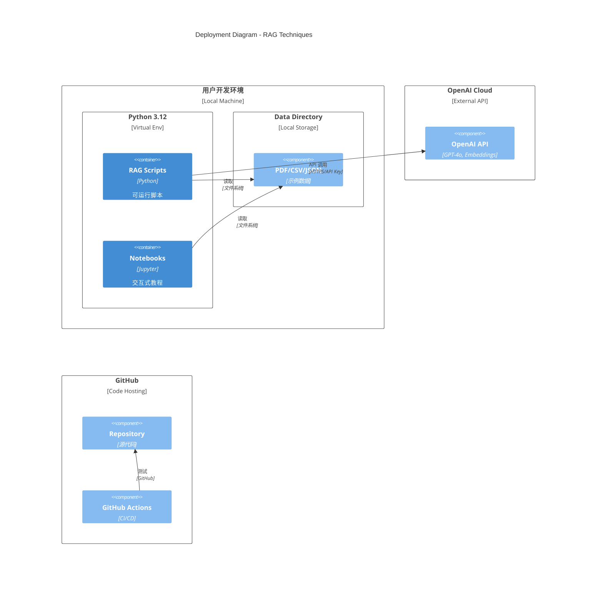
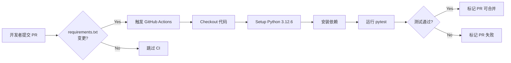
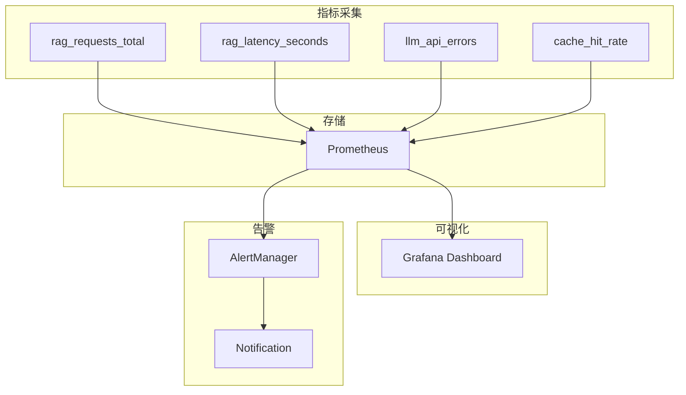

# 8. 部署、运维与基础设施 (Deployment, Operations & Infrastructure)

> 详细描述项目的部署架构、CI/CD 配置、Docker 支持、监控方案与运维指南。预计字数：~6000 字。

---

## 8.1 部署架构概述

Advanced RAG Techniques 是一个**离线运行的代码仓库**，部署模式为**本地开发/教学环境**，非在线服务。

### 8.1.1 部署架构图（Mermaid）



### 8.1.2 环境要求

| 组件 | 最低要求 | 推荐配置 |
|------|----------|----------|
| **Python** | 3.10+ | 3.12.6 |
| **内存** | 4 GB | 8 GB+ |
| **磁盘** | 500 MB | 1 GB+ |
| **网络** | 可访问 OpenAI API | 稳定高速网络 |
| **OS** | Linux/macOS/Windows | Linux/macOS |

---

## 8.2 本地部署指南

### 8.2.1 快速开始

```bash
# 1. 克隆仓库
git clone https://github.com/NirDiamant/RAG_Techniques.git
cd RAG_Techniques

# 2. 创建虚拟环境
python -m venv venv
source venv/bin/activate  # Linux/macOS
# venv\Scripts\activate   # Windows

# 3. 安装依赖
pip install -r requirements.txt

# 4. 配置环境变量
echo "OPENAI_API_KEY=your-key-here" > .env

# 5. 运行测试
pytest

# 6. 运行示例
python all_rag_techniques_runnable_scripts/simple_rag.py \
    --path data/Understanding_Climate_Change.pdf \
    --query "What is climate change?"
```

### 8.2.2 依赖安装

```txt
# requirements.txt (推断)
langchain>=0.3.0
langchain-core>=0.3.0
langchain-community>=0.3.0
langchain-openai>=0.2.0
langchain-experimental>=0.3.0
langchain-cohere>=0.3.0
langchain-text-splitters>=0.3.0
llama-index>=0.11.0
openai>=1.40.0
faiss-cpu>=1.8.0
rank-bm25>=0.2.2
sentence-transformers>=3.0.0
spacy>=3.7.0
nltk>=3.8.0
networkx>=3.2.0
scikit-learn>=1.5.0
numpy>=1.26.0
pandas>=2.2.0
pydantic>=2.7.0
python-dotenv>=1.0.0
PyMuPDF>=1.24.0
matplotlib>=3.8.0
tqdm>=4.66.0
deepeval>=1.0.0
ragas>=0.1.0
pytest>=8.0.0
```

---

## 8.3 CI/CD 配置

### 8.3.1 GitHub Actions 工作流

#### github-test.yml（PR 触发）

```yaml
name: GitHub PR Test

on:
  pull_request:
    types: [opened, synchronize, reopened]
    branches:
      - main
    paths:
      - "requirements.txt"  # 仅 requirements.txt 变更时触发

jobs:
  test:
    runs-on: ubuntu-latest
    env:
      OPENAI_API_KEY: "123"  # 测试用假 Key（import 测试不实际调用）
    
    steps:
      - name: Checkout code
        uses: actions/checkout@v6

      - name: Set up Python
        uses: actions/setup-python@v6
        with:
          python-version: '3.12.6'
          cache: 'pip'

      - name: Install dependencies
        run: |
          python -m pip install --upgrade pip
          pip install -r requirements.txt

      - name: Run tests
        run: pytest
```

#### local-test.yml（本地触发）

```yaml
name: Local Test with act

on:
  workflow_dispatch:  # 手动触发

jobs:
  test:
    container:
      image: catthehacker/ubuntu:act-latest
    env:
      OPENAI_API_KEY: "123"
    
    steps:
      - uses: actions/checkout@v6
      - uses: actions/setup-python@v6
        with:
          python-version: '3.12.6'
      - run: pip install -r requirements.txt
      - run: pytest
```

### 8.3.2 CI/CD 流程图



### 8.3.3 测试策略

```python
# tests/test_imports.py 核心逻辑
def test_notebook_imports(notebook_paths):
    """验证所有 Notebook 的 import 语句可执行"""
    for path in notebook_paths:
        notebook = nbformat.read(path, as_version=4)
        for cell in notebook['cells']:
            if cell['cell_type'] == 'code':
                for line in cell['source'].split('\n'):
                    if is_import_line(line):
                        exec(line.strip())  # 尝试执行 import

def test_script_imports(script_paths):
    """验证所有 Script 的 import 语句可执行"""
    for path in script_paths:
        for line in read_lines(path):
            if is_import_line(line):
                exec(line.strip())
```

---

## 8.4 Docker 支持

### 8.4.1 Dockerfile（建议）

```dockerfile
# Dockerfile
FROM python:3.12-slim

WORKDIR /app

# 安装系统依赖
RUN apt-get update && apt-get install -y \
    gcc \
    g++ \
    && rm -rf /var/lib/apt/lists/*

# 安装 Python 依赖
COPY requirements.txt .
RUN pip install --no-cache-dir -r requirements.txt

# 下载 NLTK 数据
RUN python -c "import nltk; nltk.download('punkt'); nltk.download('wordnet')"

# 下载 spaCy 模型
RUN python -m spacy download en_core_web_sm

# 复制代码
COPY . .

# 设置环境变量
ENV PYTHONUNBUFFERED=1

# 默认命令
CMD ["python", "all_rag_techniques_runnable_scripts/simple_rag.py"]
```

### 8.4.2 Docker Compose（建议）

```yaml
# docker-compose.yml
version: '3.8'

services:
  rag-app:
    build: .
    environment:
      - OPENAI_API_KEY=${OPENAI_API_KEY}
    volumes:
      - ./data:/app/data
      - ./output:/app/output
    command: python all_rag_techniques_runnable_scripts/simple_rag.py

  jupyter:
    build: .
    ports:
      - "8888:8888"
    environment:
      - OPENAI_API_KEY=${OPENAI_API_KEY}
    volumes:
      - ./:/app
    command: jupyter notebook --ip=0.0.0.0 --port=8888 --no-browser --allow-root
```

### 8.4.3 构建与运行

```bash
# 构建镜像
docker build -t rag-techniques .

# 运行脚本
docker run -e OPENAI_API_KEY=$OPENAI_API_KEY \
    -v $(pwd)/data:/app/data \
    rag-techniques \
    python all_rag_techniques_runnable_scripts/simple_rag.py

# 运行 Jupyter
docker-compose up jupyter
```

---

## 8.5 监控与日志

### 8.5.1 当前监控

| 类型 | 实现 | 说明 |
|------|------|------|
| **执行时间** | `time.time()` 测量 | 记录 Chunking/Retrieval 时间 |
| **进度** | `print()` 语句 | 简单文本输出 |
| **错误** | `try/except` | 捕获并打印异常 |

### 8.5.2 建议监控方案

```python
# 1. 使用 logging 模块
import logging
logging.basicConfig(
    level=logging.INFO,
    format='%(asctime)s - %(name)s - %(levelname)s - %(message)s',
    handlers=[
        logging.FileHandler('rag.log'),
        logging.StreamHandler()
    ]
)
logger = logging.getLogger(__name__)

# 2. 使用装饰器测量性能
import functools
def timer(func):
    @functools.wraps(func)
    def wrapper(*args, **kwargs):
        start = time.time()
        result = func(*args, **kwargs)
        elapsed = time.time() - start
        logger.info(f"{func.__name__} took {elapsed:.2f}s")
        return result
    return wrapper

# 3. 集成 Prometheus（可选）
from prometheus_client import Counter, Histogram

rag_requests = Counter('rag_requests_total', 'Total RAG requests')
rag_latency = Histogram('rag_latency_seconds', 'RAG latency')
```

### 8.5.3 监控仪表板（建议）



---

## 8.6 日志方案

### 8.6.1 结构化日志

```python
import json
import logging

class JSONFormatter(logging.Formatter):
    def format(self, record):
        log_data = {
            "timestamp": self.formatTime(record),
            "level": record.levelname,
            "module": record.module,
            "message": record.getMessage(),
        }
        if hasattr(record, "extra_data"):
            log_data.update(record.extra_data)
        return json.dumps(log_data)

# 使用
logger.info("RAG execution", extra={"extra_data": {
    "query": query,
    "retrieval_time": 0.123,
    "generation_time": 1.456,
    "num_docs": 5
}})
```

### 8.6.2 日志级别

| 级别 | 使用场景 |
|------|----------|
| DEBUG | 开发调试（向量维度、相似度分数） |
| INFO | 正常流程（编码完成、检索完成） |
| WARNING | 潜在问题（缓存未命中、重试） |
| ERROR | 错误（API 调用失败、文件不存在） |
| CRITICAL | 系统级错误 |

---

## 8.7 备份方案

### 8.7.1 数据备份

| 数据类型 | 备份策略 | 频率 |
|----------|----------|------|
| 代码 | Git + GitHub | 每次提交 |
| 数据文件 | Git LFS / 云存储 | 变更时 |
| 向量存储 | 持久化到磁盘 | 构建后 |
| 评估结果 | 导出为 JSON/CSV | 每次评估 |

### 8.7.2 向量存储持久化

```python
# 保存向量存储
vectorstore.save_local("data/vectorstore/climate_change.faiss")

# 加载向量存储
from langchain_community.vectorstores import FAISS
vectorstore = FAISS.load_local(
    "data/vectorstore/climate_change.faiss",
    OpenAIEmbeddings()
)
```

---

## 8.8 性能优化

### 8.8.1 当前性能瓶颈

| 瓶颈 | 影响 | 优先级 |
|------|------|--------|
| **重复编码** | 每次运行重新编码 PDF | 高 |
| **无批处理** | 嵌入逐个调用 | 中 |
| **无缓存** | 向量存储不持久化 | 高 |
| **同步执行** | 无并发（除 Hierarchical） | 低 |

### 8.8.2 优化建议

```python
# 1. 向量存储缓存
@cache def get_vectorstore(path, chunk_size, chunk_overlap):
    cache_path = f".cache/{hash(path)}.faiss"
    if os.path.exists(cache_path):
        return FAISS.load_local(cache_path, embeddings)
    vs = encode_pdf(path, chunk_size, chunk_overlap)
    vs.save_local(cache_path)
    return vs

# 2. 批量嵌入
def batch_embed(texts, batch_size=32):
    embeddings = []
    for i in range(0, len(texts), batch_size):
        batch = texts[i:i+batch_size]
        embeddings.extend(embeddings_model.embed_documents(batch))
    return embeddings

# 3. 并行处理
from concurrent.futures import ThreadPoolExecutor
with ThreadPoolExecutor(max_workers=4) as executor:
    futures = [executor.submit(process_doc, doc) for doc in documents]
```

---

## 8.9 安全加固

### 8.9.1 安全检查清单

| 检查项 | 当前状态 | 建议 |
|--------|----------|------|
| API Key 管理 | .env 文件 | ✅ 正确 |
| 依赖安全 | 无扫描 | 添加 `safety check` / `pip-audit` |
| 输入验证 | 部分 | 统一验证 |
| 日志脱敏 | 无 | 添加敏感信息过滤 |
| 网络隔离 | 无 | 生产环境使用 VPC |

### 8.9.2 安全依赖扫描

```bash
# 安装 safety
pip install safety

# 扫描依赖
safety check -r requirements.txt

# 或使用 pip-audit
pip install pip-audit
pip-audit -r requirements.txt
```

---

## 8.10 扩展部署方案

### 8.10.1 Web 服务化（建议）

```python
# 使用 FastAPI 包装 RAG 为 REST API
from fastapi import FastAPI
from pydantic import BaseModel

app = FastAPI()

class QueryRequest(BaseModel):
    query: str
    technique: str = "simple_rag"
    k: int = 5

class QueryResponse(BaseModel):
    answer: str
    context: List[str]
    retrieval_time: float

@app.post("/api/query", response_model=QueryResponse)
async def query(request: QueryRequest):
    start = time.time()
    # 执行 RAG
    answer, context = run_rag(request.technique, request.query, request.k)
    elapsed = time.time() - start
    return QueryResponse(answer=answer, context=context, retrieval_time=elapsed)
```

### 8.10.2 Kubernetes 部署（建议）

```yaml
# k8s-deployment.yaml
apiVersion: apps/v1
kind: Deployment
metadata:
  name: rag-service
spec:
  replicas: 3
  selector:
    matchLabels:
      app: rag-service
  template:
    metadata:
      labels:
        app: rag-service
    spec:
      containers:
      - name: rag
        image: rag-techniques:latest
        ports:
        - containerPort: 8000
        env:
        - name: OPENAI_API_KEY
          valueFrom:
            secretKeyRef:
              name: openai-secret
              key: api-key
        resources:
          requests:
            memory: "512Mi"
            cpu: "500m"
          limits:
            memory: "2Gi"
            cpu: "1000m"
```

---

## 8.11 运维清单

### 8.11.1 日常运维

| 任务 | 频率 | 工具 |
|------|------|------|
| 依赖更新 | 每月 | `pip list --outdated` |
| 安全扫描 | 每周 | `safety check` |
| 测试执行 | 每次 PR | `pytest` |
| 日志审查 | 每日 | `grep ERROR rag.log` |
| 性能基准 | 每周 | 自定义脚本 |

### 8.11.2 故障排查

| 问题 | 排查步骤 |
|------|----------|
| Import 失败 | 检查 Python 版本、依赖安装 |
| API 调用失败 | 检查网络、API Key、配额 |
| 内存不足 | 减小 batch_size、使用 FAISS 分片 |
| 检索质量差 | 调整 chunk_size、尝试不同技术 |

---

☕️ 制作不易，请我喝咖啡☕️关注我➕