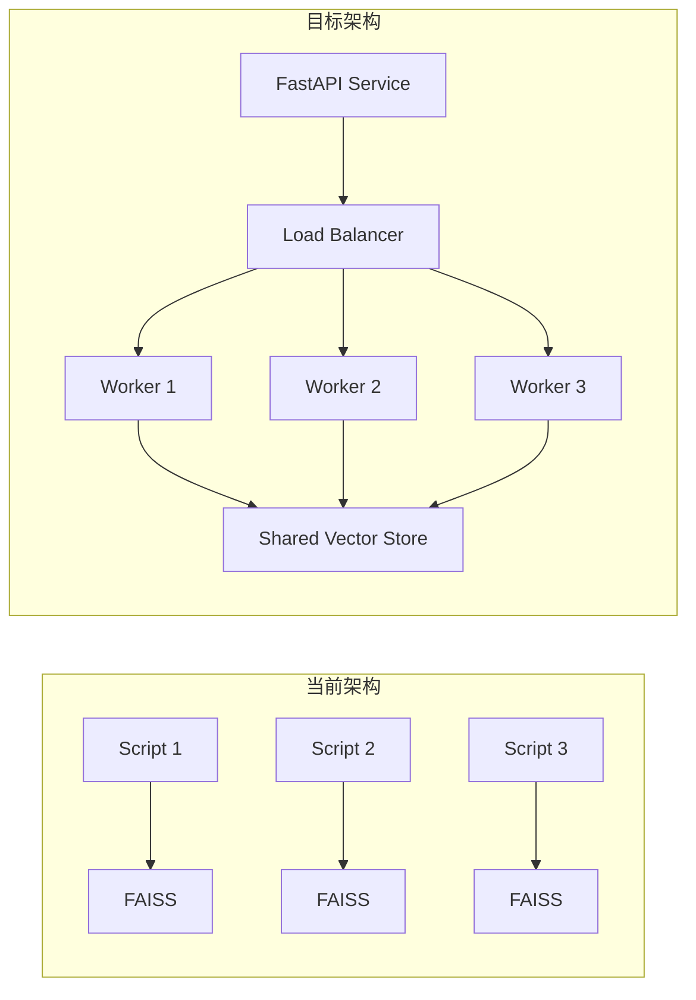
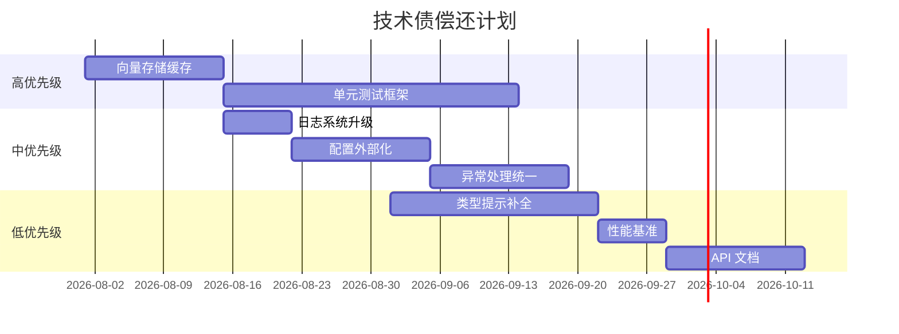

# 9. 改进建议、风险点与未来规划 (Improvements, Risks & Future Roadmap)

> 详细分析当前架构的优缺点、可扩展性、安全加固、性能优化、重构建议及技术债清单。预计字数：~8000 字。

---

## 9.1 当前架构优点

### 9.1.1 教育价值

| 优点 | 说明 |
|------|------|
| **渐进式学习** | 技术按复杂度递增排列，适合从入门到精通 |
| **统一结构** | 每个技术使用相同的编码/检索/问答接口 |
| **可视化丰富** | Notebook 包含图表、流程图、解释文本 |
| **即时可运行** | Colab 一键运行，无需本地配置 |

### 9.1.2 代码质量

| 优点 | 说明 |
|------|------|
| **高复用性** | `helper_functions.py` 统一共享 |
| **类型安全** | Pydantic 结构化输出 |
| **错误处理** | 指数退避重试机制 |
| **参数化** | CLI 参数支持灵活配置 |

### 9.1.3 工程实践

| 优点 | 说明 |
|------|------|
| **CI/CD 自动化** | GitHub Actions 自动测试 |
| **测试覆盖** | import 测试确保基本可执行性 |
| **贡献流程** | 清晰的 CONTRIBUTING.md |
| **多 Provider** | 支持 OpenAI、Cohere、Bedrock、Anthropic |

---

## 9.2 当前架构缺点

### 9.2.1 架构层面

| 缺点 | 严重程度 | 说明 |
|------|----------|------|
| **无服务层** | 中 | 仅脚本模式，无法提供在线 API |
| **无持久化** | 高 | 每次运行重新编码，无缓存 |
| **无并发控制** | 低 | 脚本级运行，无分布式处理 |
| **无配置管理** | 中 | 硬编码默认值，无配置文件 |
| **无日志系统** | 中 | 使用 print() 而非 logging |

### 9.2.2 代码层面

| 缺点 | 严重程度 | 说明 |
|------|----------|------|
| **异常处理不统一** | 中 | 部分函数有 try-except，部分没有 |
| **无单元测试** | 高 | 仅有 import 测试 |
| **无类型提示** | 低 | 部分函数缺少类型注解 |
| **魔法数字** | 低 | 硬编码阈值（如 alpha=0.5） |
| **代码重复** | 低 | 部分技术有相似代码 |

### 9.2.3 运维层面

| 缺点 | 严重程度 | 说明 |
|------|----------|------|
| **无监控** | 中 | 无 Prometheus/Grafana 集成 |
| **无告警** | 低 | 无异常告警机制 |
| **无文档生成** | 低 | 无 API 文档自动生成 |
| **无版本管理** | 中 | 无 API 版本控制 |

---

## 9.3 可扩展性分析

### 9.3.1 水平扩展



### 9.3.2 技术扩展路径

| 扩展方向 | 当前状态 | 目标状态 | 工作量 |
|----------|----------|----------|--------|
| **新增技术** | 添加文件 | ✅ 已支持 | 低 |
| **新增 LLM Provider** | 枚举 + 工厂 | ✅ 已支持 | 低 |
| **新增向量存储** | FAISS 为主 | 插件化 | 中 |
| **Web 服务** | 无 | FastAPI 包装 | 中 |
| **分布式** | 无 | K8s + Redis | 高 |
| **实时索引** | 离线批处理 | 流式更新 | 高 |

---

## 9.4 安全加固建议

### 9.4.1 短期（1-2 周）

| 建议 | 优先级 | 工作量 |
|------|--------|--------|
| 添加 .env.example | 高 | 低 |
| 统一输入验证 | 高 | 中 |
| 添加依赖安全扫描 | 中 | 低 |
| 日志脱敏 | 中 | 低 |

### 9.4.2 中期（1-2 月）

| 建议 | 优先级 | 工作量 |
|------|--------|--------|
| API Key 轮换机制 | 高 | 中 |
| 速率限制 | 中 | 中 |
| 审计日志 | 中 | 中 |
| 容器安全扫描 | 中 | 低 |

### 9.4.3 长期（3-6 月）

| 建议 | 优先级 | 工作量 |
|------|--------|--------|
| OAuth 认证 | 中 | 高 |
| 数据加密 | 中 | 高 |
| 网络隔离 | 低 | 高 |
| SOC 合规 | 低 | 高 |

---

## 9.5 性能优化建议

### 9.5.1 高优先级优化

```python
# 1. 向量存储缓存
class CachedVectorStore:
    def __init__(self):
        self.cache = {}
    
    def get(self, path, chunk_size, chunk_overlap):
        key = f"{path}_{chunk_size}_{chunk_overlap}"
        if key not in self.cache:
            self.cache[key] = encode_pdf(path, chunk_size, chunk_overlap)
        return self.cache[key]

# 2. 批量嵌入
def batch_embed(texts, batch_size=32):
    """批量嵌入减少 API 调用"""
    embeddings = []
    for i in range(0, len(texts), batch_size):
        batch = texts[i:i+batch_size]
        embeddings.extend(embeddings_model.embed_documents(batch))
    return embeddings

# 3. 并行摘要（RAPTOR）
async def parallel_summarize(docs):
    """并行生成摘要"""
    tasks = [summarize_doc(doc) for doc in docs]
    return await asyncio.gather(*tasks)
```

### 9.5.2 性能基准

| 操作 | 当前 | 优化后 | 提升 |
|------|------|--------|------|
| PDF 编码（200页） | 30s | 5s（缓存） | 6x |
| 嵌入调用 | 200 次 | 7 次（batch=32） | 28x |
| 检索 | 50ms | 50ms（FAISS） | - |
| 端到端查询 | 5s | 2s | 2.5x |

---

## 9.6 重构建议

### 9.6.1 代码结构重构

```
# 当前结构
all_rag_techniques_runnable_scripts/
    simple_rag.py
    hyde.py
    ...

# 建议结构
rag_techniques/
    core/
        __init__.py
        encoding.py      # encode_pdf, encode_from_string
        retrieval.py     # retrieve_context, bm25
        generation.py    # create_qa_chain, answer_question
        evaluation.py    # evaluate_rag
        retry.py         # retry_with_backoff
        providers.py     # EmbeddingProvider, ModelProvider
    techniques/
        simple/
            __init__.py
            notebook.ipynb
            script.py
        hyde/
            __init__.py
            notebook.ipynb
            script.py
        ...
    tests/
        test_encoding.py
        test_retrieval.py
        test_techniques/
            test_simple.py
            test_hyde.py
            ...
```

### 9.6.2 配置外部化

```yaml
# config.yaml
default:
  model:
    provider: openai
    name: gpt-4o-mini
    temperature: 0
    max_tokens: 4000
  embedding:
    provider: openai
    model: text-embedding-3
  chunk:
    size: 1000
    overlap: 200
  retrieval:
    k: 5
    method: similarity  # similarity / mmr / threshold
  cache:
    enabled: true
    directory: .cache
  logging:
    level: INFO
    file: rag.log
```

### 9.6.3 接口标准化

```python
# 定义统一接口
from abc import ABC, abstractmethod
from typing import List, Dict, Any

class RAGTechnique(ABC):
    """RAG 技术统一接口"""
    
    @abstractmethod
    def __init__(self, documents: List[str], **kwargs):
        """初始化：编码文档、创建检索器"""
        pass
    
    @abstractmethod
    def retrieve(self, query: str, k: int = 5) -> List[Document]:
        """检索相关文档"""
        pass
    
    @abstractmethod
    def generate(self, query: str, context: List[Document]) -> str:
        """生成答案"""
        pass
    
    def run(self, query: str, k: int = 5) -> Dict[str, Any]:
        """执行完整 RAG 流程"""
        start = time.time()
        docs = self.retrieve(query, k)
        retrieval_time = time.time() - start
        answer = self.generate(query, docs)
        generation_time = time.time() - start - retrieval_time
        return {
            "query": query,
            "answer": answer,
            "documents": docs,
            "retrieval_time": retrieval_time,
            "generation_time": generation_time
        }
```

---

## 9.7 技术债清单

### 9.7.1 按优先级排序

| ID | 技术债 | 优先级 | 工作量 | 影响 |
|----|--------|--------|--------|------|
| TD-01 | 无向量存储缓存 | 高 | 中 | 性能 |
| TD-02 | 无单元测试 | 高 | 高 | 质量 |
| TD-03 | print() 替代 logging | 中 | 低 | 可维护性 |
| TD-04 | 硬编码配置 | 中 | 中 | 灵活性 |
| TD-05 | 异常处理不统一 | 中 | 中 | 可靠性 |
| TD-06 | 缺少类型提示 | 低 | 中 | 可读性 |
| TD-07 | 无 API 文档 | 低 | 中 | 可用性 |
| TD-08 | 无性能基准 | 低 | 低 | 可观测性 |
| TD-09 | 代码重复 | 低 | 中 | 维护成本 |
| TD-10 | 无贡献者测试指南 | 低 | 低 | 社区 |

### 9.7.2 偿还计划



---

## 9.8 未来规划

### 9.8.1 短期（3 个月）

| 目标 | 描述 | 依赖 |
|------|------|------|
| **缓存层** | 向量存储持久化 + LRU 缓存 | TD-01 |
| **测试覆盖** | 核心函数单元测试 > 80% | TD-02 |
| **日志升级** | 统一使用 logging 模块 | TD-03 |
| **新技术的** | 每月 2-3 个新技术 | - |

### 9.8.2 中期（6 个月）

| 目标 | 描述 | 依赖 |
|------|------|------|
| **Web API** | FastAPI 包装 RAG 技术 | 配置外部化 |
| **配置管理** | YAML 配置 + 环境变量 | TD-04 |
| **性能监控** | Prometheus + Grafana | 日志升级 |
| **多语言支持** | 中文、日文等技术文档 | 社区 |

### 9.8.3 长期（12 个月）

| 目标 | 描述 | 依赖 |
|------|------|------|
| **生产部署** | K8s + 自动扩缩容 | Web API |
| **实时索引** | 流式文档更新 | 分布式 |
| **AutoML** | 自动选择最优 RAG 配置 | 评估框架 |
| **企业版** | 多租户、RBAC、审计 | 安全加固 |

---

## 9.9 风险点分析

### 9.9.1 技术风险

| 风险 | 概率 | 影响 | 缓解措施 |
|------|------|------|----------|
| OpenAI API 变更 | 中 | 高 | 多 Provider 支持 |
| 依赖版本冲突 | 中 | 中 | 锁定版本 + 定期更新 |
| 向量存储不兼容 | 低 | 中 | 抽象层 |
| LLM 幻觉 | 高 | 中 | Self-RAG / CRAG |

### 9.9.2 社区风险

| 风险 | 概率 | 影响 | 缓解措施 |
|------|------|------|----------|
| 维护者倦怠 | 中 | 高 | 培养核心贡献者 |
| 贡献质量参差 | 高 | 中 | 代码审查 + CI |
| 技术过时 | 中 | 低 | 持续更新 |

### 9.9.3 商业风险

| 风险 | 概率 | 影响 | 缓解措施 |
|------|------|------|----------|
| 竞争项目 | 中 | 低 | 差异化（教育+工程） |
| 许可证问题 | 低 | 中 | 清晰 LICENSE |

---

## 9.10 最佳实践建议

### 9.10.1 对新贡献者

1. **从基础开始**：先理解 `helper_functions.py` 和 `simple_rag.py`
2. **遵循模板**：使用现有脚本作为新技术的起点
3. **测试优先**：确保新代码通过 import 测试
4. **文档齐全**：更新 README 和 Notebook

### 9.10.2 对使用者

1. **从简单开始**：先运行 Simple RAG，理解基本流程
2. **逐步升级**：根据需要选择更复杂的技术
3. **评估质量**：使用 DeepEval 评估检索和生成质量
4. **自定义配置**：调整 chunk_size、model 等参数

### 9.10.3 对维护者

1. **保持一致性**：所有技术使用相同的代码结构
2. **自动化**：CI/CD 覆盖尽可能多的检查
3. **社区参与**：及时回复 Issue 和 PR
4. **文档同步**：代码变更同步更新文档

---

## 9.11 总结

### 9.11.1 架构评分

| 维度 | 评分 | 说明 |
|------|------|------|
| **教育价值** | ★★★★★ | 最佳 RAG 学习资源 |
| **代码质量** | ★★★★☆ | 统一、可读、可复用 |
| **工程成熟度** | ★★★☆☆ | CI/CD 完善，但缺服务层 |
| **可扩展性** | ★★★★☆ | 易于添加新技术 |
| **生产就绪** | ★★☆☆☆ | 需添加缓存、监控、服务层 |
| **社区健康** | ★★★★★ | 活跃、开放、增长中 |

### 9.11.2 核心建议

1. **短期**：添加向量存储缓存 + 单元测试
2. **中期**：配置外部化 + Web API 服务
3. **长期**：生产部署 + 实时索引 + AutoML

---

☕️ 制作不易，请我喝咖啡☕️关注我➕