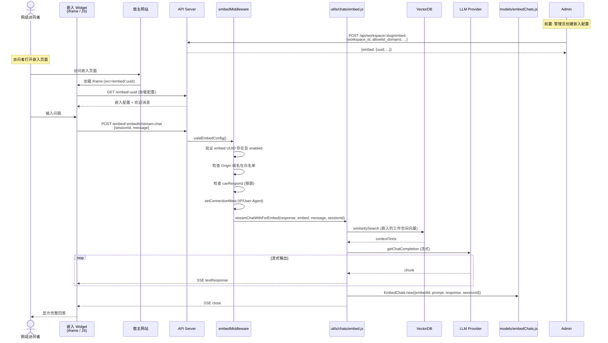
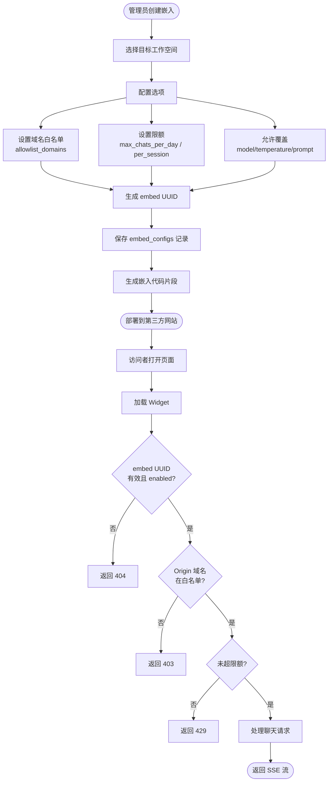

# 03-06 嵌入聊天组件流程

> **所属章节**: [03-系统流程与时序图](./03-系统流程与时序图.md)  
> **流程类型**: 嵌入配置、公开聊天、会话隔离、域名白名单、限额控制  
> **核心文件**: `server/endpoints/embed/index.js`、`server/models/embedConfig.js`、`server/models/embedChats.js`、`server/utils/chats/embed.js`、`server/utils/middleware/embedMiddleware.js`

---

## 1. 流程概述

**嵌入聊天组件（Embed Chat Widget）** 允许管理员将 AnythingLLM 的聊天能力嵌入到第三方网站中，通过 `<iframe>` 或 JS SDK 加载。这适用于以下场景：

- 为产品文档网站添加 AI 助手
- 为客户支持页面添加智能问答
- 为内部 Wiki 添加对话入口

嵌入聊天与内部聊天共享同一后端，但具有以下隔离特性：
- **会话隔离**：每个嵌入访问者使用独立的 `sessionId`
- **域名白名单**：仅允许指定域名嵌入
- **限额控制**：每日/每会话最大聊天数
- **来源过滤**：嵌入聊天不返回文档来源（避免泄露内部信息）

---

## 2. 时序图 — 嵌入聊天端到端流程（L1）



---

## 3. 流程图 — 嵌入配置与访问控制（L3）



---

## 4. 详细步骤说明

### 4.1 嵌入配置创建

管理员通过 `POST /api/workspace/:slug/embed` 创建嵌入配置，可配置项：

| 配置项 | 类型 | 说明 |
|--------|------|------|
| `workspace_id` | Int | 关联的工作空间（决定使用哪个知识库） |
| `chat_mode` | String | `chat` 或 `query`（不支持 `automatic`） |
| `allowlist_domains` | String[] | 允许嵌入的域名白名单 |
| `allow_model_override` | Boolean | 是否允许前端覆盖模型 |
| `allow_temperature_override` | Boolean | 是否允许覆盖温度 |
| `allow_prompt_override` | Boolean | 是否允许覆盖系统提示 |
| `max_chats_per_day` | Int | 每日最大聊天数 |
| `max_chats_per_session` | Int | 每会话最大聊天数 |
| `message_limit` | Int | 每消息最大字符数 |
| `enabled` | Boolean | 是否启用 |

### 4.2 嵌入代码片段

系统生成类似以下的嵌入代码：
```html
<iframe 
  src="https://your-anythingllm.com/embed/xxxx-xxxx-xxxx"
  width="400" height="600"
></iframe>
```

或使用 JS SDK 动态加载。

### 4.3 访问控制中间件

`server/utils/middleware/embedMiddleware.js` 提供三个中间件：

1. **`validEmbedConfig`**：验证 embed UUID 存在且 `enabled=true`，注入 `response.locals.embedConfig`。
2. **`setConnectionMeta`**：记录访问者 IP、User-Agent、Referer 到 `connection_information`。
3. **`canRespond`**：检查每日/每会话限额，超限返回 429。

### 4.4 聊天处理

`streamChatWithForEmbed()`（`server/utils/chats/embed.js`）执行与内部聊天类似的 RAG 流程，但有以下差异：

- **无聊天历史注入**：嵌入聊天不访问内部聊天历史（`workspace_chats` 表）。
- **独立会话**：使用 `sessionId`（前端生成）隔离不同访问者的聊天。
- **来源过滤**：`EmbedChats.filterSources()` 在返回历史时移除 `sources` 字段，避免泄露内部文档信息。
- **覆盖支持**：若配置允许，前端可覆盖 `model`、`temperature`、`prompt`。

### 4.5 聊天历史

嵌入聊天历史存储在 `embed_chats` 表，通过 `sessionId` 关联。前端可通过 `GET /embed/:embedId/:sessionId` 获取历史，通过 `DELETE` 清除历史。

---

## 5. 涉及文件与函数索引

| 文件 | 关键函数/方法 | 职责 |
|------|-------------|------|
| `server/endpoints/embed/index.js` | `embeddedEndpoints()` | 嵌入聊天端点 |
| `server/models/embedConfig.js` | `EmbedConfig.new()`、`EmbedConfig.get()` | 嵌入配置 CRUD |
| `server/models/embedChats.js` | `EmbedChats.new()`、`EmbedChats.forEmbedByUser()`、`EmbedChats.filterSources()` | 嵌入聊天 CRUD |
| `server/utils/chats/embed.js` | `streamChatWithForEmbed()` | 嵌入聊天 RAG 管线 |
| `server/utils/middleware/embedMiddleware.js` | `validEmbedConfig()`、`canRespond()`、`setConnectionMeta()` | 嵌入访问控制 |

---

## 6. 异常处理

| 异常场景 | 处理方式 | 状态码 |
|---------|---------|--------|
| embed UUID 不存在 | 返回错误 | 404 |
| embed 已禁用 | 返回错误 | 403 |
| 域名不在白名单 | 返回错误 | 403 |
| 超过每日限额 | 返回错误 | 429 |
| 超过会话限额 | 返回错误 | 429 |
| LLM 调用失败 | SSE abort | — |

---

**返回 → [03-系统流程与时序图.md](./03-系统流程与时序图.md)** | **上一子文件 ← [03-05-模型路由流程.md](./03-05-模型路由流程.md)** | **下一子文件 → [03-07-定时任务流程.md](./03-07-定时任务流程.md)**

---

☕️ 制作不易，请我喝咖啡☕️关注我➕