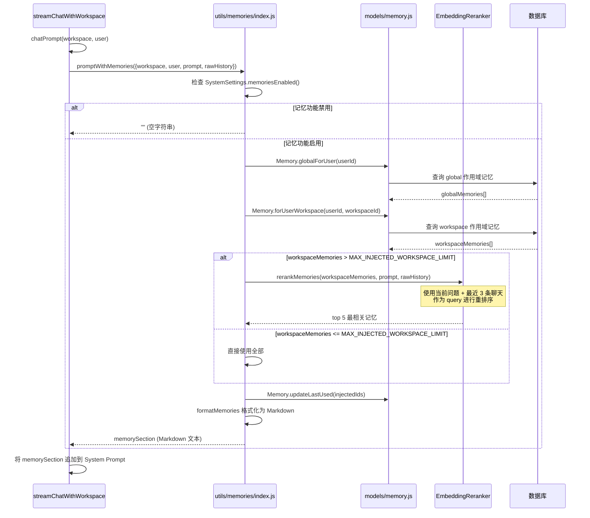

# 03-08 记忆系统流程

> **所属章节**: [03-系统流程与时序图](./03-系统流程与时序图.md)  
> **流程类型**: 自动记忆提取、手动记忆管理、记忆检索注入、记忆重排序  
> **核心文件**: `server/models/memory.js`、`server/jobs/extract-memories.js`、`server/jobs/helpers/memory-extraction-utils.js`、`server/utils/memories/index.js`、`server/endpoints/memory.js`

---

## 1. 流程概述

AnythingLLM 的 **记忆系统（Memories）** 实现了跨会话的个性化上下文注入。系统通过两种方式积累记忆：

1. **自动记忆提取**：后台 job 定期扫描聊天历史，使用 LLM 提取关键事实并存入向量库。
2. **用户手动记忆**：用户可手动添加、编辑、删除记忆条目。

记忆在聊天时通过 **向量检索 + 重排序** 注入 LLM 的 System Prompt，使模型能够「记住」用户偏好、项目背景、历史决策等信息。

记忆分为两个作用域：
- **全局记忆（global）**：跨所有工作空间生效（最多 5 条）
- **工作空间记忆（workspace）**：仅在特定工作空间生效（最多 20 条，注入时最多 5 条）

---

## 2. 流程图 — 自动记忆提取管线（L3）

```mermaid
flowchart TD
    Start([extract-memories job 启动]) --> CheckEnabled{autoMemoriesEnabled?}
    CheckEnabled -- 否 --> Exit1[退出]
    CheckEnabled -- 是 --> LoadUnprocessed[加载未处理的聊天<br/>memoryProcessed=null, include=true]
    LoadUnprocessed --> HasChats{有未处理聊天?}
    HasChats -- 否 --> Exit2[退出]
    HasChats -- 是 --> GroupByUW[按 userId+workspaceId 分组]
    GroupByUW --> LoopGroups{还有未处理组?}
    LoopGroups -- 否 --> Complete[完成]
    LoopGroups -- 是 --> CheckMinCount{聊天数 >=<br/>MIN_CHATS_TO_PROCESS?}
    CheckMinCount -- 否 --> NextGroup1[跳过该组]
    CheckMinCount -- 是 --> CheckActive{用户仍活跃?<br/>(最近聊天在阈值内)}
    CheckActive -- 是 --> NextGroup2[跳过该组]
    CheckActive -- 否 --> Phase1[Phase 1: Observer<br/>提取候选事实]
    Phase1 --> Phase2[Phase 2: Reflector<br/>分类作用域、去重、过滤]
    Phase2 --> ApplyMemories[应用记忆: 新增/更新/删除]
    ApplyMemories --> MarkProcessed[标记聊天为 memoryProcessed=true]
    MarkProcessed --> LoopGroups
```

---

## 3. 时序图 — 记忆注入聊天流程（L2）



---

## 4. 详细步骤说明

### 4.1 自动记忆提取（两阶段管线）

记忆提取 job（`server/jobs/extract-memories.js`）采用 **两阶段提取** 架构：

#### Phase 1: Observer（观察者）

- **输入**：用户与工作空间的一组未处理聊天（至少 5 条）。
- **处理**：使用 LLM（由系统设置决定）分析聊天内容，提取候选事实。
- **输出**：一组候选记忆条目（每条包含 `content` 和 `type`）。
- **关键函数**：`buildObserverUserMessage()` + `runObserver()`

#### Phase 2: Reflector（反思者）

- **输入**：Phase 1 的候选记忆 + 现有记忆列表。
- **处理**：
  1. **作用域分类**：判断每条记忆应属于 `global` 还是 `workspace`。
  2. **去重**：与现有记忆对比，避免重复存储。
  3. **过滤**：丢弃无关或低质量记忆。
- **输出**：最终的记忆操作列表（新增/更新/删除）。
- **关键函数**：`buildReflectorUserMessage()` + `runReflector()`

#### 应用记忆

- **新增**：`Memory.create({userId, workspaceId, scope, content})`
- **更新**：`Memory.update(id, {content})`
- **删除**：`Memory.delete(id)`

### 4.2 手动记忆管理

用户通过前端界面手动管理记忆：

| 操作 | API | 说明 |
|------|-----|------|
| 列出记忆 | `GET /workspaces/:slug/memories` | 返回 global + workspace 记忆 |
| 创建记忆 | `POST /workspaces/:slug/memories` | `{content, scope}` |
| 更新记忆 | `PUT /workspaces/:slug/memories/:memoryId` | `{content}` |
| 删除记忆 | `DELETE /workspaces/:slug/memories/:memoryId` | — |

### 4.3 记忆检索注入

`promptWithMemories()` 函数（`server/utils/memories/index.js`）在每次聊天时被调用：

1. **功能开关检查**：`SystemSettings.memoriesEnabled()` 检查管理员是否启用记忆功能。
2. **加载记忆**：
   - 全局记忆：`Memory.globalForUser(userId)`（最多 5 条）
   - 工作空间记忆：`Memory.forUserWorkspace(userId, workspaceId)`（最多 20 条）
3. **重排序**：当 workspace 记忆超过 5 条时，使用 `NativeEmbeddingReranker` 对记忆进行重排序，选出与当前问题最相关的 5 条。
4. **格式化**：将记忆格式化为 Markdown 段落：
   ```markdown
   ## User Memories
   - 用户偏好使用 Python 进行数据分析
   - 当前项目使用 PostgreSQL 作为主数据库
   ```
5. **注入**：将格式化后的记忆追加到 System Prompt 末尾。
6. **更新使用时间**：`Memory.updateLastUsed(injectedIds)` 更新记忆的最后使用时间（用于 LRU 淘汰）。

### 4.4 记忆作用域与限额

| 作用域 | 限额 | 说明 |
|--------|------|------|
| `global` | 5 条 | 跨所有工作空间共享 |
| `workspace` | 20 条 | 仅当前工作空间 |
| 注入时 workspace 上限 | 5 条 | 避免 System Prompt 过长 |

---

## 5. 涉及文件与函数索引

| 文件 | 关键函数/方法 | 职责 |
|------|-------------|------|
| `server/models/memory.js` | `Memory.create()`、`Memory.globalForUser()`、`Memory.forUserWorkspace()`、`Memory.updateLastUsed()` | 记忆 CRUD |
| `server/jobs/extract-memories.js` | `processGroup()`、`isGroupActive()` | 自动提取主逻辑 |
| `server/jobs/helpers/memory-extraction-utils.js` | `groupByUserWorkspace()`、`runObserver()`、`runReflector()`、`resolveLLM()` | 两阶段提取辅助 |
| `server/utils/memories/index.js` | `promptWithMemories()`、`getMemoriesForPrompt()`、`rerankMemories()` | 记忆检索注入 |
| `server/utils/EmbeddingRerankers/native/index.js` | `NativeEmbeddingReranker.rerank()` | 记忆重排序 |
| `server/endpoints/memory.js` | `memoryEndpoints()` | 记忆管理 API |

---

## 6. 异常处理

| 异常场景 | 处理方式 |
|---------|---------|
| 记忆功能禁用 | `promptWithMemories()` 返回空字符串 |
| 无未处理聊天 | 提取 job 直接退出 |
| 聊天数不足 | 跳过该用户/工作空间组 |
| 用户仍活跃（最近聊天在阈值内） | 跳过，等待用户停止聊天 |
| LLM 提取失败 | 记录错误，跳过该组 |
| 重排序失败 | 回退到按创建时间取最新 |
| 记忆超过限额 | 拒绝创建，返回错误 |

---

**返回 → [03-系统流程与时序图.md](./03-系统流程与时序图.md)** | **上一子文件 ← [03-07-定时任务流程.md](./03-07-定时任务流程.md)** | **返回章节索引 → [03-系统流程与时序图.md](./03-系统流程与时序图.md)**

---

☕️ 制作不易，请我喝咖啡☕️关注我➕