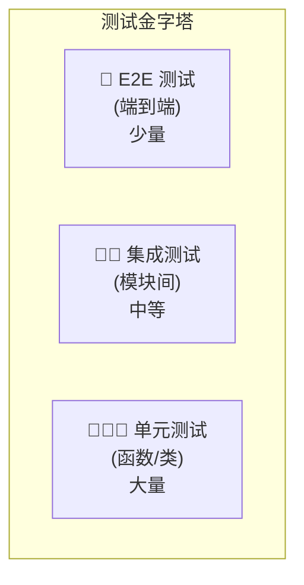

# 10-04 测试策略与用例

> **所属章节**: [10-额外增强内容](./10-额外增强内容.md)

---

## 1. 测试策略

### 1.1 测试金字塔



### 1.2 当前测试覆盖

| 层级 | 框架 | 覆盖范围 | 状态 |
|------|------|---------|------|
| 单元测试 | Jest 29 | `server/__tests__/`、`collector/__tests__/` | ⚠️ 部分覆盖 |
| 集成测试 | Jest 29 | 端到端 API 测试 | ❌ 无 |
| E2E 测试 | — | 浏览器自动化 | ❌ 无 |

### 1.3 推荐测试策略

| 层级 | 目标覆盖 | 工具 | 优先级 |
|------|---------|------|--------|
| 单元测试 | 80%+ | Jest | P0 |
| 集成测试 | 核心流程 | Jest + Supertest | P1 |
| E2E 测试 | 关键用户旅程 | Playwright | P2 |
| 性能测试 | 关键路径 | k6 / Artillery | P2 |
| 安全测试 | OWASP Top 10 | OWASP ZAP | P1 |

---

## 2. 单元测试

### 2.1 测试配置

```javascript
// jest.config.cjs
module.exports = {
  testEnvironment: "node",
  testMatch: ["**/__tests__/**/*.test.js"],
  collectCoverageFrom: [
    "server/**/*.js",
    "!server/storage/**",
    "!server/prisma/migrations/**",
  ],
  coverageThresholds: {
    global: {
      branches: 70,
      functions: 80,
      lines: 80,
      statements: 80,
    },
  },
};
```

### 2.2 模型层测试示例

```javascript
// server/__tests__/models/user.test.js
const { User } = require("../../models/user");

describe("User Model", () => {
  describe("create()", () => {
    test("should create user with valid data", async () => {
      const result = await User.create({
        username: "testuser",
        password: "ValidPass123!",
      });
      expect(result.user).toBeDefined();
      expect(result.user.username).toBe("testuser");
      expect(result.user.role).toBe("default");
    });

    test("should reject duplicate username", async () => {
      await User.create({ username: "duplicate", password: "Pass123!" });
      const result = await User.create({ username: "duplicate", password: "Pass123!" });
      expect(result.error).toBeDefined();
      expect(result.user).toBeNull();
    });

    test("should reject weak password", async () => {
      const result = await User.create({ username: "weakpass", password: "123" });
      expect(result.error).toBeDefined();
    });

    test("should reject invalid username format", async () => {
      const result = await User.create({ username: "123start", password: "Pass123!" });
      expect(result.error).toBeDefined();
    });
  });

  describe("authenticate()", () => {
    test("should authenticate with correct credentials", async () => {
      await User.create({ username: "authuser", password: "CorrectPass123!" });
      const result = await User.authenticate({
        username: "authuser",
        password: "CorrectPass123!",
      });
      expect(result.user).toBeDefined();
      expect(result.error).toBeNull();
    });

    test("should reject incorrect password", async () => {
      await User.create({ username: "authuser2", password: "CorrectPass123!" });
      const result = await User.authenticate({
        username: "authuser2",
        password: "WrongPass123!",
      });
      expect(result.error).toBeDefined();
    });
  });

  describe("canSendChat()", () => {
    test("should allow when under daily limit", async () => {
      const user = { dailyMessageLimit: 10 };
      const result = await User.canSendChat(user);
      expect(result).toBe(true);
    });

    test("should reject when over daily limit", async () => {
      const user = { dailyMessageLimit: 0 };
      const result = await User.canSendChat(user);
      expect(result).toBe(false);
    });
  });
});
```

### 2.3 向量数据库测试示例

```javascript
// server/__tests__/utils/vectorDbProviders/base.test.js
const { getVectorDbClass } = require("../../../utils/helpers");

describe("VectorDB Provider", () => {
  let VectorDB;

  beforeAll(() => {
    VectorDB = getVectorDbClass();
  });

  describe("namespace operations", () => {
    test("should create and check namespace", async () => {
      const hasNs = await VectorDB.hasNamespace("test-ns");
      expect(typeof hasNs).toBe("boolean");
    });

    test("should count vectors in namespace", async () => {
      const count = await VectorDB.namespaceCount("test-ns");
      expect(typeof count).toBe("number");
    });
  });

  describe("similarity search", () => {
    test("should return results in correct format", async () => {
      const results = await VectorDB.similaritySearch({
        namespace: "test-ns",
        input: new Array(1536).fill(0.1), // 测试向量
        topN: 4,
      });
      expect(Array.isArray(results)).toBe(true);
      results.forEach(r => {
        expect(r).toHaveProperty("pageContent");
        expect(r).toHaveProperty("metadata");
        expect(r).toHaveProperty("score");
      });
    });
  });
});
```

### 2.4 Collector 测试示例

```javascript
// collector/__tests__/utils/constants.test.js
const { SUPPORTED_FILETYPE_CONVERTERS, ACCEPTED_MIMES } = require("../../utils/constants");

describe("Constants", () => {
  test("should have converter for PDF", () => {
    expect(SUPPORTED_FILETYPE_CONVERTERS).toHaveProperty(".pdf");
  });

  test("should have converter for DOCX", () => {
    expect(SUPPORTED_FILETYPE_CONVERTERS).toHaveProperty(".docx");
  });

  test("should have accepted MIME for text", () => {
    expect(ACCEPTED_MIMES).toContain("text/plain");
  });
});
```

---

## 3. 集成测试

### 3.1 API 端到端测试

```javascript
// server/__tests__/integration/chat.test.js
const request = require("supertest");
const app = require("../../index");

describe("Chat API", () => {
  let authToken;

  beforeAll(async () => {
    // 登录获取 Token
    const res = await request(app)
      .post("/api/login")
      .send({ username: "admin", password: "password" });
    authToken = res.headers["set-cookie"];
  });

  describe("POST /api/workspace/:slug/stream-chat", () => {
    test("should return SSE stream", async () => {
      const res = await request(app)
        .post("/api/workspace/test-ws/stream-chat")
        .set("Cookie", authToken)
        .send({ message: "Hello" })
        .expect(200)
        .expect("Content-Type", /text\/event-stream/);
    });

    test("should reject empty message", async () => {
      await request(app)
        .post("/api/workspace/test-ws/stream-chat")
        .set("Cookie", authToken)
        .send({ message: "" })
        .expect(400);
    });

    test("should reject unauthorized access", async () => {
      await request(app)
        .post("/api/workspace/test-ws/stream-chat")
        .send({ message: "Hello" })
        .expect(401);
    });
  });
});
```

### 3.2 数据库集成测试

```javascript
// server/__tests__/integration/database.test.js
const prisma = require("../../utils/prisma");

describe("Database Integration", () => {
  afterAll(async () => {
    await prisma.$disconnect();
  });

  test("should connect to database", async () => {
    await expect(prisma.$connect()).resolves.not.toThrow();
  });

  test("should create and query workspace", async () => {
    const ws = await prisma.workspaces.create({
      data: { name: "Test WS", slug: `test-${Date.now()}` },
    });
    expect(ws.id).toBeDefined();

    const found = await prisma.workspaces.findUnique({
      where: { id: ws.id },
    });
    expect(found.name).toBe("Test WS");

    // 清理
    await prisma.workspaces.delete({ where: { id: ws.id } });
  });
});
```

---

## 4. 主要测试用例清单

### 4.1 认证与授权

| 用例 | 描述 | 预期结果 |
|------|------|---------|
| TC-AUTH-001 | 正确凭据登录 | 返回 200 + Session Cookie |
| TC-AUTH-002 | 错误密码登录 | 返回 401 |
| TC-AUTH-003 | 访问受保护端点无 Token | 返回 401 |
| TC-AUTH-004 | 使用 API Key 访问 | 返回 200 |
| TC-AUTH-005 | 普通用户访问管理员端点 | 返回 403 |
| TC-AUTH-006 | 暂停用户登录 | 返回 403 |

### 4.2 工作空间管理

| 用例 | 描述 | 预期结果 |
|------|------|---------|
| TC-WS-001 | 创建工作空间 | 返回 200 + workspace 对象 |
| TC-WS-002 | 重复 slug 创建 | 返回 400 |
| TC-WS-003 | 更新工作空间 | 返回 200 + 更新后对象 |
| TC-WS-004 | 删除工作空间 | 返回 200，数据已删除 |
| TC-WS-005 | 非管理员创建工作空间 | 返回 403 |

### 4.3 文档管理

| 用例 | 描述 | 预期结果 |
|------|------|---------|
| TC-DOC-001 | 上传 PDF 文档 | 返回 200，文档出现在列表 |
| TC-DOC-002 | 上传不支持的格式 | 返回 400 |
| TC-DOC-003 | 删除文档 | 返回 200，向量已删除 |
| TC-DOC-004 | 上传超大文件 | 返回 413 |

### 4.4 聊天

| 用例 | 描述 | 预期结果 |
|------|------|---------|
| TC-CHAT-001 | 发送聊天消息 | 返回 SSE 流，包含回答 |
| TC-CHAT-002 | 空消息 | 返回 400 |
| TC-CHAT-003 | query 模式无数据 | 返回拒绝响应 |
| TC-CHAT-004 | 超过每日限额 | 返回错误 |
| TC-CHAT-005 | 多轮对话 | 聊天历史正确传递 |

### 4.5 向量检索

| 用例 | 描述 | 预期结果 |
|------|------|---------|
| TC-VEC-001 | 相似度检索 | 返回 Top-N 结果 |
| TC-VEC-002 | 阈值过滤 | 低于阈值的结果被排除 |
| TC-VEC-003 | 空命名空间检索 | 返回空结果 |
| TC-VEC-004 | 批量插入向量 | 所有向量入库 |

### 4.6 Agent

| 用例 | 描述 | 预期结果 |
|------|------|---------|
| TC-AGENT-001 | 触发 Agent 聊天 | WebSocket 连接成功 |
| TC-AGENT-002 | 工具调用 | 工具正确执行并返回结果 |
| TC-AGENT-003 | 达到最大轮次 | Agent 终止并返回警告 |
| TC-AGENT-004 | 用户中断 | Agent 立即停止 |

---

## 5. 性能测试

### 5.1 关键指标

| 指标 | 目标 | 测试工具 |
|------|------|---------|
| 聊天首 Token 延迟 | < 2s（本地）/ < 5s（云端） | k6 |
| 向量检索延迟 | < 100ms | k6 |
| 文档处理吞吐 | > 10 文档/分钟 | Artillery |
| 并发用户 | > 100 | k6 |
| 内存使用 | < 2GB（空闲）/ < 4GB（负载） | 内置监控 |

### 5.2 k6 测试脚本示例

```javascript
// performance/chat-load.test.js
import http from "k6/http";
import { check, sleep } from "k6";

export const options = {
  stages: [
    { duration: "1m", target: 10 },   // 逐步增加到 10 用户
    { duration: "3m", target: 50 },   // 保持 50 用户
    { duration: "1m", target: 0 },    // 逐步减少
  ],
  thresholds: {
    http_req_duration: ["p(95)<5000"], // 95% 请求 < 5s
    http_req_failed: ["rate<0.01"],    // 错误率 < 1%
  },
};

export default function () {
  const res = http.post(
    "http://localhost:3001/api/workspace/test-ws/stream-chat",
    JSON.stringify({ message: "Hello, how are you?" }),
    { headers: { "Content-Type": "application/json" } }
  );

  check(res, {
    "status is 200": (r) => r.status === 200,
    "response time < 5s": (r) => r.timings.duration < 5000,
  });

  sleep(1);
}
```

---

## 6. 测试覆盖率提升计划

| 阶段 | 目标 | 行动 |
|------|------|------|
| 阶段 1 | 50% | 补充模型层测试 |
| 阶段 2 | 70% | 补充端点层测试 |
| 阶段 3 | 80% | 补充服务层测试 |
| 阶段 4 | 85% | 补充集成测试 |

### 优先测试文件

1. `server/models/*.js`（数据模型）
2. `server/utils/chats/*.js`（聊天引擎）
3. `server/utils/EncryptionManager/*.js`（加密）
4. `server/utils/vectorDbProviders/base.js`（向量库）
5. `collector/processSingleFile/index.js`（文档处理）

---

**返回 → [10-额外增强内容.md](./10-额外增强内容.md)** | **上一子文件 ← [10-03-核心算法分析.md](./10-03-核心算法分析.md)**

---

☕️ 制作不易，请我喝咖啡☕️关注我➕