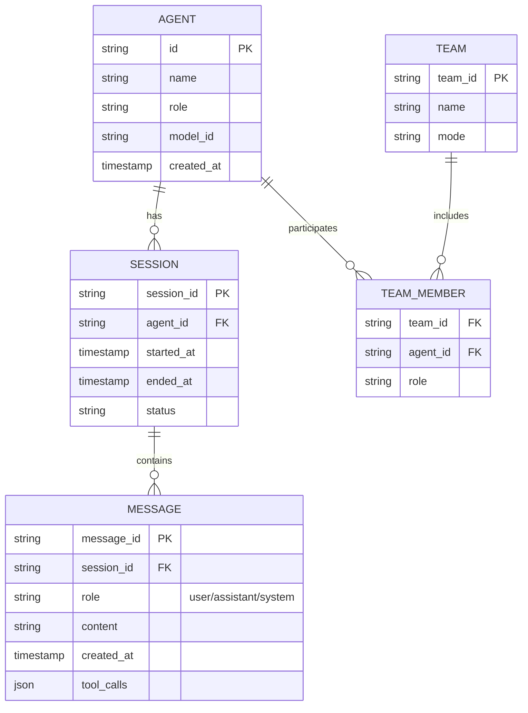
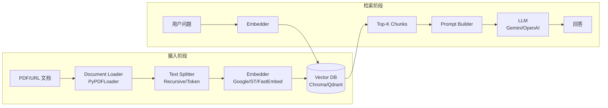
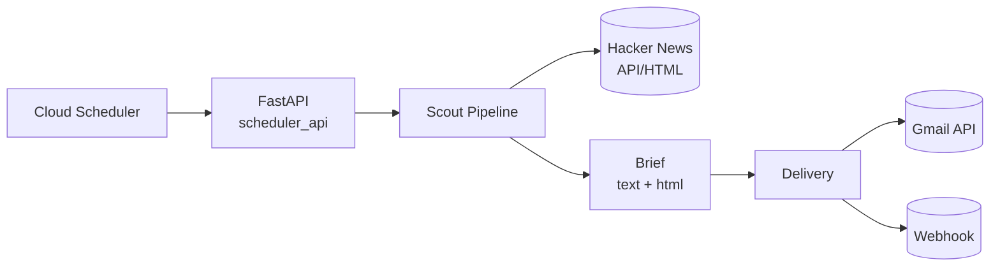

# 6. 数据模型与数据库设计（Data Model & Database Design）

> **文档版本**：v1.0  
> **覆盖范围**：关系型数据（SQLite）、向量数据（Chroma/Qdrant）、文件型数据、缓存策略、事务设计、数据流向

---

## 6.0 数据存储全景

Awesome LLM Apps 的数据存储分为 **4 大类**：

| 存储类型 | 技术 | 用途 | 代表子项目 |
|---------|------|------|----------|
| **关系型数据库** | SQLite (agno.db) | Agent 记忆、会话历史、团队状态 | finance_agent_team, 多数 Agno 模板 |
| **向量数据库** | Chroma (本地文件) | 文档嵌入存储、相似度检索 | rag_chain, hybrid_search_rag |
| **向量数据库** | Qdrant (本地/云端) | 文档嵌入存储、混合搜索、语音 RAG | voice_rag_openaisdk, qwen_local_rag |
| **文件型数据** | ICS / JSONL / 临时文件 | 日历导出、日志、PDF 处理 | travel_agent, MCP-Agent |
| **内存/会话** | Streamlit session_state | 用户会话状态、UI 状态 | 所有 Streamlit 模板 |

---

## 6.1 关系型数据模型（SQLite）

### 6.1.1 ER 图



### 6.1.2 表结构详解

#### agents 表

| 字段 | 类型 | 约束 | 说明 |
|------|------|------|------|
| id | TEXT | PK | Agent 唯一标识（UUID） |
| name | TEXT | NOT NULL | Agent 名称（如 "Web Agent"） |
| role | TEXT | | Agent 角色描述 |
| model_id | TEXT | | 使用的模型 ID |
| created_at | TIMESTAMP | DEFAULT NOW | 创建时间 |

#### sessions 表

| 字段 | 类型 | 约束 | 说明 |
|------|------|------|------|
| session_id | TEXT | PK | 会话唯一标识 |
| agent_id | TEXT | FK → agents.id | 关联 Agent |
| started_at | TIMESTAMP | | 会话开始时间 |
| ended_at | TIMESTAMP | | 会话结束时间 |
| status | TEXT | | active/closed/error |

#### messages 表

| 字段 | 类型 | 约束 | 说明 |
|------|------|------|------|
| message_id | TEXT | PK | 消息唯一标识 |
| session_id | TEXT | FK → sessions.session_id | 关联会话 |
| role | TEXT | NOT NULL | user/assistant/system |
| content | TEXT | | 消息内容 |
| tool_calls | JSON | | 工具调用记录 |
| created_at | TIMESTAMP | DEFAULT NOW | 创建时间 |

#### teams 表

| 字段 | 类型 | 约束 | 说明 |
|------|------|------|------|
| team_id | TEXT | PK | 团队唯一标识 |
| name | TEXT | NOT NULL | 团队名称 |
| mode | TEXT | | 协作模式（hierarchical/collaborative） |

#### team_members 表

| 字段 | 类型 | 约束 | 说明 |
|------|------|------|------|
| team_id | TEXT | FK → teams.team_id | 团队 ID |
| agent_id | TEXT | FK → agents.id | Agent ID |
| role | TEXT | | 成员角色 |

### 6.1.3 索引设计

```sql
-- 加速按 Agent 查询会话
CREATE INDEX idx_sessions_agent_id ON sessions(agent_id);

-- 加速按会话查询消息
CREATE INDEX idx_messages_session_id ON messages(session_id);

-- 加速按时间范围查询
CREATE INDEX idx_messages_created_at ON messages(created_at);

-- 加速团队查询
CREATE INDEX idx_team_members_team_id ON team_members(team_id);
```

### 6.1.4 使用示例（Agno SqliteDb）

```python
from agno.db.sqlite import SqliteDb

# 创建/连接数据库
db = SqliteDb(db_file="agents.db")

# Agent 自动使用数据库存储记忆
agent = Agent(
    name="Finance Agent",
    db=db,
    add_history_to_context=True,  # 自动将历史注入上下文
)
```

---

## 6.2 向量数据模型（Chroma）

### 6.2.1 集合设计

#### pharma_database 集合（rag_chain）

```python
db = Chroma(
    collection_name="pharma_database",
    embedding_function=embedding_model,
    persist_directory='./pharma_db'
)
```

| 字段 | 类型 | 说明 |
|------|------|------|
| id | string | 文档块唯一标识（自动生成） |
| document | string | 文档块文本内容 |
| embedding | List[float] | 向量嵌入（维度由模型决定） |
| metadata | dict | 元数据（page, source, doc_id 等） |

#### metadata 结构

```json
{
    "page": 1,
    "source": "document.pdf",
    "doc_id": "doc_001",
    "chunk_index": 5,
    "total_chunks": 120
}
```

### 6.2.2 嵌入模型配置

| 模型 | 维度 | 距离度量 | 使用场景 |
|------|------|---------|---------|
| Google GenerativeAI (embedding-001) | 768 | cosine | rag_chain, hybrid_search_rag |
| Sentence Transformers (all-mpnet-base-v2) | 768 | cosine | 本地嵌入 |
| FastEmbed | 384 | cosine | voice_rag_openaisdk |

### 6.2.3 检索配置

```python
# 基础检索
retriever = db.as_retriever(
    search_type="similarity",
    search_kwargs={"k": 5}  # 返回 top-5
)

# 混合检索（hybrid_search_rag）
retriever = db.as_retriever(
    search_type="mmr",  # Maximal Marginal Relevance
    search_kwargs={"k": 5, "lambda_mult": 0.5}
)
```

---

## 6.3 向量数据模型（Qdrant）

### 6.3.1 集合设计

#### voice-rag-agent 集合（voice_rag_openaisdk）

```python
COLLECTION_NAME = "voice-rag-agent"

client.create_collection(
    collection_name=COLLECTION_NAME,
    vectors_config=VectorParams(
        size=embedding_dim,  # FastEmbed 维度
        distance=Distance.COSINE
    )
)
```

### 6.3.2 Point 结构

```python
models.PointStruct(
    id=str(uuid.uuid4()),           # 唯一标识
    vector=embedding.tolist(),      # 向量
    payload={                       # 载荷
        "content": doc.page_content,
        "source_type": "pdf",
        "file_name": file.name,
        "timestamp": datetime.now().isoformat()
    }
)
```

### 6.3.3 检索配置

```python
# 相似度搜索
results = client.search(
    collection_name=COLLECTION_NAME,
    query_vector=embedding.tolist(),
    limit=5
)

# 带过滤的搜索
results = client.search(
    collection_name=COLLECTION_NAME,
    query_vector=embedding.tolist(),
    query_filter=models.Filter(
        must=[
            models.FieldCondition(
                key="source_type",
                match=models.MatchValue(value="pdf")
            )
        ]
    ),
    limit=5
)
```

---

## 6.4 文件型数据模型

### 6.4.1 ICS 日历文件（travel_agent）

```
Calendar
├── prodid: "-//AI Travel Planner//github.com//"
├── version: "2.0"
└── Events[]
    ├── Event
    │   ├── summary: "Day 1 Itinerary"
    │   ├── description: "Visit the Eiffel Tower..."
    │   ├── dtstart: 2026-07-26
    │   ├── dtend: 2026-07-26
    │   └── dtstamp: 2026-07-26T10:00:00
    ├── Event
    │   ├── summary: "Day 2 Itinerary"
    │   └── ...
    └── ...
```

### 6.4.2 JSONL 日志（MCP-Agent）

```
logs/mcp-agent-20260726_100000.jsonl
{"timestamp": "...", "level": "info", "message": "Connected to playwright"}
{"timestamp": "...", "level": "debug", "message": "Tool call: navigate"}
{"timestamp": "...", "level": "info", "message": "Agent completed"}
```

### 6.4.3 工作流定义（DevPulse）

```json
{
    "name": "signal-intelligence-pipeline",
    "version": "1.0",
    "stages": [
        {"name": "collect", "type": "adapter", "sources": ["github", "arxiv", "hackernews", "medium", "huggingface"]},
        {"name": "normalize", "type": "utility", "class": "SignalCollector"},
        {"name": "score", "type": "agent", "model": "gpt-4.1-mini"},
        {"name": "assess_risk", "type": "agent", "model": "gpt-4.1-mini"},
        {"name": "synthesize", "type": "agent", "model": "gpt-4.1"}
    ]
}
```

---

## 6.5 内存/会话数据模型（Streamlit session_state）

### 6.5.1 通用 session_state 结构

```python
# 所有 Streamlit 模板共享的 session_state 模式
st.session_state = {
    # 初始化标志
    "initialized": False,
    "setup_complete": False,
    
    # API 配置
    "openai_api_key": "",
    "serp_api_key": "",
    
    # 会话数据
    "itinerary": None,           # travel_agent
    "processed_documents": [],   # voice_rag
    
    # 处理状态
    "is_processing": False,
    
    # Agent 实例（缓存）
    "agent": None,
    "llm": None,
}
```

### 6.5.2 各模板特有 session_state

| 模板 | 特有 session_state 字段 |
|------|----------------------|
| travel_agent | `itinerary` |
| rag_chain | `db`（Chroma 实例） |
| voice_rag | `qdrant_url`, `qdrant_api_key`, `selected_voice`, `processor_agent`, `tts_agent` |
| browser_mcp_agent | `mcp_app`, `mcp_context`, `browser_agent`, `loop` |
| deep_research | `openai_api_key`, `firecrawl_api_key` |
| devpulse | 无（CLI 运行，不使用 session_state） |

---

## 6.6 缓存策略

### 6.6.1 缓存层级

| 层级 | 技术 | TTL | 用途 |
|------|------|-----|------|
| **浏览器缓存** | Streamlit `@st.cache_data` | 默认 | 缓存函数结果 |
| **内存缓存** | Python dict / session_state | 会话级 | 缓存 Agent 实例、数据库连接 |
| **磁盘缓存** | Chroma persist_directory | 永久 | 向量数据持久化 |
| **磁盘缓存** | SQLite | 永久 | 会话历史持久化 |
| **API 缓存** | 无（依赖提供商） | — | LLM 响应无缓存 |

### 6.6.2 缓存最佳实践

```python
# Streamlit 数据缓存
@st.cache_data(ttl=3600)
def load_data(url):
    return requests.get(url).json()

# Agent 实例缓存（session_state）
if "agent" not in st.session_state:
    st.session_state.agent = Agent(name="...", model=...)

# Chroma 向量缓存（持久化到磁盘）
db = Chroma(
    collection_name="my_db",
    persist_directory="./chroma_db"  # 重启后数据保留
)
```

### 6.6.3 缓存失效策略

| 数据 | 失效策略 |
|------|---------|
| 向量数据 | 手动删除或更新文档 |
| 会话历史 | 会话结束时关闭 |
| session_state | 页面刷新时重置 |
| ICS 文件 | 每次重新生成 |

---

## 6.7 事务设计

### 6.7.1 事务边界

Awesome LLM Apps 的事务设计相对简单，因为：
1. 多数模板是单用户、单进程
2. 外部 API 调用（LLM/搜索）不可回滚
3. SQLite 支持基本事务但使用有限

### 6.7.2 关键事务场景

| 场景 | 事务策略 | 实现 |
|------|---------|------|
| 向量文档摄入 | 批量写入 | `db.add_documents(chunks)` |
| Agent 会话记录 | 逐条写入 | 框架自动管理 |
| ICS 文件生成 | 无事务（一次性生成） | `cal.to_ical()` |
| 邮件投递 | 无事务（尽力而为） | `send_gmail()` |

### 6.7.3 SQLite 事务示例

```python
# Agno SqliteDb 内部使用 SQLite 事务
import sqlite3

conn = sqlite3.connect("agents.db")
try:
    conn.execute("INSERT INTO sessions ...", (...))
    conn.execute("INSERT INTO messages ...", (...))
    conn.commit()
except Exception:
    conn.rollback()
    raise
finally:
    conn.close()
```

---

## 6.8 数据流向图

### 6.8.1 RAG 数据流向



### 6.8.2 Agent 记忆数据流向

```mermaid
flowchart LR
    USER[用户输入] --> AGENT[Agent<br/>Agent.run()]
    AGENT --> LLM_API[LLM API<br/>OpenAI/Gemini]
    AGENT --> TOOLS[Tools<br/>SerpAPI/YFinance]
    LLM_API --> AGENT
    TOOLS --> AGENT
    AGENT --> DB[(SQLite<br/>agents.db)]
    DB --> AGENT
    AGENT --> OUTPUT[响应输出]
```

### 6.8.3 Always-on Agent 数据流向



---

## 6.9 数据模型总结

### 6.9.1 设计优点

1. **简单可靠**：SQLite 零配置，适合单用户模板
2. **灵活切换**：Chroma/Qdrant 可按需选择
3. **持久化**：向量数据库和 SQLite 支持磁盘持久化
4. **无供应商锁定**：数据存储在本地，可迁移

### 6.9.2 设计缺点

1. **无统一数据层**：每个模板独立实现数据访问
2. **无数据迁移工具**：schema 变更无版本管理
3. **无备份策略**：依赖 git 或手动备份
4. **向量库无副本**：Chroma 单节点，无高可用

### 6.9.3 改进建议

1. 统一数据访问层（Repository Pattern）
2. 添加数据迁移工具（Alembic）
3. 实现自动备份策略
4. 向量数据库支持远程/云端部署
5. 添加数据保留策略（自动清理旧会话）

---

> **下一章**：[07-API与接口设计.md](./07-API与接口设计.md) — 对外/内部 API 列表、请求响应示例、认证限流。

---

☕️ 制作不易，请我喝咖啡☕️关注我➕