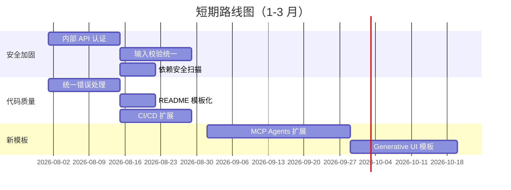

# 9. 改进建议、风险点与未来规划（Improvement Recommendations, Risks & Future Roadmap）

> **文档版本**：v1.0  
> **分析维度**：架构优缺点、可扩展性、安全加固、性能优化、重构建议、技术债清单、未来路线图

---

## 9.0 评估方法论

本章基于对 awesome-llm-apps 全量代码的深入分析，从以下维度提出改进建议：

| 维度 | 评估标准 |
|------|---------|
| **架构设计** | 模块化、可扩展性、关注点分离 |
| **代码质量** | 可读性、一致性、错误处理、测试覆盖 |
| **安全性** | 认证、授权、输入校验、密钥管理 |
| **性能** | 延迟、吞吐量、资源效率 |
| **可维护性** | 文档、依赖管理、CI/CD |
| **可观测性** | 日志、监控、追踪 |

---

## 9.1 架构优点详细分析

### 9.1.1 模板化 Cookbook 模式

| 优点 | 说明 | 影响 |
|------|------|------|
| **自包含** | 每个子项目独立可运行，有独立 requirements.txt/README | 降低上手门槛，支持单独 fork |
| **渐进式复杂度** | Starter → Advanced → Multi-agent → Always-on | 清晰的学习路径 |
| **Provider-agnostic** | 通过配置切换 LLM 提供商 | 避免供应商锁定 |
| **多框架并存** | Agno/ADK/CrewAI/LangGraph/OpenAI SDK | 接触不同设计哲学 |
| **教学友好** | Unwind AI 教程 + 清晰 README | 降低学习曲线 |

### 9.1.2 设计模式应用

| 模式 | 应用 | 代表实现 |
|------|------|---------|
| **Pipeline** | 数据获取→过滤→排序→渲染 | scout.py, rag_chain |
| **Strategy** | 模型/工具/向量库可替换 | Agent(model=), VectorStore |
| **Facade** | 简化复杂子系统调用 | AgentOS, LlmAgent |
| **Mediator** | 多 Agent 协调 | Team, CrewAI |
| **Builder** | 逐步构建复杂对象 | render_brief(), generate_ics |
| **Value Object** | 不可变数据对象 | Story, Brief (frozen dataclass) |

### 9.1.3 关键设计决策评估

| 决策 | 评估 | 理由 |
|------|------|------|
| **Agent 只用于需要推理的地方** | ⭐⭐⭐⭐⭐ 优秀 | SignalCollector 是纯工具类，因为收集是确定性转换；避免不必要的 LLM 调用，降低成本 |
| **frozen dataclass** | ⭐⭐⭐⭐ 良好 | 不可变保证线程安全，但缺乏校验能力（可用 Pydantic 增强） |
| **Streamlit 优先** | ⭐⭐⭐⭐ 良好 | 降低前端门槛，但复杂 UI 需 Next.js |
| **多框架并存** | ⭐⭐⭐⭐ 良好 | 覆盖面广，但增加学习成本和维护负担 |
| **自包含子项目** | ⭐⭐⭐⭐⭐ 优秀 | 独立可运行，但导致工具函数重复 |

---

## 9.2 架构缺点详细分析

### 9.2.1 代码复用不足

| 问题 | 影响范围 | 严重度 |
|------|---------|--------|
| **工具函数重复** | `format_docs()` 在多个 RAG 模板中重复实现 | 中 |
| **Agent 配置重复** | 每个模板独立定义 Agent(name, role, model, tools) | 低 |
| **UI 模式重复** | Streamlit 输入框/按钮模式重复 | 低 |
| **错误处理重复** | 每个模板独立实现 try/except | 中 |

**示例**：`format_docs()` 在 rag_chain、hybrid_search_rag、local_rag_agent 中重复实现：
```python
def format_docs(docs):
    return "\n\n".join(doc.page_content for doc in docs)
```

### 9.2.2 依赖管理分散

| 问题 | 影响 |
|------|------|
| **版本不一致** | openai 1.x ~ 2.x, langchain 0.x ~ 1.x 共存 |
| **无统一约束** | 53 个 requirements.txt 各自为政 |
| **无安全扫描** | 无 Dependabot / Snyk 配置 |
| **无 lockfile** | 多数模板无 Pipfile.lock / poetry.lock |

### 9.2.3 测试覆盖不足

| 问题 | 现状 | 目标 |
|------|------|------|
| **单元测试** | 仅 1-2 个子项目有 pytest | 核心模板 80% 覆盖 |
| **集成测试** | 仅 generative-ui-starter-project 有 E2E | 所有 Advanced 模板有集成测试 |
| **评估测试** | 仅 always_on_hn 有 eval 目录 | 所有 Agent 模板有 eval |
| **CI 检查** | 仅 claude.yml | 添加 lint/test/security CI |

### 9.2.4 安全加固不足

| 问题 | 风险等级 | 影响 |
|------|---------|------|
| **内部 API 无认证** | 高 | scheduler_api / AgentOS 可被任意调用 |
| **API Key 泄露风险** | 中 | Streamlit 输入框、.env 文件 |
| **Prompt 注入无防护** | 中 | 用户输入直接注入 LLM |
| **依赖漏洞** | 中 | 无自动扫描 |
| **无输入校验** | 中 | 多数模板无参数校验 |
| **XSS 风险** | 低 | 部分模板已有 html.escape() |

### 9.2.5 可观测性不足

| 问题 | 现状 | 目标 |
|------|------|------|
| **日志** | 部分模板有 print/logging | 统一结构化日志 |
| **监控** | 无 | Prometheus metrics |
| **追踪** | Framework Crash Course 有 trace | 所有 Agent 模板有 trace |
| **告警** | 无 | 关键错误告警 |

---

## 9.3 技术债清单与优先级

### 9.3.1 技术债优先级矩阵

| ID | 技术债 | 优先级 | 影响 | 工作量 | 建议时间 |
|---|--------|--------|------|--------|---------|
| TD-01 | 内部 API 无认证 | **P0** | 安全 | 中 | 立即 |
| TD-02 | 统一错误处理 | **P0** | 可靠性 | 中 | 立即 |
| TD-03 | 添加测试覆盖 | **P1** | 质量 | 大 | 1-2 周 |
| TD-04 | 统一依赖版本 | **P1** | 维护 | 中 | 1 周 |
| TD-05 | 抽取共享工具层 | **P1** | 复用 | 中 | 1 周 |
| TD-06 | 添加输入校验 | **P1** | 安全 | 小 | 1 周 |
| TD-07 | 统一日志格式 | **P2** | 可观测 | 小 | 2 周 |
| TD-08 | 添加监控集成 | **P2** | 可观测 | 中 | 2 周 |
| TD-09 | 安全扫描集成 | **P2** | 安全 | 小 | 1 周 |
| TD-10 | CI/CD 扩展 | **P2** | 质量 | 中 | 2 周 |
| TD-11 | Kubernetes 部署 | **P3** | 扩展 | 大 | 1 月 |
| TD-12 | 日志聚合 | **P3** | 可观测 | 中 | 2 周 |

### 9.3.2 技术债详细说明

#### TD-01：内部 API 无认证（P0）

**现状**：`scheduler_api.py` 的 `/agent-scout/trigger` 和 `/agent-scout/pubsub` 端点无任何人认证。

**风险**：任何人可触发 HN 抓取（消耗 API 配额）或发送垃圾邮件。

**修复方案**：
```python
from fastapi import Depends, HTTPException, status
from fastapi.security import APIKeyHeader

API_KEY_NAME = "X-API-Key"
api_key_header = APIKeyHeader(name=API_KEY_NAME, auto_error=True)

async def get_api_key(api_key: str = Depends(api_key_header)):
    if api_key != os.environ.get("AGENTSCOUT_API_KEY"):
        raise HTTPException(status_code=403, detail="Invalid API Key")
    return api_key

@app.post("/agent-scout/trigger")
async def scheduler_trigger(request: Request, api_key: str = Depends(get_api_key)):
    ...
```

#### TD-02：统一错误处理（P0）

**现状**：多数模板无 try/except，API 失败直接崩溃。

**修复方案**：创建共享错误处理装饰器：
```python
# utils/error_handling.py
import functools
import streamlit as st

def handle_agent_errors(func):
    @functools.wraps(func)
    def wrapper(*args, **kwargs):
        try:
            return func(*args, **kwargs)
        except RateLimitError:
            st.error("API 速率限制，请稍后重试")
        except AuthenticationError:
            st.error("API Key 无效，请检查配置")
        except Exception as e:
            st.error(f"发生错误: {str(e)}")
            logging.exception("Agent error")
    return wrapper
```

#### TD-05：抽取共享工具层（P1）

**现状**：`format_docs()` 等在多个模板中重复。

**修复方案**：创建 `templates_shared/` 或 `cookbook_utils/` 包：
```
awesome-llm-apps/
├── utils/                          ← 新增共享工具层
│   ├── __init__.py
│   ├── formatting.py               ← format_docs, escape_html
│   ├── llm.py                      ← 统一 LLM 客户端创建
│   ├── errors.py                   ← 统一错误处理
│   ├── validation.py               ← 输入校验
│   └── logging.py                  ← 统一日志配置
```

---

## 9.4 安全加固建议

### 9.4.1 认证加固

| 层级 | 当前 | 建议 |
|------|------|------|
| 内部 API | 无认证 | API Key / OIDC |
| LLM API | API Key | 密钥管理服务（Vault） |
| MCP | 无（本地） | 如需远程则添加 TLS + 认证 |
| Streamlit | 无 | 可选密码保护（st.auth） |

### 9.4.2 输入校验

```python
# 建议：使用 Pydantic 校验用户输入
from pydantic import BaseModel, validator

class TravelRequest(BaseModel):
    destination: str
    num_days: int
    
    @validator('destination')
    def destination_not_empty(cls, v):
        if not v or len(v.strip()) < 2:
            raise ValueError('目的地至少 2 个字符')
        return v.strip()
    
    @validator('num_days')
    def num_days_in_range(cls, v):
        if not 1 <= v <= 30:
            raise ValueError('天数必须在 1-30 之间')
        return v
```

### 9.4.3 Prompt 注入防护

```python
# 建议：输入清洗
import re

def sanitize_input(text: str) -> str:
    """移除可能的 Prompt 注入模式"""
    # 移除常见的注入模式
    patterns = [
        r'ignore\s+(previous|above)\s+instructions',
        r'you\s+are\s+now',
        r'system\s*:',
        r'<\|im_start\|>',
        r'<\|im_end\|>',
    ]
    for pattern in patterns:
        text = re.sub(pattern, '', text, flags=re.IGNORECASE)
    return text.strip()
```

### 9.4.4 依赖安全扫描

```yaml
# .github/workflows/security.yml
name: Security Scan
on: [push, pull_request]
jobs:
  security:
    runs-on: ubuntu-latest
    steps:
      - uses: actions/checkout@v4
      - run: pip install safety pip-audit
      - run: safety check -r requirements.txt
      - run: pip-audit -r requirements.txt
```

---

## 9.5 性能优化建议

### 9.5.1 LLM 调用优化

| 优化 | 当前 | 建议 | 预期收益 |
|------|------|------|---------|
| **缓存** | 无 | TTL 缓存相同查询 | 减少 30-50% API 调用 |
| **批处理** | 单条 | 批量评分/生成 | 减少 40% 延迟 |
| **流式** | 部分 | 全部支持 stream=True | 提升用户体验 |
| **模型选择** | 硬编码 | 按任务复杂度选模型 | 降低成本 20-40% |
| **提示压缩** | 无 | 压缩历史上下文 | 减少 token 使用 |

### 9.5.2 RAG 检索优化

| 优化 | 当前 | 建议 |
|------|------|------|
| **索引** | 无 | 添加 HNSW 索引 |
| **重排序** | 无 | 添加 Cross-Encoder 重排序 |
| **混合搜索** | 部分 | 统一支持 BM25 + 向量 |
| **缓存** | 无 | 缓存热门查询结果 |

### 9.5.3 前端性能优化

```python
# Streamlit 缓存
@st.cache_resource
def get_agent():
    """缓存 Agent 实例，避免重复创建"""
    return Agent(name="...", model=...)

@st.cache_data(ttl=3600)
def get_search_results(query):
    """缓存搜索结果 1 小时"""
    return search_api(query)
```

---

## 9.6 重构建议

### 9.6.1 短期重构（1-2 周）

1. **统一错误处理**：创建 `utils/errors.py`，所有模板使用
2. **统一日志配置**：创建 `utils/logging.py`，结构化日志
3. **README 模板化**：创建 README 模板，统一文档结构
4. **依赖版本统一**：创建 `constraints.txt`，统一核心库版本

### 9.6.2 中期重构（1-2 月）

1. **抽取共享工具层**：`utils/` 包（formatting, llm, validation）
2. **统一 Agent 基类**：`BaseTravelAgent`, `BaseResearchAgent` 等
3. **测试框架**：为核心模板添加 pytest + fixtures
4. **CI/CD 扩展**：添加 lint/test/security 工作流

### 9.6.3 长期重构（3-6 月）

1. **统一 SDK**：创建 `cookbook_sdk` Python 包
2. **插件系统**：工具/模型/向量库插件化
3. **配置中心**：统一配置管理（YAML/TOML）
4. **可观测性平台**：集成 OpenTelemetry + Grafana

---

## 9.7 未来规划路线图

### 9.7.1 短期（1-3 月）



### 9.7.2 中期（3-6 月）

| 目标 | 描述 | 产出 |
|------|------|------|
| 共享工具层 | 抽取 `utils/` 包 | 减少 30% 代码重复 |
| 测试覆盖 | 核心模板 80% 覆盖 | pytest + CI |
| 统一 SDK | `cookbook_sdk` 包 | pip installable |
| 性能优化 | 缓存 + 流式 + 批处理 | 降低 40% 成本 |
| 监控集成 | Prometheus + Grafana | 可观测性平台 |

### 9.7.3 长期（6-12 月）

| 目标 | 描述 |
|------|------|
| **插件系统** | 工具/模型/向量库插件化，支持运行时注册 |
| **企业版** | 多租户、RBAC、审计日志 |
| **模板市场** | 社区贡献模板的审核与发布流程 |
| **AI 辅助开发** | 基于 CLAUDE.md 的模板生成器 |
| **边缘部署** | 支持 Raspberry Pi / Jetson 等边缘设备 |

---

## 9.8 风险点与缓解策略

### 9.8.1 技术风险

| 风险 | 概率 | 影响 | 缓解策略 |
|------|------|------|---------|
| **LLM API 重大变更** | 中 | 高 | 使用 SDK 而非直接 REST；抽象层隔离 |
| **依赖库弃用** | 中 | 中 | 定期更新；锁定版本；监控安全公告 |
| **框架 API 变更** | 高 | 中 | 多框架分散风险；社区跟进 |
| **向量库性能瓶颈** | 低 | 中 | 支持 Qdrant 云端扩展 |

### 9.8.2 运营风险

| 风险 | 概率 | 影响 | 缓解策略 |
|------|------|------|---------|
| **API 成本失控** | 中 | 高 | 添加成本监控与告警；缓存策略 |
| **API Key 泄露** | 低 | 高 | 密钥管理服务；定期轮换 |
| **贡献者流失** | 中 | 中 | 清晰的贡献指南；社区激励 |

### 9.8.3 安全风险

| 风险 | 概率 | 影响 | 缓解策略 |
|------|------|------|---------|
| **Prompt 注入** | 中 | 高 | 输入清洗；输出过滤 |
| **未认证 API 滥用** | 高 | 中 | 添加认证（TD-01） |
| **依赖漏洞** | 中 | 中 | 安全扫描（TD-09） |

---

## 9.9 改进建议总结

### 9.9.1 优先级行动清单

| 优先级 | 行动 | 预期收益 | 工作量 |
|--------|------|---------|--------|
| **P0** | 内部 API 添加认证 | 防止未认证访问 | 中 |
| **P0** | 统一错误处理 | 提升可靠性 | 中 |
| **P1** | 抽取共享工具层 | 减少 30% 代码重复 | 中 |
| **P1** | 添加测试覆盖 | 提升质量 | 大 |
| **P1** | 统一依赖版本 | 减少版本冲突 | 中 |
| **P1** | 添加输入校验 | 防止注入攻击 | 小 |
| **P2** | 统一日志格式 | 提升可观测性 | 小 |
| **P2** | 安全扫描集成 | 防止依赖漏洞 | 小 |
| **P2** | CI/CD 扩展 | 自动化质量检查 | 中 |
| **P3** | Kubernetes 部署 | 支持大规模部署 | 大 |

### 9.9.2 架构演进方向

```
当前状态（Cookbook）
    ↓
短期：加固（安全 + 错误处理 + 测试）
    ↓
中期：统一（SDK + 工具层 + 配置）
    ↓
长期：平台化（插件系统 + 企业版 + 模板市场）
```

### 9.9.3 最终评估

Awesome LLM Apps 是一个 **设计精良、覆盖全面、社区活跃** 的 LLM 应用 Cookbook。其核心价值在于降低开发门槛、提供生产级起点、教学友好。

**最大优势**：
- 100+ 自包含模板，3 命令启动
- Provider-agnostic，无供应商锁定
- 渐进式复杂度，学习路径清晰

**最大改进空间**：
- 安全加固（内部 API 认证、输入校验）
- 代码复用（共享工具层、统一错误处理）
- 测试覆盖（单元测试、集成测试）
- 可观测性（日志、监控、追踪）

通过实施本章提出的改进建议，Awesome LLM Apps 可以从 **"优秀的 Cookbook"** 进化为 **"生产级 LLM 应用开发平台"**。

---

> **下一章**：[10-开发者上手指南.md](./10-开发者上手指南.md) —— 本地运行、调试、测试流程、贡献规范。

---

☕️ 制作不易，请我喝咖啡☕️关注我➕