# clem 项目架构文档

> **项目地址**: https://github.com/jahwag/clem
> **版本**: 基于 2026-07-28 主线代码
> **作者**: wangbin
> **文档日期**: 2026-07-28

---

## 目录

1. [项目概述](#1-项目概述)
2. [技术栈](#2-技术栈)
3. [C4 架构模型](#3-c4-架构模型)
4. [系统流程与时序图](#4-系统流程与时序图)
5. [模块/包结构与依赖分析](#5-模块包结构与依赖分析)
6. [核心代码讲解](#6-核心代码讲解)
7. [数据模型与安全设计](#7-数据模型与安全设计)
8. [部署与运维](#8-部署与运维)
9. [改进建议与风险点](#9-改进建议与风险点)
10. [开发者上手指南](#10-开发者上手指南)

---

## 1. 项目概述

### 1.1 项目目标

**clem**（Clementine）是一个安全、自托管的多 Claude Code Agent 编排框架。其核心定位是"docker-compose for Claude Code"——在用户自有基础设施上运行一个 24/7 不间断的 Claude Code Agent 团队。

### 1.2 核心价值

| 价值维度 | 说明 |
|---------|------|
| **安全隔离** | 每个 Agent 是独立的 OS 用户，内核级 egress 防火墙（nftables）强制流量经过代理 |
| **凭证零化** | 通过 agent-vault 凭证代理，Agent 只持有占位符，真实凭证从不离开保险库 |
| **多后端协调** | 支持 Discord、Slack、GitHub Issues 三种任务板后端 |
| **多运行时** | 支持 claude-code、opencode、codex 三种 Agent 运行时 |
| **自愈能力** | systemd + tmux + watchdog 三级保障，崩溃自动重启 |
| **加密密钥** | 基于 age/sops 的加密密钥管理，密钥文件可安全提交到 Git |

### 1.3 解决的问题

1. **Agent 隔离**：传统多 Agent 共享同一 OS 环境，一个 Agent 被攻破即全网沦陷
2. **凭证泄露**：Agent 持有真实 API Key 时，prompt injection 可导致凭证外泄
3. **任务编排**：缺乏统一的任务分配、状态跟踪、协调通信机制
4. **持续运行**：需要人工监控 Agent 存活状态，缺乏自动恢复能力
5. **密钥管理**：明文 .env 文件容易意外提交到版本控制

### 1.4 目标用户

- 需要在自有基础设施上运行多个 AI Agent 的开发者/团队
- 对安全隔离有要求的企业用户
- 需要 24/7 自动化开发流程的团队

### 1.5 架构风格

- **OS 级隔离**：利用 Linux 用户隔离、内核防火墙、systemd 沙箱
- **生成器模式**：Go 模板生成 bash 脚本和 systemd 单元文件
- **配置驱动**：单一 clem.yaml 驱动全部基础设施编排
- **零信任 Agent**：Agent 被视为不可信工作负载，所有安全边界在 OS 层

---

## 2. 技术栈

### 2.1 核心语言

| 语言 | 版本 | 用途 |
|------|------|------|
| Go | 1.22.2 | CLI 工具主体、模板生成、配置解析 |
| Bash | - | 运行时循环脚本、看门狗、Git Hook |
| Python3 | - | MCP 配置生成、JSON/TOML 编码 |

### 2.2 依赖库

| 库 | 版本 | 用途 |
|----|------|------|
| github.com/spf13/cobra | v1.10.2 | CLI 框架 |
| gopkg.in/yaml.v3 | v3.0.1 | YAML 配置解析 |

### 2.3 外部工具链

| 工具 | 用途 |
|------|------|
| age/sops | 加密密钥管理 |
| yq | YAML 处理 |
| tmux | Agent 会话管理 |
| systemd | 服务管理、沙箱隔离 |
| nftables | 内核级 egress 防火墙 |
| agent-vault (Infisical) | 凭证代理、TLS-MITM |
| mcp-proxy | stdio→HTTP MCP 桥接 |
| ttyd | Web 终端 |
| gh CLI | GitHub 操作 |

### 2.4 架构风格

- **OS-level Composition**：per-agent UID identity + isolated secret supply
- **Generator Pattern**：Go template → bash/systemd 文件
- **Configuration-driven**：clem.yaml 单一配置源
- **Zero-trust Agent Model**：Agent 不可信，安全边界在 OS 层

---

## 3. C4 架构模型

### 3.1 Context 图（系统上下文）

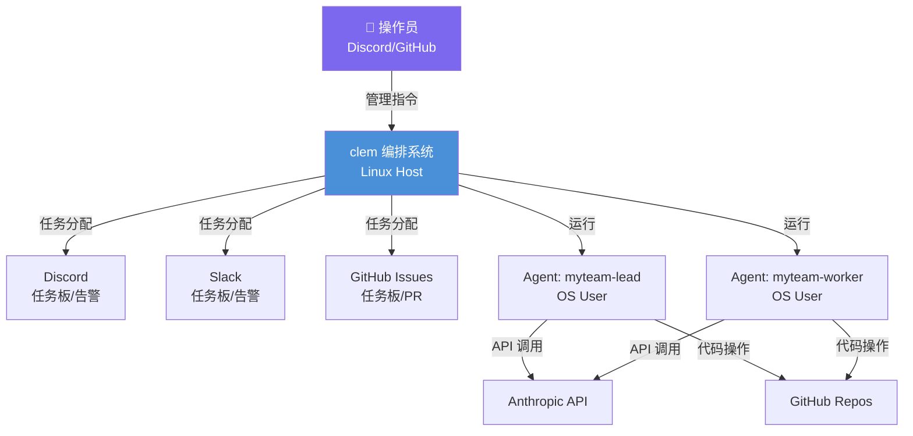

**说明**：
- 操作员通过 Discord/Slack/GitHub 向 clem 下达指令
- clem 编排多个 Agent，每个 Agent 是独立 OS 用户
- Agent 通过协调后端（Discord/Slack/GitHub）接收任务
- Agent 调用 Anthropic API 执行编码任务
- Agent 通过 GitHub 提交代码和 PR

### 3.2 Container 图（容器视图）

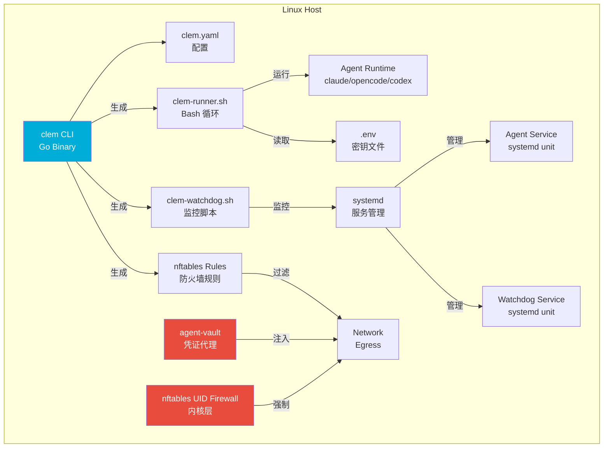

**说明**：
- **clem CLI**：核心编排器，解析配置、生成脚本、管理生命周期
- **clem-runner.sh**：每个 Agent 的运行时循环，管理 Agent 会话
- **clem-watchdog.sh**：监控脚本，检测并重启死亡/卡住的 Agent
- **nftables Rules**：内核级防火墙，限制 Agent 网络访问
- **agent-vault**：凭证代理，注入真实凭证到 Agent 请求
- **systemd**：服务管理、沙箱隔离、资源限制

### 3.3 Component 图（组件视图）

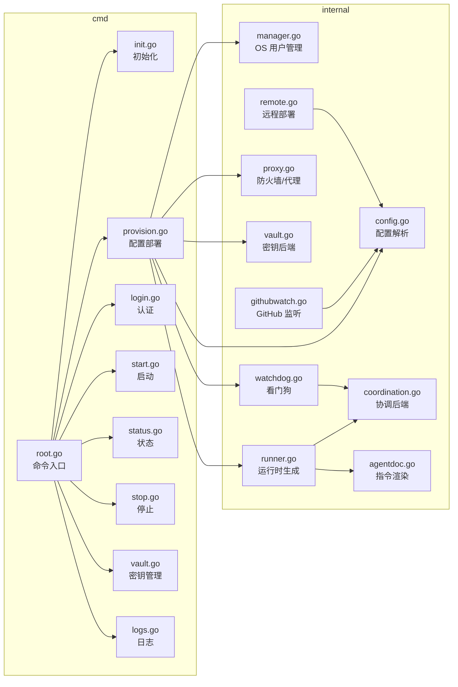

### 3.4 Code 图（关键类型关系）

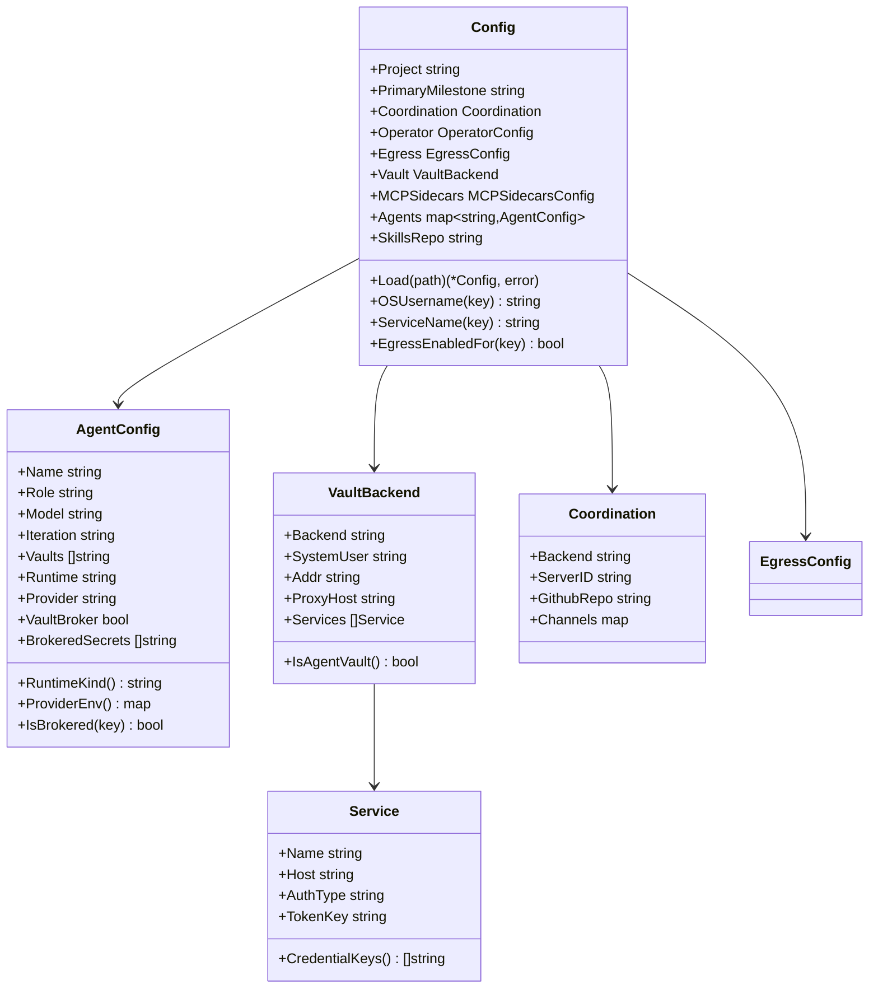

---

## 4. 系统流程与时序图

### 4.1 初始化流程

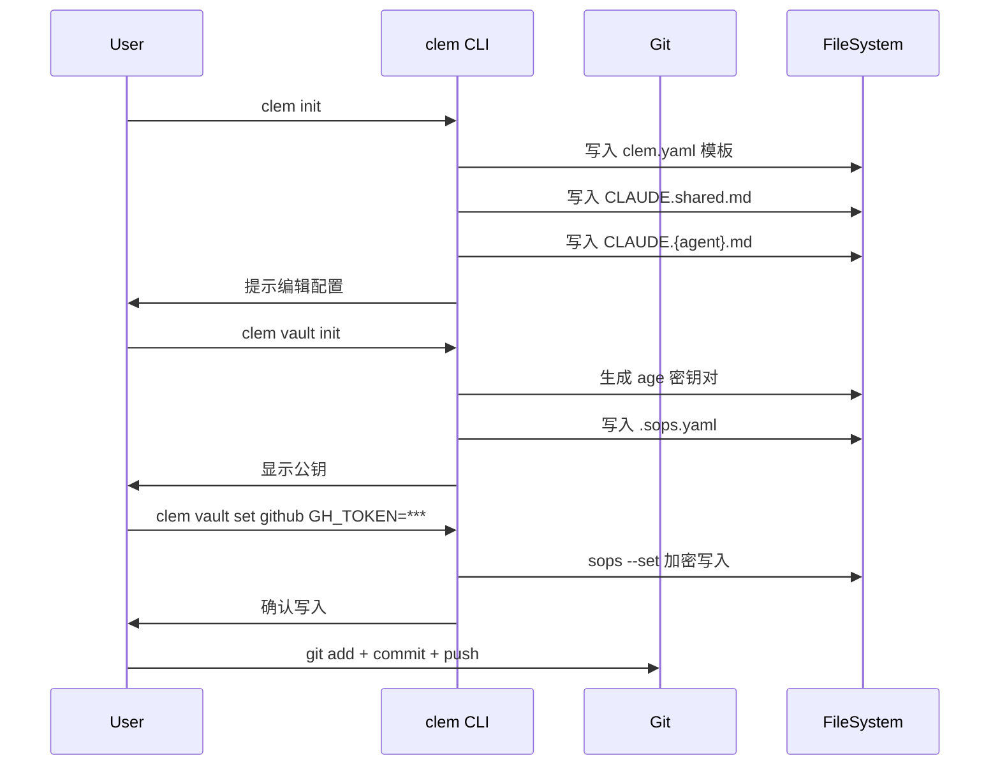

### 4.2 配置部署流程

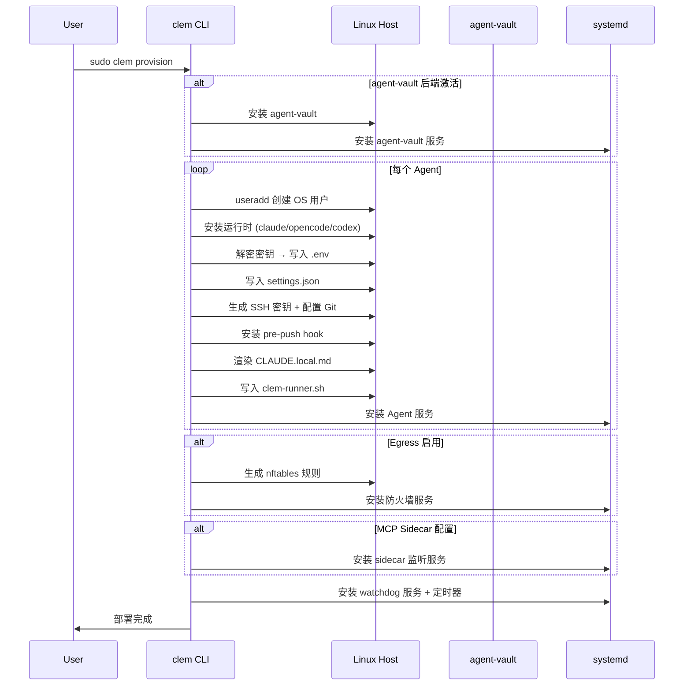

### 4.3 Agent 运行时循环

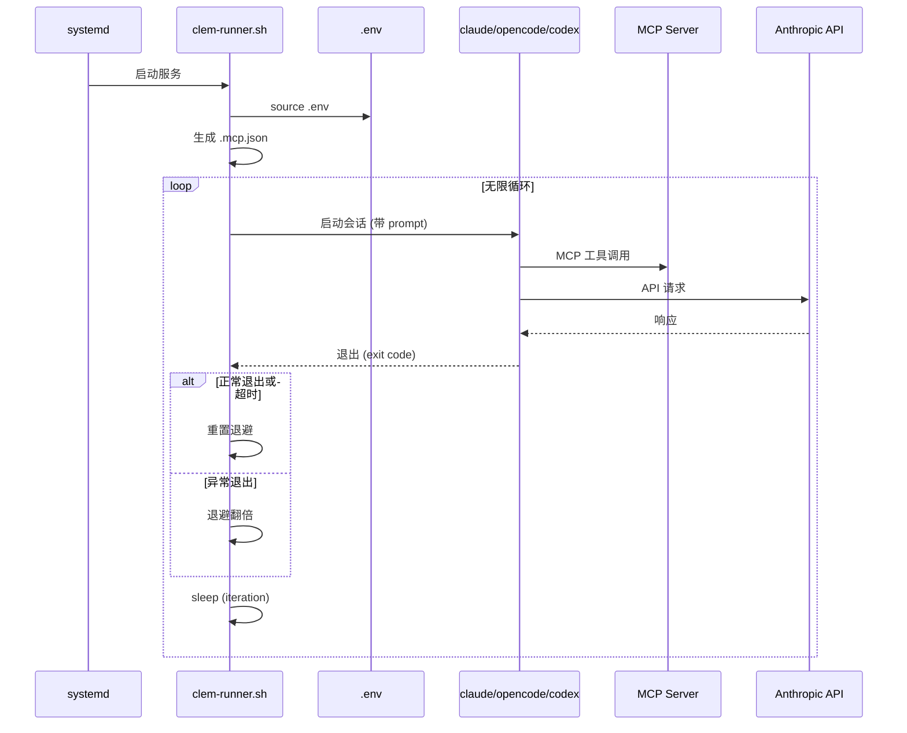

### 4.4 凭证代理流程

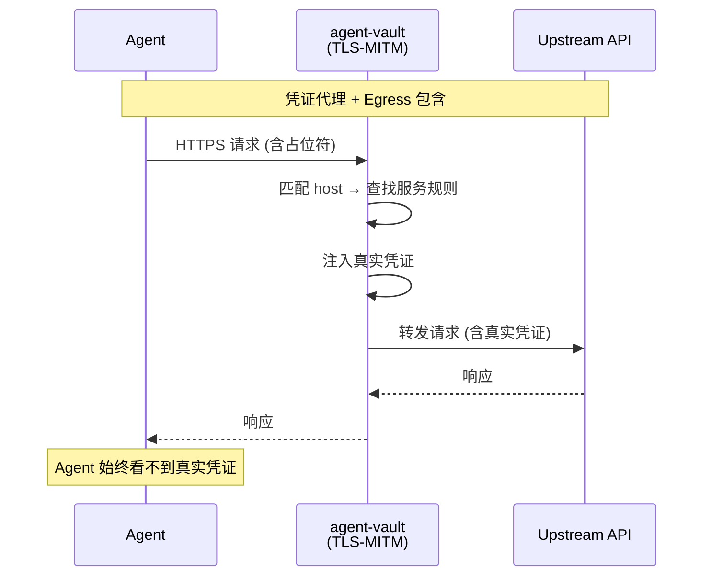

### 4.5 看门狗监控流程

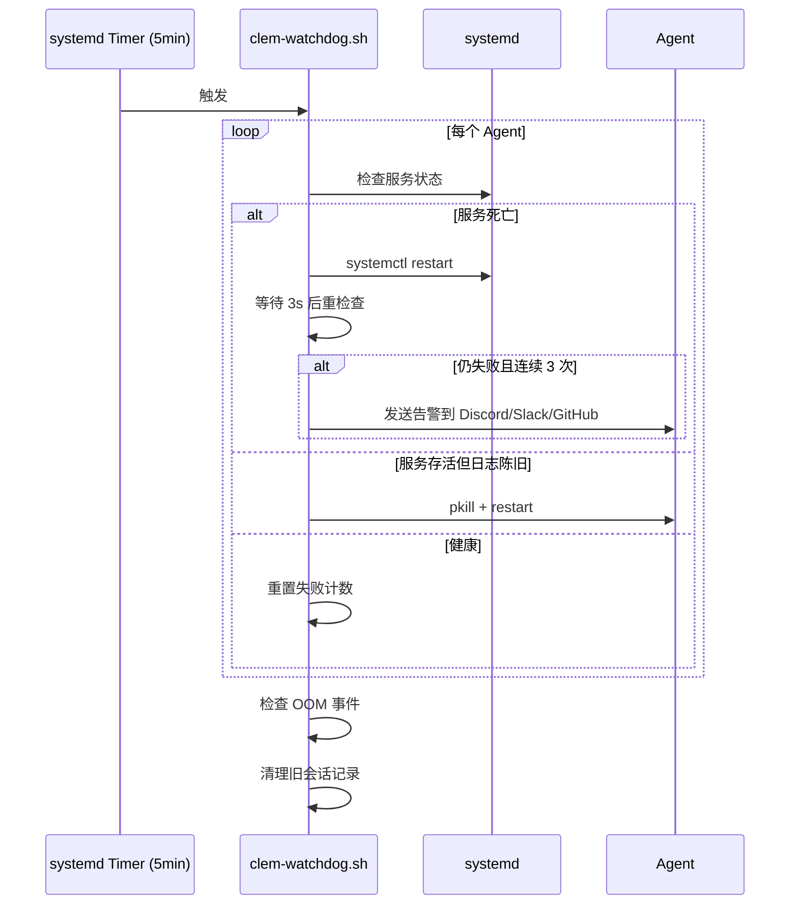

### 4.6 GitHub 协调流程

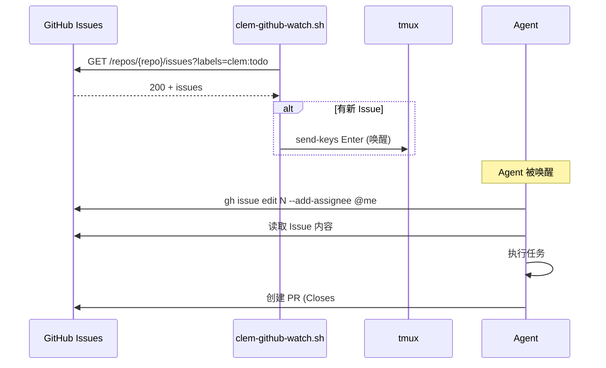

---

## 5. 模块/包结构与依赖分析

### 5.1 目录结构

```
clem/
├── cmd/                          # CLI 命令入口（cobra）
│   ├── root.go                   # 根命令 + 配置加载
│   ├── init.go                   # clem init - 初始化配置
│   ├── provision.go               # clem provision - 核心部署逻辑
│   ├── login.go                  # clem login - Agent 认证
│   ├── start.go                  # clem start - 启动服务
│   ├── stop.go                   # clem stop - 停止服务
│   ├── status.go                 # clem status - 状态查看
│   ├── logs.go                   # clem logs - 日志查看
│   ├── update.go                 # clem update - 自更新
│   ├── vault.go                  # clem vault - 密钥管理
│   └── sync_skills.go            # 技能同步
├── internal/
│   ├── agent/                   # OS 用户与服务管理
│   │   └── manager.go            # 用户创建、运行时安装、密钥写入、Git 配置
│   ├── agentdoc/                # Agent 指令文件渲染
│   │   └── agentdoc.go          # CLAUDE.local.md 模板合成
│   ├── config/                  # 配置解析与验证
│   │   ├── config.go            # 主配置结构 + Load 验证
│   │   ├── egress.go           # Egress 包含配置
│   │   ├── vaultbroker.go      # agent-vault 凭证代理配置
│   │   ├── sidecar.go          # MCP Sidecar 配置
│   │   ├── extensions.go       # 扩展配置（市场/插件/技能/MCP）
│   │   └── naming.go           # 派生名称（OS 用户/服务名）
│   ├── coordination/            # 协调后端抽象
│   │   └── coordination.go     # Discord/Slack/GitHub 后端定义
│   ├── githubwatch/             # GitHub Issue 监听
│   │   └── githubwatch.go      # 轮询脚本 + systemd 服务生成
│   ├── proxy/                  # 防火墙与代理
│   │   └── proxy.go            # nftables 规则 + agent-vault 服务生成
│   ├── remote/                 # 远程部署
│   │   ├── remote.go           # SSH 远程配置流程
│   │   ├── clone_cmd.go        # 克隆命令生成
│   │   └── names.go            # 仓库名称解析
│   ├── runner/                 # Agent 运行时
│   │   ├── runner.go           # 三种运行时循环模板
│   │   └── codex_updater.go    # Codex 更新器
│   ├── vault/                  # 密钥管理
│   │   ├── vault.go            # sops 密钥 CRUD
│   │   ├── backend.go          # 密钥源接口
│   │   ├── agentvault.go       # agent-vault API 交互
│   │   └── names.go            # 保险库名称转换
│   └── watchdog/               # 看门狗
│       └── watchdog.go          # 监控脚本 + systemd 单元
├── samples/                     # 示例配置
│   ├── anthropic/               # Anthropic 云示例
│   ├── github-tasks/            # GitHub 协调示例
│   ├── ollama-gemma4/           # 本地 Gemma 4 示例
│   ├── ollama-mellum2/          # 本地 Mellum 2 示例
│   └── secure-fleet/           # 安全舰队示例
├── docs/                        # 文档
│   ├── threat-model.md           # 威胁模型
│   └── hetzner.md              # Hetzner 部署指南
├── main.go                      # 入口
└── go.mod                       # 模块定义
```

### 5.2 模块依赖关系

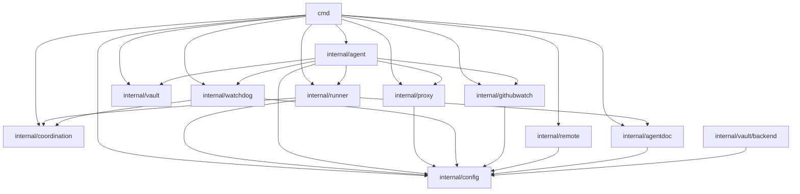

### 5.3 模块职责

| 模块 | 职责 | 输入 | 输出 |
|------|------|------|------|
| cmd/provision.go | 编排整个部署流程 | clem.yaml | OS 用户、服务、脚本 |
| internal/config | 配置解析与验证 | clem.yaml | *Config |
| internal/agent | OS 用户与服务管理 | Config | 用户、.env、服务 |
| internal/runner | 运行时脚本生成 | Config | runner.sh |
| internal/proxy | 防火墙与代理生成 | Config | nftables、systemd |
| internal/vault | 密钥加密/解密 | secrets.sops.yaml | 明文密钥 |
| internal/watchdog | 监控脚本生成 | Config | watchdog.sh |
| internal/coordination | 协调后端抽象 | backend name | Backend 定义 |
| internal/githubwatch | GitHub 监听生成 | Config | watch.sh + service |
| internal/remote | 远程部署编排 | host, token | SSH 命令序列 |
| internal/agentdoc | 指令文件渲染 | Config | CLAUDE.local.md |

---

## 6. 核心代码讲解

### 6.1 cmd/provision.go - 部署编排核心

**功能**：`runProvision` 是整个部署流程的顶层编排者，按严格顺序执行 7 个阶段。

**关键流程**：
1. **Phase 2**：启动 agent-vault 凭证代理（如启用）
2. **Agent 循环**：为每个 Agent 执行 `provisionAgent`
3. **Egress 包含**：生成 nftables UID 防火墙
4. **MCP Sidecar**：启动特权 MCP 监听
5. **Watchdog**：安装监控服务

**`provisionAgent` 单 Agent 部署步骤**：
1. `EnsureUser` - 创建 OS 用户
2. `InstallRuntime` - 安装 claude/opencode/codex
3. `writeAgentEnv` - 解密密钥并写入 .env
4. `WriteSettings` - 写入 Claude Code 设置
5. `EnsureSSHKey` - 生成 SSH 密钥
6. `ConfigureGit` - 配置 Git 签名
7. `InstallGitHooks` - 安装 pre-push hook
8. `agentdoc.Render` - 渲染 CLAUDE.local.md
9. `runner.Generate` - 生成运行时脚本
10. `InstallService` - 安装 systemd 服务

**设计亮点**：
- 使用 `decryptForAgent` 包级变量注入，便于测试
- 环境变量变更检测，仅在 .env 变化时重启服务
- 凭证旋转复用：token 有效时不重新生成

### 6.2 internal/config/config.go - 配置解析引擎

**功能**：`Load` 函数是配置入口，执行严格的验证逻辑。

**验证规则**：
- 未知键硬错误（KnownFields(true)）
- 仅允许 `x-` 前缀扩展键
- 项目名称：`^[a-z][a-z0-9-]{0,30}$`
- Agent 键：同上
- 模型 ID：`^[A-Za-z0-9._:/@-]+$`
- Discord ID：17-19 位数字
- GitHub 登录：`^[a-zA-Z0-9-]{1,39}$`
- 邮箱：不含空白/控制字符
- 名称/角色：不含控制字符

**安全设计**：
- 所有可能注入 systemd 单元文件的字段都限制换行符
- 资源限制值限制为 `^[0-9A-Za-z%./]*$`
- Egress 包含强制要求 vault_broker

### 6.3 internal/runner/runner.go - 运行时循环模板

**功能**：生成三种运行时的 bash 循环脚本。

**核心循环逻辑**：
```bash
while true; do
    # 1. 检查 .env 是否过大
    # 2. 更新 claude（非代理主机）
    # 3. 检查 OAuth token 过期
    # 4. 获取配额快照
    # 5. 读取 effort 覆盖
    # 6. 启动 claude/opencode/codex (timeout 7200s)
    # 7. 计算退避
    # 8. sleep
done
```

**MCP 配置生成**：
- 动态生成 `.mcp.json` / `opencode.json` / `codex/config.toml`
- 支持 Discord、Slack、Typefully、Sidecar MCP
- pipx 隔离的 MCP 二进制路径优先

**关键常量**：
- `MAX_BACKOFF=900`（15 分钟最大退避）
- `RESET_AFTER=300`（5 分钟后重置退避）
- `CLAUDE` 超时：7200s（2 小时硬上限）

### 6.4 internal/agent/manager.go - OS 用户与服务管理

**功能**：封装所有 OS 级操作（用户、密钥、Git、运行时）。

**关键函数**：
- `EnsureUser`：`useradd --create-home --shell /bin/bash`
- `EnsureSystemUser`：`useradd --system --no-create-home`
- `InstallAgentVault`：下载 + 校验 + 安装 agent-vault
- `WriteEnvFile`：写入 .env + .gitignore_global + .gitconfig
- `BrokeredEnv`：生成代理 .env（占位符 + agent-vault 连接）
- `InstallGitHooks`：安装 pre-push hook（凭证扫描 + Unicode 陷阱检测）

**pre-push Hook 四层检测**：
1. 字面凭证模式（token、key、PEM）
2. Base64 编码凭证解码后扫描
3. Unicode 陷阱字符（零宽、BOM、bidi）
4. 代码中读取凭证环境变量

### 6.5 internal/proxy/proxy.go - 防火墙与代理生成

**功能**：生成 nftables 规则和 agent-vault systemd 服务。

**nftables 规则结构**：
```nft
table inet clem_egress_{project} {
    chain output {
        type filter hook output priority 0; policy accept;
        meta skuid {vault_user} accept  # agent-vault 自由出站
        meta skuid {agent_uid} ip daddr 127.0.0.1 tcp dport { ports } accept
        meta skuid {agent_uid} reject with icmpx type admin-prohibited
    }
}
```

**设计亮点**：
- 代理 UID 自由出站（可替 Agent 访问上游）
- Agent UID 仅允许 loopback 到代理端口
- ttyd 端口允许 established 状态（防止反向 shell）
- 幂等重载：create-if-absent → delete → create

### 6.6 internal/vault/vault.go - 密钥管理

**功能**：封装 sops 操作，管理加密密钥。

**密钥结构**：
```yaml
# secrets.sops.yaml (加密)
vaults:
  github:
    GH_TOKEN: ghp_...
  discord-lead:
    DISCORD_TOKEN: Bot ...
```

**关键函数**：
- `Init`：生成 age 密钥对 + .sops.yaml
- `Set`：`sops --set` 加密写入
- `DecryptForAgent`：按 Agent 的 vaults 列表合并解密
- `FlatSecrets`：去除 vault 前缀

### 6.7 internal/watchdog/watchdog.go - 看门狗

**功能**：生成监控脚本和 systemd 定时器。

**监控逻辑**：
1. **服务死亡**：restart → 等待 3s → 重检查 → 3 次失败告警
2. **日志陈旧**：pkill + restart → 3 次失败告警
3. **OOM 检测**：journalctl 检查 OOM killer
4. **agent-vault 健康**：systemctl + HTTP health 检查
5. **拒绝事件**：agent-vault 日志中的 no_match 告警
6. **会话清理**：30 天以上的 JSONL 和 UUID 目录

---

## 7. 数据模型与安全设计

### 7.1 密钥层次结构

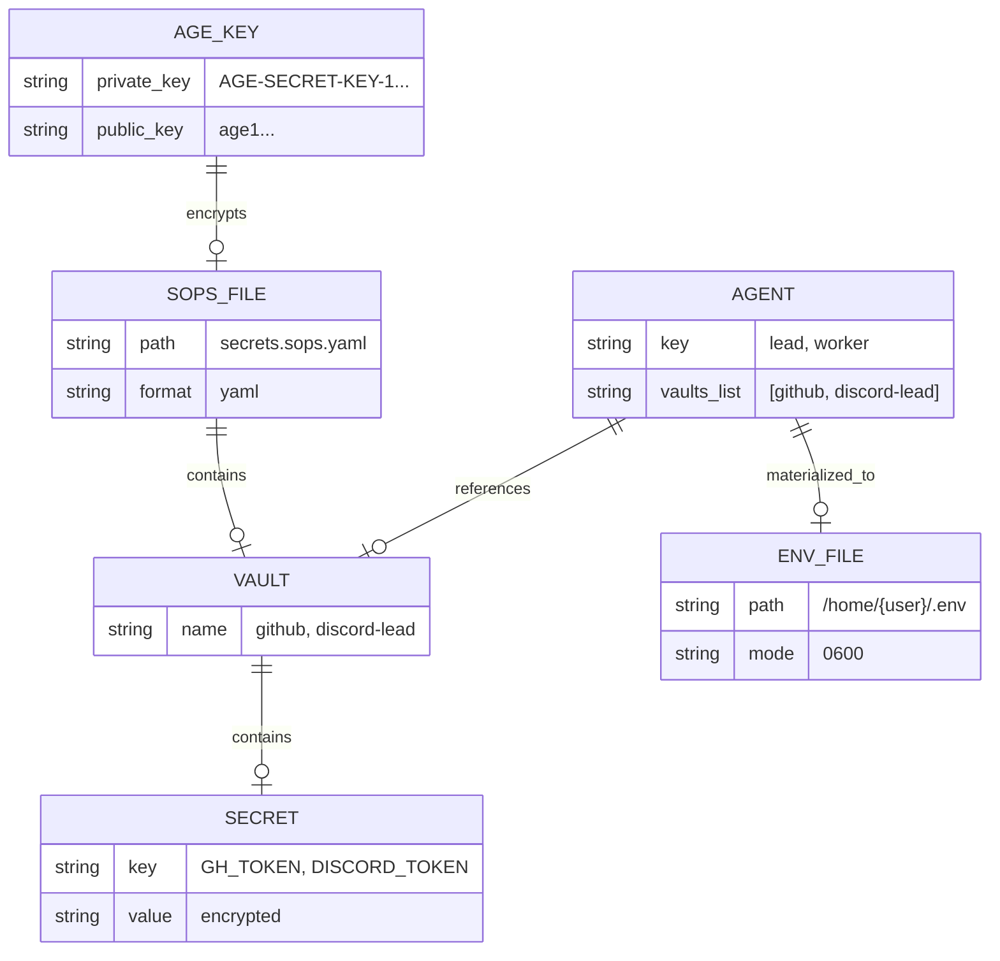

### 7.2 凭证四种处置方式

| 处置方式 | 机制 | 真实凭证位置 | 防御威胁 |
|---------|------|-------------|---------|
| **broker** | agent-vault 代理注入 | 代理进程内 | API Key/Bearer 外泄 |
| **sidecar** | 特权 MCP 服务器 | sidecar 进程内 | 非 HTTP 凭证泄露 |
| **remove** | 删除凭证 | 无 | 未使用的攻击面 |
| **egress firewall** | nftables UID 拒绝 | n/a | 数据外泄到未授权主机 |

### 7.3 安全边界

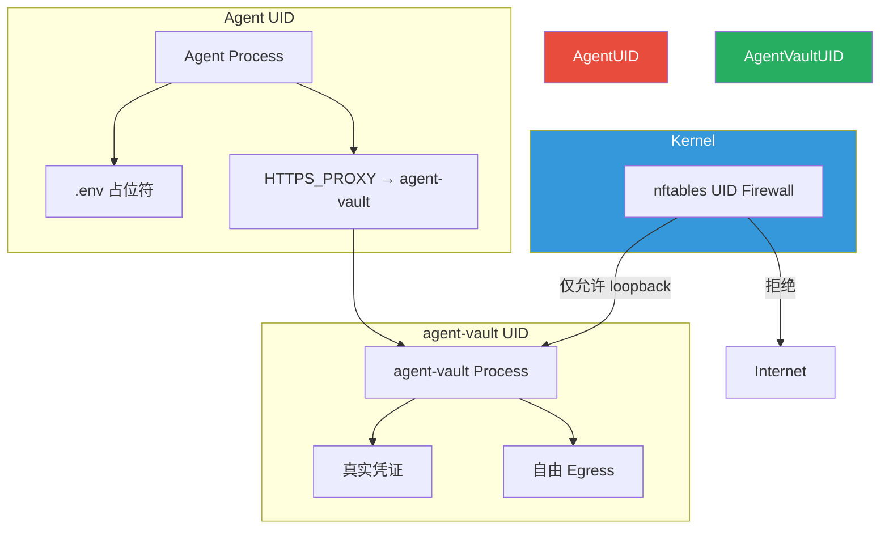

### 7.4 systemd 沙箱配置

每个 Agent 服务包含：
- `ProtectHome=yes` - 保护 /home
- `PrivateTmp=yes` - 私有 /tmp
- `NoNewPrivileges=yes` - 禁止提权
- `ProtectSystem=strict` - 只读系统目录
- `IPAddressDeny=any` - 默认拒绝网络（可选）

---

## 8. 部署与运维

### 8.1 部署架构

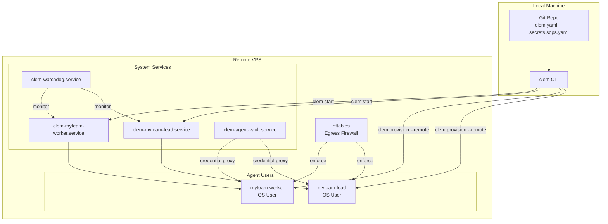

### 8.2 系统要求

**Host**：
- Linux with systemd（推荐 Ubuntu 24.04）
- tmux, git, python3, age, sops, yq, curl
- MCP server binaries on PATH

**本地机器**：
- Go 1.22+（构建 clem）
- age, sops, yq, gh

### 8.3 常用命令

```bash
# 初始化
clem init [--backend discord|github]
clem vault init
clem vault set <vault> KEY=value

# 部署
sudo clem provision [--remote root@host]

# 认证
sudo clem login [--remote root@host]

# 运维
sudo clem start / stop / restart
clem status
clem logs <agent>
```

### 8.4 监控与告警

- **systemd 状态**：`clem status` 显示每个 Agent 的 systemd/tmux/令牌状态
- **看门狗**：每 5 分钟检查，3 次连续失败后告警
- **告警通道**：Discord #alerts / Slack #alerts / GitHub Issue 评论
- **拒绝事件**：agent-vault 日志中的 no_match 告警

---

## 9. 改进建议与风险点

### 9.1 优点

1. **深度 OS 级隔离**：UID + nftables + systemd 三层边界，非进程内沙箱可比
2. **凭证零化设计**：agent-vault 代理确保 Agent 永不接触真实凭证
3. **配置驱动**：单一 clem.yaml 驱动全部基础设施
4. **多运行时支持**：claude-code/opencode/codex 统一编排
5. **自愈能力强**：systemd + watchdog + 退避重启
6. **安全编码**：严格的输入验证、pre-push hook、Unicode 陷阱检测

### 9.2 风险点

| 风险 | 级别 | 说明 |
|------|------|------|
| agent-vault 单点故障 | 高 | 所有代理凭证依赖单一 agent-vault 进程 |
| age 密钥备份 | 高 | 私钥丢失则所有加密密钥不可恢复 |
| 内核兼容性 | 中 | nftables 需要较新内核，旧系统不支持 |
| Discord 网关令牌 | 中 | DISCORD_TOKEN 不可代理，仍以明文存储 |
| SSH 密钥管理 | 中 | 每个 Agent 需单独配置 GitHub SSH Signing Key |

### 9.3 改进建议

1. **agent-vault 高可用**：支持多实例或自动故障转移
2. **密钥轮换自动化**：定期自动轮换 age 密钥和 Agent token
3. **Web UI**：提供 Web 仪表盘查看 Agent 状态和日志
4. **指标导出**：Prometheus metrics 导出
5. **密钥托管集成**：支持 HashiCorp Vault、AWS Secrets Manager 等

---

## 10. 开发者上手指南

### 10.1 本地构建

```bash
git clone https://github.com/jahwag/clem.git
cd clem
go build -ldflags "-X github.com/jahwag/clem/cmd.Version=$(git describe --tags --always)" -o clem .
sudo install -m 0755 clem /usr/local/bin/clem
```

### 10.2 运行测试

```bash
go test ./...
```

### 10.3 项目结构约定

- `cmd/`：每个子命令一个文件，`init()` 注册到 rootCmd
- `internal/`：按职责分包，避免循环依赖
- 包级变量注入（如 `sys Executor`）用于测试替换
- 模板使用 Go `text/template` 或字符串替换

### 10.4 新增协调后端

1. 在 `internal/coordination/coordination.go` 定义新 Backend
2. 在 `Known()` 函数添加新后端分支
3. 在 runner 模板中添加 MCP 配置生成
4. 更新 README 和 clem.yaml 模板

### 10.5 调试技巧

```bash
# 查看生成的 runner.sh
cat /home/{user}/.local/bin/clem-runner.sh

# 查看 systemd 服务状态
systemctl status clem-{project}-{agent}.service

# 查看 Agent 日志
journalctl -u clem-{project}-{agent}.service -f

# 查看看门狗日志
tail -f /tmp/clem-watchdog-{project}/*.cooldown

# 手动运行 watchdog
sudo /usr/local/bin/clem-watchdog-{project}.sh
```

---

## 附录 A：配置参考

### clem.yaml 完整结构

```yaml
project: myteam
primary_milestone: "Ship v1 by 2027-01-01"

coordination:
  backend: discord  # discord | slack | github
  server_id: "YOUR_SERVER_ID"
  github_repo: "owner/repo"  # backend=github 时
  channels:
    general: "CHANNEL_ID"
    tasks: "CHANNEL_ID"
    alerts: "CHANNEL_ID"
    lessons: "CHANNEL_ID"

operator:
  discord_ids: ["USER_ID"]
  github_logins: ["username"]

egress:
  enabled: true
  domains:
    - "*.anthropic.com"
    - "github.com"
  allow_localhost_ports: [11434]

vault:
  backend: agent-vault  # env | agent-vault
  system_user: clem-vault
  addr: "http://127.0.0.1:14321"
  proxy_host: "127.0.0.1:14322"
  services:
    - name: anthropic
      host: "*.anthropic.com"
      auth_type: bearer
      token_key: ANTHROPIC_API_KEY

mcp_sidecars:
  system_user: clem-mcp
  base_port: 14500
  servers:
    - name: my-sidecar
      command: /usr/local/bin/my-mcp-server
      secrets: [MY_API_KEY]
      secrets_vault: my-vault

agents:
  lead:
    name: "Amara"
    role: "Lead Software Engineer"
    model: "claude-sonnet-4-6"
    iteration: 10m
    vaults: [github, discord-lead]
    vault_broker: true
    brokered_secrets: [ANTHROPIC_API_KEY]
    runtime: claude-code
    provider: anthropic
```

---

*文档结束*
