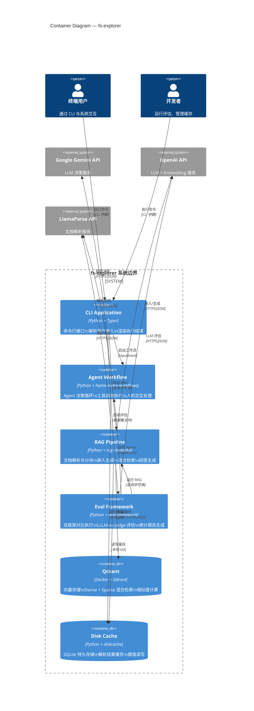

# 02-02 — Container 图（容器视图）

> **本章内容**: 容器视图、进程/服务划分、协议与端口、数据流
> **预估字数**: ~8,000 字
> **C4 层级**: Level 2 — Container

---

## 1. 容器视图概述

在 C4 模型中，**容器（Container）** 是指系统中可独立部署和运行的每个进程或服务。对于 fs-explorer 项目，容器层展示了系统被分解为哪些独立运行的单元，以及它们之间如何通过明确定义的协议进行通信。

fs-explorer 的容器视图包含 **6 个容器**：

1. **CLI Application** — 命令行应用（主进程）
2. **Agent Workflow** — Agent 工作流引擎
3. **RAG Pipeline** — RAG 检索流水线
4. **Eval Framework** — 评估框架
5. **Qdrant Database** — 向量数据库
6. **Disk Cache** — 磁盘缓存

---

## 2. 容器视图图

### 2.1 Mermaid 图表



### 2.2 图表说明

该容器视图展示了 fs-explorer 系统的 6 个核心容器及其交互关系。CLI Application 是用户与系统交互的入口，根据命令类型将请求路由到 Agent Workflow、RAG Pipeline 或 Eval Framework。三个业务容器分别依赖不同的外部服务和本地存储。

---

## 3. 容器详解

### 3.1 CLI Application（命令行应用）

| 属性 | 说明 |
|------|------|
| **技术栈** | Python + Typer + Rich |
| **入口点** | `fs_explorer.main:app` / `eval_framework.main:app_eval` / `eval_framework.main:app_stats` / `cache_arxiv.main:app` |
| **进程类型** | 短期进程（命令执行完毕后退出） |
| **职责** | 1. 解析命令行参数<br>2. 初始化异步运行时<br>3. 调用业务逻辑<br>4. 渲染执行结果 |

**详细职责**:

CLI Application 是系统的"门面"（Facade），负责：

1. **参数解析**: 使用 Typer 库定义命令和选项，自动生成帮助信息和参数校验。
2. **异步编排**: 通过 `asyncio.run()` 启动异步事件循环，驱动工作流执行。
3. **事件渲染**: 订阅工作流事件流，使用 Rich 库将事件渲染为美观的终端面板（Panel）。
4. **人机交互**: 当收到 `AskHumanEvent` 时，暂停状态指示器，提示用户输入，然后将回答发送回工作流。

**命令列表**:

| 命令 | 入口 | 功能 |
|------|------|------|
| `explore run` | `fs_explorer.main:main` | 启动 Agent 探索任务 |
| `explore load-cache` | `fs_explorer.main:load_cache` | 预加载文件缓存 |
| `explore get-cached` | `fs_explorer.main:get_cached` | 查看缓存内容 |
| `run-eval` | `eval_framework.main:run_evaluations` | 运行双框架评估 |
| `get-stats` | `eval_framework.main:get_stats` | 生成统计报告 |
| `cache-arxiv` | `cache_arxiv.main:main` | 缓存 arXiv 论文 |

### 3.2 Agent Workflow（Agent 工作流）

| 属性 | 说明 |
|------|------|
| **技术栈** | Python + llama-index-workflows |
| **入口点** | `fs_explorer.workflow:workflow` |
| **进程类型** | 异步工作流（在 CLI 进程内运行） |
| **职责** | 1. Agent 决策循环<br>2. 工具调用执行<br>3. 目录导航<br>4. 人机交互 |

**详细职责**:

Agent Workflow 是系统的"大脑"，实现了完整的 Agent 决策循环：

1. **工作流编排**: 继承 `Workflow` 基类，定义 4 个步骤（`@step`），通过事件驱动在步骤间流转。
2. **状态管理**: 使用 `Context[WorkflowState]` 管理状态（初始任务、当前目录）。
3. **事件路由**: 根据 Agent 返回的动作类型，将事件路由到对应的步骤处理器。
4. **资源注入**: 通过 `Resource(get_agent)` 将 `FsExplorerAgent` 实例注入到所有步骤。
5. **超时控制**: 工作流设置 120 秒超时，防止无限循环。

**步骤流转**:

```
InputEvent → start_exploration → GoDeeperEvent / ToolCallEvent / AskHumanEvent / ExplorationEndEvent
GoDeeperEvent → go_deeper_action → GoDeeperEvent / ToolCallEvent / AskHumanEvent / ExplorationEndEvent
ToolCallEvent → tool_call_action → GoDeeperEvent / ToolCallEvent / AskHumanEvent / ExplorationEndEvent
AskHumanEvent → [等待用户输入] → HumanAnswerEvent → receive_human_answer → ...
```

### 3.3 RAG Pipeline（RAG 流水线）

| 属性 | 说明 |
|------|------|
| **技术栈** | Python + rag-starterkit |
| **入口点** | `rag_starterkit.pipeline:Pipeline` |
| **进程类型** | 异步流水线（在 CLI 进程内运行） |
| **职责** | 1. 文档解析与缓存<br>2. 文本分块<br>3. 嵌入生成<br>4. 向量存储<br>5. 混合检索<br>6. 回答生成 |

**详细职责**:

RAG Pipeline 实现了完整的检索增强生成流水线，分为两个阶段：

**索引阶段（prepare）**:
1. 从缓存或 LlamaParse 获取文档内容。
2. 使用 Chonkie SentenceChunker 将文档切分为 2048 字符的块（200 字符重叠）。
3. 使用 OpenAI API 生成稠密嵌入（768 维）。
4. 使用 FastEmbed 生成稀疏嵌入（BM25）。
5. 将嵌入上传到 Qdrant 向量数据库。

**检索阶段（run）**:
1. 使用 LLM 从文件列表中筛选最相关的文件。
2. 对查询生成稠密和稀疏嵌入。
3. 在 Qdrant 中执行混合检索。
4. 使用 RRF 融合两路检索结果。
5. 使用 LLM 基于检索上下文生成最终回答。

### 3.4 Eval Framework（评估框架）

| 属性 | 说明 |
|------|------|
| **技术栈** | Python + eval-framework |
| **入口点** | `eval_framework.main:app_eval` / `app_stats` |
| **进程类型** | 短期进程 |
| **职责** | 1. 双框架对比执行<br>2. LLM-as-Judge 评估<br>3. 统计聚合<br>4. 报告生成 |

**详细职责**:

Eval Framework 是系统的"裁判"，负责对比 Agent 和 RAG 的性能：

1. **双轨执行**: 对每个评估任务，分别运行 Agent Workflow 和 RAG Pipeline，记录时间、工具调用、访问文件等信息。
2. **LLM 评估**: 使用 GPT-5.2 作为 Judge，对两个框架生成的回答进行正确性（correctness）和相关性（relevance）评分（0-10 分）。
3. **统计聚合**: 计算平均时间、平均正确性、平均相关性，确定各指标的优胜者。
4. **报告生成**: 生成 JSON 统计文件和 Markdown 人类可读报告。

### 3.5 Qdrant Database（向量数据库）

| 属性 | 说明 |
|------|------|
| **技术栈** | Qdrant (Rust) |
| **部署方式** | Docker 容器 |
| **端口** | 6334 (gRPC) / 6333 (HTTP) |
| **存储** | `./qdrant_storage` 卷挂载 |
| **职责** | 1. 向量存储<br>2. 相似度检索<br>3. 混合查询 |

**详细职责**:

Qdrant 是 RAG 流水线的存储后端：

1. **Collection 管理**: 创建和管理向量集合，支持 Dense 和 Sparse 两种向量类型。
2. **向量存储**: 存储文本块及其嵌入向量，附带元数据（文件路径、内容）。
3. **相似度检索**: 支持余弦相似度（Dense）和 BM25（Sparse）检索。
4. **过滤查询**: 支持按元数据字段（如 file_path）过滤检索范围。

**Collection 配置**:

| Collection 名称 | 向量类型 | 用途 |
|-----------------|---------|------|
| `rag-benchmark` | Dense + Sparse | 标准评估（少量 PDF） |
| `rag-benchmark-advanced` | Sparse only | 大规模评估（arXiv 论文） |

### 3.6 Disk Cache（磁盘缓存）

| 属性 | 说明 |
|------|------|
| **技术栈** | Python + diskcache (SQLite) |
| **存储位置** | `tmp/cache/` |
| **职责** | 1. 解析结果缓存<br>2. 键值读写<br>3. 持久化存储 |

**详细职责**:

DiskCache 是性能优化的关键：

1. **缓存解析结果**: 存储 LlamaParse 解析后的文档文本，键为文件绝对路径。
2. **跨会话持久化**: 缓存在多次运行之间保持有效，避免重复的 API 调用。
3. **预热机制**: 通过 `warmup()` 方法创建缓存目录，通过 `is_empty` 属性检查缓存状态。

---

## 4. 容器间通信协议

### 4.1 协议矩阵

| 源容器 | 目标容器 | 协议 | 数据格式 | 调用模式 |
|--------|---------|------|---------|---------|
| CLI | Agent Workflow | 内存调用 | Python 对象 (Event) | 同步启动 + 异步流 |
| CLI | RAG Pipeline | 内存调用 | Python 对象 | 异步 |
| CLI | Eval Framework | 内存调用 | Python 对象 | 异步 |
| Agent Workflow | Gemini API | HTTPS | JSON | 异步 |
| Agent Workflow | LlamaParse API | HTTPS | JSON | 异步 |
| Agent Workflow | Disk Cache | 文件 I/O | 字符串 | 同步 |
| RAG Pipeline | OpenAI API | HTTPS | JSON | 异步 |
| RAG Pipeline | LlamaParse API | HTTPS | JSON | 异步 |
| RAG Pipeline | Qdrant | gRPC/JSON | Protobuf/JSON | 异步 |
| RAG Pipeline | Disk Cache | 文件 I/O | 字符串 | 同步 |
| Eval Framework | Agent Workflow | 内存调用 | Python 对象 | 异步 |
| Eval Framework | RAG Pipeline | 内存调用 | Python 对象 | 异步 |
| Eval Framework | OpenAI API | HTTPS | JSON | 异步 |

### 4.2 端口与端点

| 服务 | 端口 | 协议 | 端点 |
|------|------|------|------|
| Qdrant HTTP | 6333 | HTTP | `http://localhost:6333` |
| Qdrant gRPC | 6334 | gRPC | `grpc://localhost:6334` |
| Gemini API | 443 | HTTPS | `https://generativelanguage.googleapis.com` |
| OpenAI API | 443 | HTTPS | `https://api.openai.com` |
| LlamaParse API | 443 | HTTPS | `https://api.cloud.llamaindex.ai` |

---

## 5. 数据流分析

### 5.1 Agent 探索数据流

```
用户 → CLI → InputEvent → Agent Workflow
                            ↓
                      Gemini API (获取决策)
                            ↓
                      Action (toolcall/godeeper/askhuman/stop)
                            ↓
                      ┌─────────────────────────────────┐
                      │  toolcall → 调用工具 → 结果追加  │
                      │  godeeper → 更新目录 → 重新决策  │
                      │  askhuman → 暂停 → 等待用户输入  │
                      │  stop → 返回最终结果             │
                      └─────────────────────────────────┘
                            ↓
                      事件流 → CLI → Rich 渲染 → 终端输出
```

### 5.2 RAG 索引数据流

```
文件目录 → LlamaParse API → 纯文本 → Disk Cache (缓存)
                                        ↓
                                    Chunker → 文本块
                                        ↓
                              ┌─────────┴─────────┐
                              ↓                   ↓
                        OpenAI Embed         FastEmbed BM25
                              ↓                   ↓
                         Dense Vector       Sparse Vector
                              ↓                   ↓
                              └─────────┬─────────┘
                                        ↓
                                    Qdrant (存储)
```

### 5.3 RAG 查询数据流

```
用户查询 → LLM Filter → 文件路径筛选
                ↓
           Embed Query (Dense + Sparse)
                ↓
           Qdrant 混合检索
                ↓
           RRF 重排序
                ↓
           LLM 生成回答
                ↓
           最终回答
```

### 5.4 评估数据流

```
数据集 (JSON) → Eval Framework
                    ↓
        ┌───────────┴───────────┐
        ↓                       ↓
   Agent Workflow          RAG Pipeline
        ↓                       ↓
    Agent 回答              RAG 回答
        ↓                       ↓
        └───────────┬───────────┘
                    ↓
            LLM-as-Judge 评估
                    ↓
              统计聚合 → 报告生成
```

---

## 6. 设计 Rationale

### 6.1 为什么将 Agent Workflow 和 RAG Pipeline 设计为同一进程？

1. **简化部署**: 两个容器都在 CLI 进程内运行，无需额外的进程管理。
2. **共享状态**: Agent 和 RAG 可以共享同一个 DiskCache 实例，避免重复解析。
3. **降低延迟**: 内存调用远快于网络通信。
4. **单用户场景**: fs-explorer 设计为单用户本地工具，无需分布式部署。

### 6.2 为什么 Qdrant 使用 Docker 而非嵌入式？

1. **性能**: Qdrant 使用 Rust 编写，性能远超 Python 实现。
2. **持久化**: 独立进程确保数据在 CLI 退出后仍保留。
3. **可扩展**: 可独立于 CLI 扩展 Qdrant 资源。
4. **生态**: Qdrant 提供成熟的客户端 SDK 和管理工具。

### 6.3 为什么 Disk Cache 使用 SQLite 而非纯文件？

1. **并发安全**: SQLite 提供事务和锁机制，支持并发读写。
2. **查询能力**: 支持按键查找，无需遍历目录。
3. **空间效率**: SQLite 压缩存储，比纯文件更节省空间。
4. **可靠性**: SQLite 是经过广泛验证的数据库引擎。

---

## 7. 容器部署视图

### 7.1 本地开发部署

```
┌─────────────────────────────────────────────────────────────┐
│                     开发者机器                               │
│  ┌─────────────────────────────────────────────────────┐    │
│  │              Python 虚拟环境 (.venv)                  │    │
│  │  ┌──────────┐  ┌──────────┐  ┌──────────────────┐  │    │
│  │  │ CLI App  │  │ Agent WF │  │ RAG Pipeline     │  │    │
│  │  └──────────┘  └──────────┘  └──────────────────┘  │    │
│  │  ┌──────────┐  ┌──────────┐                        │    │
│  │  │ Eval FW  │  │ DiskCache│                        │    │
│  │  └──────────┘  └──────────┘                        │    │
│  └─────────────────────────────────────────────────────┘    │
│                          │                                   │
│  ┌─────────────────────────────────────────────────────┐    │
│  │              Docker Desktop                          │    │
│  │  ┌──────────────────────────────────────────────┐   │    │
│  │  │ Qdrant Container (port 6333/6334)            │   │    │
│  │  └──────────────────────────────────────────────┘   │    │
│  └─────────────────────────────────────────────────────┘    │
└─────────────────────────────────────────────────────────────┘
```

### 7.2 容器生命周期

| 容器 | 启动时机 | 停止时机 | 生命周期 |
|------|---------|---------|---------|
| CLI Application | 用户执行命令 | 命令执行完毕 | 秒级 |
| Agent Workflow | CLI 启动工作流 | 工作流结束/超时 | 秒到分钟级 |
| RAG Pipeline | CLI 启动 RAG | 查询完成 | 秒级 |
| Eval Framework | CLI 启动评估 | 所有任务完成 | 分钟到小时级 |
| Qdrant | `docker compose up` | `docker compose down` | 天到月级 |
| Disk Cache | 首次访问 | 永不（持久化） | 永久 |

---

☕️ 制作不易，请我喝咖啡☕️关注我➕