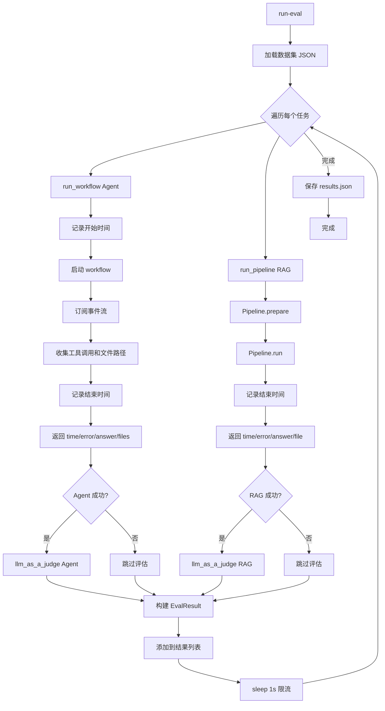

# 03-06 — 评估框架流程

> **本章内容**: 双框架对比评估的完整流程
> **预估字数**: ~6,000 字

---

## 1. 流程概述

评估框架流程对 fs-explorer（Agent 模式）和 rag-starterkit（传统 RAG 模式）进行对比评估，使用 LLM-as-Judge 对两者的回答质量进行评分。

**触发命令**: `run-eval -df questions_and_answers.json`

---

## 2. 完整流程图



---

## 3. 数据集格式

```json
[
  {
    "question": "What is the main contribution of the paper?",
    "answer": "The paper introduces a novel method...",
    "file": "paper.pdf"
  },
  ...
]
```

---

## 4. Agent 运行器

```python
async def run_workflow(question: str, advanced: bool = False) -> RunResult:
    # 1. 构建任务提示词
    if not advanced:
        start_event = InputEvent(task=FS_EXPLORER_PROMPT.render({"question": question}))
    else:
        start_event = InputEvent(task=FS_EXPLORER_PROMPT_ADVANCED.render({"question": question}))

    # 2. 运行工作流并收集信息
    tool_calls = []
    file_names = []
    start_time = time.time()
    handler = workflow.run(start_event=start_event)
    async for event in handler.stream_events():
        if isinstance(event, ToolCallEvent):
            tool_calls.append(event.tool_name)
            # 收集访问的文件路径
    result = await handler
    end_time = time.time()

    return RunResult(
        time_taken=(end_time - start_time),
        tool_calls=tool_calls,
        error=result.error,
        final_answer=result.final_result,
        file_path=file_names,
    )
```

---

## 5. RAG 运行器

```python
async def run_pipeline(question: str, advanced: bool = False) -> RunResult:
    if advanced:
        PIPELINE.vector_db.collection_name = QDRANT_COLLECTION_ADVANCED
        PIPELINE.vector_db.sparse_only = True
        PIPELINE.sparse_only = True
    await PIPELINE.prepare()
    start_time = time.time()
    try:
        result, file_path = await PIPELINE.run(question)
        error = None
    except Exception as e:
        result, file_path, error = None, None, str(e)
    end_time = time.time()
    return RunResult(...)
```

---

## 6. LLM-as-Judge 评估

```python
async def llm_as_a_judge(question: str, ground_truth: str, produced_answer: str) -> Evaluation | None:
    content = LLM_AS_A_JUDGE_PROMPT.render({
        "question": question,
        "ground_truth": ground_truth,
        "answer": produced_answer,
    })
    message = EasyInputMessageParam(content=content, role="user")
    client = AsyncOpenAI(api_key=os.getenv("OPENAI_API_KEY"))
    response = await client.responses.parse(
        text_format=Evaluation,
        input=[message],
        reasoning=Reasoning(effort="none"),
        model="gpt-5.2",
    )
    return response.output_parsed
```

**评估维度**:
- **relevance** (0-10): 回答与问题的相关程度
- **correctness** (0-10): 回答与标准答案的一致性
- **reason**: 评估理由

---

## 7. 统计报告

```python
def get_eval_stats(results_file, result_json_file, result_md_file):
    results = get_results(results_file)
    times = [result["time_taken"] for result in results]
    llm_evals = [result["llm_evaluations"] for result in results]

    time_stats = get_time_average(times)
    llm_stats = get_llm_stats(llm_evals)

    # 保存 JSON 统计
    with open(result_json_file, "w") as f:
        json.dump({"time_stats": time_stats, "llm_stats": llm_stats}, f, indent=2)

    # 生成 Markdown 报告
    markdown_report = create_markdown_report(eval_stats, len(results))
    with open(result_md_file, "w") as f:
        f.write(markdown_report)
```

**统计指标**:
- 平均时间对比
- 平均正确性对比
- 平均相关性对比
- 综合优胜者

---

☕️ 制作不易，请我喝咖啡☕️关注我➕