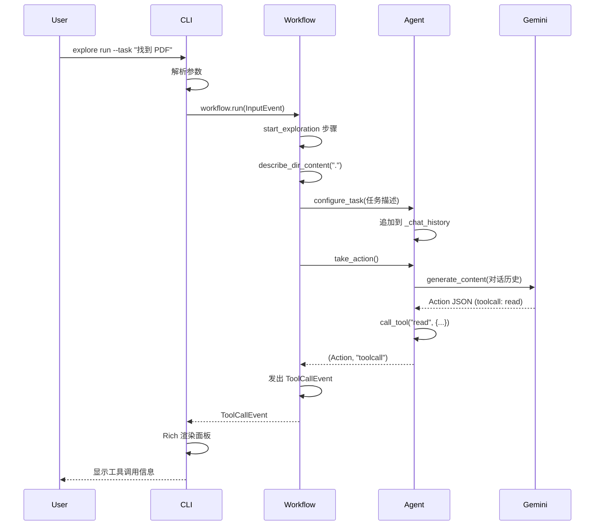
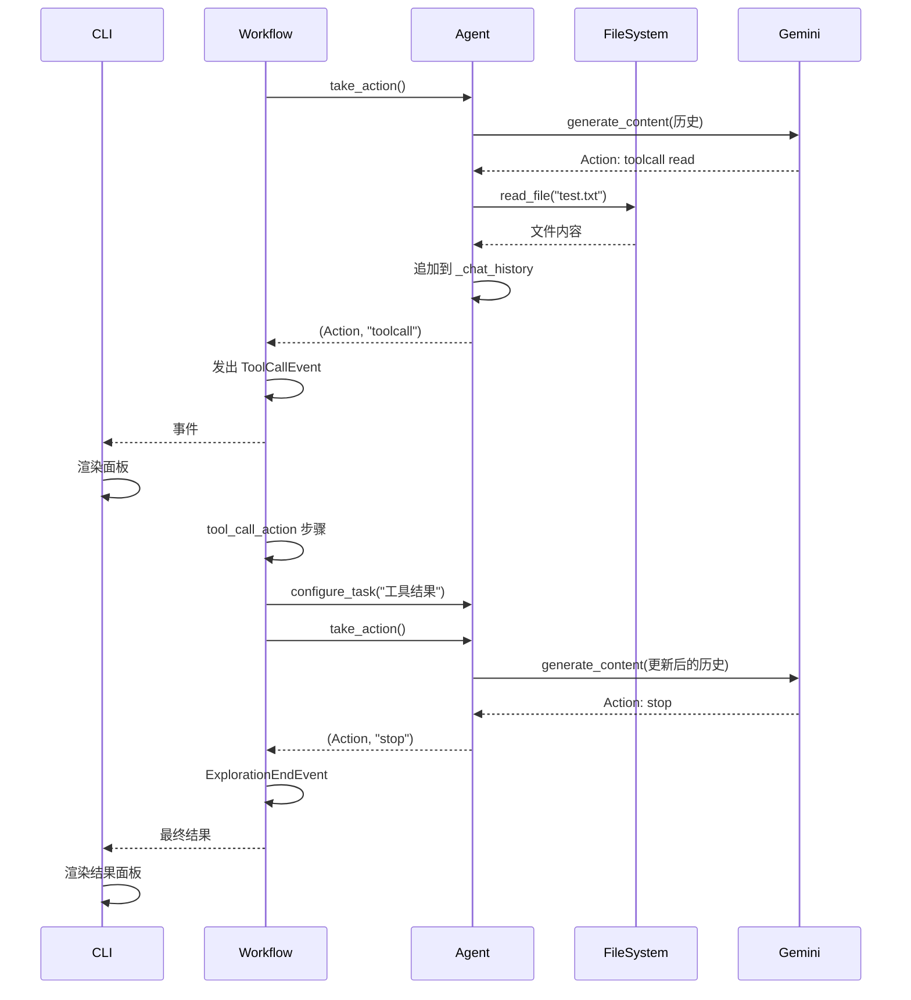
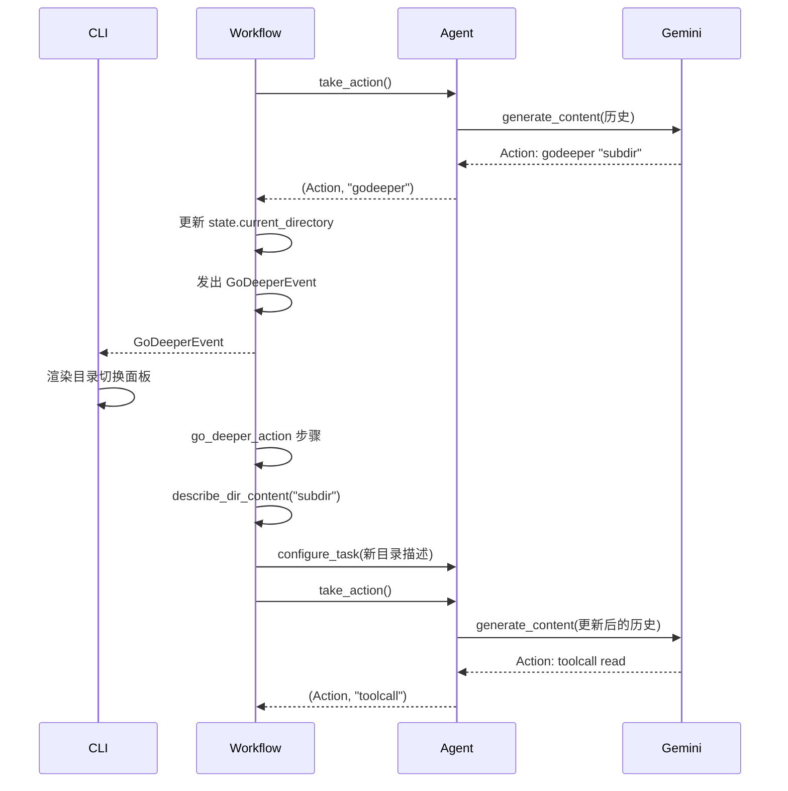
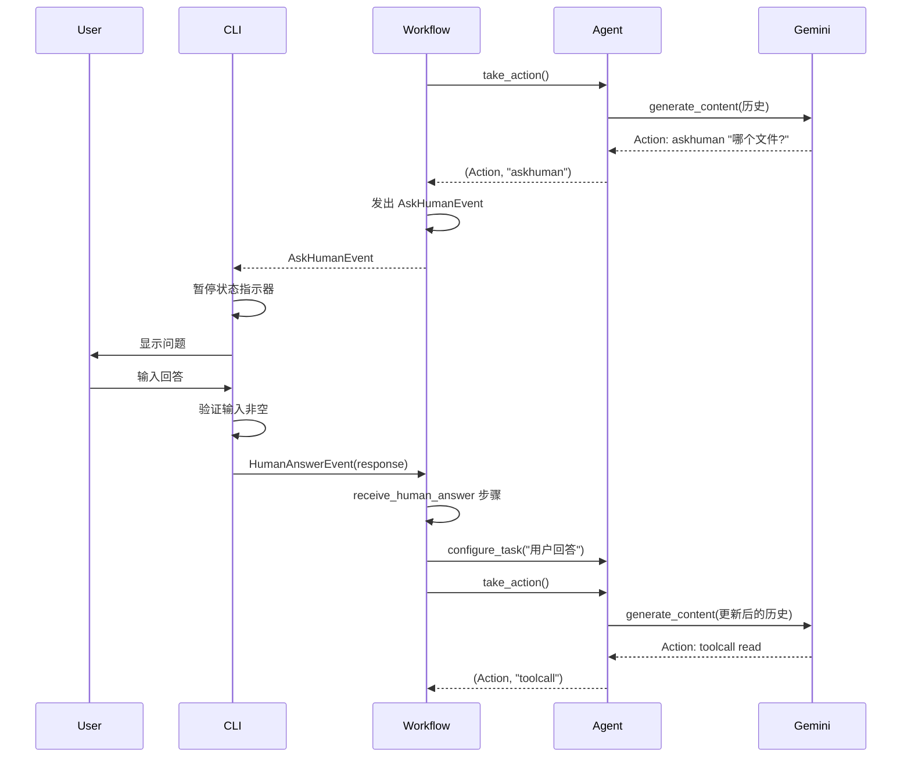
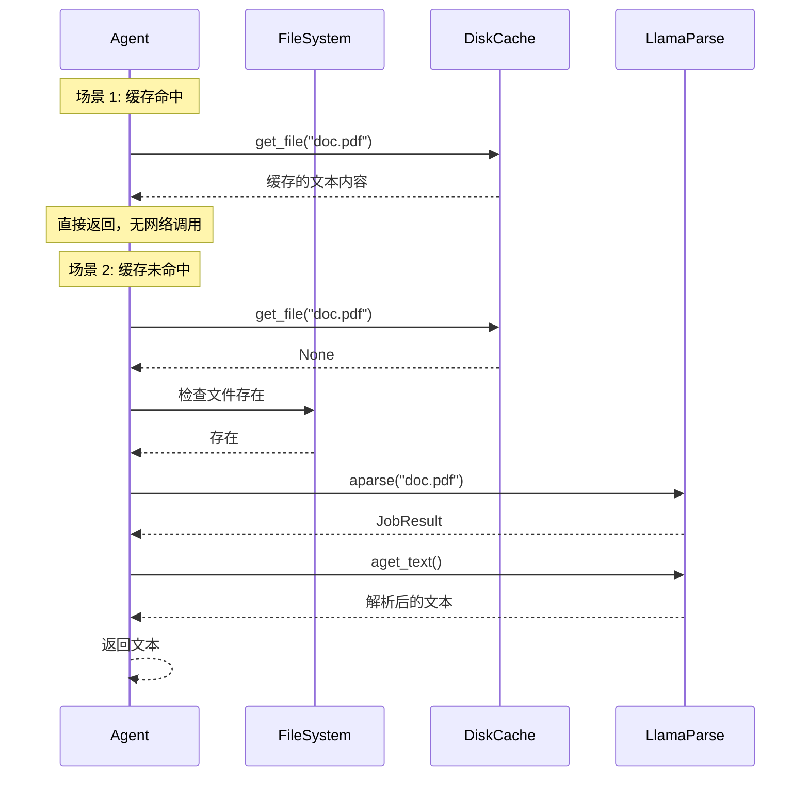
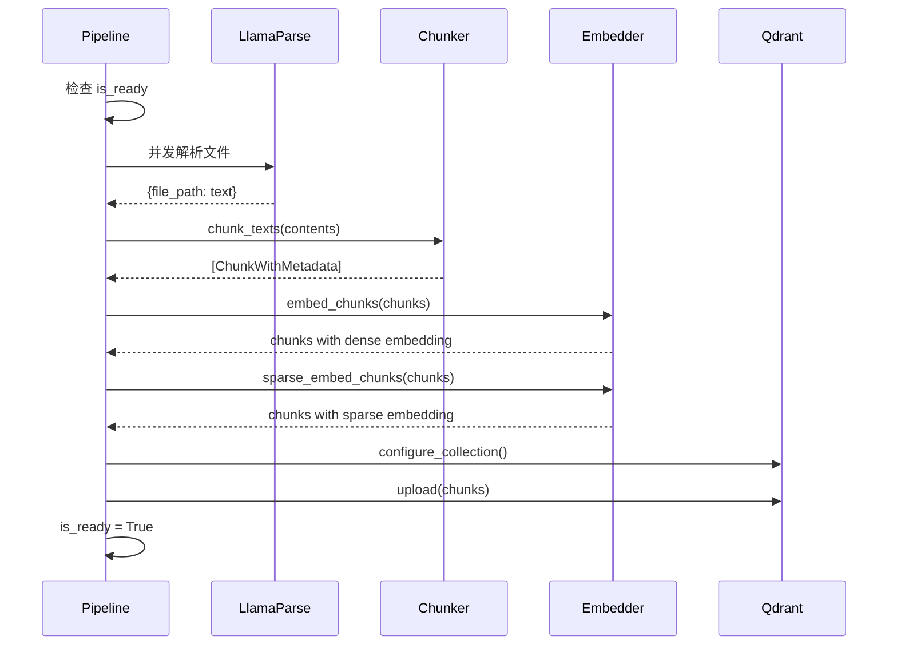
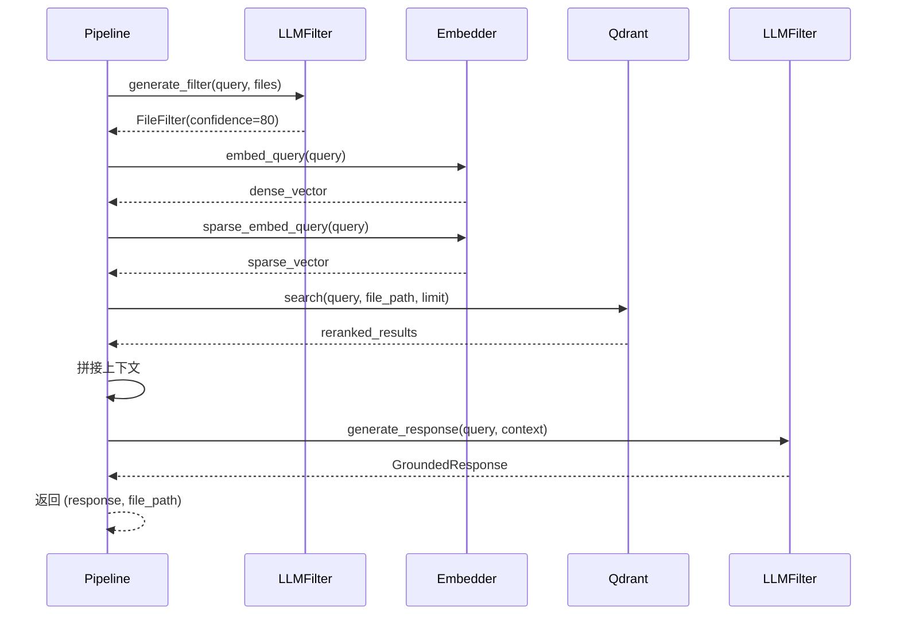
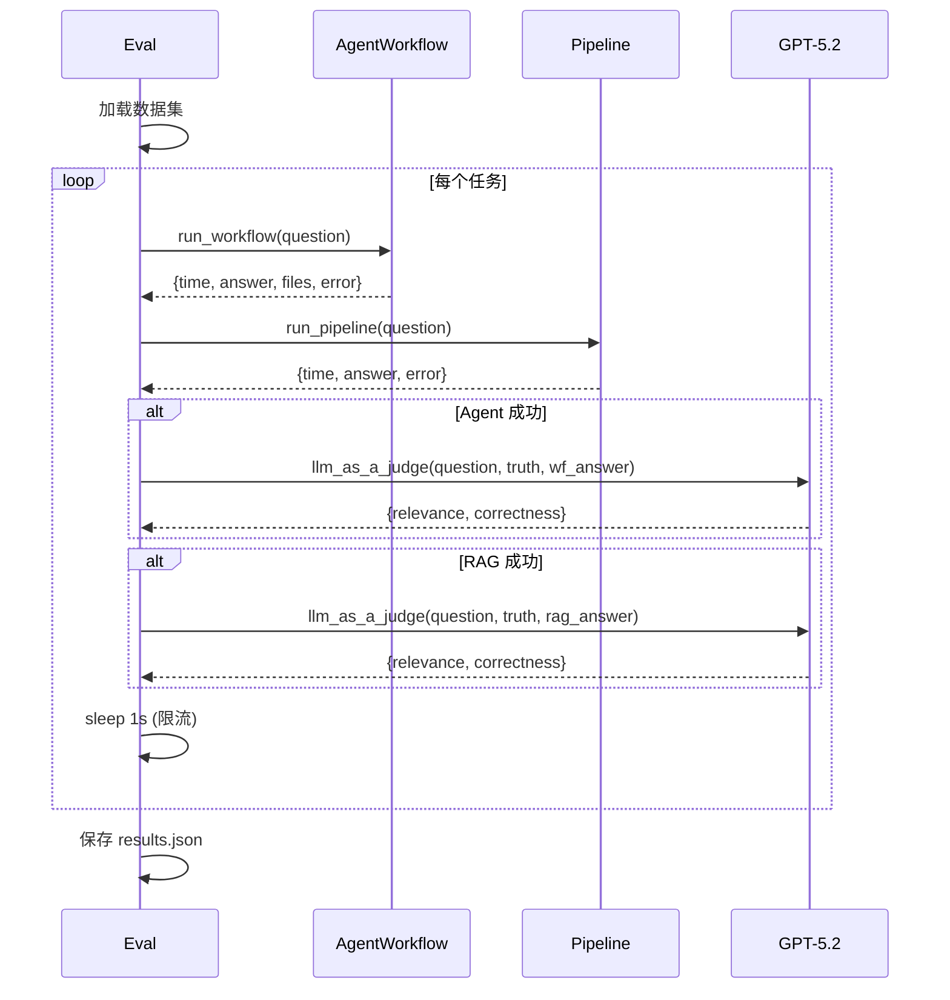

# 03-07 — 时序图汇总

> **本章内容**: 6-8 个核心业务流程的时序图
> **预估字数**: ~10,000 字

---

## 1. Agent 初始化与首次决策

**说明**: 该时序图展示了从用户执行命令到 Agent 完成首次工具调用的完整流程。CLI 解析参数后启动工作流，工作流调用 Agent 获取决策，Agent 调用 Gemini API 并执行工具调用，最后事件被渲染到终端。

---

## 2. 工具调用 → 结果回传 → 下一步决策

**说明**: 展示了工具调用循环的完整生命周期。工具结果被追加到对话历史后，Agent 基于新的上下文继续决策，直到返回 stop 动作。

---

## 3. GoDeeper 目录深入流程

**说明**: 展示了 Agent 决定进入子目录时的状态转换。工作流更新状态中的 current_directory，重新描述新目录内容，然后继续决策循环。

---

## 4. AskHuman 人机交互流程

**说明**: 展示了 Human-in-the-Loop 的完整流程。Agent 发出 AskHumanEvent 后，CLI 暂停状态指示器并等待用户输入，用户回答后通过 HumanAnswerEvent 传回工作流。

---

## 5. 缓存命中 vs 未命中

**说明**: parse_file 工具的两条执行路径。缓存命中时直接返回（< 10ms），缓存未命中时调用 LlamaParse API（10-30s）。

---

## 6. RAG 索引阶段

**说明**: RAG 索引阶段的完整数据流。文档经过解析、分块、双嵌入生成后上传到 Qdrant。

---

## 7. RAG 查询阶段

**说明**: RAG 查询阶段的完整流程。先使用 LLM 筛选文件，然后进行混合检索和 RRF 重排序，最后基于上下文生成回答。

---

## 8. 评估框架双轨执行

**说明**: 评估框架的核心循环。对每个任务，分别运行 Agent 和 RAG，收集执行信息，然后使用 LLM-as-Judge 评估回答质量。

---

☕️ 制作不易，请我喝咖啡☕️关注我➕