# 第3章 系统流程与时序图

> **文件**: `docs/wangbin/03-flows-sequence.md`  
> **预计 Token**: ~20,000  
> **核心内容**: 10+ 核心业务流程，每个含 Mermaid 图 + 300-500 字解释

---

## 3.1 流程总览

GPT Researcher 的核心业务流程可以用以下总览图表示：

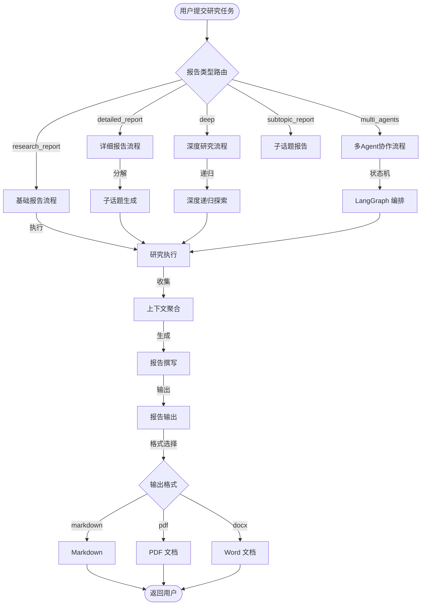

---

## 3.2 流程 1: 标准研究报告生成

### 3.2.1 时序图

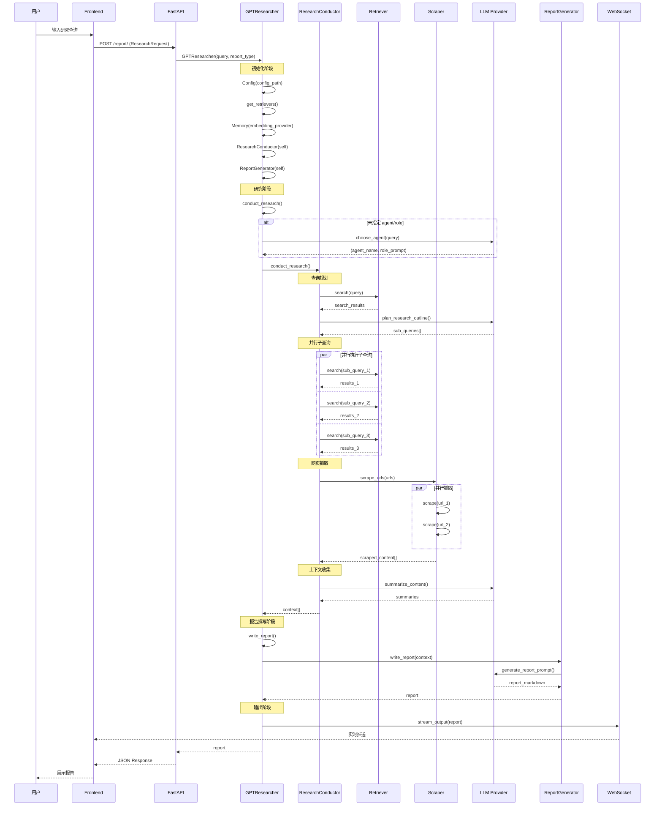

### 3.2.2 详细解释 (450+ 字)

#### 流程步骤分解

**阶段 1: 初始化** (`agent.py:__init__`)
- 加载配置 (`Config`)
- 实例化检索器列表 (`get_retrievers`)
- 初始化嵌入模型 (`Memory`)
- 创建 Skill 组件 (ResearchConductor, ReportGenerator 等)
- 处理 MCP 配置（如果提供）

**阶段 2: Agent 选择** (`actions/agent_creator.py:choose_agent`)
- 如果未预定义 agent/role，调用 LLM 自动选择
- 发送 `auto_agent_instructions()` 提示词
- 解析 LLM 返回的 JSON，提取 `server` 和 `agent_role_prompt`
- 容错处理：JSON 解析失败时使用 `json_repair`，再失败使用正则提取，最后回退到默认 Agent

**阶段 3: 研究执行** (`skills/researcher.py:conduct_research`)
- 调用 `plan_research()` 生成子查询
- 对每个子查询执行搜索 (`get_search_results`)
- 收集所有搜索结果中的 URL
- 调用 `scrape_urls()` 并行抓取网页内容
- 对抓取的内容进行摘要和来源追踪
- 累积到 `self.context` 列表

**阶段 4: 报告撰写** (`skills/writer.py:write_report`)
- 检查上下文是否为空（空则返回拒绝消息）
- 调用 `generate_report()` 生成报告
- 使用 `smart_llm` 模型（默认 gpt-5.4）
- 流式传输到 WebSocket

**阶段 5: 输出**
- Markdown 格式返回
- 可选转换为 PDF/DOCX
- 通过 WebSocket 实时推送进度

#### 异常处理

| 异常场景 | 处理方式 | 代码位置 |
|---------|---------|---------|
| LLM 调用失败 | 最多 10 次重试 | `utils/llm.py:create_chat_completion` |
| Strategic LLM 失败 | 降级到 Smart LLM | `actions/query_processing.py:generate_sub_queries` |
| 搜索无结果 | 返回空列表，继续处理 | `retrievers/tavily/tavily_search.py` |
| 单 URL 抓取失败 | 跳过该 URL，不影响整体 | `scraper/scraper.py:extract_data_from_url` |
| JSON 解析失败 | json_repair → regex → 默认 | `actions/agent_creator.py:handle_json_error` |
| 上下文为空 | 返回拒绝消息 | `skills/writer.py:write_report` |

#### 性能特征

- **并行度**: 子查询并行搜索、URL 并行抓取
- **I/O 模型**: 全异步 asyncio
- **线程池**: 阻塞 HTTP 调用通过 `asyncio.to_thread()` 卸载
- **并发控制**: Semaphore 限制同时抓取数（默认 15）

---

## 3.3 流程 2: 深度研究 (Deep Research)

### 3.3.1 时序图

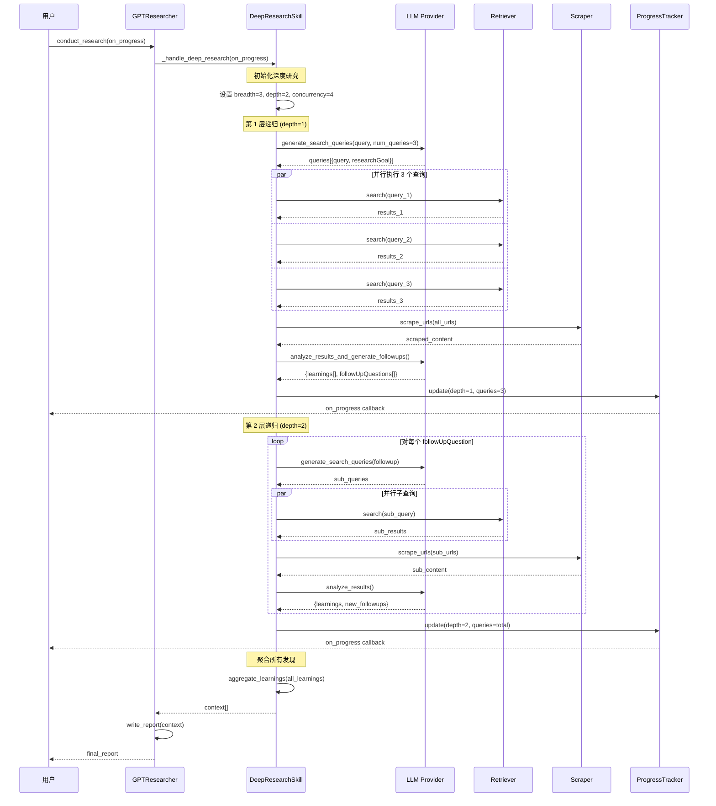

### 3.3.2 详细解释 (450+ 字)

#### 深度研究算法

深度研究采用**递归探索**策略，核心参数：

| 参数 | 默认值 | 说明 |
|------|-------|------|
| `breadth` | 3 | 每层生成的查询数 |
| `depth` | 2 | 递归深度 |
| `concurrency` | 4 | 并发查询数 |

#### 递归树结构

```
                        Root Query
                       /     |     \
                  Query_1  Query_2  Query_3       (depth=1, breadth=3)
                  / | \    / | \    / | \
               Q1a Q1b Q1c ...                  (depth=2, breadth=3 each)
               
总查询数 = breadth^1 + breadth^2 + ... + breadth^depth
        = 3 + 9 = 12 (默认配置)
```

#### 关键函数解析

**1. `parse_search_queries_response()`** (`skills/deep_research.py`)
- 解析 LLM 返回的搜索查询
- 支持 JSON 和纯文本两种格式
- 使用 `json_repair` 容错解析
- 正则表达式作为最终回退

**2. `parse_research_results_response()`**
- 解析研究结果为 `learnings` 和 `followUpQuestions`
- 提取引用来源 (citations)
- 支持多种 JSON 格式

**3. `parse_follow_up_questions_response()`**
- 从 LLM 响应中提取后续问题
- 用于驱动下一层递归

#### 进度追踪

```python
@dataclass
class ResearchProgress:
    current_depth: int
    total_depth: int
    current_breadth: int
    total_breadth: int
    completed_queries: int
    total_queries: int
    current_query: str | None
```

进度通过 `on_progress` 回调实时推送到前端。

#### 上下文管理

- `MAX_CONTEXT_WORDS = 25000`: 上下文最大词数限制
- 超过限制时进行截断或压缩
- 使用 `visited_urls` 集合去重

---

## 3.4 流程 3: 详细报告 (Detailed Report)

### 3.4.1 时序图

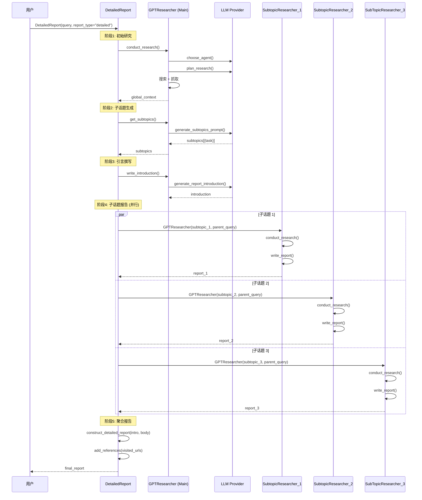

### 3.4.2 详细解释 (400+ 字)

#### 详细报告架构

详细报告采用**分治策略**：
1. 首先进行全局研究，获取整体上下文
2. 基于全局研究生成子话题列表
3. 为每个子话题创建独立的研究 Agent
4. 并行执行子话题研究
5. 聚合所有子话题报告为最终文档

#### 子话题研究特点

每个子话题研究器 (`GPTResearcher`) 具有以下特点：
- `report_type="subtopic_report"`: 标识为子话题报告
- `parent_query`: 继承父查询，提供上下文
- `visited_urls`: 共享已访问 URL 集合，避免重复抓取
- `agent/role`: 继承主 Agent 的角色设定

#### 上下文传递

```python
# 全局上下文传递给子话题
self.global_context = self.gpt_researcher.context
self.global_urls = self.gpt_researcher.visited_urls

# 子话题研究器接收
subtopic_assistant = GPTResearcher(
    query=current_subtopic_task,
    parent_query=self.query,
    visited_urls=self.global_urls,  # 共享 URL 去重
    agent=self.gpt_researcher.agent,  # 继承角色
)
```

#### 报告聚合

最终报告结构：
```
# 主标题 (来自 query)
## 引言 (write_introduction)
## 子话题 1 标题
子话题 1 报告内容
## 子话题 2 标题
子话题 2 报告内容
## 子话题 3 标题
子话题 3 报告内容
## 参考文献 (add_references)
```

---

## 3.5 流程 4: 多 Agent 协作 (Multi-Agent)

### 3.5.1 时序图

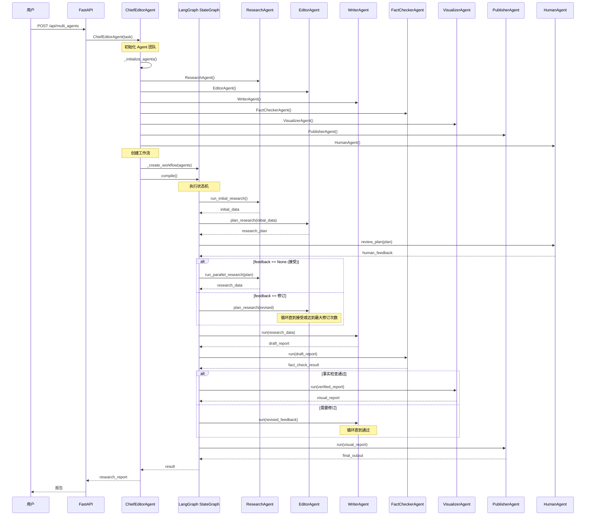

### 3.5.2 详细解释 (450+ 字)

#### LangGraph 状态机设计

多 Agent 协作基于 LangGraph 的 `StateGraph`，定义了以下状态：

```python
class ResearchState(TypedDict):
    task: Dict                    # 任务信息
    initial_data: str             # 初始研究结果
    research_plan: str            # 研究计划
    human_feedback: str | None    # 人类反馈
    revisions_count: int          # 修订计数
    research_data: str            # 研究数据
    draft_report: str             # 草稿报告
    fact_check_result: str        # 事实检查结果
    visual_report: str            # 可视化报告
    final_output: str             # 最终输出
```

#### 状态转换图

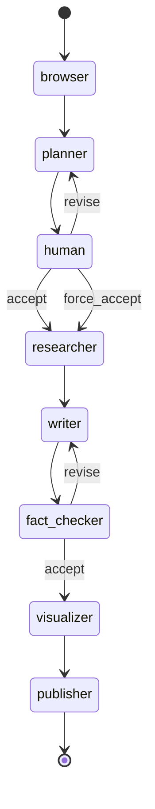

#### Agent 角色定义

| Agent | 职责 | 输入 | 输出 |
|-------|------|------|------|
| ResearchAgent | 初始研究 + 并行深入研究 | task/plan | research_data |
| EditorAgent | 研究计划制定 | initial_data | research_plan |
| WriterAgent | 报告撰写 | research_data | draft_report |
| FactCheckerAgent | 事实核查 | draft_report | verified/revised |
| VisualizerAgent | 可视化增强 | verified_report | visual_report |
| PublisherAgent | 最终发布 | visual_report | final_output |
| HumanAgent | 人类审核 | plan | feedback |

#### Human-in-the-Loop

```python
# 条件边：人类反馈路由
workflow.add_conditional_edges(
    'human',
    lambda state: (
        "accept" if state['human_feedback'] is None
        else "force_accept" if state.get('revisions_count', 0) >= MAX_REVISIONS
        else "revise"
    ),
    {"accept": "researcher", "force_accept": "researcher", "revise": "planner"}
)
```

- `human_feedback is None`: 人类接受计划
- `revisions_count >= MAX_REVISIONS (5)`: 强制接受
- 否则: 返回 planner 修订

#### 事实核查循环

```python
workflow.add_conditional_edges(
    'fact_checker',
    self._route_fact_check,
    {"accept": "visualizer", "revise": "writer"}
)
```

事实检查不通过时返回 writer 修订，通过时进入 visualizer。

---

## 3.6 流程 5: MCP 两阶段检索

### 3.6.1 时序图

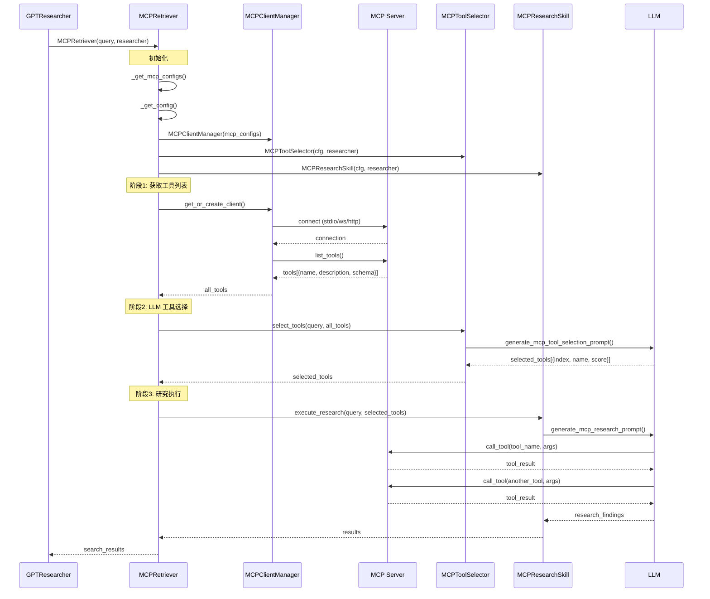

### 3.6.2 详细解释 (400+ 字)

#### MCP 两阶段方法

**阶段 1: 工具选择 (Tool Selection)**
- 从所有连接的 MCP 服务器获取可用工具列表
- 使用 LLM 分析查询与工具的相关性
- 选择 2-3 个最相关的工具
- 返回工具名称、相关性评分、选择理由

**阶段 2: 研究执行 (Research Execution)**
- 将选中的工具绑定到 LLM
- LLM 自主决定何时调用工具、调用哪些工具
- 工具结果反馈给 LLM 进行综合分析
- 返回研究发现

#### MCP 传输协议支持

| 传输类型 | 说明 | 配置方式 |
|---------|------|---------|
| **stdio** | 标准输入/输出 | `command` + `args` |
| **websocket** | WebSocket 连接 | `connection_url: wss://...` |
| **streamable_http** | HTTP 流式 | `connection_url: https://...` |

#### 配置示例

```python
mcp_configs=[{
    "name": "my_search",
    "command": "python",
    "args": ["my_mcp_server.py"],
    "env": {"API_KEY": "xxx"}
}]

# 或远程连接
mcp_configs=[{
    "name": "remote_tool",
    "connection_url": "wss://mcp.example.com/ws",
    "connection_token": "Bearer xxx"
}]
```

#### MCP 策略

| 策略 | 说明 | 适用场景 |
|------|------|---------|
| `fast` | 仅对原始查询执行一次 MCP | 快速研究 |
| `deep` | 对所有子查询执行 MCP | 深度研究 |
| `disabled` | 跳过 MCP，使用 Web 检索器 | 无 MCP 配置 |

---

## 3.7 流程 6: WebSocket 实时流式传输

### 3.7.1 时序图

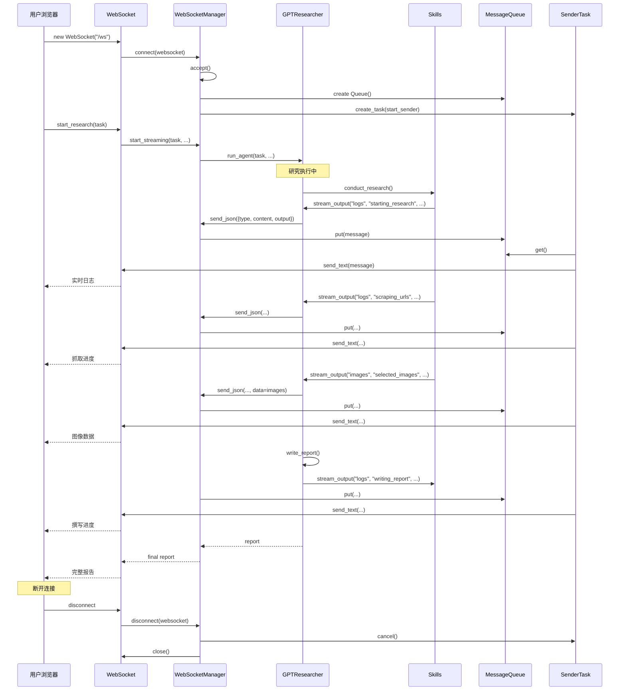

### 3.7.2 详细解释 (350+ 字)

#### WebSocket 架构

WebSocket 连接由 `WebSocketManager` 管理，每个连接包含：
- `active_connections`: 活跃连接列表
- `message_queues`: 每个连接的消息队列
- `sender_tasks`: 每个连接的发送任务

#### 消息类型

| 类型 | 说明 | 数据 |
|------|------|------|
| `logs` | 研究日志 | 步骤描述文本 |
| `images` | 图像数据 | 图像 URL 列表 |
| `cost` | 成本更新 | token 用量和费用 |
| `research_report` | 最终报告 | 完整报告文本 |

#### 消息队列模式

```python
# 生产者 (Agent)
await websocket.send_json({
    "type": "logs",
    "content": "scraping_urls",
    "output": "🌐 Scraping content from 5 URLs...",
    "metadata": None
})

# 消费者 (Sender Task)
while True:
    message = await queue.get()
    if message is None:  # Shutdown signal
        break
    await websocket.send_text(message)
```

#### 连接生命周期

1. **连接**: `connect()` → accept → 创建 Queue → 启动 Sender Task
2. **通信**: Agent 通过 Queue 推送消息，Sender Task 转发到 WebSocket
3. **断开**: `disconnect()` → 取消 Sender Task → 清理 Queue → 关闭连接

---

## 3.8 流程 7: 图像生成与嵌入

### 3.8.1 流程图

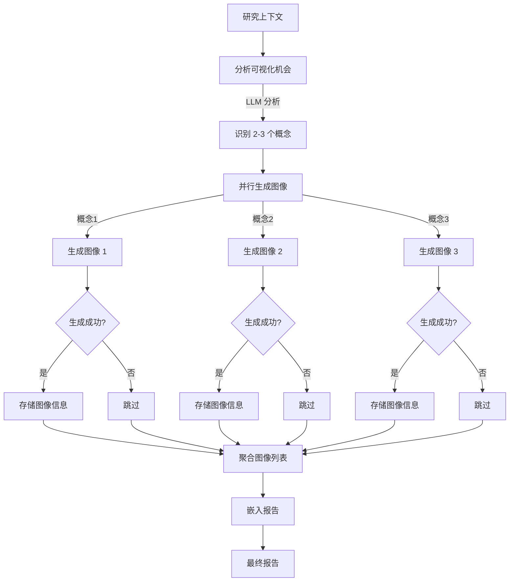

### 3.8.2 详细解释 (350+ 字)

#### 图像生成流程

**1. 图像规划** (`ImageGenerator.plan_and_generate_images`)
- 分析研究上下文，识别可视化机会
- 使用 LLM 确定 2-3 个最适合插图的概念
- 为每个概念生成图像提示词

**2. 图像生成**
- 支持两种提供商：Google Gemini 和 ModelsLab
- 并行生成所有图像
- 可配置图像风格 (dark/light/auto)

**3. 图像嵌入**
- 预生成的图像在报告撰写前完成
- 图像信息传递给 `write_report()`
- 报告中嵌入图像引用

#### 配置选项

```python
IMAGE_GENERATION_ENABLED = False  # 总开关
IMAGE_GENERATION_PROVIDER = "google"  # google/modelslab
IMAGE_GENERATION_MODEL = "models/gemini-2.5-flash-image"
IMAGE_GENERATION_MAX_IMAGES = 3
IMAGE_GENERATION_STYLE = "dark"
```

---

## 3.9 流程 8: 聊天问答 (Chat)

### 3.9.1 时序图

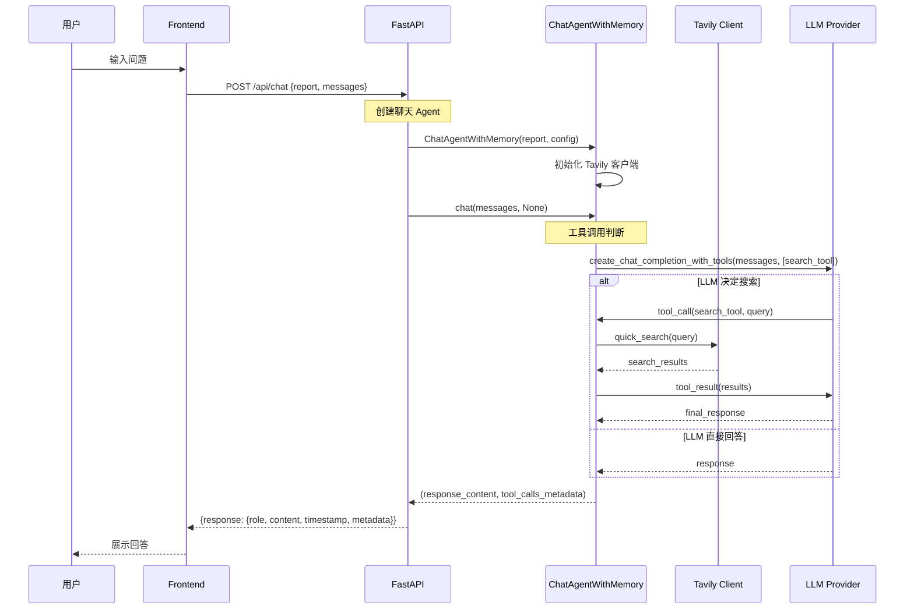

### 3.9.2 详细解释 (300+ 字)

#### 聊天 Agent 设计

`ChatAgentWithMemory` 是基于研究报告的交互式问答系统：
- 接收完整报告作为上下文
- 支持工具调用（网络搜索）
- 返回结构化响应（含工具调用元数据）

#### 工具调用

聊天 Agent 使用 `create_chat_completion_with_tools()` 实现工具调用：
- 定义 `search_tool` 工具
- LLM 自主决定是否需要搜索
- 搜索结果作为工具返回值反馈给 LLM

#### 响应格式

```json
{
  "response": {
    "role": "assistant",
    "content": "回答内容...",
    "timestamp": 1721234567890,
    "metadata": {
      "tool_calls": [
        {
          "tool": "quick_search",
          "args": {"query": "..."},
          "result": "..."
        }
      ]
    }
  }
}
```

---

## 3.10 流程 9: 爬虫调度与限速

### 3.10.1 流程图

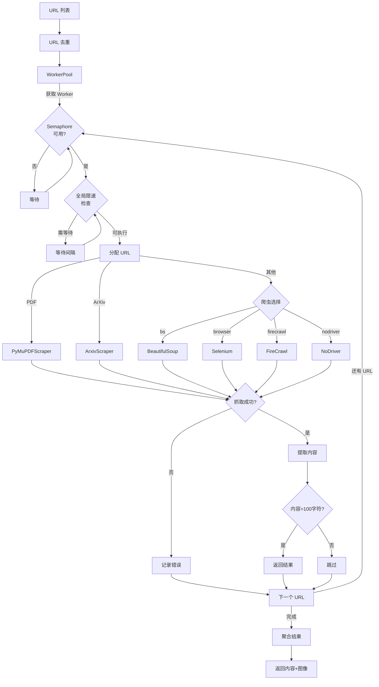

### 3.10.2 详细解释 (350+ 字)

#### WorkerPool 并发控制

```python
class WorkerPool:
    def __init__(self, max_workers: int, rate_limit_delay: float):
        self.executor = ThreadPoolExecutor(max_workers=max_workers)
        self.semaphore = asyncio.Semaphore(max_workers)
```

- `Semaphore`: 限制并发抓取数（默认 15）
- `ThreadPoolExecutor`: 执行阻塞 I/O 操作
- `GlobalRateLimiter`: 全局限速（跨所有 WorkerPool）

#### 爬虫选择逻辑

```python
def get_scraper(self, link):
    path = urlparse(link).path
    if path.lower().endswith(".pdf"):
        return PyMuPDFScraper
    elif "arxiv.org" in link:
        return ArxivScraper
    else:
        return SCRAPER_CLASSES[self.scraper]  # 默认爬虫
```

#### 限速机制

```python
# 全局限速器（单例）
class GlobalRateLimiter:
    async def wait_if_needed(self):
        async with self.lock:
            time_since_last = time.time() - self.last_request_time
            if time_since_last < self.rate_limit_delay:
                await asyncio.sleep(self.rate_limit_delay - time_since_last)
            self.last_request_time = time.time()
```

---

## 3.11 流程 10: 配置加载与 Retriever 工厂

### 3.11.1 时序图

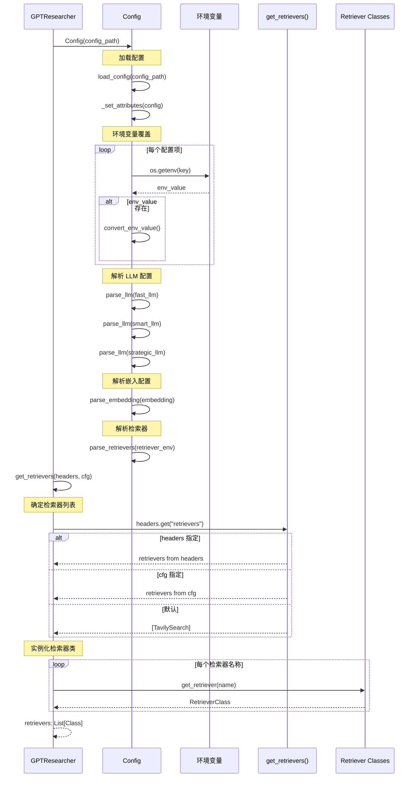

### 3.11.2 详细解释 (300+ 字)

#### 配置优先级

1. **环境变量** (最高优先级): `os.getenv(key)`
2. **配置文件**: JSON 文件中的值
3. **默认值** (`variables/default.py`): 硬编码默认值

#### LLM 配置格式

```python
# 格式: "provider:model"
"FAST_LLM": "openai:gpt-5.4-mini"
"SMART_LLM": "openai:gpt-5.4"
"STRATEGIC_LLM": "openai:gpt-5.4"

# parse_llm() 解析为:
# ("openai", "gpt-5.4-mini")
```

#### Retriever 解析

```python
# 支持逗号分隔的多检索器
"RETRIEVER": "tavily,exa,duckduckgo"

# parse_retrievers() 解析为:
# ["tavily", "exa", "duckduckgo"]
```

---

## 3.12 流程总结

| 流程 | 触发入口 | 核心组件 | 输出 |
|------|---------|---------|------|
| 标准研究 | `POST /report/` | BasicReport | Markdown 报告 |
| 深度研究 | `report_type="deep"` | DeepResearchSkill | 深度报告 |
| 详细报告 | `report_type="detailed"` | DetailedReport | 多章节报告 |
| 多 Agent | `POST /api/multi_agents` | LangGraph StateGraph | 协作报告 |
| MCP 检索 | `mcp_configs` 配置 | MCPRetriever | 工具增强结果 |
| WebSocket | `WebSocket /ws` | WebSocketManager | 实时流 |
| 图像生成 | `IMAGE_GENERATION_ENABLED` | ImageGenerator | 报告插图 |
| 聊天问答 | `POST /api/chat` | ChatAgentWithMemory | 交互回答 |
| 爬虫调度 | `scrape_urls()` | WorkerPool + Scraper | 网页内容 |
| 配置加载 | `Config.__init__` | Config + get_retrievers | 系统配置 |

---

> **下一章**: → `04-module-structure.md` — 模块/包结构与依赖分析

---

☕️ 制作不易，请我喝咖啡☕️关注我➕