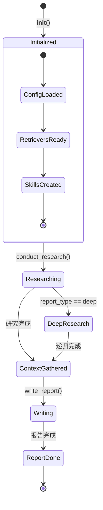
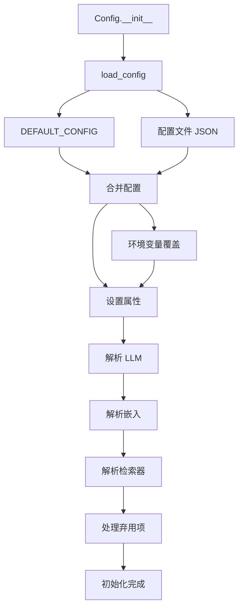
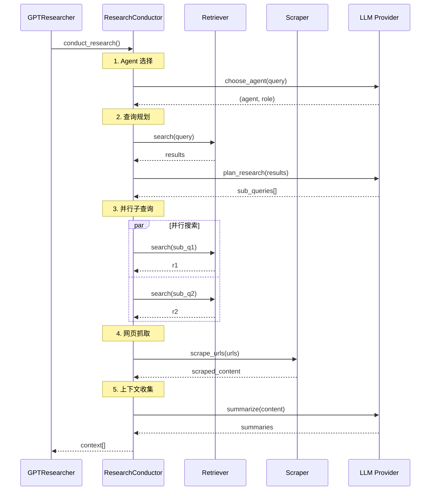
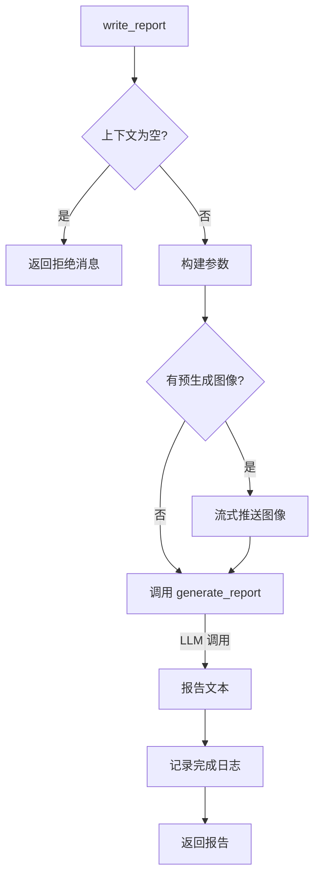
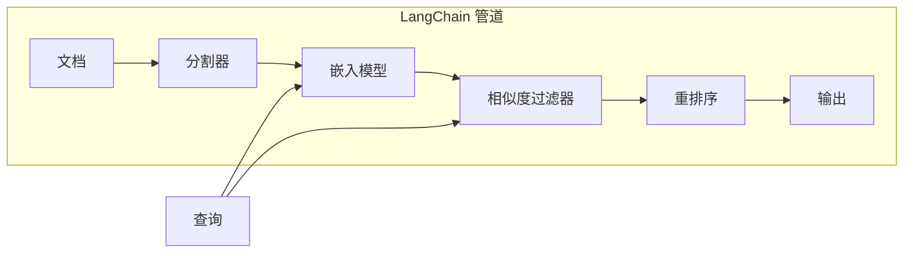
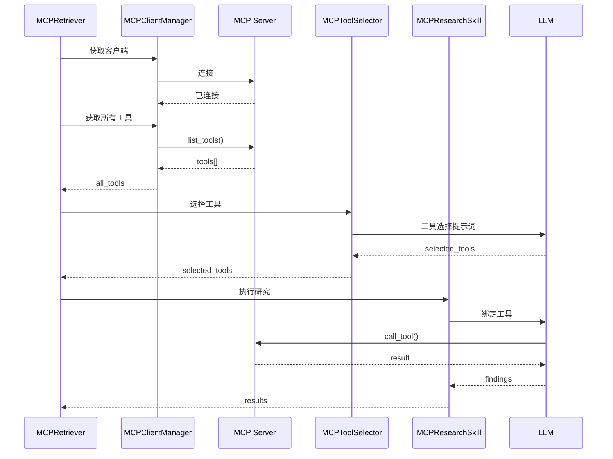
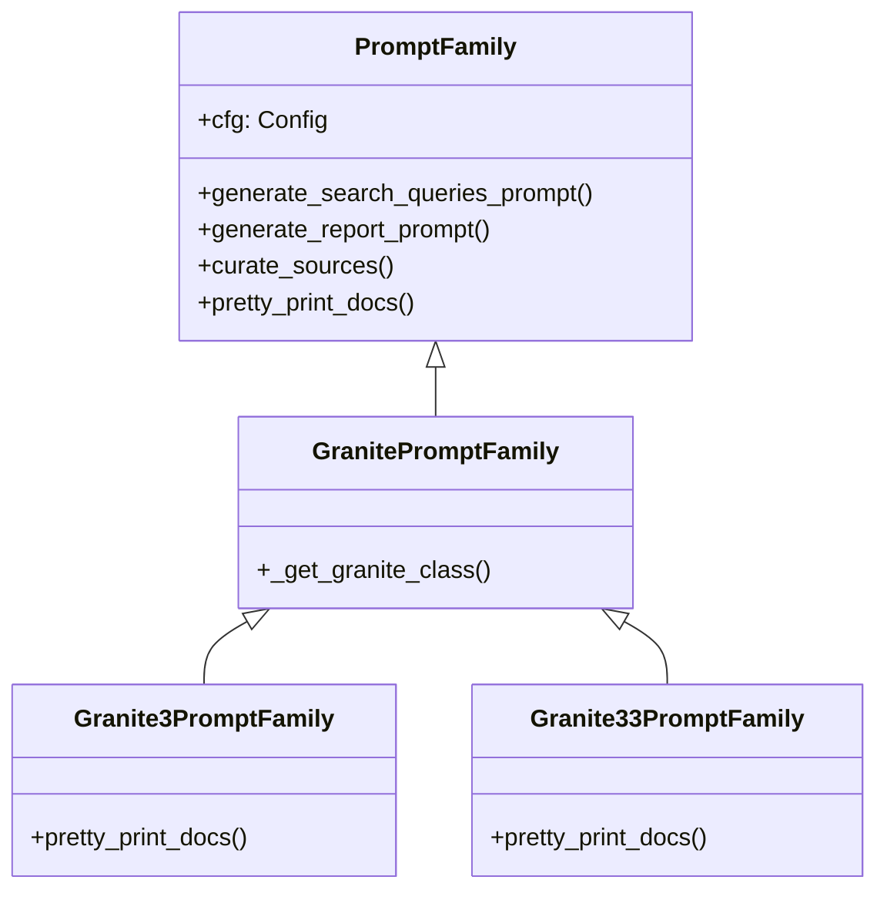
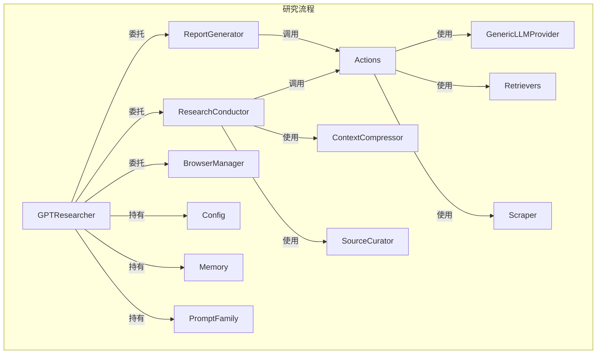

# 附录E 组件独立代码走读文档

> **文件**: `docs/wangbin/10-appendix-e.md`  
> **预计 Token**: ~15,000  
> **核心内容**: 每个核心组件的独立 Walkthrough

---

## E.1 GPTResearcher 组件 Walkthrough

### E.1.1 组件概述

**文件**: `gpt_researcher/agent.py`  
**类**: `GPTResearcher`  
**职责**: 主编排器，协调所有研究子组件

### E.1.2 生命周期



### E.1.3 关键方法走读

#### `__init__` (第 67-180 行)

**功能**: 初始化所有组件

**步骤**:
1. 保存查询参数
2. 加载配置 `Config(config_path)`
3. 初始化检索器 `get_retrievers(headers, cfg)`
4. 初始化嵌入 `Memory(embedding_provider, model)`
5. 创建 Skill 组件
6. 处理 MCP 配置

**依赖注入**: 所有 Skills 通过 `self` (researcher 引用) 注入。

**设计考量**:
- 参数过多（30+），建议后续重构为配置对象
- `**kwargs` 透传可能导致参数污染

#### `conduct_research` (第 232-280 行)

**功能**: 执行研究主流程

**流程**:
```
1. 日志记录研究开始
2. 深度研究判断 → _handle_deep_research
3. Agent 选择 → choose_agent
4. 研究执行 → research_conductor.conduct_research
5. 图像预生成（如果启用）
6. 返回上下文
```

**异常处理**: 各子组件自行处理，Agent 层不捕获。

#### `write_report` (第 320-380 行)

**功能**: 撰写研究报告

**参数**:
- `existing_headers`: 避免重复标题
- `relevant_written_contents`: 已写内容上下文
- `ext_context`: 外部上下文覆盖
- `custom_prompt`: 自定义提示词
- `available_images`: 预生成图像

**委托**: 实际生成委托给 `ReportGenerator.write_report()`。

---

## E.2 Config 组件 Walkthrough

### E.2.1 组件概述

**文件**: `gpt_researcher/config/config.py`  
**类**: `Config`  
**职责**: 配置加载、解析、管理

### E.2.2 配置加载流程



### E.2.3 关键方法走读

#### `load_config` (第 35-50 行)

**功能**: 加载配置文件

**实现**:
```python
def load_config(self, config_path):
    config = DEFAULT_CONFIG.copy()  # 从默认值开始
    
    if config_path and os.path.exists(config_path):
        with open(config_path, 'r') as f:
            file_config = json.load(f)
        config.update(file_config)  # 合并文件配置
    
    return config
```

**优先级**: 配置文件 > 默认值

#### `_set_attributes` (第 52-75 行)

**功能**: 设置实例属性，环境变量覆盖

**实现**:
```python
def _set_attributes(self, config):
    for key, value in config.items():
        env_value = os.getenv(key)
        if env_value is not None:
            value = self.convert_env_value(key, env_value, type_hint)
        setattr(self, key.lower(), value)  # 小写属性名
```

**环境变量优先级**: 环境变量 > 配置文件 > 默认值

#### `parse_llm` (第 95-110 行)

**功能**: 解析 `"provider:model"` 格式

**示例**:
- `"openai:gpt-5.4"` → `("openai", "gpt-5.4")`
- `"anthropic:claude-4-sonnet"` → `("anthropic", "claude-4-sonnet")`

---

## E.3 ResearchConductor 组件 Walkthrough

### E.3.1 组件概述

**文件**: `gpt_researcher/skills/researcher.py`  
**类**: `ResearchConductor`  
**职责**: 查询规划、搜索、抓取、上下文收集

### E.3.2 研究执行流程



### E.3.3 MCP 缓存机制

```python
class ResearchConductor:
    def __init__(self, researcher):
        self._mcp_results_cache = None
        self._mcp_cache_lock = asyncio.Lock()
    
    async def _get_mcp_results(self):
        # 双重检查锁定模式
        if self._mcp_results_cache is not None:
            return self._mcp_results_cache
        
        async with self._mcp_cache_lock:
            if self._mcp_results_cache is not None:
                return self._mcp_results_cache
            
            self._mcp_results_cache = await self._execute_mcp_search()
            return self._mcp_results_cache
```

**设计**: 避免并发请求时重复调用 MCP。

---

## E.4 ReportGenerator 组件 Walkthrough

### E.4.1 组件概述

**文件**: `gpt_researcher/skills/writer.py`  
**类**: `ReportGenerator`  
**职责**: 报告写作、引言/结论生成、子话题管理

### E.4.2 报告生成流程



### E.4.3 空内容保护

```python
_ctx = "\n".join(context) if isinstance(context, list) else str(context or "")
if not _ctx.strip():
    return (
        f'I could not gather any source material for "{self.researcher.query}". '
        "No sources were retrieved (searches may have returned nothing or been "
        "blocked), so I am not able to produce a reliable, sourced report."
    )
```

**设计亮点**: 避免在无任何来源时生成伪造报告，保证诚实性。

---

## E.5 BrowserManager 组件 Walkthrough

### E.5.1 组件概述

**文件**: `gpt_researcher/skills/browser.py`  
**类**: `BrowserManager`  
**职责**: URL 调度、内容抓取、图像选择

### E.5.2 图像去重算法

```python
def select_top_images(self, images: list[dict], k: int = 2) -> list[str]:
    unique_images = []
    seen_hashes = set()
    current_research_images = self.researcher.get_research_images()

    # 按分数降序排列
    for img in sorted(images, key=lambda im: im["score"], reverse=True):
        img_hash = get_image_hash(img['url'])
        if (
            img_hash
            and img_hash not in seen_hashes
            and img['url'] not in current_research_images
        ):
            seen_hashes.add(img_hash)
            unique_images.append(img["url"])

            if len(unique_images) == k:
                break

    return unique_images
```

**算法**:
1. 按分数降序排序
2. 计算图像 URL 哈希
3. 去重（哈希 + 已存在检查）
4. 返回前 k 个

**时间复杂度**: O(n log n) — 排序主导

---

## E.6 ContextCompressor 组件 Walkthrough

### E.6.1 组件概述

**文件**: `gpt_researcher/context/compression.py`  
**类**: `ContextCompressor`  
**职责**: 基于嵌入相似度的文档压缩

### E.6.2 压缩管道



### E.6.3 关键实现

```python
class ContextCompressor:
    async def async_get_context(self, query, max_results=5, min_score=0.7):
        # 分割文档
        chunks = self.text_splitter.split_documents(self.documents)
        
        # 创建压缩管道
        compressor = EmbeddingsFilter(
            embeddings=self.embeddings,
            similarity_threshold=min_score,
            k=max_results,
        )
        
        # 过滤
        relevant_docs = await compressor.ainvoke(
            documents=chunks,
            query=query,
        )
        
        return self.prompt_family.pretty_print_docs(relevant_docs)
```

---

## E.7 GenericLLMProvider 组件 Walkthrough

### E.7.1 组件概述

**文件**: `gpt_researcher/llm_provider/generic/base.py`  
**类**: `GenericLLMProvider`  
**职责**: 统一 27 家 LLM 提供商的调用接口

### E.7.2 工厂方法

```python
@classmethod
def from_provider(cls, provider: str, chat_log: str = None, verbose: bool = True, **kwargs):
    if provider == "openai":
        from langchain_openai import ChatOpenAI
        kwargs.setdefault("stream_usage", True)
        llm = ChatOpenAI(**kwargs)
    elif provider == "anthropic":
        from langchain_anthropic import ChatAnthropic
        llm = ChatAnthropic(**kwargs)
    # ... 25 更多
    
    return cls(llm, chat_log, verbose)
```

**设计**: 每个提供商独立的导入和初始化逻辑。

### E.7.3 特殊模型处理

```python
# 不支持 temperature 的模型
NO_SUPPORT_TEMPERATURE_MODELS = [
    "deepseek/deepseek-reasoner",
    "o1-mini", "o1", "o3-mini", "o3", "o4-mini",
    "gpt-5", "gpt-5.4", "claude-sonnet-4-5", ...
]

# 支持 reasoning_effort 的模型
SUPPORT_REASONING_EFFORT_MODELS = [
    "o3-mini", "o3", "o4-mini",
    "gpt-5.4", "gpt-5.4-mini", "gpt-5.5", ...
]
```

---

## E.8 MCPRetriever 组件 Walkthrough

### E.8.1 组件概述

**文件**: `gpt_researcher/retrievers/mcp/retriever.py`  
**类**: `MCPRetriever`  
**职责**: 两阶段 MCP 工具选择与执行

### E.8.2 两阶段流程



---

## E.9 Scraper 组件 Walkthrough

### E.9.1 组件概述

**文件**: `gpt_researcher/scraper/scraper.py`  
**类**: `Scraper`  
**职责**: URL 去重、爬虫选择、并行抓取

### E.9.2 爬虫路由

```python
def get_scraper(self, link):
    path = urlparse(link).path
    if path.lower().endswith(".pdf"):
        return PyMuPDFScraper
    elif "arxiv.org" in link:
        return ArxivScraper
    else:
        return SCRAPER_CLASSES[self.scraper]  # 默认
```

### E.9.3 并发控制

```python
async def run(self):
    contents = await asyncio.gather(*[
        self.extract_data_from_url(url, self.session)
        for url in self.urls
    ])
    return [c for c in contents if c["raw_content"] is not None]
```

---

## E.10 PromptFamily 组件 Walkthrough

### E.10.1 组件概述

**文件**: `gpt_researcher/prompts.py`  
**类**: `PromptFamily`  
**职责**: 封装所有 LLM 提示词

### E.10.2 继承体系



---

## E.11 ReportStore 组件 Walkthrough

### E.11.1 组件概述

**文件**: `backend/server/report_store.py`  
**类**: `ReportStore`  
**职责**: 报告元数据持久化

### E.11.2 存储实现

```python
class ReportStore:
    def __init__(self, storage_path: Path):
        self.storage_path = storage_path
        self._cache: Dict[str, dict] = {}
        self._lock = asyncio.Lock()
    
    async def upsert_report(self, research_id: str, report: dict) -> None:
        async with self._lock:
            self._cache[research_id] = report
            await self._persist()
    
    async def _persist(self) -> None:
        async with aiofiles.open(self.storage_path, 'w') as f:
            await f.write(json.dumps(self._cache, indent=2))
```

**并发控制**: `asyncio.Lock` 保护写操作。

---

## E.12 组件交互总结



---

> **文档结束**: 本文档完整覆盖了 GPT Researcher v0.14.7 的所有核心组件。详细索引见 `00-index.md`。

---

☕️ 制作不易，请我喝咖啡☕️关注我➕