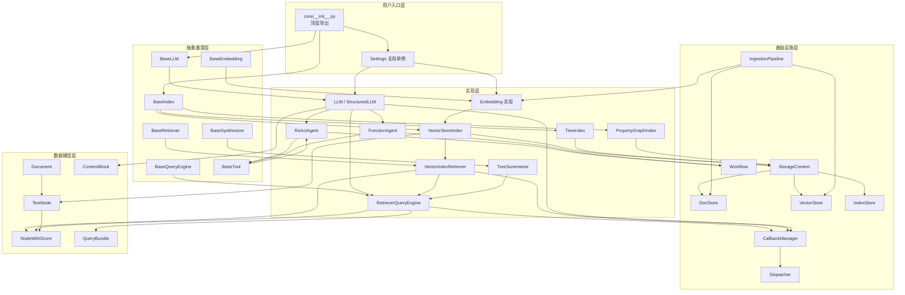

# 第 4 章：模块/包结构与依赖分析

> 本章完整展示 LlamaIndex 的项目目录结构，详细描述每个主要目录/模块的功能职责、输入输出，并绘制模块间依赖关系图。

---

## 4.1 完整项目目录结构树

### 4.1.1 顶层结构

```
llama_index/                                    # 仓库根目录
├── llama-index-core/                           # 核心框架包
│   ├── llama_index/core/                       # 核心源码（480 文件）
│   ├── tests/                                  # 核心测试（47 子目录）
│   ├── pyproject.toml                          # 包配置
│   └── uv.lock                                 # 依赖锁定
├── llama-index-integrations/                   # 集成包（31 类, ~600+ 子包）
│   ├── llms/                                   # 104 个 LLM 集成
│   ├── embeddings/                             # 66 个 Embedding 集成
│   ├── vector_stores/                          # 78 个向量存储集成
│   ├── readers/                                # 159 个 Reader 集成
│   ├── tools/                                  # 67 个工具集成
│   ├── postprocessor/                          # 26 个后处理集成
│   ├── graph_stores/                           # 7 个图存储集成
│   ├── indices/                                # 9 个索引集成
│   ├── callbacks/                              # 12 个回调集成
│   ├── retrievers/                             # 14 个检索器集成
│   ├── node_parser/                            # 6 个节点解析器集成
│   ├── storage/                                # 存储集成（chat/doc/index/kv）
│   ├── agent/                                  # 2 个 Agent 集成
│   ├── memory/                                 # 2 个记忆集成
│   ├── program/                                # 3 个程序集成
│   ├── extractors/                             # 3 个抽取器集成
│   ├── output_parsers/                         # 2 个输出解析器集成
│   ├── voice_agents/                           # 3 个语音 Agent 集成
│   ├── evaluation/                             # 评估集成
│   ├── graph_rag/                              # 图 RAG 集成
│   ├── ingestion/                              # 摄入集成
│   ├── observability/                          # 可观测性集成
│   ├── protocols/                              # 协议集成
│   ├── question_gen/                           # 问题生成集成
│   ├── response_synthesizers/                  # 响应合成器集成
│   ├── selectors/                              # 选择器集成
│   └── sparse_embeddings/                      # 稀疏嵌入集成
├── llama-index-instrumentation/                # 可观测性包
│   ├── src/llama_index_instrumentation/        # 源码
│   ├── tests/                                  # 测试
│   └── pyproject.toml
├── llama-index-utils/                          # 工具包
│   ├── llama-index-utils-azure/                # Azure 工具
│   ├── llama-index-utils-huggingface/          # HuggingFace 工具
│   ├── llama-index-utils-oracleai/             # OracleAI 工具
│   └── llama-index-utils-qianfan/              # 千帆工具
├── llama-dev/                                  # 开发者 CLI 工具
│   ├── llama_dev/                              # CLI 源码
│   ├── tests/                                  # 测试
│   └── pyproject.toml
├── docs/                                       # 文档
│   ├── api_reference/                          # API 参考
│   ├── examples/                               # 示例笔记本
│   └── src/                                    # 文档源码
├── scripts/                                    # 维护脚本
│   ├── bulk-version-bump.py                    # 批量版本管理
│   ├── convert-examples.py                     # 笔记本转 Markdown
│   ├── integration_health_check.py             # 集成健康检查
│   ├── publish_packages.sh                     # 包发布
│   └── sync-docs-to-developer-hub.sh           # 文档同步
├── pyproject.toml                              # 根项目配置
├── uv.lock                                     # 全局依赖锁定
├── Makefile                                    # 构建命令
├── .pre-commit-config.yaml                     # 预提交钩子
├── .github/                                    # GitHub Actions
├── CHANGELOG.md                                # 变更日志
├── README.md                                   # 项目说明
├── CONTRIBUTING.md                             # 贡献指南
├── SECURITY.md                                 # 安全政策
└── LICENSE                                     # MIT 许可证
```

### 4.1.2 核心包内部结构（详细到 3 级）

```
llama-index-core/llama_index/core/              # 核心源码根
├── __init__.py                                 # 顶层导出（151 行）
├── async_utils.py                              # 异步工具函数
├── constants.py                                # 常量定义
├── image_retriever.py                          # 图像检索器
├── img_utils.py                                # 图像工具
├── rate_limiter.py                             # 速率限制器
├── schema.py                                   # 核心 Schema（1492 行，最大文件）
├── service_context.py                          # 服务上下文（已弃用）
├── settings.py                                 # 全局设置单例
├── types.py                                    # 类型定义
├── utils.py                                    # 通用工具（710 行）
│
├── agent/                                      # Agent 系统
│   ├── __init__.py
│   ├── utils.py                                # Agent 工具函数
│   ├── react/                                  # ReAct Agent（旧版）
│   │   ├── __init__.py
│   │   ├── formatter.py                        # ReAct 格式化器
│   │   ├── output_parser.py                    # ReAct 输出解析器
│   │   ├── prompts.py                          # ReAct 提示
│   │   └── types.py                            # ReAct 类型
│   └── workflow/                               # Workflow-based Agent（新版）
│       ├── __init__.py
│       ├── agent_context.py                    # Agent 上下文
│       ├── base_agent.py                       # 抽象基类
│       ├── codeact_agent.py                    # CodeAct Agent
│       ├── function_agent.py                   # Function Agent
│       ├── multi_agent_workflow.py             # 多 Agent 工作流
│       ├── prompts.py                          # Agent 提示
│       ├── react_agent.py                      # ReAct Workflow Agent
│       └── workflow_events.py                  # Agent 事件类型
│
├── base/                                       # 抽象基类层
│   ├── __init__.py
│   ├── base_auto_retriever.py                  # 自动检索器基类
│   ├── base_multi_modal_retriever.py           # 多模态检索器基类
│   ├── base_query_engine.py                    # 查询引擎基类
│   ├── base_retriever.py                       # 检索器基类
│   ├── base_selector.py                        # 选择器基类
│   ├── embeddings/                             # Embedding 基类
│   │   ├── __init__.py
│   │   ├── base.py                             # BaseEmbedding
│   │   └── base_sparse.py                      # 稀疏 Embedding 基类
│   ├── llms/                                   # LLM 基类
│   │   ├── __init__.py
│   │   ├── base.py                             # BaseLLM
│   │   ├── generic_utils.py                    # 通用工具
│   │   └── types.py                            # LLM 类型（ChatMessage, ContentBlock 等）
│   └── response/                               # 响应基类
│       ├── __init__.py
│       └── schema.py                           # Response / StreamingResponse
│
├── bridge/                                     # 跨框架桥接
│   ├── __init__.py
│   ├── langchain.py                            # LangChain 类型适配
│   ├── pydantic.py                             # Pydantic v1 适配
│   ├── pydantic_core.py                        # Pydantic Core 适配
│   └── pydantic_settings.py                    # Pydantic Settings 适配
│
├── callbacks/                                  # 回调系统
│   ├── __init__.py
│   ├── base.py                                 # CallbackManager 基类
│   ├── base_handler.py                         # 回调处理器基类
│   ├── global_handlers.py                      # 全局处理器
│   ├── llama_debug.py                          # LlamaDebugHandler
│   ├── pythonically_printing_base_handler.py   # 打印处理器
│   ├── schema.py                               # 回调 Schema
│   ├── simple_llm_handler.py                   # 简单 LLM 处理器
│   ├── token_counting.py                       # Token 计数
│   └── utils.py                                # 回调工具
│
├── chat_engine/                                # 对话引擎
│   ├── __init__.py
│   ├── condense_plus_context.py                # 压缩+上下文模式
│   ├── condense_question.py                    # 问题压缩模式
│   ├── context.py                              # 上下文模式
│   ├── multi_modal_condense_plus_context.py    # 多模态压缩+上下文
│   ├── multi_modal_context.py                  # 多模态上下文
│   ├── simple.py                               # 简单模式
│   ├── types.py                                # ChatEngine 类型
│   └── utils.py                                # 对话工具
│
├── chat_ui/                                    # Chat UI
│   ├── __init__.py
│   ├── events.py                               # UI 事件
│   └── models/                                 # UI 模型
│
├── command_line/                               # 命令行
│   ├── __init__.py
│   └── upgrade.py                              # 升级工具
│
├── composability/                              # 可组合性
│   ├── __init__.py
│   ├── base.py                                 # 可组合图基类
│   └── joint_qa_summary.py                     # 联合 QA 摘要
│
├── data_structs/                               # 数据结构
│   ├── __init__.py
│   ├── data_structs.py                         # IndexDict/IndexGraph/IndexList
│   ├── document_summary.py                     # 文档摘要数据
│   ├── registry.py                             # 结构注册表
│   ├── struct_type.py                          # 结构类型枚举
│   └── table.py                                # 表结构
│
├── embeddings/                                 # Embedding 实现
│   ├── __init__.py
│   ├── loading.py                              # Embedding 加载
│   ├── mock_embed_model.py                     # Mock Embedding
│   ├── multi_modal_base.py                     # 多模态 Embedding 基类
│   ├── pooling.py                              # 池化策略
│   └── utils.py                                # Embedding 工具
│
├── evaluation/                                 # 评估框架
│   ├── __init__.py
│   ├── answer_relevancy.py                     # 答案相关性
│   ├── base.py                                 # 评估器基类
│   ├── batch_runner.py                         # 批量运行器
│   ├── context_relevancy.py                    # 上下文相关性
│   ├── correctness.py                          # 正确性
│   ├── dataset_generation.py                   # 数据集生成
│   ├── eval_utils.py                           # 评估工具
│   ├── faithfulness.py                         # 忠实度
│   ├── guideline.py                            # 指南遵循
│   ├── notebook_utils.py                       # Notebook 工具
│   ├── pairwise.py                             # 成对比较
│   ├── relevancy.py                            # 相关性
│   ├── semantic_similarity.py                  # 语义相似度
│   ├── benchmarks/                             # 基准测试
│   ├── multi_modal/                            # 多模态评估
│   └── retrieval/                              # 检索评估
│
├── extractors/                                 # 抽取器
│   ├── __init__.py
│   ├── document_context.py                     # 文档上下文抽取
│   ├── interface.py                            # 抽取器接口
│   ├── loading.py                              # 加载器
│   └── metadata_extractors.py                  # 元数据抽取器
│
├── graph_stores/                               # 图存储
│   ├── __init__.py
│   ├── prompts.py                              # 图提示
│   ├── simple.py                               # SimpleGraphStore
│   ├── simple_labelled.py                      # 带标签图存储
│   ├── types.py                                # 图类型
│   └── utils.py                                # 图工具
│
├── indices/                                    # 索引系统
│   ├── __init__.py                             # 索引导出
│   ├── base.py                                 # BaseIndex（595 行）
│   ├── base_retriever.py                       # 索引检索器基类
│   ├── loading.py                              # 索引加载
│   ├── postprocessor.py                        # 索引后处理
│   ├── prompt_helper.py                        # Prompt 辅助
│   ├── registry.py                             # 索引注册表
│   ├── utils.py                                # 索引工具
│   ├── common/                                 # 公共索引组件
│   ├── common_tree/                            # 树索引公共组件
│   ├── composability/                          # 可组合图
│   ├── document_summary/                       # 文档摘要索引
│   ├── empty/                                  # 空索引
│   ├── keyword_table/                          # 关键词表索引
│   ├── knowledge_graph/                        # 知识图谱索引
│   ├── list/                                   # 列表索引
│   ├── managed/                                # 托管索引
│   ├── multi_modal/                            # 多模态索引
│   ├── property_graph/                         # 属性图索引
│   ├── query/                                  # 查询索引
│   ├── struct_store/                           # 结构化存储索引
│   ├── tree/                                   # 树索引
│   └── vector_store/                           # 向量存储索引
│
├── ingestion/                                  # 摄入管线
│   ├── __init__.py
│   ├── api_utils.py                            # API 工具
│   ├── cache.py                                # 摄入缓存
│   ├── data_sinks.py                           # 数据汇
│   ├── data_sources.py                         # 数据源
│   ├── pipeline.py                             # 摄入管线（核心）
│   └── transformations.py                      # 转换组件
│
├── instrumentation/                            # 可观测性（核心包内）
│   ├── __init__.py
│   ├── dispatcher.py                           # 事件派发器
│   ├── base_handler.py                         # 处理器基类
│   ├── event_handlers/                         # 事件处理器
│   ├── events/                                 # 事件类型
│   ├── span/                                   # Span 实现
│   └── span_handlers/                          # Span 处理器
│
├── langchain_helpers/                          # LangChain 辅助
│   └── ...
│
├── llms/                                       # LLM 实现
│   ├── __init__.py
│   ├── callbacks.py                            # LLM 回调
│   ├── chatml_utils.py                         # ChatML 工具
│   ├── custom.py                               # 自定义 LLM
│   ├── function_calling.py                     # 函数调用 LLM
│   ├── llm.py                                  # LLM 类（946 行）
│   ├── loading.py                              # LLM 加载
│   ├── mock.py                                 # Mock LLM
│   ├── structured_llm.py                       # 结构化 LLM
│   └── utils.py                                # LLM 工具
│
├── memory/                                     # 记忆系统
│   ├── __init__.py
│   ├── chat_memory_buffer.py                    # 对话记忆缓冲
│   ├── chat_summary_memory_buffer.py           # 对话摘要记忆
│   ├── memory.py                               # 记忆基类
│   ├── simple_composable_memory.py             # 简单可组合记忆
│   ├── types.py                                # 记忆类型
│   ├── vector_memory.py                        # 向量记忆
│   └── memory_blocks/                          # 记忆块
│
├── multi_modal_llms/                           # 多模态 LLM
│   ├── __init__.py
│   ├── base.py                                 # 多模态 LLM 基类
│   └── generic_utils.py                        # 通用工具
│
├── node_parser/                                # 节点解析器
│   ├── __init__.py
│   ├── interface.py                            # 解析器接口
│   ├── loading.py                              # 加载器
│   ├── node_utils.py                           # 节点工具
│   ├── file/                                   # 文件解析器
│   ├── relational/                             # 关系解析器
│   └── text/                                   # 文本解析器
│
├── objects/                                    # 对象系统
│   ├── __init__.py
│   ├── base.py                                 # 对象基类
│   ├── object_node_mapping.py                  # 对象-节点映射
│   └── utils.py                                # 对象工具
│
├── output_parsers/                             # 输出解析器
│   ├── __init__.py
│   ├── guardrails.py                           # Guardrails 解析器
│   ├── langchain.py                            # LangChain 解析器
│   └── pydantic.py                             # Pydantic 解析器
│
├── playground/                                 # 实验场
│   └── ...
│
├── postprocessor/                              # 后处理器
│   ├── __init__.py
│   ├── llm_rerank.py                           # LLM 重排
│   ├── metadata_replacement.py                 # 元数据替换
│   ├── node.py                                 # 节点后处理
│   ├── node_recency.py                         # 节点时效性
│   ├── optimizer.py                            # 优化器
│   ├── pii.py                                  # PII 处理
│   ├── rankGPT_rerank.py                       # RankGPT 重排
│   ├── sbert_rerank.py                         # SBERT 重排
│   ├── structured_llm_rerank.py                # 结构化 LLM 重排
│   └── types.py                                # 后处理类型
│
├── program/                                    # 程序系统
│   ├── __init__.py
│   ├── base.py                                 # 程序基类
│   ├── default_pydantic_program.py             # 默认 Pydantic 程序
│   ├── llm_prompt_program.py                   # LLM Prompt 程序
│   ├── multi_llm_pydantic_program.py           # 多 LLM Pydantic 程序
│   ├── openai_pydantic_program.py              # OpenAI Pydantic 程序
│   └── utils.py                                # 程序工具
│
├── prompts/                                    # Prompt 系统
│   ├── __init__.py
│   ├── base.py                                 # BasePromptTemplate
│   ├── chat_prompts.py                         # 对话提示
│   ├── default_prompt_selectors.py             # 默认提示选择器
│   ├── default_prompts.py                      # 默认提示
│   ├── display_utils.py                        # 显示工具
│   ├── guidance_utils.py                       # Guidance 工具
│   ├── mixin.py                                # PromptMixin
│   ├── prompt_type.py                          # 提示类型
│   ├── prompt_utils.py                         # 提示工具
│   ├── prompts.py                              # 提示集合
│   ├── rich.py                                 # Rich 提示
│   ├── system.py                               # 系统提示
│   └── utils.py                                # 提示工具
│
├── query_engine/                               # 查询引擎
│   ├── __init__.py
│   ├── citation_query_engine.py                 # 引用查询引擎
│   ├── cogniswitch_query_engine.py             # Cogniswitch 引擎
│   ├── custom.py                               # 自定义引擎
│   ├── graph_query_engine.py                   # 图查询引擎
│   ├── knowledge_graph_query_engine.py         # 知识图谱引擎
│   ├── multi_modal.py                          # 多模态引擎
│   ├── multistep_query_engine.py               # 多步引擎
│   ├── retriever_query_engine.py               # 检索查询引擎（核心）
│   ├── retry_query_engine.py                   # 重试引擎
│   ├── retry_source_query_engine.py            # 重试源引擎
│   ├── router_query_engine.py                  # 路由引擎
│   ├── sql_join_query_engine.py                # SQL Join 引擎
│   ├── sql_vector_query_engine.py              # SQL 向量引擎
│   ├── sub_question_query_engine.py            # 子问题引擎
│   ├── transform_query_engine.py               # 转换引擎
│   ├── flare/                                  # FLARE 引擎
│   ├── jsonalyze/                              # JSON 分析引擎
│   └── pandas/                                 # Pandas 引擎
│
├── question_gen/                               # 问题生成
│   ├── __init__.py
│   ├── base.py                                 # 问题生成基类
│   ├── guidance.py                             # Guidance 问题生成
│   ├── llm_question_gen.py                     # LLM 问题生成
│   ├── output_parser.py                        # 输出解析器
│   └── sub_question.py                         # 子问题生成
│
├── readers/                                    # 读取器基类
│   ├── __init__.py
│   ├── base.py                                 # BaseReader / BasePydanticReader
│   └── file/                                   # 文件读取器基类
│
├── response/                                   # 响应
│   ├── __init__.py
│   └── ...
│
├── response_synthesizers/                      # 响应合成器
│   ├── __init__.py
│   ├── accumulate.py                           # 累积合成
│   ├── base.py                                 # BaseSynthesizer
│   ├── compact_and_accumulate.py               # 紧凑累积
│   ├── compact_and_refine.py                   # 紧凑精炼
│   ├── context_only.py                         # 仅上下文
│   ├── factory.py                              # 合成器工厂
│   ├── generation.py                           # 生成模式
│   ├── no_text.py                              # 无文本
│   ├── refine.py                               # 精炼模式
│   ├── simple_summarize.py                     # 简单摘要
│   ├── tree_summarize.py                       # 树形摘要
│   └── type.py                                 # 合成器类型
│
├── retrievers/                                 # 检索器
│   ├── __init__.py
│   ├── auto_merging_retriever.py               # 自动合并检索器
│   ├── fusion_retriever.py                     # 融合检索器
│   ├── recursive_retriever.py                  # 递归检索器
│   ├── router_retriever.py                     # 路由检索器
│   └── transform_retriever.py                  # 转换检索器
│
├── selectors/                                  # 选择器
│   ├── __init__.py
│   ├── base.py                                 # 选择器基类
│   └── utils.py                                # 选择器工具
│
├── service_context_elements/                   # 服务上下文元素
│   └── ...
│
├── sparse_embeddings/                          # 稀疏嵌入
│   └── ...
│
├── storage/                                    # 存储层
│   ├── __init__.py
│   ├── storage_context.py                      # StorageContext
│   ├── chat_store/                             # 对话存储
│   ├── docstore/                               # 文档存储
│   ├── index_store/                            # 索引存储
│   └── kvstore/                                # KV 存储
│
├── text_splitter/                              # 文本切分器
│   ├── __init__.py
│   ├── code_splitter.py                        # 代码切分
│   ├── sentence_splitter.py                    # 句子切分
│   ├── token_splitter.py                       # Token 切分
│   └── ...
│
├── tools/                                      # 工具系统
│   ├── __init__.py
│   ├── calling.py                              # 工具调用
│   ├── eval_query_engine.py                    # 评估查询引擎工具
│   ├── function_tool.py                        # 函数工具
│   ├── ondemand_loader_tool.py                 # 按需加载工具
│   ├── query_engine.py                         # 查询引擎工具
│   ├── query_plan.py                           # 查询计划工具
│   ├── retriever_tool.py                       # 检索器工具
│   ├── types.py                                # 工具类型
│   ├── utils.py                                # 工具工具
│   └── tool_spec/                              # 工具规范
│
├── utilities/                                  # 实用工具
│   ├── __init__.py
│   ├── sql_wrapper.py                          # SQL 包装器
│   └── ...
│
├── vector_stores/                              # 向量存储基类
│   ├── __init__.py
│   └── types.py                                # BasePydanticVectorStore
│
├── voice_agents/                               # 语音 Agent
│   └── ...
│
└── workflow/                                   # Workflow 引擎（导出层）
    ├── __init__.py
    ├── context.py                              # Context
    ├── context_serializers.py                  # 上下文序列化
    ├── decorators.py                           # @step 装饰器
    ├── drawing.py                              # 绘图
    ├── errors.py                               # 错误类型
    ├── events.py                               # Event 类型
    ├── handler.py                              # WorkflowHandler
    ├── resource.py                             # 资源
    ├── retry_policy.py                         # 重试策略
    ├── service.py                              # 服务
    ├── types.py                                # 类型
    ├── utils.py                                # 工具
    └── workflow.py                             # Workflow 类
```

---

## 4.2 每个主要目录/模块的功能职责

### 4.2.1 核心抽象层（base/）

| 目录 | 职责 | 输入 | 输出 | 关键类 |
|------|------|------|------|--------|
| `base/llms/` | LLM 抽象基类 | ChatMessage 列表 | ChatResponse | BaseLLM, LLMMetadata |
| `base/embeddings/` | Embedding 抽象基类 | 文本/查询 | 向量 List[float] | BaseEmbedding |
| `base/response/` | 响应抽象 | — | Response | Response, StreamingResponse |
| `base/base_retriever.py` | 检索器基类 | QueryBundle | List[NodeWithScore] | BaseRetriever |
| `base/base_query_engine.py` | 查询引擎基类 | QueryBundle | RESPONSE_TYPE | BaseQueryEngine |

### 4.2.2 索引系统（indices/）

| 目录 | 职责 | 输入 | 输出 | 关键类 |
|------|------|------|------|--------|
| `indices/vector_store/` | 向量索引 | 节点 + 向量 | IndexDict | VectorStoreIndex |
| `indices/tree/` | 树索引 | 节点 | IndexGraph | TreeIndex |
| `indices/keyword_table/` | 关键词表索引 | 节点 | KeywordTable | KeywordTableIndex |
| `indices/knowledge_graph/` | 知识图谱索引 | 节点 | KG | KnowledgeGraphIndex |
| `indices/property_graph/` | 属性图索引 | 节点 | IndexLPG | PropertyGraphIndex |
| `indices/list/` | 列表索引 | 节点 | IndexList | ListIndex |
| `indices/document_summary/` | 文档摘要索引 | 节点 | IndexDict | DocumentSummaryIndex |
| `indices/struct_store/` | 结构化存储索引 | 节点 | — | SQLStructStoreIndex |
| `indices/managed/` | 托管索引 | — | — | ManagedIndexBase |

### 4.2.3 查询引擎（query_engine/）

| 目录 | 职责 | 输入 | 输出 |
|------|------|------|------|
| `retriever_query_engine.py` | 检索+合成引擎 | QueryBundle | Response |
| `sub_question_query_engine.py` | 子问题分解 | QueryBundle | Response |
| `flare/` | FLARE 前瞻引擎 | QueryBundle | Response |
| `router_query_engine.py` | 路由选择引擎 | QueryBundle | Response |
| `sql_join_query_engine.py` | SQL Join 引擎 | QueryBundle | Response |
| `multi_modal.py` | 多模态引擎 | QueryBundle + Images | Response |
| `citation_query_engine.py` | 引用引擎 | QueryBundle | Response |
| `graph_query_engine.py` | 图查询引擎 | QueryBundle | Response |
| `pandas/` | Pandas 查询引擎 | QueryBundle | Response |
| `jsonalyze/` | JSON 分析引擎 | QueryBundle | Response |

### 4.2.4 存储层（storage/）

| 目录 | 职责 | 输入 | 输出 |
|------|------|------|------|
| `storage_context.py` | 存储上下文 | — | StorageContext |
| `docstore/` | 文档存储 | Document/Node | 文档哈希 + 内容 |
| `index_store/` | 索引存储 | IndexStruct | 序列化索引 |
| `kvstore/` | KV 存储 | Key-Value | 任意数据 |
| `chat_store/` | 对话存储 | ChatMessage | 对话历史 |

### 4.2.5 Agent 系统（agent/）

| 目录 | 职责 | 输入 | 输出 |
|------|------|------|------|
| `agent/workflow/base_agent.py` | Agent 抽象基类 | user_msg | AgentChatResponse |
| `agent/workflow/react_agent.py` | ReAct Agent | user_msg | AgentChatResponse |
| `agent/workflow/function_agent.py` | Function Agent | user_msg | AgentChatResponse |
| `agent/workflow/codeact_agent.py` | CodeAct Agent | user_msg | AgentChatResponse |
| `agent/workflow/multi_agent_workflow.py` | 多 Agent 工作流 | user_msg | AgentChatResponse |
| `agent/react/` | 旧版 ReAct（兼容） | user_msg | AgentChatResponse |

### 4.2.6 其他关键模块

| 目录 | 职责 | 关键类 |
|------|------|--------|
| `ingestion/` | 数据摄入管线 | IngestionPipeline, IngestionCache |
| `prompts/` | Prompt 模板系统 | PromptTemplate, PromptMixin |
| `callbacks/` | 回调系统 | CallbackManager |
| `workflow/` | Workflow 引擎导出 | Workflow, Context, Event, step |
| `tools/` | 工具系统 | BaseTool, FunctionTool |
| `evaluation/` | 评估框架 | BaseEvaluator, BatchRunner |
| `memory/` | 记忆系统 | ChatMemoryBuffer |
| `node_parser/` | 节点解析器 | SentenceSplitter, NodeParser |
| `postprocessor/` | 后处理器 | LLMRerank, MetadataReplacement |
| `response_synthesizers/` | 响应合成器 | TreeSummarize, CompactAndRefine |
| `retrievers/` | 检索器 | AutoMergingRetriever, FusionRetriever |
| `text_splitter/` | 文本切分器 | SentenceSplitter, TokenTextSplitter |
| `schema.py` | 核心 Schema | Document, TextNode, NodeWithScore |
| `settings.py` | 全局设置 | Settings 单例 |

---

## 4.3 模块间依赖关系图

### 4.3.1 Mermaid 依赖图



### 4.3.2 依赖关系分析

**依赖方向规则**:
- **用户入口层** → 抽象基类层 → 实现层 → 基础设施层
- **数据模型层** 被所有层依赖（底层基础）
- **基础设施层** 被实现层依赖

**关键依赖路径**:

1. **查询路径**: `API → BaseIndex → VectorStoreIndex → VectorIndexRetriever → RetrieverQueryEngine → LLM`
2. **摄入路径**: `API → IngestionPipeline → Embedding → VectorStore → DocStore`
3. **Agent 路径**: `API → ReActAgent → Workflow → LLM → Tool`
4. **存储路径**: `Index → StorageContext → DocStore + VectorStore + IndexStore`
5. **可观测路径**: `LLM/Retriever/QueryEngine → CallbackManager → Dispatcher`

**循环依赖避免**:
- `BaseComponent` 是所有类的根，不依赖任何 LlamaIndex 内部类
- `schema.py` 定义基础数据结构，仅依赖 Pydantic 和 typing
- `settings.py` 使用 lazy initialization 避免循环导入

---

## 4.4 集成包命名规范与依赖约定

### 4.4.1 命名规范

所有集成包遵循统一的命名模式：

```
llama-index-{type}-{provider}
```

其中 `{type}` 为：

| 类型 | 命名 | 示例 |
|------|------|------|
| LLM | `llama-index-llms-{provider}` | `llama-index-llms-openai` |
| Embedding | `llama-index-embeddings-{provider}` | `llama-index-embeddings-cohere` |
| Vector Store | `llama-index-vector-stores-{provider}` | `llama-index-vector-stores-pinecone` |
| Reader | `llama-index-readers-{source}` | `llama-index-readers-github` |
| Tool | `llama-index-tools-{name}` | `llama-index-tools-wikipedia` |
| Postprocessor | `llama-index-postprocessor-{name}` | `llama-index-postprocessor-cohere-rerank` |
| Graph Store | `llama-index-graph-stores-{provider}` | `llama-index-graph-stores-neo4j` |
| Callback | `llama-index-callbacks-{provider}` | `llama-index-callbacks-langfuse` |
| Retriever | `llama-index-retrievers-{name}` | `llama-index-retrievers-bm25` |
| Node Parser | `llama-index-node-parser-{name}` | `llama-index-node-parser-chonkie` |
| Storage | `llama-index-storage-{type}-{provider}` | `llama-index-storage-docstore-postgres` |

### 4.4.2 依赖约定

每个集成包的 `pyproject.toml` 必须包含：

```toml
[project]
name = "llama-index-{type}-{provider}"
requires-python = ">=3.10,<4.0"
dependencies = [
    "llama-index-core>=0.14.0,<0.15",  # 核心依赖
    "{provider-sdk}",                   # 提供商 SDK
]

[tool.llamahub]
contains_example = false
import_path = "llama_index.{type}.{provider}"

[tool.llamahub.class_authors]
{ClassName} = "author-github-username"
```

**关键约定**:
1. **核心版本锁定**: 所有集成依赖 `llama-index-core>=0.14.0,<0.15`
2. **LlamaHub 注册**: `[tool.llamahub]` 段用于 LlamaHub 注册中心
3. **类作者映射**: `class_authors` 映射类名到 GitHub 用户名
4. **构建系统**: 统一使用 `hatchling`
5. **测试**: 每个集成必须有 `tests/` 目录

### 4.4.3 集成包内部结构

```
llama-index-{type}-{provider}/
├── llama_index/{type}/{provider}/
│   ├── __init__.py          # 公共导出
│   ├── base.py              # 主实现类
│   ├── utils.py             # 辅助函数（可选）
│   └── tests/               # 测试
│       ├── __init__.py
│       ├── test_{type}.py
│       └── conftest.py
├── pyproject.toml
├── README.md
└── uv.lock
```

---

## 4.5 包大小与复杂度分布

### 4.5.1 核心包文件大小 Top 15

| 文件 | 行数 | 职责 |
|------|------|------|
| `schema.py` | 1,492 | 核心数据结构（Document/TextNode/NodeWithScore） |
| `llms/llm.py` | 946 | LLM 类（chat/complete/structured_predict） |
| `utils.py` | 710 | 通用工具函数 |
| `indices/base.py` | 595 | BaseIndex 抽象基类 |
| `indices/vector_store/base.py` | 487 | VectorStoreIndex 实现 |
| `rate_limiter.py` | 402 | 速率限制器 |
| `settings.py` | 291 | 全局设置单例 |
| `base/base_retriever.py` | 280 | BaseRetriever 抽象基类 |
| `types.py` | 176 | 类型定义 |
| `async_utils.py` | 175 | 异步工具 |
| `__init__.py` | 151 | 顶层导出 |
| `image_retriever.py` | 112 | 图像检索器 |
| `service_context.py` | 48 | 服务上下文（已弃用） |
| `img_utils.py` | 40 | 图像工具 |
| `constants.py` | 36 | 常量定义 |

### 4.5.2 核心包目录文件数分布

| 目录 | 文件数 | 说明 |
|------|--------|------|
| `indices/` | ~80 | 索引系统（最大子树） |
| `agent/` | ~15 | Agent 系统 |
| `workflow/` | ~14 | Workflow 引擎 |
| `query_engine/` | ~20 | 查询引擎 |
| `llms/` | ~10 | LLM 实现 |
| `prompts/` | ~15 | Prompt 系统 |
| `evaluation/` | ~15 | 评估框架 |
| `tools/` | ~10 | 工具系统 |
| `storage/` | ~15 | 存储层 |
| `callbacks/` | ~10 | 回调系统 |
| `node_parser/` | ~10 | 节点解析器 |
| `postprocessor/` | ~10 | 后处理器 |
| `response_synthesizers/` | ~12 | 响应合成器 |
| `retrievers/` | ~6 | 检索器 |
| `memory/` | ~8 | 记忆系统 |
| 其他 | ~100 | 其他模块 |

---

## 4.6 小结

本章完整展示了 LlamaIndex 的项目结构：

1. **Monorepo 结构**: 核心包 + 集成包 + 基础设施包 + 工具包
2. **480+ 核心文件**: 分布在 45 个目录中
3. **~600+ 集成包**: 31 个类别，统一命名规范
4. **清晰的分层**: 用户入口 → 抽象基类 → 实现 → 基础设施
5. **统一的集成契约**: 命名、依赖、注册、测试标准化

在下一章中，我们将深入核心代码，逐文件、逐函数进行详细走读。

---

☕️ 制作不易，请我喝咖啡☕️关注我➕