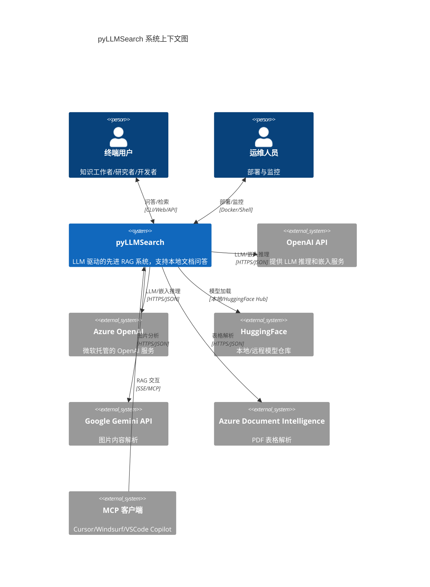
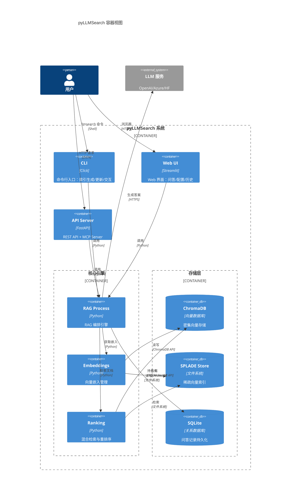
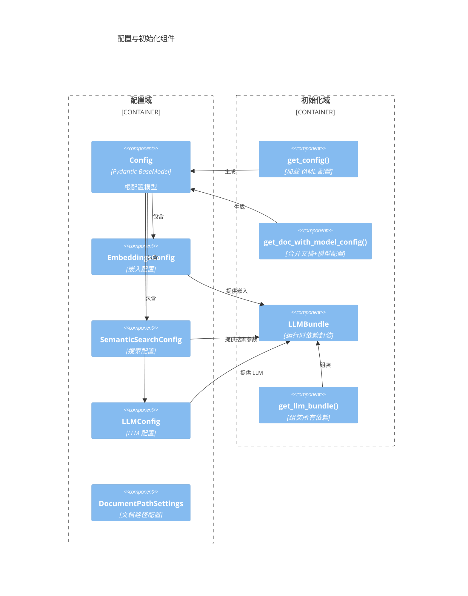
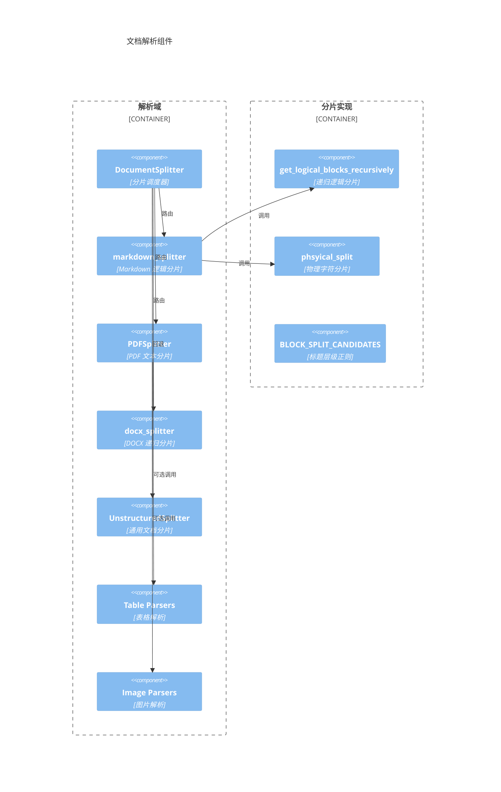
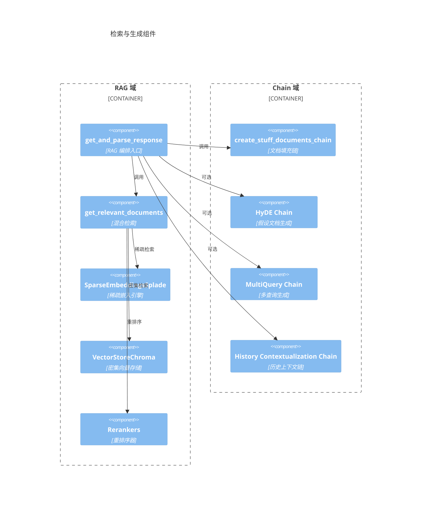
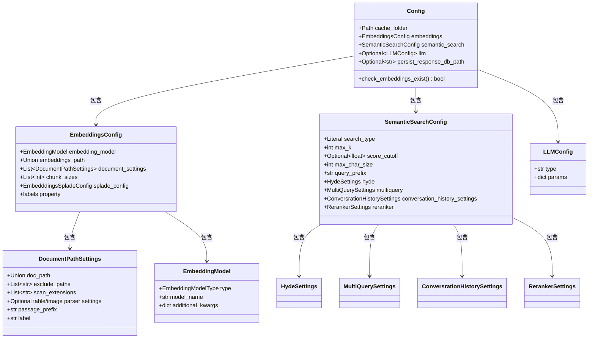
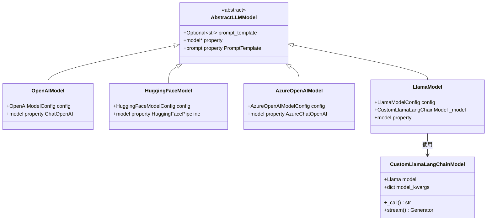
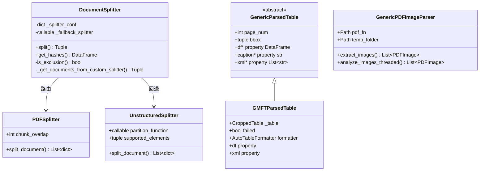
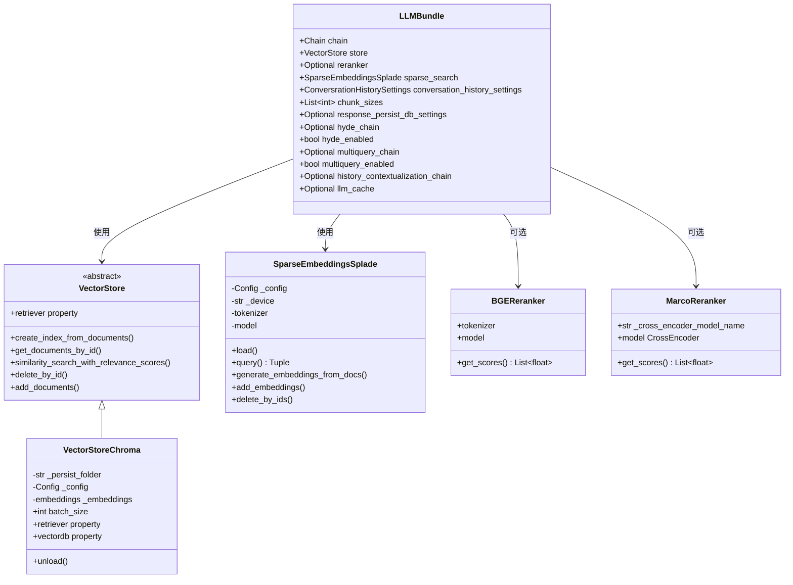

# 2. C4 架构模型（C4 Architecture Model）

> **文档编号**：02/14
> **方法论**：C4 Model（Context / Container / Component / Code）
> **预估字数**：~25,000 字
> **图表数量**：8+ 个 Mermaid 图表

---

## 2.1 C4 模型概述

### 2.1.1 什么是 C4 模型

C4 模型是由 Simon Brown 提出的软件架构可视化方法，通过四个抽象层次描述软件系统：

| 层级 | 名称 | 关注点 | 受众 |
|------|------|--------|------|
| **L1** | System Context | 系统与外部实体的关系 | 所有人 |
| **L2** | Container | 系统内部的主要容器（应用/数据库） | 开发者/运维 |
| **L3** | Component | 容器内部的组件结构 | 开发者 |
| **L4** | Code | 组件内部的类/接口级别 | 开发者 |

### 2.1.2 为什么选用 C4 模型

pyLLMSearch 是一个多入口（CLI/Web/API/MCP）、多存储（ChromaDB/SQLite）、多模型（多种 LLM/嵌入）的复杂系统。C4 模型能够：

1. **分层展示**：从宏观到微观逐步深入
2. **沟通工具**：为不同角色提供合适的抽象层次
3. **架构决策可视化**：清晰展示技术选型和边界

---

## 2.2 Context 图（系统上下文）— L1

### 2.2.1 Mermaid 图表

### 2.2.2 详细文字说明（500+ 字）

#### 系统边界

pyLLMSearch 作为核心系统，其边界定义了以下职责范围：

- **系统内**：文档解析、向量嵌入、稀疏嵌入、混合检索、重排序、LLM 生成、对话管理
- **系统外**：LLM 推理服务、模型托管、图片/表格分析服务

#### 外部实体分类

**人类参与者：**
- **终端系统用户**：通过 CLI、Web UI 或 API 与系统进行问答交互，是核心用户群体
- **运维人员**：负责系统部署、配置管理、监控告警

**外部系统：**
- **OpenAI API**：默认的 LLM 和嵌入服务提供商，通过 HTTPS 调用
- **Azure OpenAI**：企业级 OpenAI 服务，适用于有合规要求的企业
- **HuggingFace**：提供本地模型加载和远程模型下载
- **Google Gemini API**：可选的图片内容解析服务
- **Azure Document Intelligence**：可选的 PDF 表格解析服务
- **MCP 客户端**：支持 MCP 协议的 IDE 客户端，通过 SSE 协议与系统交互

#### 关键交互关系

1. **用户 ↔ pyLLMSearch**：双向交互，用户发起查询，系统返回答案和引用来源
2. **pyLLMSearch ↔ LLM 服务**：单向调用，系统发送 prompt 并接收生成结果
3. **MCP 客户端 ↔ pyLLMSearch**：通过 MCP 协议实现工具暴露，支持 `rag_retrieve_chunks`、`rag_generate_answer` 等操作

#### 设计 Rationale

- **为什么是外部系统**：LLM 推理服务是独立的服务，pyLLMSearch 通过 API 调用，不直接包含模型权重
- **为什么支持多种 LLM**：不同用户对隐私、成本、性能有不同要求，需要灵活切换
- **为什么支持 MCP**：现代 AI 工具链正在向 MCP 标准收敛，集成后可融入用户工作流

---

## 2.3 Container 图（容器视图）— L2

### 2.3.1 Mermaid 图表

### 2.3.2 详细文字说明（500+ 字）

#### 容器分类

**交互层容器（Presentation Layer）：**
- **CLI**：基于 Click 的命令行工具，提供 `llmsearch index create/update`、`llmsearch interact llm/webapp` 等命令
- **Web UI**：基于 Streamlit 的 Web 界面，支持配置加载、问答交互、历史查看
- **API Server**：基于 FastAPI 的 REST API，同时通过 FastApiMCP 暴露 MCP 接口

**核心引擎层（Core Engine Layer）：**
- **RAG Process**：编排整个问答流程（查询处理→检索→生成→持久化）
- **Embeddings**：管理向量的创建、更新、增量同步
- **Ranking**：实现混合检索（稀疏+密集）和重排序

**存储层（Storage Layer）：**
- **ChromaDB**：本地向量数据库，存储密集嵌入和元数据
- **SPLADE Store**：文件系统存储稀疏向量（NPZ 格式）
- **SQLite**：关系数据库，持久化问答记录

#### 容器间交互协议

| 源容器 | 目标容器 | 协议 | 数据 |
|--------|----------|------|------|
| CLI/Web/API | RAG Process | Python 函数调用 | query, config |
| RAG Process | Embeddings | Python 函数调用 | documents |
| RAG Process | Ranking | Python 函数调用 | queries |
| Embeddings | ChromaDB | ChromaDB Python API | vectors, metadata |
| Ranking | ChromaDB | ChromaDB Python API | query vector |
| Ranking | SPLADE Store | 文件系统读取 | sparse vectors |
| RAG Process | SQLite | SQLAlchemy ORM | ResponseModel |

#### 设计 Rationale

- **为什么三种交互方式共享核心引擎**：避免代码复用，确保行为一致
- **为什么 ChromaDB 是主要存储**：本地部署、Python 原生、支持元数据过滤
- **为什么 SPLADE 单独存储**：稀疏向量是矩阵运算，文件格式更适合
- **为什么 SQLite 持久化问答**：轻量级、无需额外服务、适合分析场景

---

## 2.4 Component 图（组件视图）— L3

### 2.4.1 配置与初始化组件

### 2.4.2 文档解析组件

### 2.4.3 检索与生成组件

### 2.4.4 详细文字说明（500+ 字）

#### 组件职责分析

**配置域**：
- `Config` 是整个系统的配置根节点，使用 Pydantic 进行强类型验证
- `EmbeddingsConfig` 管理嵌入模型类型、文档路径、分片大小、SPLADE 配置
- `SemanticSearchConfig` 管理搜索参数（max_k、score_cutoff、HyDE、MultiQuery 等）
- `LLMConfig` 是泛型 LLM 配置，通过 `field_validator` 动态验证参数

**初始化域**：
- `get_config()` 从 YAML 文件加载配置
- `get_doc_with_model_config()` 合并文档配置和模型配置（分离关注点）
- `LLMBundle` 是运行时依赖的封装体，包含 chain、store、reranker、splade 等
- `get_llm_bundle()` 是依赖组装工厂，创建并连接所有组件

**解析域**：
- `DocumentSplitter` 是分片调度器，按扩展名路由到专用解析器
- `markdown_splitter` 实现递归逻辑分片，保留 Markdown 结构
- `PDFSplitter` 基于 MuPDF，支持表格/图片区域过滤
- `docx_splitter` 支持嵌套表格和标题层级
- `UnstructuredSplitter` 是回退解析器，处理非常规格式

**检索域**：
- `get_relevant_documents` 实现混合检索（稀疏+密集取并集）
- `SparseEmbeddingsSplade` 基于 SPLADE 模型的稀疏向量引擎
- `VectorStoreChroma` 封装 ChromaDB 操作
- `Rerankers` 提供三种重排序模型（MARCO、BGE、Zerank-2）

#### 设计 Rationale

- **为什么用 LLMBundle 封装依赖**：避免函数签名膨胀，方便在 API/Web/CLI 间传递
- **为什么分离文档和模型配置**：同一文档集可搭配不同 LLM 使用
- **为什么解析器可插拔**：不同文档格式有不同最佳解析策略

---

## 2.5 Code 图（代码/类视图）— L4

### 2.5.1 配置模型类图

### 2.5.2 模型适配类图

### 2.5.3 解析器类图

### 2.5.4 LLMBundle 运行时类图

### 2.5.5 详细文字说明（500+ 字）

#### 配置模型设计

配置体系采用 **Pydantic BaseModel** 实现，具有以下特点：

1. **强类型验证**：所有字段都有明确的类型和约束
2. **自定义验证器**：`field_validator` 用于验证路径存在性、扩展名支持等
3. **嵌套结构**：Config → EmbeddingsConfig → DocumentPathSettings 三层嵌套
4. **枚举约束**：`EmbeddingModelType`、`RerankerModel` 等使用枚举限制取值

#### 模型适配设计

`AbstractLLMModel` 定义了统一的模型接口：
- `model` 属性：返回 LangChain 兼容的 LLM 实例
- `prompt` 属性：返回 PromptTemplate（如果配置了 prompt_template）

各具体模型实现：
- **OpenAIModel**：直接返回 `ChatOpenAI` 实例
- **HuggingFaceModel**：构建 `transformers.pipeline` 并包装为 `HuggingFacePipeline`
- **AzureOpenAIModel**：设置环境变量后返回 `AzureChatOpenAI`
- **LlamaModel**：使用 `llama-cpp-python` 并自定义 LangChain LLM 包装

#### LLMBundle 设计

`LLMBundle` 是运行时依赖的 **数据类（dataclass）**，封装了 RAG 流程所需的所有组件：
- `chain`：文档填充链（LLM 生成）
- `store`：向量存储（密集检索）
- `sparse_search`：稀疏检索引擎
- `reranker`：重排序器（可选）
- `hyde_chain` / `multiquery_chain`：查询增强链
- `history_contextualization_chain`：历史上下文链

#### 设计 Rationale

- **为什么用 dataclass**：LLMBundle 主要是数据容器，dataclass 自动生成 `__init__` 等方法
- **为什么 VectorStore 是抽象基类**：未来可支持其他向量数据库（如 FAISS、Milvus）
- **为什么 SparseEmbeddingsSplade 独立于 VectorStore**：稀疏检索和密集检索的实现差异太大

---

## 2.6 架构边界与设计 Rationale

### 2.6.1 关键架构边界

| 边界 | 两侧 | 交互方式 |
|------|------|----------|
| **交互层 ↔ 核心引擎** | CLI/Web/API ↔ Process | Python 函数调用 |
| **核心引擎 ↔ 存储层** | Process ↔ ChromaDB/SQLite | Python SDK / ORM |
| **核心引擎 ↔ 外部服务** | Process ↔ OpenAI/Gemini | HTTPS API |
| **配置 ↔ 运行时** | Config ↔ LLMBundle | 构造函数注入 |

### 2.6.2 关键设计决策

| 决策 | 选项 | 选择 | 理由 |
|------|------|------|------|
| 向量数据库 | ChromaDB / FAISS / Milvus | ChromaDB | Python 原生、本地部署、元数据过滤 |
| 稀疏检索 | SPLADE / BM25 | SPLADE | 语义级稀疏、与密集检索互补 |
| 配置格式 | YAML / JSON / TOML | YAML | 可读性强、支持注释 |
| Web 框架 | Flask / Django / FastAPI | FastAPI | 异步支持、自动文档、MCP 集成 |
| LLM 框架 | 原生 API / LangChain | LangChain | 标准化接口、Chain 抽象 |
| 模型适配 | 统一接口 / 各自实现 | 抽象基类 | 开闭原则、易于扩展 |

### 2.6.3 架构质量属性

| 属性 | 评级 | 说明 |
|------|------|------|
| **可扩展性** | ⭐⭐⭐⭐ | 插件式解析器、可切换模型 |
| **可维护性** | ⭐⭐⭐⭐ | 模块化、类型注解、日志 |
| **性能** | ⭐⭐⭐ | 本地检索快，但 LLM 推理依赖外部 |
| **安全性** | ⭐⭐⭐ | 本地部署安全，但 API 缺少认证 |
| **可测试性** | ⭐⭐⭐ | 模块化好，但测试覆盖不足 |

---

## 2.7 本章小结

通过 C4 模型的四层分析，我们全面理解了 pyLLMSearch 的架构设计：

1. **Context 层**：明确了系统与外部 LLM 服务、MCP 客户端的关系
2. **Container 层**：展示了 CLI/Web/API 三种交互方式和核心引擎的组成
3. **Component 层**：深入配置、解析、检索、生成四大组件域
4. **Code 层**：详细分析了配置模型、模型适配、LLMBundle 等核心类

下一章将通过流程图和时序图，动态展示系统的核心业务流程。

---

☕️ 制作不易，请我喝咖啡☕️关注我➕