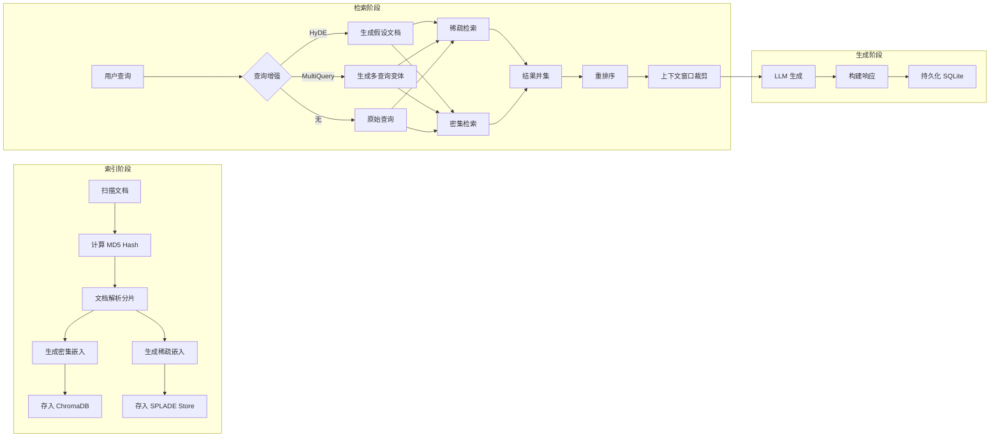
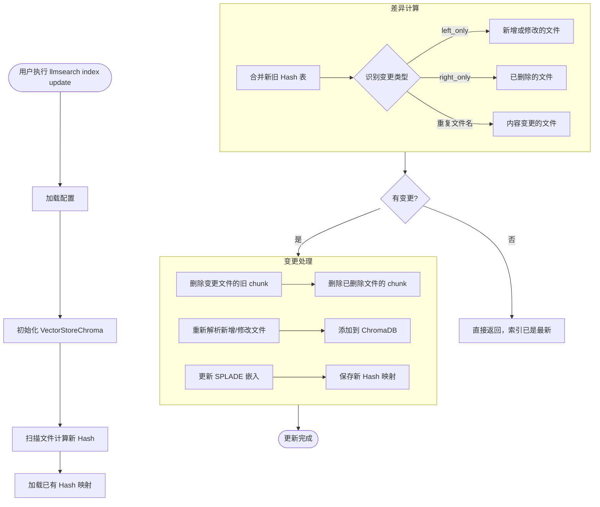
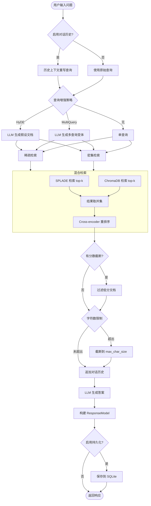
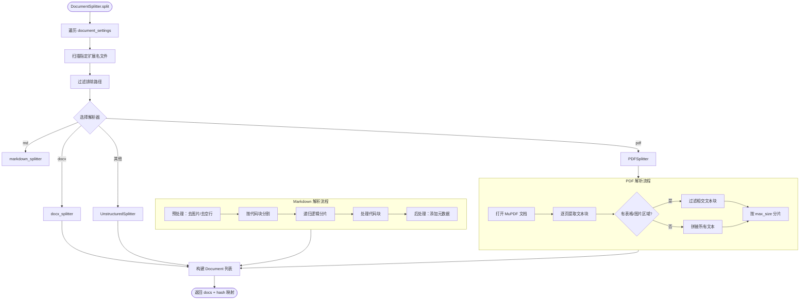
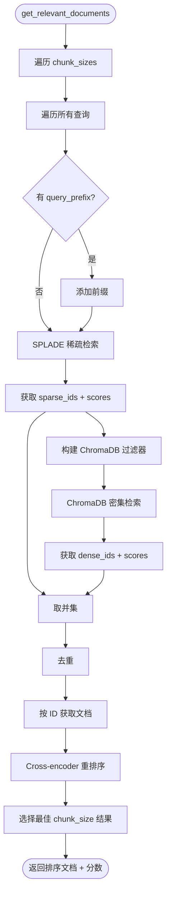
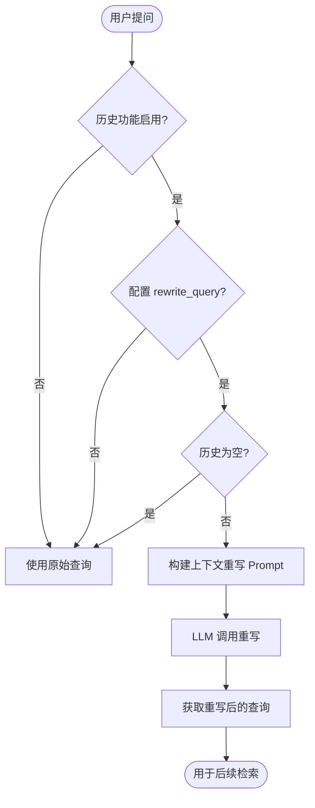
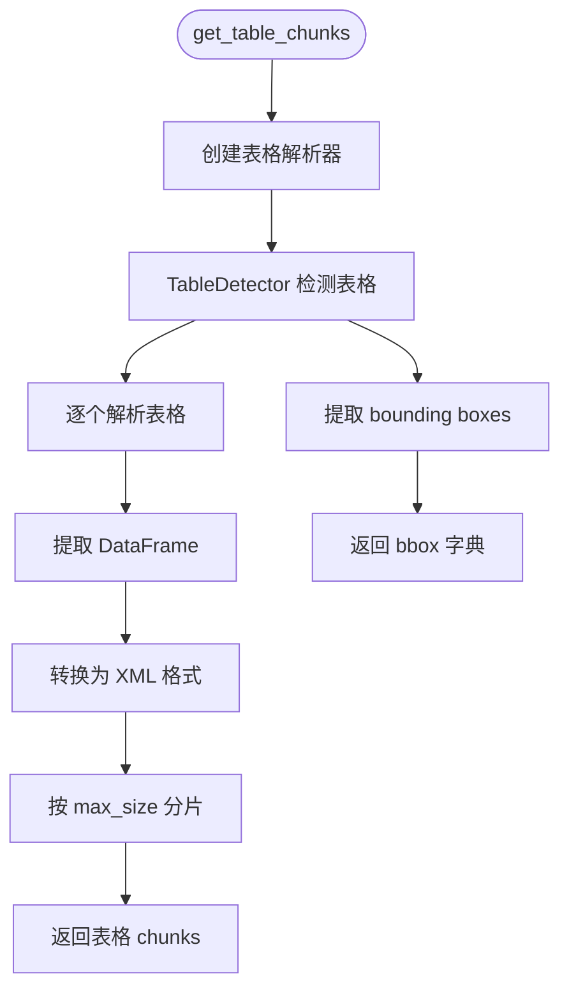
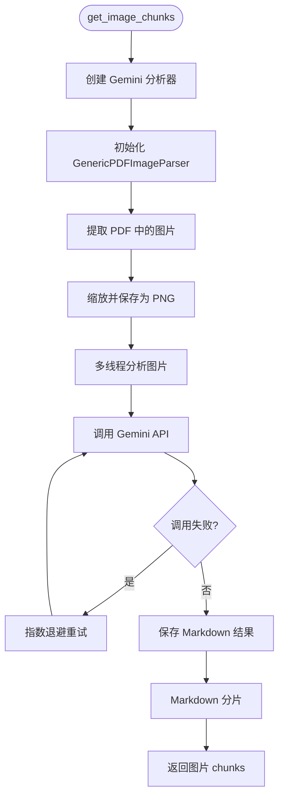
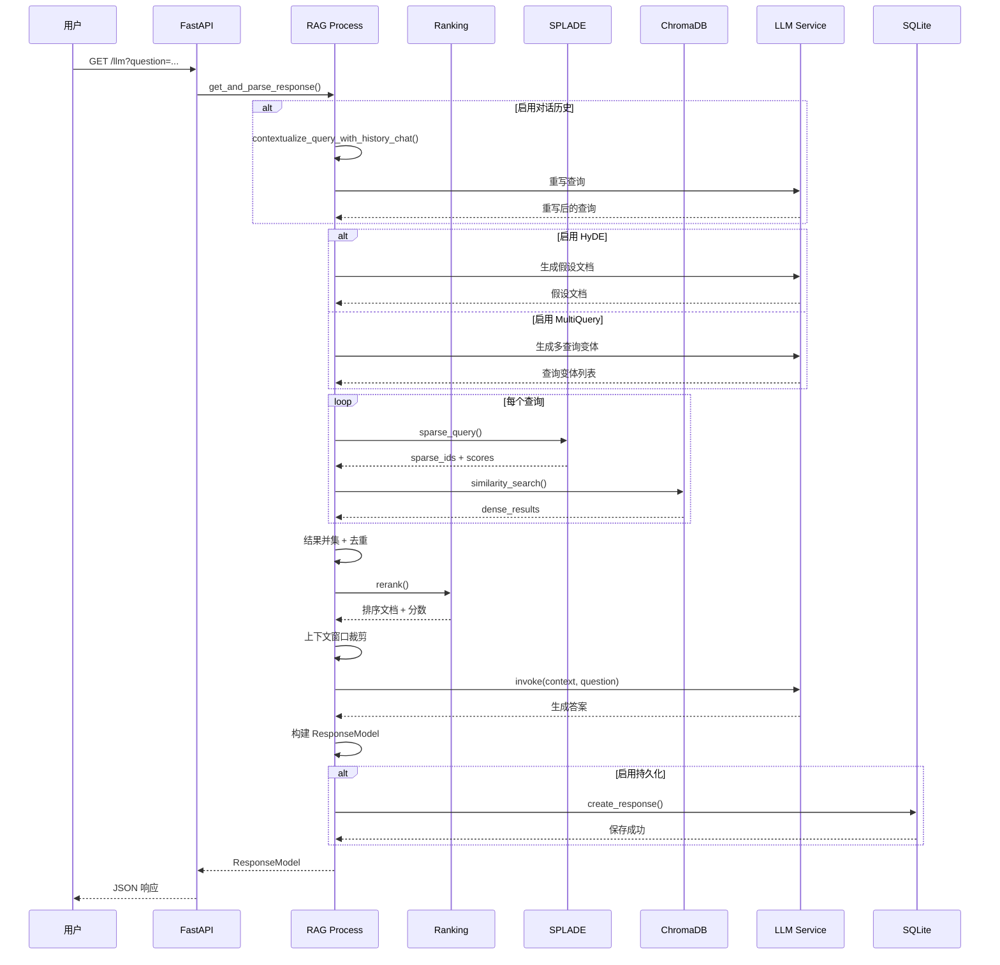

# 3. 系统流程与时序图（System Flows & Sequence Diagrams）

> **文档编号**：03/14
> **预估字数**：~28,000 字
> **图表数量**：10+ 个 Mermaid 图表

---

## 3.1 流程总览

pyLLMSearch 的核心业务流程可以概括为以下全景视图：



---

## 3.2 索引创建流程

### 3.2.1 Mermaid 流程图

```mermaid
flowchart TD
    Start([用户执行 llmsearch index create]) --> LoadConfig[加载 YAML 配置]
    LoadConfig --> SetCache[设置缓存目录]
    SetCache --> InitVS[初始化 VectorStoreChroma]
    InitVS --> CreateSplit[创建 DocumentSplitter]
    CreateSplit --> SplitDocs[执行 splitter.split()]
    
    subgraph SplitDocs[文档分片详细流程]
        SD1[遍历 document_settings] --> SD2[扫描指定扩展名文件]
        SD2 --> SD3{是否有专用解析器?}
        SD3 -->|是| SD4[调用专用解析器]
        SD3 -->|否| SD5[调用 Unstructured 回退]
        SD4 --> SD6[生成 Document 列表]
        SD5 --> SD6
        SD6 --> SD7[计算文件 Hash 映射]
    end
    
    SplitDocs --> CreateDense[创建密集嵌入]
    CreateDense --> BatchEmbed[批量嵌入 - 每批 200 条]
    BatchEmbed --> PersistChroma[持久化到 ChromaDB]
    PersistChroma --> CreateSplade[创建 SPLADE 嵌入]
    CreateSplade --> PersistSplade[持久化 NPZ 文件]
    PersistSplade --> SaveHash[保存 Hash 映射文件]
    SaveHash --> SaveLabels[保存文档标签]
    SaveLabels --> Done([索引创建完成])
```

### 3.2.2 详细文字说明（400+ 字）

#### 流程步骤

1. **加载配置**：`get_config()` 读取 YAML 文件并验证为 `Config` 对象
2. **设置缓存**：`set_cache_folder()` 配置 HuggingFace/Transformers 缓存路径
3. **初始化向量存储**：创建 `VectorStoreChroma` 实例，准备 ChromaDB
4. **文档分片**：`DocumentSplitter.split()` 是核心步骤：
   - 遍历所有 `document_settings`（支持多文档集）
   - 按扩展名扫描文件（支持排除路径）
   - 路由到专用解析器（md/pdf/docx）或 Unstructured 回退
   - 生成 `Document` 对象列表（含 metadata）
   - 计算文件 Hash 和文档 ID 映射
5. **密集嵌入**：`create_embeddings()` 调用：
   - `DocumentSplitter.split()` 获取所有文档
   - `VectorStoreChroma.create_index_from_documents()` 批量嵌入
   - 每批 200 条（ChromaDB 限制）
6. **稀疏嵌入**：`SparseEmbeddingsSplade.generate_embeddings_from_docs()` 生成 SPLADE 向量
7. **持久化**：保存 Hash 映射（Parquet）和标签（labels.txt）

#### 涉及文件与函数

| 步骤 | 文件 | 函数 |
|------|------|------|
| 加载配置 | `config.py` | `get_config()` |
| 文档分片 | `parsers/splitter.py` | `DocumentSplitter.split()` |
| 密集嵌入 | `chroma.py` | `VectorStoreChroma.create_index_from_documents()` |
| 稀疏嵌入 | `splade.py` | `SparseEmbeddingsSplade.generate_embeddings_from_docs()` |
| Hash 计算 | `parsers/splitter.py` | `get_md5_hash()` |

#### 异常处理

- **配置验证失败**：Pydantic 抛出 `ValidationError`，显示具体字段错误
- **文档路径不存在**：`field_validator` 在配置加载时检查
- **ChromaDB 写入失败**：异常向上传播，需手动清理残留数据

---

## 3.3 增量更新流程

### 3.3.1 Mermaid 流程图



### 3.3.2 详细文字说明（400+ 字）

#### 流程步骤

1. **扫描新 Hash**：`DocumentSplitter.get_hashes()` 遍历所有文件计算 MD5
2. **加载旧 Hash**：从 Parquet 文件读取已有的文件-Hash 映射
3. **差异计算**：`get_changed_or_new_files()` 通过 outer join 识别：
   - `left_only`：新增或修改的文件（需重新扫描）
   - `right_only`：已删除的文件（需从索引移除）
   - 重复文件名：内容变更的文件（需删除旧 chunk 后重新扫描）
4. **处理变更**：
   - 删除变更/删除文件的旧 chunk（ChromaDB + SPLADE）
   - 重新解析新增/修改文件
   - 添加到 ChromaDB 和 SPLADE
5. **保存映射**：更新 Hash 映射文件

#### 核心算法

`get_changed_or_new_files()` 使用 Pandas merge 实现高效差异检测：

```python
merged_df = new_hashes_df.merge(
    existing_hashes_df, on=["filehash", "filename"], how="outer", indicator=True
)
changed_or_new = merged_df.loc[lambda df: df["_merge"] == "left_only"]
deleted = merged_df.loc[merged_df["_merge"] == "right_only"]
```

#### 异常处理

- **Hash 文件不存在**：抛出 `EmbeddingsHashNotExistError`，提示用户重新创建索引
- **ChromaDB 删除失败**：异常向上传播

---

## 3.4 RAG 问答流程（核心）

### 3.4.1 Mermaid 流程图



### 3.4.2 详细文字说明（500+ 字）

#### 流程步骤

1. **查询预处理**：
   - 如果启用对话历史且配置了 `rewrite_query`，调用 `contextualize_query_with_history_chat()` 重写查询
   - 使用 `history_contextualization_chain` 将指代词替换为具体实体

2. **查询增强**（三选一）：
   - **HyDE**：调用 `get_hyde_response()` 让 LLM 生成假设答案，用假设答案去检索
   - **MultiQuery**：调用 `get_multiquery_response()` 生成 3-5 个查询变体
   - **无增强**：直接使用原始查询

3. **混合检索**：
   - **稀疏检索**：`SparseEmbeddingsSplade.query()` 使用 SPLADE 向量检索
   - **密集检索**：`VectorStoreChroma.similarity_search_with_relevance_scores()` 使用 ChromaDB
   - **结果融合**：取并集（union），去重

4. **重排序**：
   - 使用 Cross-encoder 计算 query-document 相关性分数
   - 按分数降序排序
   - 取 Top-5 平均分作为整体质量分数

5. **上下文窗口裁剪**：
   - 按 `max_char_size` 限制总字符数
   - 可选 `score_cutoff` 过滤低分文档
   - 如果启用对话历史，追加历史记录

6. **LLM 生成**：
   - 使用 `create_stuff_documents_chain` 构建的 chain
   - 输入：context（文档列表）+ question（原始问题）
   - 输出：生成的答案文本

7. **响应构建**：
   - 构建 `ResponseModel`（含 id、question、response、sources）
   - 处理文档链接（路径替换、Obsidian URI、后缀追加）

8. **持久化**：
   - 如果配置了 `persist_response_db_path`，保存到 SQLite
   - 保存交互记录、来源文档、配置快照

#### 涉及文件与函数

| 步骤 | 文件 | 函数 |
|------|------|------|
| 查询重写 | `process.py` | `contextualize_query_with_history_chat()` |
| HyDE | `process.py` | `get_hyde_response()` |
| MultiQuery | `process.py` | `get_multiquery_response()` |
| 混合检索 | `ranking.py` | `get_relevant_documents()` |
| 重排序 | `ranking.py` | `rerank()` |
| LLM 生成 | `utils.py` | `create_stuff_documents_chain()` |
| 响应构建 | `process.py` | `get_and_parse_response()` |

---

## 3.5 文档解析流程

### 3.5.1 Mermaid 流程图



### 3.5.2 详细文字说明（400+ 字）

#### Markdown 解析详解

`markdown_splitter` 是系统中最复杂的解析器，采用 **递归逻辑分片** 策略：

1. **预处理**：
   - `remove_images()`：正则移除 `` 图片链接
   - `remove_extra_newlines()`：将 3+ 连续换行替换为 2 个
   - `find_metadata()`：提取 YAML front matter 等元数据

2. **代码块分割**：
   - 按 ` ``` ` 分割为代码块和非代码块交替序列
   - 偶数索引为非代码，奇数索引为代码

3. **递归逻辑分片**：
   - 按标题层级正则 `\n#\s+` → `\n##\s+` → `\n###\s+` 递归分割
   - 如果分片仍大于 `max_size`，进入下一级标题
   - 最终回退到 `phsyical_split()` 物理字符分片

4. **代码块处理**：
   - 小代码块合并到前一个逻辑块
   - 大代码块独立物理分片

5. **后处理**：
   - 添加元数据头部（`Metadata applicable to...`）
   - 提取标题作为 metadata

#### PDF 解析详解

`PDFSplitter` 基于 MuPDF：

1. 逐页提取文本块（`page.get_text_blocks()`）
2. 如果有表格/图片 bounding box，过滤相交文本块（避免重复嵌入）
3. 按 `max_size` 累积文本，超出时分片
4. 保留页码信息在 metadata 中

---

## 3.6 混合检索流程

### 3.6.1 Mermaid 流程图



### 3.6.2 详细文字说明（400+ 字）

#### 混合检索策略

pyLLMSearch 采用 **Sparse + Dense 混合检索**：

1. **稀疏检索（SPLADE）**：
   - 使用 `SparseEmbeddingsSplade.query()` 方法
   - 基于 SPLADE 模型的稀疏向量表示
   - 通过余弦相似度检索 top-k 文档
   - 支持按 label 和 chunk_size 过滤

2. **密集检索（ChromaDB）**：
   - 使用 `similarity_search_with_relevance_scores()` 方法
   - 基于嵌入模型的密集向量表示
   - 支持元数据过滤（chunk_size、label、source_chunk_type）

3. **结果融合**：
   - 取稀疏和密集结果的 **并集（union）**
   - 去重（已在结果中的文档不再添加）
   - 按 ID 获取完整文档内容

4. **重排序**：
   - 使用 Cross-encoder 计算精确相关性分数
   - 支持三种模型：MS-MARCO MiniLM、BGE-reranker-v2-m3、Zerank-2
   - 按分数降序排序
   - 取 Top-5 平均分作为 chunk_size 选择依据

5. **多 chunk_size 支持**：
   - 系统支持配置多个 chunk_size（如 [512, 1024]）
   - 每个 chunk_size 独立检索，选择分数最高的结果

---

## 3.7 对话历史上下文化流程

### 3.7.1 Mermaid 流程图



### 3.7.2 详细文字说明（300+ 字）

#### 对话历史机制

pyLLMSearch 支持可选的对话历史功能：

1. **历史存储**：
   - `ConversrationHistorySettings` 维护 QA 对列表
   - `max_history_length` 限制历史长度（默认 2 对）
   - 超出时移除最早的 QA 对（FIFO）

2. **查询重写**：
   - 当用户问题包含指代词（"它"、"这个"、"上面"）时，需要上下文理解
   - `contextualize_query_with_history_chain` 将指代词替换为具体实体
   - 例如："它有什么特点？" → "Python 有什么特点？"

3. **历史注入**：
   - 重写后的查询用于检索
   - 原始查询用于 LLM 生成
   - 对话历史作为额外文档追加到 context 中

---

## 3.8 表格解析流程（GMFT）

### 3.8.1 Mermaid 流程图



### 3.8.2 详细文字说明（300+ 字）

#### GMFT 表格解析

1. **表格检测**：
   - 使用 `TableDetector` 检测 PDF 页面中的表格区域
   - 返回 `CroppedTable` 列表（含 bbox）

2. **表格解析**：
   - `AutoTableFormatter` 提取表格结构
   - 转换为 Pandas DataFrame
   - 支持多种表格样式（有框、无框、部分框）

3. **XML 转换**：
   - DataFrame 转换为简化 XML 格式
   - 每行一个 `<row>` 元素，每列一个 `<col>` 元素

4. **分片**：
   - 大表格按 `max_size` 分片
   - 每片包含 caption 和 XML 数据

5. **Bounding Box 过滤**：
   - 表格区域的文本块在 PDF 解析时被过滤
   - 避免同一内容被嵌入两次

---

## 3.9 图片解析流程（Gemini）

### 3.9.1 Mermaid 流程图



### 3.9.2 详细文字说明（300+ 字）

#### Gemini 图片解析

1. **图片提取**：
   - 使用 MuPDF 提取 PDF 中的嵌入图片
   - 过滤太小的图片（< 64x200）
   - 缩放到最大宽度 1280px

2. **多线程分析**：
   - 使用 `ThreadPool` 并行处理多张图片
   - 默认最大 10 个线程

3. **API 调用**：
   - 使用 `tenacity` 实现指数退避重试
   - 最多重试 6 次，等待 5-60 秒
   - 调用失败返回原始图片对象

4. **结果处理**：
   - Gemini 返回 Markdown 格式的描述文本
   - 保存为 .md 文件
   - 使用 `markdown_splitter` 分片

---

## 3.10 RAG 问答时序图

### 3.10.1 Mermaid 时序图



### 3.10.2 详细文字说明（400+ 字）

#### 时序图解析

1. **请求入口**：
   - 用户通过 `GET /llm?question=...` 发起问答请求
   - FastAPI 路由到 `llmsearch()` 端点
   - 通过 `Depends(get_llm_bundle_cached)` 注入 LLM 依赖

2. **查询处理阶段**：
   - 如果启用对话历史，先调用 LLM 重写查询
   - 根据配置选择 HyDE、MultiQuery 或无增强
   - 每次增强都需要一次 LLM 调用

3. **检索阶段**：
   - 对每个查询变体执行稀疏和密集检索
   - 结果取并集去重
   - Cross-encoder 重排序

4. **生成阶段**：
   - 裁剪文档到 `max_char_size`
   - 调用 LLM 生成最终答案
   - 构建 `ResponseModel`

5. **持久化阶段**：
   - 如果配置了 SQLite 路径，保存问答记录
   - 保存来源文档和配置快照

#### 性能关键点

| 阶段 | 耗时因素 | 优化方向 |
|------|----------|----------|
| 查询增强 | LLM 调用延迟 | 缓存、异步 |
| 稀疏检索 | 矩阵乘法 | GPU 加速 |
| 密集检索 | ChromaDB 查询 | 索引优化 |
| 重排序 | Cross-encoder 推理 | 批量推理 |
| LLM 生成 | 模型推理 | 流式输出 |

---

## 3.11 本章小结

本章通过 10+ 个 Mermaid 图表，详细展示了 pyLLMSearch 的核心业务流程：

1. **索引创建**：从文档扫描到向量持久化的完整链路
2. **增量更新**：基于 Hash 的高效差异检测与更新
3. **RAG 问答**：从查询增强到 LLM 生成的端到端流程
4. **文档解析**：Markdown/PDF/DOCX 三种解析器的详细流程
5. **混合检索**：稀疏+密集检索的融合策略
6. **对话历史**：上下文重写与历史注入
7. **表格/图片解析**：多模态文档处理
8. **时序图**：API 问答的完整时序交互

下一章将深入分析模块结构和依赖关系。

---

☕️ 制作不易，请我喝咖啡☕️关注我➕