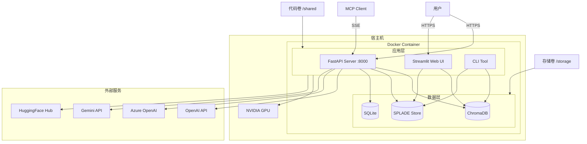

# 8. 部署、运维与基础设施

> **文档编号**：08/14
> **预估字数**：~8,000 字
> **图表数量**：1+ 个 Mermaid 图表

---

## 8.1 部署架构图

### 8.1.1 Mermaid 部署图



### 8.1.2 部署组件说明

| 组件 | 端口 | 用途 |
|------|------|------|
| FastAPI Server | 8000 | REST API + MCP Server |
| Streamlit Web UI | 8501 | Web 界面（需单独启动） |
| ChromaDB | 进程内 | 向量存储（无独立端口） |
| SQLite | 文件 | 问答记录持久化 |

---

## 8.2 Docker 配置

### 8.2.1 run_docker.sh

```bash
#!/bin/bash
RW_STORAGE=$1

docker run --rm -it --runtime=nvidia \
    --gpus all -p 8888:8888 \
    --entrypoint /shared/docker/entrypoint.sh \
    -v $RW_STORAGE:/storage:rw \
    -v `pwd`:/shared:rw \
    -e HOST_UID="$(id -u)" \
    -e HOST_GID="$(id -g)" \
    deepml \
    /bin/bash
```

### 8.2.2 Docker 配置说明

| 配置项 | 值 | 说明 |
|--------|-----|------|
| `--runtime=nvidia` | — | 使用 NVIDIA Container Toolkit |
| `--gpus all` | — | 暴露所有 GPU |
| `-p 8888:8888` | 8888 | Jupyter Lab 端口（注释中） |
| `-v $RW_STORAGE:/storage:rw` | — | 存储卷挂载（读写） |
| `-v $(pwd):/shared:rw` | — | 代码卷挂载（读写） |
| `-e HOST_UID`/`HOST_GID` | — | 用户权限映射 |
| `deepml` | — | 基础镜像名称 |

### 8.2.3 存储卷结构

```
/storage/
├── llm/
│   ├── cache/              # 模型缓存
│   ├── embeddings_obsidian/  # 嵌入数据
│   └── embeddings_books/     # 嵌入数据
└── docs/                   # 文档文件
```

---

## 8.3 环境变量配置

### 8.3.1 .env 模板

```bash
# OpenAI API Key（必需，如果使用的模型是openai）
OPENAI_API_KEY=<<<YOUR_API_KEY>>>

# Google Gemini API Key（仅当使用图片解析时）
GOOGLE_API_KEY=<<<YOUR_API_KEY>>>

# Azure Document Intelligence（仅当使用 Azure 表格解析时）
AZURE_DOCUMENT_INTELLIGENCE_ENDPOINT=<< ENDPOINT >>
AZURE_DOCUMENT_INTELLIGENCE_KEY=<< KEY >>
```

### 8.3.2 模型缓存环境变量

```bash
SENTENCE_TRANSFORMERS_HOME=/path/to/cache
TRANSFORMERS_CACHE=/path/to/cache/transformers
HF_HOME=/path/to/cache/hf_home
MODELS_CACHE_FOLDER=/path/to/cache
```

---

## 8.4 本地安装流程

### 8.4.1 install_linux.sh

```bash
#!/bin/bash
# Linux 安装脚本
# 内容省略，通常包含：
# - 安装 Python 3.10+
# - 安装 pip/uv
# - 安装依赖
# - 设置环境变量
```

### 8.4.2 手动安装步骤

```bash
# 1. 克隆仓库
git clone https://github.com/snexus/llm-search.git
cd llm-search

# 2. 创建虚拟环境
python -m venv venv
source venv/bin/activate

# 3. 安装依赖
pip install -e ".[dev]"

# 或使用 uv
uv pip install -e ".[dev]"

# 4. 配置环境变量
cp .env_template .env
# 编辑 .env 填入 API Key

# 5. 配置 YAML
cp sample_templates/generic/config_template.yaml my_config.yaml
# 编辑 my_config.yaml

# 6. 生成索引
llmsearch index create -c my_config.yaml

# 7. 启动 API
export FASTAPI_RAG_CONFIG=my_doc_config.yaml
export FASTAPI_LLM_CONFIG=my_llm_config.yaml
llmsearchapi
```

---

## 8.5 运行模式

### 8.5.1 CLI 模式

```bash
# 生成索引
llmsearch index create -c config.yaml

# 更新索引
llmsearch index update -c config.yaml

# 交互式 Q&A（终端）
llmsearch interact llm -c doc_config.yaml -m llm_config.yaml

# 启动 Web UI
llmsearch interact webapp -c config_dir/ -m llm_config.yaml
```

### 8.5.2 API 模式

```bash
export FASTAPI_RAG_CONFIG=/path/to/doc_config.yaml
export FASTAPI_LLM_CONFIG=/path/to/llm_config.yaml
llmsearchapi
# 或
uvicorn llmsearch.api:api_app --host 0.0.0.0 --port 8000
```

### 8.5.3 Web UI 模式

```bash
streamlit run src/llmsearch/webapp.py -- --doc_config_path ./configs/ --model_config_path ./llm_openai.yaml
```

---

## 8.6 监控与日志

### 8.6.1 Loguru 日志

```python
from loguru import logger

# 日志级别
logger.debug("调试信息")
logger.info("一般信息")
logger.warning("警告")
logger.error("错误")
logger.critical("严重错误")
```

### 8.6.2 日志配置

默认使用 Loguru 的标准输出，可通过以下方式配置：

```python
import sys
logger.remove()  # 移除默认处理器
logger.add(sys.stderr, level="INFO")  # 添加 INFO 级别输出
logger.add("logs/app.log", rotation="100 MB")  # 文件日志，自动轮转
```

### 8.6.3 LangChain 调试

```python
import langchain
langchain.debug = True  # 启用详细调试输出
```

---

## 8.7 备份方案

### 8.7.1 嵌入数据备份

嵌入数据存储在 `embeddings_path` 目录下：

```
embeddings_path/
├── chroma.sqlite3          # ChromaDB 持久化文件
├── splade/
│   ├── splade_embeddings.npz
│   ├── splade_ids.pickle
│   └── splade_metadatas.pickle
├── file_hash_mappings.snappy.parquet
├── docid_hash_mappings.snappy.parquet
└── labels.txt
```

**备份策略**：
```bash
# 全量备份
tar -czf embeddings_backup.tar.gz /path/to/embeddings_path/

# 增量备份（仅 Hash 映射）
cp /path/to/embeddings_path/*.parquet /backup/
```

### 8.7.2 SQLite 数据库备份

```bash
# SQLite 备份
sqlite3 responses_test.db ".backup responses_test.db.backup"
```

---

## 8.8 性能调优

### 8.8.1 GPU 内存管理

```python
# 显式卸载模型
unload_model(llm_bundle)

# 清理 GPU 缓存
with torch.no_grad():
    torch.cuda.empty_cache()
```

### 8.8.2 嵌入批处理

```python
# chroma.py 中的批处理大小
self.batch_size = 200  # ChromaDB 限制

# splade.py 中的批处理大小
self.n_batch = config.embeddings.splade_config.n_batch  # 默认 5
```

### 8.8.3 图片解析并发

```python
# images/generic.py 中的线程池
with ThreadPool(max_threads) as pool:  # 默认 10 线程
    results = pool.starmap(analyze_single_image, [...])
```

---

## 8.9 故障排查

### 8.9.1 常见问题

| 问题 | 原因 | 解决方案 |
|------|------|----------|
| `ChromaDB 写入失败` | 单次写入数据量过大 | 减小 `batch_size` |
| `CUDA Out of Memory` | GPU 内存不足 | 卸载不用的模型、减小 `n_batch` |
| `Hash 文件不存在` | 首次运行或版本不兼容 | 重新运行 `index create` |
| `嵌入模型加载失败` | 模型缓存路径错误 | 检查 `cache_folder` 配置 |
| `API 调用超时` | 网络或模型服务问题 | 检查 API Key 和网络连接 |

### 8.9.2 日志分析

```bash
# 查看错误日志
grep "ERROR" logs/app.log

# 查看索引生成进度
grep "Generating" logs/app.log

# 查看检索性能
grep "Stage 1\|Stage 2\|Re-ranker" logs/app.log
```

---

## 8.10 本章小结

本章详细分析了 pyLLMSearch 的部署运维：

1. **部署架构**：Docker + NVIDIA GPU + 存储卷
2. **Docker 配置**：run_docker.sh 脚本详解
3. **环境变量**：.env 模板与缓存配置
4. **安装流程**：从克隆到运行的完整步骤
5. **运行模式**：CLI / API / Web UI 三种模式
6. **监控日志**：Loguru 配置与调试
7. **备份方案**：嵌入数据与 SQLite 备份
8. **性能调优**：GPU 内存、批处理、并发
9. **故障排查**：常见问题与日志分析

下一章将分析改进建议与未来规划。

---

☕️ 制作不易，请我喝咖啡☕️关注我➕