# 第 2 章：C4 架构模型

> **版本**: v1.10.0 | **最后更新**: 2026-07-26 | **所属文档体系**: Local Deep Research 技术文档

---

## 2.0 C4 模型概述

C4 模型是由 Simon Brown 提出的软件架构可视化框架，通过四个抽象层级（Context、Container、Component、Code）逐层展开系统架构：

| 层级 | 名称 | 关注点 | 受众 |
|------|------|--------|------|
| **L1** | Context（系统上下文） | 系统与外部实体（用户、外部系统）的关系 | 所有利益相关者 |
| **L2** | Container（容器） | 系统内部的主要可执行单元（应用、数据库、服务） | 开发者、运维 |
| **L3** | Component（组件） | 容器内部的模块划分和交互 | 开发者、架构师 |
| **L4** | Code（代码） | 类/接口级别的详细设计 | 开发者 |

本章为 Local Deep Research 项目建立完整的 C4 架构视图，每个层级均配有 Mermaid 图表和详细文字说明。

---

## 2.1 Context 图（系统上下文）

### 2.1.1 Context 图

```mermaid
C4Context
    title Local Deep Research - 系统上下文图

    Person(user, "研究人员/开发者", "使用 LDR 进行深度研究分析")
    Person(admin, "系统管理员", "部署、配置、维护 LDR 实例")

    System(ldr, "Local Deep Research", "AI 驱动的深度研究助手\n[本地优先 | 隐私保护 | 可扩展]", "Flask + LangGraph + SQLCipher + FAISS")

    SystemExt(browser, "用户浏览器", "访问 Web UI 界面\n接收实时研究进度")
    SystemExt(ollama, "Ollama / LM Studio", "本地 LLM 推理服务\n提供完全离线的 AI 能力")
    SystemExt(openai, "OpenAI API", "云端 LLM 服务\nGPT-4 / GPT-4o 等模型")
    SystemExt(anthropic, "Anthropic API", "云端 LLM 服务\nClaude 3.5 / Claude 4 等模型")
    SystemExt(google_ai, "Google AI API", "云端 LLM 服务\nGemini 系列模型")
    SystemExt(deepseek, "DeepSeek API", "云端 LLM 服务\nDeepSeek 系列模型")
    SystemExt(openrouter, "OpenRouter", "LLM 聚合网关\n统一访问多个提供商")
    SystemExt(xai, "xAI API", "云端 LLM 服务\nGrok 系列模型")
    SystemExt(searxng, "SearXNG", "元搜索引擎\n聚合多个搜索引擎结果")
    SystemExt(ddg, "DuckDuckGo", "通用网页搜索\n隐私友好搜索引擎")
    SystemExt(google_search, "Google Search", "通用网页搜索\n通过 SerpAPI 访问")
    SystemExt(brave, "Brave Search", "通用网页搜索\n独立搜索引擎")
    SystemExt(arxiv, "ArXiv", "学术论文搜索\n物理/CS/数学等")
    SystemExt(pubmed, "PubMed / NCBI", "生物医学文献\n学术论文搜索")
    SystemExt(wikipedia, "Wikipedia", "百科知识搜索\n结构化知识检索")
    SystemExt(github_search, "GitHub", "代码搜索\n开源代码检索")
    SystemExt(semanticscholar, "Semantic Scholar", "学术搜索引擎\nAI 驱动的论文发现")

    %% 用户与系统交互
    Rel(user, ldr, "发起研究任务\n查看研究报告", "HTTPS / WebSocket")
    Rel(admin, ldr, "配置系统\n监控状态", "HTTPS / CLI")

    %% 系统与外部 LLM
    Rel(ldr, ollama, "调用本地 LLM\n完全离线运行", "HTTP (localhost)")
    Rel(ldr, openai, "调用 GPT 模型\n获取推理结果", "HTTPS / API Key")
    Rel(ldr, anthropic, "调用 Claude 模型\n获取推理结果", "HTTPS / API Key")
    Rel(ldr, google_ai, "调用 Gemini 模型\n获取推理结果", "HTTPS / API Key")
    Rel(ldr, deepseek, "调用 DeepSeek 模型\n获取推理结果", "HTTPS / API Key")
    Rel(ldr, openrouter, "调用聚合 LLM\n获取推理结果", "HTTPS / API Key")
    Rel(ldr, xai, "调用 Grok 模型\n获取推理结果", "HTTPS / API Key")

    %% 系统与外部搜索
    Rel(ldr, searxng, "元搜索引擎查询\n聚合多源结果", "HTTPS / API Key")
    Rel(ldr, ddg, "通用网页搜索\n隐私友好", "HTTPS")
    Rel(ldr, google_search, "通用网页搜索\n覆盖面广", "HTTPS / SerpAPI Key")
    Rel(ldr, brave, "通用网页搜索\n独立索引", "HTTPS / API Key")
    Rel(ldr, arxiv, "学术论文搜索\n预印本论文", "HTTPS / 公开 API")
    Rel(ldr, pubmed, "生物医学文献\n医学论文检索", "HTTPS / Entrez API")
    Rel(ldr, wikipedia, "百科知识检索\n结构化知识", "HTTPS / 公开 API")
    Rel(ldr, github_search, "代码搜索\n开源代码检索", "HTTPS / API Token")
    Rel(ldr, semanticscholar, "学术搜索\nAI 驱动的论文发现", "HTTPS / 公开 API")

    UpdateRelStyle(user, ldr, $offsetX="-40", $offsetY="0")
    UpdateRelStyle(ldr, ollama, $offsetX="-20", $offsetY="20")
    UpdateRelStyle(ldr, openai, $offsetX="0", $offsetY="-20")
    UpdateRelStyle(ldr, anthropic, $offsetX="20", $offsetY="-20")
    UpdateRelStyle(ldr, ddg, $offsetX="-40", $offsetY="0")
    UpdateRelStyle(ldr, arxiv, $offsetX="40", $offsetY="0")
```

### 2.1.2 Context 图说明

Context 图展示了 Local Deep Research 系统与所有外部实体之间的关系。这是最高层级的架构视图，定义了系统的边界和外部依赖。

**系统边界**:

LDR 系统（蓝色矩形）是核心系统，包含所有内部组件。系统边界定义了"什么在系统内"和"什么在系统外"：

- **系统内**: Flask 应用、LangGraph 引擎、SQLCipher 数据库、FAISS 向量索引、搜索调度器、LLM 调用器、知识库管理器等
- **系统外**: 所有外部 LLM 提供商、所有外部搜索引擎、用户浏览器、外部数据库

**外部角色（Person）**:

1. **研究人员/开发者（User）**: 主要用户群体，通过浏览器访问 Web UI 发起研究任务、查看实时进度、阅读和导出研究报告。与系统的交互协议为 HTTPS（REST API）和 WebSocket（实时推送）。
2. **系统管理员（Admin）**: 负责部署、配置和维护 LDR 实例的技术人员，通过 HTTPS 访问管理界面或使用 CLI 工具进行系统维护。

**外部系统分类**:

系统外部依赖可分为三大类：

**1. LLM 推理服务（7 个外部系统）**

| 提供商 | 类型 | 协议 | 用途 |
|--------|------|------|------|
| **Ollama / LM Studio** | 本地 | HTTP (localhost) | 完全离线推理，零数据外泄 |
| **OpenAI** | 云端 | HTTPS + API Key | GPT-4/GPT-4o 系列，通用推理 |
| **Anthropic** | 云端 | HTTPS + API Key | Claude 3.5/4 系列，长文本分析 |
| **Google AI** | 云端 | HTTPS + API Key | Gemini 系列，多模态推理 |
| **DeepSeek** | 云端 | HTTPS + API Key | DeepSeek 系列，高性价比推理 |
| **OpenRouter** | 云端 | HTTPS + API Key | 聚合网关，统一接口访问多提供商 |
| **xAI** | 云端 | HTTPS + API Key | Grok 系列，实时信息推理 |

LLM 提供商通过统一的 `BaseLLMProvider` 接口接入，系统支持同时配置多个提供商并按需切换或混合使用。本地 LLM（Ollama/LM Studio）是系统的核心差异化能力，使 LDR 能够在完全断网环境下运行。

**2. 搜索引擎服务（9 个外部系统）**

| 引擎 | 类型 | 协议 | 特点 |
|------|------|------|------|
| **SearXNG** | 元搜索 | HTTPS + API Key | 聚合 Google/Bing/DuckDuckGo 等结果 |
| **DuckDuckGo** | 通用搜索 | HTTPS | 隐私友好，无需 API Key |
| **Google Search** | 通用搜索 | HTTPS + SerpAPI | 覆盖面最广的搜索引擎 |
| **Brave Search** | 通用搜索 | HTTPS + API Key | 独立索引，不追踪用户 |
| **ArXiv** | 学术搜索 | HTTPS + 公开 API | 物理/CS/数学等学科预印本 |
| **PubMed/NCBI** | 学术搜索 | HTTPS + Entrez | 生物医学文献数据库 |
| **Wikipedia** | 知识搜索 | HTTPS + 公开 API | 结构化百科知识 |
| **GitHub** | 代码搜索 | HTTPS + API Token | 开源代码检索 |
| **Semantic Scholar** | 学术搜索 | HTTPS + 公开 API | AI 驱动的学术论文发现 |

搜索引擎通过 `BaseSearchEngine` 接口接入，支持并行调用多个引擎并融合结果。系统支持 30+ 引擎（图中展示 9 个主要引擎，其余包括 Baidu、Bing、Startpage、Qwant、Kagi、Brave News、Hacker News、Reddit 等）。

**3. 用户浏览器**

用户浏览器是前端 UI 的运行环境。LDR 的前端采用原生 JavaScript（70 个文件/48K 行）和 CSS（29 个文件/23K 行），通过 Vite 构建打包。浏览器与服务器之间通过 HTTPS 进行 REST API 调用，通过 WebSocket 接收研究进度的实时推送。

**数据流分析**:

从 Context 图可以识别出系统的三条主要数据流：

1. **研究请求流**: 用户 → LDR → 外部搜索引擎（并行）→ 结果聚合 → LLM 分析 → 报告生成 → 用户
2. **LLM 调用流**: LDR → 外部 LLM API（按需选择）→ 推理结果 → 研究状态更新 → WebSocket 推送 → 用户
3. **知识积累流**: 研究成果 → SQLCipher 持久化 + FAISS 向量索引 → 知识库 → 后续研究检索增强

**系统边界决策**:

- **纳入系统内**: 所有业务逻辑、数据处理、存储、安全控制——这些是系统的核心价值
- **置于系统外**: LLM 推理、网络搜索、用户交互——这些是外部依赖或接口
- **边界意义**: 明确边界有助于理解系统的可移植性——只要提供 LLM 和搜索的替代实现，系统可在任何环境运行

---

## 2.2 Container 图（容器视图）

### 2.2.1 Container 图

```mermaid
C4Container
    title Local Deep Research - 容器视图

    Person(user, "用户", "研究人员/开发者")
    Person(admin, "管理员", "系统运维")

    System_Boundary(ldr_system, "Local Deep Research 系统边界") {
        Container(web_app, "Flask Web 应用", "Flask 3.1 + Jinja2", "处理 HTTP 请求\n渲染 Web UI\n管理用户会话")

        Container(socketio_svc, "Socket.IO 实时服务", "Flask-SocketIO", "研究进度实时推送\n状态变更通知\n日志流式输出")

        Container(background_scheduler, "后台任务调度器", "APScheduler", "定时研究任务\n知识库维护\n缓存清理\n索引优化")

        Container(mcp_server, "MCP Server", "Model Context Protocol", "AI Agent 集成接口\n供外部 Agent 调用")

        ContainerDb(sqlcipher_db, "SQLCipher 数据库", "SQLCipher 4.5 + SQLAlchemy 2.0", "加密存储所有研究数据\n用户数据\n配置信息\n知识元数据")

        ContainerDb(faiss_index, "FAISS 向量索引", "FAISS 1.8", "研究文档向量索引\n语义相似度检索\n知识库检索增强")

        Container(search_system, "搜索系统", "AdvancedSearchSystem", "30+搜索引擎调度\n结果聚合与去重\n过滤器链处理\n质量评分")

        Container(llm_framework, "LLM 框架", "LangChain + LangGraph", "14+ LLM 提供商管理\n研究状态机编排\n流式输出处理\n错误重试")

        Container(security_gateway, "安全网关", "SSRF + Egress Policy", "出站请求安全控制\nSSRF 防护\n出口策略执行\n速率限制")

        Container(doc_processor, "文档处理器", "Playwright + Crawl4AI", "网页内容提取\nPDF/Word/PPT 解析\nHTML 消毒\n报告生成")
    }

    SystemExt(ollama, "Ollama", "本地 LLM 服务")
    SystemExt(openai_ext, "OpenAI", "云端 LLM")
    SystemExt(anthropic_ext, "Anthropic", "云端 LLM")
    SystemExt(search_apis, "搜索引擎 API", "30+ 外部搜索服务")

    %% 用户交互
    Rel(user, web_app, "访问 Web UI\n发起研究任务", "HTTPS")
    Rel(user, socketio_svc, "接收实时进度", "WebSocket")
    Rel(admin, web_app, "管理配置", "HTTPS")

    %% 容器间交互
    Rel(web_app, search_system, "发起搜索请求", "Python 函数调用")
    Rel(web_app, llm_framework, "请求 LLM 分析", "Python 函数调用")
    Rel(web_app, sqlcipher_db, "读写研究数据", "SQLAlchemy ORM")
    Rel(web_app, faiss_index, "知识库检索", "Python 函数调用")

    Rel(socketio_svc, web_app, "推送研究进度", "Python 函数调用")

    Rel(search_system, security_gateway, "出站搜索请求", "Python 函数调用")
    Rel(search_system, doc_processor, "网页内容提取", "Python 函数调用")
    Rel(search_system, sqlcipher_db, "缓存搜索结果", "SQLAlchemy ORM")

    Rel(llm_framework, security_gateway, "出站 LLM 请求", "Python 函数调用")
    Rel(llm_framework, sqlcipher_db, "读写对话历史", "SQLAlchemy ORM")
    Rel(llm_framework, faiss_index, "检索相关知识", "Python 函数调用")

    Rel(background_scheduler, sqlcipher_db, "维护任务", "SQLAlchemy ORM")
    Rel(background_scheduler, faiss_index, "索引优化", "Python 函数调用")

    Rel(mcp_server, search_system, "搜索接口", "Python 函数调用")
    Rel(mcp_server, llm_framework, "LLM 接口", "Python 函数调用")

    %% 系统与外部交互
    Rel(security_gateway, search_apis, "HTTP 搜索请求", "HTTPS + API Key")
    Rel(security_gateway, ollama, "本地 LLM 调用", "HTTP (localhost)")
    Rel(security_gateway, openai_ext, "OpenAI API 调用", "HTTPS + API Key")
    Rel(security_gateway, anthropic_ext, "Anthropic API 调用", "HTTPS + API Key")

    Rel(doc_processor, search_apis, "网页抓取", "HTTPS")

    UpdateLayoutConfig($c4ShapeInRow="3", $c4BoundaryInRow="1")
```

### 2.2.2 Container 图说明

Container 图展示了 LDR 系统内部的主要可执行单元（容器）以及它们之间的交互关系。每个容器代表一个独立运行或可独立部署的进程/模块。

**容器清单与职责**:

**1. Flask Web 应用（web_app）**

Flask Web 应用是系统的核心入口容器，基于 Flask 3.1 框架构建。它负责处理所有 HTTP 请求、渲染 Jinja2 模板（共 46 个模板文件）、管理用户会话（通过 Flask-Login）、提供 REST API 端点。Web 应用是用户与系统交互的主要界面，所有研究任务的发起、监控和结果获取都通过此容器完成。应用采用 App Factory 模式创建，支持开发/测试/生产多环境配置。

**2. Socket.IO 实时服务（socketio_svc）**

Socket.IO 服务基于 Flask-SocketIO 实现，为系统提供实时双向通信能力。研究任务通常需要较长时间运行（多轮搜索 + LLM 分析），SocketIO 将研究进度、中间结果、日志输出实时推送给前端，使用户能够实时了解研究进展。该服务还支持多用户并发推送，每个用户的 WebSocket 会话独立管理。底层使用 Eventlet 异步模式以支持高并发。

**3. 后台任务调度器（background_scheduler）**

后台任务调度器基于 APScheduler 实现，负责执行不需要用户交互的后台任务。主要包括：定时研究任务（用户可配置周期性研究）、知识库维护（向量索引重建、过期数据清理）、缓存管理（搜索结果 LRU 缓存清理）、索引优化（FAISS 索引压缩和重训练）。调度器支持 cron 表达式配置，可灵活设定任务执行时间。

**4. MCP Server（mcp_server）**

MCP（Model Context Protocol）Server 是 LDR 的 AI Agent 集成接口，允许外部 AI Agent（如 Claude Desktop、Cursor 等）通过标准化协议调用 LDR 的搜索和 LLM 能力。MCP Server 暴露搜索工具、研究任务管理工具、知识库查询工具等，使 LDR 的能力可被其他 AI 应用无缝集成。

**5. SQLCipher 数据库（sqlcipher_db）**

SQLCipher 数据库是系统的持久化存储核心，基于 SQLCipher 4.5（SQLite 的 AES-256 加密扩展）和 SQLAlchemy 2.0 ORM。数据库包含 50+ 张表，分为 24 个模型文件管理。所有敏感数据（研究内容、搜索历史、API 密钥、用户凭证）均经 SQLCipher 加密存储。加密密钥由用户密码通过 PBKDF2 派生，系统本身不存储密钥明文，实现"密码即密钥"的安全模型。

**6. FAISS 向量索引（faiss_index）**

FAISS（Facebook AI Similarity Search）向量索引是系统知识库的核心检索引擎，基于 FAISS 1.8 构建。它将研究文档、搜索结果、用户笔记等文本转换为稠密向量（通过 sentence-transformers 嵌入模型），存储在 FAISS 索引中以供语义相似度检索。索引支持百万级向量的快速检索（< 100ms），并提供 CPU/GPU 两种运行模式。索引数据持久化在磁盘上，启动时自动加载。

**7. 搜索系统（search_system）**

搜索系统（AdvancedSearchSystem）是 LDR 的核心子系统之一，负责调度 30+ 搜索引擎的并行调用、结果聚合、去重排序和质量评分。系统采用策略模式设计：每个搜索引擎实现 `BaseSearchEngine` 接口，通过 `SearchEngineRegistry` 注册表管理。搜索请求经过过滤器链处理（域名过滤、时效性过滤、质量评分过滤），最终返回结构化的搜索结果列表。

**8. LLM 框架（llm_framework）**

LLM 框架基于 LangChain 1.2 和 LangGraph 构建，负责管理 14+ LLM 提供商的统一调用接口。框架提供以下核心能力：提供商抽象（`BaseLLMProvider` 接口）、流式输出处理（通过 SocketIO 推送 Token）、错误重试（tenacity 指数退避）、研究状态机编排（LangGraph 状态图定义研究的多轮迭代流程）、Token 计数和成本追踪。

**9. 安全网关（security_gateway）**

安全网关是系统的安全控制核心，所有出站网络请求（搜索引擎调用、LLM API 调用）都必须经过安全网关。网关实现三大安全机制：SSRF 防护（验证目标 URL 不在内网 IP 段、限制协议类型）、出口策略执行（基于策略决策点 PDP 和策略执行点 PEP 的细粒度访问控制）、速率限制（Flask-Limiter 集成，防止 API 滥用）。网关确保系统不会被用于探测内网或泄露敏感数据。

**10. 文档处理器（doc_processor）**

文档处理器负责从各种来源提取和转换内容。它集成 Playwright（浏览器自动化渲染动态网页）、Crawl4AI（AI 优化的网页内容提取）、trafilatura/newspaper4k/justext（正文提取算法）、pypdf/pdfplumber（PDF 解析）、python-docx/python-pptx/openpyxl（Office 文档解析）、WeasyPrint（HTML 转 PDF 报告生成）。所有提取的内容经过 HTML 消毒（nh3）后存储。

**容器间协议分析**:

| 源容器 | 目标容器 | 协议 | 数据格式 | 说明 |
|--------|----------|------|----------|------|
| Web App | 搜索系统 | Python 函数调用 | SearchQuery → SearchResult[] | 同步调用，内部调度 |
| Web App | LLM 框架 | Python 函数调用 | Prompt → GenerationResult | 同步调用，流式输出 |
| Web App | SQLAlchemy DB | SQLAlchemy ORM | Model 实例 | 同步 ORM 操作 |
| Web App | FAISS 索引 | Python 函数调用 | Query → (id, score)[] | 同步向量检索 |
| 搜索系统 | 安全网关 | Python 函数调用 | URL → 允许/拒绝 | 出站请求安全审查 |
| 搜索系统 | 文档处理器 | Python 函数调用 | URL → 提取内容 | 网页内容提取 |
| LLM 框架 | 安全网关 | Python 函数调用 | URL → 允许/拒绝 | 出站请求安全审查 |
| 安全网关 | 外部服务 | HTTPS | HTTP 请求/响应 | 经过安全审查的外部请求 |
| 后台调度器 | SQLAlchemy DB | SQLAlchemy ORM | Model 实例 | 定时维护任务 |
| MCP Server | 搜索/LLM | Python 函数调用 | 工具参数 | Agent 集成接口 |

**关键架构决策**:

1. **安全网关作为统一出口**: 所有出站网络请求集中通过安全网关，确保安全策略一致执行
2. **WebSocket 实时推送**: 研究任务异步执行，通过 WebSocket 推送进度，避免 HTTP 轮询
3. **SQLCipher 加密存储**: 所有持久化数据加密，数据库文件无密码不可读
4. **FAISS 向量检索**: 语义检索增强研究质量，知识库随使用自动增长
5. **App Factory 模式**: Flask 应用通过工厂函数创建，支持多环境配置和测试隔离

---

## 2.3 Component 图（组件视图）

Component 图深入到每个容器内部，展示容器内部的模块划分和组件交互。本节为五个核心容器绘制组件图。

### 2.3.1 Web 层组件图

```mermaid
C4Component
    title Web 层组件图 - Flask Web 应用内部结构

    Container_Boundary(web_app, "Flask Web 应用") {
        Component(routes, "路由层", "Flask Blueprint", "URL 路由注册\n请求参数解析\n响应格式化")

        Component(auth_routes, "认证路由", "auth.py", "登录/登出/注册\n会话管理\n权限校验")

        Component(research_routes, "研究路由", "research.py", "研究任务 CRUD\n报告查看/导出\n任务状态查询")

        Component(config_routes, "配置路由", "config.py", "系统配置管理\nLLM 提供商配置\n搜索引擎配置")

        Component(api_routes, "API 路由", "api.py", "RESTful API 端点\nJSON 序列化\n错误处理")

        Component(services, "服务层", "Service Classes", "业务逻辑编排\n事务管理\n跨组件协调")

        Component(research_svc, "ResearchService", "research_service.py", "研究任务生命周期管理\n多阶段编排\n状态追踪")

        Component(search_svc, "SearchService", "search_service.py", "搜索请求调度\n结果聚合\n缓存管理")

        Component(llm_svc, "LLMService", "llm_service.py", "LLM 调用协调\n流式输出管理\nToken 计数")

        Component(knowledge_svc, "KnowledgeService", "knowledge_service.py", "知识库管理\n向量检索\n知识图谱")

        Component(middleware, "中间件层", "Middleware", "请求预处理\n安全头注入\n日志记录")

        Component(auth_mw, "认证中间件", "auth_middleware.py", "JWT/Session 验证\n登录状态检查\n权限拦截")

        Component(cors_mw, "CORS 中间件", "Flask-CORS", "跨域请求处理\n预检请求响应\nOrigin 白名单")

        Component(csp_mw, "CSP 中间件", "csp_middleware.py", "Content-Security-Policy\n安全头注入\n报告收集")

        Component(rate_mw, "限流中间件", "Flask-Limiter", "API 速率限制\nIP 维度限制\n用户维度限制")

        Component(forms, "表单层", "Flask-WTF", "表单定义\nCSRF 验证\n字段校验")

        Component(templates, "模板层", "Jinja2", "HTML 模板渲染\n宏定义\n模板继承")

        Component(static, "静态资源层", "Vite 构建输出", "JS/CSS/图片\n代码分割\n资源压缩")
    }

    Container_Ext(socketio, "Socket.IO 服务", "Flask-SocketIO")
    Container_Ext(db, "SQLCipher 数据库", "SQLAlchemy")
    Container_Ext(search_sys, "搜索系统", "AdvancedSearchSystem")
    Container_Ext(llm_fw, "LLM 框架", "LangChain + LangGraph")

    %% 路由到服务
    Rel(auth_routes, auth_mw, "认证检查")
    Rel(research_routes, research_svc, "调用研究服务")
    Rel(research_routes, search_svc, "调用搜索服务")
    Rel(research_routes, llm_svc, "调用 LLM 服务")
    Rel(config_routes, knowledge_svc, "调用知识库服务")

    %% 服务到外部
    Rel(research_svc, search_sys, "发起搜索")
    Rel(research_svc, llm_fw, "LLM 分析")
    Rel(search_svc, search_sys, "搜索调度")
    Rel(llm_svc, llm_fw, "LLM 调用")
    Rel(knowledge_svc, db, "知识库读写")

    %% 中间件到路由
    Rel(middleware, routes, "请求预处理")

    Rel(routes, templates, "渲染模板")
    Rel(routes, forms, "表单处理")

    Rel(research_routes, socketio, "推送进度", "WebSocket")
```

**Web 层组件图说明**:

Web 层是用户请求的入口点，采用经典的 MVC 分层架构，但增加了中间件层和实时推送层。

**路由层** 使用 Flask Blueprint 机制将路由按功能域划分为四个模块：认证路由（auth.py）处理用户登录、登出、注册和会话管理；研究路由（research.py）是核心业务路由，处理研究任务的创建、查询、取消、报告查看和导出（支持 Markdown/PDF/HTML 格式）；配置路由（config.py）提供系统配置界面，包括 LLM 提供商 API 密钥配置、搜索引擎启用/禁用、研究参数调整；API 路由（api.py）提供 RESTful 接口供外部系统集成，返回 JSON 格式数据。

**服务层** 封装核心业务逻辑，是路由层与领域层之间的桥梁。ResearchService 负责研究任务的全流程编排——从任务创建、搜索调度、LLM 分析到报告生成，每个阶段的状态变更都通过 SocketIO 实时推送。SearchService 封装搜索系统的调用逻辑，负责搜索请求的构建、缓存查询和结果聚合。LLMService 协调 LLM 框架的调用，管理流式输出的 Token 推送和 Token 计数统计。KnowledgeService 提供知识库的语义检索接口，在相关研究任务启动时自动检索历史知识。

**中间件层** 以洋葱模型处理所有 HTTP 请求。认证中间件在每个请求到达路由前验证用户登录状态，未登录用户重定向到登录页面。CORS 中间件处理跨域请求，配置允许的 Origin 白名单（默认仅允许同源）。CSP 中间件注入 Content-Security-Policy 头，限制页面可加载的资源来源，有效防止 XSS 攻击。限流中间件基于 Flask-Limiter 实现，对 API 端点按 IP 和用户维度进行速率限制（默认 100 次/分钟），防止暴力破解和 DoS 攻击。

**模板层** 使用 Jinja2 引擎渲染 46 个 HTML 模板。模板采用继承体系：base.html 定义页面骨架（导航栏、页脚、脚本引入），各功能模板继承 base.html 并填充内容块。模板中嵌入 CSRF Token 以支持表单安全提交。

**静态资源层** 由 Vite 构建系统生成，包含 70 个 JavaScript 文件（48K 行）和 29 个 CSS 文件（23K 行）。Vite 负责代码分割（按路由懒加载）、资源压缩（gzip/brotli）、Tree Shaking 和 Source Map 生成。构建输出放置在 Flask 的 static 目录下，由 Flask 提供静态文件服务。

### 2.3.2 搜索系统组件图

```mermaid
C4Component
    title 搜索系统组件图 - AdvancedSearchSystem 内部结构

    Container_Boundary(search_sys, "搜索系统 (AdvancedSearchSystem)") {
        Component(search_orchestrator, "搜索编排器", "SearchOrchestrator", "研究问题分解\n多引擎并行调度\n结果聚合排序")

        Component(engine_registry, "引擎注册表", "SearchEngineRegistry", "引擎注册/发现\n引擎生命周期管理\n健康检查")

        Component(strategy_factory, "策略工厂", "SearchStrategyFactory", "策略实例化\n策略配置加载\n策略缓存")

        Component(filter_chain, "过滤器链", "FilterChain", "结果过滤管道\n可配置过滤器\n过滤链组合")

        Component(result_aggregator, "结果聚合器", "ResultAggregator", "多引擎结果合并\n去重算法\n相关性排序")

        Component(cache_manager, "缓存管理器", "SearchCacheManager", "结果缓存\n缓存失效\nLRU 策略")

        Component(quality_scorer, "质量评分器", "QualityScorer", "内容质量评估\n域名信誉\n时效性评分")

        ComponentEngines["搜索引擎实现"]

        Component(ddg_engine, "DuckDuckGo", "DuckDuckGoEngine", "通用搜索")
        Component(google_engine, "Google", "GoogleEngine", "通用搜索")
        Component(arxiv_engine, "ArXiv", "ArXivEngine", "学术搜索")
        Component(pubmed_engine, "PubMed", "PubMedEngine", "医学文献")
        Component(searxng_engine, "SearXNG", "SearXNGEngine", "元搜索")
        Component(wiki_engine, "Wikipedia", "WikipediaEngine", "百科搜索")
        Component(github_engine, "GitHub", "GitHubEngine", "代码搜索")
        Component(others_engine, "其他 20+ 引擎", "...", "Bing/Brave/Baidu/...")
    }

    Container_Ext(security_gw, "安全网关", "SSRF + Egress")
    Container_Ext(doc_proc, "文档处理器", "Playwright + Crawl4AI")
    Container_Ext(db, "SQLCipher 数据库", "SQLAlchemy")

    Rel(search_orchestrator, engine_registry, "获取可用引擎列表")
    Rel(search_orchestrator, strategy_factory, "获取搜索策略")
    Rel(search_orchestrator, cache_manager, "查询缓存")

    Rel(engine_registry, ComponentEngines, "管理引擎实例")

    Rel(strategy_factory, ComponentEngines, "调用引擎搜索")

    Rel(ComponentEngines, security_gw, "出站请求审查")
    Rel(ComponentEngines, doc_proc, "网页内容提取")

    Rel(search_orchestrator, filter_chain, "过滤搜索结果")
    Rel(filter_chain, quality_scorer, "质量评分")
    Rel(filter_chain, result_aggregator, "聚合结果")

    Rel(result_aggregator, cache_manager, "缓存最终结果")
    Rel(result_aggregator, db, "持久化搜索历史")
```

**搜索系统组件图说明**:

搜索系统是 LDR 的核心子系统之一，负责将研究问题转化为搜索查询、调度多个搜索引擎并行执行、聚合和排序结果。系统采用策略模式 + 过滤器链 + 结果聚合的复合设计。

**搜索编排器（SearchOrchestrator）** 是搜索系统的入口组件，负责整个搜索流程的编排。它接收研究问题和搜索配置，首先将复杂问题分解为多个子查询（通过 LLM 辅助分解），然后根据策略配置选择搜索引擎组合，并行调度所有引擎执行搜索，最后聚合所有引擎的结果并返回。编排器还支持增量搜索——当用户追加搜索时，仅对未覆盖的子查询执行搜索。

**引擎注册表（SearchEngineRegistry）** 是所有搜索引擎的中央注册表，采用注册表模式实现。每个搜索引擎通过 `@register_engine` 装饰器注册到全局注册表，注册表维护引擎名称、配置、API 密钥、速率限制参数等信息。注册表还提供健康检查功能——定期检测每个引擎的可用性，自动将不健康引擎标记为不可用并通知管理员。当前注册表包含 30+ 引擎实例。

**策略工厂（SearchStrategyFactory）** 负责根据配置创建搜索策略实例。搜索策略定义了搜索引擎的选择逻辑（哪些引擎参与搜索）、查询构建逻辑（如何将研究问题转化为各引擎的查询参数）、结果权重逻辑（不同引擎结果的权重分配）。工厂支持策略缓存，避免重复创建相同配置的策略实例。

**过滤器链（FilterChain）** 实现管道-过滤器模式，搜索结果经过一系列过滤器处理。内置过滤器包括：域名过滤器（屏蔽低质量域名）、时效性过滤器（根据研究主题过滤过期内容）、重复过滤器（基于 SimHash 的近似重复检测）、长度过滤器（过滤过短/过长内容）、语言过滤器（仅保留目标语言结果）。过滤器链支持运行时配置，用户可自定义过滤规则。

**结果聚合器（ResultAggregator）** 负责将多个搜索引擎的结果合并为统一的结果列表。聚合过程包括：格式统一（不同引擎返回格式不同，统一为 SearchResult 数据类）、去重（基于 URL 精确去重 + 基于内容相似度的近似去重）、排序（综合相关性评分、质量评分、时效性评分的多因子排序）、截断（根据配置的最大结果数截断）。

**缓存管理器（SearchCacheManager）** 实现搜索结果的多级缓存。L1 缓存为进程内 LRU 缓存（默认 1000 条），L2 缓存为数据库持久化缓存（默认 7 天 TTL）。缓存键由查询参数和研究配置联合生成，确保不同配置的搜索结果不会混淆。缓存管理器还支持手动失效和定期清理。

**质量评分器（QualityScorer）** 对搜索结果进行多维度质量评估。评分维度包括：域名信誉（基于预置域名权重表）、内容质量（基于文本长度、结构完整性、拼写错误率）、时效性（基于内容发布时间与当前时间的差距）、引用度（基于外链数量和质量）。评分结果影响最终排序。

**搜索引擎实现** 是 30+ 具体引擎的集合，每个引擎继承 `BaseSearchEngine` 抽象类并实现 `search(query, max_results) -> List[SearchResult]` 方法。引擎实现处理各搜索 API 的协议差异、认证方式、速率限制和错误处理。

### 2.3.3 LLM 组件图

```mermaid
C4Component
    title LLM 组件图 - LLM 框架内部结构

    Container_Boundary(llm_fw, "LLM 框架") {
        Component(provider_registry, "提供商注册表", "LLMProviderRegistry", "LLM 提供商注册/发现\n提供商配置管理\n健康检查")

        Component(provider_factory, "提供商工厂", "LLMProviderFactory", "提供商实例化\n配置加载\n连接池管理")

        Component(langgraph_engine, "LangGraph 引擎", "StateGraph", "研究状态机定义\n节点执行\n状态转换\n循环控制")

        Component(prompt_manager, "提示管理器", "PromptManager", "提示模板库\n模板变量填充\n多语言提示\n提示版本管理")

        Component(stream_handler, "流式处理器", "StreamHandler", "Token 流式接收\n增量解析\nSocketIO 推送\n缓冲管理")

        Component(retry_handler, "重试处理器", "RetryHandler", "指数退避重试\n错误分类\n降级策略\n熔断器模式")

        Component(token_counter, "Token 计数器", "TokenCounter", "Token 使用统计\n成本计算\n用量限额\n配额管理")

        Component(output_parser, "输出解析器", "OutputParser", "结构化输出提取\nJSON/Markdown 解析\n错误恢复\n格式验证")

        ComponentProviders["LLM 提供商实现"]

        Component(openai_provider, "OpenAI", "OpenAIProvider", "GPT-4/GPT-4o")
        Component(anthropic_provider, "Anthropic", "AnthropicProvider", "Claude 3.5/4")
        Component(google_provider, "Google", "GoogleProvider", "Gemini 系列")
        Component(ollama_provider, "Ollama", "OllamaProvider", "本地模型")
        Component(deepseek_provider, "DeepSeek", "DeepSeekProvider", "DeepSeek 系列")
        Component(openrouter_provider, "OpenRouter", "OpenRouterProvider", "聚合网关")
        Component(others_provider, "其他 7+ 提供商", "...", "xAI/LM Studio/...")
    }

    Container_Ext(security_gw, "安全网关", "SSRF + Egress")
    Container_Ext(socketio, "Socket.IO", "Flask-SocketIO")
    Container_Ext(db, "SQLCipher 数据库", "SQLAlchemy")
    Container_Ext(faiss, "FAISS 向量索引", "FAISS")

    Rel(langgraph_engine, prompt_manager, "获取提示模板")
    Rel(langgraph_engine, provider_factory, "调用 LLM 提供商")
    Rel(langgraph_engine, stream_handler, "流式输出")
    Rel(langgraph_engine, output_parser, "解析输出")
    Rel(langgraph_engine, faiss, "知识库检索增强")

    Rel(provider_factory, provider_registry, "获取提供商列表")
    Rel(provider_registry, ComponentProviders, "管理提供商实例")

    Rel(ComponentProviders, security_gw, "出站请求审查")
    Rel(ComponentProviders, retry_handler, "错误重试")

    Rel(stream_handler, socketio, "推送 Token", "WebSocket")
    Rel(stream_handler, token_counter, "统计 Token")

    Rel(output_parser, db, "持久化结果")
```

**LLM 组件图说明**:

LLM 框架是 LDR 的 AI 推理核心，负责管理 14+ LLM 提供商的统一调用接口，并通过 LangGraph 实现研究任务的多轮迭代编排。

**提供商注册表（LLMProviderRegistry）** 是所有 LLM 提供商的中央注册表，与搜索引擎注册表类似。每个提供商通过配置文件和装饰器注册，注册表维护提供商名称、API 端点、API 密钥、支持的模型列表、速率限制参数、成本参数等元数据。注册表支持动态添加新提供商而无需重启系统。

**提供商工厂（LLMProviderFactory）** 根据配置创建 LLM 提供商实例。工厂管理提供商的连接池（HTTP 连接复用）、配置热更新（API 密钥变更无需重启）、模型列表缓存（定期同步各提供商可用模型）。工厂还实现了提供商选择逻辑——用户可指定首选提供商，工厂在首选不可用时自动选择备选。

**LangGraph 引擎** 是研究任务编排的核心。LangGraph 是一个基于有向图的状态机框架，LDR 用它定义研究流程的状态转换图。研究状态包括：初始化（INIT）→ 搜索（SEARCHING）→ 分析（ANALYZING）→ 综合（SYNTHESIZING）→ 报告生成（REPORTING）→ 完成（COMPLETED）。每个状态是一个图节点，节点间转换由条件边控制。例如，分析阶段如果发现信息不足，可循环回搜索阶段进行补充搜索（最多 5 轮循环）。LangGraph 支持并行节点执行（如同时调用多个搜索引擎）。

**提示管理器（PromptManager）** 管理所有 LLM 提示模板。提示模板使用 Jinja2 语法，支持变量注入（研究问题、搜索结果、历史对话等）。管理器支持多语言提示（中文/英文/日文等）、提示版本管理（A/B 测试不同提示效果）、提示优化（基于历史效果自动调整提示）。内置提示模板包括：研究问题分解提示、搜索结果分析提示、报告生成提示、知识提取提示等。

**流式处理器（StreamHandler）** 处理 LLM 的流式输出。大多数现代 LLM 支持 Token 流式返回，流处理器负责接收增量 Token、维护输出缓冲区、将增量内容通过 SocketIO 实时推送给前端。处理器还支持流式输出的中断处理（用户取消任务时优雅终止流），以及流式输出的格式保持（Markdown 渲染时保持格式正确）。

**重试处理器（RetryHandler）** 基于 tenacity 库实现智能重试策略。重试策略包括：网络超时重试（指数退避，最长 60s）、速率限制重试（根据 Retry-After 头等待）、服务降级重试（主提供商失败时切换到备选提供商）、熔断器模式（连续失败 N 次后暂时禁用该提供商）。重试处理器确保系统在外部 API 暂时不可用时仍能正常运行。

**Token 计数器（TokenCounter）** 追踪 LLM 调用的 Token 使用量和成本。计数器按提供商、模型、用户、研究任务维度统计 Token 消耗，支持用量限额配置（如每月 GPT-4 调用不超过 100 万 Token）。当用量接近限额时，系统自动降级到更经济的模型。

**输出解析器（OutputParser）** 将 LLM 的结构化输出（JSON/Markdown）解析为内部数据对象。解析器支持多种输出格式：JSON 对象（用于结构化数据）、Markdown 报告（用于最终研究输出）、纯文本（用于中间推理步骤）。解析器还实现了错误恢复机制——当 LLM 输出格式不符合预期时，尝试自动修复或请求重新生成。

### 2.3.4 安全组件图

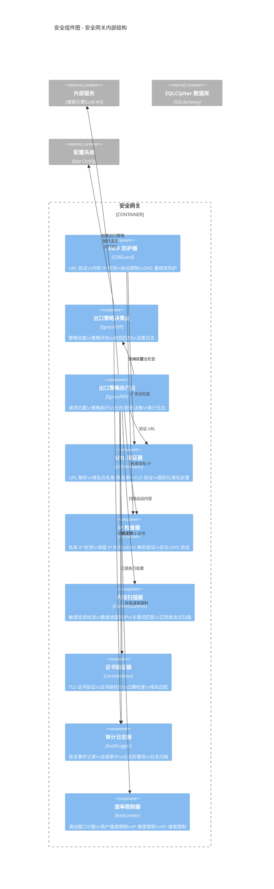

**安全组件图说明**:

安全网关是 LDR 的安全控制核心，所有出站网络请求都必须经过安全网关的审查和过滤。网关采用 PDP/PEP（策略决策点/策略执行点）架构，结合 SSRF 防护、内容扫描和审计日志，构建纵深防御体系。

**SSRF 防护器（SSRGuard）** 是防止服务器端请求伪造（SSRF）攻击的核心组件。SSRF 攻击通过构造恶意 URL，诱使服务器访问内网资源或敏感服务。防护器实现四层防御：URL 验证层（解析 URL 并检查格式合法性）、IP 检查层（DNS 解析目标 IP，检查是否在私有 IP 段 10.0.0.0/8、172.16.0.0/12、192.168.0.0/16、127.0.0.0/8 等）、协议限制层（仅允许 HTTP/HTTPS 协议，禁止 file://、gopher://、dict:// 等危险协议）、DNS 重绑定防护（在请求前再次解析 DNS，防止 TTL 过期后 IP 变更为内网地址）。

**出口策略决策点（EgressPDP）** 负责根据预定义策略评估出站请求是否被允许。策略以 YAML/JSON 格式配置，支持域名白名单/黑名单、端口限制、协议限制、时间窗口限制（如仅工作时间允许外部访问）、用户角色限制（如仅管理员可访问特定 API）。决策点将策略编译为决策树，评估时间复杂度 O(log N)。决策结果（允许/拒绝/需审批）返回给执行点。

**出口策略执行点（EgressPEP）** 是策略的执行者，位于出站请求的实际发送点。执行点拦截所有出站请求，查询 PDP 获取决策，根据决策执行允许或拒绝操作。执行点还负责请求内容的出站扫描——检查请求体中是否包含敏感信息（如 API 密钥、密码、个人数据），防止数据泄露。所有执行结果记录到审计日志。

**URL 验证器（URLValidator）** 负责 URL 的格式验证和规范化。验证内容包括：URL 格式合法性（RFC 3986）、域名白名单/黑名单匹配、顶级域名（TLD）验证（防止使用不存在的 TLD）、国际化域名（IDN）处理（防止同形异义字攻击）、URL 长度限制（防止缓冲区溢出）。验证器还支持正则表达式模式匹配，可定义复杂的 URL 匹配规则。

**IP 检查器（IPChecker）** 负责目标 IP 的安全检查。检查内容包括：私有 IP 检测（RFC 1918 定义的私有地址段）、保留 IP 检测（RFC 5737 定义的保留地址段）、链路本地地址检测（169.254.0.0/16）、回环地址检测（127.0.0.0/8）、多播地址检测（224.0.0.0/4）。检查器还支持反向 DNS 验证——解析目标 IP 的 PTR 记录，确认域名与原始请求一致，防止 DNS 重绑定攻击。

**内容扫描器（ContentScanner）** 对出站请求内容进行敏感信息检测。扫描规则包括：正则表达式匹配（如信用卡号、社保号、API 密钥格式）、关键词匹配（如"password"、"secret"、"token"等敏感词）、数据分类匹配（基于预定义的数据分类规则）。扫描器支持自定义规则和第三方规则集集成。

**审计日志器（AuditLogger）** 记录所有安全相关事件，包括：策略决策记录（请求 URL、决策结果、匹配的策略）、策略执行记录（允许/拒绝、执行时间、请求内容摘要）、安全事件记录（SSRF 尝试、速率限制触发、内容扫描告警）。日志采用防篡改设计——每条日志包含前一条日志的哈希值，形成哈希链，确保日志不可篡改。日志支持导出为合规审计报告。

**速率限制器（RateLimiter）** 基于 Flask-Limiter 实现，对出站请求进行速率限制。限制维度包括：全局限制（所有出站请求的总速率）、按目标域名限制（防止对单一目标过度请求）、按用户限制（防止单个用户发起过多请求）、按 API 端点限制（防止特定 API 被滥用）。限制算法采用滑动窗口计数器，支持 Redis 后端实现分布式限制。

### 2.3.5 数据组件图

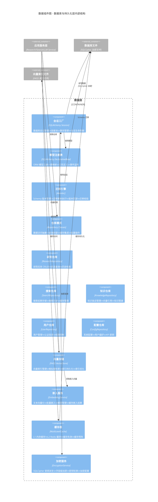

**数据组件图说明**:

数据层是 LDR 的持久化基础，负责管理所有数据的存储、检索、加密和缓存。数据层采用 ORM + 仓库模式 + 多级缓存的复合设计。

**会话工厂（SessionFactory）** 基于 SQLAlchemy 2.0 的 `sessionmaker` 创建，管理数据库会话的生命周期。会话工厂配置了连接池（默认大小 20，最大溢出 10）、连接回收（30 分钟）、预检查（连接使用前验证有效性）。所有数据库操作通过会话进行，会话在请求结束时自动关闭（通过 Flask 的 `teardown_request` 钩子）。

**模型注册表（ModelRegistry）** 基于 SQLAlchemy 的 DeclarativeBase 实现，包含 24 个模型文件和 50+ 张表。模型分为以下类别：研究相关（Research, ResearchStep, Report）、搜索相关（SearchQuery, SearchResult, SearchEngine）、知识相关（KnowledgeEntry, KnowledgeTag, KnowledgeRelation）、用户相关（User, Role, Permission）、配置相关（Config, APIKey, SystemSetting）、审计相关（AuditLog, SecurityEvent）。模型间通过 SQLAlchemy 关系（relationship）定义关联。

**迁移引擎（MigrationEngine）** 基于 Alembic 实现数据库 Schema 的版本化管理。每次 Schema 变更（新增表、修改列、添加索引）都对应一个迁移脚本，脚本包含 `upgrade()` 和 `downgrade()` 方法。迁移引擎支持自动迁移（应用启动时自动执行未应用的迁移）、版本回滚（回退到指定版本）、迁移校验（验证当前 Schema 与模型定义一致）。

**仓库模式（Repository Pattern）** 为每个主要实体提供数据访问抽象层。仓库封装了所有 SQLAlchemy 查询逻辑，上层服务不直接操作 ORM。仓库提供标准 CRUD 接口（create, read, update, delete）和领域特定查询接口（如 `find_by_status()`、`find_recent()`）。仓库还支持查询结果缓存——频繁查询的结果自动缓存到 L1/L2 缓存。

**向量存储（VectorStore）** 基于 FAISS 实现，管理研究文档的向量索引。向量存储提供以下接口：`add(vectors, ids)` 添加向量、`search(query_vector, k)` 检索最相似的 k 个向量、`remove(ids)` 删除向量、`save(path)` / `load(path)` 持久化索引。索引类型根据数据量自动选择：数据量 < 10K 使用 Flat（精确检索），10K-100K 使用 IVF（倒排文件），> 100K 使用 IVF-PQ（倒排文件 + 乘积量化）。

**嵌入服务（EmbeddingService）** 基于 sentence-transformers 实现文本向量化。服务支持多种嵌入模型（all-MiniLM-L6-v2 默认、all-mpnet-base-v2 高精度、multi-qa-MiniLM-L6-cos-v1 检索优化）。服务提供单条嵌入和批量嵌入接口，批量嵌入使用 GPU 加速（如果可用）。嵌入结果缓存避免重复计算。

**缓存层（CacheLayer）** 实现多级缓存策略。L1 缓存为进程内 LRU 缓存（使用 `functools.lru_cache` 或 `cachetools.TTLCache`），访问速度最快但容量有限。L2 缓存为 Redis 缓存（可选），支持分布式部署。缓存失效策略包括：TTL 过期、写操作关联失效、手动失效。缓存预热在系统启动时执行，加载热点数据。

**加密服务（EncryptionService）** 管理 SQLCipher 的加密配置。服务在数据库连接时提供加密密钥（通过 PBKDF2 从用户密码派生），确保数据库文件始终加密。服务还支持字段级加密——对特别敏感的数据（如 API 密钥）在应用层额外加密，即使数据库被解密也无法直接读取。密钥轮换支持在不中断服务的情况下更换加密密钥。

---

## 2.4 Code 图（代码/类视图）

Code 图展示系统关键模块的类级别设计，包括类名、属性、方法和类间关系。本节为 8 个核心模块绘制类图。

### 2.4.1 AdvancedSearchSystem 类图

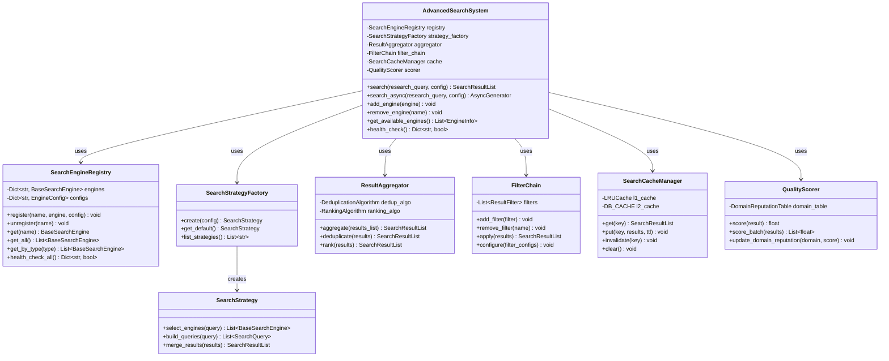

**AdvancedSearchSystem 类图说明**:

AdvancedSearchSystem 是搜索子系统的外观类（Facade），整合所有搜索相关组件为统一接口。

**AdvancedSearchSystem** 作为搜索系统的入口点，提供 `search()` 同步搜索和 `search_async()` 异步流式搜索两种接口。`search()` 方法接收研究查询和配置对象，返回聚合后的搜索结果列表。`search_async()` 是一个异步生成器，在搜索过程中逐步 yield 中间结果，支持前端实时展示搜索进度。系统还提供引擎管理接口（`add_engine`/`remove_engine`）和健康检查接口（`health_check`）。

**SearchEngineRegistry** 是搜索引擎的中央注册表，使用字典存储引擎名称到引擎实例的映射。注册表支持按类型获取引擎（如获取所有学术搜索引擎）、健康检查所有引擎（定期 ping 每个引擎的 API 端点）。注册表是线程安全的，使用 `threading.Lock` 保护并发访问。

**SearchStrategyFactory** 根据配置创建搜索策略实例。策略配置包括引擎选择规则、查询构建规则、结果合并规则。工厂使用缓存避免重复创建相同配置的策略实例。

**SearchStrategy** 定义搜索策略的接口。`select_engines()` 根据查询特征选择合适的搜索引擎组合（如学术查询优先选择 ArXiv/PubMed）；`build_queries()` 将研究问题转化为各引擎的查询参数（不同引擎的查询语法不同）；`merge_results()` 定义多引擎结果的合并逻辑。

**ResultAggregator** 负责多引擎结果的聚合。聚合过程包括去重（基于 URL 精确去重 + 基于 SimHash 的内容近似去重）和排序（综合相关性、质量、时效性的多因子排序）。去重算法使用 SimHash（64 位指纹，汉明距离 < 3 视为重复），排序算法使用加权评分模型。

**FilterChain** 实现管道-过滤器模式，搜索结果依次经过所有注册的过滤器。过滤器链支持运行时配置，用户可启用/禁用特定过滤器、调整过滤器顺序。每个过滤器实现 `filter(results) -> results` 接口。

**SearchCacheManager** 管理搜索结果的多级缓存。L1 使用 LRU 缓存（内存，容量 1000），L2 使用数据库缓存（持久化，TTL 7 天）。缓存键由查询参数和研究配置的哈希生成。

**QualityScorer** 对搜索结果进行质量评分。评分基于域名信誉表（预置常见域名的信誉分数）、内容质量（文本长度、结构完整性）、时效性（发布时间与当前时间的差距）。评分结果影响最终排序。

### 2.4.2 BaseSearchEngine 继承体系类图

```mermaid
classDiagram
    class BaseSearchEngine {
        <<abstract>>
        #str name
        #EngineConfig config
        #RateLimiter rate_limiter
        #Session http_session
        +search(query, max_results) List~SearchResult~
        +search_async(query, max_results) AsyncGenerator~SearchResult~
        +health_check() bool
        +get_name() str
        +get_config() EngineConfig
        #_build_request(query) Request
        #_parse_response(response) List~SearchResult~
        #_handle_error(error) void
    }

    class DuckDuckGoEngine {
        -str endpoint
        +search(query, max_results) List~SearchResult~
        -_parse_response(response) List~SearchResult~
    }

    class GoogleEngine {
        -str api_key
        -str cx_id
        +search(query, max_results) List~SearchResult~
        -_build_request(query) Request
    }

    class ArXivEngine {
        -str endpoint
        -int max_retries
        +search(query, max_results) List~SearchResult~
        -_parse_response(response) List~SearchResult~
        -_build_advanced_query(query) str
    }

    class PubMedEngine {
        -str api_key
        -str endpoint
        +search(query, max_results) List~SearchResult~
        -_parse_response(response) List~SearchResult~
    }

    class SearXNGEngine {
        -str instance_url
        -List~str~ categories
        +search(query, max_results) List~SearchResult~
        -_build_request(query) Request
    }

    class WikipediaEngine {
        -str endpoint
        -str language
        +search(query, max_results) List~SearchResult~
        -_parse_response(response) List~SearchResult~
    }

    class GitHubEngine {
        -str api_token
        +search(query, max_results) List~SearchResult~
        -_build_request(query) Request
    }

    class BraveEngine {
        -str api_key
        +search(query, max_results) List~SearchResult~
        -_parse_response(response) List~SearchResult~
    }

    class BingEngine {
        -str api_key
        +search(query, max_results) List~SearchResult~
    }

    class SearchResult {
        +str url
        +str title
        +str snippet
        +str content
        +datetime published_at
        +str source_engine
        +float score
        +Dict metadata
    }

    class EngineConfig {
        +str name
        +bool enabled
        +int max_results
        +int timeout
        +Dict extra
    }

    BaseSearchEngine <|-- DuckDuckGoEngine
    BaseSearchEngine <|-- GoogleEngine
    BaseSearchEngine <|-- ArXivEngine
    BaseSearchEngine <|-- PubMedEngine
    BaseSearchEngine <|-- SearXNGEngine
    BaseSearchEngine <|-- WikipediaEngine
    BaseSearchEngine <|-- GitHubEngine
    BaseSearchEngine <|-- BraveEngine
    BaseSearchEngine <|-- BingEngine

    BaseSearchEngine --> SearchResult : produces
    BaseSearchEngine --> EngineConfig : configured by
```

**BaseSearchEngine 继承体系类图说明**:

BaseSearchEngine 是搜索引擎的抽象基类，定义所有搜索引擎必须实现的接口和共享的基础设施。

**BaseSearchEngine** 抽象类定义了搜索引擎的核心接口：`search()` 同步搜索方法（子类必须实现）、`search_async()` 异步搜索方法（提供默认实现，子类可覆盖）、`health_check()` 健康检查方法。基类还提供共享的基础设施：HTTP 会话管理（连接池复用）、速率限制（防止触发 API 限制）、错误处理（统一异常处理框架）。模板方法模式体现在 `_build_request()` 和 `_parse_response()` 钩子方法——基类定义搜索流程框架，子类实现具体的请求构建和响应解析。

**DuckDuckGoEngine** 实现 DuckDuckGo 搜索引擎。DuckDuckGo 无需 API Key，通过公开端点访问。引擎处理 DuckDuckGo 的 HTML 响应格式，提取搜索结果链接、标题和摘要。由于 DuckDuckGo 的速率限制较严格，引擎实现了请求间隔控制。

**GoogleEngine** 通过 SerpAPI 访问 Google 搜索。需要 API Key 和自定义搜索引擎 ID（cx_id）。引擎构建 SerpAPI 请求参数，解析 JSON 响应提取有机搜索结果、知识图谱、相关问题等。

**ArXivEngine** 实现 ArXiv 学术论文搜索。使用 ArXiv 公开 API，支持高级查询语法（作者、标题、摘要、分类等）。引擎解析 Atom XML 响应，提取论文标题、作者、摘要、PDF 链接、分类信息。引擎还支持按相关性和日期排序。

**PubMedEngine** 通过 NCBI E-utilities API 搜索生物医学文献。支持 API Key（提高速率限制）。引擎构建 ESearch 请求获取论文 ID 列表，然后使用 EFetch 获取论文详细信息（标题、作者、摘要、期刊、DOI）。

**SearXNGEngine** 通过自托管的 SearXNG 实例进行元搜索。SearXNG 聚合多个搜索引擎的结果，引擎只需与单个端点交互即可获得多引擎结果。引擎支持配置搜索类别（general/images/news/science 等）。

**WikipediaEngine** 通过 Wikipedia API 检索百科知识。支持多语言（通过 `language` 配置项）。引擎解析 JSON 响应，提取页面标题、摘要、链接和分类信息。

**GitHubEngine** 通过 GitHub API 搜索代码仓库。需要 API Token（公开仓库可无 Token，但速率限制较低）。引擎支持搜索仓库、代码、Issue、Pull Request 等多种资源类型。

**BraveEngine** 通过 Brave Search API 搜索。需要 API Key。Brave 拥有独立的搜索索引，不依赖 Google 或 Bing。引擎支持区域化和本地化搜索。

**BingEngine** 通过 Bing Search API 搜索。需要 API Key。引擎支持 Web 搜索、图片搜索、新闻搜索等多种模式。

**SearchResult** 是统一的结果数据类，所有引擎的输出都转换为该格式。包含 URL、标题、摘要、完整内容、发布时间、来源引擎、质量评分和元数据字典。

**EngineConfig** 是引擎配置数据类，包含引擎名称、启用状态、最大结果数、超时时间和额外配置字典。配置从 YAML/JSON 文件加载，支持热更新。

### 2.4.3 LLM Provider 继承体系类图

```mermaid
classDiagram
    class BaseLLMProvider {
        <<abstract>>
        #str provider_name
        #ProviderConfig config
        #AsyncClient http_client
        #TokenCounter token_counter
        +generate(prompt, **kwargs) str
        +generate_stream(prompt, **kwargs) AsyncGenerator~str~
        +agenerate(prompt, **kwargs) str
        +health_check() bool
        +get_models() List~str~
        +count_tokens(text) int
        #_build_request(prompt, **kwargs) dict
        #_parse_response(response) str
        #_handle_error(error) void
    }

    class OpenAIProvider {
        -str api_key
        -str base_url
        -str model
        +generate(prompt, **kwargs) str
        +generate_stream(prompt, **kwargs) AsyncGenerator~str~
        -_build_request(prompt, **kwargs) dict
    }

    class AnthropicProvider {
        -str api_key
        -str model
        -str version
        +generate(prompt, **kwargs) str
        +generate_stream(prompt, **kwargs) AsyncGenerator~str~
        -_build_request(prompt, **kwargs) dict
    }

    class GoogleProvider {
        -str api_key
        -str model
        +generate(prompt, **kwargs) str
        +generate_stream(prompt, **kwargs) AsyncGenerator~str~
        -_build_request(prompt, **kwargs) dict
    }

    class OllamaProvider {
        -str base_url
        -str model
        +generate(prompt, **kwargs) str
        +generate_stream(prompt, **kwargs) AsyncGenerator~str~
        +health_check() bool
        +get_models() List~str~
    }

    class DeepSeekProvider {
        -str api_key
        -str model
        +generate(prompt, **kwargs) str
        -_build_request(prompt, **kwargs) dict
    }

    class OpenRouterProvider {
        -str api_key
        -str model
        +generate(prompt, **kwargs) str
        -_build_request(prompt, **kwargs) dict
    }

    class LLMResponse {
        +str content
        +int prompt_tokens
        +int completion_tokens
        +int total_tokens
        +float cost
        +str model
        +Dict metadata
    }

    class ProviderConfig {
        +str provider_name
        +str api_key
        +str model
        +float temperature
        +int max_tokens
        +Dict extra
    }

    BaseLLMProvider <|-- OpenAIProvider
    BaseLLMProvider <|-- AnthropicProvider
    BaseLLMProvider <|-- GoogleProvider
    BaseLLMProvider <|-- OllamaProvider
    BaseLLMProvider <|-- DeepSeekProvider
    BaseLLMProvider <|-- OpenRouterProvider

    BaseLLMProvider --> LLMResponse : produces
    BaseLLMProvider --> ProviderConfig : configured by
```

**LLM Provider 继承体系类图说明**:

BaseLLMProvider 是 LLM 提供商的抽象基类，定义所有提供商必须实现的接口和共享基础设施。

**BaseLLMProvider** 抽象类定义了 LLM 提供商的核心接口：`generate()` 同步生成方法、`generate_stream()` 流式生成方法、`agenerate()` 异步生成方法、`health_check()` 健康检查方法、`get_models()` 获取可用模型列表、`count_tokens()` Token 计数方法。基类提供共享的 HTTP 客户端（httpx.AsyncClient）、Token 计数器和错误处理框架。模板方法模式体现在 `_build_request()` 和 `_parse_response()` 钩子方法。

**OpenAIProvider** 实现 OpenAI API 调用。支持 GPT-4、GPT-4o、GPT-4o-mini 等模型。使用 OpenAI 官方 Python SDK，支持流式输出和函数调用。`base_url` 配置项支持 OpenAI 兼容 API（如 Azure OpenAI、本地 LLM 网关）。

**AnthropicProvider** 实现 Anthropic API 调用。支持 Claude 3.5 Sonnet、Claude 4 Opus 等模型。使用 Anthropic 官方 SDK，处理 Anthropic 特有的消息格式（system prompt 分离、user/assistant 交替）。支持流式输出和工具使用。

**GoogleProvider** 实现 Google AI API 调用。支持 Gemini Pro、Gemini Ultra 等模型。使用 Google Generative AI SDK，处理 Google 特有的安全设置和多模态输入。

**OllamaProvider** 实现 Ollama 本地 LLM 调用。Ollama 提供 OpenAI 兼容 API，但 `base_url` 指向本地服务（默认 http://localhost:11434）。该提供商无需 API Key，支持自动下载和管理本地模型。`health_check()` 方法检查 Ollama 服务是否运行，`get_models()` 返回已下载的本地模型列表。

**DeepSeekProvider** 实现 DeepSeek API 调用。DeepSeek API 兼容 OpenAI 格式，但使用不同的 `base_url`。支持 DeepSeek-V3、DeepSeek-R1 等模型。

**OpenRouterProvider** 实现 OpenRouter 聚合网关调用。OpenRouter 提供统一接口访问多个 LLM 提供商，通过 `model` 参数指定底层模型（如 `anthropic/claude-3.5-sonnet`、`openai/gpt-4o`）。

**LLMResponse** 是统一的响应数据类，包含生成内容、Token 使用量（prompt/completion/total）、成本、模型名称和元数据。

**ProviderConfig** 是提供商配置数据类，包含提供商名称、API Key、默认模型、温度、最大 Token 数和额外配置。

### 2.4.4 Strategy 模式类图

```mermaid
classDiagram
    class SearchStrategy {
        <<interface>>
        +select_engines(query, registry) List~BaseSearchEngine~
        +build_queries(query) List~SearchQuery~
        +merge_results(results) SearchResultList
    }

    class DefaultSearchStrategy {
        -EngineSelector selector
        +select_engines(query, registry) List~BaseSearchEngine~
        +build_queries(query) List~SearchQuery~
        +merge_results(results) SearchResultList
    }

    class AcademicSearchStrategy
        AcademicSearchStrategy : +select_engines(query, registry) List~BaseSearchEngine~
        AcademicSearchStrategy : +build_queries(query) List~SearchQuery~
        AcademicSearchStrategy : +merge_results(results) SearchResultList

    class NewsSearchStrategy
        NewsSearchStrategy : +select_engines(query, registry) List~BaseSearchEngine~
        NewsSearchStrategy : +build_queries(query) List~SearchQuery~
        NewsSearchStrategy : +merge_results(results) SearchResultList

    class CodeSearchStrategy
        CodeSearchStrategy : +select_engines(query, registry) List~BaseSearchEngine~
        CodeSearchStrategy : +build_queries(query) List~SearchQuery~
        CodeSearchStrategy : +merge_results(results) SearchResultList

    class ComprehensiveSearchStrategy
        ComprehensiveSearchStrategy : +select_engines(query, registry) List~BaseSearchEngine~
        ComprehensiveSearchStrategy : +build_queries(query) List~SearchQuery~
        ComprehensiveSearchStrategy : +merge_results(results) SearchResultList

    class ResearchStrategy {
        <<interface>>
        +plan(research_question) ResearchPlan
        +execute_step(step, context) StepResult
        +should_continue(state) bool
    }

    class IterativeResearchStrategy
        IterativeResearchStrategy : -int max_iterations
        IterativeResearchStrategy : -float convergence_threshold
        IterativeResearchStrategy : +plan(research_question) ResearchPlan
        IterativeResearchStrategy : +execute_step(step, context) StepResult
        IterativeResearchStrategy : +should_continue(state) bool

    class LLMStrategy {
        <<interface>>
        +select_provider(task_type) BaseLLMProvider
        +build_prompt(task, context) str
        +parse_output(output) StructuredOutput
    }

    class DefaultLLMStrategy
        DefaultLLMStrategy : +select_provider(task_type) BaseLLMProvider
        DefaultLLMStrategy : +build_prompt(task, context) str
        DefaultLLMStrategy : +parse_output(output) StructuredOutput

    SearchStrategy <|.. DefaultSearchStrategy
    SearchStrategy <|.. AcademicSearchStrategy
    SearchStrategy <|.. NewsSearchStrategy
    SearchStrategy <|.. CodeSearchStrategy
    SearchStrategy <|.. ComprehensiveSearchStrategy

    ResearchStrategy <|.. IterativeResearchStrategy
    LLMStrategy <|.. DefaultLLMStrategy
```

**Strategy 模式类图说明**:

策略模式是 LDR 实现可扩展性的核心设计模式。系统定义了三个策略接口：SearchStrategy（搜索策略）、ResearchStrategy（研究策略）、LLMStrategy（LLM 策略）。

**SearchStrategy** 接口定义搜索策略的三个核心操作：`select_engines()` 根据查询特征选择合适的搜索引擎组合；`build_queries()` 将研究问题转化为各引擎的查询参数；`merge_results()` 定义多引擎结果的合并逻辑。

**DefaultSearchStrategy** 是默认搜索策略，使用启发式规则选择引擎：根据查询中的关键词判断搜索类型（学术/新闻/代码/通用），选择对应类型的引擎组合。查询构建使用简单的关键词提取和布尔运算符组合。结果合并使用加权评分排序。

**AcademicSearchStrategy** 是学术研究专用策略。引擎选择优先 ArXiv、PubMed、Semantic Scholar、Google Scholar 等学术引擎。查询构建支持高级学术查询语法（作者:、标题:、期刊:、年份:）。结果合并按引用数和期刊影响力加权。

**NewsSearchStrategy** 是新闻搜索专用策略。引擎选择优先新闻类引擎（Google News、Brave News、新闻聚合器）。查询构建添加时间范围限定。结果合并按时效性加权（越新的结果权重越高）。

**CodeSearchStrategy** 是代码搜索专用策略。引擎选择优先 GitHub、Stack Overflow、代码搜索引擎。查询构建支持代码片段搜索和 API 文档搜索。结果合并按 Star 数和采纳率加权。

**ComprehensiveSearchStrategy** 是综合搜索策略，并行调用所有可用引擎，使用机器学习模型对结果进行相关性排序。适用于不确定搜索类型的探索性研究。

**ResearchStrategy** 接口定义研究策略的核心操作：`plan()` 将研究问题分解为执行步骤；`execute_step()` 执行单个步骤；`should_continue()` 判断是否继续迭代。

**IterativeResearchStrategy** 是默认研究策略，实现多轮迭代研究。`max_iterations` 控制最大迭代次数（默认 5），`convergence_threshold` 控制收敛阈值（当新增信息量低于阈值时停止迭代）。每轮迭代包括：搜索 → 分析 → 评估信息充分性 → 决定是否继续。

**LLMStrategy** 接口定义 LLM 调用策略：`select_provider()` 根据任务类型选择合适的 LLM 提供商；`build_prompt()` 构建提示；`parse_output()` 解析输出。

**DefaultLLMStrategy** 是默认 LLM 策略，根据任务复杂度选择提供商（简单任务用经济模型，复杂任务用高性能模型），使用提示模板库构建提示，使用输出解析器解析结构化输出。

### 2.4.5 VectorStore / EmbeddingProvider 类图

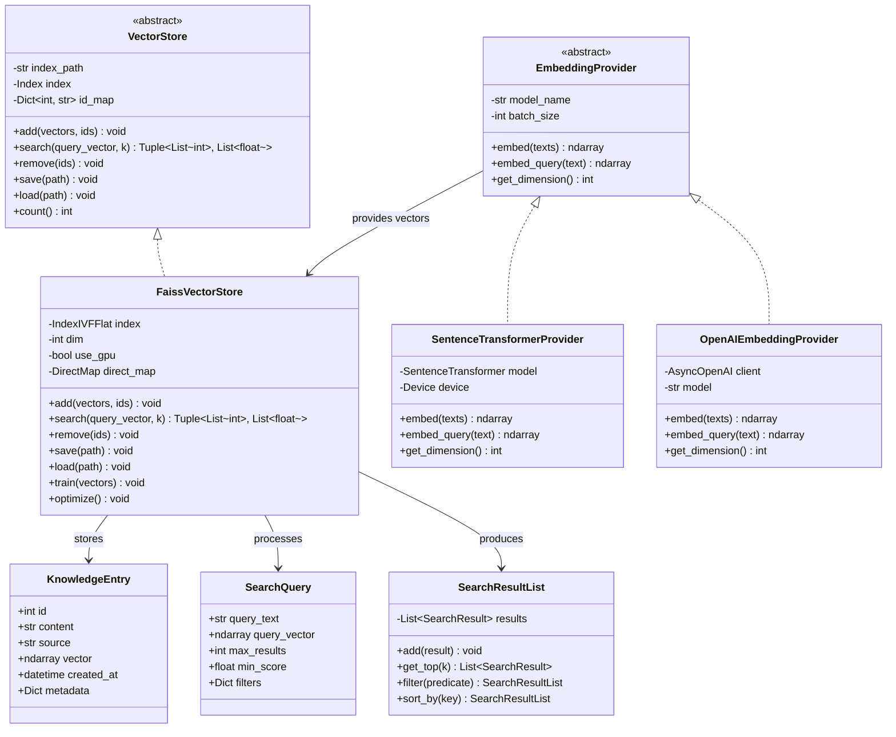

**VectorStore / EmbeddingProvider 类图说明**:

向量存储和嵌入服务是 LDR 知识库的核心组件，负责将文本转换为向量并存储在 FAISS 索引中以供语义检索。

**VectorStore** 抽象类定义向量存储的核心接口：`add()` 添加向量（支持批量添加）、`search()` 检索最相似的 k 个向量（返回 ID 列表和相似度分数）、`remove()` 删除向量、`save()`/`load()` 持久化索引、`count()` 返回索引中的向量数量。

**FaissVectorStore** 是 FAISS 的具体实现。支持多种索引类型：Flat（精确检索，适合 < 10K 向量）、IVF（倒排文件，适合 10K-100K 向量）、IVF-PQ（倒排文件 + 乘积量化，适合 > 100K 向量）。`use_gpu` 配置项控制是否使用 GPU 加速（需要 FAISS GPU 版本和 NVIDIA GPU）。`train()` 方法在添加向量前训练索引（IVF 类型需要），`optimize()` 方法压缩索引以减小内存占用。`direct_map` 支持通过 ID 直接访问向量（用于删除操作）。

**EmbeddingProvider** 抽象类定义嵌入服务的核心接口：`embed()` 批量嵌入文本列表、`embed_query()` 嵌入单个查询（某些模型对查询和文档使用不同的嵌入方式）、`get_dimension()` 返回嵌入向量的维度。

**SentenceTransformerProvider** 是 sentence-transformers 的具体实现。支持多种预训练模型：all-MiniLM-L6-v2（默认，384 维，速度快）、all-mpnet-base-v2（768 维，精度高）、multi-qa-MiniLM-L6-cos-v1（检索优化）。`device` 配置项控制运行设备（CPU/CUDA/MPS）。批量嵌入使用 GPU 加速，单条嵌入使用 CPU 以减少 GPU 内存占用。

**OpenAIEmbeddingProvider** 是 OpenAI 嵌入 API 的实现。支持 text-embedding-3-small（1536 维）、text-embedding-3-large（3072 维）等模型。适用于需要与 OpenAI 生态集成的场景。

**KnowledgeEntry** 是知识库条目的数据类，包含条目 ID、内容文本、来源标识、嵌入向量、创建时间和元数据字典。

**SearchQuery** 是向量检索查询的数据类，包含查询文本、查询向量、最大结果数、最小相似度分数和过滤条件字典。

**SearchResultList** 是搜索结果列表的数据类，提供添加结果、获取 Top-K、过滤和排序等操作。

### 2.4.6 Database Model 核心关系类图

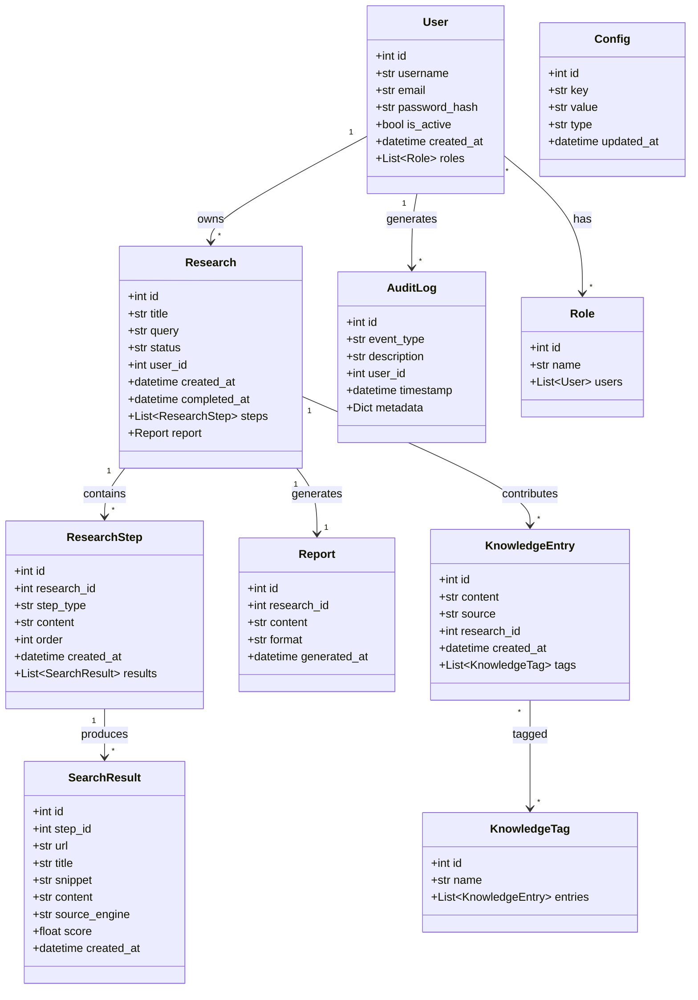

**Database Model 核心关系类图说明**:

数据库模型是 LDR 数据持久化的基础，包含 24 个模型文件和 50+ 张表。上图为核心实体及其关系的简化视图。

**User** 是用户实体，存储用户认证信息和基本资料。`password_hash` 使用 bcrypt 哈希存储，`is_active` 控制账户状态。用户与角色是多对多关系（通过关联表），与研究是一对多关系。

**Research** 是研究任务实体，是系统的核心业务对象。`status` 字段跟踪研究状态（PENDING → SEARCHING → ANALYZING → SYNTHESIZING → REPORTING → COMPLETED/FAILED）。`query` 存储用户输入的研究问题。研究包含多个步骤（ResearchStep）和一份最终报告（Report）。

**ResearchStep** 是研究步骤实体，记录研究过程中的每个阶段。`step_type` 标识步骤类型（SEARCH/ANALYZE/SYNTHESIZE/REPORT），`content` 存储步骤的输入输出内容，`order` 标识步骤顺序。每个步骤可产生多个搜索结果。

**SearchResult** 是搜索结果实体，存储从搜索引擎获取的原始结果。`url` 是结果页面链接，`title` 是页面标题，`snippet` 是搜索摘要，`content` 是提取的完整内容，`source_engine` 标识来源引擎，`score` 是质量评分。

**Report** 是研究报告实体，存储最终生成的研究报告。`content` 是报告正文（Markdown 格式），`format` 标识报告格式（Markdown/PDF/HTML）。每份研究对应一份报告。

**KnowledgeEntry** 是知识库条目实体，从研究成果中提取的结构化知识。`content` 是知识内容，`source` 标识知识来源。知识条目可被打上多个标签（KnowledgeTag），实现知识分类。

**KnowledgeTag** 是知识标签实体，用于知识库的分类和检索。标签与知识条目是多对多关系。

**Config** 是系统配置实体，以键值对形式存储系统配置和用户偏好。`type` 标识值类型（string/int/float/json），支持类型安全的配置读取。

**AuditLog** 是审计日志实体，记录系统中的安全相关事件。`event_type` 标识事件类型（LOGIN/LOGOUT/SEARCH/EXPORT/SECURITY_ALERT），`description` 是事件描述，`metadata` 是结构化元数据（JSON 格式）。

**Role** 是角色实体，用于基于角色的访问控制（RBAC）。角色与用户是多对多关系。

### 2.4.7 Flask App Factory 初始化类图

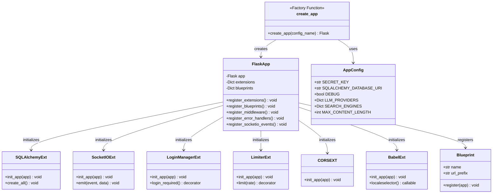

**Flask App Factory 初始化类图说明**:

Flask App Factory 是 LDR 应用的创建入口，采用工厂模式实现多环境配置和延迟初始化。

**create_app()** 是应用工厂函数，接收配置名称参数（development/testing/production），返回配置完成的 Flask 应用实例。工厂函数执行以下步骤：创建 Flask 实例 → 加载配置 → 初始化扩展 → 注册蓝图 → 注册中间件 → 注册错误处理器 → 注册 SocketIO 事件。

**FlaskApp** 封装了应用的核心组件。`extensions` 字典存储所有已初始化的扩展实例，`blueprints` 字典存储所有已注册的蓝图。`register_extensions()` 按顺序初始化所有扩展（顺序很重要，因为扩展间有依赖关系）。`register_blueprints()` 注册所有蓝图（auth/research/config/api）。`register_middleware()` 注册请求预处理和后处理中间件。`register_error_handlers()` 注册全局错误处理器（404/500/429 等）。`register_socketio_events()` 注册 SocketIO 事件处理器。

**AppConfig** 是应用配置类，包含所有配置项。`SECRET_KEY` 用于 Session 签名和 CSRF Token 生成。`SQLALCHEMY_DATABASE_URI` 指定数据库连接字符串（SQLCipher 加密数据库）。`LLM_PROVIDERS` 和 `SEARCH_ENGINES` 是嵌套字典，存储各提供商和引擎的配置。`MAX_CONTENT_LENGTH` 限制上传文件大小。

**扩展初始化顺序**: SQLAlchemy（数据库）→ LoginManager（认证）→ CORS（跨域）→ Babel（国际化）→ Limiter（限流）→ SocketIO（实时通信）。这个顺序确保依赖关系正确——例如 Limiter 需要 LoginManager 来识别用户。

**Blueprint** 是 Flask 的模块化路由机制。LDR 使用四个蓝图：auth（认证路由，前缀 /auth）、research（研究路由，前缀 /research）、config（配置路由，前缀 /config）、api（API 路由，前缀 /api/v1）。

### 2.4.8 Security 组件类图

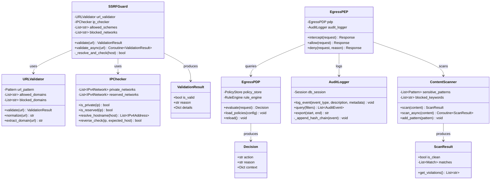

**Security 组件类图说明**:

安全组件类图展示了 LDR 安全网关的详细设计，包括 SSRF 防护、出口策略执行、内容扫描和审计日志。

**SSRFGuard** 是 SSRF 防护的核心类，提供 `validate()` 同步验证和 `validate_async()` 异步验证两种接口。验证流程：URL 格式验证 → 域名白名单/黑名单检查 → DNS 解析 → 目标 IP 私有/保留地址检查 → 反向 DNS 验证。`allowed_schemes` 限制允许的协议（默认仅 HTTP/HTTPS），`blocked_networks` 定义禁止访问的网段。

**URLValidator** 负责 URL 的格式验证和规范化。使用正则表达式验证 URL 格式（符合 RFC 3986），支持域名白名单/黑名单匹配。`normalize()` 方法对 URL 进行规范化处理（统一编码、去除默认端口、小写化域名等），防止通过 URL 变形绕过检查。

**IPChecker** 负责目标 IP 的安全检查。`private_networks` 包含 RFC 1918 定义的私有地址段（10.0.0.0/8、172.16.0.0/12、192.168.0.0/16）和 RFC 5737 定义的保留地址段。`resolve_hostname()` 解析主机名为 IP 地址列表，`reverse_check()` 执行反向 DNS 验证防止 DNS 重绑定攻击。

**EgressPDP**（策略决策点）负责根据预定义策略评估出站请求。`PolicyStore` 存储策略配置，`RuleEngine` 执行策略匹配。策略规则包括：域名白名单/黑名单、端口限制、协议限制、时间窗口限制。`evaluate()` 方法返回 Decision 对象（允许/拒绝/需审批）。

**EgressPEP**（策略执行点）是策略的执行者。`intercept()` 方法拦截所有出站请求，查询 PDP 获取决策，根据决策调用 `allow()` 或 `deny()`。`allow()` 方法在放行请求前执行内容扫描，确保出站内容不包含敏感信息。所有执行结果记录到审计日志。

**ContentScanner** 对出站内容进行敏感信息检测。`sensitive_patterns` 是正则表达式列表（匹配信用卡号、社保号、API 密钥格式等），`blocked_keywords` 是敏感关键词列表。`scan()` 方法返回 ScanResult 对象，包含是否干净、匹配的违规项列表。

**AuditLogger** 记录所有安全事件到数据库。`log_event()` 方法写入事件记录，`query()` 方法支持按时间范围、事件类型、用户 ID 等条件查询。`export()` 方法导出指定时间范围的审计报告（JSON/CSV 格式）。`_append_hash_chain()` 方法实现日志防篡改——每条记录包含前一条记录的 SHA-256 哈希，形成哈希链。

**ValidationResult**、**Decision**、**ScanResult** 是值对象，分别表示 URL 验证结果、策略决策结果和内容扫描结果。这些对象是不可变的，确保结果传递过程中不被篡改。

---

## 2.5 本章小结

本章使用 C4 模型从四个层级完整展示了 Local Deep Research 的架构设计：

1. **Context 层**: 定义了系统边界，识别了 7 个外部 LLM 提供商、9 个外部搜索引擎、2 个外部角色（用户/管理员），明确了三条主要数据流
2. **Container 层**: 展示了 10 个核心容器（Web 应用、SocketIO、后台调度器、MCP Server、SQLCipher DB、FAISS 索引、搜索系统、LLM 框架、安全网关、文档处理器）及其交互协议
3. **Component 层**: 深入 5 个核心容器内部，展示了 Web 层（路由/服务/中间件/模板）、搜索系统（编排器/注册表/策略/过滤器/聚合器）、LLM 框架（注册表/提供商/LangGraph/流式处理）、安全网关（SSRF/PDP/PEP/审计）、数据层（ORM/仓库/向量存储/缓存）的组件设计
4. **Code 层**: 展示了 8 个核心模块的类图，包括 AdvancedSearchSystem 外观类、BaseSearchEngine 继承体系（9 个引擎实现）、BaseLLMProvider 继承体系（6 个提供商实现）、Strategy 模式（5 种搜索策略）、VectorStore/EmbeddingProvider 体系、数据库核心模型（10 个实体）、Flask App Factory 初始化流程、安全组件详细设计

**架构核心设计原则总结**:

- **策略模式**实现搜索引擎和 LLM 提供商的可插拔替换
- **注册表模式**管理所有插件的注册与发现
- **外观模式**（AdvancedSearchSystem）整合复杂子系统为统一接口
- **仓库模式**抽象数据访问层
- **PDP/PEP 架构**实现灵活的出口策略控制
- **模板方法模式**在基类定义流程框架，子类实现具体步骤
- **管道-过滤器模式**实现搜索结果的处理流水线

---

**下一步阅读**: 继续阅读 [03_SEARCH_SYSTEM.md](./03_SEARCH_SYSTEM.md) 深入了解搜索系统的 30+ 引擎实现和策略模式设计。

---

☕️ 制作不易，请我喝咖啡☕️关注我➕