# 第 3 章：系统流程与时序图

> 本文档详细描述 Local Deep Research 系统中 10 个核心流程，每个流程配有 Mermaid 流程图、时序图及文字说明。所有流程均基于源码分析，精确到函数级别。

---

## 3.1 深度研究主流程

深度研究主流程是系统最核心的端到端流程，从用户点击"研究"按钮开始，到最终报告生成并推送至前端结束。

### 3.1.1 流程图

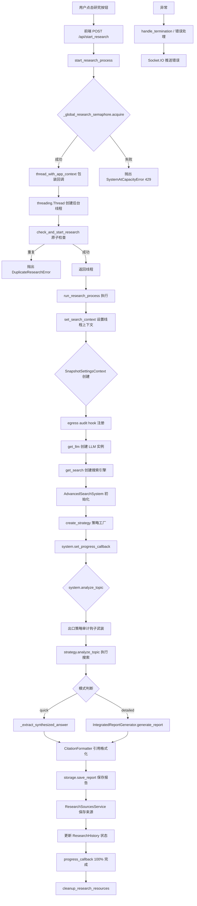

### 3.1.2 时序图

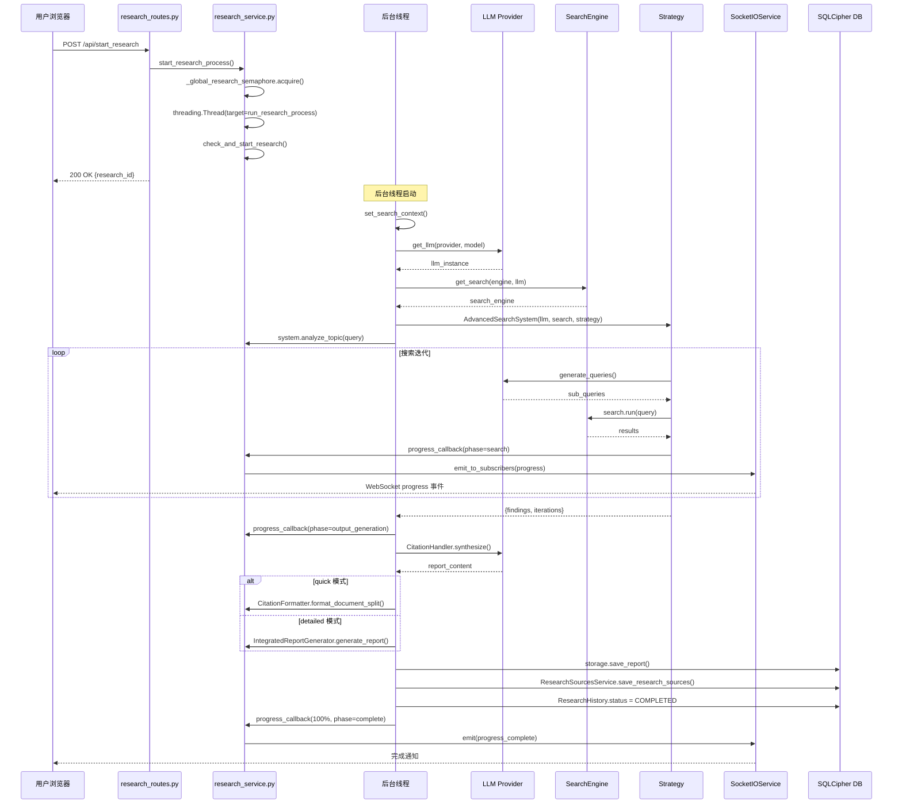

### 3.1.3 流程说明

**步骤逻辑**：

1. **入口阶段**：用户通过前端 `research.html` 提交查询，API 路由 `research_routes.py` 的 `start_research()` 处理请求，调用 `start_research_process()`。
2. **并发控制**：`start_research_process()` 首先尝试获取全局信号量 `_global_research_semaphore`（默认上限 10）。若失败立即返回 429，避免用户等待。
3. **线程创建**：成功获取信号量后，使用 `thread_with_app_context` 包装回调函数 `run_research_process`，确保线程内可访问 Flask 应用上下文。
4. **原子启动**：`check_and_start_research()` 原子性检查 research_id 是否已有活动线程，防止重复启动（如队列重试场景）。
5. **上下文设置**：线程内首先调用 `set_search_context()` 设置线程本地日志上下文，确保日志能写入用户的加密数据库。
6. **配置与策略**：创建 `SnapshotSettingsContext`（线程安全快照），解析 LLM 和搜索引擎配置，通过 `create_strategy()` 工厂创建策略实例。
7. **搜索执行**：`system.analyze_topic()` 首先武装出口策略审计钩子（`_arm_egress_backstop`），然后委托给策略的 `analyze_topic()`。
8. **报告生成**：根据模式（quick/detailed）选择不同路径。quick 模式直接提取合成答案，detailed 模式调用 `IntegratedReportGenerator` 生成结构化报告。
9. **引用格式化**：使用 `CitationFormatter` 处理引用，支持 6 种模式（数字超链接、域名超链接等）。
10. **持久化**：先保存报告，再保存来源（非致命），最后更新状态为 COMPLETED。

**涉及文件/函数**：
- `web/routes/research_routes.py`：`start_research()`
- `web/services/research_service.py`：`start_research_process()`, `run_research_process()`, `progress_callback()`
- `web/services/socket_service.py`：`emit_to_subscribers()`
- `search_system.py`：`AdvancedSearchSystem`, `analyze_topic()`
- `report_generator.py`：`IntegratedReportGenerator`
- `citation_handler.py`：`CitationHandler`

**异常处理**：
- `SystemAtCapacityError`：容量满时立即返回 429
- `DuplicateResearchError`：重复启动保护
- `ResearchTerminatedException`：用户终止时保存部分结果
- `PolicyDeniedError`：出口策略拒绝时返回 400
- 通用异常：记录错误日志，更新状态为 FAILED，推送错误事件

---

## 3.2 LangGraph Agent 策略流程

LangGraph Agent 策略是系统最复杂的搜索策略，使用 LangChain 的 `create_agent()` 构建自主决策的研究代理。

### 3.2.1 流程图

```mermaid
flowchart TD
    A[analyze_topic 入口] B[collector.reset 重置收集器]
    A --> B
    B --> C[_build_tools 构建工具列表]
    C --> D[_build_egress_context 计算策略上下文]
    D --> E[添加工具: web_search]
    E --> F[添加工具: fetch_content]
    F --> G[_load_specialized_engine_tools]
    G --> H[添加工具: research_subtopic]
    H --> I[create_agent 创建 LangGraph Agent]
    I --> J[构建 system_prompt]
    J --> K[agent.stream 流式执行]
    K --> L{chunk 类型判断}
    L -->|agent/model| M[处理 AI 消息]
    L -->|tools| N[处理工具结果]
    M --> O{有 tool_calls?}
    O -->|是| P[格式化工具调用进度]
    O -->|否| Q[设为 final_content]
    P --> R[_update_progress 推送进度]
    R --> S[_heartbeat_message 心跳]
    S --> K
    N --> T[_observation_event 观察事件]
    T --> R
    K -->|流结束| U{有 final_content?}
    U -->|否| V[_synthesize_from_collector 回退合成]
    U -->|是| W[_finalize 最终处理]
    V --> W
    W --> X[CitationHandler 引用处理]
    X --> Y[返回结果字典]
```

### 3.2.2 时序图

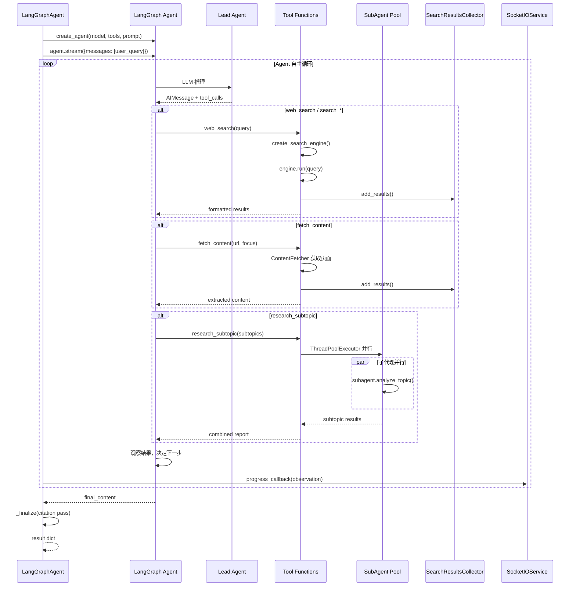

### 3.2.3 流程说明

**步骤逻辑**：

1. **工具构建**：`_build_tools()` 构建代理可用的工具列表，包括通用 `web_search`、`fetch_content`、专用搜索引擎工具、以及 `research_subtopic` 子代理工具。工具列表经过出口策略过滤，禁止的工具不会暴露给 LLM。

2. **策略上下文**：`_build_egress_context()` 计算当前运行的出口策略上下文（EgressContext），传递给所有工具构建函数，确保子代理线程也能应用相同的策略。

3. **Agent 创建**：使用 `create_agent()` 创建 LangGraph Agent，绑定工具和系统提示。系统提示包含策略指南（先搜索、复杂问题用子代理、引用格式等）。

4. **流式执行**：`agent.stream()` 以 `updates` 模式流式执行，每轮迭代处理 agent/model 节点（AI 推理）和 tools 节点（工具执行）。

5. **工具调用处理**：当 AI 产生 tool_calls 时，调用 `_format_tool_call_progress()` 生成用户友好的进度消息（如"🔍 Searching PubMed: query"）。

6. **观察事件**：工具结果通过 `_observation_event()` 处理，生成 150 字符的预览和 4000 字符的详细信息（用于展开显示）。

7. **心跳机制**：工具执行后，发送心跳消息显示当前迭代、已收集来源数、可用工具数，避免用户看到空白等待。

8. **子代理并行**：`research_subtopic` 工具使用 `ThreadPoolExecutor` 并行执行子代理研究，每个子代理有独立的 30 分钟超时。

9. **回退合成**：如果代理因递归限制或异常中断，使用 `_synthesize_from_collector()` 基于已收集的来源进行回退合成。

10. **最终处理**：`_finalize()` 应用引用处理，构建包含 findings、current_knowledge、formatted_findings 的结果字典。

**涉及文件/函数**：
- `advanced_search_system/strategies/langgraph_agent_strategy.py`：`LangGraphAgentStrategy`
- `advanced_search_system/tools/fetch/`：`build_fetch_tool()`
- `web_search_engines/search_engine_factory.py`：`create_search_engine()`

**异常处理**：
- `GraphRecursionError`：递归限制时回退到合成
- `ResearchTerminatedException`：用户终止时保存部分结果
- 工具异常：`_scrub_tool_error()` 清理凭证后返回错误描述

---

## 3.3 搜索系统流程

搜索引擎采用双阶段检索模式，是系统获取外部信息的核心机制。

### 3.3.1 流程图

```mermaid
flowchart TD
    A[BaseSearchEngine.run 入口] B[_verify_egress_scope 验证出口策略]
    A --> B
    B --> C{rate_tracker.enabled?}
    C -->|是| D[带重试执行 _run_with_retry]
    C -->|否| E[直接执行]
    D --> F[_execute_search]
    E --> F
    F --> G[_get_previews 获取预览]
    G --> H{is_scientific?}
    H -->|是| I[enrich_results_with_source_ids]
    H -->|否| J[preview_filters 过滤]
    I --> J
    J --> K{enable_llm_relevance_filter?}
    K -->|是| L[_filter_for_relevance LLM 过滤]
    K -->|否| M[跳过过滤]
    L --> N{search_snippets_only?}
    M --> N
    N -->|是| O[返回 snippet 结果]
    N -->|否| P[_get_full_content 获取完整内容]
    P --> Q[content_filters 过滤]
    Q --> R[rate_tracker.record_outcome]
    R --> S[返回结果]
    S --> T[SearchTracker.record_search]
    T --> U[清理临时属性]
```

### 3.3.2 时序图

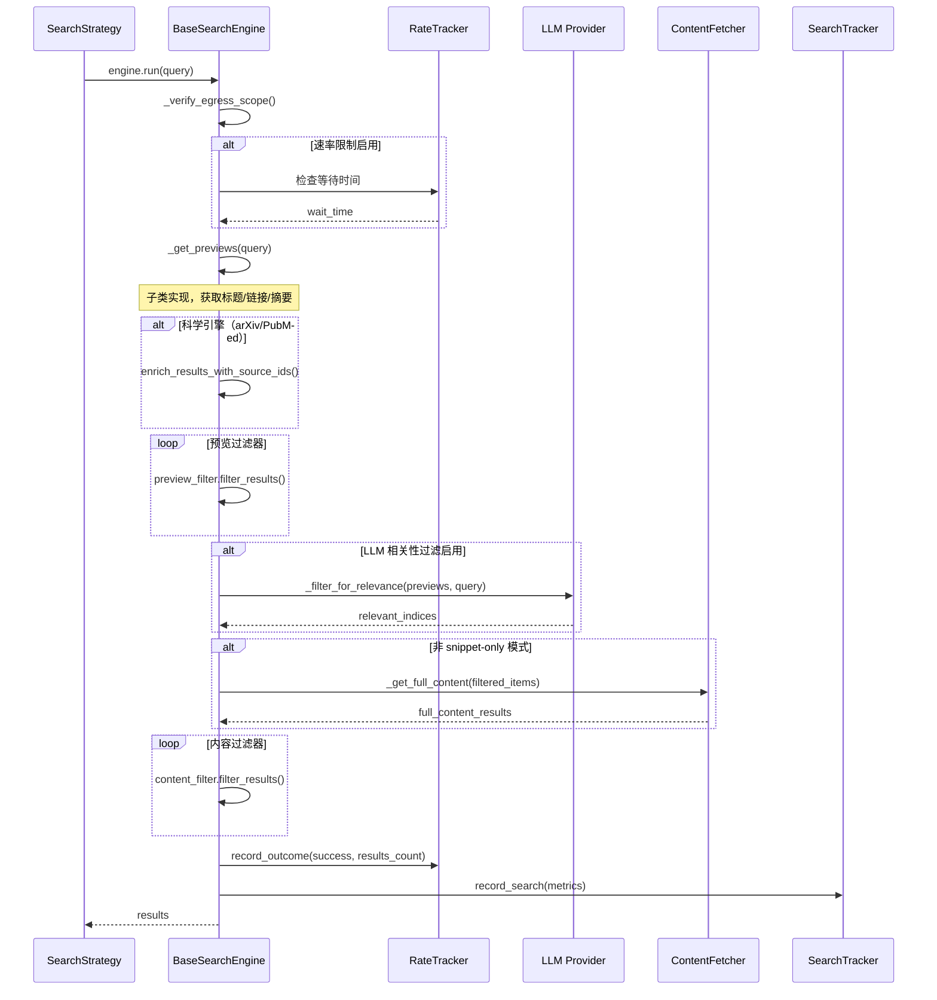

### 3.3.3 流程说明

**步骤逻辑**：

1. **出口策略验证**：`_verify_egress_scope()` 在每次搜索前验证引擎是否在当前出口策略允许范围内，这是纵深防御的一环。

2. **速率限制**：如果启用速率限制，使用 `tenacity` 库进行最多 3 次重试，采用自适应等待策略（`AdaptiveWait`）。

3. **预览获取**：调用子类的 `_get_previews()` 方法，获取搜索结果的基本信息（标题、链接、摘要、snippet）。不同引擎实现不同。

4. **DOI 丰富**：对于科学引擎（arXiv、PubMed 等），在预览过滤前执行 DOI→OpenAlex 来源 ID 丰富，为期刊声誉过滤做准备。

5. **预览过滤**：依次执行所有注册的预览过滤器（如 `JournalReputationFilter`），在获取全文前过滤低质量结果。

6. **LLM 相关性过滤**：如果引擎配置了 `needs_llm_relevance_filter=True` 或全局启用，使用 LLM 判断每个预览与查询的相关性，只保留相关结果。

7. **完整内容获取**：对于非 snippet-only 模式，调用 `_get_full_content()` 获取完整页面内容。

8. **内容过滤**：执行内容过滤器（如语言过滤、长度过滤）。

9. **指标记录**：记录搜索指标（响应时间、结果数、成功状态）用于监控和速率限制。

**涉及文件/函数**：
- `web_search_engines/search_engine_base.py`：`BaseSearchEngine.run()`, `_get_previews()`, `_get_full_content()`, `_filter_for_relevance()`
- `web_search_engines/rate_limiting/`：速率限制跟踪
- `advanced_search_system/filters/`：各种过滤器实现

**异常处理**：
- `RateLimitError`：触发重试机制
- 一般异常：清理凭证后记录，返回空结果
- `RetryError`：所有重试耗尽后返回空结果

---

## 3.4 报告生成流程

报告生成流程处理搜索结果到最终格式化报告的转换。

### 3.4.1 流程图

```mermaid
flowchart TD
    A[report_generator.generate_report 入口] B[分析搜索结果结构]
    A --> B
    B --> C{模式判断}
    C -->|quick| D[_extract_synthesized_answer]
    C -->|detailed| E[生成详细报告]
    D --> F[CitationFormatter.format_document_split]
    E --> F
    F --> G{LLM 来源存在?}
    G -->|是| H[使用 LLM 提取的来源]
    G -->|否| I[apply_inline_hyperlinks 结构化超链接]
    H --> J[安全检查: 长度变化]
    I --> J
    J --> K{长度变化 > 50%?}
    K -->|是| L[回退到结构化超链接]
    K -->|否| M[使用当前结果]
    L --> N[storage.save_report]
    M --> N
    N --> O[ResearchSourcesService.save_research_sources]
    O --> P[返回报告内容]
```

### 3.4.2 时序图

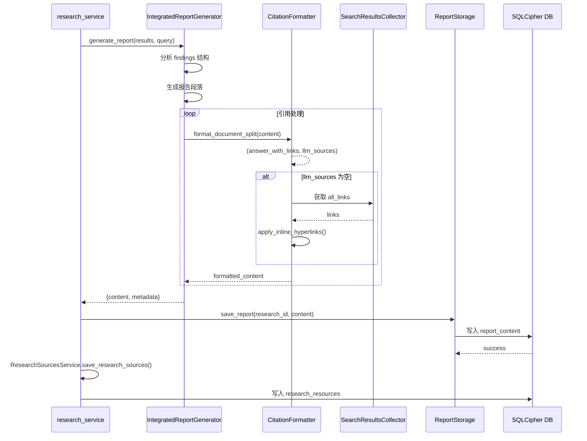

### 3.4.3 流程说明

**步骤逻辑**：

1. **模式分流**：根据研究模式（quick/detailed）选择不同的报告生成路径。quick 模式直接提取合成答案，detailed 模式调用完整的报告生成器。

2. **合成答案提取**：`_extract_synthesized_answer()` 从 findings 中提取 phase 为 "Final synthesis" 的内容，或回退到 `current_knowledge`。

3. **引用格式化**：`CitationFormatter.format_document_split()` 将 LLM 生成的文本分割为答案部分和来源部分。如果 LLM 没有生成来源列表，使用 `apply_inline_hyperlinks()` 基于搜索结果添加结构化超链接。

4. **安全检查**：如果 `format_document_split` 导致内容减少超过 50%，说明可能过度剥离，回退到结构化超链接模式。

5. **报告存储**：通过 `ReportStorage` 抽象层保存报告，支持数据库存储和文件备份两种模式。

6. **来源保存**：`ResearchSourcesService.save_research_sources()` 将搜索来源保存到 `research_resources` 表，用于报告展示。

7. **状态更新**：更新 `ResearchHistory` 的状态为 COMPLETED，记录完成时间和持续时间。

**涉及文件/函数**：
- `report_generator.py`：`IntegratedReportGenerator.generate_report()`
- `text_optimization/citation_formatter.py`：`CitationFormatter`
- `web/services/research_sources_service.py`：`ResearchSourcesService`
- `storage/`：报告存储抽象

**异常处理**：
- 引用格式化失败：保存原始答案
- 来源保存失败：非致命，报告仍然可用
- 存储失败：抛出 RuntimeError 触发研究失败处理

---

## 3.5 文档下载与索引流程

文档下载与索引流程处理网页内容的获取、分块、嵌入和向量存储。

### 3.5.1 流程图

```mermaid
flowchart TD
    A[ContentFetcher.fetch 入口] B[URLClassifier.classify 分类 URL]
    A --> B
    B --> C{URL 类型?}
    C -->|arXiv| D[ArXivDownloader]
    C -->|PubMed| E[PubMedDownloader]
    C -->|PDF| F[DirectPDFDownloader]
    C -->|HTML| G[HTMLDownloader]
    C -->|Generic| H[GenericDownloader]
    D --> I[提取完整内容]
    E --> I
    F --> I
    G --> I
    H --> I
    I --> J[内容清洗与标准化]
    J --> K[TextSplitter 分块]
    K --> L[EmbeddingProvider 生成嵌入]
    L --> M[VectorStore.add_documents]
    M --> N[FAISS 索引更新]
    N --> O[返回文档 ID]
```

### 3.5.2 时序图

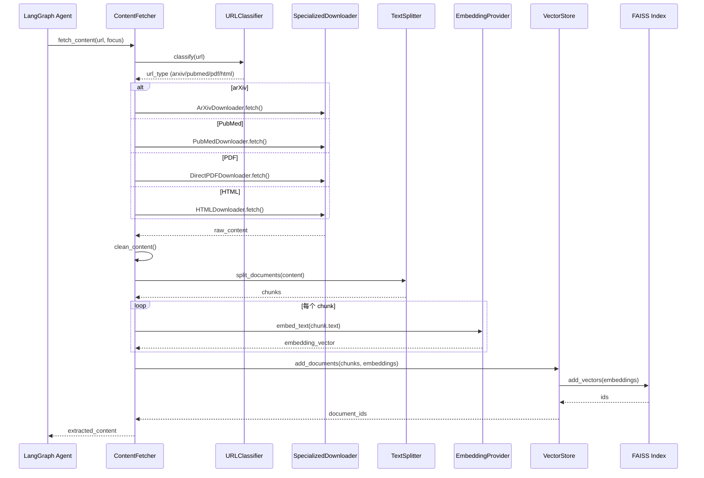

### 3.5.3 流程说明

**步骤逻辑**：

1. **URL 分类**：`URLClassifier.classify()` 分析 URL 确定文档类型（arXiv、PubMed、PDF、HTML 等），选择对应的下载器。

2. **专用下载**：不同类型的文档使用不同的下载器：
   - `ArXivDownloader`：调用 arXiv API 获取论文元数据和全文
   - `PubMedDownloader`：调用 PubMed API 获取医学文献
   - `DirectPDFDownloader`：直接下载 PDF 文件并提取文本
   - `HTMLDownloader`：获取网页内容，使用 BeautifulSoup 提取正文

3. **内容清洗**：对原始内容进行清洗，去除导航、广告、页脚等无关内容。

4. **文本分块**：使用 `TextSplitter` 将长文档分割为适当大小的块（通常 500-1000 token），保持语义完整性。

5. **嵌入生成**：调用配置的 `EmbeddingProvider`（如 OpenAI、Ollama、本地模型）为每个文本块生成向量嵌入。

6. **向量存储**：通过 `VectorStore` 门面将文档和嵌入添加到 FAISS 索引。FAISS 支持多种索引类型（Flat、IVF、HNSW）。

7. **索引持久化**：FAISS 索引定期保存到磁盘，支持服务重启后恢复。

**涉及文件/函数**：
- `content_fetcher/fetcher.py`：`ContentFetcher`
- `content_fetcher/url_classifier.py`：`URLClassifier`
- `research_library/downloaders/`：各种下载器实现
- `embeddings/`：嵌入提供者
- `vector_stores/`：向量存储

**异常处理**：
- 下载失败：返回错误信息，不中断研究流程
- 嵌入失败：记录错误，跳过该文档
- 向量存储失败：回退到仅数据库存储

---

## 3.6 用户认证与会话流程

用户认证流程基于 SQLCipher 加密数据库，密码即为解密密钥。

### 3.6.1 流程图

```mermaid
flowchart TD
    A[用户登录请求 POST /auth/login] B[auth_routes.login]
    A --> B
    B --> C[password_utils.validate_password]
    C --> D{密码强度验证}
    D -->|弱密码| E[返回错误]
    D -->|强密码| F[db_manager.open_user_database]
    F --> G{SQLCipher 解密}
    G -->|失败| H[返回 "Invalid credentials"]
    G -->|成功| I[创建用户会话]
    I --> J[session_password_store 存储密码]
    J --> K[session.username 设置]
    K --> L[返回登录成功]
    L --> M[后续请求]
    M --> N{before_request 中间件}
    N --> O[cleanup_stale_sessions]
    O --> P[ensure_user_database]
    P --> Q[inject_current_user]
    Q --> R[处理请求]
```

### 3.6.2 时序图

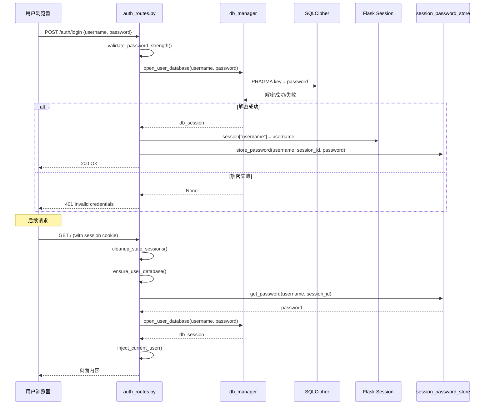

### 3.6.3 流程说明

**步骤逻辑**：

1. **密码验证**：登录时首先验证密码强度（最小长度、复杂度要求），弱密码被拒绝。

2. **数据库解密**：使用用户密码作为 SQLCipher 密钥尝试解密用户专属数据库文件。如果密码错误，解密失败，返回 401。

3. **会话创建**：解密成功后，在 Flask session 中存储用户名，并在 `session_password_store` 中临时存储密码（用于后续请求解密数据库）。

4. **中间件链**：每个请求经过一系列 `before_request` 中间件：
   - `cleanup_stale_sessions`：清理过期会话
   - `ensure_user_database`：确保用户数据库已打开
   - `inject_current_user`：将当前用户注入到 `g` 对象

5. **加密密钥轮换**：系统支持 SQLCipher 加密密钥轮换（rekey），用于升级加密参数。

6. **会话过期**：会话有过期时间，过期后需要重新登录。支持"记住我"功能延长会话有效期。

**涉及文件/函数**：
- `web/auth/routes.py`：登录/登出路由
- `database/encrypted_db.py`：`DatabaseManager`
- `database/session_passwords.py`：`session_password_store`
- `web/auth/session_manager.py`：会话管理

**安全特性**：
- 密码不存储，仅作为解密密钥
- SQLCipher 加密整个数据库文件
- 会话密码存储在服务器内存中，重启后丢失
- 支持账户锁定（多次失败登录后锁定）

---

## 3.7 新闻订阅与推荐流程

新闻订阅系统使用 APScheduler 定时触发新闻研究，生成个性化新闻卡片。

### 3.7.1 流程图

```mermaid
flowchart TD
    A[BackgroundJobScheduler.start] B[APScheduler 初始化]
    A --> B
    B --> C[加载所有订阅]
    C --> D[为每个订阅创建定时任务]
    D --> E[等待触发]
    E --> F{触发条件?}
    F -->|时间到| G[执行订阅研究]
    F -->|手动触发| G
    G --> H[NewsAggregationStrategy]
    H --> I[多引擎新闻搜索]
    I --> J[NewsAnalyzer.analyze]
    J --> K[生成新闻卡片]
    K --> L[CardStorage.save]
    L --> M[NewsRecommender.recommend]
    M --> N[RatingSystem 评分]
    N --> O[PreferenceManager 更新偏好]
    O --> P[advance_refresh_schedule]
    P --> E
```

### 3.7.2 时序图

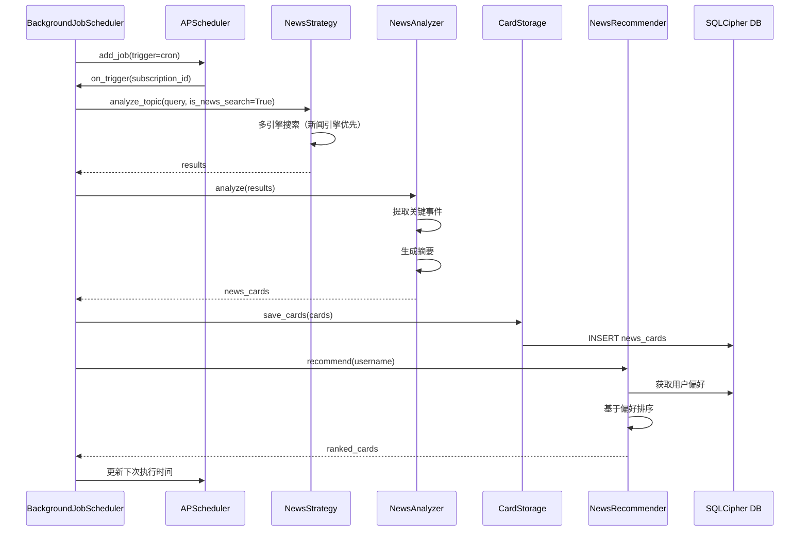

### 3.7.3 流程说明

**步骤逻辑**：

1. **调度器初始化**：`BackgroundJobScheduler` 在应用启动时初始化 APScheduler，加载所有活跃订阅。

2. **定时触发**：根据订阅的刷新频率（每小时、每天等），APScheduler 触发执行。

3. **策略执行**：使用 `NewsAggregationStrategy` 执行新闻搜索，优先使用新闻专用引擎（Wikinews、Guardian 等）。

4. **新闻分析**：`NewsAnalyzer` 对搜索结果进行分析，提取关键事件、生成摘要、识别主题。

5. **卡片存储**：分析结果以卡片形式存储在 `news_cards` 表中，包含标题、摘要、来源、时间戳。

6. **推荐排序**：`NewsRecommender` 基于用户偏好对卡片进行个性化排序。

7. **偏好更新**：`PreferenceManager` 根据用户阅读历史更新偏好模型。

8. **调度更新**：更新下次刷新时间，形成闭环。

**涉及文件/函数**：
- `scheduler/background.py`：`BackgroundJobScheduler`
- `news/core/news_analyzer.py`：`NewsAnalyzer`
- `news/core/card_storage.py`：`CardStorage`
- `news/recommender/`：推荐系统
- `news/rating_system/`：评分系统

**异常处理**：
- 搜索失败：记录错误，下次重试
- 分析失败：使用原始搜索结果
- 调度器故障：健康检查自动重启

---

## 3.8 研究调度流程

研究调度流程管理并发研究的队列和执行。

### 3.8.1 流程图

```mermaid
flowchart TD
    A[队列处理器启动] B[queue_processor.start]
    A --> B
    B --> C[监听队列]
    C --> D{新研究请求?}
    D -->|是| E[检查全局并发限制]
    E --> F{_global_research_semaphore}
    F -->|获取成功| G[分配线程]
    F -->|失败| H[等待或拒绝]
    G --> I[执行研究]
    I --> J[释放信号量]
    J --> C
    H --> C
    D -->|否| K{有待处理操作?}
    K -->|是| L[process_pending_queue_operations]
    L --> C
    K -->|否| C
    C --> M{用户活动通知?}
    M -->|是| N[notify_queue_processor]
    N --> C
```

### 3.8.2 时序图

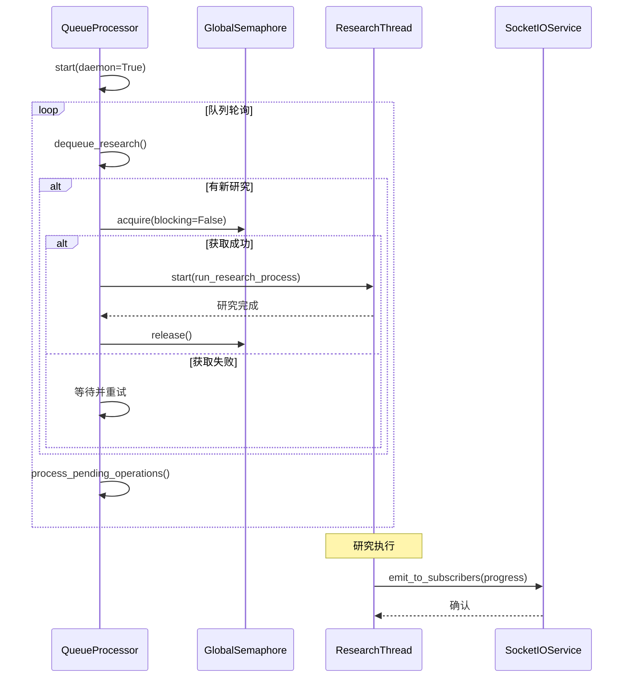

### 3.8.3 流程说明

**步骤逻辑**：

1. **队列处理器启动**：`queue_processor.start()` 启动守护线程，持续监听研究队列。

2. **并发控制**：使用 `_global_research_semaphore`（默认上限 10）控制全局并发研究数量。

3. **队列消费**：从队列中取出待执行的研究请求，尝试获取信号量。

4. **线程分配**：获取信号量后，分配线程执行 `run_research_process`。

5. **完成释放**：研究完成后释放信号量，允许新的研究进入。

6. **待处理操作**：处理用户活动通知、队列操作等。

**涉及文件/函数**：
- `web/queue/processor_v2.py`：`QueueProcessor`
- `web/services/research_service.py`：信号量管理

---

## 3.9 向量检索与 RAG 流程

向量检索流程实现基于语义的文档搜索，是 RAG（检索增强生成）的核心。

### 3.9.1 流程图

```mermaid
flowchart TD
    A[VectorSearch 入口] B[查询文本]
    A --> B
    B --> C[EmbeddingProvider.embed_query]
    C --> D[生成查询向量]
    D --> E[VectorStore.similarity_search]
    E --> F[FAISS search 搜索]
    F --> G[返回 ID 和分数]
    G --> H[从数据库水合结果]
    H --> H1[通过 ID 获取文档内容]
    H1 --> I[排序与过滤]
    I --> J[返回搜索结果]
```

### 3.9.2 时序图

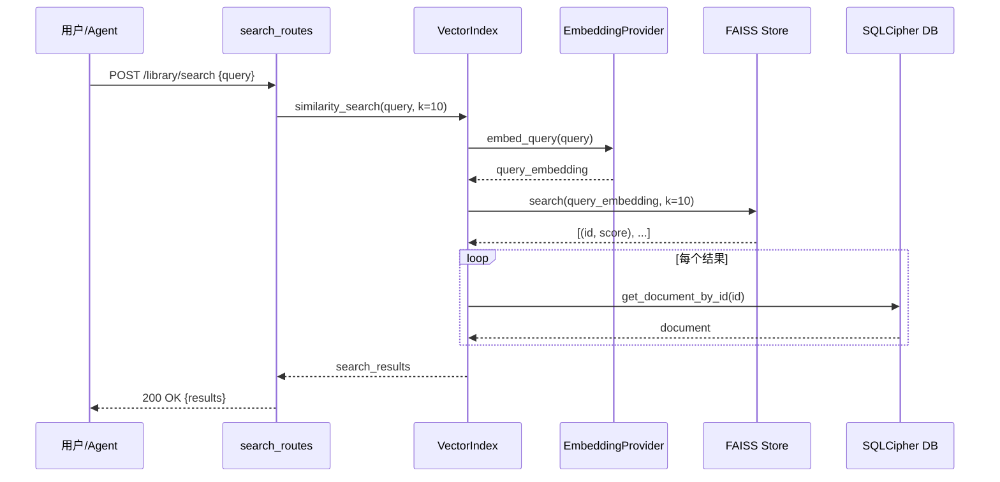

### 3.9.3 流程说明

**步骤逻辑**：

1. **查询嵌入**：使用与文档相同的嵌入模型将查询文本转换为向量。

2. **FAISS 搜索**：调用 FAISS 索引的 `search()` 方法，返回最相似的 k 个结果及其距离分数。

3. **结果水合**：FAISS 只返回 ID 和分数，需要从数据库获取完整的文档内容（标题、文本、元数据）。

4. **后处理**：对结果进行排序、过滤（如分数阈值）、去重。

5. **返回结果**：返回包含文档内容和相似度分数的结构化结果。

**涉及文件/函数**：
- `vector_stores/facade.py`：`VectorStore` 门面
- `vector_stores/implementations/faiss_store.py`：`FAISSStore`
- `embeddings/`：嵌入提供者

---

## 3.10 实时通知流程

实时通知流程基于 Socket.IO 实现服务器到客户端的实时通信。

### 3.10.1 流程图

```mermaid
flowchart TD
    A[SocketIOService 初始化] B[注册事件处理器]
    A --> B
    B --> C[connect 事件]
    C --> D[认证检查]
    D --> E[join_user_room]
    E --> F[subscribe_to_research]
    F --> G[所有权验证]
    G --> H[加入研究房间]
    H --> I[发送快照]
    I --> J[等待事件]
    J --> K{事件类型?}
    K -->|progress| L[emit_to_subscribers]
    K -->|response_chunk| M[流式响应]
    K -->|disconnect| N[清理订阅]
    L --> O[前端更新进度]
    M --> P[前端追加内容]
    N --> Q[移除订阅]
```

### 3.10.2 时序图

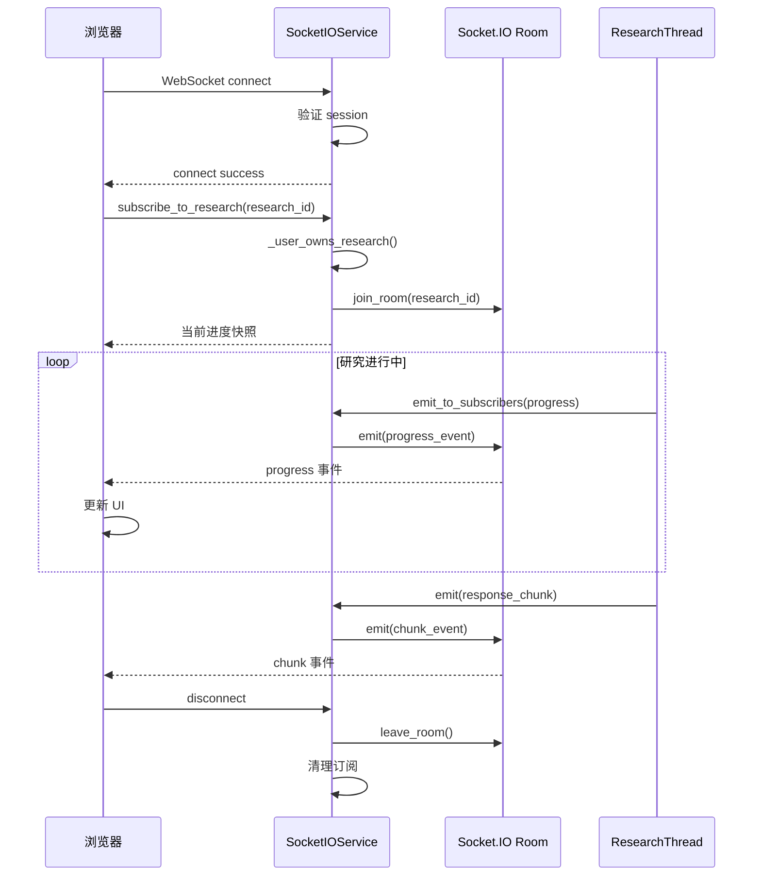

### 3.10.3 流程说明

**步骤逻辑**：

1. **连接建立**：客户端通过 WebSocket 连接服务器，进行会话认证。

2. **用户房间**：连接成功后加入 `user:{username}` 房间，用于接收用户级别事件（如设置变更）。

3. **研究订阅**：客户端发送 `subscribe_to_research` 消息，服务器验证研究所有权后加入研究房间。

4. **快照发送**：订阅成功后立即发送当前进度快照，确保新订阅者看到最新状态。

5. **事件推送**：研究线程通过 `emit_to_subscribers()` 推送进度事件，服务器仅发送给该研究的订阅者（不广播）。

6. **流式响应**：聊天模式下，LLM 生成的文本块通过 `response_chunk` 事件实时推送。

7. **断开清理**：客户端断开时清理订阅，避免内存泄漏。

**涉及文件/函数**：
- `web/services/socket_service.py`：`SocketIOService`
- `web/services/research_service.py`：`emit_to_subscribers()` 调用

**安全特性**：
- WebSocket 来源验证
- 研究所有权验证（防止跨用户订阅）
- 认证拒绝日志

---

☕️ 制作不易，请我喝咖啡☕️关注我➕