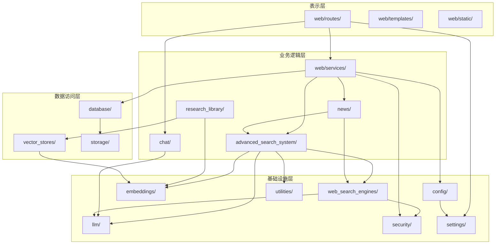

# 第 4 章：模块/包结构与依赖分析

> 本文档详细描述 Local Deep Research 项目的模块组织结构、各核心模块的职责与依赖关系。

---

## 4.1 完整目录结构树

```
src/local_deep_research/
├── __init__.py                    # 包初始化
├── __version__.py                 # 版本号定义
├── search_system.py (501行)       # AdvancedSearchSystem 主类
├── search_system_factory.py (402行)  # 策略工厂
├── report_generator.py (617行)    # 报告生成器
├── citation_handler.py            # 引用处理器
├── constants.py                   # 全局常量
├── exceptions.py                  # 全局异常
│
├── advanced_search_system/        # 高级搜索系统核心
│   ├── strategies/                # 搜索策略
│   │   ├── base_strategy.py       # 策略基类
│   │   ├── source_based_strategy.py  # 默认源策略
│   │   ├── langgraph_agent_strategy.py  # LangGraph Agent 策略
│   │   ├── focused_iteration_strategy.py  # 聚焦迭代策略
│   │   ├── news_strategy.py       # 新闻聚合策略
│   │   ├── topic_organization_strategy.py  # 主题组织策略
│   │   └── followup/              # 后续研究策略
│   │       └── enhanced_contextual_followup.py
│   ├── candidate_exploration/     # 候选探索
│   │   ├── base_explorer.py       # 探索器基类
│   │   ├── adaptive_explorer.py   # 自适应探索器
│   │   ├── parallel_explorer.py   # 并行探索器
│   │   ├── progressive_explorer.py  # 渐进探索器
│   │   ├── diversity_explorer.py  # 多样性探索器
│   │   └── constraint_guided_explorer.py  # 约束引导探索器
│   ├── candidates/                # 候选管理
│   ├── constraints/               # 约束处理
│   │   ├── base_constraint.py
│   │   └── constraint_analyzer.py
│   ├── evidence/                  # 证据评估
│   │   ├── base_evidence.py
│   │   └── evaluator.py           # 证据评估器
│   ├── filters/                   # 过滤器
│   │   ├── base_filter.py         # 过滤器基类
│   │   ├── cross_engine_filter.py # 跨引擎过滤器
│   │   ├── followup_relevance_filter.py
│   │   └── journal_reputation_filter.py  # 期刊声誉过滤器
│   ├── findings/                  # 发现管理
│   │   ├── base_findings.py
│   │   ├── repository.py          # 发现仓库
│   │   └── topic.py
│   ├── knowledge/                 # 知识管理
│   │   └── followup_context_manager.py
│   ├── questions/                 # 问题生成
│   │   ├── base_question.py
│   │   ├── standard_question.py   # 标准问题生成器
│   │   ├── browsecomp_question.py # BrowseComp 问题生成
│   │   ├── flexible_browsecomp_question.py
│   │   ├── atomic_fact_question.py
│   │   ├── decomposition_question.py
│   │   └── news_question.py
│   ├── repositories/              # 仓库模式
│   ├── summarization/             # 摘要生成
│   │   ├── base.py
│   │   └── focused.py
│   ├── tools/                     # Agent 工具
│   │   ├── base_tool.py
│   │   └── fetch/                 # 内容获取工具
│   └── parallel_search.py         # 并行搜索
│
├── web/                           # Web 层
│   ├── app.py                     # 应用入口
│   ├── app_factory.py (1044行)    # 应用工厂
│   ├── api.py                     # API 蓝图
│   ├── server_config.py           # 服务器配置
│   ├── auth/                      # 认证模块
│   │   ├── routes.py              # 认证路由
│   │   ├── decorators.py          # 认证装饰器
│   │   ├── session_manager.py     # 会话管理
│   │   ├── password_utils.py      # 密码工具
│   │   ├── database_middleware.py # 数据库中间件
│   │   ├── cleanup_middleware.py  # 清理中间件
│   │   ├── connection_cleanup.py  # 连接清理
│   │   ├── queue_middleware.py    # 队列中间件
│   │   └── session_cleanup.py     # 会话清理
│   ├── routes/                    # 路由
│   │   ├── research_routes.py     # 研究路由
│   │   ├── history_routes.py      # 历史路由
│   │   ├── settings_routes.py     # 设置路由
│   │   ├── api_routes.py          # API 路由
│   │   ├── metrics_routes.py      # 指标路由
│   │   ├── news_routes.py         # 新闻路由
│   │   ├── notes_routes.py        # 笔记路由
│   │   ├── context_overflow_api.py
│   │   ├── unified_search_routes.py
│   │   ├── globals.py             # 全局状态
│   │   ├── route_registry.py      # 路由注册
│   │   └── _search_constants.py
│   ├── services/                  # 服务层
│   │   ├── research_service.py (3091行)  # 研究服务（核心）
│   │   ├── socket_service.py (555行)     # Socket.IO 服务
│   │   ├── settings_service.py    # 设置服务
│   │   ├── research_sources_service.py  # 研究来源服务
│   │   ├── report_assembly_service.py   # 报告组装服务
│   │   ├── pdf_service.py        # PDF 服务
│   │   ├── pdf_extraction_service.py
│   │   └── resource_service.py    # 资源服务
│   ├── models/                    # 数据模型
│   │   └── database.py            # 数据库模型
│   ├── queue/                     # 队列处理
│   │   └── processor_v2.py        # 队列处理器 v2
│   ├── static/                    # 静态文件
│   │   ├── css/ (29文件/23K行)
│   │   ├── js/ (70文件/48K行)
│   │   └── dist/                  # Vite 构建输出
│   ├── templates/                 # Jinja2 模板
│   ├── themes/                    # 主题
│   ├── utils/                     # 工具函数
│   └── warning_checks/            # 警告检查
│
├── web_search_engines/            # 搜索引擎模块
│   ├── search_engine_base.py      # 搜索引擎基类
│   ├── engine_registry.py         # 引擎注册表
│   ├── engine_groups.py           # 引擎分组
│   ├── search_engine_factory.py   # 引擎工厂
│   ├── search_engines_config.py   # 引擎配置
│   ├── retriever_registry.py      # 检索器注册表
│   ├── relevance_filter.py        # 相关性过滤
│   ├── engines/                   # 30+ 引擎实现
│   │   ├── search_engine_arxiv.py
│   │   ├── search_engine_pubmed.py
│   │   ├── search_engine_wikipedia.py
│   │   ├── search_engine_brave.py
│   │   ├── search_engine_ddg.py
│   │   ├── search_engine_google_pse.py
│   │   ├── search_engine_searxng.py
│   │   ├── search_engine_tavily.py
│   │   ├── search_engine_semantic_scholar.py
│   │   └── ... (共30+文件)
│   └── rate_limiting/             # 速率限制
│
├── llm/                           # LLM 模块
│   ├── providers/                 # LLM 提供商
│   │   ├── base.py                # 提供商基类
│   │   ├── auto_discovery.py      # 自动发现
│   │   ├── openai_base.py         # OpenAI 兼容基类
│   │   ├── implementations/       # 14 个实现
│   │   │   ├── openai.py
│   │   │   ├── anthropic.py
│   │   │   ├── google.py
│   │   │   ├── ollama.py
│   │   │   ├── deepseek.py
│   │   │   ├── openrouter.py
│   │   │   ├── lmstudio.py
│   │   │   ├── llamacpp.py
│   │   │   └── ... (共14个)
│   │   └── _helpers.py
│
├── embeddings/                    # 嵌入模块
│   ├── embeddings_config.py       # 嵌入配置
│   ├── providers/                 # 嵌入提供者
│   │   ├── base.py
│   │   └── implementations/       # 3 个实现
│   └── splitters/                 # 文本分割器
│       └── text_splitter_registry.py
│
├── vector_stores/                 # 向量存储
│   ├── base.py                    # 存储基类
│   ├── facade.py                  # 门面模式
│   ├── config.py                  # 配置
│   ├── implementations/           # 实现
│   │   └── faiss_store.py         # FAISS 实现
│   ├── legacy_cleanup.py          # 旧版清理
│   └── legacy_rekey.py            # 密钥轮换
│
├── database/                      # 数据库模块
│   ├── encrypted_db.py            # SQLCipher 加密数据库
│   ├── session_context.py         # 会话上下文
│   ├── session_passwords.py       # 会话密码存储
│   ├── thread_local_session.py    # 线程本地会话
│   ├── base.py                    # 基类
│   ├── alembic_runner.py          # 迁移运行器
│   ├── sqlcipher_utils.py         # SQLCipher 工具
│   ├── pool_config.py             # 连接池配置
│   ├── queue_service.py           # 队列服务
│   ├── backup/                    # 备份
│   ├── migrations/                # 迁移
│   └── models/                    # 24 个模型文件
│       ├── base.py
│       ├── research.py
│       ├── auth.py
│       ├── library.py
│       ├── news.py
│       ├── reports.py
│       ├── settings.py
│       └── ...
│
├── security/                      # 安全模块
│   ├── security_headers.py        # 安全头
│   ├── rate_limiter.py            # 速率限制器
│   ├── ssrf_validator.py          # SSRF 验证
│   ├── file_upload_validator.py   # 文件上传验证
│   ├── file_integrity/            # 文件完整性
│   ├── egress/                    # 出口策略
│   │   ├── policy.py              # 策略定义
│   │   ├── audit_hook.py          # 审计钩子
│   │   ├── classification.py      # 分类
│   │   └── run_classification.py  # 运行分类
│   ├── path_validator.py          # 路径验证
│   ├── url_validator.py           # URL 验证
│   ├── log_sanitizer.py           # 日志清理
│   ├── data_sanitizer.py          # 数据清理
│   ├── module_whitelist.py        # 模块白名单
│   ├── web_middleware.py          # Web 中间件
│   └── ...
│
├── config/                        # 配置模块
│   ├── llm_config.py              # LLM 配置
│   ├── search_config.py           # 搜索配置
│   ├── paths.py                   # 路径配置
│   ├── thread_settings.py         # 线程设置
│   ├── constants.py               # 常量
│   └── default_settings/          # 默认设置
│
├── settings/                      # 设置管理
│   ├── manager.py                 # 设置管理器
│   ├── base.py                    # 基类
│   ├── env_registry.py            # 环境注册表
│   ├── env_settings.py            # 环境设置
│   ├── logger.py                  # 设置日志
│   └── env_definitions/           # 环境定义
│
├── news/                          # 新闻模块
│   ├── core/                      # 核心
│   │   ├── news_analyzer.py       # 新闻分析器
│   │   ├── card_factory.py        # 卡片工厂
│   │   ├── card_storage.py        # 卡片存储
│   │   ├── base_card.py           # 卡片基类
│   │   ├── search_integration.py  # 搜索集成
│   │   └── relevance_service.py   # 相关性服务
│   ├── recommender/               # 推荐
│   │   ├── base_recommender.py
│   │   └── topic_based.py
│   ├── rating_system/             # 评分
│   │   ├── base_rater.py
│   │   └── storage.py
│   ├── preference_manager/        # 偏好管理
│   │   ├── base_preference.py
│   │   └── storage.py
│   ├── utils/                     # 工具
│   ├── web.py                     # Web 蓝图
│   ├── api.py                     # API
│   ├── flask_api.py               # Flask API
│   ├── subscription_runner.py     # 订阅运行器
│   └── exceptions.py              # 异常
│
├── research_library/              # 研究库模块
│   ├── services/                  # 服务
│   ├── downloaders/               # 下载器
│   │   ├── arxiv.py
│   │   ├── pubmed.py
│   │   ├── biorxiv.py
│   │   ├── direct_pdf.py
│   │   ├── html.py
│   │   ├── semantic_scholar.py
│   │   └── ...
│   ├── routes/                    # 路由
│   ├── search/                    # 搜索
│   ├── notes/                     # 笔记
│   ├── deletion/                  # 删除管理
│   ├── zotero/                    # Zotero 集成
│   └── utils/                     # 工具
│
├── content_fetcher/               # 内容获取
│   ├── fetcher.py                 # 获取器
│   └── url_classifier.py          # URL 分类器
│
├── scheduler/                     # 调度器
│   └── background.py              # 后台任务调度器
│
├── mcp/                           # MCP 服务器
│   ├── server.py
│   └── __main__.py
│
├── benchmarks/                    # 基准测试
│   ├── runners.py                 # 运行器
│   ├── evaluators/                # 评估器
│   ├── datasets/                  # 数据集
│   ├── metrics/                   # 指标
│   ├── comparison/                # 比较
│   ├── efficiency/                # 效率
│   ├── models/                    # 模型
│   ├── optimization/              # 优化
│   ├── cli/                       # CLI
│   └── web_api/                   # Web API
│
├── text_optimization/             # 文本优化
│   └── citation_formatter.py      # 引用格式化器
│
├── citation_handlers/             # 引用处理器
│   ├── base_citation_handler.py   # 基类
│   ├── standard_citation_handler.py  # 标准处理器
│   ├── precision_extraction_handler.py  # 精确提取
│   └── forced_answer_citation_handler.py
│
├── utilities/                     # 工具函数
│   ├── search_utilities.py        # 搜索工具
│   ├── citation_normalizer.py     # 引用规范化
│   ├── log_utils.py               # 日志工具
│   ├── thread_context.py          # 线程上下文
│   ├── threading_utils.py         # 线程工具
│   ├── url_utils.py               # URL 工具
│   ├── resource_utils.py          # 资源工具
│   └── ...
│
├── chat/                          # 聊天模块
├── followup_research/             # 后续研究
├── journal_quality/               # 期刊质量
├── document_loaders/              # 文档加载器
├── domain_classifier/             # 域名分类器
├── error_handling/                # 错误处理
├── exporters/                     # 导出器
├── metrics/                       # 指标
├── notifications/                 # 通知
├── storage/                       # 存储
├── text_processing/               # 文本处理
└── research_scheduler/            # 研究调度器
```

---

## 4.2 核心模块职责详解

### 4.2.1 advanced_search_system/strategies/

| 属性 | 值 |
|------|-----|
| **目录路径** | `src/local_deep_research/advanced_search_system/strategies/` |
| **职责** | 定义所有搜索策略，实现不同的研究算法 |
| **主要类** | `BaseSearchStrategy`, `SourceBasedSearchStrategy`, `LangGraphAgentStrategy`, `FocusedIterationStrategy`, `NewsAggregationStrategy`, `TopicOrganizationStrategy`, `EnhancedContextualFollowUpStrategy` |
| **输入** | 查询字符串、LLM 实例、搜索引擎实例、设置快照 |
| **输出** | 研究结果字典（findings, current_knowledge, formatted_findings, iterations） |
| **依赖** | `advanced_search_system/tools/`, `advanced_search_system/filters/`, `web_search_engines/`, `llm/` |

### 4.2.2 web/services/

| 属性 | 值 |
|------|-----|
| **目录路径** | `src/local_deep_research/web/services/` |
| **职责** | 实现 Web 层业务逻辑，协调研究流程 |
| **主要类/函数** | `start_research_process()` (344行), `run_research_process()` (824行起), `SocketIOService` (62行), `progress_callback()` (1084行起) |
| **输入** | HTTP 请求参数、研究 ID、查询、模式 |
| **输出** | 研究状态、报告内容、Socket.IO 事件 |
| **依赖** | `web/routes/`, `database/models/`, `search_system.py`, `report_generator.py`, `security/` |

### 4.2.3 web_search_engines/

| 属性 | 值 |
|------|-----|
| **目录路径** | `src/local_deep_research/web_search_engines/` |
| **职责** | 实现 30+ 搜索引擎的适配器 |
| **主要类** | `BaseSearchEngine` (89行), `ArXivSearchEngine`, `PubMedSearchEngine`, `WikipediaSearchEngine`, `BraveSearchEngine`, `DuckDuckGoSearchEngine`, `GooglePSESearchEngine`, `SearXNGSearchEngine`, `TavilySearchEngine`, `SemanticScholarSearchEngine`, `ExaSearchEngine`, `SerpAPISearchEngine`, `SerperSearchEngine`, `MojeekSearchEngine`, `TinyFishSearchEngine`, `WaybackSearchEngine`, `WikinewsSearchEngine`, `ElasticsearchSearchEngine`, `PaperlessSearchEngine`, `ScaleSerpSearchEngine`, `SofyaSearchEngine`, `NasaAdsSearchEngine`, `OpenAlexSearchEngine`, `GutenbergSearchEngine`, `OpenLibrarySearchEngine`, `PubChemSearchEngine`, `StackExchangeSearchEngine`, `ZenodoSearchEngine`, `GuardianSearchEngine`, `GitHubSearchEngine`, `FullSearchResults`, `RetrieverSearchEngine` |
| **输入** | 查询字符串、研究上下文 |
| **输出** | 搜索结果列表（包含 title, link, snippet, content 等） |
| **依赖** | `security/egress/`, `advanced_search_system/filters/`, `metrics/` |

### 4.2.4 llm/

| 属性 | 值 |
|------|-----|
| **目录路径** | `src/local_deep_research/llm/` |
| **职责** | 提供统一的 LLM 接口，支持 14+ 提供商 |
| **主要类** | `BaseLLMProvider`, `OpenAIProvider`, `AnthropicProvider`, `GoogleProvider`, `OllamaProvider`, `DeepSeekProvider`, `OpenRouterProvider`, `LMStudioProvider`, `LlamaCppProvider`, `CustomOpenAIEndpointProvider`, `CustomAnthropicEndpointProvider`, `IonosProvider`, `OrcaRouterProvider`, `RequestyProvider`, `XAIProvider` |
| **输入** | 提示词、系统消息、工具定义 |
| **输出** | LLM 响应（文本、工具调用） |
| **依赖** | `config/llm_config.py`, `security/` |

### 4.2.5 embeddings/

| 属性 | 值 |
|------|-----|
| **目录路径** | `src/local_deep_research/embeddings/` |
| **职责** | 提供文本嵌入服务，支持多种嵌入模型 |
| **主要类** | `BaseEmbeddingProvider`, `OpenAIEmbeddingProvider`, `OllamaEmbeddingProvider`, `LocalEmbeddingProvider` |
| **输入** | 文本字符串或文本列表 |
| **输出** | 嵌入向量（浮点数列表） |
| **依赖** | `config/`, `llm/` |

### 4.2.6 vector_stores/

| 属性 | 值 |
|------|-----|
| **目录路径** | `src/local_deep_research/vector_stores/` |
| **职责** | 提供向量存储和相似度搜索功能 |
| **主要类** | `VectorStore` (门面), `FAISSStore` (实现) |
| **输入** | 文档 ID、嵌入向量、元数据 |
| **输出** | 搜索结果（ID、分数、文档内容） |
| **依赖** | `embeddings/`, `database/` |

### 4.2.7 database/

| 属性 | 值 |
|------|-----|
| **目录路径** | `src/local_deep_research/database/` |
| **职责** | 管理 SQLAlchemy 模型和 SQLCipher 加密数据库 |
| **主要类** | `DatabaseManager`, `ResearchHistory`, `ResearchStrategy`, `Library`, `News`, `Note`, `Reports`, `Settings`, `UserBase`, `BenchmarkRun`, `Chat`, `Citation`, `DownloadTracker`, `FileIntegrity`, `Journal`, `Logs`, `Metrics`, `Providers`, `Queue`, `QueuedResearch`, `RateLimiting`, `Zotero` 等 24 个模型 |
| **输入** | ORM 操作、会话上下文 |
| **输出** | 数据库记录 |
| **依赖** | `security/`, `config/` |

### 4.2.8 security/

| 属性 | 值 |
|------|-----|
| **目录路径** | `src/local_deep_research/security/` |
| **职责** | 实现所有安全机制（SSRF 防护、出口策略、速率限制、数据脱敏） |
| **主要类** | `SecurityHeaders`, `RateLimiter`, `SSRFValidator`, `FileUploadValidator`, `PathValidator`, `URLValidator`, `LogSanitizer`, `DataSanitizer`, `ModuleWhitelist`, `SecureCookieMiddleware`, `ServerHeaderMiddleware`, `EgressPolicy`, `EgressContext`, `PolicyDecision` |
| **输入** | HTTP 请求、URL、文件、日志消息 |
| **输出** | 验证结果、策略决策、清理后的数据 |
| **依赖** | `settings/`, `config/` |

### 4.2.9 config/

| 属性 | 值 |
|------|-----|
| **目录路径** | `src/local_deep_research/config/` |
| **职责** | 管理系统配置（LLM、搜索、路径） |
| **主要函数** | `get_llm()`, `get_search()`, `get_setting_from_snapshot()`, `get_research_outputs_directory()`, `get_data_directory()` |
| **输入** | 设置快照、键名 |
| **输出** | 配置值、LLM 实例、搜索引擎实例 |
| **依赖** | `settings/`, `llm/`, `web_search_engines/` |

### 4.2.10 settings/

| 属性 | 值 |
|------|-----|
| **目录路径** | `src/local_deep_research/settings/` |
| **职责** | 管理用户设置和环境变量 |
| **主要类** | `SettingsManager`, `EnvRegistry`, `SnapshotSettingsContext` |
| **输入** | 设置键、用户名、环境变量 |
| **输出** | 设置值 |
| **依赖** | `database/` |

### 4.2.11 news/

| 属性 | 值 |
|------|-----|
| **目录路径** | `src/local_deep_research/news/` |
| **职责** | 实现新闻订阅、分析、推荐功能 |
| **主要类** | `NewsAnalyzer`, `CardFactory`, `CardStorage`, `NewsRecommender`, `RatingSystem`, `PreferenceManager`, `SubscriptionRunner` |
| **输入** | 搜索查询、订阅配置、用户偏好 |
| **输出** | 新闻卡片、推荐结果 |
| **依赖** | `advanced_search_system/`, `web_search_engines/`, `scheduler/` |

### 4.2.12 research_library/

| 属性 | 值 |
|------|-----|
| **目录路径** | `src/local_deep_research/research_library/` |
| **职责** | 管理研究文档库（下载、索引、搜索、导出） |
| **主要类** | `ArXivDownloader`, `PubMedDownloader`, `DirectPDFDownloader`, `HTMLDownloader`, `SemanticScholarDownloader`, `BioRxivDownloader`, `OpenAlexDownloader`, `GenericDownloader`, `PlaywrightHTMLDownloader` |
| **输入** | URL、文档 ID |
| **输出** | 文档内容、元数据 |
| **依赖** | `content_fetcher/`, `vector_stores/`, `embeddings/` |

### 4.2.13 content_fetcher/

| 属性 | 值 |
|------|-----|
| **目录路径** | `src/local_deep_research/content_fetcher/` |
| **职责** | 获取和分类网页内容 |
| **主要类** | `ContentFetcher`, `URLClassifier` |
| **输入** | URL、查询焦点 |
| **输出** | 提取的文本内容 |
| **依赖** | `research_library/downloaders/`, `security/` |

### 4.2.14 scheduler/

| 属性 | 值 |
|------|-----|
| **目录路径** | `src/local_deep_research/scheduler/` |
| **职责** | 管理后台定时任务（新闻订阅、清理等） |
| **主要类** | `BackgroundJobScheduler` |
| **输入** | 调度配置、触发条件 |
| **输出** | 定时执行结果 |
| **依赖** | `news/`, `web/` |

### 4.2.15 mcp/

| 属性 | 值 |
|------|-----|
| **目录路径** | `src/local_deep_research/mcp/` |
| **职责** | 实现 MCP（Model Context Protocol）服务器 |
| **主要类** | `MCPServer` |
| **输入** | MCP 请求 |
| **输出** | MCP 响应 |
| **依赖** | `web_search_engines/`, `llm/` |

### 4.2.16 benchmarks/

| 属性 | 值 |
|------|-----|
| **目录路径** | `src/local_deep_research/benchmarks/` |
| **职责** | 实现基准测试框架 |
| **主要类** | `BenchmarkRunner`, `Evaluator`, `Dataset`, `Metric` |
| **输入** | 测试配置、数据集 |
| **输出** | 评估结果、指标 |
| **依赖** | `advanced_search_system/`, `web_search_engines/`, `llm/` |

### 4.2.17 utilities/

| 属性 | 值 |
|------|-----|
| **目录路径** | `src/local_deep_research/utilities/` |
| **职责** | 提供通用工具函数 |
| **主要函数** | `extract_links_from_search_results()`, `safe_close()`, `set_search_context()`, `thread_context()`, `unwrap_setting()`, `sanitize_error_for_client()` |
| **输入** | 各种数据类型 |
| **输出** | 处理后的数据 |
| **依赖** | 无重大依赖 |

### 4.2.18 text_optimization/

| 属性 | 值 |
|------|-----|
| **目录路径** | `src/local_deep_research/text_optimization/` |
| **职责** | 文本优化和引用格式化 |
| **主要类** | `CitationFormatter`, `CitationMode` 枚举 |
| **输入** | Markdown 文本、来源链接列表 |
| **输出** | 格式化后的文本（带超链接） |
| **依赖** | 无 |

---

## 4.3 模块间依赖关系图



---

## 4.4 分层架构分析

### 4.4.1 表示层（Presentation Layer）

**职责**：处理用户交互和界面渲染

| 组件 | 路径 | 职责 |
|------|------|------|
| Flask 路由 | `web/routes/` | 处理 HTTP 请求，调用服务层 |
| Jinja2 模板 | `web/templates/` | 渲染 HTML 页面 |
| 静态文件 | `web/static/` | CSS、JS、图片等前端资源 |
| Socket.IO | `web/services/socket_service.py` | 实时 WebSocket 通信 |

**关键特性**：
- 原生 JavaScript（70 文件/48K 行）
- CSS 样式（29 文件/23K 行）
- 15+ Blueprint 组织路由
- CSRF 保护

### 4.4.2 业务逻辑层（Business Logic Layer）

**职责**：实现核心业务逻辑和流程编排

| 组件 | 路径 | 职责 |
|------|------|------|
| 研究服务 | `web/services/research_service.py` | 研究流程编排 |
| 搜索系统 | `advanced_search_system/` | 搜索策略和算法 |
| 新闻系统 | `news/` | 新闻订阅和推荐 |
| 研究库 | `research_library/` | 文档管理 |
| 聊天系统 | `chat/` | 对话交互 |

**关键特性**：
- 策略模式（Strategy Pattern）
- 工厂模式（Factory Pattern）
- 观察者模式（Observer Pattern - Socket.IO）
- 门面模式（Facade Pattern - VectorStore）

### 4.4.3 数据访问层（Data Access Layer）

**职责**：管理数据持久化和检索

| 组件 | 路径 | 职责 |
|------|------|------|
| ORM 模型 | `database/models/` | 数据模型定义 |
| 加密数据库 | `database/encrypted_db.py` | SQLCipher 加密 |
| 向量存储 | `vector_stores/` | FAISS 向量索引 |
| 存储抽象 | `storage/` | 报告存储 |

**关键特性**：
- SQLAlchemy ORM
- SQLCipher 加密（AES-256）
- 24 个模型文件，50+ 数据库表
- 连接池管理
- 自动迁移（Alembic）

### 4.4.4 基础设施层（Infrastructure Layer）

**职责**：提供基础服务和横切关注点

| 组件 | 路径 | 职责 |
|------|------|------|
| 搜索引擎 | `web_search_engines/` | 30+ 搜索引擎适配 |
| LLM 提供商 | `llm/` | 14+ LLM 提供商 |
| 嵌入服务 | `embeddings/` | 文本嵌入 |
| 安全模块 | `security/` | 安全防护 |
| 配置管理 | `config/`, `settings/` | 系统配置 |
| 工具函数 | `utilities/` | 通用工具 |

**关键特性**：
- 适配器模式（搜索引擎、LLM）
- 注册表模式（引擎注册表、LLM 注册表）
- 中间件管道
- 速率限制
- 出口策略（Egress Policy）

---

## 4.5 设计模式总结

| 模式 | 应用位置 | 说明 |
|------|----------|------|
| 策略模式 | `advanced_search_system/strategies/` | 不同搜索策略可互换 |
| 工厂模式 | `search_system_factory.py`, `search_engine_factory.py` | 统一创建策略和引擎 |
| 门面模式 | `vector_stores/facade.py` | 简化向量存储接口 |
| 适配器模式 | `web_search_engines/engines/` | 统一搜索引擎接口 |
| 注册表模式 | `engine_registry.py`, `llm/providers/` | 动态注册和发现 |
| 观察者模式 | `socket_service.py` | 实时事件推送 |
| 模板方法 | `BaseSearchEngine.run()` | 定义搜索算法骨架 |
| 装饰器模式 | `web/auth/decorators.py` | 认证和权限控制 |
| 中间件模式 | `app_factory.py` | 请求处理管道 |
| 快照模式 | `SnapshotSettingsContext` | 线程安全配置 |

---

## 4.6 包依赖统计

| 包名 | 文件数 | 主要依赖 | 被依赖 |
|------|--------|----------|--------|
| `web/` | 50+ | 所有业务层 | 表示层入口 |
| `advanced_search_system/` | 40+ | `web_search_engines/`, `llm/` | `web/services/` |
| `web_search_engines/` | 40+ | `security/`, `llm/` | `advanced_search_system/` |
| `llm/` | 20+ | `config/` | 几乎所有模块 |
| `database/` | 30+ | `security/` | 所有持久化模块 |
| `security/` | 25+ | `settings/` | 横切所有层 |
| `news/` | 20+ | `advanced_search_system/` | `web/routes/` |
| `research_library/` | 30+ | `vector_stores/`, `content_fetcher/` | `web/routes/` |

---

☕️ 制作不易，请我喝咖啡☕️关注我➕