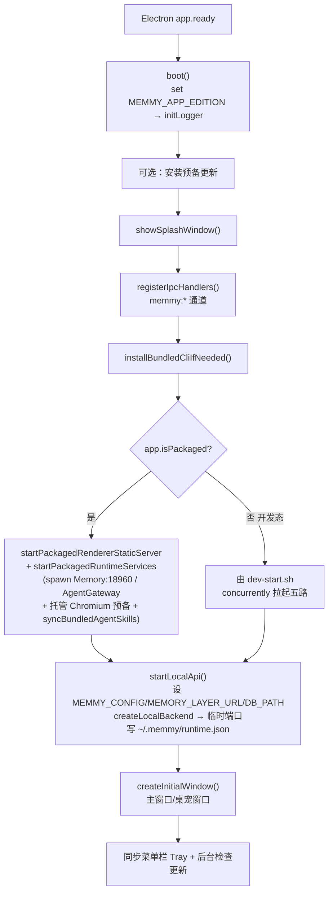
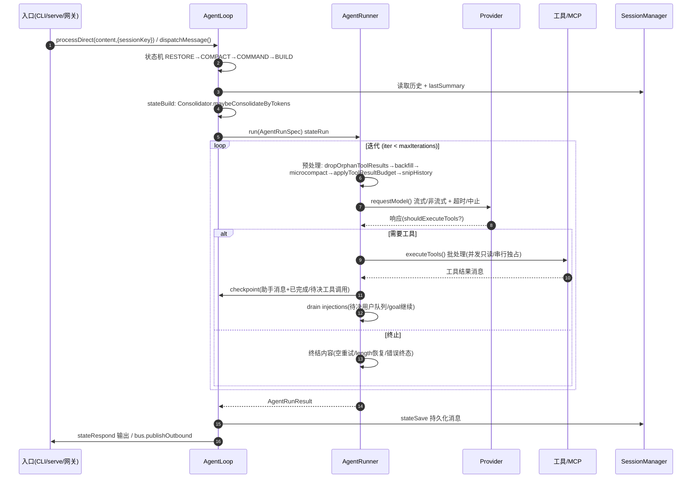
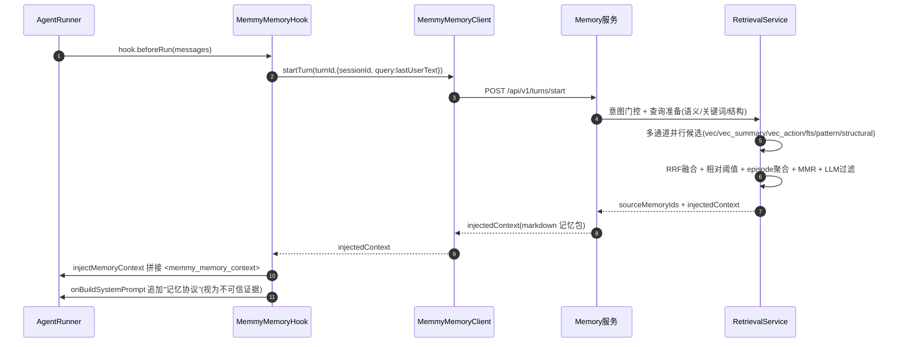
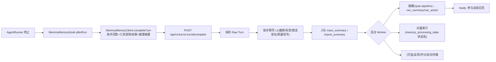
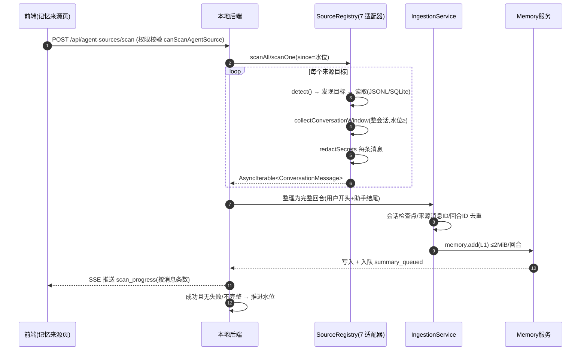
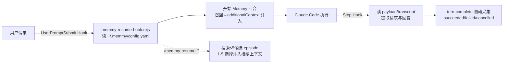
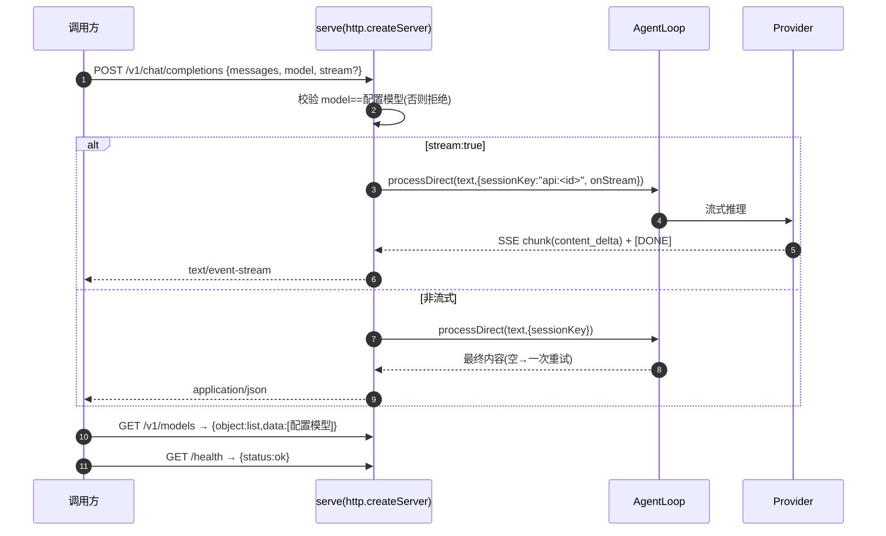
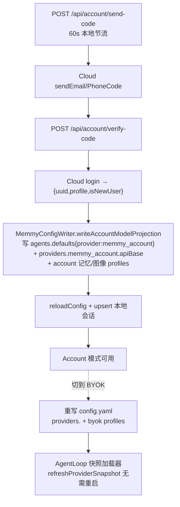
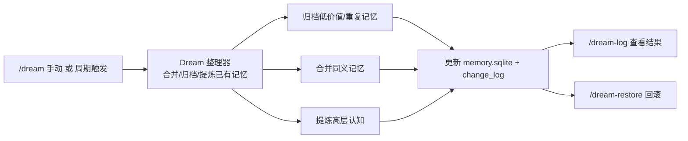

# 03 · 系统流程与时序图

本章用流程图与时序图刻画 10 个核心业务流程，细化到模块/函数/服务级别，并说明涉及的文件、异常处理与设计要点。所有图为 Mermaid。

## 3.1 F1 · 桌面全栈启动流程



**说明：** 主进程 `boot()`（`App/shell/desktop/src/main/main.ts`）是唯一启动入口。打包态与开发态的差异在于运行时服务的拉起方式：打包态由 `runtime-services.ts` 的 `startPackagedRuntimeServices` 直接 spawn Memory 服务与 Agent 网关监督者（`AgentGatewaySupervisor`），并预备托管 Chromium、同步内置 Skills；开发态由 `scripts/dev-start.sh` 用 `concurrently` 启动 memory / agent-api / gateway / frontend / backend。两条路径都会调用 `createLocalBackend`，它把后端绑在 `127.0.0.1:0` 临时端口，并把 `{baseUrl, localToken}` 写入 `runtime.json` 供前端/CLI 读取。`STARTUP_TIMEOUT_MS = 30_000` 约束运行时启动；超时或失败会走错误展示而非静默。窗口分主窗口、桌宠窗口与 macOS Tray 三种模式（`window-mode.ts`）。

## 3.2 F2 · Agent 一轮推理（AgentRunner 迭代循环）



**说明：** 这是整个系统最核心的循环。`AgentLoop` 的回合状态机（`core/agent-runtime/loop.ts`）顺序为 `RESTORE → COMPACT → COMMAND → BUILD → RUN → SAVE → RESPOND → DONE`。`stateBuild` 会触发 `Consolidator.maybeConsolidateByTokens`（回合级压缩，超窗时把旧消息摘要进 `session.metadata.lastSummary`）。真正的迭代在 `AgentRunner.run`（`runner.ts`）：每次先做消息预处理——丢弃孤立工具结果、回填缺失工具结果、microcompact（裁剪超 10 条的旧 `read_file/exec/grep/web_*` 结果）、按工具分配字符预算、按 token 窗口 snip 历史——再调 `requestModel`。模型若要求工具，则 `executeTools` 批处理（`concurrencySafe`/只读工具并发、独占工具串行），写检查点，排空注入队列（待决用户消息、goal 继续），继续迭代；否则终结。关键容错：空回复有一次 `requestFinalizationRetry`，`length` 结束有长度恢复消息，LLM 有墙钟超时（`MEMMY_AGENT_LLM_TIMEOUT_S` 默认 300s）。两条入口路径（同步 `processDirect` 与事件驱动 `dispatchMessage`）复用同一个 `processMessageInternal`。

## 3.3 F3 · 记忆召回与注入（MemmyMemoryHook.beforeRun）



**说明：** 记忆召回发生在每轮推理前，由 `MemmyMemoryHook.beforeRun`（`App/memmy-agent/src/memmy-memory/hook.ts`）触发。它取最后一条用户文本作为查询，调用 `startTurn`。Memory 服务在新 episode 第一轮做**意图门控**（任务/无法确定→召回 Skill/L2/L1/L3；询问"是否记得"→不召回 L3；闲聊/元命令→跳过召回），并把查询整理为语义查询 + 关键词 + 短词模式 + 结构化错误片段。六个召回通道并行返回候选，按记忆层、通道排名、质量与时间衰减融合（详见第 12 章算法），再经相对阈值、去重、MMR、可选 LLM 过滤。命中项渲染为分层 Markdown 注入；注入内容用 `<memmy_memory_context>` 标记，并以 `<current_user_request>` 标明当前请求，系统提示追加"记忆协议"要求模型把它当作**不可信的历史证据**核对后使用。`turn_start` 会排除当前 session 自己的 L1 防止回声。失败采用 **fail-open**：记录错误继续，不中断对话。

## 3.4 F4 · 回合采集与写入（MemmyMemoryHook.afterRun / turn.complete）



**说明：** 回合结束由 `afterRun` 触发 `completeTurn`。Memory 服务先存 Raw Turn，再按捕获步骤写 L1：默认保留最多 4000 字符的用户/Agent 文本、每工具输出最多 2000 字符、最多 8 个派生标签，并记录工具名/输入/结果/错误签名/回合状态/来源 Agent，以及 `value`/`alpha`/`priority` 等质量信号与启发式摘要。随后入队 `trace_summary`（或导入时的 `import_summary`）。后台 Worker（`WorkerRunner.runWorkerOnce`）并发执行：`EmbeddingJobProcessor` 用 LLM 改写摘要（`summarizeTraceForCapture`，主 `llm` 失败回退 `skillLlm`）并生成 `vec_summary`/`vec_action`，向量索引走 `memory_processing_state` 状态机（`summary_pending→summarizing→embedding_pending→embedding→ready`），失败进 `embedding_retry_queue` 退避重试。导入的 L1 必须完成摘要+向量索引（`summary_queued`）才参与召回，避免半成品被注入。索引失败不阻塞当前回合。

## 3.5 F5 · 记忆演化（L1 → L2 → L3 → Skill）

```mermaid
flowchart TD
  L1["L1 Trace(已就绪+有价值)"] -->|reward 反向传播| EP["Episode 关闭<br/>反思合成/评分<br/>等待 30s 反馈窗口"]
  EP -->|value≥阈值 & 有向量| Pool["L2 候选池"]
  Pool -->|归纳(induceL2)| L2["L2 Policy<br/>触发条件/步骤/边界/验证/避坑"]
  L2 -->|聚类抽象(abstractL3)| L3["L3 World Model<br/>项目/环境/约束的稳定认知"]
  L2 -->|结晶验证(crystallizeSkill + skill_trial)| SK["Skill<br/>可调用 SOP"]
  EP -->|工具连续失败/反馈| DR["避坑经验 / decision repair"]
```

**说明：** 演化是 Memory 引擎的"长期记忆生成器"。连续 follow-up（最大间隔 2 小时）合并到同一 episode；episode 因主题切换/会话关闭/空闲 2 小时而关闭后，先合成并评分反思（`capture.synthReflection` 默认开），默认等待 30 秒反馈窗口（`reward.feedbackWindowSec`）再计算任务奖励，按轨迹位置衰减（`gamma=0.9`/`lambda=0.5`/`delta=0.1`）向 episode 内 L1 反向传播。达到价值门槛（`l2Induction.minTraceValue=0.005`）且已有向量的 L1 进入候选池，归纳为 L2 Policy（记录触发条件、步骤、边界、验证方式与避坑经验）。新 L2 继续触发 L3 抽象（`clusterMinSimilarity=0.3` 聚类成场域认知）与 Skill 结晶（需 `minSupport`/`minGain` 并经 `skill_trial` 验证）。用户明确反馈、工具连续失败、成功/失败分布还会修正价值、生成避坑经验或 decision repair。演化全部由 `EvolutionJobProcessor` 在后台 `evolution_jobs` 队列异步执行（`induceL2`/`abstractL3`/`crystallizeSkill`/`associateL2`/`applyReward`/`reflectTrace` 等），用 `dedupe_key` 去重、`leased_until` 租约、失败进死信。

## 3.6 F6 · 外部 Agent 历史扫描入库



**说明：** 扫描由 `agent-source-service.ts` 编排（`App/backend`）。每个内置来源是一个 `SourceAdapter`（`detect()` + `async *scan()`），读取各自格式：Claude Code/Codex/Hermes 用 JSONL（`jsonl-lines.ts`），Cursor/OpenCode/OpenClaw 用 SQLite（`node:sqlite` 只读），workbuddy 自有 JSONL。共享的 `collectConversationWindow` 保证"整会话"为单位、水位用 `>=` 包容边界以避免截断开头用户消息；`redactSecrets` 对每条消息脱敏。扫描可内联或跑在 `node:worker_threads`（`agent-source-scan-worker`），用 scan journal 持久化续跑状态。`IngestionService` 把消息整理为完整回合（一条用户消息开头、非空助手消息结尾，否则跳过待补全），靠会话检查点（最后消息时间/ID/内容哈希）、稳定来源消息 ID 与回合 ID 去重，保证重复同步幂等。回合请求超 2 MiB 整个跳过（不截断不拆分）。进度按**消息条数**经 SSE 推送，而记忆页按**记忆条数**统计，故二者不必相等。只有扫描/导入无错且无不完整/失败会话时才推进水位。

## 3.7 F7 · Hook/插件实时接入（以 Claude Code 为例）



**说明：** 实时接入与历史扫描是两件事。Memmy 为外部 Agent 安装原生 Hook 或插件，并附带一份精简 `memmy-memory` Skill。以 Claude Code 为例，写入 `~/.claude/settings.json`、`~/.claude/hooks/memmy-resume-hook.mjs`、`~/.claude/hooks/memmy-memory-config.json`、`~/.claude/commands/memmy-resume.md`、`~/.claude/CLAUDE.md`、`~/.claude/skills/memmy-memory/SKILL.md`。`UserPromptSubmit` 在请求进入模型前开始回合并把召回结果放入 `additionalContext`（并处理 `/memmy-resume`）；`Stop` 在回合结束时从 payload 或 transcript 读取请求与回答，按 `succeeded/failed/cancelled` 完成回合。各 Agent 接入方式不同：Cursor 三个 Hook（`beforeSubmitPrompt`/`afterAgentResponse`/`stop`）；OpenCode/OpenClaw/Hermes 走原生插件/Provider 接口。共同效果是自动召回、自动采集、`/memmy-resume` 任务接续与按需查询。Hook 宿主超时 60s、单次 Memory 请求超时 45s，失败 fail-open。安装/移除由本地后端 `SkillDistributionService` + `skill-writer` 的各 `SkillTarget` 完成，移除不删除已导入记忆。

## 3.8 F8 · OpenAI 兼容 API 请求（memmy serve）



**说明：** `memmy serve`（`App/memmy-agent/src/entrypoints/openai-like-api/server.ts`）把 Agent Loop 包装成 OpenAI 兼容接口，默认 `:18990`。`createApp(agentLoop, modelName, requestTimeout)` 的 `fetch` 分发器处理三条路由。`handleChatCompletions` 接受 JSON（仅支持单条 user 消息）或 `multipart/form-data`（`message`/`session_id`/`model`/`files`），拒绝非配置模型，映射到 `loop.processDirect(text, {sessionKey: "api:<session_id>"|"api:default", channel:"api", chatId:"default", media, onStream, onStreamEnd})`。流式用 SSE（`sseChunk` + `[DONE]`），每会话 `withSessionLock`、每请求 `withTimeout`，空回复重试一次。这使 Memmy 能被任何 OpenAI 客户端当作后端，同时享受同一套记忆与工具。

## 3.9 F9 · 账号登录与 BYOK 切换



**说明：** 登录由 `account-service.ts` 编排。发送验证码有 60s 本地节流（`verification_code_throttle` 持久化）；验证通过后云返回账户信息，`MemmyConfigWriter` 把账号模式模型投影写入 `~/.memmy/config.yaml`（`agents.defaults.provider=memmy_account`、`apiBase=<cloud>/api/agentExternal/v1`、记忆摘要/演化/Embedding 与图像生成的 account profiles），并 `reloadConfig`、本地 upsert 会话。账号 Token 用尽后可切 BYOK：重写 config 为自己的 Provider（`mapModelProtocol` 把本地协议名映射为运行时 provider/apiType）。切换**无需重启**——`AgentLoop` 使用重载快照加载器（`makeReloadingProviderSnapshotLoader` 等），`runAgentLoop`/`processMessageInternal` 顶部 `refreshProviderSnapshot()` 即时拾取新 provider/model/preset，并通过 `runtimeModelPublisher` 发布更新。BYOK 用量由 `byok-token-usage` hook 每轮记录到 `byok_token_usage_events`（本地），与云 Token 配额相互独立。

## 3.10 F10 · Dream 记忆整理



**说明：** Dream 是 Memory 的整理机制（手动 `/dream` 或按配置周期运行），对已有记忆做合并、归档与提炼，结果写入 `memory.sqlite` 并记录到 append-only `memory_change_log`，便于 `/dream-log` 审查与 `/dream-restore` 回滚某次整理前状态。它与第 5 节的"演化"互补：演化负责"从 L1 生成 L2/L3/Skill"的增值，Dream 负责"对存量做收敛与去噪"，二者共同维持长期记忆的质量与规模。

---

> 上一节 ← [02 C4 架构模型](./02-c4-architecture.md) ｜ 下一节 → [04 模块结构与依赖](./04-module-structure.md)

---

☕️ 制作不易，请我喝咖啡☕️关注我➕