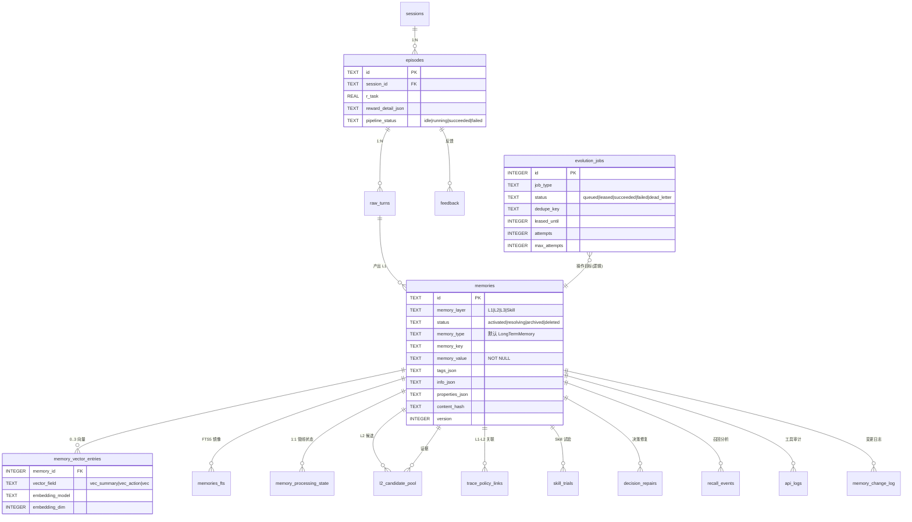
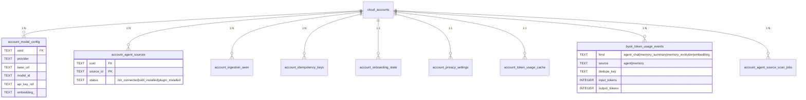
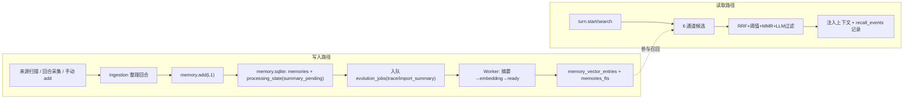

# 06 · 数据模型与数据库设计

Memmy 有两个独立的 SQLite 库：**`memory.sqlite`**（Memory 服务，`better-sqlite3` + `sqlite-vec` + FTS5）与 **`app.sqlite`**（本地后端，`node:sqlite`）。本章分别给出 ER 图、表结构、索引/约束、缓存与事务策略。

## 6.1 Memory 数据库（`memory.sqlite`）

定义在 `Memory/src/storage/schema.ts`，`SCHEMA_VERSION=4`（迁移 `004_memory_processing_state`）。`MemoryDb`(`storage/db.ts`) 加载 `sqlite-vec` 扩展，设 `WAL`/`synchronous=NORMAL`/`foreign_keys=ON`/`busy_timeout=5000`，迁移前 `VACUUM INTO` 备份。

### 6.1.1 ER 图

### 6.1.2 主要表

| 表 | 关键列与约束 |
| --- | --- |
| `memories` | PK `id`；`memory_layer` CHECK(`L1`/`L2`/`L3`/`Skill`)；`status` CHECK(`activated`/`resolving`/`archived`/`deleted`)；`memory_type` 默认 `LongTermMemory`；`memory_key`、`memory_value`(NOT NULL)、`tags_json`/`info_json`/`properties_json`(`json_valid`)、`content_hash`、`version`、时间戳 |
| `memories_fts` | FTS5 虚表(`id UNINDEXED, identifier, memory_value, tags`, `tokenize='unicode61'`)——关键词/词法索引 |
| `memory_vector_entries` | `memory_id` FK→memories(ON DELETE CASCADE)、`vector_field` CHECK(`vec_summary`/`vec_action`/`vec`)、`embedding_model`/`embedding_provider`/`embedding_dim`/`updated_at`；UNIQUE(`memory_id`,`vector_field`) |
| `sessions`/`episodes`/`raw_turns` | 会话/片段/回合生命周期；`episodes` 带 reward(`r_task`/`reward_detail_json`)与 `pipeline_status` CHECK(`idle`/`running`/`succeeded`/`failed`) |
| `feedback`/`decision_repairs`/`l2_candidate_pool`/`trace_policy_links`/`skill_trials` | 演化/RL 反馈图 |
| `recall_events` | 搜索分析（candidate/injected/hit 的记忆 id、outcome） |
| `api_logs` | 工具审计（`tool_name` CHECK(`memory_add`/`memory_search`/`skill_generate`/`skill_evolve`)、`source_agent`、输入/输出 JSON、duration） |
| `memory_change_log` | append-only，`seq AUTOINCREMENT` |
| `idempotency_keys` | 写幂等 |
| `evolution_jobs` | 作业队列：`status` CHECK(`queued`/`leased`/`succeeded`/`failed`/`dead_letter`)、`dedupe_key`、`leased_until`、`attempts`/`max_attempts`；唯一部分索引 `uq_evolution_jobs_active_dedupe`(485 行)按 `dedupe_key` 去重活跃作业 |
| `embedding_retry_queue` | 独立 Embedding 重试队列（带退避） |
| `memory_processing_state` | 每条记忆管线状态机：`summary_pending→summarizing→embedding_pending→embedding→ready`/`ready_text_only`/`failed` |
| `artifacts`/`runtime_kv`/`audit_logs` | 产物/运行时键值/审计 |

### 6.1.3 索引、向量表与事务
- **memories 索引**：`idx_memories_layer_status_updated`、`idx_memories_conversation_updated`、`idx_memories_session_layer`、`idx_memories_agent_app`、`idx_memories_content_hash_layer`、`idx_memories_key_layer`。
- **向量虚拟表**：按维度惰性建 `memory_vec_<dim> USING vec0(embedding float[<dim>] distance_metric=cosine)`（sqlite-vec 0.1.9）；检索先取同维度最近 2000 条建窗口再 Top K。
- **事务**：`migrate(db)` 全部 statements 在单事务内幂等执行；扫描 journal 的 `writeResume` 用 BEGIN/COMMIT/ROLLBACK；WAL 提升并发读。
- **迁移**：`schema_migrations` 记录；升级跑 `backfillMemoryProcessingState` + `removeLegacyProcessingMetadata`。

## 6.2 App 状态数据库（`app.sqlite`）

定义在各 `infrastructure/*/migrations/`，由 `app-state-store` 聚合。`openDatabase` 设 `PRAGMA foreign_keys=ON; journal_mode=WAL; synchronous=NORMAL; busy_timeout=5000`。路径：`MEMMY_APP_DB_PATH` 或平台默认（macOS `~/Library/Application Support/Memmy/app.sqlite`）。

### 6.2.1 ER 图（多账户隔离核心）

### 6.2.2 主要表与迁移

- `0001-init-app-state.sql`：单行 `app_settings`/`onboarding_state`/`privacy_settings`/`token_usage_cache`。
- `0008-account-isolation.sql`（多账户隔离的关键迁移）：引入 `cloud_accounts`(PK `uuid`，profile 列)、`verification_code_throttle`、`account_onboarding_state`、`account_privacy_settings`、`account_token_usage_cache`、`account_model_config`(provider/base_url/model_id/api_key_ref/embedding_*)、`account_agent_sources`(PK `(uuid,source_id)`，status `not_connected`/`skill_installed`/`plugin_installed`)、`account_ingestion_seen`(PK `(uuid,dedup_key)`)、`account_idempotency_keys`(PK `(uuid,adapter_id,request_id)`)。
- 后续迁移：`0014 byok_token_usage_events`、`0019 account_agent_source_scan_jobs/_source_state/_messages/_results`、`0022 installation_id`/`managed_agent_sync_recipes`、`0023 token_scene_usage` 等。
- `agent-source-store`（scope 合成账户 `"local-agent-sources"`，`INSERT OR IGNORE` 保证 FK）：`account_agent_sources`/`account_agent_source_watermarks`/`account_agent_source_conversation_checkpoints`/`account_ingestion_seen`。
- `idempotency-store`：`account_idempotency_keys`(`lookup/save/purgeBefore`)，按活跃账户 uuid。
- `agent-source-scan-journal`：`account_agent_source_scan_*`(jobs/source_state/messages/results) 支持续跑。

> 设计要点：**多账户隔离**用 `(uuid, …)` 复合主键贯穿所有账户相关表，使同一台机器可登录多账户且数据互不污染；`secret-store`(SQLite) 单独存敏感凭据；`api_key_ref` 引用而非明文存 Key。

## 6.3 缓存、幂等与数据流向

- **缓存**：进程内 Embedder `Map` 缓存（`stableHash`）；本地 Embedding 模型缓存 `~/.memmy/memory-service/model-cache`；前端无全局缓存层（按切片局部缓存）。
- **幂等**：会话/回合/记忆写入幂等；扫描用会话检查点（最后消息时间/ID/内容哈希）+ 稳定来源消息 ID + 回合 ID 去重；后台作业用 `evolution_jobs.dedupe_key` 与 `account_idempotency_keys`；唯一部分索引保证活跃作业不重复。
- **时间衰减**：L1 `priority` 按 `reward.decayHalfLifeDays=30` 半衰期衰减，参与召回 bonus。
- **备份**：Memory 迁移前 `VACUUM INTO`；本地后端 `sqlite-backup.ts backupSqliteDatabase`；前端可经 IPC `export-memory-database` 导出。

---

> 上一节 ← [05 核心代码走读](./05-code-walkthrough/06-electron-shell.md) ｜ 下一节 → [07 API 与接口设计](./07-api-design.md)

---

☕️ 制作不易，请我喝咖啡☕️关注我➕