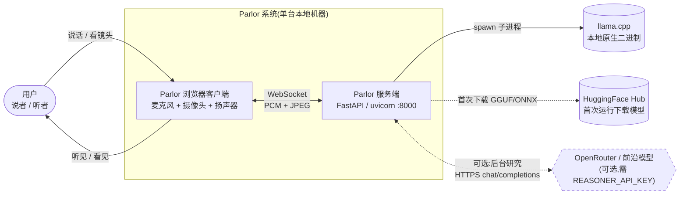
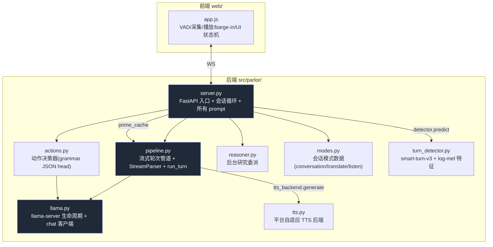
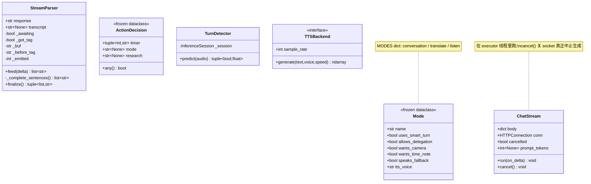

# 02 C4 架构模型

本章用 [C4 模型](https://c4model.com/)的四个层级(Context、Container、Component、Code)逐层刻画 Parlor。每层都附 Mermaid 图与不少于 400 字的解读,包括设计动机、边界与交互方式。

---

## 2.1 Level 1 — System Context(系统上下文)



### 解读(系统上下文)

Parlor 的系统上下文异常「扁」,这正是它的核心卖点:**整个系统就是一个用户 + 一台机器**。

- **用户**是唯一的真人参与者。用户对浏览器说话、展示摄像头画面,并从扬声器听到 AI 的回复。用户既是输入源(语音 / 视觉),也是输出终点(听 / 看)。
- **Parlor 系统**严格限定在「单台本地机器」内,由两个进程边界组成:运行在浏览器里的前端,与运行在本机的 FastAPI 服务端。两者通过 localhost 上的单个 WebSocket 通信。
- **外部依赖只有两类,且都是「下载型」而非「在线型」**:
  1. **HuggingFace Hub**:仅在首次运行(或模型缺失)时被访问,用于下载 GGUF 模型、mmproj、ONNX 端点分类器与 TTS 模型。下载完成后即可离线运行(代码中有 `local_files_only=True` 的离线兜底)。
  2. **llama.cpp**:以**本地原生二进制**形式存在,由服务端 `subprocess.Popen` 拉起为子进程。它不是网络服务,而是同机进程。
- **唯一的可选在线外呼**是 OpenRouter / 前沿模型(图中虚线 `Orbit`)。它**仅在设置了 `REASONER_API_KEY` 时**存在,用于后台研究委派。默认配置下这条边不存在,系统是 100% 端侧的。这一点用虚线 + `opt` 样式明确标出。
- **没有任何数据库、消息队列、对象存储、身份服务**。系统的「状态」是每个 WebSocket 连接内存里的对话历史列表,连接断开即消失。这是有意设计:无状态、无持久化、天然隐私。
- **信任边界**:用户与浏览器之间是物理边界(同一台机器前);浏览器与服务端之间是 localhost 可信边界(不暴露到网络);服务端与 HuggingFace / reasoner 之间才是真正的公网边界,且 reasoner 是可选的。

这种「单用户、单机、可离线」的上下文,决定了后续所有架构选择:不需要水平扩展、不需要多租户隔离、不需要分布式一致性,但**极度在意单机延迟与单机资源**。

---

## 2.2 Level 2 — Container(容器视图)

这里的「容器(container)」指可独立部署 / 运行的单元,而非 Docker。Parlor 有 5 个容器,全部同机。

```mermaid
graph TB
    subgraph Browser["容器 1:浏览器客户端(单个标签页)"]
        UI["app.js + index.html<br/>VAD / 采集 / 播放 / UI"]
    end

    subgraph App["容器 2:Parlor Python 服务(:8000)"]
        FastAPI["FastAPI app<br/>HTTP + WebSocket 端点"]
        Loop["每连接会话循环<br/>asyncio"]
    end

    subgraph Infer["容器 3:llama-server 子进程(:8081)"]
        LSP["llama-server<br/>OpenAI 兼容 chat API<br/>前缀缓存"]
    end

    subgraph Aux["容器 4:同进程辅助运行时"]
        Turn["smart-turn-v3 ONNX<br/>(onnxruntime, CPU)"]
        TTSB["Kokoro TTS<br/>MLX(Mac)/ ONNX(Linux)"]
    end

    subgraph Ext["容器 5:可选外部 reasoner"]
        OR["OpenRouter / 前沿模型"]
    end

    UI <-->|"WebSocket /ws<br/>JSON:audio,frame,speech_chunk<br/>JSON:transcript,audio_chunk..."| FastAPI
    FastAPI --> Loop
    Loop <-->|"HTTP /v1/chat/completions<br/>(stream + 阻塞)"| LSP
    Loop -->|"numpy PCM.predict()"| Turn
    Loop -->|"text → PCM"| TTSB
    Loop <-.|"HTTPS<br/>run_in_executor(REASONER_POOL)"| OR

    classDef ext stroke-dasharray: 5 5;
    class OR ext;
```

### 解读(容器视图)

5 个容器的职责、技术与生命周期各不相同:

1. **浏览器客户端(容器 1)**:Vanilla JS,无构建步骤。它做四件事——(a) 用 `getUserMedia` 拿到麦克风 + 摄像头;(b) 用 Silero VAD 做语音活动检测与切分,并在说话过程中把音频切成 ~3s 块流式发送;(c) 在说话开始瞬间**预取摄像头帧**;(d) 用 WebAudio 把服务端回传的 PCM 块**无缝拼接播放**。它还实现了 barge-in 的滑窗投票门控与一个 processing 看门狗(防止「思考中」状态卡死)。

2. **Parlor Python 服务(容器 2)**:FastAPI + uvicorn,**仅监听 localhost:8000**(不是 0.0.0.0——因为浏览器只把 `http://localhost` 当安全上下文,否则 `getUserMedia` 不存在)。它在 `lifespan` 启动钩子里加载 TTS / 端点分类器并拉起 llama-server。**每个 WebSocket 连接对应一个独立的 `websocket_endpoint` 协程**,内含完整的会话状态(历史、模式、定时器、委派任务)。这是系统的心脏。

3. **llama-server 子进程(容器 3)**:由 `llama.py` 用 `subprocess.Popen` 拉起,默认 `127.0.0.1:8081`,暴露 **OpenAI 兼容的 `/v1/chat/completions`**。它是真正的推理引擎,带**前缀缓存(`cache_prompt=True`)**——这是 overlap prefill 与「每次重发全部历史也便宜」的关键。容器 2 通过裸 `http.client`(而非 requests / httpx)与它通信,以最小化流式解析开销。也可用 `LLAMA_SERVER_URL` 指向一个外部已运行的 llama-server,跳过自拉起。

4. **同进程辅助运行时(容器 4)**:不是独立进程,而是 Parlor 服务进程内的对象。`TurnDetector`(smart-turn-v3)与 `TTSBackend`(Kokoro)在 `load_models()` 中一次性加载并预热(warmup),之后被所有会话共享。它们通过 `loop.run_in_executor` 跑在线程池里,避免阻塞 asyncio 主循环。

5. **可选外部 reasoner(容器 5,虚线)**:`reasoner.py` 用 `urllib.request` 向 OpenRouter(或任意 OpenAI 兼容端点)发**阻塞** chat 请求,跑在专用的 `REASONER_POOL`(4 线程)里,与延迟敏感路径(llama 流式、TTS、端点判定、缓存预热)隔离。

容器间的关键设计:**只有浏览器 ↔ 服务端是 WebSocket**;服务端 ↔ llama-server 是普通 HTTP(流式 SSE);其余都是同进程函数调用或子进程。这种划分让延迟敏感的推理路径都在同机甚至同进程内,网络往返仅限可选的 reasoner。

---

## 2.3 Level 3 — Component(组件视图)

聚焦容器 2(Parlor 服务)内部的组件分解。8 个模块 + 前端。



### 解读(组件视图)

后端 8 个模块按职责清晰分层,依赖方向单一(无环):

- **server.py(核心编排器)**:系统的大脑。它定义 FastAPI app、所有 prompt 常量、会话状态、轮次主循环、模式切换、定时器、委派、历史轮转。**它只编排,不做底层细节**——推理委托给 llama,流式解析委托给 pipeline,动作判定委托给 actions。它是体量最大的模块(860 行),因为「对话策略」全部集中在此。这种集中是有意的:策略可读、可在一个文件里追溯、便于 benchmark。

- **pipeline.py(流式管道)**:实现 `run_turn`(解码→句子→TTS 三段重叠流水线)、`StreamParser`(增量解析 `###TRANSCRIPT: ... \n 回复`)、`prime_cache`(投机缓存预热)、各种消息内容辅助函数。它是延迟优化的核心战场。

- **llama.py(LLM 后端)**:`server_command()` 定位 `llama-server`/`llama` 二进制;`check_build()` 强制构建版本门槛;`start()`/`stop()` 管理子进程生命周期;`ChatStream` 是线程安全的流式请求驱动器(支持 `cancel()` 真正中止服务端生成);`chat_blocking` 用于动作 head 与预热。

- **actions.py(动作决策器)**:一个**独立的 grammar-forced JSON 请求**,判断用户这一轮要求「做什么」(定时器 / 模式 / 研究)。`decide_before` / `decide_after` 分别在回复前 / 后调用,复用同一前缀缓存故而便宜。这是「动作与语音解耦」的具体实现。

- **reasoner.py(后台研究)**:把任务交给前沿模型,返回可直接朗读的简短答案。`enabled()` 仅在配置了 API key 时为真。

- **modes.py(模式数据)**:三个 `Mode` 数据类(conversation/translate/listen),每个带 6 个布尔/字符串标志位(`uses_smart_turn` / `allows_delegation` / `wants_camera` / `wants_time_note` / `speaks_fallback` / `tts_voice`)。**模式是数据不是行为**:server.py 查标志位而非硬编码,新增模式只需加一条数据 + 触发逻辑。

- **turn_detector.py(端点分类器)**:加载 smart-turn-v3 ONNX,并**自带一份 vendored 的 Whisper 风格 log-mel 特征提取**(纯 numpy),免去对 `transformers` 的依赖。

- **tts.py(TTS 后端)**:`load()` 按 `_is_apple_silicon()` 选择 MLXBackend 或 ONNXBackend,统一 `generate(text, voice, speed) -> np.ndarray` 接口。

依赖图说明:LLM 被 server、pipeline、actions 三方共享(动作 head 必须跑在同一个 llama-server 上以复用前缀缓存);pipeline 被 server 与自身(预热)调用;TTS / TurnDetector 作为全局对象被 server 在会话循环里调用。**没有组件反向依赖 server**,保证了核心推理逻辑可独立测试与复用。

---

## 2.4 Level 4 — Code(代码 / 类视图)

聚焦两个最关键的内部类:`StreamParser`(流式解析状态机)与 `Mode`(模式数据类),以及 `ChatStream` 的线程模型。



### 解读(代码视图)

代码层揭示三个关键设计:

1. **`StreamParser` 是一个面向增量输入的有限状态机**。它处理模型流式吐出的 token,核心状态 `_awaiting`(是否还在等待 `###TRANSCRIPT:` 标签)。`feed()` 每个 delta 都调用,先消费标签行(产出 transcript),再切出完整句子送 TTS;`finalize()` 处理流截断 / 标签后无换行的退化情形。`_complete_sentences()` 用正则 `[.!?]+\s` 切句,并**在遇到模仿出的 `##` 标记后截断**(永远不朗读标记后的内容)。这个类的存在是为了实现「transcript 行先于回复到达客户端」——它让转写在回复还在解码时就上屏,这是 v2 的一个测量驱动的决定(WER 0.00 vs 0.39)。

2. **`Mode` 与 `ActionDecision` 用 frozen dataclass 表达「数据而非行为」**。`Mode` 把「这个模式如何被门控与提示」编码为标志位,server.py 查这些标志;`ActionDecision` 把「用户这一轮要做什么」编码为三个可空字段。两者都不可变,便于在并发 asyncio 环境中安全传递。`Mode` 的标志位组合甚至能表达「listen 模式不朗读 fallback、不打断翻译」这样的细粒度策略。

3. **`ChatStream` 的线程模型是整个流式系统的关键**。它被放在 `loop.run_in_executor` 的线程里跑,通过 `loop.call_soon_threadsafe(chunk_q.put_nowait, text)` 把 token 安全地送回 asyncio 循环。`cancel()` 通过 `socket.shutdown(SHUT_RDWR)` + `close()` **真正中止服务端生成**(连接关闭被 llama-server 观察到),这是 barge-in 能在服务端生效的基础。`prompt_tokens` 从流式响应最后的 usage chunk 提取——这是驱动历史轮转的真实 token 计数。

这三层状态机(StreamParser 处理文本、会话循环处理消息、ChatStream 处理网络流)叠加,构成了 Parlor 实时性的全部底层机制。

---

下一章:[03 系统流程与时序图](03-flows.md)

---

☕️ 制作不易，请我喝咖啡☕️关注我➕