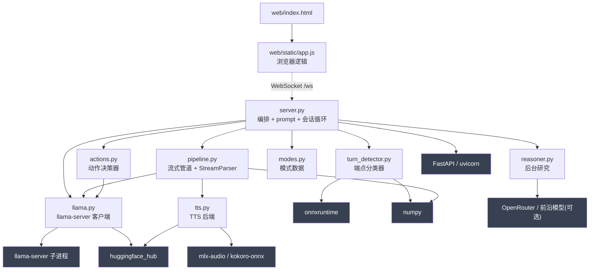

# 04 模块 / 包结构与依赖分析

## 4.1 完整目录结构树

```text
parlor/
├── .env.example                    # 环境变量示例(模型/服务/TTS/reasoner)
├── .gitignore
├── CHANGELOG.md                    # v1.0.0 / v2.0.0 变更与测量
├── LICENSE                         # Apache 2.0
├── README.md                       # 人类撰写(Why?)+ AI 生成(How it works)
├── pyproject.toml                  # uv 项目定义、依赖、入口脚本
├── uv.lock                         # 锁定的依赖版本
│
├── src/
│   └── parlor/                     # 后端包(唯一 Python 包)
│       ├── __init__.py             # 仅 docstring
│       ├── server.py               # 〔860 行〕FastAPI + 会话循环 + 所有 prompt
│       ├── llama.py                # 〔278 行〕llama-server 生命周期 + chat 客户端
│       ├── pipeline.py             # 〔476 行〕流式轮次管道 + StreamParser
│       ├── actions.py              # 〔155 行〕动作决策器(grammar JSON head)
│       ├── reasoner.py             # 〔 77 行〕后台研究委派
│       ├── modes.py                # 〔 50 行〕会话模式数据
│       ├── turn_detector.py        # 〔230 行〕smart-turn-v3 + log-mel 特征
│       ├── tts.py                  # 〔 69 行〕平台自适应 TTS 后端
│       └── web/                    # 前端
│           ├── index.html          # 〔 60 行〕页面骨架
│           └── static/
│               ├── app.js          # 〔820 行〕VAD/采集/播放/barge-in/UI
│               └── style.css       # 样式
│
├── tests/                          # e2e 测试套件(~87 用例)
│   ├── conftest.py                 # 服务端/ reasoner mock 管理 fixture
│   ├── util.py                     # Session 同步 WS 客户端 + wer 度量
│   ├── fixtures → benchmarks/fixtures.py (via pythonpath)
│   ├── test_conversation.py
│   ├── test_delegation.py
│   ├── test_elapsed.py
│   ├── test_history.py
│   ├── test_listen.py
│   ├── test_llama_startup.py
│   ├── test_robustness.py
│   ├── test_stream_parser.py       # StreamParser 单元测试(无服务端依赖)
│   ├── test_timer.py
│   ├── test_transcription_stability.py
│   ├── test_translation.py
│   └── test_z_failure.py
│
└── benchmarks/                     # 测量驱动决策的脚本
    ├── bench.py                    # 端到端延迟 benchmark
    ├── benchmark_tts.py            # TTS 性能
    ├── camerabench.py              # 每轮附帧 vs 摄像头作工具调用
    ├── compare.py                  # 比较两个 benchmark 结果文件
    ├── archbench.py                # 带内标签 vs 解耦 action head
    ├── fixtures.py                 # 本地合成的语音 fixture
    ├── legacy_tags.py              # 退役的带内标签架构(vendored 基线)
    ├── tagbench.py                 # 生产温度下的动作召回
    ├── timerprobe.py               # 为何服务端持有时钟
    └── turnbench.py                # smart-turn vs LLM 判定准确率
```

## 4.2 各模块职责、输入输出

### 后端模块(`src/parlor/`)

| 模块 | 职责 | 主要输入 | 主要输出 / 副作用 |
|------|------|---------|-----------------|
| **server.py** | 系统编排器。FastAPI app、HTTP/WS 端点、所有 prompt 常量、会话状态、轮次主循环、模式/定时器/委派/历史轮转 | WebSocket 帧、模型生成 | WS 帧回客户端、记忆进 history、调度动作 |
| **pipeline.py** | 流式轮次管道。`run_turn`(解码→句子→TTS 重叠)、`StreamParser`(增量解析)、`prime_cache`(投机预热)、消息内容辅助 | messages 列表、ws、interrupted Event | WS 帧(text_delta/transcript/audio_chunk/turn_final)、raw_text、prompt_tokens、no_speech、spoke |
| **llama.py** | llama.cpp 后端。二进制定位、构建版本门槛、子进程生命周期、流式/阻塞/JSON chat 请求 | messages、max_tokens、stream、json_schema | 文本增量(on_delta 回调)、完整文本、prompt_tokens |
| **actions.py** | 动作决策器。独立 grammar-forced JSON 请求判定用户要做什么 | history、content、current_mode | `ActionDecision`(timer/mode/research) |
| **reasoner.py** | 后台研究。把任务交给前沿模型,返回简短可朗读答案 | task 字符串 | answer 字符串(异常时抛出) |
| **modes.py** | 会话模式数据。三个 `Mode` dataclass + 标志位 | — | `MODES` 字典供查询 |
| **turn_detector.py** | 端点分类器。加载 smart-turn-v3 ONNX + vendored log-mel 特征 | 16kHz float32 mono PCM | `(complete: bool, prob: float)` |
| **tts.py** | TTS 后端。平台自适应加载 MLX/ONNX,统一 generate 接口 | text、voice、speed | float32 PCM ndarray |

### 前端(`src/parlor/web/`)

| 文件 | 职责 |
|------|------|
| **index.html** | 页面骨架:header(model 标签 + 状态丸)、摄像头视口、波形、转写区、控制条(cameraToggle / modeChip / 状态指示 / On-device 丸)。CDN 引入 onnxruntime-web + vad-web |
| **app.js** | 全部前端逻辑:状态机(listening/processing/speaking/loading)、波形可视化、WebSocket 收发、VAD 句柄(开始/结束/帧/misfire)、~3s 语音块流式、帧预取、barge-in 滑窗投票、流式无缝播放、flush 计时器、processing 看门狗、模式/委派/定时器芯片 UI、WAV base64 编码 |
| **style.css** | 样式(本文档未逐行展开,聚焦逻辑) |

### 测试与基准(`tests/`、`benchmarks/`)

| 文件 | 职责 |
|------|------|
| **conftest.py** | session 级 fixture:拉起 mock reasoner(HTTP)、拉起真实服务端子进程(真实 llama.cpp/TTS/turn detector)、提供 `session` fixture |
| **util.py** | `Session` 同步 WS 客户端:`turn()`/`collect_turn()` 收集一轮全部消息直到终态(并镜像浏览器发 `ready`)、`wer()` 词错率、`switch_by_voice()` 模式切换辅助 |
| **fixtures.py** | 本地合成的语音 fixture(用 TTS 生成),含退化音频(截断词尾、噪声、他人声音)复现真麦失败模式 |
| **bench.py** | 端到端延迟:说完到首音、整轮完成 |
| **turnbench.py** | smart-turn vs LLM 判定端点的准确率(标注人类语音) |
| **archbench.py** | 带内控制标签 vs 解耦 action head 的召回对比 |
| **tagbench.py** | 生产温度(0.7)下的动作召回(非套件的确定性 0 度) |
| **camerabench.py** | 每轮附帧 vs 摄像头作工具调用 |
| **timerprobe.py** | 论证 turn-based 模型无法在静默中响起 → 服务端持有时钟 |
| **benchmark_tts.py** | TTS 性能基准 |
| **compare.py** | diff 两个 benchmark JSON 结果 |

## 4.3 模块依赖关系图



### 依赖分析要点

1. **`llama` 是被依赖最多的模块**(server、pipeline、actions 三方)。这并非偶然——动作 head **必须**跑在同一个 llama-server 上以复用前缀缓存,否则每轮要为 head 全量 prefill 历史 + 音频。`actions.py` 顶部注释明确:"The head must run on the SAME llama-server as speech."

2. **依赖方向单一、无环**:`server` → {pipeline, actions, reasoner, modes, llama};`pipeline` → {llama, tts};`actions` → `llama`。没有任何子模块反向依赖 `server`。这让核心推理 / 解析逻辑可独立单测(`test_stream_parser.py` 不需要服务端)。

3. **`pipeline` 既是 server 的工具也是自身的工具**:`server.prime()` 调 `pipeline.prime_cache()`,而 `run_turn` 内部又用 `prime` 预热——形成「说话时预填 → 最终请求命中缓存」的闭环。

4. **外部依赖集中在边缘**:`llama-server`(子进程)、`onnxruntime`(分类器)、`mlx-audio/kokoro-onnx`(TTS)、`huggingface_hub`(模型下载)都封装在各自模块内,不泄漏到 server。`numpy` 是横切依赖(音频数组)。

5. **前端与后端仅通过 WebSocket 解耦**:前端不 import 任何后端符号,后端不依赖前端逻辑(仅 `server.py` 读 `web/index.html` 文本做模板替换 `{{model}}`)。两端可独立演进。

6. **可选依赖用虚线**:`reasoner → or_ep` 是唯一可断的依赖——不设 `REASONER_API_KEY` 时,`reasoner.enabled()` 为假,系统提示里的 `RESEARCH_NOTE` 整段不出现,委派逻辑被 `if not delegation` 全程跳过,系统退化为纯端侧。

---

下一章:[05 核心代码走读](05-code-walkthrough/) · [06 数据模型](06-data-model.md)

---

☕️ 制作不易，请我喝咖啡☕️关注我➕