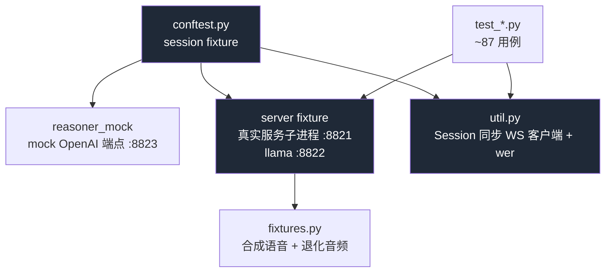

# 13 测试策略

Parlor 的质量保障体系:**端到端 pytest 套件** + **测量驱动 benchmark**。本章详解两者。

---

## 13.1 测试哲学

- **真实服务 e2e**:测试拉起**真实**服务端(真实 llama.cpp / TTS / turn detector),用合成语音驱动。不 mock 推理——因为测的就是「真实模型 + 真实管线」的行为。
- **确定性**:套件 `TEMPERATURE=0`,验证**机制**(协议、轮转、模式、委派、兜底)而非概率分布。生产温度(0.7)的召回由 `tagbench --production` 验证,非套件职责。
- **退化音频复现真麦失败**:fixtures 含截断词尾、噪声、他人声音,复现 live-mic 失败模式。
- **纯单元测试隔离**:`test_stream_parser.py` 无服务端依赖,秒级验证 `StreamParser`。

---

## 13.2 e2e 套件结构(`tests/`)



---

## 13.3 `conftest.py` —— 服务端管理

### `reasoner_mock`(80–94)
- session 级 mock OpenAI 兼容端点(`ThreadingHTTPServer` :8823)。
- **任务文本触发**保持路径确定:`stock` → HTTP 500(失败路径);`naples` → sleep 8s(对话继续同时待决路径);否则返回 `MOCK_ANSWER`(披萨)或 `MOCK_WEATHER_ANSWER`(那不勒斯天气)。
- 坚持真实请求形状:缺 `Authorization` 头 / 错路径 → 401,大声失败。

### `server`(111–181)
- `fixtures.generate_all()` 先生成合成语音。
- `PARLOR_TEST_URL` 设了 → 用外部服务(跳过自拉起,log/process 测试 skip)。
- **端口占用检测**:8821/8822 被占 → `pytest.fail`(防陈旧进程让就绪探针测错服务)。
- 启动真实 `python -m parlor.server` 子进程,环境固定:
  ```
  PORT=8821 LLAMA_PORT=8822 LLAMA_CTX=4096(小窗,cheap 触发轮转)
  MODEL=e4b(可 env 覆盖;e2b ~2x 快迭代)
  TEMPERATURE=0(确定性)
  REASONER_BASE_URL=http://127.0.0.1:8823/v1 REASONER_API_KEY=test-key
  REASONER_MODEL=mock-model REASONER_TIMEOUT=20
  TIME_NOTE_MIN_S=15(短睡即可触发 elapsed 测试)
  ```
  → 每个测试都在 delegation-enabled 系统提示下跑(生产配 key 时的状态)。
- **就绪探测**:轮询 `http://127.0.0.1:8821/` ≤300s;子进程早退 fail + dump 末 3000 行日志。
- **shutdown**:`terminate` + wait 15s + 兜底 `kill $(lsof -ti :8822)`(清孤儿 llama)。

### `session`(184–189)
每测试一个 `Session(server.url)`(= 一个服务端会话)。

---

## 13.4 `util.py` —— 同步 WS 客户端

### `Session`(63–145)
```python
class Session:
    def turn(payload, timeout=90) -> Turn: ...      # 发 + collect
    def collect_turn(timeout) -> Turn:              # 收到终态(+ 镜像发 ready)
    def wait_for(kind, timeout) -> dict | None:     # 等特定消息
    def send_speech_chunks(chunks, gap_s): ...      # 流式(除最后块)
    def drain(quiet_s): ...                          # 丢弃到静默
```
`collect_turn` 关键:**每个终态也发 `ready`**(镜像浏览器空闲通告),否则服务端会 hold 委派投递。`Turn.marker`:`complete|incomplete|released|timeout`。

### `wer(ref, hyp)`(26–37)
Levenshtein / ref 长度,词错率。用于转写准确性断言。

### `switch_by_voice(session, fixture, target, tries=2)`(147–164)
语音模式切换辅助:说命令 → 等 `mode_changed`;**一次重试**(两次 miss = 真回归)。incomplete → flush(不重说,避免双倍 utterance 合并)。

---

## 13.5 测试文件与覆盖

| 文件 | 覆盖 |
|------|------|
| `test_conversation.py` | 基础对话轮、流式、transcript |
| `test_stream_parser.py` | **纯单元**:StreamParser 增量解析、标签/换行/截断/模仿标记 |
| `test_history.py` | 历史轮转、真实 token 驱动、落在 user、不毒化 |
| `test_delegation.py` | 后台研究:成功投递、失败道歉、parking、对话继续同时待决、pizza/weather 答案区分 |
| `test_timer.py` | 定时器:set/cancel/ring、并发/上限守卫、floor 调度、任何模式响 |
| `test_translation.py` | 翻译模式:短停顿渲染、退出命令、parking |
| `test_listen.py` | 只听模式:静默转写、退出问句被回答、不朗读 fallback |
| `test_transcription_stability.py` | 转写稳定性:transcript leading、no-speech 拒绝 |
| `test_elapsed.py` | 时间感:gap 触发 TIME_NOTE、短语粗化 |
| `test_robustness.py` | 鲁棒性:坏 WAV、空音频、no-speech 不毒化、回声抑制 |
| `test_z_failure.py` | 失败路径:`z_` 前缀最后跑,验证不杀会话 |
| `test_llama_startup.py` | 启动:构建门槛、二进制发现、外部 URL |

> 共 ~87 用例(CHANGELOG v2)。文件名 `test_z_failure.py` 的 `z_` 让失败路径测试最后跑。

---

## 13.6 测试如何验证 ADR

| ADR | 测试验证 |
|-----|---------|
| ADR-003 smart-turn | `test_conversation` incomplete→flush;退化音频下 hold |
| ADR-004 解耦 head | `test_timer`/`test_translation`/`test_listen` 模式与定时器触发 |
| ADR-006 transcript leading | `test_transcription_stability` wer 断言 |
| ADR-007 服务端时钟 | `test_timer` ring 在静默后 |
| ADR-008 no-speech | `test_robustness`/`test_transcription_stability` 标注拒绝、不毒化 |
| ADR-012 真实 token 轮转 | `test_history` LLAMA_CTX=4096 触发轮转 |

---

## 13.7 Benchmark 体系(`benchmarks/`)

测量驱动决策的脚本,退役架构 vendored 可重跑。详见 [§11.6](11-developer-guide.md)。

| 脚本 | 行 | 用途 |
|------|---|------|
| `bench.py` | 228 | 端到端延迟 |
| `compare.py` | 54 | diff 两结果 JSON |
| `fixtures.py` | 321 | 本地合成语音 + 退化音频 |
| `turnbench.py` | 387 | smart-turn vs LLM 端点准确率 |
| `archbench.py` | 402 | 带内标签 vs 解耦 head(含 B_gated 预门) |
| `tagbench.py` | 291 | 生产温度动作召回 |
| `camerabench.py` | 325 | 每轮附帧 vs 摄像头作工具调用 |
| `timerprobe.py` | 118 | 服务端持时钟必要性 |
| `benchmark_tts.py` | 210 | TTS 性能 |
| `legacy_tags.py` | 187 | 退役带内标签架构(vendored 基线) |

**`fixtures.py`**:TTS 合成的口语 fixture,含退化变体(截断词尾、加噪、他人声),`load_wav_b64(name)` 供 e2e 与 benchmark 共用(pytest `pythonpath=["benchmarks"]`)。

---

## 13.8 测试局限(诚实)

1. **浏览器行为未测**:echo at speaker volume、VAD feel、多语言真声仍需 live mic + 人耳(README 明示)。`app.js` 无单元测试。
2. **生产温度召回非套件**:0 度确定性测机制;0.7 召回靠 `tagbench`。
3. **模型依赖**:套件需真实模型加载(~1 分钟 + 下载),CI 成本高(无 CI)。
4. **mock reasoner**:真实前沿模型行为(网搜质量)未测,只测投递机制。
5. **并发/多会话**:套件单会话为主;多连接并发行为覆盖有限。

---

## 13.9 运行速查

```bash
uv run pytest                              # 全套(~1 分钟 + 模型加载)
uv run pytest tests/test_stream_parser.py  # 纯单元(秒级,无模型)
uv run pytest -k timer                     # 只跑定时器
PARLOR_TEST_URL=ws://localhost:8000/ws uv run pytest   # 指向已运行服务
MODEL=e2b uv run pytest                    # 更快迭代
```

---

← [12 算法分析](12-algorithms.md) | [返回索引](index.md)

---

☕️ 制作不易，请我喝咖啡☕️关注我➕