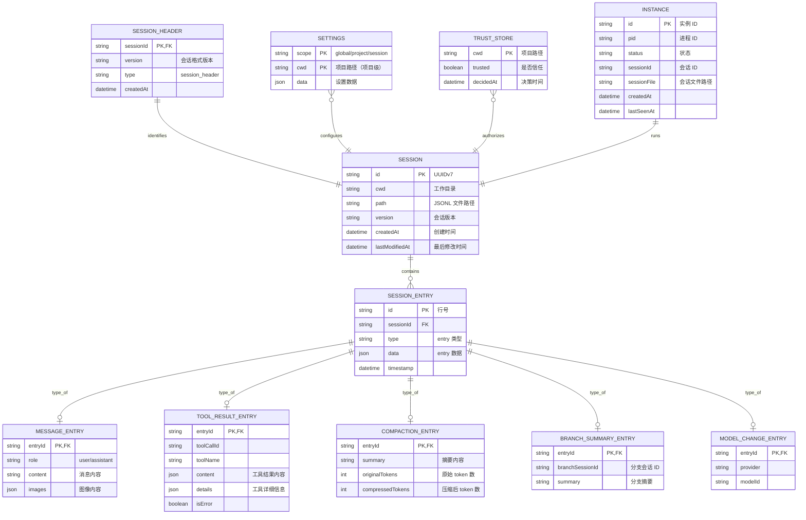
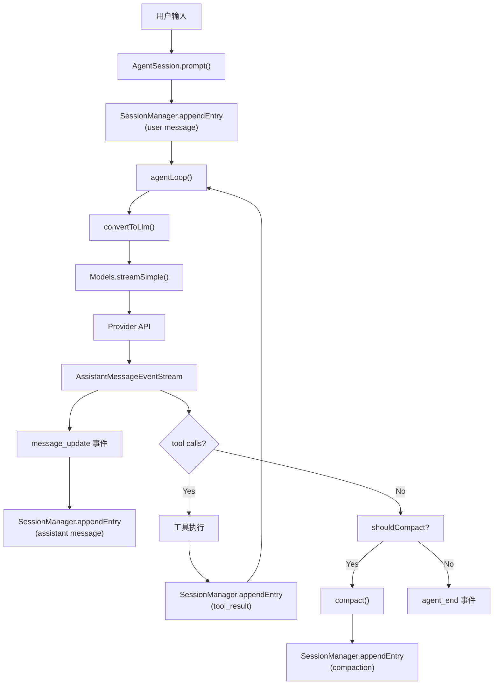

# 第六部分：数据模型与数据库设计

## 6.1 数据模型总览

Pi 的数据存储哲学是**文件系统优先**，不使用数据库。所有数据存储在文件系统中：

- **会话数据**：JSONL 文件（每个会话一个文件）
- **配置数据**：JSON 文件（settings.json、auth.json、models.json）
- **信任数据**：trust 文件
- **实例数据**：instances.json（orchestrator）

**设计 Rationale**：
- **简单性**：无需数据库服务，零配置
- **可审计**：JSONL 是人类可读的格式
- **可移植**：文件可以复制、备份、Git 管理
- **崩溃安全**：追加写入不会损坏已有数据

---

## 6.2 ER 图



---

## 6.3 会话 JSONL 格式详解

### 文件格式

每个会话是一个 `.jsonl` 文件，文件名是 `<sessionId>.jsonl`，位于 `~/.pi/sessions/` 目录下。

每行是一个 JSON 对象，代表一个 SessionEntry。Entry 通过 `type` 字段区分。

### SessionEntry 类型体系

```typescript
type SessionEntry =
  | SessionHeaderEntry      // 会话头
  | SessionInfoEntry        // 会话信息
  | SessionMessageEntry     // 消息
  | ToolResultEntry         // 工具结果
  | FileEntry               // 文件操作
  | CustomEntry             // 自定义
  | ModelChangeEntry        // 模型变更
  | ThinkingLevelChangeEntry
  | CompactionEntry         // 压缩
  | BranchSummaryEntry      // 分支摘要
  | NewSessionEntry         // 新会话标记
```

### 各 Entry 结构

#### SessionHeaderEntry
```json
{
  "type": "session_header",
  "version": "CURRENT_SESSION_VERSION",
  "createdAt": "2026-07-24T10:00:00.000Z",
  "id": "0197c2e0-..."
}
```

#### SessionMessageEntry
```json
{
  "type": "message",
  "message": {
    "role": "user" | "assistant",
    "content": "...",
    "timestamp": "2026-07-24T10:01:00.000Z"
  }
}
```

#### ToolResultEntry
```json
{
  "type": "tool_result",
  "toolCallId": "tool_xxx",
  "toolName": "bash",
  "content": [...],
  "details": {...},
  "isError": false
}
```

#### CompactionEntry
```json
{
  "type": "compaction",
  "summary": "The user asked to fix...",
  "originalTokens": 45000,
  "compressedTokens": 2000
}
```

#### BranchSummaryEntry
```json
{
  "type": "branch_summary",
  "branchSessionId": "0197c300-...",
  "summary": "This branch explored..."
}
```

#### ModelChangeEntry
```json
{
  "type": "model_change",
  "provider": "openai",
  "modelId": "gpt-4o"
}
```

### 版本迁移

`migrateSessionEntries()` 函数处理旧格式到新格式的迁移。每次会话格式变更时，迁移函数将旧 entries 转换为新格式。迁移是惰性的——在会话加载时执行。

---

## 6.4 配置文件体系

### settings.json（全局）
路径：`~/.pi/settings.json`

```json
{
  "defaultProvider": "openai",
  "defaultModel": "gpt-4o",
  "defaultThinkingLevel": "medium",
  "theme": "dark",
  "httpProxy": null,
  "httpIdleTimeoutMs": 30000,
  "imageAutoResize": true,
  "enabledModels": ["openai/gpt-4o", "anthropic/claude-sonnet-4-20250514"],
  "analyticsOptIn": false
}
```

### settings.json（项目级）
路径：`<project>/.pi/settings.json`

覆盖全局设置，仅对当前项目生效。

### auth.json
路径：`~/.pi/auth.json`

存储 API Key 和 OAuth token（加密存储）。

### models.json
路径：`~/.pi/models.json`

缓存的模型目录，包含每个 provider 的模型列表。

### trust
路径：`~/.pi/trust`

项目信任决策存储：
```
/path/to/project1:true
/path/to/project2:false
```

### instances.json（orchestrator）
路径：`~/.pi/instances.json`

编排器管理的实例状态：
```json
[
  {
    "id": "inst_xxx",
    "pid": 12345,
    "status": "running",
    "sessionId": "0197c2e0-...",
    "sessionFile": "~/.pi/sessions/0197c2e0-....jsonl",
    "createdAt": "2026-07-24T10:00:00.000Z",
    "lastSeenAt": "2026-07-24T10:05:00.000Z"
  }
]
```

---

## 6.5 缓存与资源策略

### 模型目录缓存
- `models.json` 缓存 provider 的模型列表
- `Models.refreshModels()` 从 provider API 刷新
- 支持离线模式（使用缓存）
- 新鲜度检查（避免频繁刷新）

### Prompt Cache
- OpenAI Responses API 支持 prompt cache
- `openai-prompt-cache.ts` 实现缓存优化
- 通过调整消息顺序最大化缓存命中

### 图像资源
- 图像文件读取时自动缩放/格式转换
- 使用 `@silvia-odwyer/photon-node`（Rust WASM）处理
- 支持 PNG/JPEG/WebP 格式
- 可配置自动缩放（`imageAutoResize`）

### Session Resources 清理
- `cleanupSessionResources()` 在会话关闭时清理
- 释放文件锁、临时文件等资源

---

## 6.6 事务与并发设计

### 文件锁
- `proper-lockfile` 用于会话文件的并发访问
- 防止多个进程同时写入同一会话
- 锁文件：`<sessionId>.jsonl.lock`

### JSONL 追加语义
- 追加是原子的（单行写入）
- 崩溃不会损坏已有数据
- 读取时从最后有效行恢复

### stdout 接管（Output Guard）
- `takeOverStdout()` / `restoreStdout()`
- 在非交互模式下接管 stdout，防止扩展污染输出
- 确保 JSON/text 输出的纯净性

### Windows 自更新隔离
- `cleanupWindowsSelfUpdateQuarantine()`
- Windows 上 Node.js 的 fetch() 与 process.exit() 冲突处理
- 隔离更新文件防止冲突

---

## 6.7 数据流向图



---

☕️ 制作不易，请我喝咖啡☕️关注我➕