# 3. 系统流程与时序图（System Flows & Sequence Diagrams）

> 本章详细描述 Sirchmunk 的 8 个核心业务流程，每个流程配有 Mermaid 流程图/时序图与 300-500+ 字说明。

---

## 3.0 流程概述

Sirchmunk 的核心价值在于其**搜索管线**——从用户输入到知识输出的完整链路。本章将这一链路拆解为 8 个关键流程，覆盖：

1. 核心搜索流程（Agentic Search Pipeline）
2. ReAct Agent 迭代循环
3. 知识编译流程
4. 知识进化流程
5. 文件上传与管理
6. 文档 QA 直读
7. 树索引构建
8. 缓存与存储同步

---

## 3.1 核心搜索流程（Agentic Search Pipeline）

### 3.1.1 Mermaid 流程图

```mermaid
flowchart TD
    A[用户输入查询] --> B{Intent Detection}
    B -->|文档级意图| C[Document QA Pipeline]
    B -->|搜索意图| D[Keyword Extraction]

    C --> C1[收集文档文件]
    C1 --> C2[提取文本内容]
    C2 --> C3[LLM 总结/回答]
    C3 --> Z[返回结果]

    D --> E[初始化 SearchContext]
    E --> F[创建 ReAct Agent]
    F --> G{initial_keywords?}
    G -->|有| H[预执行关键词搜索]
    G -->|无| I[进入 ReAct 循环]

    H --> I
    I --> J[LLM 推理]
    J --> K{检测到答案?}
    K -->|是| L[提取 ANSWER]
    K -->|否| M{检测到工具调用?}

    M -->|是| N[执行工具]
    N --> O[结果截断/格式化]
    O --> P{预算/循环耗尽?}
    P -->|否| I
    P -->|是| Q[强制综合]

    M -->|否| R[提示 LLM 重新尝试]
    R --> I

    L --> S[Knowledge Compilation]
    Q --> S
    S --> T[KnowledgeEvolution.step()]
    T --> Z
```

### 3.1.2 详细说明（400+ 字）

**流程入口**：`AgenticSearch.search()` 方法（`search.py`）是整个搜索管线的统一入口。

**步骤详解**：

1. **意图检测（Intent Detection）**：
   - 调用 `doc_qa.detect_doc_intent(query, llm)`
   - 使用 LLM 判断查询是否为文档级操作（如"总结这篇文档"、"翻译该文件"）
   - 如果是，走 Document QA 直读管线（跳过 ReAct 循环），节省 API 调用

2. **关键词提取（Keyword Extraction）**：
   - 调用 `generate_keyword_extraction_prompt()` 生成 Prompt
   - LLM 从用户查询中提取结构化关键词
   - 关键词将作为 ReAct Agent 第一次工具调用的输入

3. **SearchContext 初始化**：
   - 创建 `SearchContext(max_token_budget=64000, max_loops=10)`
   - 初始化 token 计数器、文件去重集合、检索日志列表

4. **ReAct Agent 创建与执行**：
   - 实例化 `ReActSearchAgent(llm, tool_registry)`
   - 如果有初始关键词，预执行一次 `keyword_search` 工具
   - 进入主循环（详见 3.2 节）

5. **知识编译（Knowledge Compilation）**：
   - 搜索完成后，调用 `KnowledgeBase.compile()` 将结果编译为 KnowledgeCluster
   - 聚合证据、生成摘要、计算置信度

6. **知识进化（Knowledge Evolution）**：
   - 调用 `KnowledgeEvolver.step(cluster)` 触发进化检查
   - 根据条件执行连接/合并/边刷新/元簇检测

**异常处理**：
- LLM 调用失败：自动重试（指数退避，最多 3 次）
- 工具执行超时：截断结果并记录日志
- Token 预算耗尽：强制综合当前证据生成答案

**涉及文件**：
- `search.py` → `AgenticSearch.search()`
- `doc_qa.py` → `detect_doc_intent()`
- `agentic/react_agent.py` → `ReActSearchAgent.run()`
- `learnings/knowledge_base.py` → `KnowledgeBase.compile()`
- `scheduler/evolver.py` → `KnowledgeEvolver.step()`

---

## 3.2 ReAct Agent 迭代循环

### 3.2.1 Mermaid 流程图

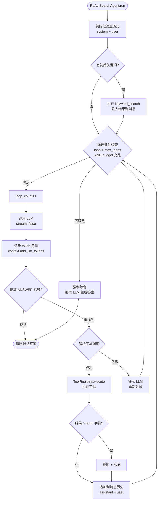

### 3.2.2 详细说明（400+ 字）

**循环机制**：ReAct Agent 的核心是一个 `while` 循环，持续执行"推理 → 行动 → 观察"直到满足终止条件。

**终止条件**（满足任一即退出）：
1. LLM 输出包含 `<ANSWER>...</ANSWER>` 标签
2. `loop_count >= max_loops`（默认 10）
3. `total_llm_tokens > max_token_budget`（默认 64000）

**工具调用解析**（`_parse_tool_call()`）：
- 支持多种格式：JSON `{"tool": "name", "arguments": {...}}`、函数调用风格 `name({...})`
- 先搜索 markdown 代码块中的 JSON，再搜索全文
- 如果解析失败，注入"nudge"消息提示 LLM 重新格式化

**Token 管理**：
- 每次 LLM 调用后，从 `response.usage` 提取 `total_tokens`
- 累加到 `SearchContext.total_llm_tokens`
- 检查 `is_budget_exceeded()` 决定是否继续

**结果截断策略**：
- 工具返回结果超过 8000 字符时截断
- 添加 `... [output truncated]` 标记
- 防止单次结果撑爆 token 预算

**设计亮点**：
- "nudge"机制优雅处理 LLM 不遵从指令的情况
- 初始关键词预执行减少首次循环开销
- 强制合成确保即使预算耗尽也有输出

---

## 3.3 知识编译流程（Knowledge Compilation）

### 3.3.1 Mermaid 流程图

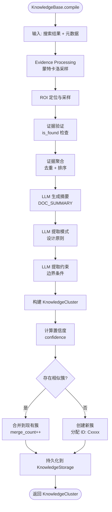

### 3.3.2 详细说明（400+ 字）

**流程目的**：将搜索过程中收集的零散证据编译为结构化的 KnowledgeCluster。

**蒙特卡洛采样**（`MonteCarloEvidenceSampling`）：
1. **ROI 定位**：根据关键词在文档中定位感兴趣区域
2. **随机采样**：从 ROI 中随机选取片段（避免顺序扫描偏差）
3. **证据验证**：使用 LLM 验证片段是否真正回答了查询（`is_found` 标记）
4. **结果封装**：生成 `EvidenceUnit` 列表

**LLM 生成阶段**：
- `DOC_SUMMARY` Prompt：为每个文档生成摘要
- `DOC_CHUNK_SUMMARY`：为每个片段生成摘要
- `DOC_MERGE_SUMMARIES`：合并多个摘要为统一视图
- 模式提取：3-5 条可泛化的设计原则
- 约束提取：边界条件与安全应用限制

**知识簇构建**：
- 分配全局唯一 ID（格式：`Cxxxx`）
- 设置初始 `lifecycle = EMERGING`
- 计算 `confidence` 分数（基于证据权重、一致性）
- 估算 `abstraction_level`（技术/原理/范式/基础/哲学）

**合并策略**：
- 当新簇与现有簇相似度 > 0.90 时触发合并
- `merge_count` 自增
- 证据列表合并去重
- `last_modified` 时间戳更新

---

## 3.4 知识进化流程（Knowledge Evolution）

### 3.4.1 Mermaid 流程图

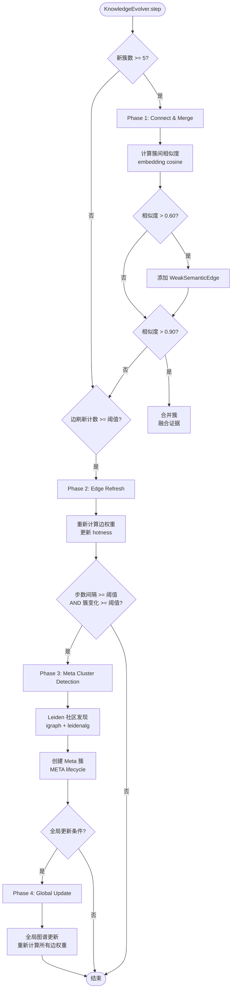

### 3.4.2 详细说明（400+ 字）

**进化触发**：每次 `AgenticSearch.search()` 完成后调用 `KnowledgeEvolver.step(cluster)`。

**四阶段进化**：

1. **Phase 1: Connect & Merge**（连接与合并）
   - 触发条件：新簇数 >= `_EVO_CONNECT_MERGE_COUNT`（默认 5）
   - 计算新簇与现有簇的嵌入余弦相似度
   - 相似度 > 0.60：添加 `WeakSemanticEdge`（弱语义边）
   - 相似度 > 0.90：合并两个簇（融合证据、模式、约束）

2. **Phase 2: Edge Refresh**（边刷新）
   - 触发条件：边刷新计数 >= `_EVO_EDGE_REFRESH_COUNT`
   - 重新计算所有 `WeakSemanticEdge` 的权重
   - 更新簇的 `hotness` 分数（反映查询覆盖率和更新频率）

3. **Phase 3: Meta Cluster Detection**（元簇检测）
   - 触发条件：步数间隔 >= `_EVO_STEP_INTERVAL` 且簇变化 >= `_EVO_META_DETECTION_COUNT`
   - 使用 **Leiden 算法**（igraph + leidenalg）进行社区发现
   - 将检测到的社区升级为 Meta 簇（`lifecycle = META`）

4. **Phase 4: Global Update**（全局更新）
   - 触发条件：步数间隔 >= `_EVO_STEP_INTERVAL` 且簇变化 >= `_EVO_GLOBAL_UPDATE_COUNT`
   - 重新计算全局知识图谱的所有边权重
   - 清理过期边和孤立节点

**设计 Rationale**：
- 分阶段触发避免每次搜索都执行昂贵的全局计算
- Leiden 算法（优于 Louvain）保证社区发现质量
- 弱语义边（统计/概率）与 RichSemanticEdge（可执行/语义）双层设计

---

## 3.5 文件上传与管理流程

### 3.5.1 Mermaid 流程图

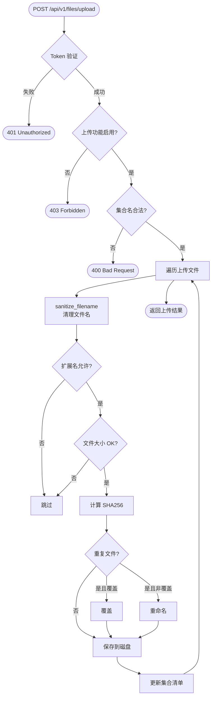

### 3.5.2 详细说明（400+ 字）

**入口**：`api/files.py` → `upload_files()` 端点，`POST /api/v1/files/upload`。

**安全控制**：
- Token 认证（`verify_token`）
- 功能开关（`SIRCHMUNK_UPLOAD_ENABLED`）
- 文件名清理（`sanitize_filename()`：去除路径分隔符和危险字符）
- 扩展名白名单（`_ALLOWED_EXTENSIONS`：PDF/DOCX/XLSX/TXT/MD 等）
- 大小限制（`SIRCHMUNK_UPLOAD_MAX_FILE_SIZE`，默认 1024MB）

**存储结构**：
```
{work_path}/uploads/
    {collection}/
        .manifest.json    <- 元数据索引
        file1.pdf
        file2.docx
```

**重复检测**：
- 计算文件 SHA256 哈希
- 与集合清单（`.manifest.json`）比对
- 重复文件可选择覆盖或自动重命名

**涉及文件**：
- `api/files.py` → 路由处理
- `api/file_service.py` → `FileStorageService` 业务逻辑
- `api/security.py` → `sanitize_filename()`

---

## 3.6 文档 QA 直读流程（Document QA Pipeline）

### 3.6.1 Mermaid 流程图

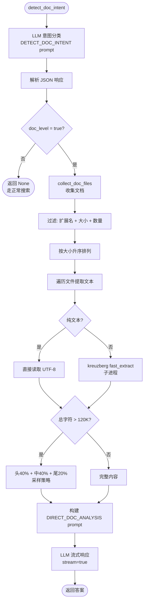

### 3.6.2 详细说明（400+ 字）

**触发条件**：当 `detect_doc_intent()` 返回非 None 值时，跳过 ReAct 循环，直接走文档 QA 管线。

**意图检测**：
- Prompt 模板 `DETECT_DOC_INTENT` 要求 LLM 返回 JSON `{"doc_level": true/false, "op": "summarize/translate/analyze"}`
- 解析策略：直接 JSON → 去除 markdown 代码块 → 正则提取第一个 `{...}`

**文件收集**（`collect_doc_files()`）：
- 支持路径列表（文件或目录）
- 目录仅扫描直接子文件（非递归，避免大规模扫描）
- 按文件扩展名过滤（`_DOC_EXTENSIONS`：PDF/DOCX/MD/TXT/HTML/JSON 等）
- 大小限制：单文件最大 10MB
- 数量限制：最多 5 个文件

**文本提取**：
- 纯文本文件：直接 `Path.read_text()`
- 二进制文件：`kreuzberg.fast_extract()`（子进程隔离，超时 600s）

**采样策略**：
- 总字符 > 120,000 时触发采样
- 头 40% + 中 40% + 尾 20% 比例
- 插入 `[...content sampled...]` 标记

**优势**：
- 避免 ReAct 循环的多轮 LLM 调用（节省成本）
- 适合明确的文档级操作（总结、翻译、分析）

---

## 3.7 树索引构建流程（Tree Indexing）

### 3.7.1 Mermaid 流程图

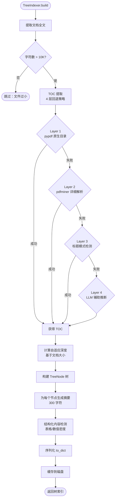

### 3.7.2 详细说明（400+ 字）

**目的**：为长文档构建层级结构索引，使 LLM 能够"导航"而非"暴力扫描"。

**TOC 提取（4 层回退）**：
1. **Layer 1 - pypdf 原生目录**：最高置信度、零成本，直接使用 PDF 内嵌书签
2. **Layer 2 - pdfminer.six**：详细解析 PDF 结构，提取文本块与位置
3. **Layer 3 - 标题模式检测**：正则匹配 Markdown 标题（`#`/`##`/`###`）或数字编号（`1.`、`1.1`、`1.1.1`）
4. **Layer 4 - LLM 辅助推断**：最后手段，将文档片段发送给 LLM 分析结构

**自适应深度**：
- 文档 > 100K 字符：最大深度 4
- 文档 > 50K 字符：最大深度 3
- 文档 > 20K 字符：最大深度 2

**结构化内容检测**：
- Markdown 表格行数 >= 3 → `content_type = "table"`
- 数值 token 密度 > 20% → 标记为结构化段落

**TreeNode 结构**：
- `node_id`：唯一标识（如 `N000000`）
- `title`：章节标题
- `summary`：300 字符摘要
- `char_range`：在全文中的字符范围 `[start, end)`
- `level`：层级深度
- `children`：子节点列表

---

## 3.8 缓存与存储同步流程

### 3.8.1 Mermaid 流程图

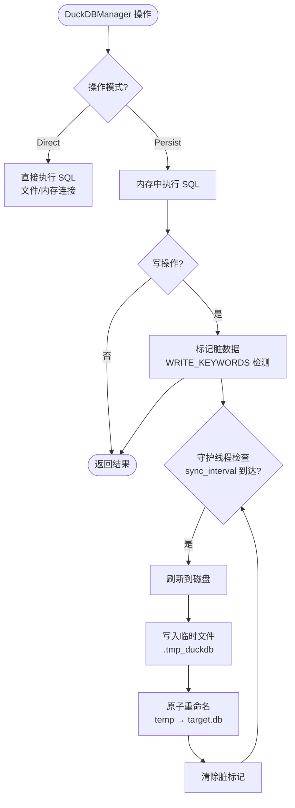

### 3.8.2 详细说明（400+ 字）

**双模式架构**：
- **Direct 模式**：标准文件连接或纯内存连接
- **Persist 模式**（默认）：内存数据库 + 守护线程定期回写

**Persist 模式优势**：
- 消除 DuckDB 文件锁定问题（多进程部署）
- 所有读写操作在内存中完成（零延迟）
- 守护线程周期性将脏数据刷新到磁盘

**脏数据检测**：
- SQL 关键字匹配：`INSERT`/`UPDATE`/`DELETE`/`CREATE`/`DROP`/`ALTER`/`COPY`
- 命中任一关键字即标记为脏

**原子写入**：
1. 写入临时文件 `.tmp_duckdb`
2. `os.rename()` 原子替换目标文件
3. 保证崩溃安全（不会出现半写文件）

**配置参数**：
- `sync_interval=60`：刷新间隔（秒）
- `sync_threshold=50`：脏操作阈值（达到即触发）

---

## 3.9 用户搜索时序图

### 3.9.1 Mermaid 时序图

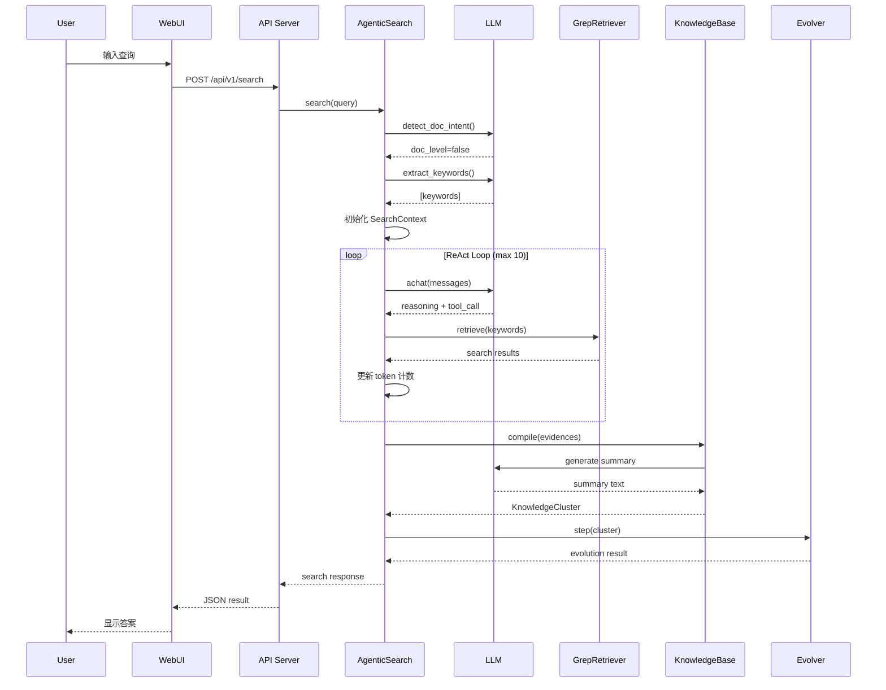

### 3.9.2 详细说明（400+ 字）

**时序概览**：完整展示从用户输入到结果返回的全链路交互。

**关键交互**：
1. **WebUI → API Server**：HTTP POST 请求，携带查询文本
2. **API Server → AgenticSearch**：调用 `search()` 方法
3. **AgenticSearch → LLM**：意图检测 + 关键词提取 + 循环推理
4. **GrepRetriever → 文件系统**：ripgrep-all 子进程检索
5. **KnowledgeBase → LLM**：摘要生成、模式提取
6. **Evolver → KnowledgeStorage**：知识持久化

**性能瓶颈**：
- LLM 调用（每次 5-30s）是主要延迟来源
- 循环次数越多，总延迟越高
- 并行化受限于 LLM 的序列化调用特性

---

## 3.10 ReAct 工具调用时序图

### 3.10.1 Mermaid 时序图

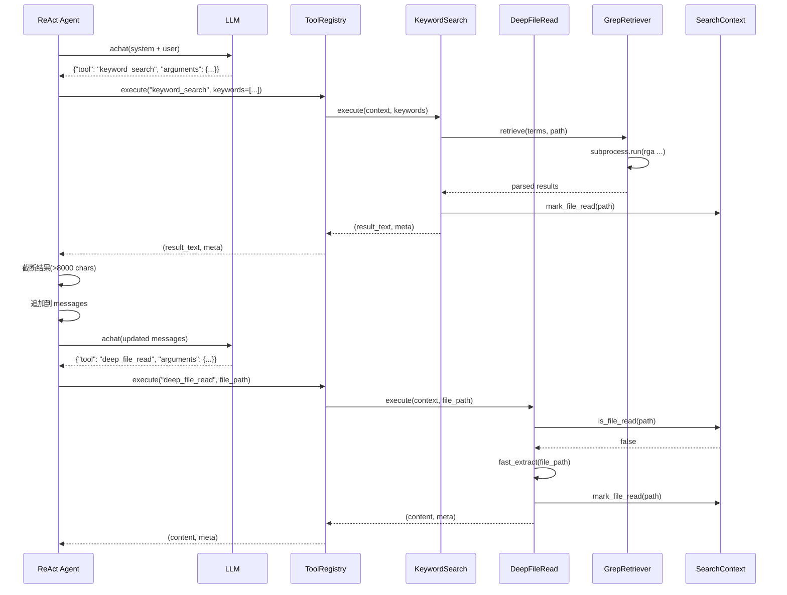

### 3.10.2 详细说明（400+ 字）

**工具调用生命周期**：
1. Agent 解析 LLM 输出中的工具调用
2. 调用 `ToolRegistry.execute(name, **kwargs)`
3. 工具执行检索/读取操作
4. 更新 SearchContext 状态
5. 返回结果给 Agent

**KeywordSearch 工具**：
- 调用 `GrepRetriever.retrieve()` 执行 rga 检索
- 支持布尔逻辑（AND/OR/NOT）
- 结果格式化为 LLM 可读文本

**DeepFileRead 工具**：
- 先检查 `SearchContext.is_file_read()` 去重
- 使用 `fast_extract()` 提取文本
- 大文件自动采样（头/中/尾）

---

## 3.11 知识进化触发时序图

### 3.11.1 Mermaid 时序图

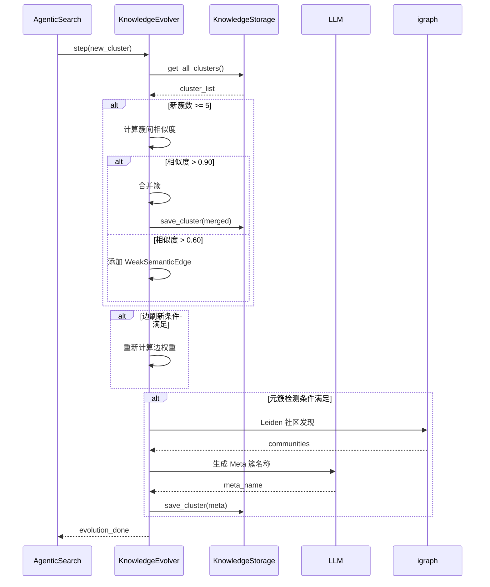

### 3.11.2 详细说明

**触发时机**：每次搜索完成后自动调用。

**四阶段条件**：
- Phase 1：新簇数 >= 5
- Phase 2：边刷新计数 >= 阈值
- Phase 3：步数间隔 + 簇变化双条件
- Phase 4：全局更新双条件

---

## 3.12 MCP 客户端交互时序图

### 3.12.1 Mermaid 时序图

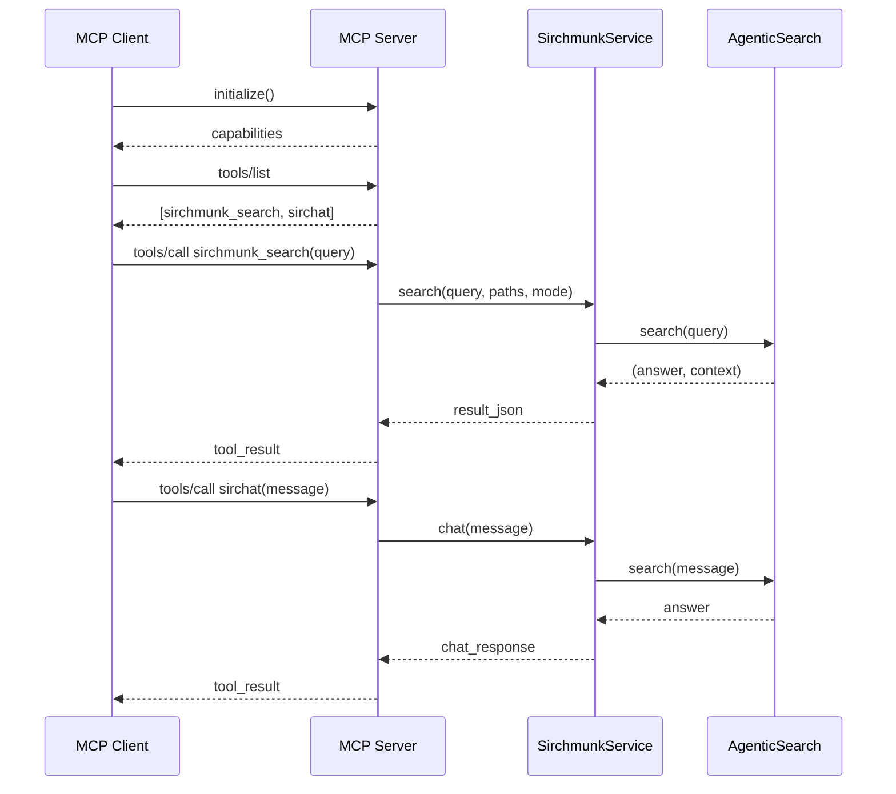

### 3.12.2 详细说明

**MCP 工具暴露**：
- `sirchmunk_search`：完整搜索 + 知识编译
- `sirchat`：简化聊天接口

**传输模式**：stdio（本地）/ HTTP（远程）

---

## 3.13 本章小结

本章通过 8 个核心流程和 5 个时序图，完整展示了 Sirchmunk 的运行机制：

| 流程 | 核心要点 |
|------|---------|
| 搜索管线 | 意图检测 → 关键词 → ReAct → 编译 → 进化 |
| ReAct 循环 | 推理-行动迭代，token 预算控制 |
| 知识编译 | 蒙特卡洛采样 + LLM 摘要 |
| 知识进化 | 四阶段渐进式图谱更新 |
| 文件上传 | 安全校验 + 重复检测 |
| 文档 QA | 直读管线，跳过 ReAct |
| 树索引 | 4 层 TOC 回退 + 自适应深度 |
| 缓存同步 | 内存 + 原子回写 |

---

☕️ 制作不易，请我喝咖啡☕️关注我➕