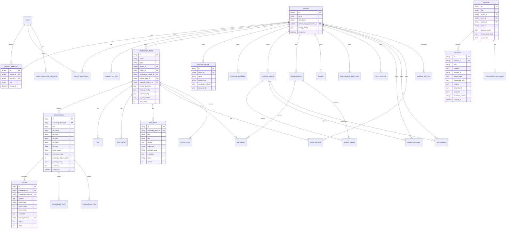
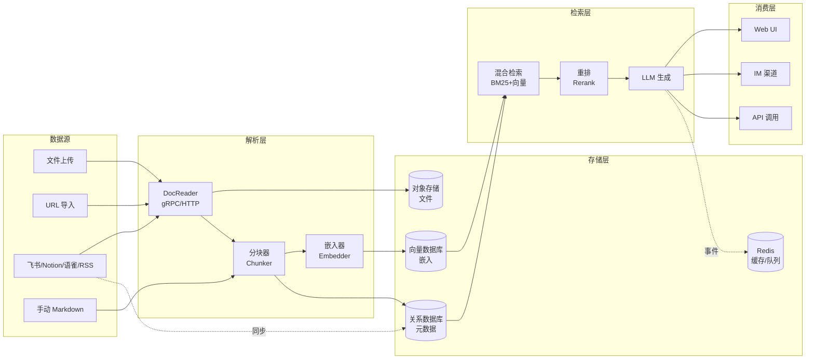

# 第 6 章 数据模型与数据库设计

> 详细描述 WeKnora 的数据模型设计，包括 ER 图、主要表结构、字段说明、索引、约束、缓存策略、事务设计和数据流向。

---

## 6.1 ER 图（实体关系图）



---

## 6.2 主要表结构详细设计

### 6.2.1 租户与用户域

#### `tenants`（租户表）

| 字段 | 类型 | 约束 | 说明 |
|------|------|------|------|
| id | uint64 | PK, auto-increment | 租户唯一标识 |
| name | varchar(255) | NOT NULL | 租户名称 |
| description | text | | 租户描述 |
| default_storage_backend_id | uint64 | FK → storage_backends | 默认存储后端 |
| storage_config | json | | 存储配置 |
| storage_quota | bigint | | 存储配额（字节）|
| created_at | datetime | | 创建时间 |
| updated_at | datetime | | 更新时间 |
| deleted_at | datetime | INDEX | 软删除（GORM）|

**索引**：`deleted_at`（软删除查询）

#### `tenant_members`（成员表）

| 字段 | 类型 | 约束 | 说明 |
|------|------|------|------|
| id | uint64 | PK | 成员记录 ID |
| tenant_id | uint64 | FK → tenants, INDEX | 租户 ID |
| user_id | uint64 | FK → users | 用户 ID |
| role | varchar(32) | NOT NULL | 角色（owner/admin/contributor/viewer）|
| joined_at | datetime | | 加入时间 |

**索引**：`(tenant_id, user_id)` 唯一索引（防止重复成员），`tenant_id`（按租户查询成员）

#### `tenant_invitations`（邀请表）

| 字段 | 类型 | 约束 | 说明 |
|------|------|------|------|
| id | uint64 | PK | 邀请 ID |
| tenant_id | uint64 | FK → tenants | 目标租户 |
| inviter_id | uint64 | FK → users | 邀请人 |
| invitee_email | varchar(255) | INDEX | 被邀请人邮箱 |
| token | varchar(255) | UNIQUE | 邀请 Token |
| status | varchar(32) | | pending/accepted/declined/expired |
| expires_at | datetime | | 过期时间 |

#### `tenant_api_keys`（API Key 表）

| 字段 | 类型 | 约束 | 说明 |
|------|------|------|------|
| id | uint64 | PK | Key ID |
| tenant_id | uint64 | FK → tenants | 租户 ID |
| name | varchar(255) | | Key 名称 |
| key_hash | varchar(255) | UNIQUE, INDEX | SHA-256 哈希（不存储明文）|
| key_prefix | varchar(16) | | 前缀（用于展示）|
| capabilities | json | | 能力列表 |
| scope_kb_ids | json | | 限制的知识库 ID |
| is_platform | bool | | 是否平台级 Key |
| expires_at | datetime | | 过期时间 |
| last_used_at | datetime | | 最后使用时间 |

**安全**：API Key 仅存储 SHA-256 哈希，明文仅在创建时返回一次。

### 6.2.2 知识库域

#### `knowledge_bases`（知识库表）

| 字段 | 类型 | 约束 | 说明 |
|------|------|------|------|
| id | varchar(36) | PK (UUID) | 知识库唯一标识 |
| name | varchar(255) | NOT NULL | 知识库名称 |
| type | varchar(32) | DEFAULT 'document' | 类型（document/faq/wiki）|
| is_temporary | bool | DEFAULT false | 是否临时（隐藏）|
| description | text | | 描述 |
| tenant_id | uint64 | FK → tenants, INDEX | 所属租户 |
| creator_id | varchar(36) | INDEX | 创建者（RBAC 用）|
| embedding_model_id | varchar(36) | FK → models | 嵌入模型 |
| vector_store_id | varchar(36) | FK → vector_stores | 向量库 |
| storage_backend_id | varchar(36) | FK → storage_backends | 存储后端 |
| chunking_config | json | | 分块配置 |
| retrieval_config | json | | 检索配置 |
| extract_config | json | | 抽取配置 |
| faq_index_mode | varchar(32) | | FAQ 索引模式 |
| is_wiki_enabled | bool | DEFAULT false | 是否启用 Wiki |
| doc_count | int | DEFAULT 0 | 文档计数（反规范化）|
| is_pinned | bool | DEFAULT false | 是否固定 |

**索引**：`tenant_id`（按租户查询），`creator_id`（RBAC 所有权查询），`(tenant_id, is_pinned)`（固定列表）

#### `knowledges`（知识文档表）

| 字段 | 类型 | 约束 | 说明 |
|------|------|------|------|
| id | varchar(36) | PK (UUID) | 文档唯一标识 |
| knowledge_base_id | varchar(36) | FK → knowledge_bases, INDEX | 所属知识库 |
| title | varchar(512) | | 文档标题 |
| file_name | varchar(512) | | 原始文件名 |
| file_type | varchar(64) | INDEX | 文件类型（pdf/docx/md/...）|
| file_path | varchar(1024) | | 存储路径（storage://backend/path）|
| file_hash | varchar(64) | INDEX | SHA-256 文件哈希（去重）|
| file_size | bigint | | 文件大小（字节）|
| parse_status | varchar(32) | INDEX | 解析状态 |
| summary_status | varchar(32) | | 摘要状态 |
| pending_subtasks_count | int | DEFAULT 0 | 待处理子任务计数 |
| process_config | json | | 处理配置覆盖 |
| summary | text | | 文档摘要 |
| source | varchar(64) | | 来源渠道 |
| source_detail | varchar(512) | | 来源详情 |

**索引**：`(knowledge_base_id, parse_status)`（按状态筛选），`(knowledge_base_id, file_type)`（按类型筛选），`file_hash`（去重）

**解析状态机**：
```
Pending → Processing → Finalizing → Completed
                    ↘ Failed
                    ↘ Deleting / Cancelled
```

#### `chunks`（分块表）

| 字段 | 类型 | 约束 | 说明 |
|------|------|------|------|
| id | varchar(36) | PK (UUID) | 分块唯一标识 |
| knowledge_id | varchar(36) | FK → knowledges, INDEX | 所属文档 |
| knowledge_base_id | varchar(36) | FK → knowledge_bases, INDEX | 所属知识库（反规范化）|
| content | text | | 分块文本内容 |
| chunk_type | varchar(32) | | 分块类型（text/parent_text/image_ocr/...）|
| chunk_index | int | | 分块序号 |
| token_count | int | | Token 数量 |
| metadata | json | | 元数据（页码/标题/位置等）|
| parent_chunk_id | varchar(36) | FK → chunks | 父分块（parent-child 策略）|
| status | int | | 分块状态（0=default,1=stored,2=indexed）|
| flags | int | | 标志位（recommended 等）|
| seq_id | bigint | UNIQUE, INDEX | 序列 ID（用户可见编号）|

**索引**：`(knowledge_id, chunk_index)`（按文档+序号查询），`(knowledge_base_id, chunk_type)`（按类型筛选），`seq_id`（用户可见编号查询）

**分块类型**：
| 类型 | 说明 |
|------|------|
| text | 普通文本分块 |
| parent_text | 父文本（仅上下文，不索引）|
| image_ocr | 图片 OCR 文本 |
| image_caption | 图片描述 |
| summary | 摘要 |
| entity | 实体 |
| relationship | 关系 |
| faq | FAQ 条目 |
| web_search | 网络搜索结果 |
| table_summary | 数据表摘要 |
| table_column | 数据表列描述 |
| wiki_page | Wiki 页面 |

### 6.2.3 会话与消息域

#### `sessions`（会话表）

| 字段 | 类型 | 约束 | 说明 |
|------|------|------|------|
| id | varchar(36) | PK (UUID) | 会话唯一标识 |
| title | varchar(255) | | 会话标题（自动/手动）|
| tenant_id | uint64 | FK → tenants, INDEX | 所属租户 |
| user_id | varchar(36) | FK → users, INDEX | 创建者 |
| agent_id | varchar(36) | FK → custom_agents | 关联 Agent |
| source | varchar(32) | | 来源（web/im/embed/api）|
| context_config | json | | 上下文配置 |
| last_request_state | json | | 最后请求状态（输入栏状态）|
| is_pinned | bool | | 是否固定 |
| last_message_at | datetime | INDEX | 最后消息时间（排序）|

**索引**：`(tenant_id, user_id, last_message_at)`（按用户+时间查询），`(tenant_id, source)`（按来源筛选）

#### `messages`（消息表）

| 字段 | 类型 | 约束 | 说明 |
|------|------|------|------|
| id | varchar(36) | PK (UUID) | 消息唯一标识 |
| session_id | varchar(36) | FK → sessions, INDEX | 所属会话 |
| role | varchar(32) | | 角色（user/assistant/system）|
| content | text | | 消息内容 |
| request_id | varchar(36) | INDEX | 请求 ID（配对 user/assistant）|
| agent_steps | json | | Agent 步骤（仅 assistant）|
| knowledge_refs | json | | 知识引用（分块/文档/网页）|
| images | json | | 图片列表 |
| attachments | json | | 附件列表 |
| tool_calls | json | | 工具调用（assistant 消息）|
| rendered_content | text | | 渲染后内容（含引用标记）|
| channel | varchar(64) | | 渠道标识 |

**索引**：`(session_id, created_at)`（按会话+时间查询），`request_id`（配对查询）

### 6.2.4 Wiki 域

#### `wiki_pages`（Wiki 页面表）

| 字段 | 类型 | 约束 | 说明 |
|------|------|------|------|
| id | varchar(36) | PK (UUID) | 页面唯一标识 |
| knowledge_base_id | varchar(36) | FK → knowledge_bases, INDEX | 所属知识库 |
| slug | varchar(255) | | URL 友好的标识 |
| title | varchar(512) | | 页面标题 |
| content | longtext | | Markdown 内容 |
| page_type | varchar(64) | | 页面类型（entity/concept/index/...）|
| category_path | varchar(1024) | | 分类路径（最多 3 层）|
| metadata | json | | 元数据（source_refs/links）|
| status | varchar(32) | | 状态（draft/published/archived）|
| version | int | DEFAULT 1 | 版本号 |
| created_by | varchar(36) | | 创建者 |

**索引**：`(knowledge_base_id, slug)` 唯一索引（同一 KB 内 slug 唯一），`(knowledge_base_id, category_path)`（按分类查询），`(knowledge_base_id, page_type)`（按类型筛选）

#### `wiki_log_entries`（Wiki 日志表）

| 字段 | 类型 | 约束 | 说明 |
|------|------|------|------|
| id | varchar(36) | PK | 日志 ID |
| knowledge_base_id | varchar(36) | FK, INDEX | 所属知识库 |
| action | varchar(64) | | 操作类型 |
| detail | text | | 操作详情 |
| created_at | datetime | INDEX | 创建时间 |

### 6.2.5 向量库与存储后端域

#### `vector_stores`（向量库表）

| 字段 | 类型 | 约束 | 说明 |
|------|------|------|------|
| id | varchar(36) | PK (UUID) | 向量库唯一标识 |
| tenant_id | uint64 | FK → tenants, INDEX | 所属租户 |
| name | varchar(255) | NOT NULL | 显示名称 |
| engine_type | varchar(50) | NOT NULL | 引擎类型（postgres/es/qdrant/milvus/...）|
| connection_config | json | | 连接配置（敏感字段 AES-GCM 加密）|
| index_config | json | | 索引配置（HNSW 参数等）|

**引擎类型**：
| 引擎 | 说明 |
|------|------|
| postgres | pgvector 扩展 |
| elasticsearch | ES 7.x/8.x |
| qdrant | Qdrant 向量数据库 |
| milvus | Milvus 向量数据库 |
| weaviate | Weaviate 向量数据库 |
| sqlite | sqlite-vec 本地向量 |
| doris | Apache Doris |
| tencent_vectordb | 腾讯向量数据库 |
| opensearch | OpenSearch |

#### `storage_backends`（存储后端表）

| 字段 | 类型 | 约束 | 说明 |
|------|------|------|------|
| id | varchar(36) | PK | 后端唯一标识 |
| tenant_id | uint64 | FK, INDEX | 所属租户 |
| name | varchar(255) | | 显示名称 |
| provider | varchar(64) | | 提供商（local/s3/tos/oss/obs/ks3/cos/minio）|
| config | json | | 配置（敏感字段加密）|
| is_default | bool | | 是否默认后端 |
| legacy_alias | varchar(64) | UNIQUE | 旧版别名（迁移用）|

### 6.2.6 共享与审计域

#### `kb_shares`（知识库共享表）

| 字段 | 类型 | 约束 | 说明 |
|------|------|------|------|
| id | uint64 | PK | 共享 ID |
| knowledge_base_id | varchar(36) | FK, INDEX | 知识库 ID |
| organization_id | uint64 | FK → organizations | 目标组织 |
| permission | varchar(32) | | 权限（viewer/editor）|

#### `audit_logs`（审计日志表）

| 字段 | 类型 | 约束 | 说明 |
|------|------|------|------|
| id | uint64 | PK | 日志 ID |
| tenant_id | uint64 | FK, INDEX | 租户 ID |
| actor_id | varchar(36) | INDEX | 操作者 |
| action | varchar(64) | INDEX | 操作类型 |
| target_type | varchar(64) | | 目标类型 |
| target_id | varchar(255) | | 目标 ID |
| detail | json | | 详情 |
| outcome | varchar(32) | | 结果（success/denied/error）|
| ip_address | varchar(64) | | IP 地址 |
| created_at | datetime | INDEX | 创建时间 |

**索引**：`(tenant_id, created_at)`（按租户+时间查询），`(tenant_id, action)`（按操作筛选），`(tenant_id, actor_id)`（按操作者筛选）

---

## 6.3 向量数据库 Schema

### 6.3.1 pgvector（PostgreSQL）

```sql
-- 启用扩展
CREATE EXTENSION IF NOT EXISTS vector;

-- 嵌入表（按知识库分表或共享表 + kb_id 过滤）
CREATE TABLE embeddings (
    id VARCHAR(36) PRIMARY KEY,
    chunk_id VARCHAR(36) NOT NULL,
    knowledge_base_id VARCHAR(36) NOT NULL,
    knowledge_id VARCHAR(36) NOT NULL,
    embedding vector(1024),  -- 维度可配置
    metadata jsonb,
    created_at timestamptz DEFAULT NOW()
);

-- HNSW 索引（1024 维优化）
CREATE INDEX ON embeddings
    USING hnsw (embedding vector_cosine_ops)
    WITH (m = 16, ef_construction = 200);

-- 过滤索引
CREATE INDEX ON embeddings (knowledge_base_id, knowledge_id);
```

### 6.3.2 Milvus

```json
{
    "collection_name": "weknora_{kb_id}",
    "fields": [
        {"name": "id", "type": "VARCHAR", "is_primary": true, "max_length": 36},
        {"name": "chunk_id", "type": "VARCHAR", "max_length": 36},
        {"name": "knowledge_id", "type": "VARCHAR", "max_length": 36},
        {"name": "embedding", "type": "FLOAT_VECTOR", "dim": 1024},
        {"name": "content", "type": "VARCHAR", "max_length": 65535}
    ],
    "index_params": {
        "index_type": "HNSW",
        "metric_type": "COSINE",
        "params": {"M": 16, "efConstruction": 200}
    }
}
```

### 6.3.3 Qdrant

```json
{
    "collection_name": "weknora_{kb_id}",
    "vectors": {"size": 1024, "distance": "Cosine"},
    "hnsw_config": {"m": 16, "ef_construct": 200},
    "payload_schema": {
        "chunk_id": {"type": "keyword"},
        "knowledge_id": {"type": "keyword"},
        "content": {"type": "text"}
    }
}
```

---

## 6.4 Redis 数据结构与缓存策略

### 6.4.1 会话流（SSE 事件）

```
Key: weknora:stream:{session_id}:{message_id}
Type: Stream (Redis Streams)
TTL: 24h
内容: SSE 事件序列（thinking/tool_result/answer/done）
```

**用途**：支持多实例 SSE 事件共享，客户端重连后从断点续传。

### 6.4.2 任务队列

```
Key: asynq:{queue}:{task_id}
Type: Hash
内容: 任务状态（pending/active/completed/failed）
```

**队列名称**：`core`、`postprocess`、`enrichment`、`maintenance`、`wiki`、`default`

### 6.4.3 限流计数器

```
Key: weknora:ratelimit:{scope}:{identifier}
Type: String (INCR + EXPIRE)
TTL: 60s（滑动窗口）

Key: weknora:embed:ratelimit:{channel_id}:{ip}
Type: String
TTL: 1m/1h/24h（多窗口）
```

### 6.4.4 系统设置发布订阅

```
Channel: weknora:system_settings:changed
Payload: {key, value, tenant_id}
```

**用途**：多实例设置变更实时同步。

### 6.4.5 Wiki 并发控制

```
Key: weknora:wiki:slug_lock:{kb_id}:{slug}
Type: String (SET NX EX)
TTL: 30s

Key: weknora:wiki:inflight:{kb_id}
Type: String (Lua 脚本原子计数)
```

### 6.4.6 KB 克隆进度

```
Key: weknora:kb_clone_progress:{task_id}
Type: Hash
Fields: total, completed, failed, status
TTL: 24h
```

---

## 6.5 事务设计

### 6.5.1 知识文档创建事务

```go
tx := db.Begin()
defer func() {
    if r := recover(); r != nil {
        tx.Rollback()
    }
}()

// 1. 创建 Knowledge 记录
tx.Create(&knowledge)

// 2. 创建初始 Span 记录
tx.Create(&span)

// 3. 更新知识库 doc_count
tx.Model(&kb).Update("doc_count", gorm.Expr("doc_count + 1"))

tx.Commit()
```

**隔离级别**：默认（Read Committed），`doc_count` 使用原子增量避免竞争。

### 6.5.2 Wiki 页面写入事务

```go
tx := db.Begin()

// 1. 写入页面
tx.Clauses(clause.OnConflict{
    UpdateAll: true,
}).Create(&page)

// 2. 更新入链（in_links）
for _, refSlug := range refSlugs {
    tx.Model(&WikiPage{}).
        Where("slug = ?", refSlug).
        Update("in_links", gorm.Expr("JSON_ARRAY_APPEND(...)"))
}

// 3. 写入日志
tx.Create(&logEntry)

tx.Commit()
```

**并发控制**：`withSlugLock` + `reserveInflightSlot` 确保同一 slug 串行写入。

### 6.5.3 租户创建事务

```go
tx := db.Begin()

// 1. 创建租户
tx.Create(&tenant)

// 2. 创建默认存储后端
tx.Create(&storageBackend)

// 3. 更新租户默认后端
tx.Model(&tenant).Update("default_storage_backend_id", storageBackend.ID)

// 4. 添加 Owner 成员
tx.Create(&member)

tx.Commit()
```

**回滚**：任一步骤失败 → 全部回滚，防止孤儿租户。

---

## 6.6 数据流向图



---

## 6.7 数据保留与归档策略

| 数据类型 | 保留策略 | 实现方式 |
|---------|---------|---------|
| 审计日志 | 90 天（可配置）| `AuditLogRetentionRunner` 每日清理 |
| SSE 事件流 | 24 小时 | Redis TTL |
| 临时文档 | 会话结束清理 | `temporaryDocumentService.CleanupExpired()` |
| 任务记录 | 7 天（可配置）| `PurgeArchivedRuntimeTasks` |
| Wiki 日志 | 永久保留 | 无自动清理 |
| 删除知识库 | 软删除 → 异步物理删除 | `deleted_at` + 异步任务 |

---

> **下一章**：[第 7 章 API 与接口设计](./07-api-design.md) — 150+ 端点的详细说明。

---

☕️ 制作不易，请我喝咖啡☕️关注我➕