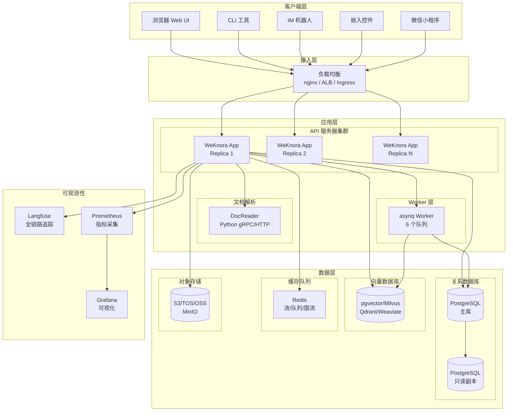
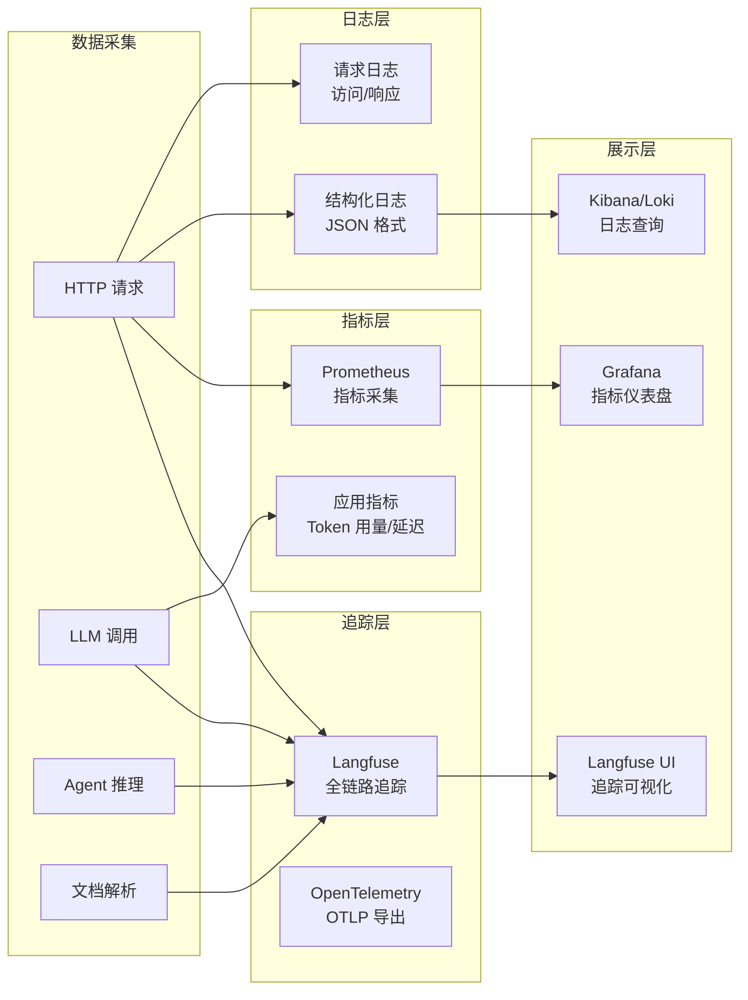

# 第 8 章 部署、运维与基础设施

> 详细描述 WeKnora 的部署架构、Docker 配置、Helm Chart、CI/CD 流程、监控日志告警、备份恢复方案。

---

## 8.1 部署架构图



---

## 8.2 Docker 配置

### 8.2.1 Docker 镜像清单

| 镜像 | Dockerfile | 基础镜像 | 说明 |
|------|-----------|---------|------|
| weknora-app | docker/Dockerfile.app | golang:1.26-bookworm → debian:12-slim | API 服务器 |
| weknora-ui | frontend/Dockerfile | node → nginx | 前端 SPA |
| weknora-docreader | docker/Dockerfile.docreader | python | 文档解析服务 |
| weknora-sandbox | docker/Dockerfile.sandbox | golang | Agent 技能沙箱 |
| weknora-odl-hybrid | docker/Dockerfile.odl-hybrid | | 混合数据加载器 |

### 8.2.2 Dockerfile.app 构建流程

**多阶段构建**：

```
Stage 1: Builder (golang:1.26-bookworm)
├── 安装 build-essential + libsqlite3-dev
├── 安装 golang-migrate 工具
├── go mod download（缓存挂载）
├── 下载 DuckDB（cmd/download/duckdb）
├── 复制源码
└── make build-prod（编译二进制）

Stage 2: Runtime (debian:12.12-slim)
├── 创建非 root 用户 appuser
├── 安装 ca-certificates + curl（健康检查）
├── 复制编译产物
├── 复制 yanyiwu 分词数据
├── 设置环境变量
└── USER appuser（非 root 运行）
```

**安全特性**：
- 非 root 用户运行
- 多阶段构建（最终镜像不含编译工具）
- `readOnlyRootFilesystem` 可选
- 健康检查：`curl -f http://localhost:8080/health`

**构建参数**：
- `GOPRIVATE_ARG`：私有 Go 模块
- `GOPROXY_ARG`：Go 代理
- `APK_MIRROR_ARG`：Debian 镜像加速
- `VERSION_ARG` / `COMMIT_ID_ARG` / `BUILD_TIME_ARG`：版本注入

### 8.2.3 docker-compose.yml 服务清单（24 个服务）

| 服务 | 镜像 | 端口 | 说明 |
|------|------|------|------|
| frontend | weknora-ui | 80 | Nginx 前端 |
| app | weknora-app | 8080 | API 服务器 |
| docreader | weknora-docreader | 50051 | 文档解析（gRPC）|
| redis | redis:7 | 6379 | 缓存/队列 |
| postgres | pgvector/pgvector:pg17 | 5432 | 关系数据库 + 向量 |
| sandbox | weknora-sandbox | | Agent 技能沙箱 |
| minio | minio | 9000/9001 | 对象存储 |
| milvus | milvusdb/milvus | 19530 | 向量数据库 |
| qdrant | qdrant/qdrant | 6333 | 向量数据库 |
| weaviate | semitechnologies/weaviate | 8080 | 向量数据库 |
| neo4j | neo4j:6 | 7474/7687 | 图谱数据库 |
| langfuse-web | langfuse/langfuse:2 | 3000 | 可观测性 UI |
| langfuse-worker | langfuse/langfuse:2 | | Langfuse Worker |
| langfuse-clickhouse | clickhouse | 8123 | Langfuse 存储 |
| langfuse-minio | minio | | Langfuse 对象存储 |
| searxng | searxng/searxng | 8080 | 元搜索引擎 |
| mcp | weknora-mcp | | MCP 服务器 |
| doris-fe/doris-be | apache/doris | | OLAP 数据库 |
| odl-hybrid | weknora-odl-hybrid | | 混合数据加载器 |
| dex | dexidp/dex | 5556 | OIDC 提供者 |

**服务依赖**：
```
frontend → app → redis + postgres + docreader
app → docreader（健康检查通过后才启动）
```

### 8.2.4 docker-compose.dev.yml（开发环境）

与生产配置主要差异：
- 使用 `air` 热重载（`.air.toml` 配置）
- 前端使用 Vite dev server（热更新）
- 端口映射到宿主机（便于 IDE 调试）
- 挂载源码目录（无需重建镜像）

### 8.2.5 Docker Profiles

```bash
# 核心服务（默认）
docker compose up -d

# 全功能
docker compose --profile full up -d

# Neo4j 图谱
docker compose --profile neo4j up -d

# MinIO 对象存储
docker compose --profile minio up -d

# Langfuse 追踪
docker compose --profile langfuse up -d

# 组合
docker compose --profile neo4j --profile minio up -d
```

---

## 8.3 Helm Chart

### 8.3.1 Chart 结构

```
helm/
├── Chart.yaml              # Chart 元数据
├── values.yaml             # 默认配置
├── templates/
│   ├── _helpers.tpl        # 模板辅助函数
│   ├── app.yaml            # API 服务器部署
│   ├── frontend.yaml       # 前端部署
│   ├── docreader.yaml      # 文档解析部署
│   ├── postgres.yaml       # PostgreSQL 有状态部署
│   ├── redis.yaml          # Redis 有状态部署
│   ├── ingress.yaml        # Ingress 路由
│   ├── secrets.yaml        # Secret 管理
│   ├── pvc.yaml            # 持久卷声明
│   ├── serviceaccount.yaml # RBAC
│   └── NOTES.txt           # 部署后说明
└── README.md
```

### 8.3.2 核心配置（values.yaml）

```yaml
global:
  storageClass: ""              # 存储类
  imagePullSecrets: []          # 镜像拉取密钥

app:
  enabled: true
  replicaCount: 1               # 副本数
  image:
    repository: wechatopenai/weknora-app
    tag: ""
    pullPolicy: IfNotPresent
  resources:
    requests:
      cpu: 100m
      memory: 256Mi
    limits:
      cpu: "1"
      memory: 1Gi

frontend:
  enabled: true
  replicaCount: 1

docreader:
  enabled: true

postgres:
  enabled: true
  image: pgvector/pgvector:pg17
  storage: 10Gi

redis:
  enabled: true
  storage: 5Gi
```

### 8.3.3 部署命令

```bash
# 安装
helm install weknora ./helm \
  --set app.image.tag=v0.7.1 \
  --set global.storageClass=standard

# 升级
helm upgrade weknora ./helm \
  --set app.image.tag=v0.7.1

# 卸载
helm uninstall weknora
```

---

## 8.4 CI/CD 配置

### 8.4.1 GitHub Actions Workflows

| Workflow | 文件 | 触发条件 | 功能 |
|---------|------|---------|------|
| cli-e2e | .github/workflows/cli-e2e.yml | PR / Push | CLI 端到端测试 |
| cli | .github/workflows/cli.yml | PR / Push | CLI 构建 + 单元测试 |
| docker-image | .github/workflows/docker-image.yml | Tag / Release | Docker 镜像构建推送 |
| release-lite | .github/workflows/release-lite.yml | Release | Lite 模式打包发布 |

### 8.4.2 Docker 镜像构建流程

```
触发: git tag v* 或 push to main
├── 设置 QEMU（多架构支持）
├── 设置 Docker Buildx
├── 登录 Docker Hub
├── 构建 weknora-app（linux/amd64 + linux/arm64）
├── 构建 weknora-ui（linux/amd64 + linux/arm64）
├── 构建 weknora-docreader
├── 推送镜像（带版本标签 + latest）
└── 更新 Docker Hub 描述
```

### 8.4.3 发布流程

```
1. 更新 CHANGELOG.md
2. 更新 VERSION 文件
3. 创建 git tag v0.7.1
4. Push tag 触发 docker-image workflow
5. GitHub Release 自动创建
6. Docker Hub 镜像自动推送
7. Homebrew formula 自动更新
```

---

## 8.5 数据库迁移

### 8.5.1 迁移工具

- **工具**：golang-migrate/migrate
- **引擎**：PostgreSQL / MySQL / SQLite / ParadeB
- **位置**：`migrations/{mysql,sqlite,versioned,paradedb}/`

### 8.5.2 迁移命令

```bash
# 创建迁移
make migrate-create NAME=add_column

# 升级
make migrate-up

# 降级
make migrate-down

# 查看版本
make migrate-version

# 强制版本
make migrate-force VERSION=5
```

### 8.5.3 迁移脚本执行时机

- **Docker**：`docker-entrypoint.sh` 启动时自动执行
- **Kubernetes**：Init Container 执行
- **手动**：`make migrate-up`

### 8.5.4 迁移脚本命名规范

```
{version}_{description}.{up|down}.sql

示例：
000000_init.up.sql
000000_init.down.sql
000001_agent.up.sql
000001_agent.down.sql
```

---

## 8.6 监控、日志与告警

### 8.6.1 可观测性架构



### 8.6.2 Langfuse 集成

**追踪内容**：
- HTTP 请求 Span（方法、路径、状态码、延迟）
- LLM 调用 Span（模型、Token 用量、耗时）
- Agent 推理 Span（agent.execute → agent.round.N → chat/tool）
- 文档解析 Span（5 阶段 Trace 树）

**配置**：
```env
LANGFUSE_PUBLIC_KEY=pk-lf-xxx
LANGFUSE_SECRET_KEY=sk-lf-xxx
LANGFUSE_HOST=http://langfuse-web:3000
```

**W3C traceparent 传播**：支持跨服务追踪上下文传递。

### 8.6.3 结构化日志

**日志格式**：
```json
{
    "level": "info",
    "time": "2024-01-01T00:00:00Z",
    "request_id": "req-uuid",
    "message": "request completed",
    "method": "POST",
    "path": "/api/v1/sessions",
    "status": 200,
    "latency_ms": 150,
    "client_ip": "1.2.3.4"
}
```

**日志级别**：
| 级别 | 场景 |
|------|------|
| Debug | 开发调试信息 |
| Info | 正常操作记录 |
| Warn | 非致命异常 |
| Error | 错误事件 |

**敏感信息脱敏**：
- 密码/Token/API Key/Secret → `***`
- OAuth code/state/token → 脱敏
- 请求体敏感字段 → 正则匹配脱敏

### 8.6.4 关键监控指标

| 指标 | 类型 | 说明 |
|------|------|------|
| http_request_duration_seconds | Histogram | HTTP 请求延迟 |
| http_requests_total | Counter | HTTP 请求计数 |
| llm_call_duration_seconds | Histogram | LLM 调用延迟 |
| llm_tokens_total | Counter | LLM Token 用量 |
| agent_iterations_total | Counter | Agent 迭代次数 |
| task_queue_depth | Gauge | 任务队列深度 |
| task_processing_duration | Histogram | 任务处理延迟 |
| embedding_duration_seconds | Histogram | 嵌入生成延迟 |
| search_duration_seconds | Histogram | 检索延迟 |

### 8.6.5 告警规则（建议）

| 规则 | 条件 | 严重级别 |
|------|------|---------|
| 高错误率 | 5xx 错误率 > 5%（5 分钟）| Critical |
| 高延迟 | P95 延迟 > 3s（5 分钟）| Warning |
| 任务队列积压 | 队列深度 > 100（10 分钟）| Warning |
| LLM 调用失败 | LLM 错误率 > 10%（5 分钟）| Critical |
| 数据库连接耗尽 | 连接池使用率 > 80%| Warning |
| 磁盘使用率 | 磁盘使用 > 85%| Warning |

---

## 8.7 备份与恢复方案

### 8.7.1 备份策略

| 数据类型 | 备份方式 | 频率 | 保留期 |
|---------|---------|------|--------|
| PostgreSQL | pg_dump / WAL 归档 | 每日全量 + 实时 WAL | 30 天 |
| Redis | RDB 快照 | 每日 | 7 天 |
| 对象存储 | 跨区域复制 | 实时 | 永久 |
| 配置文件 | Git 版本控制 | 每次变更 | 永久 |
| Langfuse 数据 | ClickHouse 备份 | 每日 | 30 天 |

### 8.7.2 备份脚本示例

```bash
# PostgreSQL 备份
pg_dump -h localhost -U weknora weknora | gzip > backup_$(date +%Y%m%d).sql.gz

# Redis 备份
redis-cli BGSAVE
cp /data/dump.rdb /backup/redis_$(date +%Y%m%d).rdb

# 对象存储同步
aws s3 sync s3://weknora-prod s3://weknora-backup
```

### 8.7.3 恢复流程

```bash
# PostgreSQL 恢复
gunzip < backup_20240101.sql.gz | psql -h localhost -U weknora weknora

# Redis 恢复
cp /backup/redis_20240101.rdb /data/dump.rdb
redis-cli SHUTDOWN
# 重启 Redis 自动加载
```

### 8.7.4 灾难恢复

| 场景 | RTO | RPO | 恢复方式 |
|------|-----|-----|---------|
| 单实例故障 | 5 分钟 | 0 | K8s 自动重启 |
| 数据库主库故障 | 15 分钟 | < 1 分钟 | 切换只读副本 |
| 完全灾难 | 1 小时 | 1 小时 | 从备份恢复 |

---

## 8.8 Lite 模式与精简部署

### 8.8.1 Lite 模式特点

| 特性 | 分布式模式 | Lite 模式 |
|------|-----------|----------|
| 任务队列 | Redis/asynq | 内存 goroutine |
| 流管理 | Redis Stream | 内存 Map |
| 并发治理 | Redis 信号量 | 本地信号量 |
| 任务仪表盘 | asynq Inspector | no-op |
| 多实例支持 | 是 | 否 |
| 依赖 | Redis | 无外部依赖 |

### 8.8.2 单文件部署

```bash
# SQLite 单文件部署（无需 PostgreSQL/Redis）
export DB_DRIVER=sqlite
export DB_PATH=./weknora.db
export STORAGE_TYPE=local
export STORAGE_PATH=./storage
./weknora-app
```

### 8.8.3 最小 Docker Compose

```yaml
version: '3'
services:
  app:
    image: wechatopenai/weknora-app:latest
    ports:
      - "8080:8080"
    environment:
      DB_DRIVER: sqlite
      DB_PATH: /data/weknora.db
      STORAGE_TYPE: local
      STORAGE_PATH: /data/storage
    volumes:
      - ./data:/data
```

---

## 8.9 环境变量参考

### 8.9.1 核心环境变量

| 变量 | 默认值 | 说明 |
|------|--------|------|
| WEKNORA_VERSION | latest | 版本号 |
| GIN_MODE | debug | Gin 模式（debug/release）|
| SERVER_HOST | 0.0.0.0 | 监听地址 |
| SERVER_PORT | 8080 | 监听端口 |
| DB_DRIVER | postgres | 数据库驱动 |
| DB_HOST | postgres | 数据库地址 |
| DB_PORT | 5432 | 数据库端口 |
| DB_USER | weknora | 数据库用户 |
| DB_PASSWORD | | 数据库密码 |
| DB_NAME | weknora | 数据库名 |
| REDIS_ADDR | redis:6379 | Redis 地址 |
| REDIS_PASSWORD | | Redis 密码 |
| STORAGE_TYPE | local | 存储类型 |
| SYSTEM_AES_KEY | | AES-256 加密密钥（32 字节）|
| DOCREADER_ADDR | docreader:50051 | DocReader 地址 |
| DOCREADER_TRANSPORT | grpc | DocReader 传输协议 |
| LANGFUSE_HOST | | Langfuse 地址 |
| WEKNORA_SANDBOX_MODE | | 沙箱模式（启用技能）|
| WEKNORA_BOOTSTRAP_SYSTEM_ADMIN_EMAIL | | 首个管理员邮箱 |

### 8.9.2 安全环境变量

| 变量 | 说明 |
|------|------|
| SYSTEM_AES_KEY | AES-256-GCM 加密密钥（必须 32 字节）|
| REDIS_PASSWORD | Redis 密码 |
| DB_PASSWORD | 数据库密码 |
| JWT_SECRET | JWT 签名密钥 |
| DOCREADER_TOKEN | DocReader 认证 Token |

---

> **下一章**：[第 9 章 改进建议、风险点与未来规划](./09-improvements.md) — 优缺点分析、优化建议、技术债。

---

☕️ 制作不易，请我喝咖啡☕️关注我➕