# 06 · 数据模型

## 6.1 存储架构总览

AsterMem 采用 **四存储并行**架构，每条 Memory 的数据分散在四个地方，各司其职：

```
┌─────────────────────────────────────────────────────────┐
│                    Memory 数据                           │
├──────────────┬──────────┬──────────┬───────────────────┤
│  Markdown    │  SQLite  │  Chroma  │  Whoosh           │
│  (人类可读)   │ (结构化) │ (向量)   │  (全文索引)        │
├──────────────┼──────────┼──────────┼───────────────────┤
│ frontmatter  │ 元数据   │ embedding│ 倒排索引           │
│ + content    │ + 关系   │ + meta   │ + jieba 分词       │
├──────────────┼──────────┼──────────┼───────────────────┤
│ 备份/编辑    │ 查询/统计│ 语义搜索 │ 关键词搜索         │
└──────────────┴──────────┴──────────┴───────────────────┘
```

## 6.2 Markdown 文件格式（Source of Truth）

每条 Memory 对应一个 `.md` 文件，使用 YAML Front Matter：

```yaml
---
id: mem_a1b2c3d4e5f6
title: "团队技术决策记录"
tags: ["work/decisions", "team", "architecture"]
priority: 8
version: 3
status: active
source: api              # api | user
created_at: 2026-07-20T10:30:00
updated_at: 2026-07-29T14:22:00
---

## 决策内容

我们决定采用 FastAPI 作为后端框架...

## 理由

1. 异步支持好
2. 自动生成 OpenAPI 文档
...
```

**文件路径规则**：

```
./data/memories/
├── api/              # Agent/API 创建的记忆
│   ├── mem_a1b2.md
│   └── mem_c3d4.md
└── user/             # 用户手工创建/编辑的记忆
    ├── mem_e5f6.md
    └── notes.md      # 无 frontmatter 的纯 MD 也能被识别
```

**ID 生成规则**（`models.py`）：`mem_` + 12 位随机十六进制，如 `mem_a1b2c3d4e5f6`。

## 6.3 SQLite 表结构

SQLite 是结构化查询的核心，存储元数据、关系、版本历史等。

### ER 图

```mermaid
erDiagram
    memories ||--o{ trunks : "document_id"
    memories ||--o{ memory_history : "memory_id"
    memories ||--o{ time_events : "memory_id"
    memories }o--o{ entities : "via entity_relations"
    memories ||--o{ profile_claims : "source_memory_id"
    profile_claims }o--|| profile_versions : "version_id"
    profile_fields ||--o{ profile_field_history : "field_key"
    admins ||--o{ sessions : "admin_id"
    admins ||--o{ api_tokens : "created_by_admin"

    memories {
        TEXT id PK "mem_xxxx"
        TEXT title
        TEXT content
        TEXT tags_json "JSON array"
        INTEGER priority "1-10"
        INTEGER version "乐观锁"
        TEXT status "active|archived"
        TEXT source "api|user"
        TEXT file_path "相对路径"
        TEXT trunk_status "not_chunked|chunking|chunked"
        DATETIME created_at
        DATETIME updated_at
    }

    trunks {
        TEXT id PK "trunk_xxxx"
        TEXT document_id FK "→ memories.id"
        INTEGER order "段落顺序"
        TEXT content "分片内容"
        TEXT summary "AI 生成摘要"
        TEXT tags_json "AI 生成标签"
        TEXT meta_tags_json "隐式标签"
        TEXT status "pending|ready"
        DATETIME created_at
        DATETIME updated_at
    }

    memory_history {
        INTEGER id PK
        TEXT memory_id FK
        INTEGER version
        TEXT title
        TEXT content
        TEXT tags_json
        TEXT action "update|delete|restore"
        DATETIME changed_at
    }

    time_events {
        INTEGER id PK
        TEXT memory_id FK
        TEXT event_type "todo|event|deadline"
        TEXT title
        DATETIME event_date
        TEXT status "pending|completed"
        TEXT extraction_source "ai|manual"
    }

    entities {
        INTEGER id PK
        TEXT name UK
        TEXT type "person|place|org|..."
        TEXT aliases_json
        INTEGER mention_count
    }

    entity_relations {
        INTEGER id PK
        INTEGER subject_id FK "→ entities.id"
        INTEGER object_id FK "→ entities.id"
        TEXT relation_type
        TEXT memory_id FK "来源记忆"
        REAL confidence
    }

    profile_fields {
        TEXT key PK "nickname|gender|..."
        TEXT value
        TEXT source "manual|distilled"
        DATETIME updated_at
    }

    profile_field_history {
        INTEGER id PK
        TEXT field_key FK
        TEXT old_value
        TEXT new_value
        DATETIME changed_at
    }

    profile_versions {
        INTEGER id PK
        TEXT status "active|archived|draft"
        DATETIME created_at
        TEXT claims_json
    }

    profile_claims {
        INTEGER id PK
        INTEGER version_id FK
        TEXT claim_text
        TEXT source_memory_id FK "→ memories.id"
        TEXT status "pending|active|rejected|contradicted"
        REAL confidence
        DATETIME created_at
    }

    admins {
        INTEGER id PK
        TEXT username UK
        TEXT password_hash "SHA-256 salted"
        DATETIME created_at
        DATETIME last_login
    }

    sessions {
        INTEGER id PK
        TEXT session_id UK "token_urlsafe(32)"
        INTEGER admin_id FK
        DATETIME created_at
        DATETIME expires_at "24h"
    }

    api_tokens {
        INTEGER id PK
        TEXT name
        TEXT token UK "ast_xxxxx"
        TEXT scopes_json "5级权限"
        BOOLEAN is_active
        DATETIME created_at
        DATETIME last_used
    }
```



### 关键表说明

**memories（记忆主表）**

| 字段 | 类型 | 说明 |
|------|------|------|
| id | TEXT PK | `mem_` + 12 位 hex |
| tags_json | TEXT | JSON 数组，如 `["work/decisions","team"]` |
| priority | INTEGER | 1-10，默认 5，8+ 用于重要事项 |
| version | INTEGER | 乐观锁版本号，每次更新 +1 |
| status | TEXT | `active`（正常）/ `archived`（归档） |
| trunk_status | TEXT | `not_chunked` / `chunking` / `chunked` |
| file_path | TEXT | 相对于 memories_dir 的路径 |

**trunks（段落分片表）**

| 字段 | 类型 | 说明 |
|------|------|------|
| id | TEXT PK | `trunk_` + 12 位 hex |
| document_id | TEXT FK | 所属 Memory |
| order | INTEGER | 在文档中的顺序（0-based） |
| status | TEXT | `pending`（处理中）/ `ready`（可用） |
| meta_tags_json | TEXT | AI 抽取的隐式标签（区别于显式 tags） |

**profile_claims（用户画像声明）**

每条 claim 必须包含 `source_memory_id`（硬约束），实现来源可追溯。

## 6.4 ChromaDB 向量索引

### 双 Collection 设计

```python
# vector.py
self.collection = client.get_or_create_collection(
    name="memories",                         # 文档级向量
    metadata={"hnsw:space": "cosine"}        # 余弦相似度
)

self.trunk_collection = client.get_or_create_collection(
    name="trunks",                           # 段落级向量
    metadata={"hnsw:space": "cosine"}
)
```

### memories Collection

| 字段 | 说明 |
|------|------|
| id | Memory ID（`mem_xxxx`） |
| embedding | `title + "\n\n" + content` 的向量 |
| metadata | `{title, tags, priority, source}` |
| document | 原始文本（`title + content`） |

### trunks Collection

| 字段 | 说明 |
|------|------|
| id | Trunk ID（`trunk_xxxx`） |
| embedding | **`title_resolver(doc_id) + "\n" + trunk.content`** 的向量 |
| metadata | `{document_id, order, tags, summary}` |
| document | Trunk 原始内容 |

**关键设计**（`_trunk_embedding_text`）：

```python
def _trunk_embedding_text(self, trunk):
    """Chunk 在被拆分后常丢失主语——如"## 决策风格 - 重度依赖直觉"
    这种片段不含人名，查询"我是谁"时得分很低。
    前缀加上所属 Memory 的 title，让每个 chunk 重获文档上下文。"""
    title = self.title_resolver(trunk.document_id)
    return f"{title}\n{trunk.content}" if title else trunk.content
```

### 相似度转换

ChromaDB 返回的是 **cosine distance**（距离），AsterMem 转换为 similarity（相似度）：

```python
score = 1 - distance  # distance ∈ [0, 2], similarity ∈ [-1, 1]
```

## 6.5 Whoosh 全文索引

### 索引结构

Whoosh 维护两个索引段：

1. **文档级索引** — 对 Memory 的 title + content 建立倒排索引
2. **Trunk 级索引** — 对每个 Trunk 的 content + meta_tags 建立倒排索引

### 中文分词

使用 **jieba** 中文分词库：

```python
# whoosh_search.py
from jieba.analyse import ChineseAnalyzer

analyzer = ChineseAnalyzer()  # 自动处理中英文混合分词
```

**设计意图**：Whoosh 默认的英文分词器对中文（无空格分隔）效果差，jieba 专门优化中文切词。

### 搜索增强

Trunk 级搜索支持 **Meta Tag 增强**：

```python
# 如果 Trunk 的 meta_tags 也匹配关键词，分数最高加 30%
meta_boost = min(meta_matches * 0.1, 0.3)
final_score = min((score / 10) + meta_boost, 1.0)
```

## 6.6 数据一致性策略

### 写入一致性

```
Memory 写入 → SyncManager 协调：
  1. MD 文件     ← 同步写入（必须成功）
  2. SQLite      ← 同步写入（必须成功）
  3. Whoosh      ← 同步写入（失败只警告）
  4. Chroma      ← 后台线程（失败不影响主流程）
```

**策略**：MD 和 SQLite 是强一致的（任一失败则整体失败回滚），Chroma 允许最终一致。

### 读取降级

```
搜索请求 → SearchEngine：
  语义搜索可用？→ hybrid 模式（关键词 + 语义）
  语义不可用？  → keyword 模式（纯 Whoosh）
```

### 中断恢复

- **向量索引重建中断** → `resume_incomplete_rebuild()` 下次启动自动恢复
- **分片任务中断** → `recover_interrupted_documents()` 下次启动自动恢复
- **Chroma 集合丢失** → `_ensure_collection()` 自动重建

## 6.7 备份与迁移

### 备份 = 拷贝目录

```
./data/                     ← 备份这个目录即可
├── memories/
│   ├── api/*.md            ← 人类可读的记忆原文
│   └── user/*.md
├── memories.db             ← SQLite（元数据 + 关系）
├── chroma/                 ← 向量索引（可重建）
├── whoosh_index/           ← 全文索引（可重建）
├── config.yaml             ← 配置
└── profile/                ← 用户画像
    ├── fields.yaml
    └── manual.md
```

**关键**：`chroma/` 和 `whoosh_index/` 可以删除后从 MD + SQLite 重建，**MD 文件是终极 Source of Truth**。

### 导入导出

```python
# storage.py export_memories()
# 输出 ZIP 格式：
# ├── mem_xxxx.md            ← 每条记忆的 MD 文件
# ├── mem_yyyy.md
# └── index.json             ← 导出元信息 + 所有记忆的结构化数据
```

### 版本迁移

`normalize_config()` 在每次启动时运行，处理：
- 旧版 Provider 配置 → 新版 Provider 注册表（3 个版本迭代）
- 旧版 `min_similarity` → 新版 noise_floor 语义
- 无效 active provider → 清空选择

---

*上一章：[05 · 核心代码走读](05-code-walkthrough.md)* · *下一章：[07 · API 设计](07-api.md)*

---

# ❤️ 制作不易，请我喝咖啡☕️关注我➕

