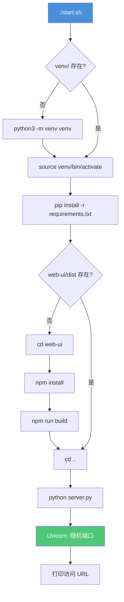
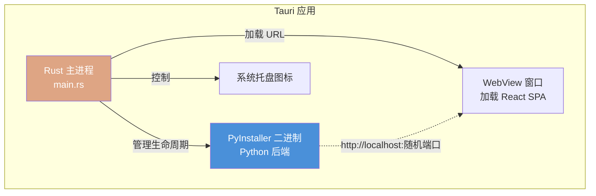

# 08 · 部署运维

## 8.1 部署方式总览

AsterMem 支持 4 种部署方式，从简到繁：

| 方式 | 适合场景 | 端口 | 数据位置 |
|------|----------|------|----------|
| 源码 + start.sh | 开发、个人使用 | 随机 8000-9000 | `./data/` |
| Docker Compose | 服务器快速部署 | 固定 8768 | Docker volume |
| Tauri 桌面应用 | 非技术用户 | 随机 | `%APPDATA%/AsterMem/` |
| Demo (systemd) | 公开 Demo | 8768 | `/opt/astermem-demo/data/` |

## 8.2 源码部署（推荐开发者）

### 前置条件

- Python 3.10+（推荐 3.11）
- Node.js 18+（仅构建 UI 时需要）
- npm 或 pnpm

### 一键启动

```bash
git clone https://github.com/Asterove/AsterMem.git
cd AsterMem
./start.sh
```

`start.sh` 是幂等的，执行流程：



### 端口策略

首次启动时，`server.py` 从 8000-9000 范围随机选择一个可用端口：

```python
# server.py（简化逻辑）
preferred_ports = [8765, 8000, 8080, ...]
# 尝试 preferred，如果被占用则随机 8000-9000
# 选定后写入 config.yaml，后续固定
```

**设计意图**（注释）：避开 macOS ControlCenter 占用的 5000 端口；首次随机降低局域网扫描风险；固定后方便 Agent 连接。

### 环境变量

从 `.env.example` 创建 `.env`：

```bash
# .env — Provider API Keys（明文存此文件，不入 config.yaml）

# OpenAI
OPENAI_API_KEY=sk-xxxxxxxxxxxx

# Anthropic
ANTHROPIC_API_KEY=sk-ant-xxxxxxxxxxxx

# Google
GOOGLE_API_KEY=AIzaxxxxxxxxxxxx

# DeepSeek
DEEPSEEK_API_KEY=sk-xxxxxxxxxxxx

# 通义千问 / 阿里
DASHSCOPE_API_KEY=sk-xxxxxxxxxxxx

# 智谱 GLM
ZHIPU_API_KEY=xxxxxxxx.xxxxxxxx

# Moonshot / Kimi
MOONSHOT_API_KEY=sk-xxxxxxxxxxxx

# LM Studio（本地，无需 Key）
# Ollama（本地，无需 Key）
```

### 开发模式

```bash
# 后端热重载 + 前端热重载分离
./start.sh --dev

# 后端：uvicorn --reload（监听 backend/ 变更）
# 前端：vite dev server（监听 web-ui/src/ 变更）
```

## 8.3 Docker 部署

### docker-compose.yml

```yaml
version: '3.8'
services:
  astermem:
    build: .
    ports:
      - "8768:8765"           # 固定映射到 8768
    volumes:
      - ./data:/app/data      # 数据持久化
      - ./config.yaml:/app/config.yaml  # 配置持久化
    environment:
      - OPENAI_API_KEY=${OPENAI_API_KEY}
    restart: unless-stopped
```

### Dockerfile

```dockerfile
FROM python:3.11-slim

WORKDIR /app

# 安装系统依赖（ChromaDB 的 C++ 扩展需要）
RUN apt-get update && apt-get install -y \
    build-essential \
    && rm -rf /var/lib/apt/lists/*

# Python 依赖
COPY requirements.txt .
RUN pip install --no-cache-dir -r requirements.txt

# 预构建前端（多阶段构建可优化）
COPY web-ui ./web-ui
RUN cd web-ui && npm install && npm run build

# 应用代码
COPY backend ./backend
COPY server.py .

EXPOSE 8765
CMD ["python", "server.py"]
```

### 启动

```bash
# 创建 .env 文件配置 API Key
echo "OPENAI_API_KEY=sk-xxx" > .env

# 启动
docker compose up -d

# 查看日志
docker compose logs -f

# 停止
docker compose down
```

### 数据备份

```bash
# Docker volume 备份
docker run --rm -v astermem_data:/data -v $(pwd):/backup \
  alpine tar czf /backup/astermem-backup-$(date +%Y%m%d).tar.gz /data
```

## 8.4 Tauri 桌面应用

### 架构



### 构建流程

桌面应用通过 **GitHub Actions** 自动构建：

```yaml
# .github/workflows/（简化）
strategy:
  matrix:
    os: [macos-latest, ubuntu-latest, windows-latest]

steps:
  - uses: actions/checkout@v4
  - name: Setup Python
    uses: actions/setup-python@v5
    with:
      python-version: '3.11'

  - name: Build Python binary (PyInstaller)
    run: |
      pip install pyinstaller
      pyinstaller --onefile server.py

  - name: Setup Node
    uses: actions/setup-node@v4

  - name: Build frontend
    run: |
      cd web-ui
      npm install && npm run build

  - name: Setup Rust
    uses: dtolnay/rust-toolchain@stable

  - name: Build Tauri app
    run: |
      cd desktop
      cargo tauri build
```

### 产物

| 平台 | 产物 | 大小（估） |
|------|------|-----------|
| macOS | `.dmg` / `.app` | ~80MB（含 Python 二进制） |
| Windows | `.msi` / `.exe` | ~70MB |
| Linux | `.AppImage` / `.deb` | ~75MB |

## 8.5 Demo 部署（systemd）

项目提供 Demo 环境的 systemd service 配置：

```ini
# deploy/systemd/astermem-demo.service
[Unit]
Description=AsterMem Demo Service
After=network.target

[Service]
Type=simple
User=astermem
WorkingDirectory=/opt/astermem-demo
ExecStart=/opt/astermem-demo/venv/bin/python server.py
Restart=always
RestartSec=10

[Install]
WantedBy=multi-user.target
```

```bash
sudo cp deploy/systemd/astermem-demo.service /etc/systemd/system/
sudo systemctl enable astermem-demo
sudo systemctl start astermem-demo
```

## 8.6 运维操作手册

### 离线密码重置

忘记管理员密码时，可在服务器本地执行：

```bash
cd /path/to/AsterMem
python server.py --reset-admin
# → 重置为 admin / admin，清除所有 session
```

**安全约束**：此命令只能在本地机器执行（需要文件系统访问），不暴露 HTTP 接口。

### 向量索引重建

切换 Embedding Provider 后，向量维度变化，必须重建：

```bash
# 通过 API
curl -X POST -H "Authorization: Bearer ast_xxx" \
  http://localhost:8765/api/vector-rebuild

# 通过 SKILL CLI
scripts/astermem.sh rebuild          # 需确认
scripts/astermem.sh rebuild-status   # 查看进度
```

### 健康检查

```bash
# 基本健康
curl http://localhost:8765/api/health
# → {"status": "ok", "version": "2.0.0"}

# 统计信息
scripts/astermem.sh stats
# → {total_memories, active_memories, total_trunks, storage_size, ...}
```

### 日志

AsterMem 使用 Python `print` 输出到 stdout，通过 systemd / Docker 日志驱动收集：

```bash
# systemd
journalctl -u astermem-demo -f

# Docker
docker compose logs -f astermem
```

**API 调用日志**（存储在 SQLite `api_logs` 表）可通过 Admin 面板查看。

### 性能调优

| 参数 | 位置 | 默认值 | 调优建议 |
|------|------|--------|----------|
| `search.semantic.min_similarity` | config.yaml | 0.15 | noise_floor，不要超过 0.4 |
| `search.semantic.candidate_multiplier` | config.yaml | 3 | 候选池放大倍数，大库可调高 |
| Uvicorn workers | server.py | 1 | 单进程，不建议改（SQLite 不支持多写） |
| Chroma 缓存 | 环境变量 | 默认 | 大库可调整 `CHROMA_CACHE_DIR` |

## 8.7 升级流程

### 源码部署

```bash
cd AsterMem
git pull origin main

# start.sh 会自动检测变化并处理
./start.sh
# → 检测到新依赖则 pip install
# → 检测到前端变更则 npm rebuild
# → config.yaml 自动迁移（normalize_config）
```

### Docker 部署

```bash
git pull origin main
docker compose build --no-cache
docker compose up -d
# → 数据 volume 不变，配置自动迁移
```

### 版本兼容性

`normalize_config()` 和 `migrate_recall_config()` 在每次启动时自动处理版本迁移：
- v1 → v2：Provider 配置结构变更
- v2 → v3：Provider 分类和命名统一
- 旧 `min_similarity` 语义迁移

**用户无需手动干预，升级是透明的。**

## 8.8 安全加固建议

| 措施 | 方法 |
|------|------|
| 修改默认密码 | 首次登录后立即改 admin/admin |
| 限制网络暴露 | 绑定 127.0.0.1 或使用反向代理 + TLS |
| Token 最小权限 | Agent Token 用 `read+write`，不用 `destructive` |
| 定期备份 | cron 定期打包 `./data/` |
| API Key 轮换 | 定期更新 Provider Key |
| 关闭 Demo 模式 | 生产环境删除 Demo 数据 |

---

*上一章：[07 · API 设计](07-api.md)* · *下一章：[09 · 改进建议](09-improvements.md)*

---

# ❤️ 制作不易，请我喝咖啡☕️关注我➕

