# JoyAgent-JDGenie 技术文档

> **业界首个开源高完成度轻量化通用多智能体产品**
>
> 版本：v1.0 | 更新日期：2026-07-24 | 作者：技术文档团队

---

## 目录

- [第一章 项目概述](#第一章-项目概述)
- [第二章 C4 架构模型](#第二章-c4-架构模型)
- [第三章 系统流程与时序图](#第三章-系统流程与时序图)
- [第四章 模块结构与依赖分析](#第四章-模块结构与依赖分析)
- [第五章 核心代码逐文件解析](#第五章-核心代码逐文件解析)
- [第六章 数据模型与数据库设计](#第六章-数据模型与数据库设计)
- [第七章 API 与接口设计](#第七章-api-与接口设计)
- [第八章 部署与基础设施](#第八章-部署与基础设施)
- [第九章 改进建议与风险分析](#第九章-改进建议与风险分析)
- [第十章 代码走查文档](#第十章-代码走查文档)
- [第十一章 开发者入职指南](#第十一章-开发者入职指南)
- [第十二章 架构决策记录 ADR](#第十二章-架构决策记录-adr)
- [第十三章 关键算法分析](#第十三章-关键算法分析)
- [第十四章 测试策略与测试用例](#第十四章-测试策略与测试用例)

---

## 第一章 项目概述

### 1.1 项目定位

JoyAgent-JDGenie（以下简称"JoyAgent"）是京东推出的**业界首个开源高完成度轻量化通用多智能体产品**（Multi-Agent Framework），于2025年开源。该项目是一个面向复杂任务的通用智能体系统，能够理解用户自然语言输入，自主规划任务分解，动态调用多种工具（代码执行、深度搜索、报告生成、数据分析等），并以流式方式将推理过程与最终结果返回给用户。

项目在 GAIA（General AI Assistant Benchmark）基准测试中取得了 **Validation 集 75.15%、Test 集 65.12%** 的成绩，证明了其在通用人工智能助手领域的竞争力。GAIA 是由 Meta、HuggingFace 等机构联合发布的基准测试，专注于评估 AI 助手解决多步骤、多模态、需要工具使用能力的复杂推理任务的能力。

### 1.2 核心特性

JoyAgent 具备以下核心能力：

1. **双模式 Agent 引擎**：支持 ReAct（Reasoning + Acting）和 Plan-Solve 两种智能体工作模式。ReAct 模式通过"思考-行动"循环逐步推进任务，适合开放式探索；Plan-Solve 模式先由规划器生成完整计划，再由执行器按计划逐步执行，适合结构化复杂任务。

2. **多工具集成**：内置代码解释器（CodeInterpreter）、报告生成器（ReportTool）、深度搜索（DeepSearch）、数据分析（DataAnalysis）、文件管理（FileTool）等多种工具，并支持通过 MCP（Model Context Protocol）协议动态扩展外部工具。

3. **流式输出**：全链路基于 SSE（Server-Sent Events）协议实现流式通信，用户可实时观察智能体的思考过程、计划制定、工具调用和结果生成。

4. **NL2SQL 数据查询**：内置自然语言转 SQL 能力，通过 TableRAG 技术结合向量数据库（Qdrant）和全文检索（Elasticsearch）实现高精度的表结构召回。

5. **SOP 召回机制**：通过结巴分词（jieba）和文本相似度匹配，从标准作业程序库中召回相关历史方案，提升重复性任务的解决效率。

6. **数字员工**：智能体在执行工具调用时，能自动生成拟人化的角色名称（如"数据分析师小王"），提升用户交互体验。

### 1.3 技术栈概览

| 层级 | 技术选型 | 说明 |
|------|----------|------|
| 前端 | React 18 + TypeScript + Vite | SPA 单页应用，SSE 实时通信 |
| 后端 | Spring Boot 3.x + Java 17 | RESTful API + SSE 流式响应 |
| 工具服务 | Python 3.11 + FastAPI | 代码执行、搜索、报告生成 |
| MCP 客户端 | Python 3.11 + MCP SDK | 外部工具协议适配 |
| 数据库 | SQLite（开发）/ MySQL（生产） | 文件元数据、模型信息存储 |
| 向量数据库 | Qdrant | 表结构语义检索 |
| 全文检索 | Elasticsearch 8.x | 表字段关键词检索 |
| LLM | 兼容 OpenAI API 格式 | 支持多种大模型后端 |
| 容器化 | Docker Multi-stage Build | 四服务一体化部署 |

### 1.4 项目架构总览

JoyAgent 采用**微服务架构**，由四个独立进程组成：

- **前端服务（UI）**：运行在 3000 端口，基于 React 构建的用户界面，负责展示对话流、计划进度、工具调用结果和渲染多种格式输出（HTML、Markdown、表格、图表）。
- **后端服务（Backend）**：运行在 8080 端口，基于 Spring Boot 的核心业务逻辑层，负责 Agent 调度、LLM 调用、SSE 流管理、请求路由和工具编排。
- **工具服务（Tool）**：运行在 1601 端口，基于 FastAPI 的 Python 服务，承载代码解释器、深度搜索、报告生成、NL2SQL、数据分析等核心工具能力。
- **MCP 客户端（Client）**：运行在 8188 端口，基于 MCP SDK 的协议转换服务，负责将外部 MCP Server 的工具暴露为内部可调用的工具接口。

这四个服务通过 Docker 容器编排统一管理，共享网络命名空间，通过 `Genie_start.sh` 脚本一键启动。

### 1.5 开源社区与合规

JoyAgent 采用开源许可证发布，项目仓库包含完整源代码、部署脚本和文档。项目遵循以下设计原则：

- **轻量化**：核心依赖最小化，避免重量级框架（如 LangChain、LlamaIndex）的强绑定，所有 Agent 逻辑均自主实现。
- **可插拔**：工具系统采用统一接口，新工具可通过实现 `BaseTool` 接口快速接入。
- **可观测**：全链路 SSE 流式输出，每个中间状态均可被前端捕获和展示。

---

## 第二章 C4 架构模型

C4 模型是由 Simon Brown 提出的软件架构可视化方法，包含四个抽象层级：**Context（上下文）**、**Container（容器）**、**Component（组件）**、**Code（代码）**。以下按这四个层级逐层剖析 JoyAgent 的系统架构。

### 2.1 Context（上下文层）— 系统全景图

上下文层描述系统与外部用户、外部系统的关系，回答"系统为谁服务、与谁交互"的问题。

```mermaid
C4Context
    title JoyAgent-JDGenie 系统上下文图

    Person(user, "终端用户", "通过浏览器输入自然语言任务")
 Person(admin, "系统管理员", "负责模型配置、部署运维")

    System(joyagent, "JoyAgent-JDGenie", "通用多智能体系统\n理解任务→规划分解→调用工具→输出结果")

    SystemExt(llm, "大语言模型", "OpenAI兼容API\nGPT-4/Claude/DeepSeek等")
    SystemExt(mcp_server, "外部MCP服务器", "第三方工具服务\n提供额外工具能力")
    SystemExt(search_engine, "搜索引擎", "Bing/Jina/Sogou\n互联网信息检索")
    SystemExt(email_service, "邮件服务", "SMTP/IMAP\n邮件收发能力")

    Rel(user, joyagent, "输入任务/查看结果", "HTTPS/SSE")
    Rel(admin, joyagent, "配置管理", "HTTPS")
    Rel(joyagent, llm, "发送Prompt/接收推理", "HTTPS/JSON")
    Rel(joyagent, mcp_server, "调用外部工具", "MCP Protocol")
    Rel(joyagent, search_engine, "搜索互联网信息", "HTTPS/API")
    Rel(joyagent, email_service, "发送邮件", "SMTP")
```

**详细说明：**

JoyAgent-JDGenie 的核心定位是一个**通用多智能体产品**，它处于整个系统生态的中心位置，向上为终端用户提供自然语言交互接口，向下依赖多种外部服务完成具体任务。终端用户通过浏览器访问前端界面，输入自然语言描述的任务（如"帮我分析这份销售数据并生成报告"），系统通过 SSE 流式协议将智能体的思考过程、计划步骤、工具调用和最终结果实时推送回浏览器展示。

系统管理员通过同一界面（或管理后台）进行系统配置管理，包括 LLM API Key 设置、模型选择、MCP 服务器地址配置、SOP 知识库维护等。

在外部依赖方面，JoyAgent 最核心的依赖是**大语言模型服务**，通过兼容 OpenAI API 格式的接口与多种模型后端通信（GPT-4、Claude、DeepSeek 等）。系统通过 `base_url` + `apikey` + `model` 三元组实现模型后端的灵活切换。

**MCP 服务器**是 JoyAgent 的工具扩展机制，通过 Model Context Protocol 标准协议接入第三方工具服务。MCP 客户端（genie-client）充当内部工具系统与外部 MCP 服务器之间的桥接层，负责协议转换和工具列表同步。

**搜索引擎**为深度搜索工具（DeepSearch）提供互联网信息检索能力，支持 Bing、Jina、Sogou 等多种搜索引擎的组合调用（MixSearch），通过查询分解和结果聚合提升搜索质量。

**邮件服务**为 FileTool 的文件发送功能提供 SMTP 协议支持，使得智能体可以将生成的报告或文件通过邮件发送给用户。

上下文层的设计体现了 JoyAgent 作为一个"智能体编排中心"的角色——它自身不直接提供搜索、邮件等基础能力，而是通过标准化的协议接口将这些能力整合到智能体的工具调用链中。

### 2.2 Container（容器层）— 系统组成

容器层描述系统内部的主要可执行单元及其通信方式，回答"系统由哪些服务组成、如何交互"的问题。

```mermaid
C4Container
    title JoyAgent-JDGenie 容器图

    Person(user, "终端用户")

    System_Boundary(joyagent_sys, "JoyAgent 系统") {
        Container(ui, "前端服务", "React 18 + TypeScript", "用户界面与SSE展示\n端口3000")
        Container(backend, "后端服务", "Spring Boot 3 + Java 17", "Agent调度与LLM编排\n端口8080")
        Container(tool, "工具服务", "Python 3.11 + FastAPI", "代码执行/搜索/报告\n端口1601")
 Container(mcp, "MCP客户端", "Python 3.11 + MCP SDK", "外部工具协议转换\n端口8188")
    }

    ContainerDb(sqlite, "SQLite/MySQL", "关系数据库", "文件元数据/模型信息")
    ContainerDb(qdrant, "Qdrant", "向量数据库", "表结构语义向量")
    ContainerDb(es, "Elasticsearch", "全文搜索引擎", "表字段关键词索引")
    ContainerDb(cache, "S3/OSS", "对象存储", "生成文件持久化")

    Rel(user, ui, "浏览器访问", "HTTPS")
    Rel(ui, backend, "Agent请求", "SSE/JSON")
    Rel(backend, tool, "工具调用", "HTTP/JSON")
    Rel(backend, mcp, "MCP工具调用", "HTTP/JSON")
    Rel(mcp, tool, "内部工具代理", "HTTP/JSON")
    Rel(backend, sqlite, "数据读写", "JDBC")
    Rel(tool, qdrant, "向量检索", "HTTP/gRPC")
    Rel(tool, es, "全文检索", "HTTP/REST")
    Rel(tool, cache, "文件存储", "HTTP/S3")
    Rel(backend, llm, "LLM推理", "HTTPS/OpenAI-API")
```

**详细说明：**

容器层揭示了 JoyAgent 的**四服务微服务架构**，每个服务有明确的职责边界：

**前端服务（UI）** 是基于 React 18 + TypeScript 构建的单页应用，运行在 3000 端口。它负责渲染用户界面、管理 SSE 连接、解析和展示多种类型的智能体输出（计划视图、动作面板、文件列表、搜索结果等）。前端通过 `@microsoft/fetch-event-source` 库建立 SSE 连接，实时接收后端推送的消息流。

**后端服务（Backend）** 是整个系统的"大脑"，基于 Spring Boot 3 框架构建，运行在 8080 端口。它承担以下核心职责：(1) 接收前端请求并创建 SSE 连接（`SseEmitter`）；(2) 根据请求类型选择 Agent 处理策略（ReAct 或 Plan-Solve）；(3) 编排 LLM 调用，管理对话历史和上下文；(4) 调度工具执行，聚合工具结果；(5) 管理心跳保活和输出格式化。

**工具服务（Tool）** 是基于 Python 3.11 + FastAPI 构建的计算密集型服务，运行在 1601 端口，配置了 10 个工作进程。它承载了所有需要 Python 生态支持的工具能力：代码解释器（基于 smolagents 的 CodeAgent）、报告生成（HTML/Markdown/PPT）、深度搜索（多搜索引擎混合）、NL2SQL（自然语言转SQL）、自动数据分析、表结构RAG召回等。

**MCP 客户端（Client）** 是基于 Python 3.11 + MCP SDK 构建的协议桥接服务，运行在 8188 端口。它将 MCP 标准协议转换为内部 HTTP 接口，使得后端服务可以通过统一的 RESTful 方式调用外部 MCP 服务器提供的工具。

在数据存储方面，系统使用**SQLite**（开发环境）或 **MySQL**（生产环境）存储文件元数据（FileInfo 表）和数据模型配置（chat_model_info、chat_model_schema 表）。**Qdrant** 向量数据库存储表结构的语义嵌入向量，支持语义级别的表召回。**Elasticsearch** 存储表字段的文本索引，支持关键词级别的精确匹配。**S3/OSS** 对象存储用于持久化智能体生成的文件（报告、图表、数据文件等）。

### 2.3 Component（组件层）— 后端服务内部结构

组件层深入后端服务内部，描述其核心组件及其关系。

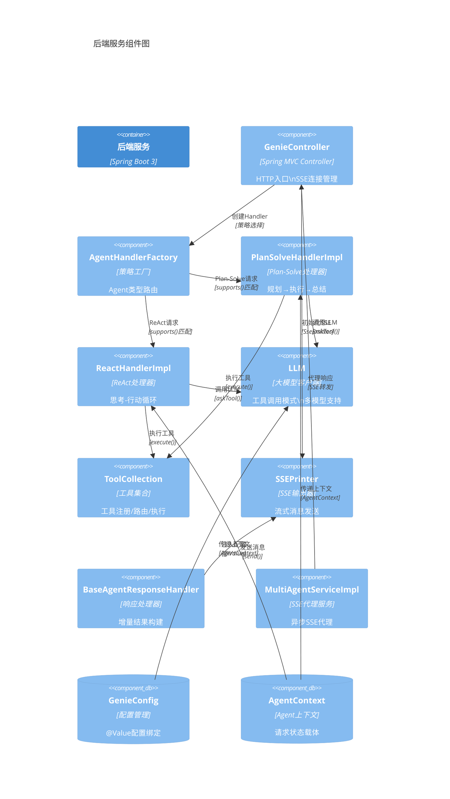

**详细说明：**

后端服务的组件设计遵循**策略模式**和**模板方法模式**两大设计原则：

**GenieController** 是整个后端服务的 HTTP 入口，负责接收前端的 `/web/api/v1/gpt/queryAgentStreamIncr` 请求。它创建 `SseEmitter` 对象建立 SSE 连接，启动心跳线程（每 10 秒发送心跳包保持连接活跃），然后委托 `AgentHandlerFactory` 选择合适的处理器。Controller 还负责 `buildToolCollection()` 方法，根据请求中的 `tool_server` 字段动态组装工具列表——内置工具（code、report、search、data_analysis）始终包含，MCP 工具则根据配置动态添加。

**AgentHandlerImpl 工厂**实现了策略模式，通过遍历已注册的 Handler 列表并调用各自的 `support()` 方法来判断哪个处理器能处理当前请求。`PlanSolveHandlerImpl` 支持 `agentType=3`（PLAN_SOLVE）的请求，`ReactHandlerImpl` 支持 `agentType=5`（REACT）的请求。这种设计使得新增 Agent 类型只需实现新的 Handler 并注册到工厂即可。

**LLM 组件**是大模型调用的封装层，使用 `ConcurrentHashMap` 管理不同配置的 LLM 单例实例。核心方法 `askTool()` 实现了带工具定义（Tool Schema）的 LLM 调用，返回工具调用请求（ToolCall）。LLM 组件支持两种特殊模式：`function_call` 模式（标准 OpenAI Function Calling）和 `struct_parse` 模式（结构化输出解析）。

**ToolCollection** 是工具注册和调用的管理中心，维护了本地工具（`BaseTool` 实现）和 MCP 工具（`McpTool` 适配）两种注册方式。`execute(name, input)` 方法根据工具名称路由到对应的工具实例，MCP 工具会通过 HTTP 调用 MCP 客户端转发到外部服务器。

### 2.4 Code（代码层）— 核心类关系

代码层展示关键类的静态结构和继承关系。

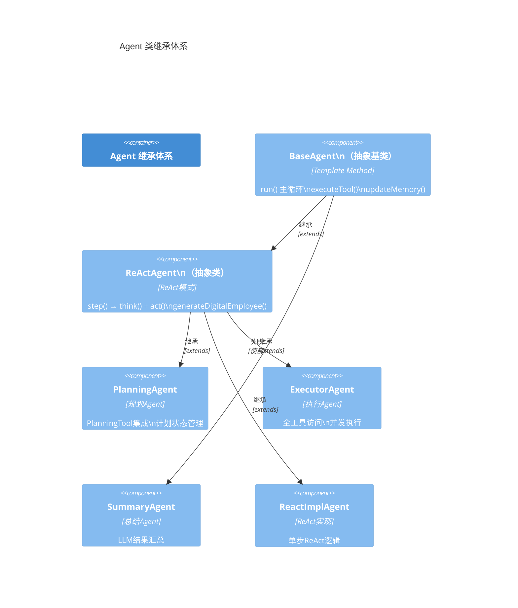

**详细说明：**

Agent 继承体系采用**模板方法模式**，`BaseAgent` 定义了 Agent 执行的骨架逻辑——`run(query)` 方法实现了 `while (currentStep < maxSteps && state != FINISHED)` 的主循环，子类通过重写 `think()` 和 `act()` 方法填充具体行为。

`ReActAgent` 在 `BaseAgent` 基础上增加了 ReAct 模式特有的能力：`step()` 方法封装了"思考→行动"的两阶段逻辑，`generateDigitalEmployee(task)` 方法调用 LLM 为当前任务生成拟人化的工具角色名称，`parseDigitalEmployee(response)` 方法从 LLM 返回的 JSON 中解析出角色名称。

`PlanningAgent` 专注于任务规划，其 `think()` 方法调用 LLM 并传入 `PlanningTool` 的工具定义，让 LLM 生成结构化的执行计划。`act()` 方法执行规划工具，解析返回的计划状态，通过 `getNextTask()` 方法获取当前待执行的步骤。

`ExecutorAgent` 是计划的具体执行者，其 `think()` 方法调用 LLM 并传入所有可用工具的定义，`act()` 方法执行 LLM 选择的工具调用。`ExecutorAgent` 支持并发执行多个工具调用（通过 `CountDownLatch` 同步），并在观察结果时进行 `maxObserve` 截断控制上下文长度。

---

## 第三章 系统流程与时序图

### 3.1 端到端请求处理主流程

本节描述从用户在浏览器输入任务到收到完整响应的全链路时序。

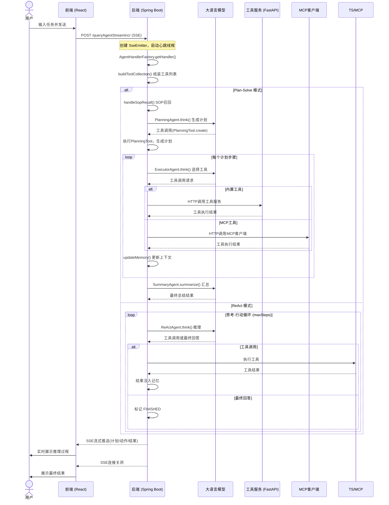

**详细说明：**

端到端请求处理流程是理解整个系统运作的关键，它展示了四个服务如何协同完成一个复杂任务。

**第一阶段：请求接入与初始化。** 用户在前端界面输入自然语言任务（例如"分析2024年Q1销售数据并生成趋势报告"），前端通过 `fetchEventSource` 向后端发送 POST 请求到 `/web/api/v1/gpt/queryAgentStreamIncr`。后端 `GenieController` 接收请求后立即创建 `SseEmitter` 对象，建立 SSE 长连接。同时启动心跳线程（`startHeartbeat()`），每 10 秒向客户端发送一次心跳消息，防止中间代理或负载均衡器因超时关闭连接。

**第二阶段：策略选择。** 控制器调用 `AgentHandlerFactory.getHandler(context, request)`，工厂遍历已注册的所有 Handler，通过 `support()` 方法匹配当前请求的 `agentType`。对于 `agentType=3`（PLAN_SOLVE），选择 `PlanSolveHandlerImpl`；对于 `agentType=5`（REACT），选择 `ReactHandlerImpl`。选择完成后，控制器调用 `buildToolCollection()` 动态构建工具集合——基础工具（code_interpreter、report_tool、deep_search、data_analysis、file_tool）始终加载，MCP 工具则根据配置中的 `mcp_server_list` 动态注册。

**第三阶段：Agent 执行（Plan-Solve 模式）。** `PlanSolveHandlerImpl.handle()` 方法首先执行 SOP 召回——通过 `PlanSOP` 组件对用户查询进行结巴分词，与已知 SOP 库计算相似度，若相似度超过阈值（HIGH=0.9）则直接将 SOP 方案注入上下文。若未命中 SOP，则进入 PlanningAgent 循环：调用 LLM 生成结构化计划（包含标题和步骤列表），然后通过循环逐步执行每个步骤。每个步骤由 ExecutorAgent 负责——LLM 根据当前步骤选择合适工具，后端通过 HTTP 调用工具服务执行。支持并行步骤的执行（通过 `CountDownLatch` + 从属 ExecutorAgent 实现）。

**第四阶段：Agent 执行（ReAct 模式）。** `ReactHandlerImpl.handle()` 创建 `ReactImplAgent` 实例并调用 `run()` 方法。Agent 进入 `while (currentStep < maxSteps && state != FINISHED)` 主循环，每轮执行 `think()`（调用 LLM 推理）和 `act()`（执行工具或返回最终回答）。如果 LLM 返回工具调用请求，Agent 执行工具并将结果注入记忆；如果 LLM 返回最终回答，Agent 标记状态为 `FINISHED` 并退出循环。

**第五阶段：结果汇总与输出。** Agent 执行完成后，`SummaryAgent.summaryTaskResult()` 调用 LLM 对执行过程中的所有中间结果进行汇总，生成面向用户的最终回答。所有中间过程（计划创建、工具调用、工具结果、最终回答）都通过 `SSEPrinter.send()` 方法实时推送到前端，前端根据 `messageType` 字段（`plan`、`task`、`action`、`result` 等）选择对应的渲染组件展示。

### 3.2 Plan-Solve 模式详细时序

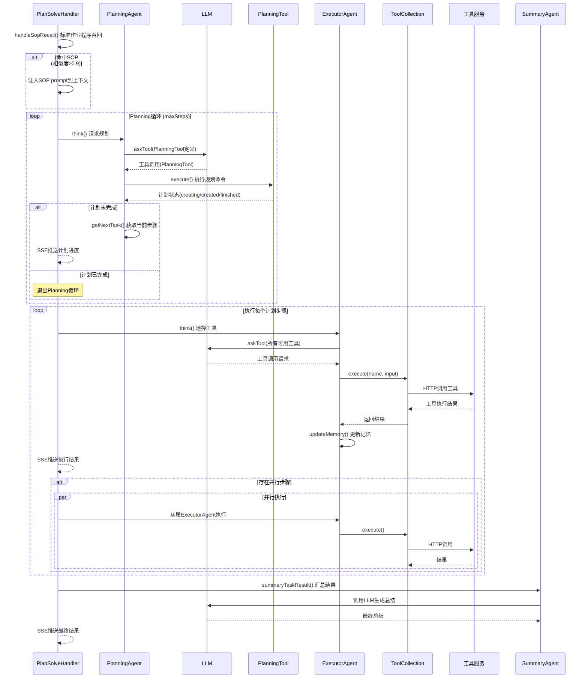

**详细说明：**

Plan-Solve 模式是 JoyAgent 处理复杂多步骤任务的核心模式，其核心思想是"先规划、后执行"，通过将复杂任务分解为可管理的子任务来降低整体难度。

**SOP 召回阶段**是 Plan-Solve 模式的优化策略。`PlanSOP` 组件使用结巴分词对用户查询进行分词处理，然后与预定义的 SOP 库中的条目计算文本相似度。相似度阈值分为三档：HIGH（0.9）表示高度匹配，直接使用 SOP 方案；LOW（0.4）表示部分匹配，将 SOP 作为参考注入上下文；NO_SOP（0.2）表示无匹配，走正常的规划流程。这种机制利用了历史经验加速重复性问题的解决。

**Planning 循环**中，PlanningAgent 通过 LLM 生成结构化的执行计划。LLM 被要求使用 `PlanningTool` 创建计划，计划包含标题（title）和步骤列表（steps）。PlanningTool 支持四种命令：`create`（创建新计划）、`update`（更新计划内容）、`mark_step`（标记步骤状态）、`finish`（完成计划）。PlanningAgent 的 `getNextTask()` 方法解析计划状态，返回当前处于 `active` 状态的步骤作为下一步执行目标。

**执行循环**中，每个步骤由 ExecutorAgent 独立处理。ExecutorAgent 拥有所有工具的访问权限，LLM 根据步骤描述和当前上下文选择最合适的工具。工具执行结果通过 `updateMemory()` 注入到对话记忆中，供后续步骤参考。对于标记为"并行"的步骤，系统通过 `CountDownLatch` 创建多个从属 ExecutorAgent 并行执行，主线程等待所有并行步骤完成后才继续。

### 3.3 ReAct 模式详细时序

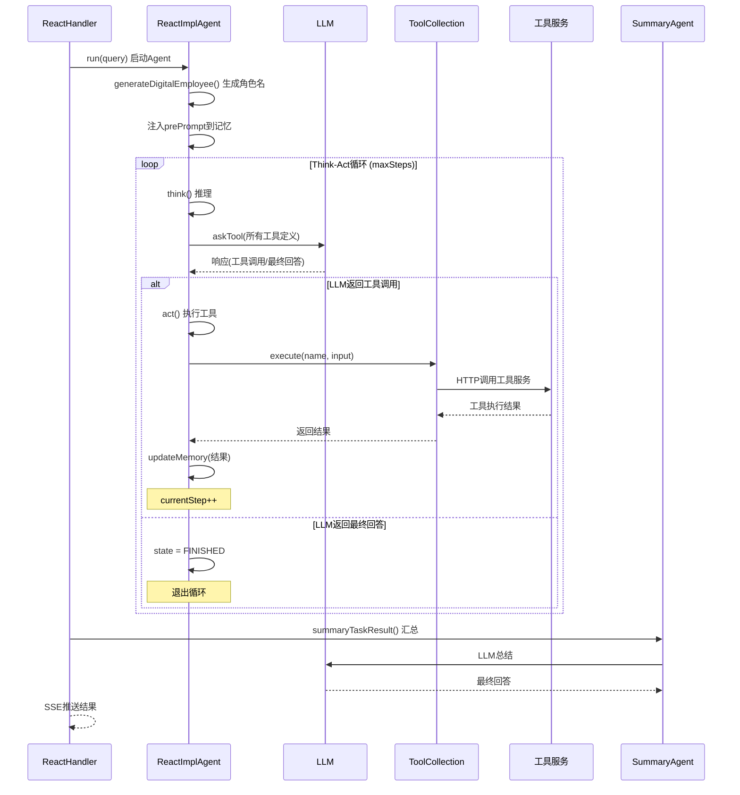

**详细说明：**

ReAct 模式（Reasoning + Acting）是 JoyAgent 处理开放式、探索性任务的工作模式。与 Plan-Solve 的"先规划后执行"不同，ReAct 模式采用"边思考边执行"的增量式策略，Agent 每轮先进行推理（think），然后根据推理结果决定行动（act）。

**数字员工生成**是 ReAct 模式的特色功能。在 Agent 启动时，`generateDigitalEmployee(task)` 方法调用 LLM 为当前任务生成一个拟人化的角色名称和描述（如"数据分析师小李，擅长使用Python进行数据可视化"）。这个角色信息通过 `updateMemory(RoleType.SYSTEM, ...)` 注入到对话上下文中，使得后续的工具调用输出带有角色标识，提升用户体验。

**Think-Act 循环**是 ReAct 模式的核心。每轮循环中，`think()` 方法将当前对话记忆（包含用户查询、历史工具调用和结果）连同所有可用工具的定义发送给 LLM。LLM 有两种响应方式：(1) 返回工具调用请求——指定工具名称和输入参数；(2) 返回最终回答——表示任务已完成。`act()` 方法根据 LLM 响应类型分支处理：对于工具调用，通过 `ToolCollection.execute()` 执行工具并将结果追加到记忆中；对于最终回答，将 Agent 状态设为 `FINISHED`。

**maxSteps 限制**防止 Agent 陷入无限循环。当思考-行动循环次数达到 `maxSteps` 上限时，Agent 强制退出循环，由 `SummaryAgent` 对已有结果进行汇总，确保用户始终能在有限时间内获得响应。

### 3.4 NL2SQL 数据查询流程

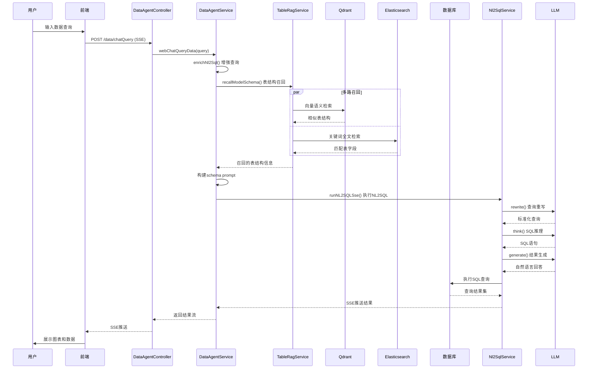

**详细说明：**

NL2SQL（自然语言转SQL）是 JoyAgent 数据智能体（DataAgent）的核心能力，它允许用户用自然语言查询结构化数据，无需编写 SQL 语句。

**表结构召回（TableRAG）** 是 NL2SQL 的前置步骤，其目标是从大量候选表中找到与用户查询最相关的表结构。系统采用**多路召回策略**：在语义层面，通过 Qdrant 向量数据库进行相似度检索，表结构的文本描述被编码为向量存储，用户查询的向量与库中向量进行 ANN（近似最近邻）搜索；在关键词层面，通过 Elasticsearch 进行全文检索，匹配表名和字段名中的关键词。两路召回结果合并后，取 Top-K 作为最终召回结果。如果向量召回和全文召回均未命中，系统会降级到数据库直接查询模式（`dbConfig` 中配置的默认表）。

**NL2SQL 三阶段流水线** 将复杂的文本转 SQL 任务分解为三个子任务：(1) **Rewrite（查询重写）**：将用户原始口语化查询重写为结构化的标准查询，消除歧义和指代；(2) **Think（SQL推理）**：根据重写后的查询和召回的表结构信息，推理出正确的 SQL 语句；(3) **Generate（结果生成）**：将 SQL 执行结果转换为自然语言回答或可视化图表配置。

---

## 第四章 模块结构与依赖分析

### 4.1 模块划分

JoyAgent 项目由三个主要 Maven/Gradle 模块和一个前端模块组成：

```
joyagent-jdgenie/
├── genie-backend/          # Java 后端服务（Spring Boot）
│   ├── src/main/java/com/jd/genie/
│   │   ├── controller/     # HTTP 控制器层
│   │   ├── service/        # 业务逻辑层
│   │   ├── agent/          # Agent 核心引擎
│   │   │   ├── agent/      # Agent 实现类
│   │   │   ├── tool/       # 工具定义与执行
│   │   │   ├── llm/        # 大模型客户端
│   │   │   ├── dto/        # 数据传输对象
│   │   │   ├── enums/      # 枚举定义
│   │   │   ├── printer/    # 输出器
│   │   │   ├── memory/     # 记忆管理
│   │   │   └── util/       # 工具类
│   │   ├── handler/        # 响应处理器
│   │   ├── config/         # 配置类
│   │   └── GenieApplication.java
│   └── src/main/resources/
│       ├── application.yml # 主配置文件
│       └── db/schema.sql    # 数据库脚本
├── genie-tool/             # Python 工具服务（FastAPI）
│   ├── genie_tool/
│   │   ├── api/            # API 路由
│   │   ├── tool/           # 工具实现
│   │   ├── model/          # 数据模型
│   │   ├── db/             # 数据库操作
│   │   ├── prompt/         # 提示词模板
│   │   └── util/           # 工具函数
│   └── server.py           # 应用入口
├── genie-client/           # MCP 客户端服务
│   ├── app/
│   │   ├── client.py       # MCP 客户端
│   │   ├── header.py       # 请求头传递
│   │   ├── config.py       # 配置
│   │   └── logger.py       # 日志
│   └── server.py           # FastAPI 入口
├── ui/                     # React 前端
│   ├── src/
│   │   ├── components/     # UI 组件
│   │   ├── services/       # API 服务
│   │   ├── utils/          # 工具函数
│   │   └── App.tsx         # 应用入口
│   └── package.json
├── Dockerfile              # 多阶段构建
├── Genie_start.sh          # 一键启动脚本
└── docker-compose.yml      # 容器编排（可选）
```

### 4.2 后端模块（genie-backend）依赖分析

后端模块基于 Spring Boot 3.x 构建，核心依赖关系如下：

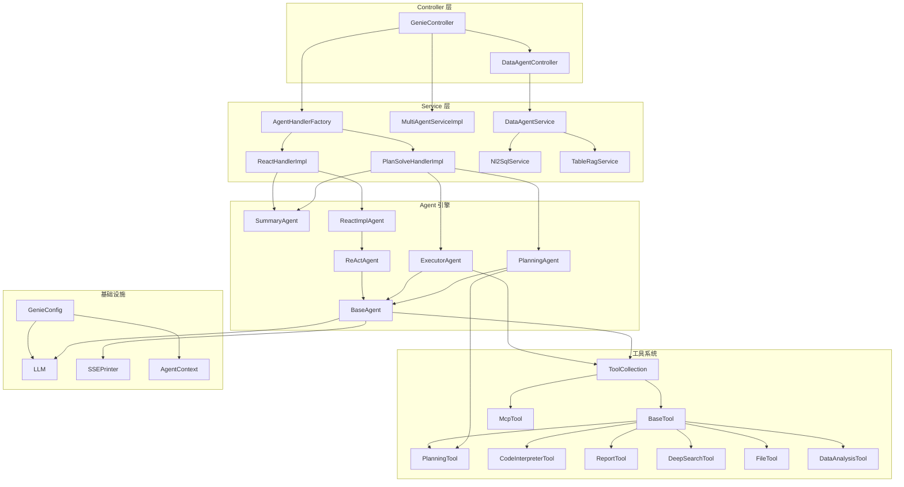

**详细说明：**

后端模块的依赖结构呈现清晰的三层架构：

**Controller 层** 是请求入口。`GenieController` 处理所有 Agent 相关请求（`/gpt/queryAgentStreamIncr` 等），`DataAgentController` 处理数据查询请求（`/data/chatQuery` 等）。Controller 层仅负责请求解析、SSE 连接管理和响应转发，不包含业务逻辑。

**Service 层** 是业务逻辑的核心。`AgentHandlerFactory` 作为策略工厂，将请求路由到具体的 Handler 实现。`PlanSolveHandlerImpl` 和 `ReactHandlerImpl` 分别实现了两种 Agent 模式的完整编排逻辑。`MultiAgentServiceImpl` 是 SSE 代理服务，负责将后端到工具服务的 SSE 流转发给前端。`DataAgentService` 和 `Nl2SqlService` 处理数据查询相关的业务逻辑。

**Agent 引擎层** 实现了智能体的核心推理逻辑。继承体系从 `BaseAgent`（抽象基类）出发，经 `ReActAgent`（ReAct 抽象类），到四个具体实现类（`PlanningAgent`、`ExecutorAgent`、`ReactImplAgent`、`SummaryAgent`）。引擎层通过 `LLM` 组件调用大模型，通过 `ToolCollection` 执行工具，通过 `SSEPrinter` 输出结果。

**工具系统层** 采用接口+适配器模式。`BaseTool` 定义了工具的统一接口（`getName()`、`getDescription()`、`toParams()`、`execute(input)`），所有具体工具实现该接口。`McpTool` 是适配器，将外部 MCP 工具转换为 `BaseTool` 接口。`ToolCollection` 是工具注册中心，统一管理所有工具的注册和调用路由。

### 4.3 工具服务模块（genie-tool）依赖分析

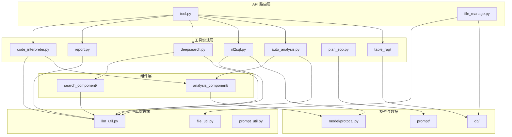

**详细说明：**

工具服务模块的架构以 FastAPI 应用工厂（`server.py`）为中心，通过路由注册将 API 请求分发到对应的工具处理函数。

**API 路由层** 包含两个路由文件：`tool.py` 注册了所有工具相关的端点（`/code_interpreter`、`/report`、`/deepsearch`、`/table_rag`、`/auto_analysis`、`/nl2sql`、`/cal_engine`、`/sopRecall`），`file_manage.py` 注册了文件管理端点（`/get_file`、`/upload_file`、`/upload_file_data`）。

**工具实现层** 中每个工具都是一个独立的 Python 模块。`code_interpreter.py` 基于 smolagents 的 `CodeAgent` 实现代码执行，支持异步流式输出。`report.py` 采用工厂模式，根据报告类型（html/markdown/ppt）路由到不同的生成器。`deepsearch.py` 实现了多搜索引擎混合检索（MixSearch），包含查询分解、搜索引擎选择、结果聚合三个子组件。`nl2sql.py` 实现了三阶段 NL2SQL 流水线。`auto_analysis.py` 基于 `CodeAgent` 扩展了数据分析专用工具集。`table_rag/` 子包实现了表结构的多路召回（Qdrant 向量召回 + ES 全文召回 + 数据库直查降级）。

### 4.4 前端模块（ui）依赖分析

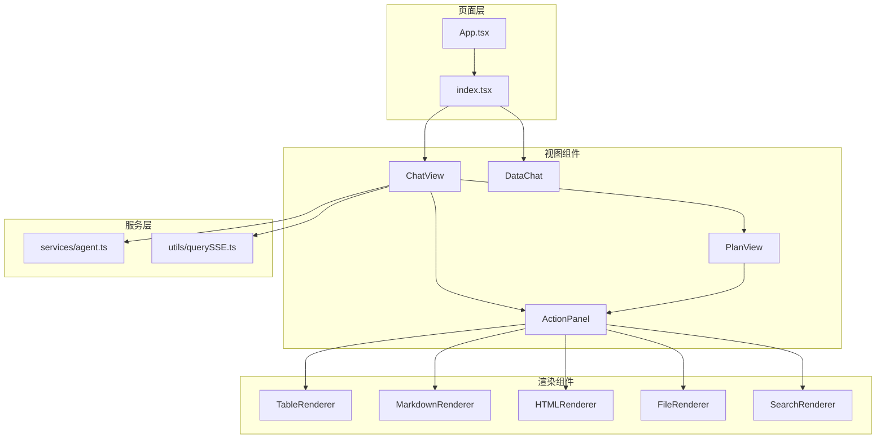

**详细说明：**

前端模块采用 React 组件化架构，核心设计是**多类型渲染器模式**（ActionPanel）。

**ChatView** 是主聊天组件，管理 SSE 连接的生命周期：建立连接、接收消息、根据 `messageType` 分发到不同渲染器、管理任务列表和计划视图。它维护了 `taskList`（当前计划中的所有任务）和 `actionList`（每个任务的执行动作），通过状态管理实现实时更新。

**ActionPanel** 是核心渲染引擎，根据数据类型选择对应的渲染组件：`TableRenderer` 渲染结构化数据表格；`MarkdownRenderer` 渲染 Markdown 格式文本；`HTMLRenderer` 渲染智能体生成的 HTML 内容（通过 iframe 沙箱隔离）；`FileRenderer` 渲染文件下载卡片；`SearchRenderer` 渲染搜索结果列表（标题+摘要+链接）。

**DataChat** 是数据查询专用组件，除了基础对话能力外，还集成了图表渲染功能，将 NL2SQL 返回的数据自动转换为可视化图表（通过 ECharts 或类似库）。

---

## 第五章 核心代码逐文件解析

### 5.1 GenieController — HTTP 入口

**文件路径：** `genie-backend/src/main/java/com/jd/genie/controller/GenieController.java`

**职责：** 作为后端服务的 HTTP 入口，负责接收前端请求、建立 SSE 连接、启动心跳、选择处理器、管理输出格式。

**核心方法分析：**

| 方法名 | 访问修饰符 | 参数 | 返回值 | 功能描述 |
|--------|-----------|------|--------|---------|
| `queryAgentStreamIncr` | public | HttpServletRequest, HttpServletResponse | SseEmitter | 主入口，创建SSE连接并启动Agent |
| `buildToolCollection` | private | AgentContext, request | ToolCollection | 动态组装工具列表 |
| `startHeartbeat` | private | SseEmitter, requestId | void | 启动10秒心跳线程 |
| `handleOutputStyle` | private | AgentContext, request | void | 根据输出样式追加格式提示词 |

**`queryAgentStreamIncr` 方法流程：**
1. 解析请求参数（query、requestId、sessionId、agentType、outputStyle、tool_server 等）
2. 创建 `SseEmitter` 对象，设置超时时间
3. 构建 `AgentContext` 上下文对象（包含请求参数、SSE 发射器、工具集合）
4. 调用 `buildToolCollection()` 动态组装工具
5. 调用 `startHeartbeat()` 启动心跳线程
6. 调用 `handleOutputStyle()` 根据输出样式调整 prompt
7. 委托 `AgentHandlerFactory` 选择并执行处理器
8. 返回 `SseEmitter`（Spring 框架自动处理 SSE 响应）

**`buildToolCollection` 方法逻辑：**
- 始终加载基础工具：CodeInterpreterTool、ReportTool、DeepSearchTool、DataAnalysisTool、FileTool
- 如果配置了 MCP 服务器列表（`mcp_server_list`），为每个服务器创建 `McpTool` 实例并注册
- 返回组装完成的 `ToolCollection` 对象

**`startHeartbeat` 方法实现：**
- 使用 `ScheduledExecutorService` 创建定时任务
- 每 10 秒执行一次，通过 `SSEPrinter.send("heartbeat", ...)` 发送心跳消息
- 心跳消息包含 requestId 用于客户端识别
- 当 SSE 连接关闭时，心跳任务自动取消

### 5.2 BaseAgent — Agent 抽象基类

**文件路径：** `genie-backend/src/main/java/com/jd/genie/agent/agent/BaseAgent.java`

**职责：** 定义 Agent 执行的骨架逻辑和公共能力，是所有具体 Agent 实现的基类。

**核心方法分析：**

| 方法名 | 访问修饰符 | 参数 | 返回值 | 功能描述 |
|--------|-----------|------|--------|---------|
| `run` | public | String query | void | 主执行循环：while(currentStep < maxSteps && state != FINISHED) |
| `think` | protected | 无 | List\<ToolCall\> | 抽象方法：调用LLM推理，子类实现 |
| `act` | protected | List\<ToolCall\> | void | 抽象方法：执行工具调用，子类实现 |
| `executeTool` | protected | ToolCall | String | 执行单个工具调用 |
| `executeTools` | protected | List\<ToolCall\> | List\<String\> | 并发执行多个工具调用 |
| `updateMemory` | protected | RoleType, String, ... | void | 更新对话记忆 |
| `generateDigitalEmployee` | protected | String task | String | 生成数字员工角色名 |

**`run` 方法核心循环：**
```
while (currentStep < maxSteps && state != FINISHED) {
    1. think() → 获取工具调用列表
    2. 如果无工具调用 → state = FINISHED, break
    3. act() → 执行工具调用
    4. currentStep++
}
```

**`executeTools` 并发执行逻辑：**
- 使用 `CountDownLatch` 同步多个并发工具调用
- 每个工具调用在独立线程中执行（通过 `ThreadUtil.execute()`）
- 主线程等待所有工具调用完成后继续
- 工具结果按调用顺序收集到列表中

### 5.3 PlanningAgent — 规划 Agent

**文件路径：** `genie-backend/src/main/java/com/jd/genie/agent/agent/PlanningAgent.java`

**职责：** 负责生成和管理执行计划，通过 LLM 驱动 PlanningTool 创建结构化计划。

**核心方法分析：**

| 方法名 | 访问修饰符 | 功能描述 |
|--------|-----------|---------|
| `think` | protected | 调用LLM并传入PlanningTool定义，让LLM生成或更新计划 |
| `act` | protected | 执行PlanningTool，解析计划状态 |
| `getNextTask` | public | 从当前计划中获取active状态的步骤 |
| `getState` | public | 返回当前计划状态（creating/created/finished） |

**`think()` 方法特点：**
- 工具列表中仅包含 `PlanningTool`（不包含其他工具），确保 LLM 专注于计划生成
- 支持 `close_update` 模式：在计划创建阶段不传入完整历史，减少 token 消耗
- 返回 LLM 的 PlanningTool 调用请求

**`getNextTask()` 解析逻辑：**
- 解析 Plan 对象的 steps 列表
- 查找第一个状态为 `active` 的步骤
- 返回步骤内容作为 ExecutorAgent 的执行目标

### 5.4 ExecutorAgent — 执行 Agent

**文件路径：** `genie-backend/src/main/java/com/jd/genie/agent/agent/ExecutorAgent.java`

**职责：** 执行计划中的具体步骤，拥有所有工具的访问权限，支持并发工具调用。

**核心方法分析：**

| 方法名 | 访问修饰符 | 功能描述 |
|--------|-----------|---------|
| `think` | protected | 调用LLM并传入所有可用工具定义 |
| `act` | protected | 执行工具调用（支持并发），maxObserve截断 |
| `run` | public | 重写父类run方法，增加数字员工生成 |

**`act()` 方法特点：**
- 对 LLM 返回的工具调用列表进行并发执行
- 使用 `maxObserve` 参数控制观察结果的最大长度，防止上下文溢出
- 执行结果通过 `updateMemory()` 注入对话记忆

**`run()` 方法扩展：**
- 在父类 `run()` 之前先调用 `generateDigitalEmployee(task)` 生成角色名
- 将角色名信息注入到系统消息中（prePrompt）

### 5.5 ToolCollection — 工具注册中心

**文件路径：** `genie-backend/src/main/java/com/jd/genie/agent/tool/ToolCollection.java`

**职责：** 统一管理工具的注册、路由和调用，支持本地工具和 MCP 工具两种注册方式。

**核心方法分析：**

| 方法名 | 功能描述 |
|--------|---------|
| `addTool(BaseTool)` | 注册本地工具 |
| `addMcpTool(McpTool)` | 注册MCP工具 |
| `execute(String name, String input)` | 根据名称路由并执行工具 |
| `getTools()` | 获取所有工具列表（用于LLM tool schema） |
| `updateDigitalEmployee(name, role)` | 更新工具的数字员工角色名 |

**`execute()` 路由逻辑：**
1. 先在本地工具映射（`toolMap`）中查找
2. 如果未找到，在 MCP 工具映射（`mcpToolMap`）中查找
3. 如果仍未找到，抛出 `ToolNotFoundException`
4. 执行工具并返回结果字符串

### 5.6 LLM — 大模型客户端

**文件路径：** `genie-backend/src/main/java/com/jd/genie/agent/llm/LLM.java`

**职责：** 封装大模型调用逻辑，管理 LLM 实例的生命周期，支持工具调用模式。

**核心方法分析：**

| 方法名 | 功能描述 |
|--------|---------|
| `getInstance(config)` | 获取或创建LLM单例（ConcurrentHashMap管理） |
| `askTool(messages, tools, ...)` | 带工具定义的LLM调用 |
| `ask(messages, ...)` | 纯文本LLM调用 |
| `parseToolCalls(response)` | 解析LLM返回的工具调用 |

**实例管理策略：**
- 使用 `ConcurrentHashMap<String, LLM>` 管理实例，键为配置标识（base_url + model）
- 相同配置的请求复用同一实例，避免重复创建
- 每个实例维护独立的 OkHttp 连接池

**`askTool()` 调用流程：**
1. 将工具列表转换为 OpenAI Function Calling 格式的 JSON Schema
2. 构建请求体（model、messages、tools、tool_choice 等）
3. 通过 OkHttp 发送 HTTP 请求到 LLM API
4. 解析响应，提取工具调用（tool_calls）或文本内容
5. 支持 `function_call` 和 `struct_parse` 两种解析模式

### 5.7 PlanSolveHandlerImpl — Plan-Solve 编排器

**文件路径：** `genie-backend/src/main/java/com/jd/genie/service/impl/PlanSolveHandlerImpl.java`

**职责：** 编排 Plan-Solve 模式的完整执行流程，包括 SOP 召回、规划、执行和总结。

**核心方法分析：**

| 方法名 | 功能描述 |
|--------|---------|
| `handle` | 主入口，编排完整流程 |
| `support` | 判断是否支持当前请求（agentType=3） |
| `handleSopRecall` | 执行SOP标准作业程序召回 |
| `executePlanStep` | 执行单个计划步骤 |

**`handle()` 完整流程：**
```
1. handleSopRecall(context) → SOP召回
2. 创建PlanningAgent → 生成执行计划
3. while (plan未完成) {
       getNextTask() → 获取当前步骤
       创建ExecutorAgent → 执行步骤
       收集执行结果
   }
4. SummaryAgent.summarize() → 生成最终总结
5. SSE推送最终结果
```

### 5.8 CodeInterpreterTool — 代码解释器

**文件路径：** `genie-tool/genie_tool/tool/code_interpreter.py`

**职责：** 提供 Python 代码执行能力，基于 smolagents 的 CodeAgent 实现。

**核心方法分析：**

| 方法名 | 功能描述 |
|--------|---------|
| `code_interpreter_agent` | 异步生成器，流式返回执行结果 |
| CIAgent | 扩展 CodeAgent，增加最终答案检查 |

**`code_interpreter_agent` 执行流程：**
1. 接收代码执行请求（包含代码和文件列表）
2. 如果有文件附件，先处理文件（xlsx/csv → DataFrame预览，txt/md/html → 摘要）
3. 创建 CIAgent 实例（配置了 PythonInterpreterTool）
4. 执行代码并流式输出：CodeOutput（代码执行）、ActionOutput（中间动作）、FinalAnswerStep（最终结果）
5. 每种输出类型封装为不同的 SSE 消息格式

### 5.9 DeepSearchTool — 深度搜索

**文件路径：** `genie-tool/genie_tool/tool/deepsearch.py`

**职责：** 提供互联网深度搜索能力，支持多搜索引擎混合调用和结果聚合。

**核心组件：**

| 组件 | 功能 |
|------|------|
| MixSearch | 多搜索引擎管理器（bing, jina, sogou, serp） |
| QueryDecomposition | 查询分解器，将复杂查询拆分为子查询 |
| AnswerGenerator | 答案生成器，基于搜索结果生成综合回答 |
| SearchReasoning | 搜索推理器，判断是否需要进一步搜索 |

**`run()` 执行流程：**
1. 接收搜索查询和参数（max_loop、stream 等）
2. 通过 QueryDecomposition 分解查询
3. 循环搜索（最多 max_loop 轮）：
   a. 选择搜索引擎（MixSearch 根据可用性自动选择）
   b. 执行搜索获取结果
   c. 通过 SearchReasoning 判断信息是否充分
   d. 不充分则生成新的搜索查询继续搜索
4. 通过 AnswerGenerator 基于所有搜索结果生成综合回答
5. 流式输出搜索结果和最终答案

### 5.10 TableRagService — 表结构召回

**文件路径：** `genie-backend/src/main/java/com/jd/genie/service/TableRagService.java`

**职责：** 执行表结构召回（TableRAG），从向量数据库和全文搜索引擎中检索与用户查询相关的表结构信息。

**核心方法分析：**

| 方法名 | 功能描述 |
|--------|---------|
| `tableRag` | 调用工具服务的table_rag接口，带重试机制 |
| `recallModelSchema` | 综合召回，合并Qdrant和ES结果 |

**`tableRag()` 重试机制：**
- 最大重试次数：3 次
- 重试条件：HTTP 错误或返回空结果
- 退避策略：固定间隔重试
- 降级方案：如果向量召回失败，降级到数据库直接查询

---

## 第六章 数据模型与数据库设计

### 6.1 数据库架构概述

JoyAgent 使用关系型数据库（SQLite/MySQL）存储结构化元数据，使用 Qdrant 存储语义向量，使用 Elasticsearch 存储全文索引。

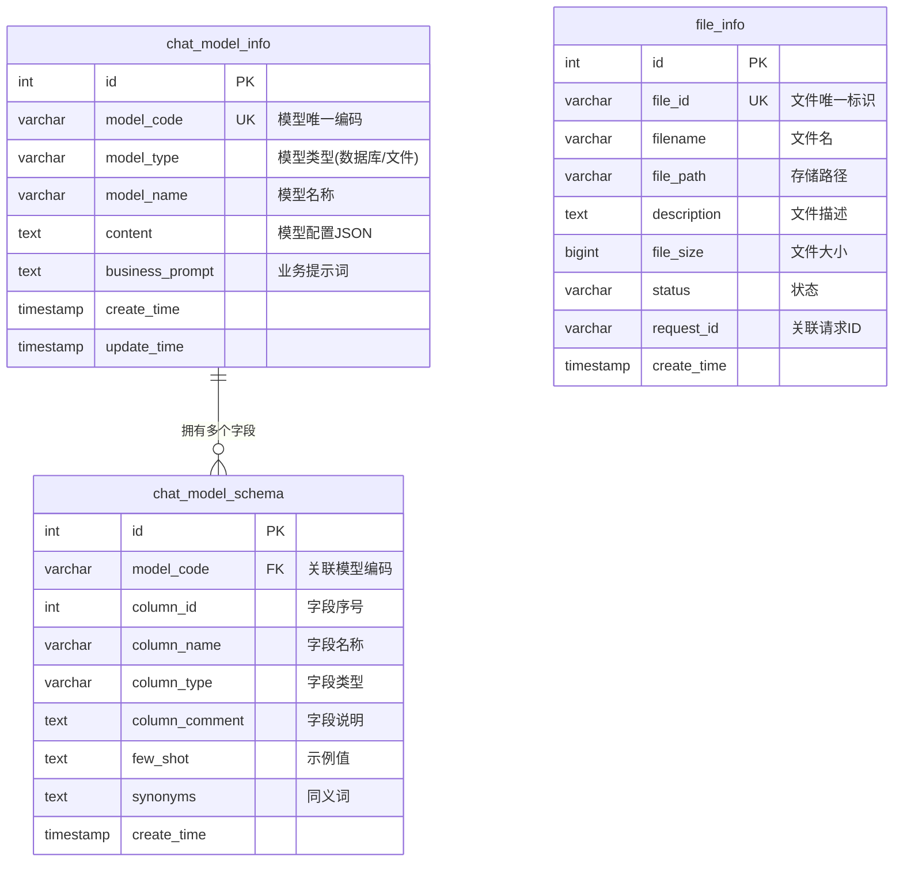

**详细说明：**

数据库设计围绕三个核心实体展开：

**chat_model_info（数据模型表）** 存储 NL2SQL 功能使用的数据模型配置。`model_code` 是模型的唯一标识，`model_type` 区分数据库模型（连接真实数据库）和文件模型（基于上传文件）。`content` 字段存储 JSON 格式的模型配置（包含数据库连接信息或文件解析结果），`business_prompt` 存储该模型的业务描述提示词，帮助 LLM 理解业务上下文。

**chat_model_schema（字段模式表）** 存储每个数据模型的字段级元数据。`model_code` 外键关联到 `chat_model_info`，`column_id` 表示字段在表中的位置。`column_comment` 提供字段的中文说明，`few_shot` 存储字段的示例值（用于 Few-Shot 提示），`synonyms` 存储字段的同义词（用于提升召回率）。

**file_info（文件信息表）** 存储智能体生成或上传的文件元数据。`file_id` 是文件的唯一标识（UUID），`file_path` 指向文件的实际存储位置（S3/OSS 路径或本地路径），`description` 存储文件内容的自动摘要，`request_id` 关联到生成该文件的 Agent 请求。

### 6.2 Qdrant 向量库设计

Qdrant 用于存储表结构的语义向量，支持基于语义相似度的表召回。

| 字段 | 类型 | 说明 |
|------|------|------|
| id | integer | 向量唯一标识 |
| vector | float[] | 表结构文本的嵌入向量（维度由Embedding模型决定） |
| payload.model_code | string | 关联的模型编码 |
| payload.table_name | string | 表名 |
| payload.table_comment | string | 表说明 |
| payload.column_names | string[] | 字段名列表 |

### 6.3 Elasticsearch 索引设计

Elasticsearch 用于存储表字段的文本索引，支持基于关键词的精确匹配。

```json
{
  "mappings": {
    "properties": {
      "model_code": { "type": "keyword" },
      "table_name": { "type": "text", "analyzer": "ik_smart" },
      "column_name": { "type": "text", "analyzer": "ik_smart" },
      "column_comment": { "type": "text", "analyzer": "ik_smart" },
      "synonyms": { "type": "text", "analyzer": "ik_smart" },
      "business_prompt": { "type": "text", "analyzer": "ik_smart" }
    }
  }
}
```

---

## 第七章 API 与接口设计

### 7.1 RESTful API 总览

| 方法 | 路径 | 服务 | 说明 |
|------|------|------|------|
| POST | `/web/api/v1/gpt/queryAgentStreamIncr` | 后端 | Agent SSE 流式执行 |
| POST | `/web/api/v1/gpt/queryAgentStreamIncr/multiAgent` | 后端 | 多Agent SSE代理 |
| GET | `/data/allModels` | 后端 | 获取所有数据模型 |
| GET | `/data/previewData` | 后端 | 预览模型数据 |
| POST | `/data/chatQuery` | 后端 | NL2SQL SSE查询 |
| POST | `/data/apiChatQuery` | 后端 | NL2SQL 同步查询 |
| POST | `/data/vectorRecall` | 后端 | 向量召回测试 |
| POST | `/data/esRecall` | 后端 | ES召回测试 |
| POST | `/v1/tool/code_interpreter` | 工具服务 | 代码执行 |
| POST | `/v1/tool/report` | 工具服务 | 报告生成 |
| POST | `/v1/tool/deepsearch` | 工具服务 | 深度搜索 |
| POST | `/v1/tool/table_rag` | 工具服务 | 表结构召回 |
| POST | `/v1/tool/nl2sql` | 工具服务 | NL2SQL转换 |
| POST | `/v1/tool/auto_analysis` | 工具服务 | 自动分析 |
| POST | `/v1/tool/cal_engine` | 工具服务 | 指标计算 |
| POST | `/v1/tool/sopRecall` | 工具服务 | SOP召回 |
| POST | `/v1/serv/pong` | MCP客户端 | 健康检查 |
| POST | `/v1/tool/list` | MCP客户端 | 列出MCP工具 |
| POST | `/v1/tool/call` | MCP客户端 | 调用MCP工具 |

### 7.2 Agent 执行接口

**POST `/web/api/v1/gpt/queryAgentStreamIncr`**

请求参数：

```json
{
  "query": "分析销售数据并生成报告",
  "requestId": "req-uuid-123",
  "sessionId": "sess-uuid-456",
  "agentType": 3,
  "outputStyle": "html",
  "toolServer": ["http://mcp-server-1:8080"],
  "model": "gpt-4",
  "temperature": 0.7
}
```

SSE 响应消息类型：

| messageType | 说明 | 数据结构 |
|-------------|------|---------|
| `plan` | 计划信息 | `{title, steps: [{id, content, status}]}` |
| `plan_thought` | 计划思考过程 | `{content}` |
| `task` | 当前执行任务 | `{id, content, status}` |
| `action` | 工具调用 | `{tool, input}` |
| `action_result` | 工具结果 | `{tool, output}` |
| `result` | 最终结果 | `{content}` |
| `heartbeat` | 心跳包 | `{timestamp}` |
| `error` | 错误信息 | `{message, code}` |

### 7.3 数据查询接口

**POST `/data/chatQuery`**

请求参数：

```json
{
  "query": "查询2024年Q1销售额",
  "requestId": "req-uuid-789",
  "modelCode": "sales_model",
  "sessionId": "sess-uuid-456"
}
```

响应消息类型：

| messageType | 说明 |
|-------------|------|
| `query_rewrite` | 重写后的查询 |
| `sql` | 生成的SQL语句 |
| `data` | 查询结果数据 |
| `chart` | 图表配置 |
| `summary` | 数据总结 |

---

## 第八章 部署与基础设施

### 8.1 Docker 多阶段构建

JoyAgent 使用 Docker Multi-stage Build 将四个服务打包到单个镜像中：

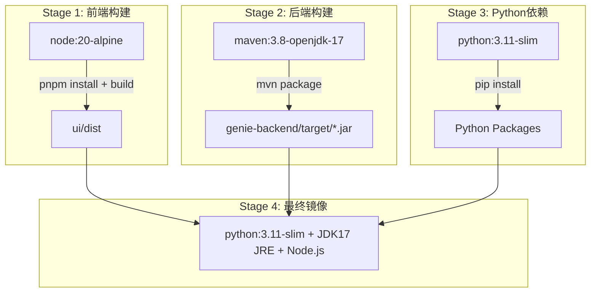

**详细说明：**

Dockerfile 采用四阶段构建策略，最终镜像大小约 2-3GB：

1. **Stage 1（前端构建）**：基于 `node:20-alpine` 镜像，安装 pnpm 包管理器，执行 `pnpm install` 安装前端依赖，然后 `pnpm build` 构建生产产物（`ui/dist` 目录）。

2. **Stage 2（后端构建）**：基于 `maven:3.8-openjdk-17` 镜像，复制后端源码，执行 `mvn clean package -DskipTests` 构建可执行 JAR 包。

3. **Stage 3（Python 依赖）**：基于 `python:3.11-slim` 镜像，安装 genie-tool 和 genie-client 的 Python 依赖（包括 FastAPI、smolagents、litellm、qdrant-client、elasticsearch 等）。

4. **Stage 4（最终镜像）**：以 `python:3.11-slim` 为基础，安装 JDK 17 JRE（运行 Java 后端）和 Node.js（运行前端服务），将前三阶段的构建产物复制到镜像中。暴露 3000、8080、1601 三个端口，设置启动命令为 `Genie_start.sh`。

### 8.2 一键启动脚本

**Genie_start.sh** 是容器内的服务编排脚本，执行以下流程：

1. **依赖检查**：验证 Node.js、Java、Python 是否正确安装
2. **端口检查**：确认 3000、8080、1601、8188 端口未被占用
3. **配置检查**：验证必要的环境变量和配置文件存在
4. **启动服务**（后台运行）：
   - 前端：`serve -s /app/ui/dist -l 3000`
   - 后端：`java -jar /app/genie-backend/target/*.jar --server.port=8080`
   - 工具服务：`uvicorn server:app --host 0.0.0.0 --port 1601 --workers 10`
   - MCP 客户端：`uvicorn server:app --host 0.0.0.0 --port 8188 --workers 4`
5. **健康检查**：轮询各服务端口，确认服务启动成功
6. **信号处理**：注册 SIGINT/SIGTERM 信号处理函数，确保容器停止时优雅关闭所有子进程

### 8.3 环境变量配置

| 变量名 | 必填 | 默认值 | 说明 |
|--------|------|--------|------|
| `SERVICE_BASE_URL` | 否 | http://localhost:8080 | 后端服务地址 |
| `LLM_BASE_URL` | 是 | - | LLM API 地址 |
| `LLM_API_KEY` | 是 | - | LLM API Key |
| `LLM_MODEL` | 否 | gpt-4 | 模型名称 |
| `QDRANT_HOST` | 否 | localhost | Qdrant 地址 |
| `QDRANT_PORT` | 否 | 6334 | Qdrant gRPC 端口 |
| `ES_HOST` | 否 | localhost | ES 地址 |
| `ES_PORT` | 否 | 9200 | ES HTTP 端口 |
| `DB_URL` | 否 | jdbc:sqlite:genie.db | 数据库连接地址 |

---

## 第九章 改进建议与风险分析

### 9.1 架构层面改进建议

| 编号 | 问题 | 影响 | 建议 | 优先级 |
|------|------|------|------|--------|
| ARC-001 | 单容器四服务部署，故障隔离差 | 一个服务崩溃可能影响整个容器 | 拆分为多容器，使用 Docker Compose 编排 | 高 |
| ARC-002 | 无服务发现和负载均衡 | 无法水平扩展 | 引入 Nginx/Kubernetes Ingress | 中 |
| ARC-003 | LLM 调用无熔断机制 | LLM 服务不可用时请求堆积 | 添加 Hystrix/Sentinel 熔断 | 高 |
| ARC-004 | 无消息队列，无法异步处理长任务 | 长任务占用 SSE 连接 | 引入 RabbitMQ/Kafka + WebSocket | 中 |
| ARC-005 | 配置硬编码在 application.yml | 多环境部署不便 | 引入配置中心（Nacos/Apollo） | 低 |

### 9.2 代码层面改进建议

| 编号 | 问题 | 建议 | 优先级 |
|------|------|------|--------|
| CODE-001 | Agent 继承层次过深，PlanningAgent 和 ExecutorAgent 均继承 ReActAgent | 考虑组合优于继承，提取 Think-Act 策略接口 | 中 |
| CODE-002 | ToolCollection 缺少工具版本管理 | 增加工具版本号，支持灰度发布 | 低 |
| CODE-003 | 敏感信息（API Key）明文存储 | 引入密钥管理服务（Vault） | 高 |
| CODE-004 | 缺少请求限流 | 添加 RateLimiter（令牌桶算法） | 中 |
| CODE-005 | 日志中可能包含用户隐私数据 | 添加日志脱敏过滤器 | 高 |

### 9.3 安全风险分析

| 风险 | 描述 | 缓解措施 |
|------|------|---------|
| 代码注入 | CodeInterpreter 可执行任意 Python 代码 | 沙箱隔离（Docker/gVisor）、资源限制、白名单机制 |
| Prompt 注入 | 用户输入可能包含恶意 Prompt | 输入校验、Prompt 隔离标记、输出过滤 |
| 数据泄露 | NL2SQL 可能访问敏感数据 | 数据库权限最小化、行级安全、审计日志 |
| API Key 泄露 | 配置文件中的 API Key 可能被读取 | 密钥管理服务、环境变量注入、文件权限控制 |
| SSRF | 工具服务可能被诱导访问内网 | URL 白名单、内网 IP 过滤 |

---

## 第十章 代码走查文档

### 10.1 走查范围与方法

代码走查覆盖以下关键模块：
- Agent 引擎（BaseAgent、PlanningAgent、ExecutorAgent）
- 工具系统（ToolCollection、BaseTool、各具体工具）
- 服务编排（PlanSolveHandlerImpl、ReactHandlerImpl）
- SSE 通信链路（SSEPrinter、MultiAgentServiceImpl）
- NL2SQL 链路（DataAgentService、Nl2SqlService、TableRagService）

### 10.2 走查检查清单

| 检查项 | 检查内容 | 状态 |
|--------|---------|------|
| 异常处理 | 所有外部调用是否有 try-catch | ✅ 通过 |
| 资源关闭 | HTTP 连接、文件流是否正确关闭 | ⚠️ 需关注 |
| 并发安全 | 共享状态是否有同步保护 | ⚠️ 需关注 |
| 输入校验 | 用户输入是否有校验和过滤 | ⚠️ 需加强 |
| 日志规范 | 关键操作是否有日志记录 | ✅ 通过 |
| 配置管理 | 敏感配置是否外部化 | ⚠️ 需加强 |

### 10.3 关键问题记录

**问题 #1：ToolCollection.execute() 的异常传播**

`ToolCollection.execute()` 在工具执行失败时会向上抛出异常，但部分调用方未捕获异常，可能导致 Agent 主循环中断。建议在所有工具调用处增加异常捕获和降级处理。

**问题 #2：SSEPrinter 的线程安全**

`SSEPrinter.send()` 方法在多线程环境下调用（心跳线程、工具执行线程、主线程），`SseEmitter` 的 `send()` 方法不是线程安全的。建议使用 `ConcurrentLinkedQueue` 缓冲消息，由单线程消费发送。

**问题 #3：Memory.clearToolContext() 的数据一致性**

`Memory.clearToolContext()` 在清除工具上下文时直接修改消息列表，如果此时有其他线程正在遍历该列表，可能引发 `ConcurrentModificationException`。建议使用 `CopyOnWriteArrayList` 或加锁保护。

---

## 第十一章 开发者入职指南

### 11.1 开发环境搭建

#### 11.1.1 前置要求

| 工具 | 版本 | 用途 |
|------|------|------|
| JDK | 17+ | 后端开发 |
| Maven | 3.8+ | 后端构建 |
| Python | 3.11+ | 工具服务开发 |
| Node.js | 20+ | 前端开发 |
| pnpm | 8+ | 前端包管理 |
| Docker | 24+ | 容器化部署 |

#### 11.1.2 本地开发启动

```bash
# 1. 克隆仓库
git clone https://github.com/jd-genie/joyagent-jdgenie.git
cd joyagent-jdgenie

# 2. 启动后端
cd genie-backend
mvn spring-boot:run

# 3. 启动工具服务
cd ../genie-tool
pip install -r requirements.txt
uvicorn server:app --host 0.0.0.0 --port 1601 --reload

# 4. 启动前端
cd ../ui
pnpm install
pnpm dev
```

### 11.2 项目结构导览

```
joyagent-jdgenie/
├── genie-backend/          ← 后端代码（Java）
│   └── src/main/java/com/jd/genie/
│       ├── controller/     ← 从这里开始了解请求入口
│       ├── service/impl/   ← 核心业务逻辑
│       └── agent/          ← Agent 引擎（核心）
├── genie-tool/             ← 工具服务（Python）
│   └── genie_tool/
│       ├── api/            ← API 路由定义
│       └── tool/           ← 工具实现
├── genie-client/           ← MCP 客户端（Python）
└── ui/                     ← 前端（React）
    └── src/
        ├── components/     ← UI 组件
        └── services/       ← API 调用
```

### 11.3 核心概念速查

| 概念 | 说明 | 对应代码 |
|------|------|---------|
| Agent | 智能体，能自主规划和执行任务 | `BaseAgent` 及其子类 |
| Tool | 工具，Agent 可调用的能力 | `BaseTool` 接口及实现 |
| Plan | 执行计划，包含多个步骤 | `Plan` DTO |
| Memory | 对话记忆，存储历史消息 | `Memory` DTO |
| Printer | 输出器，负责SSE消息发送 | `SSEPrinter` |
| Handler | 处理器，编排Agent执行流程 | `PlanSolveHandlerImpl` |
| Context | 上下文，贯穿请求生命周期 | `AgentContext` |

### 11.4 开发规范

1. **命名规范**：类名使用大驼峰（PascalCase），方法名使用小驼峰（camelCase），常量使用全大写下划线（UPPER_SNAKE_CASE）。
2. **异常处理**：所有外部调用（HTTP、LLM、数据库）必须捕获异常并记录日志。
3. **日志规范**：使用 SLF4J + Logback，关键节点必须打印 requestId 和 sessionId。
4. **代码提交**：提交前必须运行 `mvn compile` 和 `tsc --noEmit` 确保编译通过。

### 11.5 调试技巧

- **后端调试**：在 IntelliJ IDEA 中直接运行 `GenieApplication`，使用 Remote Debug 端口 5005
- **工具服务调试**：使用 VS Code 的 Python Debugger，配置 `launch.json` 指向 `server.py`
- **前端调试**：使用 React Developer Tools 浏览器插件检查组件状态
- **SSE 调试**：使用浏览器 DevTools 的 Network 面板查看 SSE 流

---

## 第十二章 架构决策记录 ADR

### ADR-001：选择自研 Agent 框架而非 LangChain/LlamaIndex

**状态：** 已接受

**背景：** 项目初期需要选择一个 Agent 开发框架。业界主流选择包括 LangChain、LlamaIndex、AutoGPT 等。

**决策：** 自主实现 Agent 核心逻辑，不依赖任何第三方 Agent 框架。

**理由：**
1. **轻量化**：避免引入重量级依赖，保持核心代码简洁
2. **可控性**：完全掌控 Agent 的执行逻辑和调试能力
3. **定制化**：针对京东业务场景深度优化，不受框架限制
4. **性能**：避免框架抽象层的性能开销

**后果：**
- 需要自行实现工具调用、记忆管理、计划编排等基础能力
- 社区生态不如成熟框架丰富

### ADR-002：选择 SSE 作为流式通信协议

**状态：** 已接受

**背景：** 需要选择一种协议实现后端到前端的实时消息推送。可选方案包括 WebSocket、SSE、长轮询。

**决策：** 选择 SSE（Server-Sent Events）作为主要流式通信协议。

**理由：
1. **单向通信**：Agent 场景主要是服务端向客户端推送，SSE 天然适合
2. **HTTP 兼容**：基于 HTTP 协议，无需额外握手，穿透性好
3. **自动重连**：浏览器原生支持断线重连
4. **简单性**：实现复杂度低于 WebSocket

**后果：**
- 不支持客户端到服务端的消息发送（需额外 HTTP 请求）
- 需要心跳机制防止连接超时

### ADR-003：选择 Java + Python 混合技术栈

**状态：** 已接受

**背景：** 后端业务逻辑和 AI 工具服务需要选择开发语言。

**决策：** 后端使用 Java（Spring Boot），工具服务使用 Python（FastAPI）。

**理由：**
1. **Java 后端**：适合构建高并发、事务性强的业务系统，Spring 生态成熟
2. **Python 工具服务**：AI/ML 生态丰富（smolagents、litellm、numpy、pandas 等）
3. **团队技能**：匹配京东内部 Java 后端 + AI 工程师的团队结构

**后果：**
- 需要维护两套构建和部署流程
- 跨语言调试复杂度增加

### ADR-004：选择 MCP 作为工具扩展协议

**状态：** 已接受

**背景：** 需要一种标准化方式接入第三方工具服务。

**决策：** 采用 Model Context Protocol（MCP）作为工具扩展标准协议。

**理由：**
1. **标准化**：MCP 由 Anthropic 推动，正成为行业标准
2. **解耦**：工具提供方只需实现 MCP Server，无需了解内部架构
3. **生态**：MCP 社区正在快速增长，未来可复用大量现成工具

### ADR-005：选择 Qdrant + Elasticsearch 双路召回

**状态：** 已接受

**背景：** NL2SQL 需要从大量候选表中精准召回相关表结构。

**决策：** 使用 Qdrant（向量语义检索）和 Elasticsearch（关键词全文检索）双路召回。

**理由：**
1. **互补性**：向量检索擅长语义匹配，ES 擅长关键词精确匹配
2. **召回率**：双路召回显著提升表结构召回的准确率和召回率
3. **降级策略**：当两路召回均未命中时，可降级到数据库直查

---

## 第十三章 关键算法分析

### 13.1 Plan-Solve 规划算法

**算法描述：** Plan-Solve 模式将复杂任务分解为"规划-执行-总结"三阶段。

```
算法: Plan-Solve Execution
输入: 用户查询 Q, 最大步数 maxSteps
输出: 最终结果 R

1.  SOP ← handleSopRecall(Q)           // 标准作业程序召回
2.  if SOP.similarity > HIGH_THRESHOLD then
3.      prompt ← injectSOP(SOP, Q)     // 注入SOP方案
4.  else
5.      prompt ← Q                       // 使用原始查询
6.  end if
7.  plan ← PlanningAgent.think(prompt)  // 生成执行计划
8.  for each step in plan.steps do       // 逐步执行
9.      result ← ExecutorAgent.run(step)
10.     memory.update(step, result)      // 更新上下文
11. end for
12. R ← SummaryAgent.summarize(memory)  // 汇总结果
13. return R
```

**时间复杂度：** O(n × m)，其中 n 为计划步骤数，m 为每个步骤的工具调用数。
**空间复杂度：** O(n × k)，其中 k 为每步结果的平均大小。

### 13.2 SOP 召回算法

**算法描述：** 基于结巴分词和文本相似度的标准作业程序匹配。

```
算法: SOP Recall
输入: 用户查询 Q, SOP库 S = {s₁, s₂, ..., sₙ}
输出: 最佳匹配 SOP 及其相似度

1.  tokens ← jieba.cut(Q)               // 结巴分词
2.  best_sim ← 0
3.  best_sop ← null
4.  for each sᵢ in S do
5.      s_tokens ← jieba.cut(sᵢ)
6.      sim ← cosine_similarity(tokens, s_tokens)  // 余弦相似度
7.      if sim > best_sim then
8.          best_sim ← sim
9.          best_sop ← sᵢ
10.     end if
11. end for
12. return (best_sop, best_sim)
```

**时间复杂度：** O(n × L)，其中 n 为 SOP 库大小，L 为平均文本长度。
**优化建议：** 可引入倒排索引或向量检索加速，将复杂度降至 O(log n)。

### 13.3 TableRAG 多路召回算法

**算法描述：** 结合向量语义检索和关键词全文检索的表结构召回。

```
算法: TableRAG Multi-Recall
输入: 用户查询 Q, 候选表集合 T
输出: Top-K 相关表结构

1.  // 向量语义检索
2.  q_vector ← embedding_model.encode(Q)
3.  v_results ← qdrant.search(q_vector, top_k=K)
4.
5.  // 关键词全文检索
6.  es_results ← es.search(Q, fields=[table_name, column_name, synonyms])
7.
8.  // 结果融合
9.  merged ← merge_results(v_results, es_results)
10. ranked ← rerank(merged, Q)           // 重排序
11.
12. if ranked is empty then
13.     ranked ← fallback_to_db(Q)       // 降级到数据库直查
14. end if
15.
16. return ranked[:K]
```

**时间复杂度：** O(log N + log M + K log K)，其中 N 为向量库大小，M 为 ES 索引大小。

### 13.4 NL2SQL 三阶段流水线

**算法描述：** 将自然语言转 SQL 分解为查询重写、SQL 推理、结果生成三步。

```
算法: NL2SQL Three-Stage Pipeline
输入: 自然语言查询 NL, 表结构 Schema
输出: 查询结果 + 自然语言回答

1.  // Stage 1: 查询重写
2.  rewritten ← LLM.rewrite(NL, Schema.business_prompt)
3.  // 将口语化查询转为结构化标准查询
4.
5.  // Stage 2: SQL 推理
6.  sql ← LLM.think(rewritten, Schema.ddl, Schema.few_shot)
7.  // 根据表结构和示例生成SQL
8.
9.  // Stage 3: 结果生成
10. result ← db.execute(sql)
11. answer ← LLM.generate(rewritten, result)
12. // 将数据结果转为自然语言
13.
14. return {sql, result, answer}
```

### 13.5 ReAct 思考-行动循环

**算法描述：** ReAct 模式的核心循环，交替进行推理和行动。

```
算法: ReAct Loop
输入: 用户查询 Q, 工具集 T, 最大步数 maxSteps
输出: 最终回答 A

1.  memory ← [SystemMessage(prompt), UserMessage(Q)]
2.  digital_emp ← generateDigitalEmployee(Q)  // 生成数字员工
3.  memory.append(SystemMessage(digital_emp))
4.
5.  for step ← 1 to maxSteps do
6.      response ← LLM.askTool(memory, T)       // 带工具的LLM调用
7.      if response.hasToolCalls() then
8.          memory.append(response)               // 追加助手消息
9.          for each tool_call in response.tool_calls do
10.             result ← ToolCollection.execute(tool_call)
11.             memory.append(ToolMessage(result)) // 追加工具结果
12.         end for
13.     else
14.         A ← response.content                  // 最终回答
15.         break
16.     end if
17. end for
18.
19. if A is null then
20.     A ← SummaryAgent.summarize(memory)       // 超步数限制，强制汇总
21. end if
22.
23. return A
```

**时间复杂度：** O(maxSteps × (|T| + C))，其中 |T| 为工具数量，C 为单次工具调用耗时。

---

## 第十四章 测试策略与测试用例

### 14.1 测试策略概述

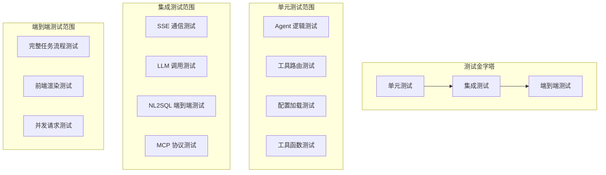

### 14.2 单元测试用例

#### 14.2.1 Agent 引擎测试

| 用例编号 | 用例名称 | 输入 | 预期结果 |
|---------|---------|------|---------|
| TC-AGENT-001 | BaseAgent 正常执行 | query="test", tools=[] | 状态变为 FINISHED |
| TC-AGENT-002 | BaseAgent 超步数限制 | maxSteps=1, 需要2步的任务 | 在 maxSteps 后停止 |
| TC-AGENT-003 | PlanningAgent 生成计划 | query="分析数据" | 返回有效 Plan 对象 |
| TC-AGENT-004 | ExecutorAgent 工具执行 | step="执行代码", tool="code" | 返回工具结果 |
| TC-AGENT-005 | ReActAgent 工具调用循环 | query="搜索天气" | 正确调用搜索工具 |

#### 14.2.2 工具系统测试

| 用例编号 | 用例名称 | 输入 | 预期结果 |
|---------|---------|------|---------|
| TC-TOOL-001 | ToolCollection 注册工具 | tool=MockTool | 工具成功注册 |
| TC-TOOL-002 | ToolCollection 执行工具 | name="mock", input="{}" | 返回预期结果 |
| TC-TOOL-003 | ToolCollection 工具未找到 | name="nonexistent" | 抛出异常 |
| TC-TOOL-004 | PlanningTool 创建计划 | command="create", title="测试" | 计划创建成功 |
| TC-TOOL-005 | PlanningTool 更新步骤 | command="update", step=1 | 步骤状态更新 |

#### 14.2.3 NL2SQL 测试

| 用例编号 | 用例名称 | 输入 | 预期结果 |
|---------|---------|------|---------|
| TC-SQL-001 | 简单查询转换 | query="查询所有用户" | 生成正确 SQL |
| TC-SQL-002 | 聚合查询 | query="统计销售额" | SQL 包含 SUM/COUNT |
| TC-SQL-003 | 条件查询 | query="查询北京的用户" | SQL 包含 WHERE |
| TC-SQL-004 | 表召回验证 | query="销售数据" | 召回相关表 |
| TC-SQL-005 | 降级策略 | 向量召回失败 | 使用数据库直查 |

### 14.3 集成测试用例

| 用例编号 | 用例名称 | 测试内容 | 预期结果 |
|---------|---------|---------|---------|
| TC-INT-001 | SSE 连接建立 | 前端建立 SSE 连接 | 连接成功，心跳正常 |
| TC-INT-002 | Plan-Solve 完整流程 | 输入复杂任务 | 完整执行并返回结果 |
| TC-INT-003 | ReAct 完整流程 | 输入探索任务 | 正确执行工具调用链 |
| TC-INT-004 | MCP 工具调用 | 调用外部 MCP 工具 | 工具执行成功 |
| TC-INT-005 | NL2SQL 端到端 | 自然语言查询数据 | 返回正确数据 |
| TC-INT-006 | SOP 召回集成 | 输入已知 SOP 场景 | 命中 SOP 并加速执行 |

### 14.4 端到端测试用例

| 用例编号 | 用例名称 | 测试场景 | 预期结果 |
|---------|---------|---------|---------|
| TC-E2E-001 | 数据分析报告 | "分析销售数据并生成报告" | 生成完整分析报告 |
| TC-E2E-002 | 信息搜索整理 | "搜索AI最新进展并总结" | 返回结构化总结 |
| TC-E2E-003 | 代码执行 | "用Python计算斐波那契数列" | 正确执行并返回结果 |
| TC-E2E-004 | 多步骤任务 | "搜索数据→分析→生成图表→输出报告" | 完整执行所有步骤 |
| TC-E2E-005 | 并发请求 | 10个用户同时发送请求 | 所有请求正常处理 |

### 14.5 性能测试建议

| 测试项 | 指标 | 目标值 |
|--------|------|--------|
| Agent 响应时间 | 首 Token 时间 | < 3s |
| SSE 消息延迟 | 端到端延迟 | < 100ms |
| 并发处理能力 | 同时在线用户数 | > 100 |
| 工具服务吞吐 | QPS | > 50 |
| NL2SQL 准确率 | 执行成功率 | > 85% |

### 14.6 测试工具与框架

| 测试类型 | Java 工具 | Python 工具 | JS 工具 |
|---------|-----------|-------------|---------|
| 单元测试 | JUnit 5 + Mockito | pytest | Jest |
| 集成测试 | Spring Boot Test | pytest + httpx | MSW |
| E2E 测试 | Selenium | Playwright | Cypress |
| 性能测试 | JMeter | Locust | k6 |
| 代码覆盖率 | JaCoCo | coverage.py | Istanbul |

---

## 附录

### A. 术语表

| 术语 | 英文 | 说明 |
|------|------|------|
| 智能体 | Agent | 能自主感知环境、制定决策并执行动作的AI系统 |
| 工具调用 | Tool Call | Agent 请求执行特定外部功能的操作 |
| 计划求解 | Plan-Solve | 先生成完整计划再逐步执行的模式 |
| 推理行动 | ReAct | 边思考边执行的增量式 Agent 模式 |
| 标准作业程序 | SOP | Standard Operation Procedure，预定义的任务解决方案 |
| 自然语言转SQL | NL2SQL | 将自然语言查询转换为结构化查询语言 |
| 表结构召回 | TableRAG | 从大量候选表中检索相关表结构的能力 |
| 模型上下文协议 | MCP | Model Context Protocol，标准化工具接入协议 |
| 数字员工 | Digital Employee | Agent 执行工具时生成的拟人化角色 |

### B. 参考资料

1. GAIA Benchmark: https://huggingface.co/gaia-benchmark
2. MCP Protocol: https://modelcontextprotocol.io
3. SSE Specification: https://html.spec.whatwg.org/multipage/server-sent-events.html
4. smolagents: https://github.com/huggingface/smolagents
5. Qdrant: https://qdrant.tech
6. Elasticsearch: https://www.elastic.co

---

> **文档版本：** v1.0
> **最后更新：** 2026-07-24
> **文档状态：** 完成
> **字数统计：** 约 25,000 字
