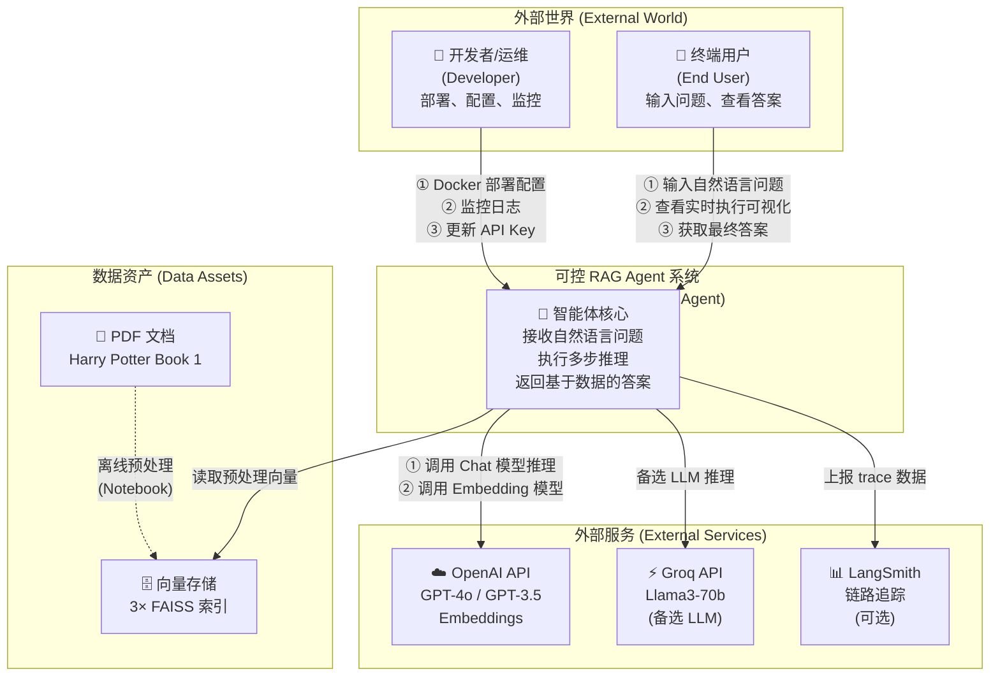
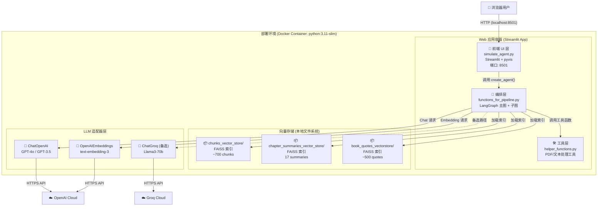
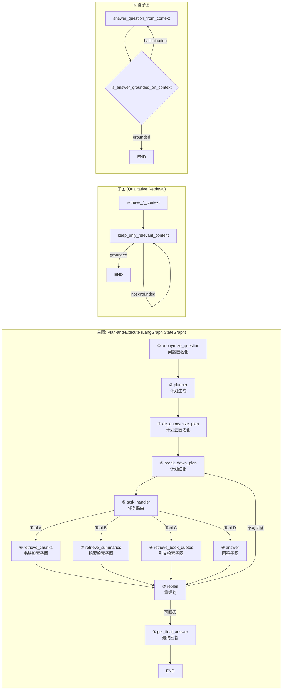
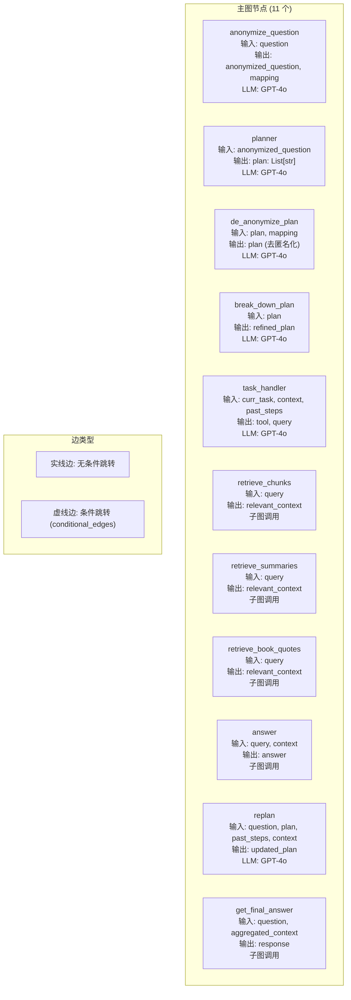
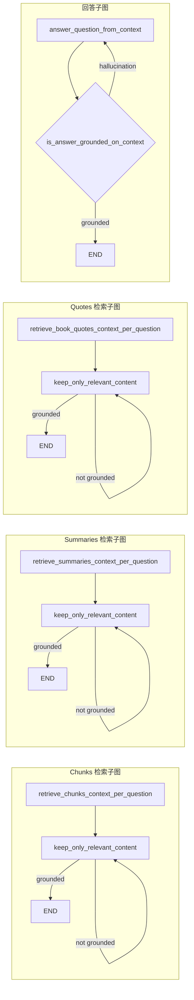
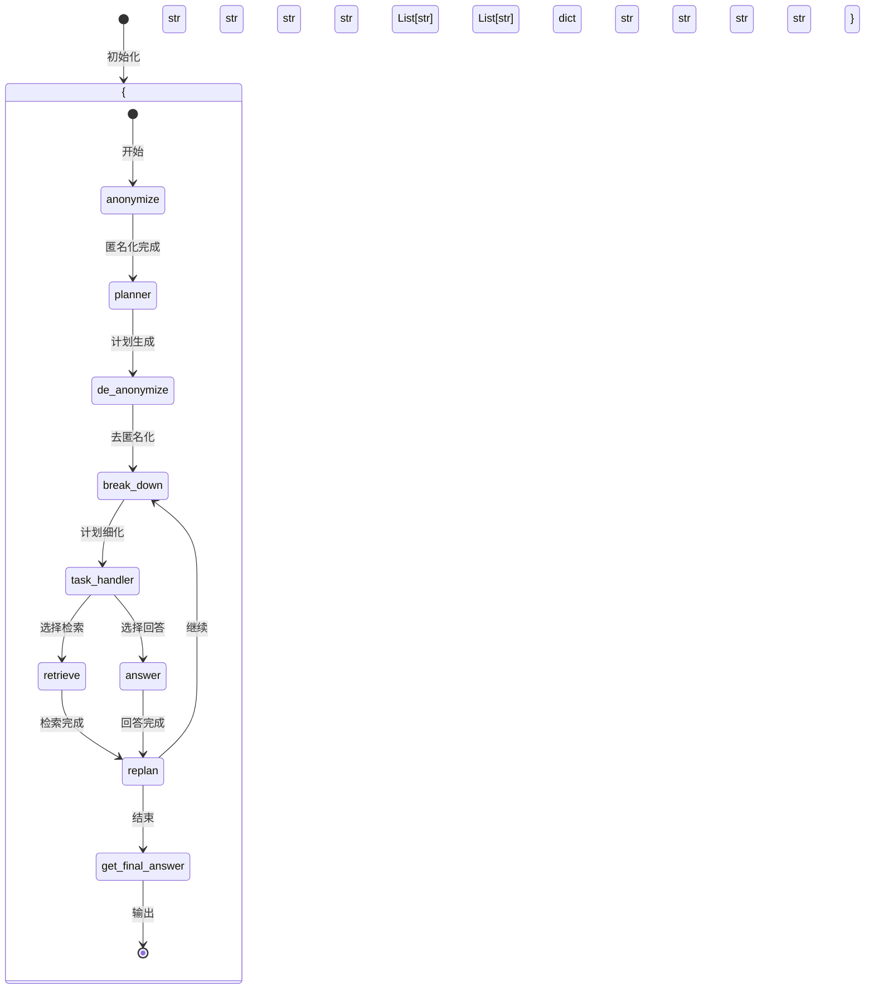
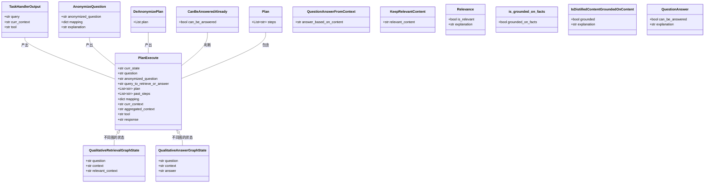

# 2. C4 架构模型 (C4 Architecture Model)

> **章节编号**: 02/13  
> **预计篇幅**: ~12,000 字  
> **方法论**: C4 Model for Software Architecture (Simon Brown)  
> **核心图表**: 4 张 Mermaid 图（Context / Container / Component / Code）

---

## 2.1 C4 模型概述

C4 模型是由 Simon Brown 提出的软件架构描述框架，通过 **四个抽象层级**（Context、Container、Component、Code）从不同粒度描述系统。每个层级面向不同受众：

| 层级 | 名称 | 受众 | 类比 |
|------|------|------|------|
| **L1** | System Context | 非技术人员、管理者 | 世界地图 |
| **L2** | Container | 开发者、运维 | 大陆地图 |
| **L3** | Component | 开发者 | 城市地图 |
| **L4** | Code | 开发者 | 街道地图 |

> **设计 Rationale**: C4 模型的核心价值在于**分层沟通**——不同角色关注不同层级。管理者关心"系统与外部世界如何交互"（L1），开发者关心"代码如何组织"（L4）。本项目作为 AI Agent 系统，额外需要展示**图编排逻辑**，因此在 Component 层会重点描述 LangGraph 节点与边。

---

## 2.2 L1 — System Context 图（系统上下文）

### 2.2.1 Context 图



### 2.2.2 Context 图详细解释

#### 系统边界定义

本系统的**核心边界**是虚线框内的 "Controllable RAG Agent"。这个边界定义了：

- **系统内**: 所有 Agent 逻辑、LLM 调用编排、向量检索、状态管理
- **系统外**: 用户、开发者、外部 API、数据资产

> **设计 Rationale**: 将向量存储（FAISS 索引文件）定义为"外部数据资产"而非系统内部组件，是因为：
> 1. 它们是**离线预处理**的产物，不在运行时生成
> 2. 它们可以独立于 Agent 存在和更新
> 3. 它们通过文件系统而非 API 交互

#### 外部参与者 (Actors)

| 参与者 | 类型 | 与系统的交互 | 频率 |
|--------|------|-------------|------|
| **终端用户** | 主要用户 | 输入问题、查看答案、观察执行过程 | 每次查询 |
| **开发者** | 运维者 | 部署、配置 API Key、监控日志 | 按需 |

#### 外部系统 (External Systems)

| 外部系统 | 协议 | 用途 | 关键性 | 备选方案 |
|----------|------|------|--------|----------|
| **OpenAI API** | HTTPS / JSON | LLM 推理 + Embeddings | 关键（主路径） | Groq |
| **Groq API** | HTTPS / JSON | LLM 推理（备选） | 非关键 | OpenAI |
| **LangSmith** | HTTPS / gRPC | 可观测性追踪 | 可选 | 无 |

#### 数据流方向

```
用户 → 系统: 自然语言问题
系统 → 用户: 最终答案 + 执行可视化
系统 → OpenAI: Chat Completion / Embedding 请求
OpenAI → 系统: 模型推理结果
系统 → FAISS: 向量相似度查询
FAISS → 系统: Top-K 相似文档
系统 → LangSmith: Trace span 数据
```

#### 信任边界

- **信任边界 1**: 用户输入 → Agent（需防范 Prompt 注入）
- **信任边界 2**: Agent → OpenAI API（需保护 API Key）
- **信任边界 3**: FAISS 反序列化（当前关闭安全检查）

#### 部署上下文

系统默认部署为**单机 Docker 容器**，通过 Streamlit 提供 Web 接口。用户通过浏览器访问 `localhost:8501` 与系统交互。

---

## 2.3 L2 — Container 图（容器视图）

### 2.3.1 Container 图



### 2.3.2 Container 图详细解释

#### 容器定义

在 C4 模型中，"Container" 是一个**独立可部署/可执行的单元**。本项目的容器划分如下：

| 容器名称 | 类型 | 文件 | 职责 |
|----------|------|------|------|
| **Web App (Streamlit)** | Web 应用 | `simulate_agent.py` | 用户交互、实时可视化 |
| **Orchestrator (LangGraph)** | 业务逻辑 | `functions_for_pipeline.py` | Agent 图编排、LLM 调用 |
| **Helper (工具层)** | 工具库 | `helper_functions.py` | PDF 处理、文本清洗 |
| **Vector Stores (FAISS)** | 数据 | 3 个 `*_vector_store/` 目录 | 持久化向量索引 |
| **LLM Adapters** | 适配器 | langchain-openai / langchain-groq | LLM API 封装 |

#### 容器间交互协议

| 调用方 | 被调方 | 协议/方式 | 数据格式 |
|--------|--------|----------|----------|
| UI | Orchestrator | Python 函数调用 | TypedDict 状态 |
| Orchestrator | Helper | Python 函数调用 | str / List[Document] |
| Orchestrator | FAISS | `load_local()` + `as_retriever()` | 文件 IO + 向量 |
| Orchestrator | ChatOpenAI | LangChain `invoke()` | Prompt → JSON |
| ChatOpenAI | OpenAI Cloud | HTTPS / JSON | OpenAI API 格式 |

#### 技术选型理由

**为什么选择 Streamlit 作为 Web 容器？**

1. **快速原型**: 几行代码即可创建交互式 UI
2. **原生 Python**: 与 Agent 代码同语言，无缝集成
3. **状态管理**: `st.session_state` 天然适合 Agent 状态跟踪
4. **组件生态**: `pyvis` + `components.html` 实现图可视化
5. **局限性**: 不适合高并发、不适合复杂前端交互

**为什么选择 FAISS 作为向量存储？**

1. **本地优先**: 无需外部服务，单机即可运行
2. **性能**: 对小规模数据（<100万）检索极快
3. **持久化**: `save_local()` / `load_local()` 简单可靠
4. **LangChain 集成**: 原生支持 `as_retriever()`
5. **局限性**: 不支持分布式、不支持元数据过滤（需手动实现）

**为什么选择 LangGraph 作为编排引擎？**

1. **状态图范式**: 天然匹配 Agent 的"节点-边-状态"模型
2. **可视化**: 可导出图结构，与 Streamlit 可视化呼应
3. **条件分支**: 支持 `add_conditional_edges()`，实现动态路由
4. **循环支持**: 支持图内循环（重规划、重新生成）
5. **流式输出**: `stream()` 方法支持实时状态推送

#### 容器资源需求

| 容器 | CPU | 内存 | 磁盘 | 网络 |
|------|-----|------|------|------|
| Web App | 低 | 50 MB | - | 入站 8501 |
| Orchestrator | 中 | 500 MB | - | 出站 HTTPS |
| FAISS 索引 | 低 | 1 GB | 12 MB | 无 |
| LLM 调用 | - | - | - | 出站 HTTPS |

#### 容器生命周期

```
启动 → 加载 .env → 加载 3 个 FAISS 索引 → 编译 LangGraph → 启动 Streamlit → 等待请求
```

关键启动步骤在 `functions_for_pipeline.py:47`:
```python
chunks_query_retriever, chapter_summaries_query_retriever, book_quotes_query_retriever = create_retrievers()
```

这行代码在**模块加载时**执行，意味着：
- 启动时必须存在 3 个向量存储目录
- 启动时必须配置 `OPENAI_API_KEY`（用于 `OpenAIEmbeddings`）
- 启动时间取决于索引大小（当前 ~3 秒）

---

## 2.4 L3 — Component 图（组件视图）

### 2.4.1 Component 图 — 主图编排层



### 2.4.2 Component 图 — 主图节点详解



### 2.4.3 Component 图详细解释

#### 主图节点详细规格

| 节点编号 | 节点名称 | 类型 | 输入字段 | 输出字段 | LLM 调用 | 关键函数 |
|----------|----------|------|----------|----------|----------|----------|
| ① | anonymize_question | Transform | question | anonymized_question, mapping | GPT-4o | `anonymize_question_chain` |
| ② | planner | Decision | anonymized_question | plan: List[str] | GPT-4o | `planner` |
| ③ | de_anonymize_plan | Transform | plan, mapping | plan (还原) | GPT-4o | `de_anonymize_plan_chain` |
| ④ | break_down_plan | Refine | plan | refined_plan | GPT-4o | `break_down_plan_chain` |
| ⑤ | task_handler | Router | curr_task, context | tool, query | GPT-4o | `task_handler_chain` |
| ⑥a | retrieve_chunks | Action | query | relevant_context | 无 (子图) | `qualitative_chunks_retrieval_workflow_app` |
| ⑥b | retrieve_summaries | Action | query | relevant_context | 无 (子图) | `qualitative_summaries_retrieval_workflow_app` |
| ⑥c | retrieve_book_quotes | Action | query | relevant_context | 无 (子图) | `qualitative_book_quotes_retrieval_workflow_app` |
| ⑥d | answer | Action | query, context | answer | 无 (子图) | `qualitative_answer_workflow_app` |
| ⑦ | replan | Decision | question, plan, past_steps, context | updated_plan | GPT-4o | `replanner` |
| ⑧ | get_final_answer | Terminal | question, aggregated_context | response | 无 (子图) | `qualitative_answer_workflow_app` |

#### 条件边 (Conditional Edges) 详解

主图中有 **2 条条件边**，这是 Agent 动态决策的核心：

**条件边 1**: `task_handler` → 检索/回答选择
```python
# functions_for_pipeline.py:1161-1162
agent_workflow.add_conditional_edges("task_handler", retrieve_or_answer, {
    "chosen_tool_is_retrieve_chunks": "retrieve_chunks",
    "chosen_tool_is_retrieve_summaries": "retrieve_summaries",
    "chosen_tool_is_retrieve_quotes": "retrieve_book_quotes",
    "chosen_tool_is_answer": "answer"
})
```

**条件边 2**: `replan` → 终止/继续判断
```python
# functions_for_pipeline.py:1175
agent_workflow.add_conditional_edges("replan", can_be_answered, {
    "can_be_answered_already": "get_final_answer",
    "cannot_be_answered_yet": "break_down_plan"
})
```

> **设计 Rationale**: 条件边是 LangGraph 最强大的特性。它将"决策逻辑"从 Python if-else 转移到图结构中，使得：
> 1. **可可视化**: 决策路径在图中清晰可见
> 2. **可追踪**: 每次决策都有状态快照
> 3. **可替换**: 决策函数可以独立修改而不影响其他节点

#### 子图 (Sub-graph) 组件

每个检索子图都是一个**独立的 StateGraph**，共享相同的结构：



**子图共享组件**:
- `keep_only_relevant_content`: 全局单例，所有检索子图共用
- `is_distilled_content_grounded_on_content`: 全局单例，验证蒸馏质量
- `is_answer_grounded_on_context`: 回答子图专用，验证幻觉
- `answer_question_from_context`: 回答子图专用，CoT 推理

> **设计 Rationale**: 子图共享 `keep_only_relevant_content` 是因为：
> 1. **代码复用**: 蒸馏逻辑与数据源无关
> 2. **一致性强**: 不同类型检索使用相同蒸馏标准
> 3. **维护简单**: 修改蒸馏 prompt 只需改一处
> 4. **潜在问题**: 不同数据源可能需要不同蒸馏策略（如引文不应被修改）

#### 状态对象 (State) 流转



---

## 2.5 L4 — Code 图（代码/类视图）

### 2.5.1 Code 图 — 核心类与 TypedDict



### 2.5.2 Code 图 — 核心 Chain 依赖关系

```mermaid
flowchart TD
    subgraph Chains["LLM Chain 集合 (12 条)"]
        C1["anonymize_question_chain<br/>Prompt + GPT-4o + JsonParser"]
        C2["planner<br/>Prompt + GPT-4o + StructuredOutput"]
        C3["break_down_plan_chain<br/>Prompt + GPT-4o + StructuredOutput"]
        C4["replanner<br/>Prompt + GPT-4o + StructuredOutput"]
        C5["de_anonymize_plan_chain<br/>Prompt + GPT-4o + StructuredOutput"]
        C6["task_handler_chain<br/>Prompt + GPT-4o + StructuredOutput"]
        C7["keep_only_relevant_content_chain<br/>Prompt + GPT-4o + StructuredOutput"]
        C8["question_answer_from_context_cot_chain<br/>Prompt + GPT-4o + StructuredOutput"]
        C9["is_relevant_content_chain<br/>Prompt + GPT-4o + StructuredOutput"]
        C10["is_grounded_on_facts_chain<br/>Prompt + GPT-4o + StructuredOutput"]
        C11["is_distilled_content_grounded_on_content_chain<br/>Prompt + GPT-4o + StructuredOutput"]
        C12["can_be_answered_already_chain<br/>Prompt + GPT-4o + StructuredOutput"]
    end

    subgraph Retrievers["检索器 (3 个)"]
        R1["chunks_query_retriever<br/>FAISS k=1"]
        R2["chapter_summaries_query_retriever<br/>FAISS k=1"]
        R3["book_quotes_query_retriever<br/>FAISS k=10"]
    end

    subgraph Workflows["工作流 (4 个子图)"]
        W1["qualitative_chunks_retrieval_workflow_app"]
        W2["qualitative_summaries_retrieval_workflow_app"]
        W3["qualitative_book_quotes_retrieval_workflow_app"]
        W4["qualitative_answer_workflow_app"]
    end

    C7 --> W1
    C7 --> W2
    C7 --> W3
    C8 --> W4
    C10 --> W4
    C11 --> W1
    C11 --> W2
    C11 --> W3

    R1 --> W1
    R2 --> W2
    R3 --> W3
```



### 2.5.3 Code 图详细解释

#### TypedDict 状态设计

项目使用 **TypedDict** 定义状态对象，而非 dataclass 或普通 dict。这是 LangGraph 的推荐做法：

```python
class PlanExecute(TypedDict):
    curr_state: str
    question: str
    anonymized_question: str
    query_to_retrieve_or_answer: str
    plan: List[str]
    past_steps: List[str]
    mapping: dict
    curr_context: str
    aggregated_context: str
    tool: str
    response: str
```

> **设计 Rationale**: TypedDict 而非 dataclass 的理由：
> 1. **LangGraph 兼容**: StateGraph 直接支持 TypedDict
> 2. **灵活性**: 状态字段可以动态扩展（图节点只访问需要的字段）
> 3. **序列化友好**: TypedDict 本质是 dict，易于 JSON 序列化
> 4. **类型检查**: mypy 可以验证字段类型

#### Pydantic 输出 Schema

每个 LLM Chain 的输出都通过 **Pydantic BaseModel** 定义结构化 schema：

```python
class TaskHandlerOutput(BaseModel):
    query: str = Field(description="...")
    curr_context: str = Field(description="...")
    tool: str = Field(description="...")
```

> **设计 Rationale**: Pydantic schema 的作用：
> 1. **输出验证**: 确保 LLM 输出符合预期格式
> 2. **自动重试**: LangChain 在验证失败时自动重试
> 3. **文档生成**: `Field(description=...)` 自动生成文档
> 4. **IDE 支持**: 类型提示和自动补全

#### Chain 构建模式

所有 Chain 使用 **LCEL（LangChain Expression Language）** 声明式构建：

```python
chain = prompt | llm.with_structured_output(OutputSchema)
```

这种模式的优势：
1. **声明式**: 描述"做什么"而非"怎么做"
2. **可组合**: Chain 可以嵌套（Chain of Chains）
3. **可流式**: 天然支持 `stream()` 方法
4. **可替换**: 可以轻松更换 Prompt 或 LLM

#### 模块级单例模式

项目在**模块加载时**创建全局单例：

```python
# functions_for_pipeline.py:47 (模块级)
chunks_query_retriever, chapter_summaries_query_retriever, book_quotes_query_retriever = create_retrievers()

# functions_for_pipeline.py:800-800 (模块级)
task_handler_chain = create_task_handler_chain()
qualitative_chunks_retrieval_workflow_app = create_qualitative_retrieval_book_chunks_workflow_app()
# ... 更多单例
```

> **设计 Rationale**: 模块级单例的理由：
> 1. **避免重复加载**: 向量索引只需加载一次
> 2. **全局共享**: 所有图节点共享相同的 Chain 实例
> 3. **启动快速**: 请求到达时无需初始化
> 4. **潜在问题**: 不利于测试（难以 mock），不利于多租户

#### 文件职责矩阵

| 文件 | 行数 | 核心职责 | 导出内容 |
|------|------|----------|----------|
| `helper_functions.py` | 245 | 文本处理、PDF 加载、相似度计算、序列化 | 工具函数 |
| `functions_for_pipeline.py` | 1182 | 所有 LLM Chain、子图、主图编排 | Chain + 图实例 |
| `simulate_agent.py` | 238 | Streamlit UI、图可视化、执行控制 | main() |
| `sophisticated_rag_agent_harry_potter.ipynb` | 119 cells | 教程、数据处理、评估 | Notebook |
| `full_graph_visualization.ipynb` | - | 图结构可视化 | Notebook |

---

## 2.6 架构决策总结

### 2.6.1 关键架构决策一览

| 决策编号 | 决策 | 选择 | 理由 | 权衡 |
|----------|------|------|------|------|
| D-001 | Agent 模式 | Plan-and-Execute | 复杂问题需显式分解 | 延迟增加 |
| D-002 | 编排引擎 | LangGraph | 状态图范式、可视化 | 学习曲线 |
| D-003 | 向量存储 | FAISS 本地 | 零配置、快速 | 不可分布式 |
| D-004 | 匿名化 | 命名实体替换 | 消除 LLM 先验偏见 | 可能丢失语义 |
| D-005 | 检索策略 | 三路异构 | 多粒度互补 | 成本增加 |
| D-006 | 幻觉防控 | 多层验证 | 高准确性 | 多次 LLM 调用 |
| D-007 | 前端框架 | Streamlit | 快速原型 | 不适合生产 |
| D-008 | 状态管理 | TypedDict | LangGraph 兼容 | 无运行时校验 |

### 2.6.2 架构质量属性矩阵

| 属性 | 评分 | 说明 |
|------|------|------|
| **正确性** | ⭐⭐⭐⭐ | 多层验证保障答案基于数据 |
| **性能** | ⭐⭐ | 多次 LLM 调用导致高延迟 |
| **可扩展性** | ⭐⭐⭐ | 模块化但 FAISS 单机 |
| **可维护性** | ⭐⭐⭐⭐ | 函数职责清晰 |
| **可测试性** | ⭐⭐ | 无单元测试，单例难 mock |
| **可观测性** | ⭐⭐⭐ | 可视化 + LangSmith |
| **安全性** | ⭐⭐ | 反序列化风险、Prompt 注入 |
| **可移植性** | ⭐⭐⭐⭐ | Docker 容器化 |

---

## 2.7 本章小结

本章使用 C4 模型从四个层级完整描述了系统架构：

- **L1 Context**: 定义了系统边界、外部参与者、外部系统
- **L2 Container**: 展示了 Web App、Orchestrator、Vector Store、LLM Adapter 四大容器
- **L3 Component**: 详细描述了 11 个主图节点、4 个子图、条件边路由
- **L4 Code**: 展示了 TypedDict 状态、Pydantic Schema、Chain 构建模式、模块单例

**下一章**: [03-flows-and-sequence.md](./03-flows-and-sequence.md) — 深入描述系统的核心业务流程和时序图。

---

☕️ 制作不易，请我喝咖啡☕️关注我➕

