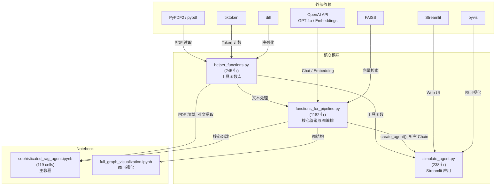
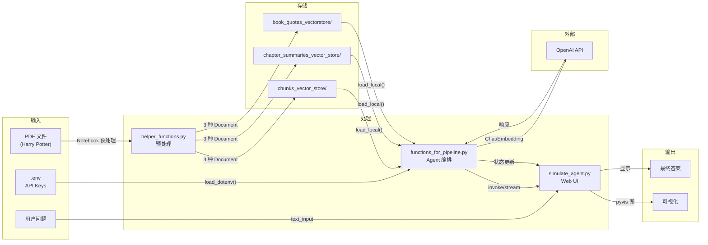

# 4. 模块/包结构与依赖分析 (Module/Package Structure & Dependency Analysis)

> **章节编号**: 04/13  
> **预计篇幅**: ~8,000 字  
> **核心图表**: 目录树 + 依赖关系图  
> **关联文件**: 所有 Python 源文件

---

## 4.1 完整项目目录结构树

```
Controllable-RAG-Agent/
├── 📄 根目录配置与元数据
│   ├── .dockerignore                    # Docker 忽略规则
│   ├── .env.example                     # 环境变量模板 (OPENAI_API_KEY, GROQ_API_KEY)
│   ├── .gitignore                       # Git 忽略规则 (含 docs/, *.pdf, .env)
│   ├── LICENSE                          # Apache 2.0 许可证
│   ├── README.md                        # 项目说明文档 (203 行)
│   ├── docker-compose.yml               # Docker Compose 配置 (3.8 版本)
│   ├── dockerfile                       # Docker 镜像构建 (python:3.11-slim-buster)
│   └── requirements.txt                 # Python 依赖清单 (~170 行)
│
├── 📄 核心 Python 模块 (3 个主文件)
│   ├── helper_functions.py              # 工具函数库 (245 行)
│   ├── functions_for_pipeline.py        # 核心管道与图编排 (1182 行) ⭐
│   └── simulate_agent.py                # Streamlit 可视化应用 (238 行)
│
├── 📓 Jupyter Notebook (2 个)
│   ├── sophisticated_rag_agent_harry_potter.ipynb  # 主教程 Notebook (119 cells)
│   └── full_graph_visualization.ipynb               # 图可视化 Notebook
│
├── 🗄️ 向量存储目录 (3 个 FAISS 索引)
│   ├── chunks_vector_store/             # 书块向量 (3.8 MB faiss + 614 KB pkl)
│   │   ├── index.faiss
│   │   └── index.pkl
│   ├── chapter_summaries_vector_store/  # 章节摘要向量 (104 KB faiss + 28 KB pkl)
│   │   ├── index.faiss
│   │   └── index.pkl
│   └── book_quotes_vectorstore/         # 引文向量 (8 MB faiss + 336 KB pkl)
│       ├── index.faiss
│       └── index.pkl
│
├── 📊 图可视化资源
│   └── graphs/
│       ├── demo.gif                     # 演示动画 (11 MB)
│       ├── final_graph_schema.jpeg      # 最终图结构
│       ├── final_graph_schema_unextended.jpeg
│       ├── first_stage_schema.jpeg
│       ├── retrieve_chunks_subgraph.jpeg
│       ├── retrieve_summaries_subgraph.jpeg
│       ├── retrieve_quotes_subgraph.jpeg
│       └── answer sub graph.jpeg
│
├── 🎨 静态资源
│   └── assets/
│       ├── video_demo.mp4               # 演示视频 (5.8 MB)
│       ├── substack_image.png
│       └── subscribe-button.svg
│
├── 📚 文档目录 (本文档所在)
│   └── docs/
│       └── wangbin/                     # 技术架构文档 (13 个 Markdown 文件)
│           ├── README.md
│           ├── 01-project-overview.md
│           ├── 02-c4-architecture.md
│           ├── 03-flows-and-sequence.md
│           ├── 04-module-structure.md   ← 当前文件
│           ├── 05-core-code-walkthrough.md
│           ├── 06-data-model.md
│           ├── 07-api-design.md
│           ├── 08-deployment.md
│           ├── 09-improvements.md
│           ├── 10-developer-guide.md
│           ├── 11-adr.md
│           ├── 12-algorithms.md
│           └── 13-testing.md
│
└── 🔧 版本控制
    └── .git/                            # Git 仓库元数据
```

---

## 4.2 核心模块详解

### 4.2.1 `helper_functions.py` — 工具函数库

| 属性 | 值 |
|------|-----|
| **行数** | 245 行 |
| **职责** | 提供文本处理、PDF 加载、相似度计算、序列化等基础工具 |
| **依赖** | tiktoken, re, PyPDF2, pylcs, pandas, textwrap, dill |
| **被依赖** | functions_for_pipeline.py, simulate_agent.py, Notebook |

#### 函数清单

| 函数名 | 行号 | 输入 | 输出 | 功能 |
|--------|------|------|------|------|
| `num_tokens_from_string()` | 12-26 | string, encoding_name | int | 计算 token 数 |
| `replace_t_with_space()` | 29-42 | List[Document] | List[Document] | 替换制表符为空格 |
| `replace_double_lines_with_one_line()` | 44-56 | str | str | 双换行→单换行 |
| `split_into_chapters()` | 59-89 | book_path (str) | List[Document] | PDF 按章节分割 |
| `extract_book_quotes_as_documents()` | 92-105 | documents, min_length | List[Document] | 提取引文 |
| `escape_quotes()` | 109-118 | text (str) | str | 转义引号 |
| `text_wrap()` | 122-133 | text, width | str | 文本换行 |
| `is_similarity_ratio_lower_than_th()` | 136-159 | large_string, short_string, th | bool | LCS 相似度判断 |
| `analyse_metric_results()` | 162-209 | results_df (DataFrame) | None | 打印评估指标 |
| `save_object()` | 215-225 | obj, filename | None | dill 序列化保存 |
| `load_object()` | 227-240 | filename | obj | dill 反序列化加载 |

#### 关键设计分析

**`split_into_chapters()` 实现分析**:
```python
def split_into_chapters(book_path):
    with open(book_path, 'rb') as pdf_file:
        pdf_reader = PyPDF2.PdfReader(pdf_file)
        documents = pdf_reader.pages
        text = " ".join([doc.extract_text() for doc in documents])
        chapters = re.split(r'(CHAPTER\s[A-Z]+(?:\s[A-Z]+)*)', text)
        
        chapter_docs = []
        chapter_num = 1
        for i in range(1, len(chapters), 2):
            chapter_text = chapters[i] + chapters[i + 1]
            doc = Document(page_content=chapter_text, metadata={"chapter": chapter_num})
            chapter_docs.append(doc)
            chapter_num += 1
    return chapter_docs
```

> **设计分析**:
> - 正则 `r'(CHAPTER\s[A-Z]+(?:\s[A-Z]+)*)'` 匹配 "CHAPTER ONE", "CHAPTER TWO" 等
> - `re.split()` 保留分隔符，所以 `chapters` 数组为 `['', 'CHAPTER ONE', 'text...', 'CHAPTER TWO', 'text...']`
> - 循环 `range(1, len(chapters), 2)` 跳过分隔符前的空字符串
> - **潜在问题**: 如果 PDF 有前言（Preface）或目录（Contents），会被错误地合并到第一章

**`extract_book_quotes_as_documents()` 实现分析**:
```python
def extract_book_quotes_as_documents(documents, min_length=50):
    quotes_as_documents = []
    quote_pattern_longer_than_min_length = re.compile(rf'“(.{{{min_length},}}?)”', re.DOTALL)
    
    for doc in documents:
        content = doc.page_content
        content = content.replace('\n', ' ')
        found_quotes = quote_pattern_longer_than_min_length.findall(content)
        for quote in found_quotes:
            quote_doc = Document(page_content=quote)
            quotes_as_documents.append(quote_doc)
    return quotes_as_documents
```

> **设计分析**:
> - 使用中文引号 `"` `"`（Unicode U+201C, U+201D）
> - `re.DOTALL` 允许 `.` 匹配换行符
> - **潜在问题**: 英文书籍通常使用英文引号 `"` `'`，此正则可能不匹配

---

### 4.2.2 `functions_for_pipeline.py` — 核心管道与图编排

| 属性 | 值 |
|------|-----|
| **行数** | 1,182 行 |
| **职责** | 所有 LLM Chain 构建、子图定义、主图编排、状态管理 |
| **依赖** | langchain_openai, langchain.vectorstores, langchain.prompts, langgraph, helper_functions |
| **被依赖** | simulate_agent.py, Notebook |

#### 代码结构分区

```
functions_for_pipeline.py
├── 导入与全局配置 (1-28 行)
│   ├── LangChain 导入
│   ├── 环境变量加载
│   └── PyDEVD 超时配置
│
├── 检索器创建 (34-47 行)
│   ├── create_retrievers()
│   └── 模块级单例初始化
│
├── 基础 RAG 函数 (49-82 行)
│   └── retrieve_context_per_question() — 简单检索（Notebook 用）
│
├── 蒸馏 Chain (85-137 行)
│   ├── create_keep_only_relevant_content_chain()
│   └── keep_only_relevant_content()
│
├── CoT 回答 Chain (140-224 行)
│   ├── create_question_answer_from_context_cot_chain()
│   └── answer_question_from_context()
│
├── 验证 Chain 组 (229-382 行)
│   ├── create_is_relevant_content_chain() + is_relevant_content()
│   ├── create_is_grounded_on_facts_chain() + is_answer_grounded_on_context()
│   ├── create_can_be_answered_chain()
│   └── create_is_distilled_content_grounded_on_content_chain() + is_distilled_content_grounded_on_content()
│
├── 三路检索函数 (384-506 行)
│   ├── retrieve_chunks_context_per_question()
│   ├── retrieve_summaries_context_per_question()
│   ├── retrieve_book_quotes_context_per_question()
│   └── 三个子图创建函数
│
├── 回答子图 (512-558 行)
│   └── create_qualitative_answer_workflow_app()
│
├── 计划-执行状态定义 (561-579 行)
│   └── PlanExecute TypedDict, Plan BaseModel
│
├── 计划生成 Chain 组 (582-673 行)
│   ├── create_plan_chain() + plan_step()
│   ├── create_break_down_plan_chain() + break_down_plan_step()
│   ├── create_replanner_chain() + replan_step()
│   └── create_task_handler_chain() + run_task_handler_chain()
│
├── 匿名化 Chain 组 (713-800 行)
│   ├── create_anonymize_question_chain() + anonymize_queries()
│   ├── create_deanonymize_plan_chain() + deanonymize_queries()
│   └── create_can_be_answered_already_chain() + can_be_answered()
│
├── 模块级单例初始化 (800-800 行)
│   └── 所有 Chain 和图实例化
│
├── 子图执行函数 (876-981 行)
│   ├── run_qualitative_chunks_retrieval_workflow()
│   ├── run_qualitative_summaries_retrieval_workflow()
│   ├── run_qualitative_book_quotes_retrieval_workflow()
│   ├── run_qualtative_answer_workflow()
│   └── run_qualtative_answer_workflow_for_final_answer()
│
└── 主图构建 (1105-1182 行)
    └── create_agent() — 完整的 LangGraph 主图
```

#### 关键设计分析

**模块级单例模式**:
```python
# 模块加载时执行（:47, :110, :198, :250, :348, :510, :790-800）
chunks_query_retriever, chapter_summaries_query_retriever, book_quotes_query_retriever = create_retrievers()
keep_only_relevant_content_chain = create_keep_only_relevant_content_chain()
# ... 更多单例
```

> **设计分析**:
> - **优点**: 避免重复加载，启动时一次性初始化
> - **缺点**: 不利于测试（难以 mock），不利于多租户
> - **改进建议**: 使用依赖注入或工厂模式替代模块级单例

**主图构建模式**:
```python
def create_agent():
    agent_workflow = StateGraph(PlanExecute)
    
    # 添加节点
    agent_workflow.add_node("anonymize_question", anonymize_queries)
    # ... 更多节点
    
    # 添加边
    agent_workflow.add_edge("anonymize_question", "planner")
    # ... 更多边
    
    # 条件边
    agent_workflow.add_conditional_edges("task_handler", retrieve_or_answer, {...})
    agent_workflow.add_conditional_edges("replan", can_be_answered, {...})
    
    return agent_workflow.compile()
```

> **设计分析**:
> - 使用 `add_node()` 注册节点函数
> - 使用 `add_edge()` 注册无条件跳转
> - 使用 `add_conditional_edges()` 注册动态路由
> - `compile()` 返回可执行的图实例

---

### 4.2.3 `simulate_agent.py` — Streamlit 可视化应用

| 属性 | 值 |
|------|-----|
| **行数** | 238 行 |
| **职责** | Web UI、图可视化、执行控制 |
| **依赖** | pyvis, streamlit, functions_for_pipeline |
| **入口** | `main()` |

#### 函数清单

| 函数名 | 行号 | 输入 | 输出 | 功能 |
|--------|------|------|------|------|
| `create_network_graph()` | 8-68 | current_state (str) | Network | 创建 pyvis 图 |
| `compute_initial_positions()` | 71-80 | net (Network) | dict | 计算节点位置 |
| `save_and_display_graph()` | 85-99 | net (Network) | str (HTML) | 保存并读取 HTML |
| `update_placeholders_and_graph()` | 102-141 | agent_state_value, placeholders, ... | tuple | 更新 UI 组件 |
| `execute_plan_and_print_steps()` | 144-191 | inputs, app, placeholders, ... | str (response) | 执行并可视化 |
| `main()` | 194-238 | None | None | Streamlit 入口 |

#### 关键设计分析

**图可视化实现**:
```python
def create_network_graph(current_state):
    net = Network(directed=True, notebook=True, height="250px", width="100%")
    net.toggle_physics(False)
    
    nodes = [
        {"id": "anonymize_question", "label": "anonymize_question", "x": 0, "y": 0},
        # ... 更多节点（硬编码坐标）
    ]
    
    edges = [
        ("anonymize_question", "planner"),
        # ... 更多边
    ]
    
    for node in nodes:
        color = "#00FF00" if node["id"] == current_state else "#FF69B4"
        net.add_node(node["id"], ..., color=color)
    
    return net
```

> **设计分析**:
> - 节点坐标**硬编码**（`x`, `y`），与主图结构**不同步**
> - 如果主图节点变化，此处需要手动更新
> - **改进建议**: 从 LangGraph 自动生成可视化

**状态更新逻辑**:
```python
def update_placeholders_and_graph(agent_state_value, placeholders, graph_placeholder, previous_values, previous_state):
    current_state = agent_state_value.get("curr_state")
    
    # 更新图（每次状态变化都重新渲染）
    if current_state:
        net = create_network_graph(current_state)
        graph_html = save_and_display_graph(net)
        graph_placeholder.empty()
        with graph_placeholder.container():
            components.html(graph_html, height=400, scrolling=True)
    
    # 仅在状态变化时更新占位符
    if current_state != previous_state and previous_state is not None:
        for key, placeholder in placeholders.items():
            if key in previous_values and previous_values[key] is not None:
                placeholder.markdown(...)
    
    # 存储当前值
    for key in placeholders:
        if key in agent_state_value:
            previous_values[key] = agent_state_value[key]
```

> **设计分析**:
> - 使用 `placeholder.empty()` + `container()` 实现**原地更新**
> - 使用 `previous_state` 检测状态变化，避免重复渲染
> - **潜在问题**: 每次状态变化都重新生成整个图，性能可能不佳

---

## 4.3 模块间依赖关系图

### 4.3.1 依赖关系图



### 4.3.2 依赖矩阵

| 模块 | 依赖的模块 | 被依赖的模块 |
|------|-----------|-------------|
| `helper_functions.py` | tiktoken, PyPDF2, pylcs, pandas, dill | functions_for_pipeline.py, simulate_agent.py, Notebook |
| `functions_for_pipeline.py` | helper_functions.py, langchain*, langgraph, dotenv | simulate_agent.py, Notebook |
| `simulate_agent.py` | functions_for_pipeline.py, pyvis, streamlit | 无（顶层应用） |
| `sophisticated_rag_agent.ipynb` | functions_for_pipeline.py, helper_functions.py, ragas | 无（顶层文档） |

### 4.3.3 循环依赖分析

**结论**: 本项目**无循环依赖**，依赖关系是单向的：

```
helper_functions.py ← functions_for_pipeline.py ← simulate_agent.py
                                          ↑
                                    Notebook
```

> **设计评价**: 单向依赖是良好架构的标志。这意味着：
> 1. 可以独立测试 `helper_functions.py`
> 2. 可以替换 `simulate_agent.py` 为其他 UI（如 Flask）
> 3. 可以替换 `functions_for_pipeline.py` 中的 LLM 后端

---

## 4.4 数据流与文件交互

### 4.4.1 数据流图



### 4.4.2 文件 IO 操作清单

| 文件路径 | IO 类型 | 时机 | 操作 | 频率 |
|----------|---------|------|------|------|
| `.env` | Read | 启动 | `load_dotenv()` | 1 次 |
| `chunks_vector_store/index.faiss` | Read | 启动 | `FAISS.load_local()` | 1 次 |
| `chunks_vector_store/index.pkl` | Read | 启动 | `FAISS.load_local()` | 1 次 |
| `chapter_summaries_vector_store/index.faiss` | Read | 启动 | `FAISS.load_local()` | 1 次 |
| `chapter_summaries_vector_store/index.pkl` | Read | 启动 | `FAISS.load_local()` | 1 次 |
| `book_quotes_vectorstore/index.faiss` | Read | 启动 | `FAISS.load_local()` | 1 次 |
| `book_quotes_vectorstore/index.pkl` | Read | 启动 | `FAISS.load_local()` | 1 次 |
| `*.vector_store/` | Write | Notebook 预处理 | `FAISS.save_local()` | 1 次（离线） |
| `tempfile.html` | Write + Read | 每次状态变化 | `net.write_html()` | 每步 1 次 |

---

## 4.5 导入依赖详细分析

### 4.5.1 `functions_for_pipeline.py` 导入分析

```python
# LLM 与 Chain 框架
from langchain_openai import ChatOpenAI                    # GPT-4o 调用
from langchain.vectorstores import FAISS                   # 向量存储
from langchain_openai import OpenAIEmbeddings              # 嵌入模型
from langchain.prompts import PromptTemplate               # Prompt 模板
from langchain_core.pydantic_v1 import BaseModel, Field   # 输出 Schema
from langchain_core.output_parsers import JsonOutputParser # JSON 解析

# 图编排
from langgraph.graph import END, StateGraph               # LangGraph 核心

# 工具
from dotenv import load_dotenv                             # 环境变量
from pprint import pprint                                  # 调试输出
import os                                                  # 系统操作
from typing_extensions import TypedDict                     # 类型定义
from typing import List, TypedDict                         # 类型定义

# 内部依赖
from helper_functions import escape_quotes, text_wrap       # 工具函数
```

### 4.5.2 `simulate_agent.py` 导入分析

```python
import tempfile                                    # 临时文件
from pyvis.network import Network                   # 图可视化
import streamlit as st                             # Web UI
import streamlit.components.v1 as components        # HTML 组件
from functions_for_pipeline import *                # 导入所有公开名称
```

> **注意**: `from functions_for_pipeline import *` 是**通配符导入**，不推荐：
> - 污染命名空间
> - 难以追踪符号来源
> - 可能与 Streamlit 内置名称冲突

### 4.5.3 `helper_functions.py` 导入分析

```python
import tiktoken                                    # Token 计算
import re                                          # 正则表达式
from langchain.docstore.document import Document    # Document 模型
import PyPDF2                                      # PDF 读取
import pylcs                                       # 最长公共子序列
import pandas as pd                                # 数据分析
import textwrap                                    # 文本换行
import dill                                        # 序列化
```

---

## 4.6 模块耦合度分析

### 4.6.1 耦合度矩阵

| 模块对 | 耦合类型 | 耦合度 | 评价 |
|--------|----------|--------|------|
| helper → langchain | 数据耦合 | 低 | 仅使用 Document 类 |
| pipeline → helper | 标记耦合 | 中 | 依赖特定函数签名 |
| pipeline → langchain | 数据耦合 | 低 | 标准接口 |
| pipeline → langgraph | 控制耦合 | 中 | 图结构依赖 LangGraph API |
| simulate → pipeline | 内容耦合 | 高 | `import *` 直接访问内部 |
| simulate → streamlit | 数据耦合 | 低 | 标准接口 |

### 4.6.2 改进建议

| 当前问题 | 影响 | 改进方案 |
|----------|------|----------|
| `import *` | 命名空间污染 | 显式导入所需名称 |
| 模块级单例 | 难以测试 | 使用工厂函数或依赖注入 |
| 硬编码节点坐标 | 与图结构不同步 | 从 LangGraph 自动生成 |
| 无 `__all__` | 导出不明确 | 定义 `__all__` 列表 |

---

## 4.7 本章小结

本章深入分析了项目的模块结构：

1. **目录结构**: 3 个核心 Python 文件 + 2 个 Notebook + 3 个向量存储
2. **模块职责**: helper_functions (工具) → functions_for_pipeline (核心) → simulate_agent (UI)
3. **依赖关系**: 单向依赖，无循环，结构清晰
4. **文件 IO**: 启动时加载 3 个 FAISS 索引，运行时无持久化写操作
5. **耦合度**: 整体良好，但 `import *` 和模块级单例需要改进

**下一章**: [05-core-code-walkthrough.md](./05-core-code-walkthrough.md) — 逐文件、逐函数深度走读核心代码。

---

☕️ 制作不易，请我喝咖啡☕️关注我➕

