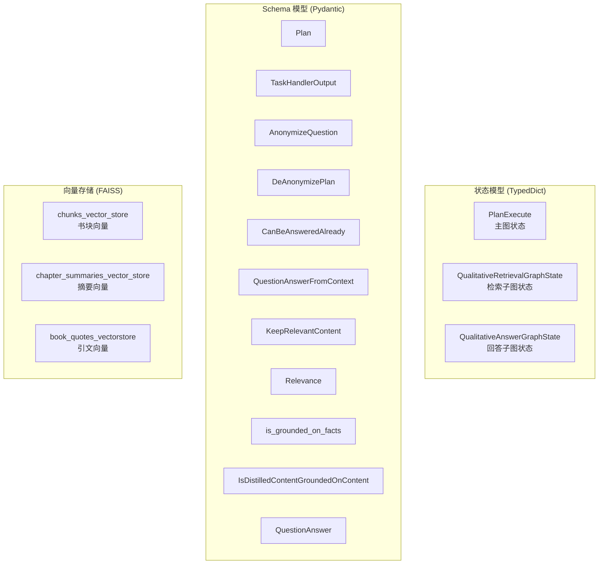
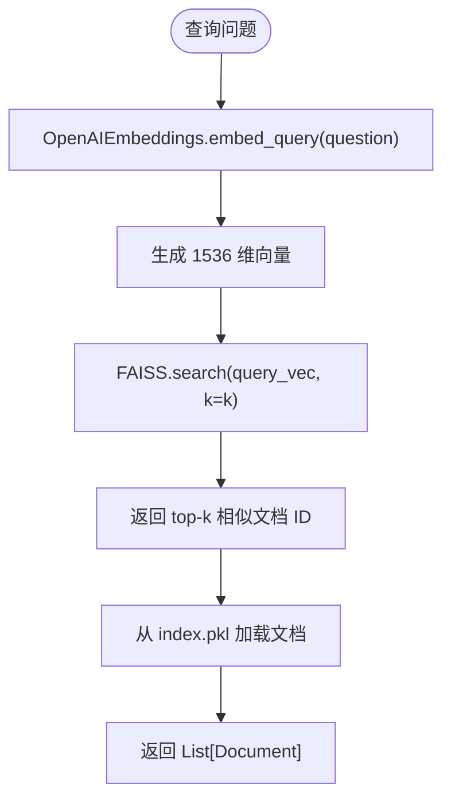
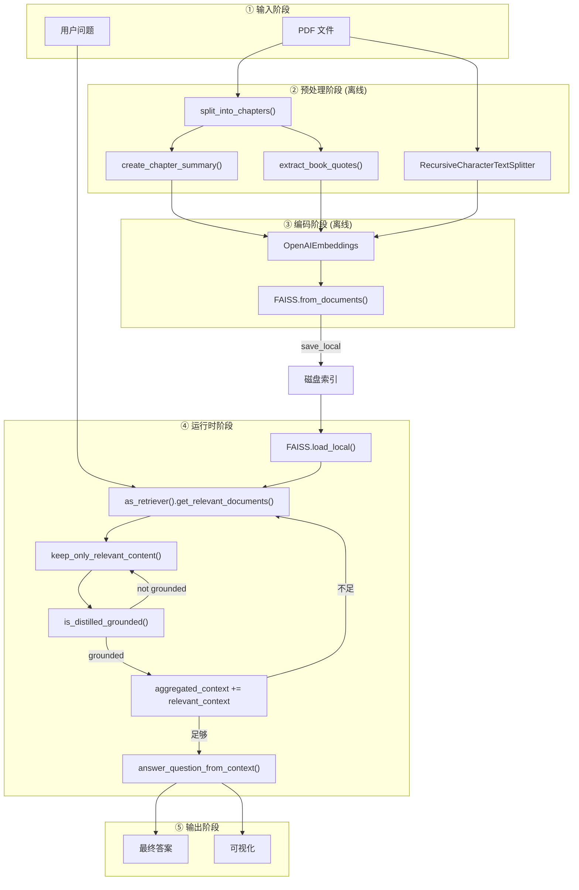
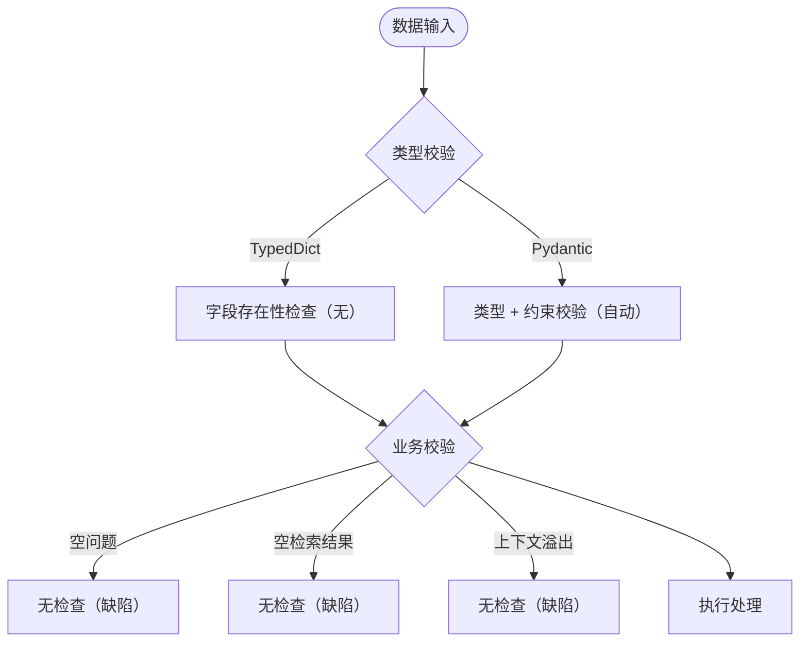

# 6. 数据模型与数据库设计 (Data Model & Database Design)

> **章节编号**: 06/13  
> **预计篇幅**: ~6,000 字  
> **核心数据**: TypedDict 状态、Pydantic Schema、FAISS 向量存储  
> **关联文件**: functions_for_pipeline.py, helper_functions.py

---

## 6.1 数据模型总览

本系统的数据模型可以分为 **三大类**：

| 类别 | 类型 | 用途 | 持久化 |
|------|------|------|--------|
| **状态模型** | TypedDict | Agent 运行时状态传递 | 否（内存） |
| **Schema 模型** | Pydantic BaseModel | LLM 结构化输出验证 | 否（内存） |
| **向量存储** | FAISS 索引 | 文档嵌入持久化 | 是（磁盘） |



---

## 6.2 状态模型 (TypedDict)

### 6.2.1 `PlanExecute` — 主图状态

```python
class PlanExecute(TypedDict):
    curr_state: str                      # 当前节点名称（用于可视化）
    question: str                        # 原始用户问题
    anonymized_question: str             # 匿名化后的问题
    query_to_retrieve_or_answer: str     # 当前任务的查询/问题
    plan: List[str]                      # 当前执行计划（步骤列表）
    past_steps: List[str]                # 已完成的步骤历史
    mapping: dict                        # 匿名化变量→原始实体映射
    curr_context: str                    # 当前任务的上下文
    aggregated_context: str              # 聚合的上下文（累积）
    tool: str                            # 当前选择的工具
    response: str                        # 最终答案
```

#### 字段详细说明

| 字段 | 类型 | 初始值 | 更新节点 | 说明 |
|------|------|--------|----------|------|
| `curr_state` | str | - | 每个节点 | 标识当前所在图节点，用于 UI 高亮 |
| `question` | str | 用户输入 | 不变 | 原始问题，全程保留用于最终判断 |
| `anonymized_question` | str | "" | anonymize_question | 变量替换后的问题 |
| `query_to_retrieve_or_answer` | str | "" | task_handler | 当前任务的检索查询或回答问题 |
| `plan` | List[str] | [] | planner, replan, task_handler | 动态变化的任务队列 |
| `past_steps` | List[str] | [] | task_handler | 已完成步骤的追加日志 |
| `mapping` | dict | {} | anonymize_question | 如 `{"X": "harry", "Y": "quirrell"}` |
| `curr_context` | str | "" | task_handler (Tool D) | 回答子图使用的上下文 |
| `aggregated_context` | str | "" | 检索/回答子图 | 累积的上下文信息 |
| `tool` | str | "" | task_handler | 工具选择标识 |
| `response` | str | "" | get_final_answer | 最终输出答案 |

#### 状态流转示例

```
初始状态:
{"question": "how did harry beat quirrell?", "curr_state": ""}

经过 anonymize_question:
{"question": "how did harry beat quirrell?", "anonymized_question": "how did X beat Y?", "mapping": {"X": "harry", "Y": "quirrell"}, "curr_state": "anonymize_question"}

经过 planner:
{"plan": ["Identify X", "Identify Y", "Find confrontation", "Determine outcome"], "curr_state": "planner"}

经过 de_anonymize_plan:
{"plan": ["Identify harry", "Identify quirrell", "Find confrontation", "Determine outcome"], ...}

经过 task_handler (选择 Tool A):
{"tool": "retrieve_chunks", "query_to_retrieve_or_answer": "information about harry", ...}

经过 retrieve_chunks:
{"aggregated_context": "Harry Potter is a wizard...", ...}

经过 replan:
{"plan": ["Identify quirrell", "Find confrontation", "Determine outcome"], ...}
```

### 6.2.2 `QualitativeRetrievalGraphState` — 检索子图状态

```python
class QualitativeRetrievalGraphState(TypedDict):
    question: str            # 查询问题
    context: str             # 检索到的原始文档
    relevant_context: str    # 蒸馏后的相关上下文
```

| 字段 | 类型 | 来源 | 说明 |
|------|------|------|------|
| `question` | str | 主图传入 | 当前任务的查询 |
| `context` | str | 检索器 | FAISS 返回的文档拼接 |
| `relevant_context` | str | 蒸馏 Chain | LLM 过滤后的内容 |

### 6.2.3 `QualitativeAnswerGraphState` — 回答子图状态

```python
class QualitativeAnswerGraphState(TypedDict):
    question: str    # 要回答的问题
    context: str     # 回答依据的上下文
    answer: str      # 生成的答案
```

---

## 6.3 Schema 模型 (Pydantic BaseModel)

### 6.3.1 Schema 模型清单

| Schema 名称 | 用途 | 字段 | 使用 Chain |
|-------------|------|------|-----------|
| `Plan` | 计划输出 | `steps: List[str]` | planner, replanner, break_down_plan |
| `TaskHandlerOutput` | 任务路由 | `query`, `curr_context`, `tool` | task_handler |
| `AnonymizeQuestion` | 匿名化输出 | `anonymized_question`, `mapping`, `explanation` | anonymize_question |
| `DeAnonymizePlan` | 去匿名化输出 | `plan: List` | de_anonymize_plan |
| `CanBeAnsweredAlready` | 可回答判断 | `can_be_answered: bool` | can_be_answered |
| `QuestionAnswerFromContext` | CoT 回答 | `answer_based_on_content: str` | answer_question_from_context |
| `KeepRelevantContent` | 蒸馏输出 | `relevant_content: str` | keep_only_relevant_content |
| `Relevance` | 相关性判断 | `is_relevant: bool`, `explanation: str` | is_relevant_content |
| `is_grounded_on_facts` | 幻觉检测 | `grounded_on_facts: bool` | is_answer_grounded_on_context |
| `IsDistilledContentGroundedOnContent` | 蒸馏验证 | `grounded: bool`, `explanation: str` | is_distilled_content_grounded_on_content |
| `QuestionAnswer` | 可回答判断 | `can_be_answered: bool`, `explanation: str` | (create_can_be_answered_chain，未使用) |

### 6.3.2 Schema 详细设计

#### `Plan` Schema

```python
class Plan(BaseModel):
    """Plan to follow in future"""
    steps: List[str] = Field(
        description="different steps to follow, should be in sorted order"
    )
```

> **设计 Rationale**: 使用 `List[str]` 而非 `List[Step]` 是因为：
> - 步骤是简单的字符串描述，不需要结构化
> - LLM 更容易生成正确的 JSON
> - 步骤的解释由 LLM 自行决定

#### `TaskHandlerOutput` Schema

```python
class TaskHandlerOutput(BaseModel):
    query: str = Field(description="The query to be either retrieved from the vector store, or the question that should be answered from context.")
    curr_context: str = Field(description="The context to be based on in order to answer the query.")
    tool: str = Field(description="The tool to be used should be either retrieve_chunks, retrieve_summaries, retrieve_quotes, or answer_from_context.")
```

> **设计 Rationale**: `tool` 字段使用字符串枚举而非 Enum 是因为：
> - LLM 生成字符串更可靠
> - 路由逻辑使用字符串匹配
> - 扩展新工具无需修改 Schema

#### `AnonymizeQuestion` Schema

```python
class AnonymizeQuestion(BaseModel):
    anonymized_question: str = Field(description="Anonymized question.")
    mapping: dict = Field(description="Mapping of original name entities to variables.")
    explanation: str = Field(description="Explanation of the action.")
```

> **设计 Rationale**: `mapping` 使用 `dict` 而非 `Dict[str, str]` 是因为：
> - Pydantic v1 的 dict 类型更灵活
> - 映射的键值都是字符串，运行时自然满足

---

## 6.4 FAISS 向量存储设计

### 6.4.1 FAISS 索引结构

FAISS (Facebook AI Similarity Search) 是一个高效的向量相似度检索库。本项目的 FAISS 索引使用 **Flat Index**（暴力搜索），适合小规模数据。

```
FAISS 索引文件结构:
├── index.faiss    # 二进制索引文件（向量数据 + 元数据）
└── index.pkl      # Pickle 文件（ID 映射 + 文档存储）
```

### 6.4.2 三个向量存储对比

| 维度 | chunks_vector_store | chapter_summaries_vector_store | book_quotes_vectorstore |
|------|---------------------|-------------------------------|------------------------|
| **索引文件** | 3.8 MB | 104 KB | 8 MB |
| **文档文件** | 614 KB | 28 KB | 336 KB |
| **文档数量** | ~700 | 17 | ~500 |
| **平均文档长度** | ~1000 字符 | ~5000 字符 | ~100 字符 |
| **嵌入维度** | 1536 | 1536 | 1536 |
| **检索 k 值** | 1 | 1 | 10 |
| **元数据** | 无 | chapter: int | 无 |
| **距离度量** | L2（默认） | L2 | L2 |

### 6.4.3 文档结构

#### Chunks 文档

```python
Document(
    page_content="Mr. and Mrs. Dursley, of number four, Privet Drive, were proud to say that they were perfectly normal, thank you very much...",
    metadata={}  # 无元数据
)
```

#### Chapter Summaries 文档

```python
Document(
    page_content="Chapter 1 introduces the Dursley family...",
    metadata={"chapter": 1}  # 章节号
)
```

#### Quotes 文档

```python
Document(
    page_content="It does not do to dwell on dreams and forget to live.",
    metadata={}  # 无元数据
)
```

### 6.4.4 嵌入模型

| 属性 | 值 |
|------|-----|
| **模型** | OpenAI `text-embedding-3-small`（默认） |
| **维度** | 1536 |
| **输入限制** | 8191 tokens |
| **输出** | float32 向量 |
| **归一化** | 自动（FAISS 内部处理） |

### 6.4.5 检索流程



### 6.4.6 索引创建流程

```python
# Notebook 中的编码流程
embeddings = OpenAIEmbeddings()

# 从文档创建索引
vectorstore = FAISS.from_documents(cleaned_texts, embeddings)

# 持久化
vectorstore.save_local("chunks_vector_store")
```

**`save_local` 内部操作**:
1. 将 FAISS 索引序列化为 `index.faiss`（二进制）
2. 将文档和 ID 映射序列化为 `index.pkl`（pickle/dill）

---

## 6.5 数据流向设计

### 6.5.1 完整数据流图



### 6.5.2 数据量级估算

| 数据类型 | 数量 | 平均大小 | 总大小 |
|----------|------|----------|--------|
| **Chunks** | 700 | 1 KB | 700 KB（文本）/ 3.8 MB（索引） |
| **Summaries** | 17 | 5 KB | 85 KB（文本）/ 104 KB（索引） |
| **Quotes** | 500 | 100 B | 50 KB（文本）/ 8 MB（索引） |
| **单次聚合上下文** | - | ~5-20 KB | - |
| **单次问题处理** | - | ~50-100 KB（LLM 交互） | - |

---

## 6.6 缓存策略

### 6.6.1 当前缓存策略

| 缓存层级 | 实现 | 作用 | 生命周期 |
|----------|------|------|----------|
| **向量存储缓存** | FAISS 索引文件 | 避免重复编码 | 永久（手动更新） |
| **检索器缓存** | 模块级单例 | 避免重复加载 | 应用生命周期 |
| **Chain 缓存** | 模块级单例 | 避免重复创建 | 应用生命周期 |

### 6.6.2 缺失的缓存

| 缺失缓存 | 影响 | 建议方案 |
|----------|------|----------|
| **LLM 响应缓存** | 重复查询多次调用 | 使用 LangSmith 或 Redis |
| **嵌入缓存** | 重复文本多次嵌入 | 本地嵌入缓存 |
| **检索结果缓存** | 相同查询重复检索 | LRU 缓存 |
| **计划缓存** | 相似问题重复计划 | 问题相似度匹配 |

---

## 6.7 事务设计

### 6.7.1 当前事务策略

本项目**无显式事务管理**，原因：
1. 无关系型数据库操作
2. 向量存储是只读的（运行时）
3. 状态在内存中，无持久化需求

### 6.7.2 潜在事务需求

| 场景 | 当前处理 | 风险 | 建议 |
|------|----------|------|------|
| **向量存储更新** | 离线手动 | 数据不一致 | 增加版本控制 |
| **状态持久化** | 无 | 崩溃丢失 | 增加 checkpoint |
| **并发写入** | 不支持 | 索引损坏 | 使用读写锁 |

---

## 6.8 数据一致性

### 6.8.1 一致性挑战

| 挑战 | 描述 | 当前处理 | 建议 |
|------|------|----------|------|
| **索引与文档同步** | 文档更新后索引未更新 | 手动重新编码 | 自动化流水线 |
| **蒸馏与原始一致性** | 蒸馏内容可能偏离原始 | `is_distilled_grounded` 验证 | 保留原始引用 |
| **聚合上下文顺序** | 多步聚合顺序影响结果 | 按执行顺序追加 | 考虑重排序 |

### 6.8.2 数据校验



> **改进建议**: 在状态进入图节点前增加**前置校验**：
> ```python
> def validate_state(state: PlanExecute) -> None:
>     if not state.get("question"):
>         raise ValueError("Question cannot be empty")
>     if state.get("aggregated_context") and len(state["aggregated_context"]) > 100000:
>         raise ValueError("Context too large")
> ```

---

## 6.9 数据模型演进建议

### 6.9.1 短期改进

| 改进 | 优先级 | 工作量 | 影响 |
|------|--------|--------|------|
| **增加状态校验** | 高 | 低 | 减少运行时错误 |
| **上下文截断** | 高 | 低 | 防止溢出 |
| **检索结果去重** | 中 | 低 | 减少冗余 |

### 6.9.2 中期改进

| 改进 | 优先级 | 工作量 | 影响 |
|------|--------|--------|------|
| **多文档支持** | 中 | 中 | 扩展能力 |
| **向量存储版本化** | 中 | 中 | 可追溯性 |
| **嵌入缓存** | 中 | 低 | 性能提升 |

### 6.9.3 长期改进

| 改进 | 优先级 | 工作量 | 影响 |
|------|--------|--------|------|
| **分布式向量存储** | 低 | 高 | 大规模扩展 |
| **结构化元数据** | 低 | 中 | 精确过滤 |
| **增量索引更新** | 低 | 中 | 实时性 |

---

## 6.10 本章小结

本章深入分析了系统的数据模型设计：

1. **状态模型**: 3 个 TypedDict，核心是 `PlanExecute`（11 个字段）
2. **Schema 模型**: 10 个 Pydantic BaseModel，用于 LLM 输出验证
3. **向量存储**: 3 个 FAISS 索引，共 ~1200 个文档
4. **数据流向**: PDF → 预处理 → 编码 → 检索 → 蒸馏 → 聚合 → 回答
5. **缓存策略**: 仅有模块级单例，缺少 LLM 响应缓存
6. **一致性**: 依赖 LLM 验证，无显式事务

**下一章**: [07-api-design.md](./07-api-design.md) — 分析 API 与接口设计。

---

# ❤️ 制作不易，请我喝咖啡☕️关注我➕

