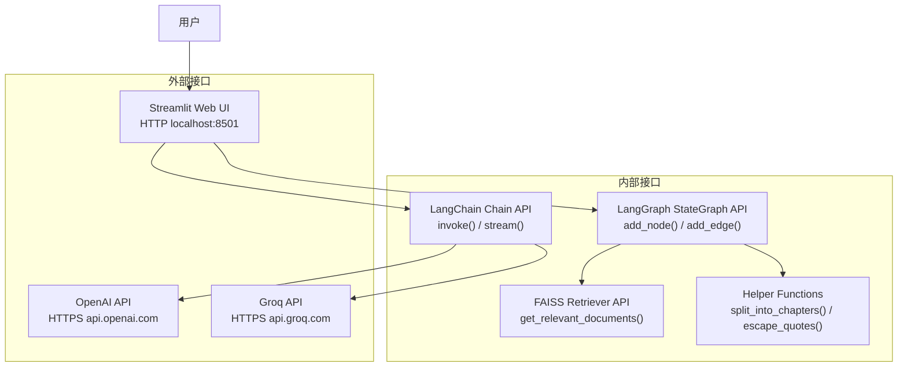

# 7. API 与接口设计 (API & Interface Design)

> **章节编号**: 07/13  
> **预计篇幅**: ~6,000 字  
> **覆盖范围**: 内部 API、LLM 调用接口、Streamlit 接口、OpenAI API

---

## 7.1 API 总览

本系统的接口可以分为 **四大类**：

| 类别 | 接口形式 | 协议 | 用途 |
|------|----------|------|------|
| **外部用户接口** | Streamlit Web UI | HTTP (localhost:8501) | 用户交互 |
| **LLM 调用接口** | LangChain Chain.invoke() | HTTPS (OpenAI/Groq) | 模型推理 |
| **内部模块接口** | Python 函数调用 | 内存 | 模块间通信 |
| **向量检索接口** | FAISS Retriever | 内存/文件 IO | 相似度检索 |



---

## 7.2 外部用户接口 (Streamlit Web UI)

### 7.2.1 接口概述

| 属性 | 值 |
|------|-----|
| **协议** | HTTP |
| **端口** | 8501 |
| **框架** | Streamlit |
| **端点** | 单页应用（SPA），无 RESTful 路由 |
| **输入方式** | `st.text_input()` + `st.button()` |
| **输出方式** | `st.write()` + `st.markdown()` + `components.html()` |

### 7.2.2 输入接口

#### 问题输入

```python
question = st.text_input(
    "Enter your question:",
    "what is the class that the proffessor who helped the villain is teaching?"
)
```

| 属性 | 值 |
|------|-----|
| **类型** | str |
| **默认值** | "what is the class that the proffessor who helped the villain is teaching?" |
| **校验** | 无 |
| **最大长度** | 无限制 |

#### 执行触发

```python
if st.button("Run Agent"):
    # 执行 Agent
```

| 属性 | 值 |
|------|-----|
| **类型** | 按钮点击事件 |
| **幂等性** | 否（每次点击重新执行） |
| **并发** | 不支持（单线程） |

### 7.2.3 输出接口

#### 实时状态输出

```python
placeholders = {
    "plan": col1.empty(),
    "past_steps": col2.empty(),
    "aggregated_context": col3.empty(),
}
```

| 字段 | 类型 | 更新时机 | 格式 |
|------|------|----------|------|
| `plan` | List[str] | 状态变化时 | 编号列表 |
| `past_steps` | List[str] | 状态变化时 | 编号列表 |
| `aggregated_context` | str | 状态变化时 | 纯文本 |

#### 图可视化输出

```python
graph_placeholder = st.empty()
# ...
components.html(graph_html, height=400, scrolling=True)
```

| 属性 | 值 |
|------|-----|
| **格式** | HTML (pyvis 生成) |
| **更新频率** | 每次状态变化 |
| **交互** | 支持缩放、拖拽 |

#### 最终答案输出

```python
st.write("Final Answer:")
st.write(response)
```

| 属性 | 值 |
|------|-----|
| **类型** | str |
| **格式** | 纯文本 |

---

## 7.3 LLM 调用接口

### 7.3.1 OpenAI Chat Completions 接口

#### 请求格式

```python
from langchain_openai import ChatOpenAI

llm = ChatOpenAI(
    temperature=0,           # 确定性输出
    model_name="gpt-4o",     # 模型选择
    max_tokens=2000          # 最大输出 token
)

response = llm.invoke("Hello, world!")
```

**底层 API 调用**:
```http
POST https://api.openai.com/v1/chat/completions
Authorization: Bearer {OPENAI_API_KEY}
Content-Type: application/json

{
    "model": "gpt-4o",
    "messages": [{"role": "user", "content": "Hello, world!"}],
    "temperature": 0,
    "max_tokens": 2000
}
```

#### 响应格式

```json
{
    "id": "chatcmpl-xxx",
    "object": "chat.completion",
    "created": 1719000000,
    "model": "gpt-4o-2024-05-13",
    "choices": [{
        "index": 0,
        "message": {
            "role": "assistant",
            "content": "Hello! How can I help you today?"
        },
        "finish_reason": "stop"
    }],
    "usage": {
        "prompt_tokens": 10,
        "completion_tokens": 20,
        "total_tokens": 30
    }
}
```

### 7.3.2 OpenAI Embeddings 接口

#### 请求格式

```python
from langchain_openai import OpenAIEmbeddings

embeddings = OpenAIEmbeddings()
vector = embeddings.embed_query("Harry Potter is a wizard")
```

**底层 API 调用**:
```http
POST https://api.openai.com/v1/embeddings
Authorization: Bearer {OPENAI_API_KEY}

{
    "model": "text-embedding-3-small",
    "input": "Harry Potter is a wizard"
}
```

#### 响应格式

```json
{
    "object": "list",
    "data": [{
        "object": "embedding",
        "index": 0,
        "embedding": [0.01, -0.02, ..., 0.03]
    }],
    "model": "text-embedding-3-small",
    "usage": {
        "prompt_tokens": 7,
        "total_tokens": 7
    }
}
```

### 7.3.3 Groq API 接口（备选）

```python
from langchain_groq import ChatGroq

llm = ChatGroq(
    temperature=0,
    model_name="llama3-70b-8192",
    max_tokens=4000
)
```

**底层 API 调用**:
```http
POST https://api.groq.com/openai/v1/chat/completions
Authorization: Bearer {GROQ_API_KEY}

{
    "model": "llama3-70b-8192",
    "messages": [{"role": "user", "content": "..."}],
    "temperature": 0,
    "max_tokens": 4000
}
```

### 7.3.4 所有 LLM 调用清单

| Chain 名称 | 模型 | temperature | max_tokens | 调用时机 | 平均延迟 |
|-----------|------|-------------|------------|----------|----------|
| `anonymize_question_chain` | gpt-4o | 0 | 2000 | 每个问题 1 次 | ~1s |
| `planner` | gpt-4o | 0 | 2000 | 每个问题 1 次 | ~2s |
| `break_down_plan_chain` | gpt-4o | 0 | 2000 | 每个问题 1-3 次 | ~2s |
| `replanner` | gpt-4o | 0 | 2000 | 每步 1 次 | ~2s |
| `de_anonymize_plan_chain` | gpt-4o | 0 | 2000 | 每个问题 1 次 | ~1s |
| `task_handler_chain` | gpt-4o | 0 | 2000 | 每步 1 次 | ~2s |
| `keep_only_relevant_content_chain` | gpt-4o | 0 | 2000 | 每次检索 1-N 次 | ~2s |
| `question_answer_from_context_cot_chain` | gpt-4o | 0 | 2000 | 每次回答 1-N 次 | ~3s |
| `is_relevant_content_chain` | gpt-4o | 0 | 2000 | （未使用） | - |
| `is_grounded_on_facts_chain` | gpt-4o | 0 | 2000 | 每次回答 1 次 | ~1s |
| `is_distilled_content_grounded_on_content_chain` | gpt-4o | 0 | 2000 | 每次蒸馏 1 次 | ~1s |
| `can_be_answered_already_chain` | gpt-4o | 0 | 2000 | 每次 replan 1 次 | ~1s |

**单次问题总调用次数**: 10-30 次（取决于计划步数和循环次数）

---

## 7.4 内部模块接口

### 7.4.1 LangChain Chain 接口

#### 标准调用模式

```python
# 同步调用
output = chain.invoke(input_data)

# 流式调用
for chunk in chain.stream(input_data):
    process(chunk)

# 批量调用
outputs = chain.batch([input1, input2, ...])
```

#### 输入输出规范

| Chain | 输入类型 | 输出类型 | 输出 Schema |
|-------|----------|----------|-------------|
| `planner` | `{"question": str}` | `Plan` | `steps: List[str]` |
| `task_handler_chain` | `{"curr_task", "aggregated_context", "last_tool", "past_steps", "question"}` | `TaskHandlerOutput` | `query, curr_context, tool` |
| `keep_only_relevant_content_chain` | `{"query", "retrieved_documents"}` | `KeepRelevantContent` | `relevant_content: str` |
| `question_answer_from_context_cot_chain` | `{"question", "context"}` | `QuestionAnswerFromContext` | `answer_based_on_content: str` |

### 7.4.2 LangGraph 图接口

#### 图构建接口

```python
from langgraph.graph import StateGraph

# 创建图
workflow = Graph(StateSchema)

# 添加节点
workflow.add_node("node_name", node_function)

# 添加边
workflow.add_edge("from_node", "to_node")

# 添加条件边
workflow.add_conditional_edges("from_node", condition_function, {
    "result1": "to_node_1",
    "result2": "to_node_2"
})

# 设置入口
workflow.set_entry_point("entry_node")

# 编译
app = workflow.compile()
```

#### 图执行接口

```python
# 同步执行
result = app.invoke(input_state)

# 流式执行
for output in app.stream(input_state, config={"recursion_limit": 45}):
    for node_name, node_output in output.items():
        process(node_name, node_output)

# 获取状态
state = app.get_state(config)

# 更新状态
app.update_state(config, new_state)
```

### 7.4.3 FAISS Retriever 接口

```python
# 创建检索器
retriever = vectorstore.as_retriever(search_kwargs={"k": 1})

# 检索
documents = retriever.get_relevant_documents("query")

# 返回: List[Document]
# Document(page_content="...", metadata={...})
```

### 7.4.4 Helper Functions 接口

| 函数 | 输入 | 输出 | 异常 |
|------|------|------|------|
| `num_tokens_from_string(string, encoding_name)` | str, str | int | KeyError |
| `split_into_chapters(book_path)` | str | List[Document] | FileNotFoundError |
| `extract_book_quotes_as_documents(documents, min_length)` | List[Document], int | List[Document] | - |
| `escape_quotes(text)` | str | str | - |
| `text_wrap(text, width)` | str, int | str | - |
| `is_similarity_ratio_lower_than_th(large, short, th)` | str, str, float | bool | ZeroDivisionError |
| `save_object(obj, filename)` | Any, str | None | IOError |
| `load_object(filename)` | str | Any | FileNotFoundError |

---

## 7.5 接口认证与安全

### 7.5.1 API Key 管理

```python
# .env 文件
OPENAI_API_KEY=sk-...
GROQ_API_KEY=gsk-...

# 加载方式
from dotenv import load_dotenv
load_dotenv()
os.environ["OPENAI_API_KEY"] = os.getenv('OPENAI_API_KEY')
```

| 安全维度 | 当前措施 | 风险 | 建议 |
|----------|----------|------|------|
| **Key 存储** | .env 文件 | 可能误提交 | .gitignore + Secret Manager |
| **Key 传输** | 环境变量 | 进程可见 | 使用内存加密 |
| **Key 轮换** | 手动 | 泄露风险 | 自动轮换机制 |

### 7.5.2 输入校验

| 输入 | 当前校验 | 风险 | 建议 |
|------|----------|------|------|
| **用户问题** | 无 | Prompt 注入 | 长度限制 + 内容过滤 |
| **API 响应** | Pydantic 验证 | 格式错误 | 增加重试 |
| **向量存储** | `allow_dangerous_deserialization` | 反序列化攻击 | 使用受信任源 |

### 7.5.3 限流策略

| 接口 | 当前限流 | 建议 |
|------|----------|------|
| **OpenAI API** | 无（依赖 OpenAI 侧） | 客户端限流 |
| **Streamlit** | 无 | 增加请求队列 |
| **FAISS** | 无 | 无需（本地） |

---

## 7.6 接口版本控制

### 7.6.1 当前版本策略

本项目**无显式版本控制**，原因：
1. 单页应用，无 RESTful API
2. LLM Chain 通过函数封装，修改即生效
3. 无外部 API 消费者

### 7.6.2 建议版本策略

| 接口类型 | 建议策略 |
|----------|----------|
| **Chain Prompt** | 版本化 Prompt 模板 |
| **向量存储** | 索引版本 + 元数据 |
| **状态 Schema** | 向后兼容的字段添加 |
| **图结构** | 图版本标记 |

---

## 7.7 错误处理接口

### 7.7.1 错误类型与处理

| 错误类型 | 来源 | 当前处理 | 建议 |
|----------|------|----------|------|
| **LLM 超时** | OpenAI API | LangChain 自动重试 | 增加超时配置 |
| **LLM 速率限制** | OpenAI API | 无 | 指数退避 |
| **向量存储缺失** | 文件 IO | 无（崩溃） | 友好错误提示 |
| **反序列化失败** | FAISS 加载 | 无 | 校验文件完整性 |
| **递归过深** | LangGraph | `recursion_limit` | 动态调整 |
| **无效工具** | task_handler | raise ValueError | 默认回退 |

### 7.7.2 错误响应格式

```python
# 当前错误处理
try:
    response = execute_plan_and_print_steps(...)
except Exception as e:
    response = f"An error occurred: {str(e)}"
    st.error(f"Error: {e}")
```

> **改进建议**: 定义结构化错误响应：
> ```python
> class AgentError:
>     code: str           # "LLM_TIMEOUT", "RECURSION_LIMIT", ...
>     message: str        # 用户友好消息
>     details: dict       # 技术详情
>     recoverable: bool   # 是否可重试
> ```

---

## 7.8 接口性能

### 7.8.1 延迟分析

| 操作 | 平均延迟 | 占比 |
|------|----------|------|
| **LLM 调用 (gpt-4o)** | 1-3s | ~80% |
| **向量检索 (FAISS)** | 100ms | ~1% |
| **图状态更新** | <10ms | <1% |
| **UI 渲染** | 100-500ms | ~5% |
| **其他（IO等）** | 100ms | ~1% |

**单次问题总延迟**: 30-120s（取决于计划步数）

### 7.8.2 吞吐量

| 指标 | 值 |
|------|-----|
| **并发用户** | 1（单 Streamlit 实例） |
| **每秒请求** | ~0.01-0.03（每问题 30-120s） |
| **日处理量** | ~3000-7000 问题（理论） |

---

## 7.9 本章小结

本章分析了系统的所有接口设计：

1. **外部接口**: Streamlit Web UI，单页应用，无 RESTful 路由
2. **LLM 接口**: 12 条 Chain，调用 OpenAI/Groq API
3. **内部接口**: Python 函数调用，TypedDict 状态传递
4. **安全**: API Key 通过 .env 管理，无输入校验
5. **性能**: 主要瓶颈是 LLM 调用延迟（每问题 10-30 次）

**下一章**: [08-deployment.md](./08-deployment.md) — 分析部署、运维与基础设施。

---

# ❤️ 制作不易，请我喝咖啡☕️关注我➕

