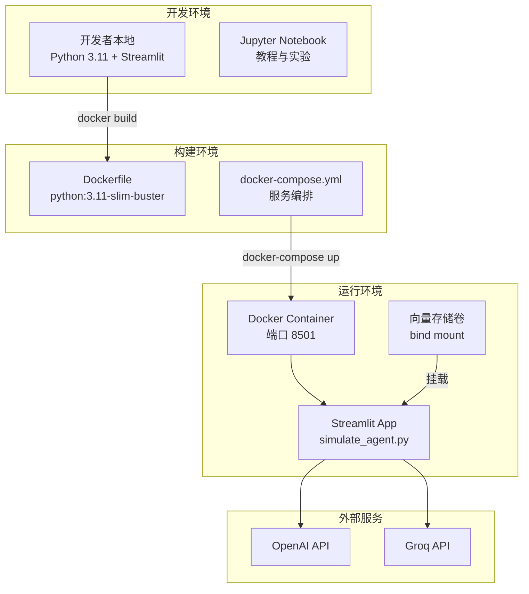
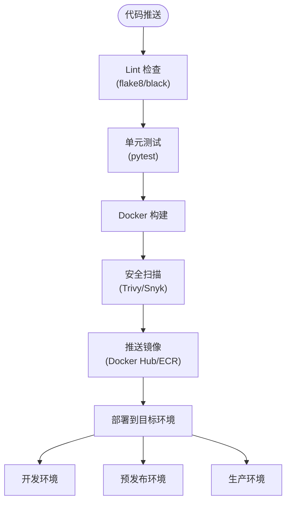
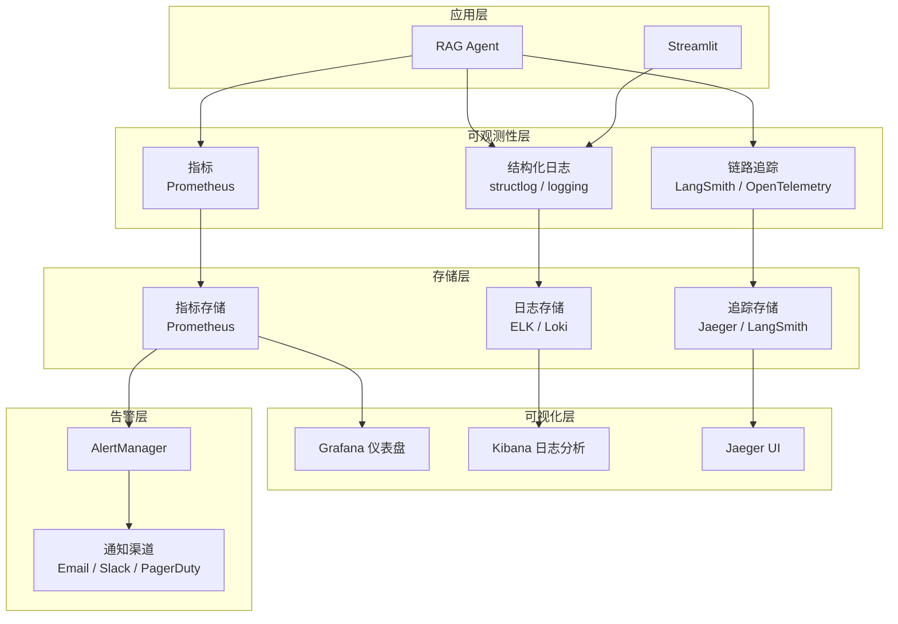
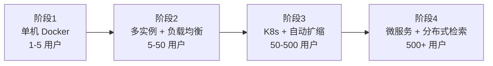

# 8. 部署、运维与基础设施 (Deployment, Operations & Infrastructure)

> **章节编号**: 08/13  
> **预计篇幅**: ~6,000 字  
> **覆盖范围**: Docker、CI/CD、监控、日志、备份

---

## 8.1 部署架构总览

### 8.1.1 部署架构图



### 8.1.2 部署模式对比

| 模式 | 适用场景 | 复杂度 | 当前支持 |
|------|----------|--------|----------|
| **本地直接运行** | 开发/调试 | 低 | ✅ |
| **Docker 单机** | 演示/小范围使用 | 中 | ✅ |
| **Docker Compose** | 单机多容器 | 中 | ✅ |
| **Kubernetes** | 生产/高可用 | 高 | ❌ |
| **云平台 (ECS/Cloud Run)** | 生产/自动扩缩 | 中 | ❌ |

---

## 8.2 Docker 配置详解

### 8.2.1 Dockerfile 分析

```dockerfile
FROM python:3.11-slim-buster

WORKDIR /app

# 安装系统依赖
RUN apt-get update && apt-get install -y \
    build-essential \
    gcc \
    g++ \
    curl \
    git \
    && rm -rf /var/lib/apt/lists/*

# 安装 Rust（某些 Python 包需要）
RUN curl https://sh.rustup.rs -sSf | sh -s -- -y
ENV PATH="/root/.cargo/bin:${PATH}"

# 升级 pip
RUN pip install --no-cache-dir --upgrade pip wheel setuptools

# 安装 Python 依赖
COPY requirements.txt ./
RUN pip install --no-cache-dir -r requirements.txt

# 复制应用代码
COPY . .

# 启动命令
CMD ["streamlit", "run", "simulate_agent.py"]
```

#### Dockerfile 层次分析

| 层次 | 指令 | 用途 | 缓存策略 |
|------|------|------|----------|
| **L1** | `FROM python:3.11-slim-buster` | 基础镜像 | 长期缓存 |
| **L2** | `apt-get install` | 系统依赖（gcc, curl, git） | 中期缓存 |
| **L3** | Rust 安装 | tiktoken 等需要 Rust 编译 | 中期缓存 |
| **L4** | `pip install` | Python 依赖 | requirements.txt 变化时失效 |
| **L5** | `COPY . .` | 应用代码 | 代码变化时失效 |
| **L6** | `CMD` | 启动命令 | - |

#### Dockerfile 问题与改进

| 问题 | 影响 | 改进方案 |
|------|------|----------|
| **无 .dockerignore 优化** | 构建上下文过大 | 已存在 .dockerignore |
| **Rust 安装增加构建时间** | +2-5 分钟 | 使用预编译 wheels |
| **无多阶段构建** | 镜像较大 (~2GB） | 使用 multi-stage |
| **无健康检查** | 无法自动恢复 | 增加 HEALTHCHECK |
| **无非 root 用户** | 安全风险 | 创建 app 用户 |

**改进后的 Dockerfile**:
```dockerfile
FROM python:3.11-slim-buster AS builder

WORKDIR /app
RUN apt-get update && apt-get install -y --no-install-recommends \
    build-essential gcc g++ curl \
    && rm -rf /var/lib/apt/lists/*

COPY requirements.txt ./
RUN pip install --no-cache-dir --prefix=/install -r requirements.txt

FROM python:3.11-slim-buster

WORKDIR /app
COPY --from=builder /install /usr/local
COPY . .

RUN useradd -m appuser && chown -R appuser:appuser /app
USER appuser

HEALTHCHECK --interval=30s --timeout=10s --start-period=5s --retries=3 \
    CMD curl -f http://localhost:8501/_stcore/health || exit 1

EXPOSE 8501
CMD ["streamlit", "run", "simulate_agent.py", "--server.port=8501", "--server.address=0.0.0.0"]
```

### 8.2.2 docker-compose.yml 分析

```yaml
version: '3.8'

services:
  web:
    build: .
    ports:
      - "8501:8501"
    environment:
      - OPENAI_API_KEY=${OPENAI_API_KEY}
      - GROQ_API_KEY=${GROQ_API_KEY}
    volumes:
      - .:/app
```

#### Compose 配置详解

| 配置项 | 值 | 说明 | 改进建议 |
|--------|-----|------|----------|
| **`build`** | `.` | 从当前目录构建 | 生产环境使用 image |
| **`ports`** | `8501:8501` | 主机:容器端口映射 | 可增加 HTTPS 反向代理 |
| **`environment`** | 环境变量 | 从 .env 注入 | 使用 `env_file` 更清晰 |
| **`volumes`** | `.:/app` | 代码热更新 | 生产环境应移除 |
| **`restart`** | 缺失 | - | 增加 `restart: unless-stopped` |

**改进后的 docker-compose.yml**:
```yaml
version: '3.8'

services:
  rag-agent:
    build:
      context: .
      dockerfile: Dockerfile
    image: controllable-rag-agent:latest
    container_name: rag-agent
    ports:
      - "8501:8501"
    env_file:
      - .env
    volumes:
      - vector_stores:/app/chunks_vector_store
      - vector_stores:/app/chapter_summaries_vector_store
      - vector_stores:/app/book_quotes_vectorstore
    restart: unless-stopped
    healthcheck:
      test: ["CMD", "curl", "-f", "http://localhost:8501/_stcore/health"]
      interval: 30s
      timeout: 10s
      retries: 3
    deploy:
      resources:
        limits:
          memory: 2G
          cpus: '2'

volumes:
  vector_stores:
    driver: local
```

### 8.2.3 .dockerignore 分析

```
__pycache__
*.pyc
.env
.git
.gitignore
```

> **评价**: 基本合理，但可进一步完善：
```
# 添加以下规则
*.pdf
*.ipynb
.ipynb_checkpoints
docs/
tests/
.github/
*.md
!README.md
```

---

## 8.3 构建与发布流程

### 8.3.1 当前构建流程

```bash
# 1. 克隆仓库
git clone https://github.com/NirDiamant/Controllable-RAG-Agent.git
cd Controllable-RAG-Agent

# 2. 配置环境变量
cp .env.example .env
# 编辑 .env 填入 API Key

# 3. Docker 构建
docker-compose up --build

# 4. 访问
open http://localhost:8501
```

### 8.3.2 建议 CI/CD 流水线



**GitHub Actions 示例**:
```yaml
name: CI/CD Pipeline

on:
  push:
    branches: [main]
  pull_request:
    branches: [main]

jobs:
  test:
    runs-on: ubuntu-latest
    steps:
      - uses: actions/checkout@v4
      - name: Set up Python
        uses: actions/setup-python@v4
        with:
          python-version: '3.11'
      - name: Install dependencies
        run: pip install -r requirements.txt
      - name: Lint
        run: |
          pip install flake8 black
          flake8 .
          black --check .
      - name: Test
        run: |
          pip install pytest
          pytest tests/

  build-and-push:
    needs: test
    runs-on: ubuntu-latest
    if: github.ref == 'refs/heads/main'
    steps:
      - uses: actions/checkout@v4
      - name: Build Docker image
        run: docker build -t controllable-rag-agent:${{ github.sha }} .
      - name: Push to registry
        run: |
          echo ${{ secrets.DOCKER_PASSWORD }} | docker login -u ${{ secrets.DOCKER_USERNAME }} --password-stdin
          docker tag controllable-rag-agent:${{ github.sha }} ${{ secrets.DOCKER_USERNAME }}/controllable-rag-agent:latest
          docker push ${{ secrets.DOCKER_USERNAME }}/controllable-rag-agent:latest
```

---

## 8.4 监控与可观测性

### 8.4.1 当前监控现状

| 维度 | 当前状态 | 工具 | 覆盖度 |
|------|----------|------|--------|
| **日志** | print 语句 | stdout | 低 |
| **追踪** | LangGraph stream | LangSmith（可选） | 中 |
| **指标** | Ragas 评估 | ragas 库 | 低 |
| **告警** | 无 | - | 无 |
| **健康检查** | 无 | - | 无 |

### 8.4.2 建议监控架构



### 8.4.3 建议日志配置

```python
# logging_config.py
import logging
import sys

def setup_logging():
    logger = logging.getLogger("rag_agent")
    logger.setLevel(logging.INFO)
    
    handler = logging.StreamHandler(sys.stdout)
    formatter = logging.Formatter(
        '%(asctime)s - %(name)s - %(levelname)s - %(message)s'
    )
    handler.setFormatter(formatter)
    logger.addHandler(handler)
    
    return logger

# 使用
logger = setup_logging()
logger.info("Agent started", extra={"question": question})
logger.error("LLM call failed", extra={"error": str(e)})
```

### 8.4.4 建议指标

| 指标名称 | 类型 | 说明 | 告警阈值 |
|----------|------|------|----------|
| `agent_requests_total` | Counter | 总请求数 | - |
| `agent_request_duration_seconds` | Histogram | 请求延迟 | P95 > 120s |
| `llm_calls_total` | Counter | LLM 调用次数 | - |
| `llm_errors_total` | Counter | LLM 错误次数 | > 5/分钟 |
| `retrieval_results_count` | Histogram | 检索结果数 | - |
| `hallucination_detected_total` | Counter | 幻觉检测次数 | > 10/小时 |
| `graph_recursion_depth` | Gauge | 图递归深度 | > 40 |

### 8.4.5 建议告警规则

```yaml
# alertmanager.yml
groups:
  - name: rag_agent_alerts
    rules:
      - alert: HighErrorRate
        expr: rate(llm_errors_total[5m]) > 0.1
        for: 5m
        labels:
          severity: warning
        annotations:
          summary: "LLM 错误率过高"
          
      - alert: SlowResponse
        expr: histogram_quantile(0.95, agent_request_duration_seconds) > 120
        for: 10m
        labels:
          severity: warning
        annotations:
          summary: "P95 延迟超过 120s"
          
      - alert: ContainerDown
        expr: up{job="rag-agent"} == 0
        for: 1m
        labels:
          severity: critical
        annotations:
          summary: "RAG Agent 容器宕机"
```

---

## 8.5 日志管理

### 8.5.1 当前日志现状

```python
# 当前使用 print 输出
print("Retrieving relevant chunks...")
print(f"plan: {state['plan']}")
pprint("--------------------")
```

**问题**:
1. 无日志级别（DEBUG/INFO/WARNING/ERROR）
2. 无结构化格式
3. 无上下文关联（无法追踪单次请求）
4. 无持久化

### 8.5.2 建议日志方案

```python
import structlog

logger = structlog.get_logger()

# 使用示例
logger.info("retrieval_started", 
            question=question, 
            tool="retrieve_chunks",
            query=query)

logger.info("retrieval_completed",
            results_count=len(docs),
            latency_ms=elapsed)

logger.warning("hallucination_detected",
               answer=answer,
               context=context[:200])
```

### 8.5.3 日志级别规范

| 级别 | 使用场景 | 示例 |
|------|----------|------|
| **DEBUG** | 开发调试 | 状态转换细节 |
| **INFO** | 正常流程 | 检索开始/完成、计划生成 |
| **WARNING** | 潜在问题 | 幻觉检测、递归接近限制 |
| **ERROR** | 错误事件 | LLM 调用失败、超时 |
| **CRITICAL** | 系统崩溃 | 向量存储加载失败 |

---

## 8.6 备份与恢复

### 8.6.1 需要备份的资产

| 资产 | 位置 | 大小 | 备份频率 | 恢复优先级 |
|------|------|------|----------|------------|
| **FAISS 索引** | `*_vector_store/` | ~12 MB | 低（不常变） | 高 |
| **源代码** | Git 仓库 | ~2 MB | 每次提交 | 高 |
| **配置** | `.env` | ~1 KB | 每次变更 | 中 |
| **评估数据** | Notebook 输出 | ~100 KB | 每次评估 | 低 |

### 8.6.2 备份策略

```bash
# 向量存储备份脚本
#!/bin/bash
BACKUP_DIR="/backups/rag-agent/$(date +%Y%m%d)"
mkdir -p $BACKUP_DIR

cp -r chunks_vector_store $BACKUP_DIR/
cp -r chapter_summaries_vector_store $BACKUP_DIR/
cp -r book_quotes_vectorstore $BACKUP_DIR/

# 保留最近 7 天
find /backups/rag-agent -mtime +7 -type d -exec rm -rf {} \;
```

### 8.6.3 灾难恢复

| 场景 | 恢复步骤 | RTO | RPO |
|------|----------|-----|-----|
| **容器崩溃** | Docker 自动重启 | < 1 分钟 | 0 |
| **索引损坏** | 从备份恢复 + 重新编码 | ~30 分钟 | 上次备份 |
| **API Key 泄露** | 轮换 Key + 重启容器 | ~5 分钟 | 0 |
| **完整重建** | 重新构建 Docker + 加载数据 | ~15 分钟 | 上次备份 |

---

## 8.7 环境管理

### 8.7.1 环境分离

| 环境 | 用途 | 配置差异 | 部署方式 |
|------|------|----------|----------|
| **开发** | 本地开发调试 | 本地 Python，热重载 | `streamlit run` |
| **测试** | CI/CD 自动化测试 | Mock LLM | Docker |
| **预发布** | 上线前验证 | 生产数据，测试 API Key | Docker Compose |
| **生产** | 正式服务 | 生产 API Key | Docker Compose / K8s |

### 8.7.2 配置管理

```python
# config.py
from pydantic_settings import BaseSettings

class Settings(BaseSettings):
    OPENAI_API_KEY: str = ""
    GROQ_API_KEY: str = ""
    MODEL_NAME: str = "gpt-4o"
    MAX_TOKENS: int = 2000
    RECURSION_LIMIT: int = 45
    LOG_LEVEL: str = "INFO"
    ENVIRONMENT: str = "development"
    
    class Config:
        env_file = ".env"

settings = Settings()
```

---

## 8.8 容量规划

### 8.8.1 资源需求

| 资源 | 最小 | 推荐 | 说明 |
|------|------|------|------|
| **CPU** | 1 核 | 2 核 | LLM 调用为 I/O 密集 |
| **内存** | 1 GB | 2 GB | 3 个 FAISS 索引 ~1 GB |
| **磁盘** | 500 MB | 1 GB | 索引 + 代码 + 日志 |
| **网络** | - | - | 出站 HTTPS 到 OpenAI |

### 8.8.2 扩展路径



---

## 8.9 本章小结

本章分析了系统的部署与运维设计：

1. **部署**: Docker + Docker Compose，单机部署
2. **构建**: 单阶段 Dockerfile，可优化为多阶段
3. **CI/CD**: 当前无，建议增加 GitHub Actions
4. **监控**: 仅有 print 日志，建议增加结构化日志 + Prometheus
5. **告警**: 当前无，建议增加 AlertManager
6. **备份**: 向量存储需要定期备份
7. **容量**: 单机即可，扩展需架构改造

**下一章**: [09-improvements.md](./09-improvements.md) — 分析改进建议、风险点与未来规划。

---

# ❤️ 制作不易，请我喝咖啡☕️关注我➕

