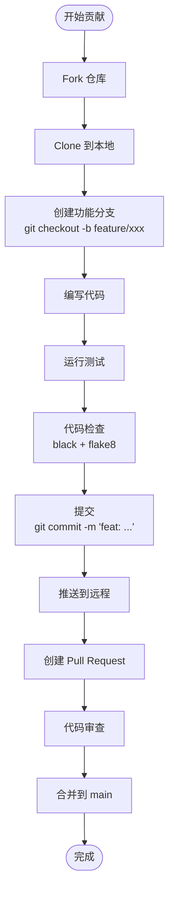

# 10. 开发者上手指南 (Developer Onboarding Guide)

> **章节编号**: 10/13  
> **预计篇幅**: ~5,000 字  
> **目标读者**: 新贡献者、使用者、学习者

---

## 10.1 环境准备

### 10.1.1 系统要求

| 要求 | 最低 | 推荐 |
|------|------|------|
| **操作系统** | macOS / Linux / Windows (WSL2) | macOS / Ubuntu 22.04 |
| **Python** | 3.8+ | 3.11 |
| **内存** | 4 GB | 8 GB |
| **磁盘** | 500 MB | 2 GB |
| **网络** | 可访问 OpenAI API | 稳定高速网络 |

### 10.1.2 依赖工具

| 工具 | 用途 | 安装方式 |
|------|------|----------|
| **Git** | 版本控制 | `brew install git` / `apt install git` |
| **Python 3.11** | 运行时 | `pyenv install 3.11` |
| **pip** | 包管理 | 随 Python 安装 |
| **Docker** (可选) | 容器化 | [Docker Desktop](https://www.docker.com/) |
| **VS Code** (推荐) | IDE | [下载](https://code.visualstudio.com/) |
| **Jupyter** | Notebook 运行 | `pip install jupyter` |

---

## 10.2 本地运行（无 Docker）

### 10.2.1 快速开始

```bash
# 1. 克隆仓库
git clone https://github.com/NirDiamant/Controllable-RAG-Agent.git
cd Controllable-RAG-Agent

# 2. 创建虚拟环境
python3 -m venv venv
source venv/bin/activate  # Windows: venv\Scripts\activate

# 3. 升级 pip
pip install --upgrade pip wheel setuptools

# 4. 安装依赖
pip install -r requirements.txt

# 5. 配置环境变量
cp .env.example .env
# 编辑 .env 文件，填入你的 API Key

# 6. 运行 Streamlit 应用
streamlit run simulate_agent.py
```

### 10.2.2 配置 .env 文件

```env
# .env
OPENAI_API_KEY=sk-your-openai-api-key-here
GROQ_API_KEY=gsk-your-groq-api-key-here  # 可选
```

> **注意**: `.env` 文件已加入 `.gitignore`，不会被提交到 Git。

### 10.2.3 验证安装

```bash
# 检查 Python 版本
python --version  # 应显示 3.8+

# 检查关键依赖
python -c "import langchain; print(langchain.__version__)"
python -c "import langgraph; print(langgraph.__version__)"
python -c "import streamlit; print(streamlit.__version__)"

# 检查向量存储
ls -la chunks_vector_store/
ls -la chapter_summaries_vector_store/
ls -la book_quotes_vectorstore/
```

---

## 10.3 Docker 运行

### 10.3.1 使用 Docker Compose（推荐）

```bash
# 1. 克隆仓库
git clone https://github.com/NirDiamant/Controllable-RAG-Agent.git
cd Controllable-RAG-Agent

# 2. 配置环境变量
cp .env.example .env
# 编辑 .env 文件

# 3. 构建并启动
docker-compose up --build

# 4. 访问
open http://localhost:8501

# 5. 停止
docker-compose down
```

### 10.3.2 使用 Docker 原生命令

```bash
# 构建镜像
docker build -t controllable-rag-agent .

# 运行容器
docker run -p 8501:8501 \
  --env-file .env \
  -v $(pwd)/chunks_vector_store:/app/chunks_vector_store \
  -v $(pwd)/chapter_summaries_vector_store:/app/chapter_summaries_vector_store \
  -v $(pwd)/book_quotes_vectorstore:/app/book_quotes_vectorstore \
  controllable-rag-agent
```

### 10.3.3 Docker 常见问题

| 问题 | 原因 | 解决方案 |
|------|------|----------|
| **端口被占用** | 8501 端口已使用 | `lsof -i :8501` 查找并终止，或修改端口映射 |
| **API Key 无效** | .env 未正确加载 | 检查 .env 文件路径和内容 |
| **向量存储缺失** | 目录未挂载 | 确保 volumes 配置正确 |
| **内存不足** | Docker 内存限制 | Docker Desktop → Resources → 增加内存 |

---

## 10.4 使用 Notebook 教程

### 10.4.1 运行 Notebook

```bash
# 安装 Jupyter
pip install jupyter

# 启动 Jupyter
jupyter notebook

# 在浏览器中打开
# http://localhost:8888/notebooks/sophisticated_rag_agent_harry_potter.ipynb
```

### 10.4.2 Notebook 结构导航

```
sophisticated_rag_agent_harry_potter.ipynb
├── Cell 0-5: 环境配置
│   ├── 导入库
│   ├── 设置 API Key
│   └── 编码配置
├── Cell 6-18: 数据预处理
│   ├── PDF 加载与分章节
│   ├── 引文提取
│   └── 章节摘要生成
├── Cell 19-30: 向量编码
│   ├── 书块编码
│   ├── 摘要编码
│   ├── 引文编码
│   └── 向量存储持久化
├── Cell 31-52: 简单 RAG 流程
│   ├── 检索函数
│   ├── 蒸馏 Chain
│   ├── 回答 Chain
│   ├── 验证 Chain
│   └── 图构建与测试
├── Cell 53-74: 复杂 Agent 流程
│   ├── 匿名化
│   ├── 计划生成
│   ├── 子图构建
│   └── 主图构建
├── Cell 75-108: 完整 Agent 测试
│   ├── 示例问题测试
│   └── 边界情况测试
└── Cell 109-118: 评估
    ├── 批量问题生成
    ├── Ragas 评估
    └── 结果分析
```

### 10.4.3 推荐学习路径

| 阶段 | 目标 | 涉及 Cell | 预计时间 |
|------|------|-----------|----------|
| **入门** | 理解基本 RAG | Cell 0-52 | 2-3 小时 |
| **进阶** | 理解 Agent 架构 | Cell 53-74 | 3-4 小时 |
| **实践** | 运行完整示例 | Cell 75-108 | 2-3 小时 |
| **评估** | 理解质量评估 | Cell 109-118 | 1-2 小时 |

---

## 10.5 开发环境配置

### 10.5.1 VS Code 推荐配置

```json
// .vscode/settings.json
{
    "python.defaultInterpreterPath": "./venv/bin/python",
    "python.linting.enabled": true,
    "python.linting.flake8Enabled": true,
    "python.formatting.provider": "black",
    "editor.formatOnSave": true,
    "python.testing.pytestEnabled": true,
    "python.testing.pytestArgs": ["tests"]
}
```

### 10.5.2 推荐 VS Code 扩展

| 扩展 | 用途 | 安装命令 |
|------|------|----------|
| **Python** | Python 语言支持 | `ext install ms-python.python` |
| **Jupyter** | Notebook 支持 | `ext install ms-toolsai.jupyter` |
| **Pylance** | 类型检查 | `ext install ms-python.vscode-pylance` |
| **Docker** | Docker 支持 | `ext install ms-azuretools.vscode-docker` |
| **Mermaid** | Mermaid 预览 | `ext install bierner.markdown-mermaid` |
| **GitLens** | Git 增强 | `ext install eamodio.gitlens` |

### 10.5.3 pre-commit 配置

```yaml
# .pre-commit-config.yaml
repos:
  - repo: https://github.com/pre-commit/pre-commit-hooks
    rev: v4.5.0
    hooks:
      - id: trailing-whitespace
      - id: end-of-file-fixer
      - id: check-yaml
      - id: check-added-large-files
      - id: check-merge-conflict

  - repo: https://github.com/psf/black
    rev: 24.3.0
    hooks:
      - id: black

  - repo: https://github.com/pycqa/flake8
    rev: 7.0.0
    hooks:
      - id: flake8
        args: [--max-line-length=120]
```

```bash
# 安装 pre-commit
pip install pre-commit
pre-commit install
```

---

## 10.6 调试指南

### 10.6.1 Streamlit 应用调试

```python
# 启用 Streamlit 调试模式
streamlit run simulate_agent.py --logger.level=debug

# 或在代码中设置
import logging
logging.basicConfig(level=logging.DEBUG)
```

### 10.6.2 LangGraph 图调试

```python
# 打印图结构
app = create_agent()
print(app.get_graph().draw_mermaid())

# 获取图的状态
for output in app.stream(inputs, config={"recursion_limit": 10}):
    for node_name, node_output in output.items():
        print(f"Node: {node_name}")
        print(f"Output: {node_output}")
        print("---")
```

### 10.6.3 LLM 调用调试

```python
# 启用 LangChain 调试
import langchain
langchain.debug = True

# 或使用回调
from langchain.callbacks import StdOutCallbackHandler

handler = StdOutCallbackHandler()
llm = ChatOpenAI(callbacks=[handler])
```

### 10.6.4 常见错误排查

| 错误 | 原因 | 解决方案 |
|------|------|----------|
| **ModuleNotFoundError** | 依赖未安装 | `pip install -r requirements.txt` |
| **AuthenticationError** | API Key 无效 | 检查 .env 文件 |
| **FileNotFoundError** | 向量存储缺失 | 运行 Notebook 预处理或下载索引 |
| **RateLimitError** | API 调用过于频繁 | 增加延迟或升级 API 计划 |
| **RecursionError** | 图递归过深 | 增加 `recursion_limit` 或检查循环逻辑 |
| **JSONDecodeError** | LLM 输出格式错误 | 检查 Prompt 或增加重试 |

---

## 10.7 测试指南

### 10.7.1 当前测试现状

> **注意**: 本项目当前**无单元测试**。以下是建议的测试策略。

### 10.7.2 建议测试结构

```
tests/
├── __init__.py
├── conftest.py                    # 共享 fixtures
├── test_helper_functions.py       # 工具函数测试
├── test_chains.py                 # Chain 测试
├── test_graphs.py                 # 图测试
├── test_integration.py            # 集成测试
└── fixtures/
    ├── sample_document.json       # 测试用 Document
    ├── sample_state.json          # 测试用状态
    └── mock_llm.py                # Mock LLM
```

### 10.7.3 测试示例

```python
# tests/test_helper_functions.py
import pytest
from helper_functions import (
    num_tokens_from_string,
    escape_quotes,
    text_wrap,
    is_similarity_ratio_lower_than_th
)

def test_num_tokens_from_string():
    """测试 token 计数"""
    tokens = num_tokens_from_string("Hello world", "gpt-4o")
    assert tokens > 0
    assert isinstance(tokens, int)

def test_escape_quotes():
    """测试引号转义"""
    assert escape_quotes('He said "hello"') == 'He said \\"hello\\"'
    assert escape_quotes("It's fine") == "It\\'s fine"

def test_text_wrap():
    """测试文本换行"""
    long_text = "a" * 200
    wrapped = text_wrap(long_text, width=80)
    assert "\n" in wrapped

def test_is_similarity_ratio_lower_than_th():
    """测试相似度判断"""
    assert is_similarity_ratio_lower_than_th("hello world", "hello", 0.5) == False
    assert is_similarity_ratio_lower_than_th("abc", "xyz", 0.5) == True

# tests/test_chains.py
from unittest.mock import MagicMock, patch
from functions_for_pipeline import create_plan_chain

def test_planner_output_format():
    """测试 planner 输出格式"""
    with patch('functions_for_pipeline.ChatOpenAI') as mock_llm:
        mock_llm.return_value.with_structured_output.return_value.invoke.return_value = MagicMock(
            steps=["step1", "step2"]
        )
        
        planner = create_plan_chain()
        result = planner.invoke({"question": "test question"})
        assert hasattr(result, 'steps')
        assert isinstance(result.steps, list)
```

### 10.7.4 运行测试

```bash
# 安装测试依赖
pip install pytest pytest-cov pytest-mock

# 运行所有测试
pytest

# 运行特定测试
pytest tests/test_helper_functions.py

# 生成覆盖率报告
pytest --cov=src --cov-report=html

# 运行并显示详细输出
pytest -v -s
```

---

## 10.8 贡献指南

### 10.8.1 贡献流程



### 10.8.2 代码规范

| 规范 | 工具 | 配置 |
|------|------|------|
| **格式化** | Black | line-length=88 |
| **Lint** | flake8 | max-line-length=120 |
| **类型检查** | mypy | strict=False |
| **导入排序** | isort | profile=black |

### 10.8.3 Commit 消息规范

```
<type>: <description>

type:
├── feat:     新功能
├── fix:      修复 bug
├── docs:     文档更新
├── style:    代码格式（不影响功能）
├── refactor: 重构
├── test:     测试
├── chore:    构建/工具
└── perf:     性能优化

示例:
feat: add parallel retrieval for chunks and summaries
fix: correct input_variables missing comma in task_handler_chain
docs: add architecture diagrams to README
```

---

## 10.9 常见问题 FAQ

### 10.9.1 安装问题

**Q: pip install 失败，提示 Rust 编译错误？**
A: 某些依赖（如 tiktoken）需要 Rust 编译器。安装 Rust：
```bash
curl https://sh.rustup.rs -sSf | sh -s -- -y
source $HOME/.cargo/env
```

**Q: 向量存储文件太大，无法下载？**
A: 向量存储是离线预处理的产物。你可以：
1. 从 Releases 页面下载预构建的索引
2. 运行 Notebook 自行生成（需要原始 PDF）

### 10.9.2 运行问题

**Q: 应用启动后显示 "No response found"？**
A: 检查：
1. API Key 是否正确配置
2. 网络是否正常
3. 查看终端错误日志

**Q: 执行时间过长（>5 分钟）？**
A: 可能原因：
1. 问题过于复杂，计划步数过多
2. LLM 调用频繁失败重试
3. 网络延迟高
尝试：简化问题、检查网络、增加 `recursion_limit`

### 10.9.3 开发问题

**Q: 如何添加新的检索类型？**
A: 参考现有模式：
1. 创建新的向量存储
2. 创建新的检索函数
3. 创建新的子图
4. 在主图中添加节点和边
5. 更新 task_handler_chain 的 Prompt

**Q: 如何更换 LLM 模型？**
A: 修改 `create_*_chain()` 函数中的 `model_name` 参数：
```python
llm = ChatOpenAI(temperature=0, model_name="gpt-3.5-turbo")
```

---

## 10.10 本章小结

本章提供了完整的开发者上手指南：

1. **环境准备**: Python 3.11、Git、Docker（可选）
2. **本地运行**: 虚拟环境 + pip install + streamlit run
3. **Docker 运行**: docker-compose up --build
4. **Notebook 教程**: 119 cells，分阶段学习
5. **开发环境**: VS Code + 推荐扩展 + pre-commit
6. **调试**: Streamlit debug、LangGraph 图打印、LangChain debug
7. **测试**: 当前无测试，提供了测试结构和示例
8. **贡献**: Fork → Branch → Code → PR 流程
9. **FAQ**: 常见安装、运行、开发问题

**下一章**: [11-adr.md](./11-adr.md) — 架构决策记录。

---

# ❤️ 制作不易，请我喝咖啡☕️关注我➕

