# 第 03 章 系统流程与时序图

> **内容**: 核心业务流程与交互时序分析
> **图表**: 12 个流程图 + 10 个时序图

---

## 3.1 文档入库流程（Insert Pipeline）

### 3.1.1 流程图

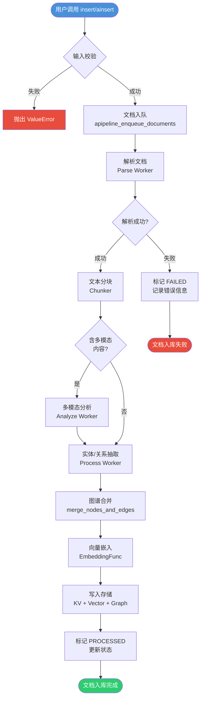

### 3.1.2 时序图

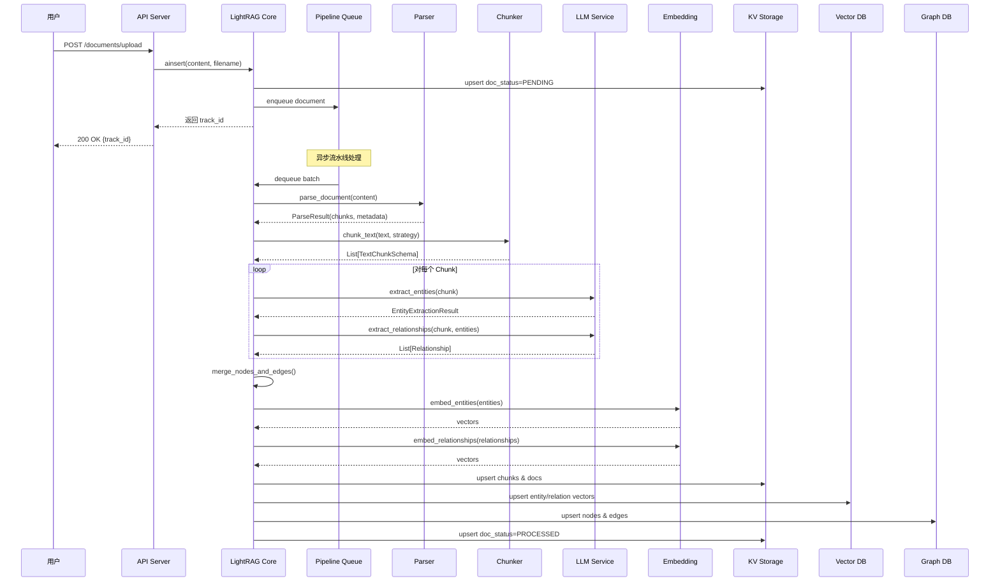

### 3.1.3 详细解释

#### 流程步骤分析

**1. 输入校验阶段**:
- **入口**: `LightRAG.insert()` / `LightRAG.ainsert()`
- **校验内容**: 内容非空、文件名合法、处理选项有效
- **异常处理**: 校验失败抛出 `ValueError`，不进入队列
- **关键函数**: `parse_process_options()` 解析分块和解析配置

**2. 文档入队阶段**:
- **入口**: `_PipelineMixin.apipeline_enqueue_documents()`
- **操作**:
  - 生成文档 ID（`compute_mdhash_id`）
  - 创建初始状态记录（PENDING）
  - 将文档信息写入 `full_docs`
  - 将文档状态写入 `doc_status`
  - 发送入队消息到 Pipeline Queue
- **关键文件**: `lightrag/pipeline.py` 第 359 行

**3. 文档解析阶段**:
- **入口**: `_parse_worker()`
- **处理**:
  - 根据文件后缀选择解析器
  - 调用对应 Parser 提取文本内容
  - 处理多模态内容（图片引用）
- **解析引擎**: Native / MinerU / Docling
- **关键文件**: `lightrag/parser/routing.py`

**4. 文本分块阶段**:
- **策略选择**: 根据 `process_options` 选择分块策略
- **Fix**: 固定 token 大小分块
- **Recursive**: 递归字符分块
- **Vector**: 向量语义分块
- **Paragraph**: 段落语义分块
- **关键文件**: `lightrag/chunker/`

**5. 实体/关系抽取阶段**:
- **入口**: `extract_entities()` in `operate.py`
- **处理**:
  - 对每个 Chunk 调用 LLM 抽取实体
  - 对每个 Chunk 调用 LLM 抽取关系
  - 解析 LLM 返回的 JSON
  - 处理 JSON 修复（`json_repair`）
- **并发控制**: 通过信号量限制并发 LLM 调用
- **关键文件**: `lightrag/operate.py` 第 3559 行

**6. 图谱合并阶段**:
- **入口**: `merge_nodes_and_edges()`
- **处理**:
  - 合并同名实体（描述去重、属性合并）
  - 合并同义边（权重累加）
  - 更新向量数据库
- **关键文件**: `lightrag/operate.py` 第 3222 行

**7. 向量嵌入阶段**:
- **入口**: `EmbeddingFunc.__call__()`
- **处理**:
  - 实体名称 → 向量
  - 关系描述 → 向量
  - 文本块内容 → 向量
- **批量处理**: 支持批量嵌入提高效率

**8. 存储写入阶段**:
- **KV Storage**: 写入 `text_chunks`、`full_docs`
- **Vector DB**: 写入 `entities`、`relationships`、`chunks`
- **Graph DB**: 写入节点和边
- **DocStatus**: 更新为 PROCESSED

#### 异常处理

| 异常类型 | 处理方式 | 结果状态 |
|----------|----------|----------|
| 解析失败 | 记录错误，标记 FAILED | FAILED |
| LLM 调用超时 | 重试（tenacity），超过重试次数标记 FAILED | FAILED |
| JSON 解析失败 | 尝试 `json_repair`，仍失败则跳过该 Chunk | 部分成功 |
| 存储写入失败 | 抛出 `IndexFlushError`，批次回滚 | FAILED |
| 流水线取消 | 捕获 `PipelineCancelledException`，优雅终止 | CANCELLED |

---

## 3.2 知识图谱构建流程（KG Construction）

### 3.2.1 流程图

```mermaid
flowchart TD
    Start([开始 KG 构建]) --> GetChunks[获取所有文本块<br/>从 text_chunks KV]
    GetChunks --> LoopStart{还有未处理的<br/>Chunk?}

    LoopStart -->|是| GetOneChunk[取出一个 Chunk]
    GetOneChunk --> CallLLM[调用 LLM 抽取<br/>实体 + 关系]
    CallLLM --> ParseResult[解析 LLM 返回<br/>JSON → 结构化数据]

    ParseResult --> ValidResult{结果有效?}
    ValidResult -->|否| SkipChunk[跳过该 Chunk<br/>记录警告日志]
    ValidResult -->|是| StoreRaw[存储原始抽取结果<br/>full_entities/full_relations]

    StoreRaw --> LoopStart

    LoopStart -->|否| MergeStart[开始图谱合并]
    MergeStart --> GroupEntities[按实体名称分组<br/>跨文档聚合]
    GroupEntities --> MergeEntities[合并同名实体<br/>描述去重、属性合并]
    MergeEntities --> GroupRelations[按关系对分组<br/>(src, tgt) 聚合]
    GroupRelations --> MergeRelations[合并同义边<br/>权重累加、描述合并]

    MergeRelations --> EmbedPhase[向量嵌入阶段]
    EmbedPhase --> EmbedEntities[实体名称 → 向量]
    EmbedEntities --> EmbedRelations[关系描述 → 向量]

    EmbedRelations --> WriteVDB[写入向量数据库<br/>entities_vdb + relationships_vdb]
    WriteVDB --> WriteGraph[写入图数据库<br/>节点 + 边]
    WriteGraph --> Done([KG 构建完成])

    style Start fill:#4A90D9,color:#fff
    style Done fill:#2ECC71,color:#fff
    style SkipChunk fill:#F39C12,color:#fff
```

### 3.2.2 时序图

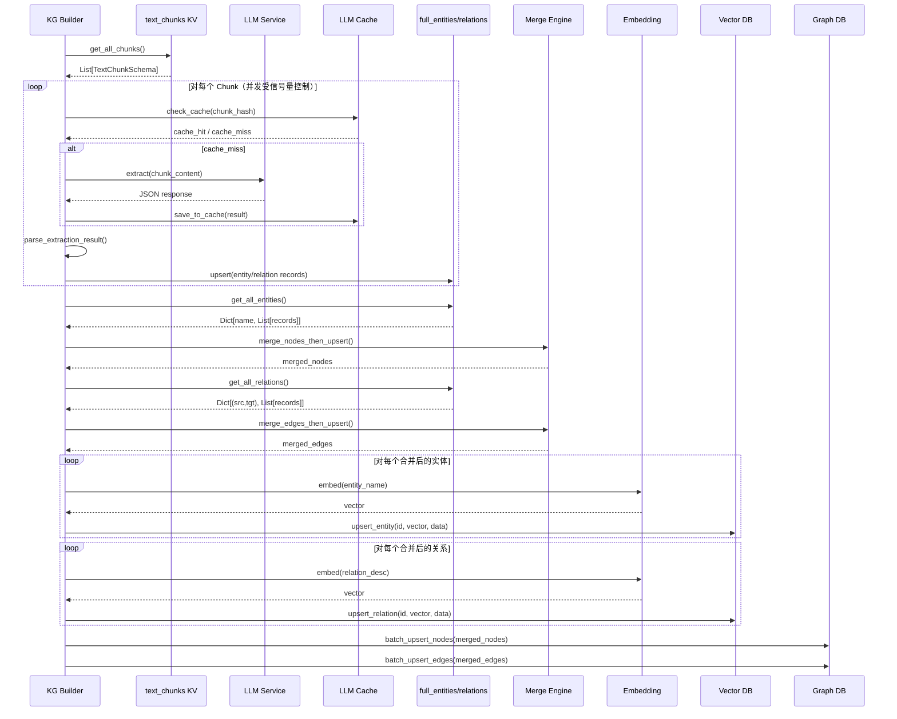

### 3.2.3 详细解释

#### 实体抽取详细流程

**1. 提示词构建**:
- 使用 `prompt.py` 中的 `entity_extraction` 模板
- 包含：实体类型定义、输出格式示例、待抽取文本
- 支持多语言（中文/英文）

**2. LLM 调用**:
- 使用 EXTRACT 角色配置的 LLM
- 支持缓存（相同输入直接返回缓存结果）
- 超时控制（`DEFAULT_LLM_TIMEOUT`）

**3. 结果解析**:
- 尝试 JSON 解析
- 失败时使用 `json_repair` 修复
- 使用 Pydantic 模型校验（`EntityExtractionResult`）

**4. 实体归一化**:
- 名称标准化（大小写、空格、特殊字符）
- 类型标准化（映射到预定义类型）
- 描述去重与截断

#### 图谱合并算法

**实体合并**:
```
输入: 同名实体的多个描述
处理:
  1. 描述去重（语义相似度 > 阈值则合并）
  2. 属性合并（来源文档列表合并）
  3. 权重更新（出现次数累加）
输出: 合并后的单一实体
```

**关系合并**:
```
输入: 同对实体的多个关系
处理:
  1. 关键词合并（去重）
  2. 描述合并（去重）
  3. 权重累加
输出: 合并后的单一关系
```

---

## 3.3 查询处理流程（Query Pipeline）

### 3.3.1 流程图

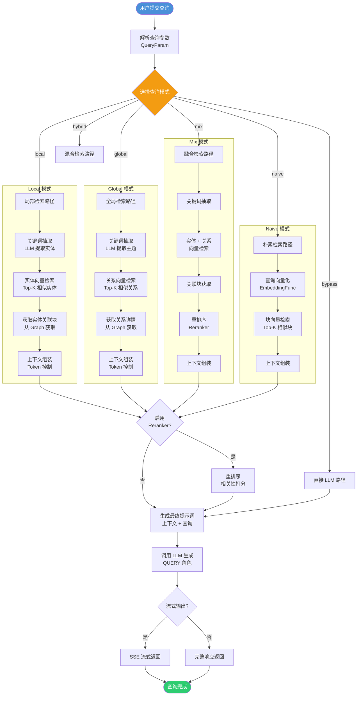

### 3.3.2 时序图

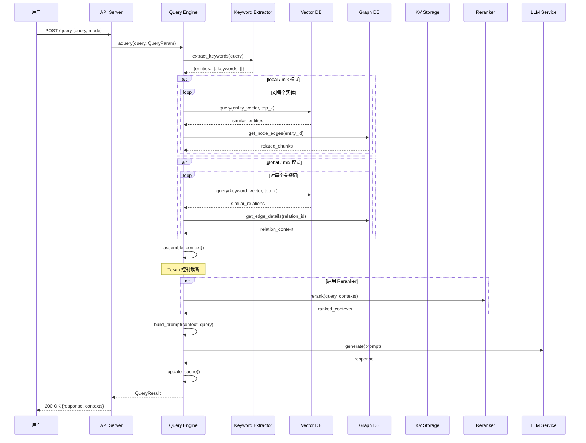

### 3.3.3 详细解释

#### 查询模式详解

**Local 模式**:
- **核心思想**: 基于查询中的实体进行局部图遍历
- **适用场景**: 特定实体相关问题（如"Python 的作者是谁？"）
- **检索范围**: 实体节点 → 关联边 → 关联块
- **优势**: 精确度高，上下文紧凑

**Global 模式**:
- **核心思想**: 基于全局知识图谱的广泛检索
- **适用场景**: 需要全局知识的问题（如"总结本文档的主要内容"）
- **检索范围**: 关系节点 → 全局主题
- **优势**: 覆盖面广，适合总结类问题

**Hybrid 模式**:
- **核心思想**: Local + Global 的简单组合
- **适用场景**: 平衡局部与全局
- **实现**: 分别执行两种检索，合并结果

**Mix 模式（推荐）**:
- **核心思想**: 知识图谱 + 向量检索深度融合
- **适用场景**: 通用场景，默认推荐
- **特点**: 包含重排序，检索质量最高

**Naive 模式**:
- **核心思想**: 纯向量检索，无图谱增强
- **适用场景**: 基线对比、简单查询
- **实现**: 查询向量化 → 块向量检索 → 上下文组装

**Bypass 模式**:
- **核心思想**: 直接 LLM 回答，无检索
- **适用场景**: 通用知识问题（如"什么是机器学习？"）
- **实现**: 直接调用 LLM，不检索任何上下文

#### Token 控制机制

LightRAG 使用统一的 Token 控制机制管理上下文大小：

```python
@dataclass
class QueryParam:
    max_entity_tokens: int = 8192    # 实体上下文最大 token
    max_relation_tokens: int = 8192  # 关系上下文最大 token
    max_total_tokens: int = 30000    # 总上下文最大 token
```

**截断策略**:
1. 按 Top-K 检索结果排序
2. 逐个添加到上下文
3. 达到 token 上限时截断
4. 优先保留高相关性内容

---

## 3.4 分块策略流程（Chunking Strategies）

### 3.4.1 流程图

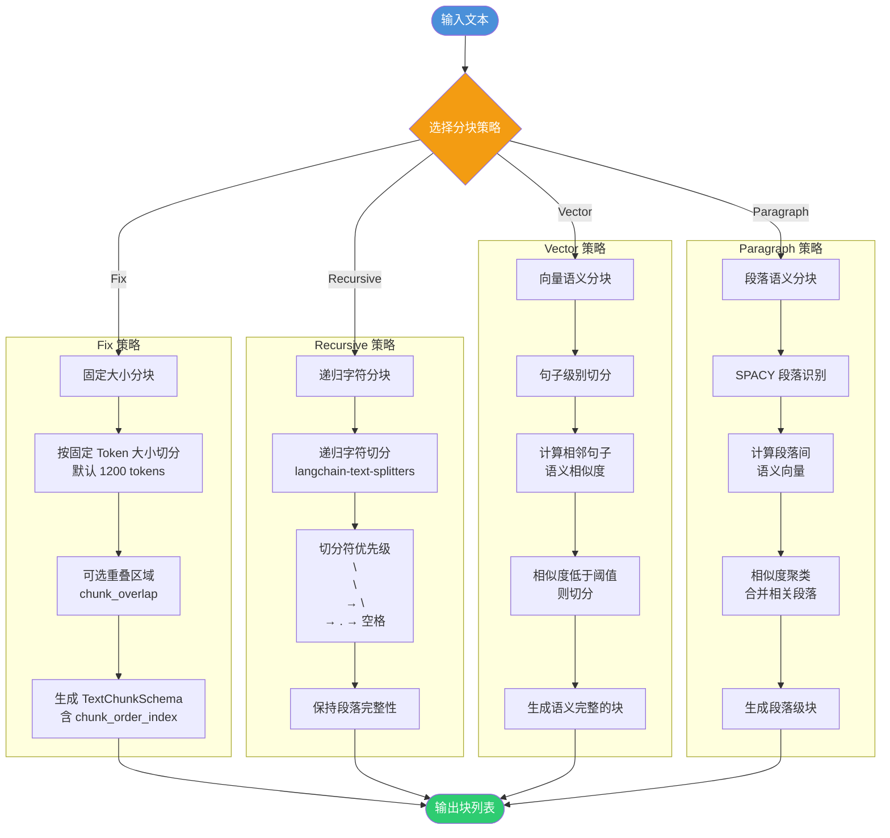

### 3.4.2 详细解释

#### 四种分块策略对比

| 维度 | Fix | Recursive | Vector | Paragraph |
|------|-----|-----------|--------|-----------|
| **切分单位** | 固定 Token | 递归字符 | 语义相似度 | 段落 |
| **语义保持** | 弱 | 中 | 强 | 强 |
| **计算开销** | 极低 | 低 | 高（需 Embedding） | 高（需 SPACY + Embedding） |
| **块大小均匀** | 是 | 较均匀 | 不均匀 | 不均匀 |
| **依赖** | tiktoken | langchain | 嵌入模型 | spacy + 嵌入模型 |
| **适用场景** | 通用 | 长文档 | 语义敏感 | 结构化文档 |

#### Fix 策略实现

**文件**: `lightrag/chunker/token_size.py`

**核心逻辑**:
1. 使用 tokenizer 将文本转为 token 列表
2. 按 `chunk_token_size` 切分
3. 可选 `chunk_overlap` 重叠区域
4. 生成 `TextChunkSchema`（含 tokens, content, full_doc_id, chunk_order_index）

#### Recursive 策略实现

**文件**: `lightrag/chunker/recursive_character.py`

**核心逻辑**:
1. 使用 `langchain-text-splitters` 的 `RecursiveCharacterTextSplitter`
2. 切分符优先级：`\n\n` → `\n` → `.` → ` ` → ``
3. 保持段落和句子的完整性

#### Vector 策略实现

**文件**: `lightrag/chunker/semantic_vector.py`

**核心逻辑**:
1. 将文本切分为句子
2. 计算相邻句子的语义相似度
3. 相似度低于阈值则切分
4. 生成语义完整的块

#### Paragraph 策略实现

**文件**: `lightrag/chunker/paragraph_semantic.py`（106,286 行，最大文件）

**核心逻辑**:
1. 使用 SPACY 进行段落识别
2. 计算段落间语义向量
3. 相似度聚类合并相关段落
4. 生成段落级块

---

## 3.5 文档解析流程（Document Parsing）

### 3.5.1 流程图

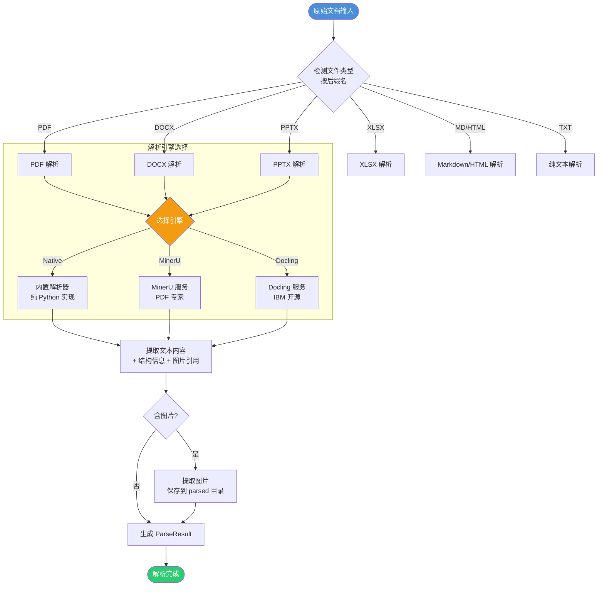

### 3.5.2 时序图

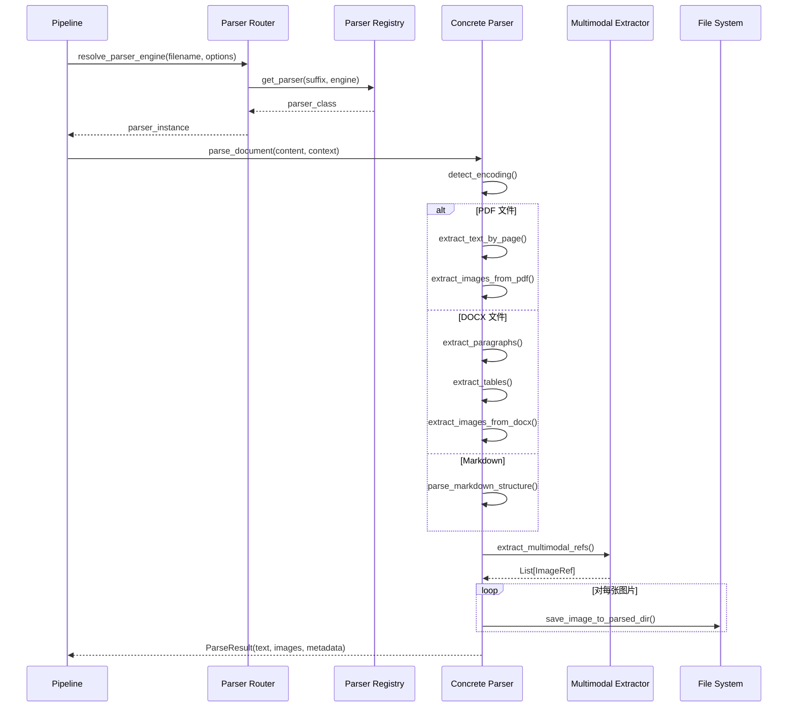

### 3.5.3 详细解释

#### 解析器架构

**Parser Registry**（`lightrag/parser/registry.py`）:
- 维护文件后缀 → 解析器类的映射
- 支持插件化注册第三方解析器
- 提供 `get_parser()` 统一入口

**Parser Base**（`lightrag/parser/base.py`）:
- 定义 `parse_document()` 抽象方法
- 提供 `ParseContext` 上下文对象
- 支持解析选项传递

**Native Parser**（`lightrag/parser/native_base.py`）:
- 纯 Python 实现，无外部依赖
- 支持：PDF (pypdf)、DOCX (python-docx)、PPTX (python-pptx)、MD、HTML、TXT

**External Parser**:
- **MinerU**: PDF 专业解析，支持复杂排版
- **Docling**: IBM 开源，支持多种格式
- 通过 HTTP 服务调用

---

## 3.6 多模态处理流程（Multimodal Pipeline）

### 3.6.1 流程图

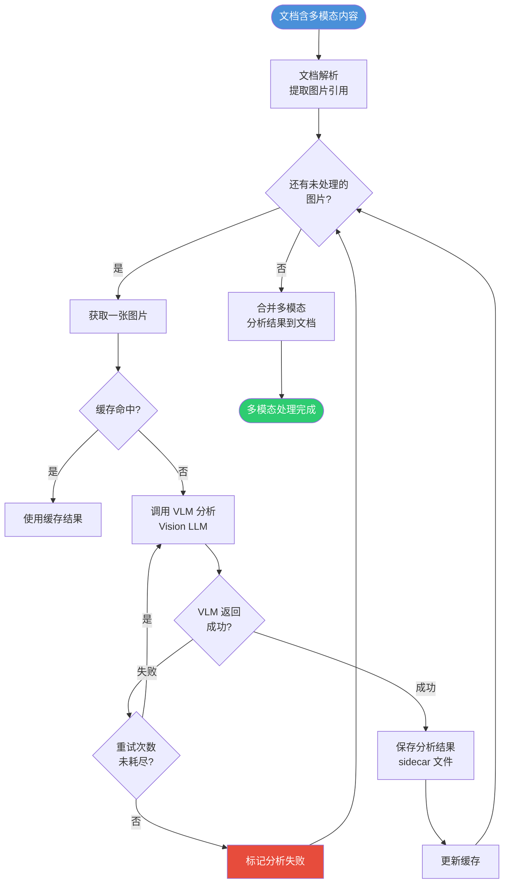

### 3.6.2 详细解释

#### 多模态处理架构

**VLM 调用**:
- 使用 VLM 角色配置的 LLM（通常是 GPT-4V 或 Gemini Pro Vision）
- 输入：图片 + 分析提示词
- 输出：图片描述、表格数据、公式识别

**Sidecar 机制**:
- 多模态分析结果存储在 `.sidecar.jsonl` 文件
- 与原始文档关联
- 支持增量更新

**缓存策略**:
- 基于图片内容的哈希值缓存
- 相同图片不重复分析
- 减少 API 调用成本

---

## 3.7 缓存机制流程（LLM Cache）

### 3.7.1 流程图

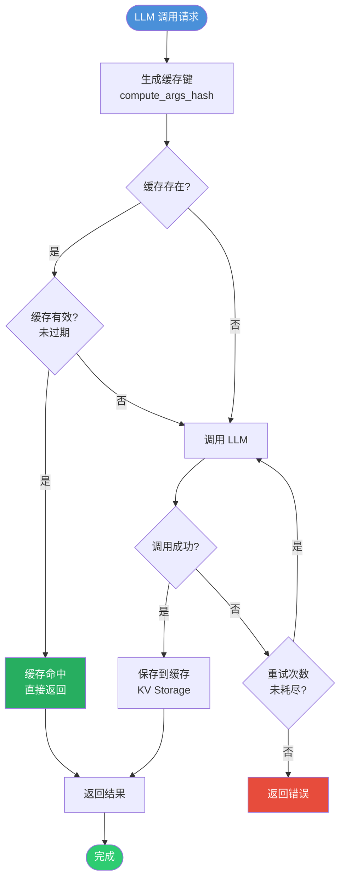

### 3.7.2 详细解释

#### 缓存键生成

```python
def generate_cache_key(mode: str, cache_type: str, hash_value: str) -> str:
    return f"{mode}_{cache_type}_{hash_value}"
```

**缓存类型**:
- `extract`: 实体/关系抽取缓存
- `query`: 查询回答缓存
- `keywords`: 关键词抽取缓存

**哈希计算**:
- 使用 `compute_args_hash()` 对参数进行哈希
- 包含：查询文本、模式、Top-K 等参数
- 确保相同参数生成相同缓存键

#### 缓存存储

- **存储位置**: `llm_response_cache`（KV Storage）
- **存储内容**: `CacheData`（response, creation_time, mode, cache_type）
- **过期策略**: 基于 TTL 或手动清理
- **缓存清理**: `aclear_cache()` 方法

---

## 3.8 文档删除与 KG 重建流程

### 3.8.1 流程图

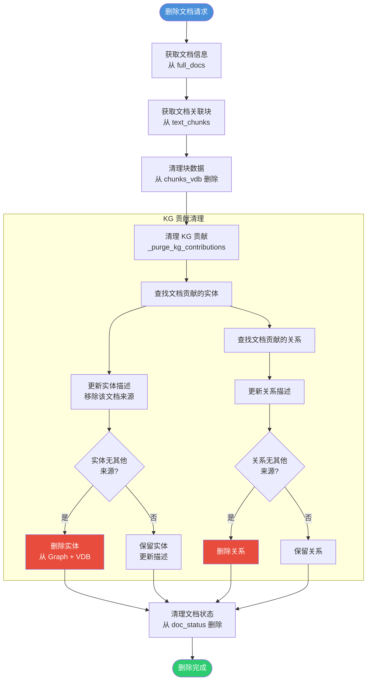

### 3.8.2 时序图

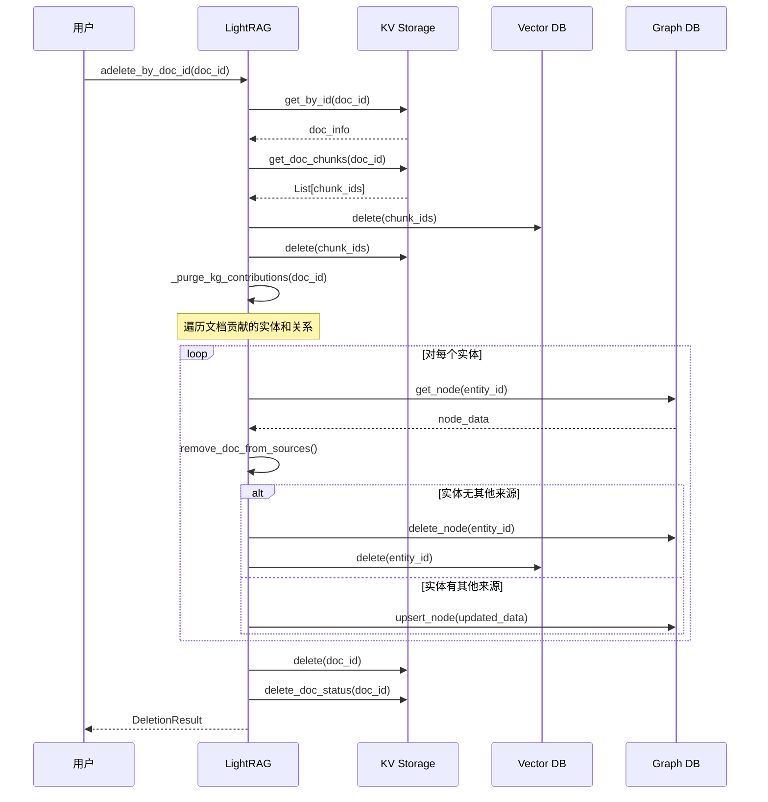

### 3.8.3 详细解释

#### 删除策略

**级联删除**:
1. 删除文档本身（`full_docs`）
2. 删除文档的文本块（`text_chunks` + `chunks_vdb`）
3. 清理知识图谱贡献（实体/关系）
4. 删除文档状态（`doc_status`）

**KG 贡献清理**:
- 实体：移除该文档的来源引用，若无其他来源则删除实体
- 关系：同上
- 向量：同步删除对应的向量记录

---

## 3.9 认证与权限流程（Auth Flow）

### 3.9.1 时序图

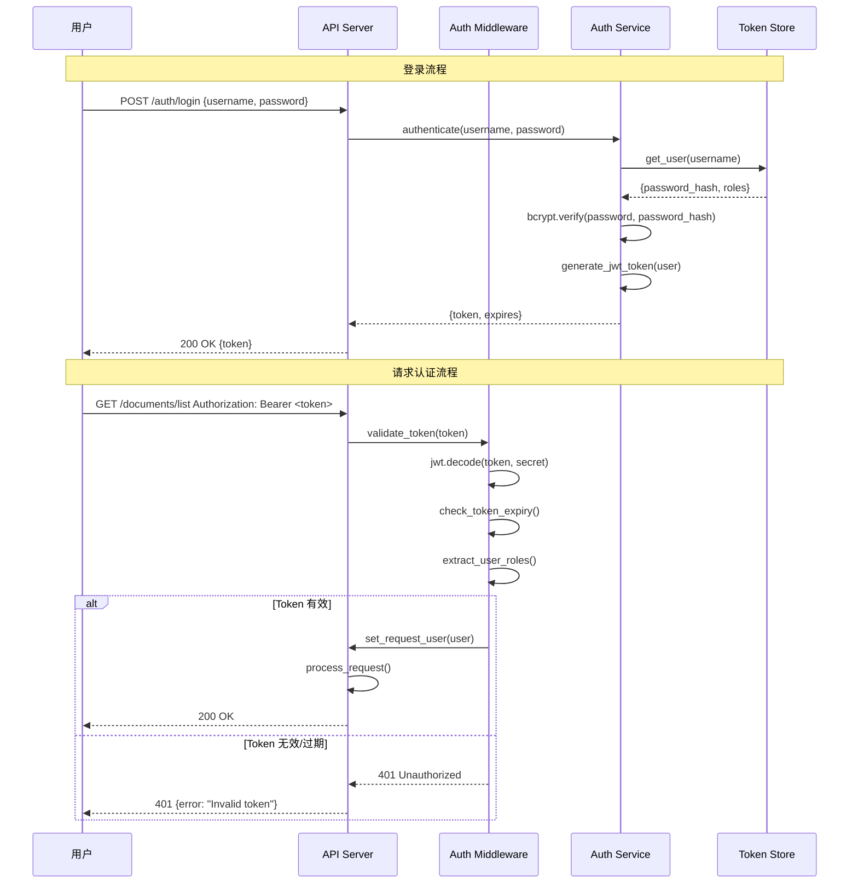

### 3.9.2 详细解释

#### 认证机制

**API Key 认证**:
- 请求头：`X-API-Key: your-api-key`
- 适用于服务间调用
- 配置：`LIGHTRAG_API_KEY` 环境变量

**JWT Token 认证**:
- 登录后获取 Token
- 请求头：`Authorization: Bearer <token>`
- Token 包含：用户 ID、角色、过期时间
- 签名算法：HS256

**密码存储**:
- 使用 bcrypt 哈希
- 工作因子：12（默认）
- 不支持明文存储

#### 权限控制

**角色类型**:
- `admin`: 完全控制
- `user`: 基本操作（查询、上传）
- `readonly`: 只读访问

**权限粒度**:
- 路由级别：通过依赖注入控制
- 工作空间级别：多租户隔离

---

## 3.10 存储后端初始化流程

### 3.10.1 流程图

```mermaid
flowchart TD
    Start([LightRAG 实例创建]) --> PostInit[__post_init__<br/>初始化配置]
    PostInit --> BuildConfig[构建全局配置<br/>_build_global_config]
    BuildConfig --> InitStorages[initialize_storages<br/>异步初始化]

    subgraph StorageInit["存储初始化"]
        InitStorages --> CreateKV[创建 KV Storage<br/>工厂模式]
        CreateKV --> InitKV[KV.initialize()<br/>建立连接/加载文件]
        InitKV --> CreateVector[创建 Vector Storage]
        InitVector --> InitVectorDB[Vector.initialize()<br/>创建索引]
        InitVectorDB --> CreateGraph[创建 Graph Storage]
        InitGraph --> InitGraphDB[Graph.initialize()<br/>加载图数据]
        InitGraphDB --> CreateDocStatus[创建 DocStatus Storage]
        InitDocStatus --> InitDocStatusDB[DocStatus.initialize()]
    end

    InitDocStatusDB --> PipelineInit[初始化流水线状态<br/>initialize_pipeline_status]
    PipelineInit --> RegisterNS[注册命名空间<br/>namespace isolation]
    RegisterNS --> Ready([系统就绪])

    style Start fill:#4A90D9,color:#fff
    style Ready fill:#2ECC71,color:#fff
```

### 3.10.2 详细解释

#### 初始化顺序

1. **配置构建**: 合并环境变量、配置文件、构造参数
2. **KV Storage 初始化**: 最先初始化，其他存储可能依赖
3. **Vector Storage 初始化**: 创建向量索引
4. **Graph Storage 初始化**: 加载图数据
5. **DocStatus Storage 初始化**: 加载文档状态
6. **Pipeline 状态初始化**: 注册命名空间，准备接收文档

#### 命名空间隔离

```python
class NameSpace:
    KV_STORE_FULL_DOCS = "full_docs"
    KV_STORE_TEXT_CHUNKS = "text_chunks"
    VECTOR_STORE_ENTITIES = "entities"
    GRAPH_STORE_CHUNK_ENTITY_RELATION = "chunk_entity_relation"
    DOC_STATUS = "doc_status"
```

- 每个 LightRAG 实例有独立的命名空间
- 多工作空间支持（`workspace` 参数）
- 命名空间用于存储键前缀，实现数据隔离

---

## 3.11 重排序流程（Reranker）

### 3.11.1 流程图

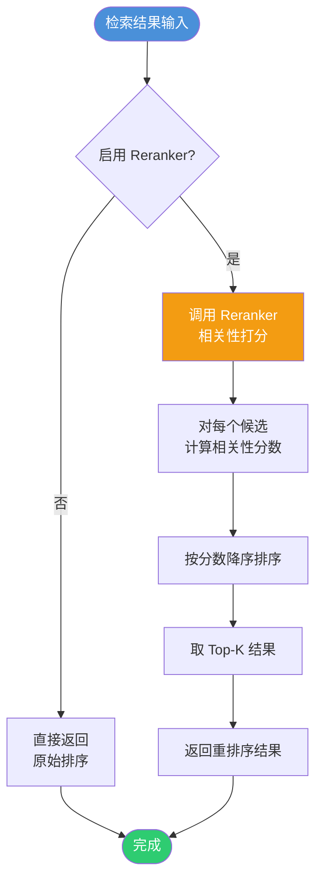

### 3.11.2 详细解释

#### Reranker 架构

**抽象接口** (`lightrag/rerank.py`):
```python
class BaseReranker(ABC):
    @abstractmethod
    async def rerank(self, query: str, documents: list) -> list[tuple[str, float]]:
        ...
```

**实现方式**:
- **Jina Reranker**: 调用 Jina AI API
- **Cohere Reranker**: 调用 Cohere API
- **本地模型**: 使用 HuggingFace 模型

**集成点**:
- 在 `kg_query()` 函数中调用
- 在上下文组装前执行
- 可配置开关（`enable_rerank` 参数）

---

## 3.12 实体编辑与合并流程

### 3.12.1 流程图

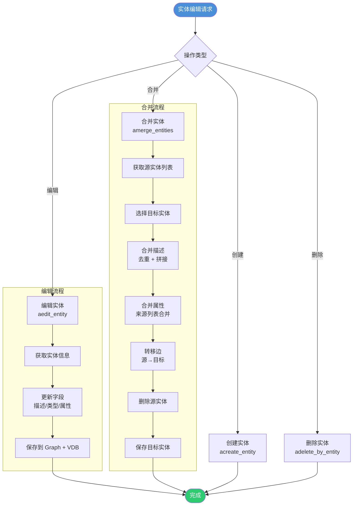

### 3.12.2 详细解释

#### 实体合并算法

**输入**: 多个同名或同义实体
**处理**:
1. 选择主实体（通常是出现次数最多的）
2. 合并描述（去重、截断）
3. 合并属性（来源文档列表合并）
4. 转移边（所有关联边转移到主实体）
5. 删除冗余实体
6. 更新向量数据库

**关键函数**: `amerge_entities()` in `lightrag/lightrag.py`

---

## 3.13 本章小结

本章对 LightRAG 的核心业务流程进行了全面分析：

| 流程 | 关键入口 | 核心步骤 | 输出 |
|------|----------|----------|------|
| **文档入库** | `ainsert()` | 入队→解析→分块→抽取→合并→入库 | PROCESSED 状态 |
| **KG 构建** | `extract_entities()` | 抽取→合并→嵌入→写入 | 知识图谱 |
| **查询处理** | `aquery()` | 路由→检索→重排序→生成 | 回答 + 上下文 |
| **分块策略** | `Chunker` | 4 种策略可选 | 文本块列表 |
| **文档解析** | `Parser` | 多引擎→多格式 | 结构化文本 |
| **多模态** | `Analyze Worker` | VLM 分析→sidecar | 图片描述 |
| **缓存** | `handle_cache()` | 哈希→查询→存储 | 缓存命中/未命中 |
| **文档删除** | `adelete_by_doc_id()` | 级联清理 | 删除结果 |
| **认证** | `Auth MW` | JWT 验证→角色提取 | 认证结果 |
| **存储初始化** | `initialize_storages()` | 工厂→初始化→注册 | 就绪状态 |
| **重排序** | `Reranker` | 打分→排序→截断 | 重排序结果 |
| **实体编辑** | `aedit_entity()` | 获取→更新→保存 | 编辑结果 |

**关键设计模式**:
- **生产者-消费者**: Pipeline 文档处理
- **策略模式**: 查询模式、分块策略
- **模板方法**: 存储后端抽象
- **观察者模式**: 状态变更通知

下一章将深入分析模块结构和依赖关系。

---

> **下一章**: [04-模块结构与依赖分析.md](./04-模块结构与依赖分析.md)

---

☕️ 制作不易，请我喝咖啡☕️关注我➕

