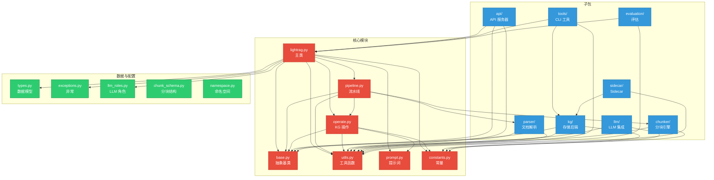
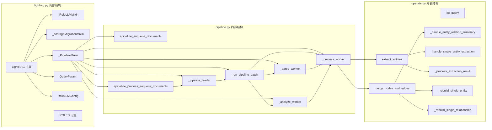
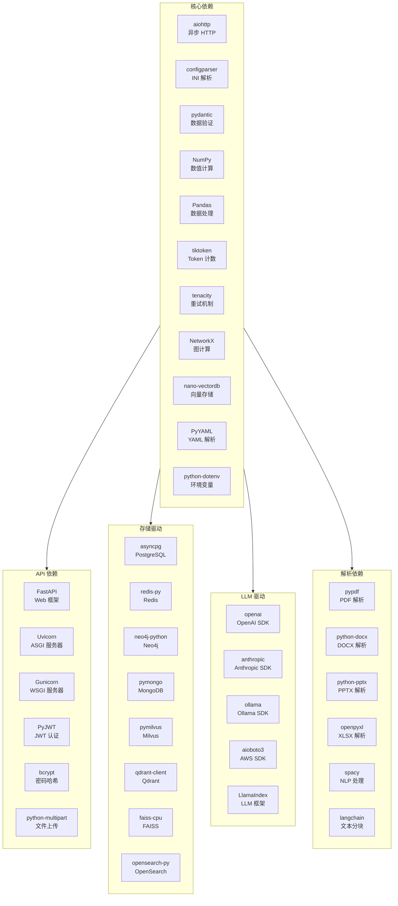
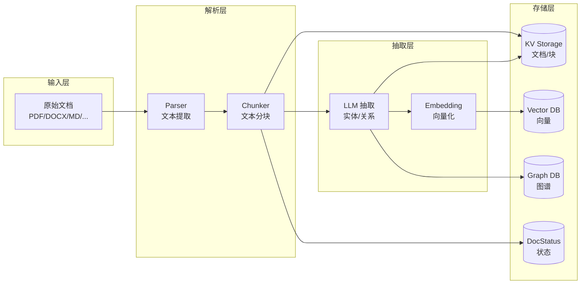
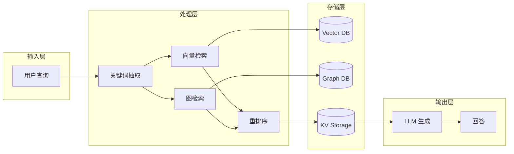

# 第 04 章 模块/包结构与依赖分析

> **内容**: 完整目录结构、模块职责、依赖关系
> **范围**: LightRAG 全项目

---

## 4.1 完整项目目录结构树

### 4.1.1 顶层目录

```
LightRAG/                           # 项目根目录
├── .github/                        # GitHub 配置
│   ├── workflows/                  # CI/CD 工作流
│   ├── ISSUE_TEMPLATE/             # Issue 模板
│   └── PULL_REQUEST_TEMPLATE/      # PR 模板
├── assets/                         # 项目资源（Logo 等）
├── docs/                           # 文档目录
│   ├── wangbin/                    # 本文档所在目录
│   └── ...                         # 其他文档
├── examples/                       # 示例代码
│   ├── lightrag_openai_demo.py
│   ├── lightrag_ollama_demo.py
│   ├── graph_visual_with_neo4j.py
│   └── ...
├── k8s-deploy/                     # Kubernetes 部署配置
│   ├── databases/                  # 数据库部署 manifests
│   ├── lightrag/                  # LightRAG 部署 manifests
│   └── install_lightrag.sh        # 安装脚本
├── lightrag/                       # 核心 Python 包
│   ├── __init__.py
│   ├── _version.py
│   ├── lightrag.py                 # 主类（5,919 行）
│   ├── operate.py                  # 知识图谱操作（6,255 行）
│   ├── pipeline.py                 # 入库流水线（5,617 行）
│   ├── utils.py                    # 工具函数（5,431 行）
│   ├── base.py                     # 抽象基类（1,084 行）
│   ├── constants.py                # 常量定义（458 行）
│   ├── prompt.py                   # 提示词模板（767 行）
│   ├── rerank.py                   # 重排序（594 行）
│   ├── types.py                    # 数据模型（156 行）
│   ├── exceptions.py               # 异常定义（194 行）
│   ├── llm_roles.py                # 角色化 LLM 配置（586 行）
│   ├── chunk_schema.py             # 分块数据结构（383 行）
│   ├── multimodal_context.py       # 多模态上下文（1,052 行）
│   ├── addon_params.py             # 附加参数（156 行）
│   ├── file_atomic.py              # 原子文件操作（142 行）
│   ├── namespace.py                # 命名空间定义
│   ├── storage_migrations.py       # 存储迁移
│   ├── table_markup.py             # 表格标记
│   ├── utils_graph.py              # 图工具函数（1,916 行）
│   ├── utils_pipeline.py           # 流水线工具（961 行）
│   ├── api/                        # API 服务器子包
│   ├── kg/                         # 存储后端子包
│   ├── llm/                        # LLM 集成子包
│   ├── parser/                     # 文档解析子包
│   ├── chunker/                    # 分块引擎子包
│   ├── tools/                      # CLI 工具子包
│   ├── evaluation/                 # 评估子包
│   └── sidecar/                    # Sidecar 处理子包
├── lightrag_webui/                 # WebUI 前端
│   ├── src/                        # 前端源码
│   ├── public/                     # 静态资源
│   ├── package.json
│   └── ...
├── prompts/                        # 提示词文件目录
├── reproduce/                      # 复现实验目录
├── scripts/                        # 脚本目录
├── tests/                          # 测试目录
│   ├── api/                        # API 测试
│   ├── kg/                         # 存储后端测试
│   ├── llm/                        # LLM 测试
│   ├── parser/                     # 解析器测试
│   ├── pipeline/                   # 流水线测试
│   ├── chunker/                    # 分块测试
│   └── ...
├── .env.example                    # 环境变量示例
├── .pre-commit-config.yaml         # Pre-commit 配置
├── Dockerfile                      # Docker 构建文件
├── Dockerfile.lite                 # Lite 版 Docker
├── Dockerfile.postgres             # PostgreSQL 版 Docker
├── docker-compose.yml              # Docker Compose 配置
├── docker-compose-full.yml         # 完整版 Docker Compose
├── Makefile                        # Make 任务
├── pyproject.toml                  # 项目配置
├── README.md                       # 英文 README
├── README-zh.md                    # 中文 README
├── LICENSE                         # MIT 许可证
└── uv.lock                         # UV 锁文件
```

### 4.1.2 lightrag 核心包详细结构

```
lightrag/                           # 核心包
├── __init__.py                     # 包初始化，导出公共 API
├── _version.py                     # 版本号定义
│
├── ── 核心模块 ──
├── lightrag.py                     # LightRAG 主类
├── operate.py                      # 知识图谱操作函数
├── pipeline.py                     # 文档入库流水线 Mixin
├── base.py                         # 抽象基类定义
├── utils.py                        # 通用工具函数
├── constants.py                    # 全局常量
├── prompt.py                       # 提示词模板
├── types.py                        # Pydantic 数据模型
├── exceptions.py                   # 异常类定义
│
├── ── 配置与角色 ──
├── llm_roles.py                    # 角色化 LLM 配置
├── addon_params.py                 # 附加参数（Observable）
├── namespace.py                    # 命名空间常量
├── chunk_schema.py                 # 分块数据结构
├── multimodal_context.py           # 多模态上下文
│
├── ── 工具模块 ──
├── file_atomic.py                  # 原子文件写入
├── table_markup.py                 # 表格标记语言
├── rerank.py                       # 重排序抽象
├── storage_migrations.py           # 存储数据迁移
├── utils_graph.py                  # 图算法工具
├── utils_pipeline.py               # 流水线工具
│
├── ── 子包 ──
├── api/                            # API 服务器
│   ├── __init__.py
│   ├── lightrag_server.py          # FastAPI 应用
│   ├── config.py                   # 配置管理
│   ├── auth.py                     # 认证模块
│   ├── passwords.py                # 密码工具
│   ├── gunicorn_config.py          # Gunicorn 配置
│   ├── run_with_gunicorn.py        # Gunicorn 启动
│   ├── login_rate_limit.py         # 登录限流
│   ├── runtime_validation.py       # 运行时校验
│   ├── utils_api.py                # API 工具函数
│   ├── routers/                    # 路由模块
│   │   ├── __init__.py
│   │   ├── document_routes.py      # 文档路由
│   │   ├── query_routes.py         # 查询路由
│   │   ├── graph_routes.py         # 图谱路由
│   │   └── ollama_api.py           # Ollama 兼容 API
│   └── static/                     # 静态文件
│
├── kg/                             # 存储后端
│   ├── __init__.py                 # 存储注册表
│   ├── factory.py                  # 存储工厂
│   ├── pipeline_ingress.py         # 流水线消息
│   ├── shared_storage.py           # 共享存储协调
│   ├── json_kv_impl.py             # JSON KV 实现
│   ├── json_doc_status_impl.py     # JSON DocStatus 实现
│   ├── nano_vector_db_impl.py      # NanoVectorDB 实现
│   ├── networkx_impl.py            # NetworkX 图实现
│   ├── redis_impl.py               # Redis 实现
│   ├── postgres_impl.py            # PostgreSQL 全家桶
│   ├── neo4j_impl.py               # Neo4j 实现
│   ├── mongo_impl.py               # MongoDB 全家桶
│   ├── milvus_impl.py              # Milvus 实现
│   ├── qdrant_impl.py              # Qdrant 实现
│   ├── faiss_impl.py               # FAISS 实现
│   ├── memgraph_impl.py            # Memgraph 实现
│   ├── opensearch_impl.py          # OpenSearch 全家桶
│   └── deprecated/                 # 已弃用实现
│
├── llm/                            # LLM 集成
│   ├── __init__.py
│   ├── openai.py                   # OpenAI 实现
│   ├── anthropic.py                # Anthropic 实现
│   ├── gemini.py                   # Google Gemini 实现
│   ├── ollama.py                   # Ollama 实现
│   ├── bedrock.py                  # AWS Bedrock 实现
│   ├── zhipu.py                    # 智谱 AI 实现
│   ├── voyageai.py                 # Voyage AI 实现
│   ├── jina.py                     # Jina AI 实现
│   ├── hf.py                       # HuggingFace 实现
│   ├── llama_index_impl.py         # LlamaIndex 桥接
│   ├── lmdeploy.py                 # LMDeploy 实现
│   ├── lollms.py                   # LoLLMs 实现
│   ├── azure_openai.py             # Azure OpenAI 实现
│   ├── nvidia_openai.py            # NVIDIA NIM 实现
│   ├── binding_options.py          # LLM 绑定选项
│   ├── _vision_utils.py            # 视觉工具
│   └── deprecated/                 # 已弃用实现
│
├── parser/                         # 文档解析
│   ├── __init__.py
│   ├── base.py                     # 解析器基类
│   ├── registry.py                 # 解析器注册中心
│   ├── routing.py                  # 解析路由
│   ├── param_schema.py             # 参数模式
│   ├── cli.py                      # 解析器 CLI
│   ├── debug.py                    # 调试工具
│   ├── llm_bridge.py               # LLM 桥接
│   ├── native_base.py              # 原生解析基类
│   ├── native_dispatch.py          # 原生解析调度
│   ├── plugins.py                  # 插件加载
│   ├── noop.py                     # 空解析器
│   ├── _html_table.py              # HTML 表格解析
│   ├── _markdown.py                # Markdown 解析
│   ├── docx/                       # DOCX 解析子包
│   ├── markdown/                   # Markdown 解析子包
│   ├── external/                   # 外部解析器子包
│   └── legacy/                     # 遗留解析器
│
├── chunker/                        # 分块引擎
│   ├── __init__.py
│   ├── token_size.py               # Fix 策略
│   ├── recursive_character.py      # Recursive 策略
│   ├── semantic_vector.py          # Vector 策略
│   └── paragraph_semantic.py       # Paragraph 策略
│
├── tools/                          # CLI 工具
│   ├── __init__.py
│   ├── hash_password.py            # 密码哈希工具
│   ├── download_cache.py           # 缓存下载工具
│   ├── rebuild_vdb.py              # 向量库重建工具
│   ├── clean_llm_query_cache.py    # LLM 缓存清理工具
│   ├── migrate_llm_cache.py        # LLM 缓存迁移工具
│   ├── kg_integrity_repair.py      # KG 完整性修复工具
│   ├── prepare_qdrant_legacy_data.py
│   └── check_initialization.py     # 初始化检查工具
│
├── evaluation/                     # 评估模块
│   ├── __init__.py
│   ├── eval_rag_quality.py         # RAG 质量评估
│   ├── offline_retrieval_check.py  # 离线检索检查
│   └── sample_documents/           # 样本文档
│
└── sidecar/                        # Sidecar 处理
    ├── __init__.py
    ├── backfill.py                 # 回填处理
    ├── ir.py                       # 信息检索
    ├── placeholders.py             # 占位符处理
    └── writer.py                   # 写入器
```

---

## 4.2 每个主要目录/模块的功能职责

### 4.2.1 顶层目录职责

| 目录 | 职责 | 输入 | 输出 |
|------|------|------|------|
| `lightrag/` | 核心 Python 包 | 源码 | 可安装包 |
| `lightrag_webui/` | WebUI 前端 | React 源码 | 构建产物 |
| `docs/` | 项目文档 | Markdown | 文档站 |
| `examples/` | 示例代码 | Python 脚本 | 运行示例 |
| `k8s-deploy/` | K8s 部署配置 | YAML | 集群部署 |
| `tests/` | 测试代码 | 测试脚本 | 测试报告 |
| `scripts/` | 辅助脚本 | Shell | 执行结果 |
| `prompts/` | 提示词文件 | 文本 | 提示词 |
| `reproduce/` | 复现实验 | 实验配置 | 实验结果 |

### 4.2.2 核心模块职责

| 模块 | 文件 | 行数 | 职责 | 输入 | 输出 |
|------|------|------|------|------|------|
| **主类** | `lightrag.py` | 5,919 | 系统入口，协调所有子系统 | 用户请求 | 处理结果 |
| **KG 操作** | `operate.py` | 6,255 | 知识图谱构建、合并、抽取 | 文本块 | 实体/关系 |
| **流水线** | `pipeline.py` | 5,617 | 文档入库流水线管理 | 原始文档 | 处理状态 |
| **工具函数** | `utils.py` | 5,431 | 通用工具函数集合 | 各类输入 | 各类输出 |
| **抽象基类** | `base.py` | 1,084 | 存储抽象、QueryParam | 配置 | 实例 |
| **常量** | `constants.py` | 458 | 全局常量定义 | - | 常量值 |
| **提示词** | `prompt.py` | 767 | 提示词模板管理 | 语言/模式 | 提示词文本 |
| **重排序** | `rerank.py` | 594 | 检索结果重排序 | 查询+文档 | 排序结果 |
| **数据模型** | `types.py` | 156 | Pydantic 数据模型 | JSON | 模型实例 |
| **异常** | `exceptions.py` | 194 | 异常类定义 | - | 异常类 |
| **LLM 角色** | `llm_roles.py` | 586 | 角色化 LLM 配置 | 配置 | LLM 函数 |
| **分块结构** | `chunk_schema.py` | 383 | 分块数据结构 | 文本 | 块 Schema |
| **多模态** | `multimodal_context.py` | 1,052 | 多模态上下文处理 | 图片 | 描述 |
| **图工具** | `utils_graph.py` | 1,916 | 图算法工具 | 图数据 | 图分析结果 |
| **流水线工具** | `utils_pipeline.py` | 961 | 流水线辅助工具 | 流水线数据 | 处理结果 |

### 4.2.3 子包职责

#### api/ 子包

| 文件 | 行数 | 职责 |
|------|------|------|
| `lightrag_server.py` | 1,242 | FastAPI 应用创建、路由注册、中间件配置 |
| `config.py` | 341 | 配置管理、环境变量解析 |
| `auth.py` | 76 | 认证逻辑、JWT 生成与验证 |
| `document_routes.py` | 2,094 | 文档上传/查询/删除/状态 API |
| `query_routes.py` | 695 | 查询/流式查询/数据查询 API |
| `graph_routes.py` | 325 | 图谱查询/编辑 API |
| `ollama_api.py` | 330 | Ollama API 兼容实现 |
| `utils_api.py` | 277 | API 辅助工具函数 |

#### kg/ 子包

| 文件 | 行数 | 职责 |
|------|------|------|
| `__init__.py` | 53 | 存储注册表、验证函数 |
| `factory.py` | 15 | 存储后端工厂 |
| `shared_storage.py` | 1,595 | 流水线状态协调、命名空间管理 |
| `pipeline_ingress.py` | 350 | 流水线消息定义 |
| `json_kv_impl.py` | 227 | JSON 文件 KV 存储 |
| `json_doc_status_impl.py` | 235 | JSON 文件文档状态存储 |
| `nano_vector_db_impl.py` | 420 | NanoVectorDB 向量存储 |
| `networkx_impl.py` | 340 | NetworkX 图存储 |
| `redis_impl.py` | 578 | Redis 缓存存储 |
| `postgres_impl.py` | 3,864 | PostgreSQL 全家桶 |
| `neo4j_impl.py` | 894 | Neo4j 图存储 |
| `mongo_impl.py` | 1,540 | MongoDB 全家桶 |
| `milvus_impl.py` | 1,290 | Milvus 向量存储 |
| `qdrant_impl.py` | 642 | Qdrant 向量存储 |
| `faiss_impl.py` | 554 | FAISS 向量存储 |
| `memgraph_impl.py` | 559 | Memgraph 图存储 |
| `opensearch_impl.py` | 2,040 | OpenSearch 全家桶 |

#### llm/ 子包

| 文件 | 行数 | 职责 |
|------|------|------|
| `openai.py` | 547 | OpenAI API 封装 |
| `anthropic.py` | 134 | Anthropic API 封装 |
| `gemini.py` | 298 | Google Gemini API 封装 |
| `ollama.py` | 132 | Ollama 本地模型封装 |
| `bedrock.py` | 246 | AWS Bedrock 封装 |
| `zhipu.py` | 91 | 智谱 AI 封装 |
| `voyageai.py` | 68 | Voyage AI 封装 |
| `jina.py` | 71 | Jina AI 封装 |
| `hf.py` | 76 | HuggingFace 封装 |
| `binding_options.py` | 345 | LLM 绑定选项配置 |

#### parser/ 子包

| 文件 | 行数 | 职责 |
|------|------|------|
| `base.py` | 60 | 解析器基类 |
| `registry.py` | 105 | 解析器注册中心 |
| `routing.py` | 564 | 解析路由逻辑 |
| `param_schema.py` | 251 | 参数模式定义 |
| `native_base.py` | 160 | 原生解析基类 |
| `native_dispatch.py` | 21 | 原生解析调度 |
| `cli.py` | 119 | 解析器 CLI |
| `llm_bridge.py` | 54 | LLM 桥接 |
| `docx/` | - | DOCX 解析实现 |
| `markdown/` | - | Markdown 解析实现 |
| `external/` | - | 外部解析器 |

#### chunker/ 子包

| 文件 | 行数 | 职责 |
|------|------|------|
| `token_size.py` | 113 | Fix 分块策略 |
| `recursive_character.py` | 139 | Recursive 分块策略 |
| `semantic_vector.py` | 138 | Vector 分块策略 |
| `paragraph_semantic.py` | 1,062 | Paragraph 分块策略 |

---

## 4.3 模块间依赖关系图

### 4.3.1 顶层依赖图



### 4.3.2 核心模块内部依赖



### 4.3.3 存储后端依赖

```mermaid
graph TD
    subgraph AbstractLayer["抽象层"]
        BaseKV[BaseKVStorage]
        BaseVector[BaseVectorStorage]
        BaseGraph[BaseGraphStorage]
        BaseDocStatus[BaseDocStatusStorage]
    end

    subgraph FactoryLayer["工厂层"]
        Factory[StorageFactory]
        Registry[StorageRegistry]
    end

    subgraph KVImplementations["KV 实现"]
        JsonKV[JsonKVStorage]
        RedisKV[RedisKVStorage]
        PGKV[PGKVStorage]
        MongoKV[MongoKVStorage]
        OSKV[OpenSearchKVStorage]
    end

    subgraph VectorImplementations["Vector 实现"]
        NanoVDB[NanoVectorDBStorage]
        Milvus[MilvusVectorDBStorage]
        PGVector[PGVectorStorage]
        Faiss[FaissVectorDBStorage]
        Qdrant[QdrantVectorDBStorage]
        MongoVDB[MongoVectorDBStorage]
        OSVector[OpenSearchVectorDBStorage]
    end

    subgraph GraphImplementations["Graph 实现"]
        NX[NetworkXStorage]
        Neo4j[Neo4JStorage]
        PGGraph[PGGraphStorage]
        MongoGraph[MongoGraphStorage]
        Memgraph[MemgraphStorage]
        OSGraph[OpenSearchGraphStorage]
    end

    subgraph DocStatusImplementations["DocStatus 实现"]
        JsonDS[JsonDocStatusStorage]
        RedisDS[RedisDocStatusStorage]
        PGDS[PGDocStatusStorage]
        MongoDS[MongoDocStatusStorage]
        OSDS[OpenSearchDocStatusStorage]
    end

    Factory --> Registry
    Factory --> BaseKV
    Factory --> BaseVector
    Factory --> BaseGraph
    Factory --> BaseDocStatus

    BaseKV <|-- JsonKV
    BaseKV <|-- RedisKV
    BaseKV <|-- PGKV
    BaseKV <|-- MongoKV
    BaseKV <|-- OSKV

    BaseVector <|-- NanoVDB
    BaseVector <|-- Milvus
    BaseVector <|-- PGVector
    BaseVector <|-- Faiss
    BaseVector <|-- Qdrant
    BaseVector <|-- MongoVDB
    BaseVector <|-- OSVector

    BaseGraph <|-- NX
    BaseGraph <|-- Neo4j
    BaseGraph <|-- PGGraph
    BaseGraph <|-- MongoGraph
    BaseGraph <|-- Memgraph
    BaseGraph <|-- OSGraph

    BaseDocStatus <|-- JsonDS
    BaseDocStatus <|-- RedisDS
    BaseDocStatus <|-- PGDS
    BaseDocStatus <|-- MongoDS
    BaseDocStatus <|-- OSDS

    BaseDocStatus --|> BaseKV
```

---

## 4.4 外部依赖关系

### 4.4.1 PyPI 依赖分类



### 4.4.2 依赖版本约束

| 依赖 | 最低版本 | 最高版本 | 说明 |
|------|----------|----------|------|
| Python | 3.10 | - | 类型注解要求 |
| FastAPI | 0.108 | - | root_path 支持 |
| NumPy | 1.24.0 | 3.0.0 | API 兼容性 |
| Pandas | 2.0.0 | 2.4.0 | API 兼容性 |
| OpenAI | 2.0.0 | 3.0.0 | 新版 API |
| asyncpg | 0.31.0 | 1.0.0 | 异步 PostgreSQL |
| spacy | 3.8 | 3.8.14 | 轮子可用性 |

---

## 4.5 接口与实现分离设计

### 4.5.1 抽象层设计

LightRAG 的存储层采用**接口与实现分离**的设计模式：

```
┌─────────────────────────────────────────────┐
│              LightRAG Core                   │
│         (依赖抽象接口，不依赖实现)             │
├─────────────────────────────────────────────┤
│              Abstract Layer                  │
│  BaseKVStorage / BaseVectorStorage / ...    │
├─────────────────────────────────────────────┤
│              Implementation Layer            │
│  JsonKVStorage / PostgresImpl / Neo4j / ... │
└─────────────────────────────────────────────┘
```

**优势**:
1. **可测试性**: 可用内存实现替换外部依赖进行单元测试
2. **可替换性**: 切换存储后端无需修改核心代码
3. **可扩展性**: 新增存储后端只需实现抽象接口

### 4.5.2 工厂模式实现

```python
# lightrag/kg/factory.py
def get_storage_class(storage_name: str) -> Callable[..., Any]:
    # 内置实现直接导入
    if storage_name == "JsonKVStorage":
        from lightrag.kg.json_kv_impl import JsonKVStorage
        return JsonKVStorage
    # 其他实现动态导入
    import_path = STORAGES[storage_name]
    module = importlib.import_module(import_path, package="lightrag")
    return getattr(module, storage_name)
```

**工厂模式优势**:
1. **解耦**: 客户端不需要知道具体实现类
2. **集中管理**: 所有存储后端在一个注册表管理
3. **延迟加载**: 只在需要时导入对应模块

---

## 4.6 数据流向分析

### 4.6.1 文档入库数据流



### 4.6.2 查询数据流



---

## 4.7 模块间通信方式

### 4.7.1 同步调用

| 调用方 | 被调用方 | 方式 | 场景 |
|--------|----------|------|------|
| API Server | LightRAG | Python 函数调用 | 查询、插入 |
| LightRAG | Storage | 方法调用 | 数据读写 |
| Pipeline | Parser | 方法调用 | 文档解析 |

### 4.7.2 异步调用

| 调用方 | 被调用方 | 方式 | 场景 |
|--------|----------|------|------|
| LightRAG | LLM API | HTTP (aiohttp/httpx) | 实体抽取、查询生成 |
| LightRAG | Storage | asyncpg/pymongo | 数据库操作 |
| Pipeline | Queue | asyncio.Queue | 文档入队/出队 |

### 4.7.3 事件驱动

| 事件 | 触发方 | 消费方 | 机制 |
|------|--------|--------|------|
| 文档状态变更 | Pipeline | Status Storage | 状态机更新 |
| 缓存命中 | Cache Handler | LLM Caller | 直接返回 |
| 流水线取消 | User API | Pipeline Workers | 信号量通知 |

---

## 4.8 模块内聚与耦合分析

### 4.8.1 内聚度评估

| 模块 | 内聚类型 | 内聚度 | 评价 |
|------|----------|--------|------|
| `lightrag.py` | 功能内聚 | 高 | 专注系统协调 |
| `operate.py` | 功能内聚 | 高 | 专注 KG 操作 |
| `pipeline.py` | 功能内聚 | 高 | 专注流水线管理 |
| `utils.py` | 逻辑内聚 | 中 | 工具函数集合，类别多样 |
| `base.py` | 功能内聚 | 高 | 专注抽象接口 |
| `prompt.py` | 功能内聚 | 高 | 专注提示词管理 |
| `kg/` | 功能内聚 | 高 | 专注存储实现 |
| `llm/` | 功能内聚 | 高 | 专注 LLM 集成 |
| `parser/` | 功能内聚 | 高 | 专注文档解析 |

### 4.8.2 耦合度评估

| 模块对 | 耦合类型 | 耦合度 | 评价 |
|--------|----------|--------|------|
| LightRAG ↔ Storage | 抽象耦合 | 低 | 通过抽象接口 |
| LightRAG ↔ LLM | 数据耦合 | 低 | 通过函数参数 |
| Pipeline ↔ Parser | 控制耦合 | 中 | 通过解析选项 |
| Pipeline ↔ Operate | 数据耦合 | 低 | 通过函数参数 |
| API ↔ LightRAG | 标记耦合 | 中 | 通过完整对象 |

---

## 4.9 本章小结

本章对 LightRAG 的模块结构和依赖关系进行了全面分析：

1. **目录结构**: 清晰的层次划分，核心包、子包、测试、示例分离
2. **模块职责**: 每个模块职责单一，高内聚低耦合
3. **依赖关系**: 核心模块依赖抽象层，子包依赖核心模块
4. **接口分离**: 存储层采用抽象接口 + 工厂模式实现解耦
5. **数据流向**: 文档入库和查询两条主数据流清晰

**架构优势**:
- **模块化**: 各模块可独立开发和测试
- **可扩展**: 新增功能只需添加新模块
- **可维护**: 依赖关系清晰，修改影响范围可控

下一章将对核心代码进行逐文件、逐函数的深度走读。

---

> **下一章**: [05-核心代码讲解-上.md](./05-核心代码讲解-上.md)

---

☕️ 制作不易，请我喝咖啡☕️关注我➕

