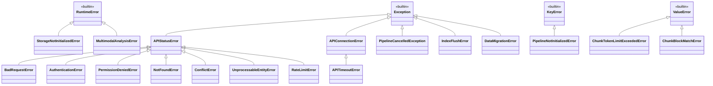

# 第 06 章 核心代码讲解（下）

> **内容**: base.py / utils.py / prompt.py / rerank.py / constants.py / exceptions.py / types.py 深度走读
> **粒度**: 逐函数、逐参数、逐返回值分析

---

## 6.1 base.py 深度走读

### 6.1.1 文件概览

| 属性 | 值 |
|------|-----|
| **文件路径** | `lightrag/base.py` |
| **总行数** | 1,084 行 |
| **主要类** | `BaseKVStorage`, `BaseVectorStorage`, `BaseGraphStorage`, `BaseDocStatusStorage`, `QueryParam`, `DocStatus`, `DocProcessingStatus`, `DeletionResult`, `QueryResult`, `QueryContextResult` |
| **核心职责** | 定义存储抽象基类和核心数据结构 |

### 6.1.2 StorageNameSpace 抽象基类

```python
class StorageNameSpace(ABC):
    """
    存储命名空间抽象基类

    所有存储后端实现的基类，定义了：
    1. 命名空间概念（用于多租户隔离）
    2. 初始化/清理生命周期
    3. 全局配置注入
    """

    def __init__(
        self,
        namespace: str,
        global_config: dict[str, Any],
        embedding_func: Callable | None = None,
    ):
        self.namespace = namespace
        self.global_config = global_config
        self.embedding_func = embedding_func
        self._initialized = False
        self._finalized = False

    async def initialize(self) -> None:
        """初始化存储连接/资源"""
        self._initialized = True

    async def finalize(self) -> None:
        """清理存储连接/资源"""
        self._finalized = True

    @property
    def initialized(self) -> bool:
        return self._initialized

    @property
    def finalized(self) -> bool:
        return self._finalized
```

**设计要点**:
- **命名空间隔离**: 通过 `namespace` 实现多租户数据隔离
- **全局配置注入**: `global_config` 提供统一的配置访问
- **生命周期管理**: `initialize()` / `finalize()` 管理资源

### 6.1.3 BaseKVStorage 抽象基类

```python
class BaseKVStorage(StorageNameSpace, ABC):
    """
    键值存储抽象基类

    用于存储：文档、文本块、LLM 缓存、实体/关系记录
    核心操作：get_by_id, upsert, delete
    """

    @abstractmethod
    async def get_by_id(self, id: str) -> dict[str, Any] | None:
        """根据 ID 获取数据"""
        ...

    @abstractmethod
    async def upsert(self, data: dict[str, dict[str, Any]]) -> None:
        """插入或更新数据（key-value 形式）"""
        ...

    @abstractmethod
    async def delete(self, ids: list[str]) -> None:
        """删除指定 ID 的数据"""
        ...

    async def drop(self) -> None:
        """清空所有数据（可选实现）"""
        raise NotImplementedError

    async def index_done_callback(self) -> None:
        """批量写入完成后的回调（可选实现）"""
        pass

    async def get_all(self) -> dict[str, dict[str, Any]]:
        """获取所有数据（用于图谱合并）"""
        raise NotImplementedError

    async def count(self) -> int:
        """获取数据总数"""
        raise NotImplementedError
```

**关键方法说明**:

| 方法 | 类型 | 说明 | 必需性 |
|------|------|------|--------|
| `get_by_id` | 异步 | 按 ID 查询单条记录 | 必需 |
| `upsert` | 异步 | 批量插入/更新 | 必需 |
| `delete` | 异步 | 批量删除 | 必需 |
| `drop` | 异步 | 清空数据集 | 可选 |
| `index_done_callback` | 异步 | 批量写入后回调 | 可选 |
| `get_all` | 异步 | 获取全部数据 | 可选 |
| `count` | 异步 | 获取记录总数 | 可选 |

### 6.1.4 BaseVectorStorage 抽象基类

```python
class BaseVectorStorage(StorageNameSpace, ABC):
    """
    向量存储抽象基类

    用于存储：实体向量、关系向量、文本块向量
    核心操作：query（相似度搜索）、upsert、delete
    """

    @abstractmethod
    async def query(
        self,
        query: str,
        top_k: int = 10,
        ids: list[str] | None = None,
    ) -> list[dict[str, Any]]:
        """
        向量相似度查询

        参数:
            query: 查询文本
            top_k: 返回前 K 个结果
            ids: 可选的 ID 过滤列表

        返回:
            结果列表，每项包含 id, distance, metadata
        """
        ...

    @abstractmethod
    async def upsert(self, data: dict[str, dict[str, Any]]) -> None:
        """
        插入或更新向量数据

        数据格式:
            {id: {"vector": [...], "metadata": {...}}}
        """
        ...

    @abstractmethod
    async def delete(self, ids: list[str]) -> None:
        """删除指定 ID 的向量"""
        ...

    async def delete_entity(self, entity_name: str) -> None:
        """按实体名称删除（可选实现）"""
        pass

    async def delete_entity_relation(self, entity_name: str) -> None:
        """按实体名称删除关联关系（可选实现）"""
        pass

    async def search_by_id(self, id: str, top_k: int = 10) -> list[dict[str, Any]]:
        """按 ID 搜索相似向量（可选实现）"""
        raise NotImplementedError
```

**向量存储特有概念**:

1. **Embedding 注入**: 通过构造函数注入 `embedding_func`
2. **相似度度量**: 默认使用余弦相似度
3. **Top-K 检索**: 返回最相似的 K 个结果
4. **ID 过滤**: 支持在指定 ID 集合内检索

### 6.1.5 BaseGraphStorage 抽象基类

```python
class BaseGraphStorage(StorageNameSpace, ABC):
    """
    图存储抽象基类

    用于存储：知识图谱的节点和边
    核心操作：upsert_node, upsert_edge, get_node, get_edge, 图遍历
    """

    @abstractmethod
    async def upsert_node(self, node_id: str, node_data: dict[str, Any]) -> None:
        """插入或更新节点"""
        ...

    @abstractmethod
    async def upsert_edge(
        self, source_node_id: str, target_node_id: str, edge_data: dict[str, Any]
    ) -> None:
        """插入或更新边"""
        ...

    @abstractmethod
    async def get_node(self, node_id: str) -> dict[str, Any] | None:
        """获取节点数据"""
        ...

    @abstractmethod
    async def get_edge(
        self, source_node_id: str, target_node_id: str
    ) -> dict[str, Any] | None:
        """获取边数据"""
        ...

    @abstractmethod
    async def get_node_edges(self, node_id: str) -> list[tuple[str, str]] | None:
        """获取节点的所有关联边"""
        ...

    @abstractmethod
    async def delete_node(self, node_id: str) -> None:
        """删除节点及其关联边"""
        ...

    async def get_nodes(self, node_ids: list[str]) -> dict[str, dict[str, Any]]:
        """批量获取节点（可选实现）"""
        ...

    async def get_edges(
        self, node_pairs: list[tuple[str, str]]
    ) -> dict[tuple[str, str], dict[str, Any]]:
        """批量获取边（可选实现）"""
        ...

    async def get_all_nodes(self) -> list[dict[str, Any]]:
        """获取所有节点（可选实现）"""
        raise NotImplementedError

    async def get_all_edges(self) -> list[dict[str, Any]]:
        """获取所有边（可选实现）"""
        raise NotImplementedError

    async def get_node_degree(self, node_id: str) -> int:
        """获取节点度数"""
        ...

    async def get_graph_size(self) -> tuple[int, int]:
        """获取图大小（节点数，边数）"""
        ...
```

**图存储特有概念**:

1. **有向边**: 边有方向性（source → target）
2. **节点度**: 节点的关联边数量
3. **图遍历**: 支持 BFS/DFS 遍历
4. **批量删除**: 删除节点时级联删除关联边

### 6.1.6 DocStatusStorage 抽象基类

```python
class DocStatusStorage(BaseKVStorage, ABC):
    """
    文档状态存储抽象基类

    继承自 BaseKVStorage，添加文档状态特定操作
    """

    @abstractmethod
    async def get_docs_by_status(self, status: str) -> dict[str, dict[str, Any]]:
        """按状态获取文档"""
        ...

    async def get_docs_by_track_id(self, track_id: str) -> dict[str, dict[str, Any]]:
        """按追踪 ID 获取文档"""
        ...

    async def get_pending_docs(self) -> dict[str, dict[str, Any]]:
        """获取待处理文档"""
        return await self.get_docs_by_status(DocStatus.PENDING)

    async def get_processing_docs(self) -> dict[str, dict[str, Any]]:
        """获取处理中文档"""
        return await self.get_docs_by_status(DocStatus.PROCESSING)

    async def get_processed_docs(self) -> dict[str, dict[str, Any]]:
        """获取已处理文档"""
        return await self.get_docs_by_status(DocStatus.PROCESSED)

    async def get_failed_docs(self) -> dict[str, dict[str, Any]]:
        """获取失败文档"""
        return await self.get_docs_by_status(DocStatus.FAILED)
```

### 6.1.7 DocStatus 枚举

```python
class DocStatus(str, Enum):
    """文档处理状态枚举"""
    PENDING = "pending"         # 待处理
    PROCESSING = "processing"   # 处理中
    PROCESSED = "processed"     # 已处理
    FAILED = "failed"           # 失败
```

**状态转换**:

```
PENDING → PROCESSING → PROCESSED
              ↓
           FAILED
```

### 6.1.8 QueryParam 数据类（已在 5.1.10 详述）

### 6.1.9 QueryResult 数据类

```python
@dataclass
class QueryResult:
    """查询结果"""
    response: str = ""                    # LLM 生成的回答
    context: list[dict] = field(default_factory=list)  # 检索上下文
    metadata: dict = field(default_factory=dict)       # 元数据
```

### 6.1.10 DeletionResult 数据类

```python
@dataclass
class DeletionResult:
    """删除结果"""
    status: str = "success"
    doc_id: str = ""
    deleted_entities: int = 0
    deleted_relations: int = 0
    message: str = ""
```

### 6.1.11 DocProcessingStatus 数据类

```python
@dataclass
class DocProcessingStatus:
    """文档处理状态详情"""
    status: str = ""
    content: str = ""
    content_length: int = 0
    created_at: str = ""
    updated_at: str = ""
    chunks_count: int = 0
    error: str = ""
    track_id: str = ""
    file_path: str = ""
```

---

## 6.2 utils.py 深度走读

### 6.2.1 文件概览

| 属性 | 值 |
|------|-----|
| **文件路径** | `lightrag/utils.py` |
| **总行数** | 5,431 行 |
| **核心职责** | 通用工具函数集合 |

### 6.2.2 哈希与 ID 生成

```python
def compute_mdhash_id(content: str, prefix: str = "") -> str:
    """
    计算内容的 MD5 哈希 ID

    参数:
        content: 内容字符串
        prefix: ID 前缀（如 "doc-", "chunk-", "ent-"）

    返回:
        带前缀的 32 位十六进制哈希字符串
    """
    return prefix + hashlib.md5(content.encode("utf-8")).hexdigest()


def compute_args_hash(*args: Any) -> str:
    """计算参数的哈希值（用于缓存键）"""
    str_args = [str(arg) for arg in args]
    combined = "|".join(str_args)
    return hashlib.sha256(combined.encode("utf-8")).hexdigest()
```

**ID 前缀约定**:

| 前缀 | 用途 | 示例 |
|------|------|------|
| `doc-` | 文档 ID | `doc-a1b2c3d4...` |
| `chunk-` | 文本块 ID | `chunk-e5f6g7h8...` |
| `ent-` | 实体 ID | `ent-i9j0k1l2...` |
| `relation-` | 关系 ID | `relation-m3n4o5p6...` |
| `llm_response` | LLM 缓存 ID | `llm_response-q7r8s9t0...` |

### 6.2.3 缓存系统

```python
def handle_cache(cache_key: str, cache_type: str) -> tuple[bool, Any]:
    """
    处理缓存查询

    返回: (cache_hit, cached_data)
    """
    ...

async def save_to_cache(cache_key: str, data: Any, cache_type: str) -> None:
    """保存数据到缓存"""
    ...

class CacheData:
    """缓存数据结构"""
    def __init__(self, response: Any, creation_time: float, mode: str, cache_type: str):
        self.response = response
        self.creation_time = creation_time
        self.mode = mode
        self.cache_type = cache_type
```

### 6.2.4 并发控制

```python
def priority_limit_async_func_call(
    max_size: int,
    max_qps: int | None = None,
    enable_stats: bool = False,
):
    """
    优先级限制异步函数调用装饰器

    功能:
    1. 限制并发调用数量
    2. 限制每秒请求数（QPS）
    3. 优先级调度
    4. 统计信息收集
    """
    ...

class UnlimitedSemaphore:
    """无限信号量（用于禁用并发限制）"""
    async def __aenter__(self):
        return self
    async def __aexit__(self, exc_type, exc, tb):
        pass
```

### 6.2.5 文本处理工具

```python
def sanitize_and_normalize_extracted_text(text: str) -> str:
    """清理和标准化抽取文本"""
    ...

def split_string_by_multi_markers(
    content: str, markers: list[str]
) -> list[str]:
    """按多个分隔符分割字符串"""
    ...

def truncate_list_by_token_size(
    list_data: list,
    key: Callable,
    max_token_size: int,
    tokenizer: Tokenizer,
) -> list:
    """按 token 大小截断列表"""
    ...

def is_float_regex(value: str) -> bool:
    """判断字符串是否为浮点数（正则方式）"""
    ...

def remove_think_tags(text: str) -> str:
    """移除 LLM 输出的 <think> 标签"""
    ...
```

### 6.2.6 EmbeddingFunc 类

```python
@dataclass
class EmbeddingFunc:
    """
    嵌入函数封装

    确保输出嵌入向量维度正确
    支持同步和异步嵌入函数
    """
    embedding_dim: int
    func: Callable
    max_token_size: int = 8192

    async def __call__(self, *args, **kwargs) -> np.ndarray:
        """调用嵌入函数并校验维度"""
        result = await self.func(*args, **kwargs)
        if result.shape[-1] != self.embedding_dim:
            logger.warning(
                f"Embedding dimension mismatch: expected {self.embedding_dim}, got {result.shape[-1]}"
            )
        return result
```

### 6.2.7 日志系统

```python
def setup_logger(
    logger_name: str,
    filename: str,
    level: int = logging.INFO,
    max_bytes: int = 10 * 1024 * 1024,
    backup_count: int = 5,
) -> logging.Logger:
    """
    配置日志记录器

    特性:
    1. 文件输出 + 控制台输出
    2. 日志轮转（按文件大小）
    3. 自定义格式
    4. 性能计时日志
    """
    ...

def verbose_debug(msg: str, *args, **kwargs):
    """详细调试日志（可开关）"""
    ...

def performance_timing_log(msg: str, *args, **kwargs):
    """性能计时日志"""
    ...
```

### 6.2.8 环境变量工具

```python
def get_env_value(env_var: str, default: Any, value_type: type) -> Any:
    """
    获取环境变量值并转换类型

    支持类型: int, float, str, bool
    优先级: 环境变量 > .env 文件 > 默认值
    """
    value = os.getenv(env_var)
    if value is None:
        return default
    try:
        return value_type(value)
    except (ValueError, TypeError):
        return default
```

---

## 6.3 prompt.py 深度走读

### 6.3.1 文件概览

| 属性 | 值 |
|------|-----|
| **文件路径** | `lightrag/prompt.py` |
| **总行数** | 767 行 |
| **核心职责** | 提示词模板管理 |

### 6.3.2 PROMPTS 字典

```python
PROMPTS = {
    # 实体抽取提示词
    "entity_extraction": "...",
    "entity_extraction_json": "...",

    # 关系抽取提示词
    "relationship_extraction": "...",

    # 查询提示词
    "keywords_extraction": "...",
    "rag_response": "...",

    # 摘要提示词
    "entity_summary": "...",
    "relationship_summary": "...",

    # 多语言版本
    "entity_extraction_zh": "...",
    "rag_response_zh": "...",

    # 多模态提示词
    "image_analysis": "...",
    "table_analysis": "...",
}
```

### 6.3.3 实体抽取提示词结构

```python
PROMPTS["entity_extraction"] = """
-Goal-
Given a text document that is likely to contain entities and relationships, identify all entities and their types.

-Steps-
1. Identify all entities. For each identified entity, extract the following information:
- entity_name: Name of the entity, capitalized
- entity_type: Type of the entity
- entity_description: Comprehensive description of the entity

Format each entity as:
{{"entity_name": "...", "entity_type": "...", "entity_description": "..."}}

2. From the entities identified in step 1, identify all pairs of (source_entity, target_entity) that have clear relationships.

For each pair of related entities, extract the following information:
- source_entity: name of the source entity
- target_entity: name of the target entity
- relationship_keywords: high-level keywords summarizing the relationship
- relationship_description: explanation of the relationship

Format each relationship as:
{{"source_entity": "...", "target_entity": "...", "relationship_keywords": "...", "relationship_description": "..."}}

-Output-
Output a JSON object with the following format:
{{"entities": [...], "relationships": [...]}}

-Real Data-
######################
Text: {input_text}
######################
"""
```

### 6.3.4 提示词解析函数

```python
def resolve_entity_extraction_prompt_profile(
    profile_name: str = "default",
) -> dict:
    """
    解析实体抽取提示词配置文件

    支持自定义提示词配置，从 prompts/ 目录加载
    """
    ...

def get_default_entity_extraction_prompt_profile() -> dict:
    """获取默认实体抽取提示词配置"""
    ...

def validate_entity_extraction_prompt_profile_for_mode(
    profile: dict,
    mode: str,
) -> bool:
    """验证提示词配置是否适用于指定查询模式"""
    ...
```

---

## 6.4 rerank.py 深度走读

### 6.4.1 文件概览

| 属性 | 值 |
|------|-----|
| **文件路径** | `lightrag/rerank.py` |
| **总行数** | 594 行 |
| **核心职责** | 检索结果重排序抽象与实现 |

### 6.4.2 BaseReranker 抽象基类

```python
class BaseReranker(ABC):
    """重排序抽象基类"""

    @abstractmethod
    async def rerank(
        self,
        query: str,
        documents: list[str],
    ) -> list[tuple[str, float]]:
        """
        对文档进行重排序

        参数:
            query: 查询文本
            documents: 待排序文档列表

        返回:
            [(document, score), ...] 按分数降序排列
        """
        ...
```

### 6.4.3 内置 Reranker 实现

```python
class JinaReranker(BaseReranker):
    """Jina AI Reranker 实现"""
    def __init__(self, api_key: str, model: str = "jina-reranker-v2-base-multi"):
        self.api_key = api_key
        self.model = model

    async def rerank(self, query, documents):
        # 调用 Jina API
        ...


class CohereReranker(BaseReranker):
    """Cohere Rerank API 实现"""
    def __init__(self, api_key: str, model: str = "rerank-english-v3.0"):
        self.api_key = api_key
        self.model = model

    async def rerank(self, query, documents):
        # 调用 Cohere API
        ...


class本地模型Reranker(BaseReranker):
    """本地 HuggingFace 模型 Reranker"""
    def __init__(self, model_name: str):
        self.tokenizer = AutoTokenizer.from_pretrained(model_name)
        self.model = AutoModelForSequenceClassification.from_pretrained(model_name)

    async def rerank(self, query, documents):
        # 本地推理
        ...
```

### 6.4.4 Reranker 工厂函数

```python
def get_reranker(
    rerank_func_name: str,
    **kwargs,
) -> BaseReranker | None:
    """
    获取 Reranker 实例

    支持:
    - "jina": Jina AI Reranker
    - "cohere": Cohere Reranker
    - "local": 本地模型 Reranker
    - None: 不使用重排序
    """
    if rerank_func_name is None:
        return None
    if rerank_func_name == "jina":
        return JinaReranker(**kwargs)
    if rerank_func_name == "cohere":
        return CohereReranker(**kwargs)
    if rerank_func_name == "local":
        return 本地模型Reranker(**kwargs)
    return None
```

---

## 6.5 constants.py 深度走读

### 6.5.1 文件概览

| 属性 | 值 |
|------|-----|
| **文件路径** | `lightrag/constants.py` |
| **总行数** | 458 行 |
| **核心职责** | 全局常量定义 |

### 6.5.2 常量分类

```python
# === 分块相关 ===
DEFAULT_CHUNK_TOKEN_SIZE = 1200           # 默认分块 token 大小
DEFAULT_CHUNK_OVERLAP_TOKEN_SIZE = 100   # 默认重叠 token 大小
DEFAULT_CHUNK_MAX_TOKEN_SIZE = 2000      # 最大分块 token 大小

# === 检索相关 ===
DEFAULT_TOP_K = 40                       # 默认 Top-K 检索数量
DEFAULT_CHUNK_TOP_K = 40                 # 块 Top-K
DEFAULT_COSINE_THRESHOLD = 0.2           # 余弦相似度阈值
DEFAULT_RELATED_CHUNK_NUMBER = 5         # 关联块数量
DEFAULT_KG_CHUNK_PICK_METHOD = "VDB"     # KG 块选取方法

# === 抽取相关 ===
DEFAULT_MAX_GLEANING = 1                 # 最大补充抽取次数
DEFAULT_MAX_EXTRACTION_RECORDS = 100     # 最大抽取记录数
DEFAULT_MAX_EXTRACTION_ENTITIES = 50     # 最大抽取实体数

# === Token 控制 ===
DEFAULT_MAX_ENTITY_TOKENS = 8192         # 实体上下文最大 token
DEFAULT_MAX_RELATION_TOKENS = 8192       # 关系上下文最大 token
DEFAULT_MAX_TOTAL_TOKENS = 30000         # 总上下文最大 token

# === LLM 相关 ===
DEFAULT_LLM_TIMEOUT = 120                # LLM 调用超时（秒）
DEFAULT_MAX_ASYNC = 4                    # 最大异步 LLM 调用数
DEFAULT_EMBEDDING_TIMEOUT = 60           # 嵌入超时（秒）
DEFAULT_EMBEDDING_BATCH_NUM = 10         # 嵌入批处理数量
DEFAULT_EMBEDDING_FUNC_MAX_ASYNC = 8     # 嵌入最大并发数

# === 重排序相关 ===
DEFAULT_MIN_RERANK_SCORE = 0.0           # 最小重排序分数
DEFAULT_RERANK_TIMEOUT = 60              # 重排序超时（秒）

# === 流水线相关 ===
DEFAULT_MAX_PARALLEL_INSERT = 4          # 最大并行插入数
DEFAULT_MAX_PARALLEL_ANALYZE = 2         # 最大并行分析数
DEFAULT_MAX_PARALLEL_PARSE_NATIVE = 2    # 最大并行原生解析数
DEFAULT_MAX_PARALLEL_PARSE_MINERU = 1    # 最大并行 MinerU 解析数
DEFAULT_MAX_PARALLEL_PARSE_DOCLING = 1   # 最大并行 Docling 解析数

# === 队列大小 ===
DEFAULT_QUEUE_SIZE_PARSE = 100           # 解析队列大小
DEFAULT_QUEUE_SIZE_ANALYZE = 100         # 分析队列大小
DEFAULT_QUEUE_SIZE_INSERT = 100          # 插入队列大小

# === 图谱相关 ===
DEFAULT_MAX_GRAPH_NODES = 10000          # 最大图节点数
DEFAULT_SUMMARY_PRIORITY = 0             # 摘要优先级
DEFAULT_FORCE_LLM_SUMMARY_ON_MERGE = 1   # 合并时强制 LLM 摘要

# === 摘要相关 ===
DEFAULT_SUMMARY_MAX_TOKENS = 2000        # 摘要最大 token
DEFAULT_SUMMARY_CONTEXT_SIZE = 10000     # 摘要上下文大小
DEFAULT_SUMMARY_LENGTH_RECOMMENDED = 500 # 推荐摘要长度
DEFAULT_SUMMARY_LANGUAGE = "en"          # 摘要语言

# === 文件处理相关 ===
DEFAULT_MAX_FILE_PATHS = 100             # 最大文件路径数
DEFAULT_FILE_PATH_MORE_PLACEHOLDER = "..."  # 文件路径截断占位符

# === 文档格式 ===
FULL_DOCS_FORMAT_LIGHTRAG = "lightrag"   # LightRAG 格式
FULL_DOCS_FORMAT_PENDING_PARSE = "pending_parse"  # 待解析格式
FULL_DOCS_FORMAT_RAW = "raw"             # 原始格式

# === 解析引擎 ===
PARSED_DIR_NAME = "parsed"               # 解析目录名
PARSED_ARTIFACT_DIR_SUFFIXES = [".blocks.jsonl", ".sidecar.jsonl"]

# === 分块策略 ===
PROCESS_OPTION_CHUNK_FIXED = "F"         # Fix 策略
PROCESS_OPTION_CHUNK_RECURSIVE = "R"    # Recursive 策略
PROCESS_OPTION_CHUNK_VECTOR = "V"       # Vector 策略
PROCESS_OPTION_CHUNK_PARAGRAH = "P"     # Paragraph 策略

# === 日志相关 ===
DEFAULT_LOG_MAX_BYTES = 10 * 1024 * 1024  # 日志文件最大大小
DEFAULT_LOG_BACKUP_COUNT = 5              # 日志备份数量
DEFAULT_LOG_FILENAME = "lightrag.log"     # 日志文件名

# === 存储相关 ===
DEFAULT_MIN_RERANK_SCORE = 0.0
DEFAULT_SOURCE_IDS_LIMIT_METHOD = "truncate"
```

### 6.5.3 常量设计原则

1. **命名规范**: 全大写下划线分隔，前缀表示类别
2. **可配置性**: 所有常量都可通过环境变量覆盖
3. **合理性**: 默认值经过实际测试调优
4. **分组管理**: 按功能域分组，便于查找

---

## 6.6 exceptions.py 深度走读

### 6.6.1 异常体系



### 6.6.2 异常使用场景

| 异常类 | 使用场景 | 处理方式 |
|--------|----------|----------|
| `StorageNotInitializedError` | 存储未初始化时调用 | 提示用户调用 initialize_storages |
| `PipelineNotInitializedError` | 流水线未初始化 | 提示用户检查初始化流程 |
| `PipelineCancelledException` | 用户取消流水线 | 优雅终止处理 |
| `IndexFlushError` | 存储批量写入失败 | 批次回滚 |
| `ChunkTokenLimitExceededError` | 块 token 超限 | 强制截断或报错 |
| `ChunkBlockMatchError` | 块无法匹配到原文 | 标记文档失败 |
| `DataMigrationError` | 数据迁移失败 | 记录错误并继续 |
| `MultimodalAnalysisError` | 多模态分析失败 | 标记文档失败 |

---

## 6.7 types.py 深度走读

### 6.7.1 Pydantic 数据模型

```python
class ExtractedEntity(BaseModel):
    """抽取的实体"""
    entity_name: str = Field(description="Name of the entity. Use title case for case-insensitive names.")
    entity_type: str = Field(description="Type/category of the entity.")
    entity_description: str = Field(description="Comprehensive description of the entity.")

class ExtractedRelationship(BaseModel):
    """抽取的关系"""
    source_entity: str = Field(description="Name of the source entity.")
    target_entity: str = Field(description="Name of the target entity.")
    relationship_keywords: str = Field(description="Comma-separated high-level keywords.")
    relationship_description: str = Field(description="Explanation of the relationship.")

class EntityExtractionResult(BaseModel):
    """实体/关系抽取结果"""
    entities: list[ExtractedEntity] = Field(default_factory=list)
    relationships: list[ExtractedRelationship] = Field(default_factory=list)

class KnowledgeGraphNode(BaseModel):
    """知识图谱节点"""
    id: str
    labels: list[str]
    properties: dict[str, Any]

class KnowledgeGraphEdge(BaseModel):
    """知识图谱边"""
    id: str
    type: Optional[str]
    source: str
    target: str
    properties: dict[str, Any]

class KnowledgeGraph(BaseModel):
    """知识图谱"""
    nodes: list[KnowledgeGraphNode] = []
    edges: list[KnowledgeGraphEdge] = []
    is_truncated: bool = False
```

### 6.7.2 模型用途

| 模型 | 用途 | 使用位置 |
|------|------|----------|
| `ExtractedEntity` | LLM 抽取结果解析 | `operate.py` |
| `ExtractedRelationship` | LLM 关系抽取结果解析 | `operate.py` |
| `EntityExtractionResult` | 完整抽取结果 | `operate.py` |
| `KnowledgeGraph` | 图谱查询结果返回 | `lightrag.py` |

---

## 6.8 本章小结

本章对 LightRAG 的其他核心文件进行了深度走读：

1. **base.py**: 定义了四大存储抽象基类和核心数据结构
2. **utils.py**: 提供了哈希生成、缓存管理、并发控制、文本处理等通用工具
3. **prompt.py**: 管理所有提示词模板，支持多语言和自定义
4. **rerank.py**: 提供检索结果重排序的抽象和多种实现
5. **constants.py**: 集中管理所有可配置的常量
6. **exceptions.py**: 定义了完整的异常体系
7. **types.py**: 定义了 Pydantic 数据模型

**核心设计要点**:
- **抽象隔离**: base.py 定义接口，具体实现在 kg/ 子包
- **工具复用**: utils.py 提供跨模块共享的工具函数
- **配置驱动**: constants.py 集中管理配置，支持环境变量覆盖
- **类型安全**: types.py 使用 Pydantic 确保数据有效性

下一章将深入分析数据模型与数据库设计。

---

> **下一章**: [06-数据模型与数据库设计.md](./06-数据模型与数据库设计.md)

---

☕️ 制作不易，请我喝咖啡☕️关注我➕

