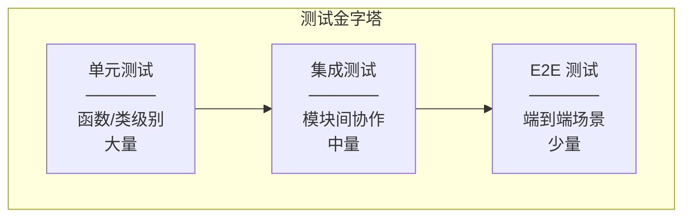

# 第 11 章 增强内容

> **内容**: 代码走读文档、开发者指南、ADR、算法分析、测试策略
> **价值**: 开发者上手与架构决策参考

---

## 11.1 代码走读文档（Code Walkthrough）

### 11.1.1 LightRAG 主类走读

#### 文件: lightrag.py

**走读路径**: `__post_init__` → `initialize_storages` → `ainsert` → `aquery` → `adelete_by_doc_id`

```python
# ===== 走读点 1: __post_init__ (第 981 行) =====
# 功能: dataclass 初始化后的额外配置
# 关键操作:
#   1. 设置工作目录 (os.makedirs)
#   2. 初始化 tokenizer (Tokenizer 实例化)
#   3. 配置 LLM 函数 (priority_limit_async_func_call 包装)
#   4. 配置 embedding 函数 (EmbeddingFunc 实例化)
#   5. 应用 addon_params 覆盖

# ===== 走读点 2: initialize_storages (第 1292 行) =====
# 功能: 异步初始化所有存储后端
# 关键操作:
#   1. 通过工厂方法创建存储实例
#   2. 调用各存储的 initialize() 建立连接
#   3. 注册流水线命名空间
# 注意: initialize() 顺序很重要，KV 必须先于其他存储

# ===== 走读点 3: ainsert (第 1490 行) =====
# 功能: 异步插入文档
# 关键操作:
#   1. 输入标准化 (列表化)
#   2. 文档 ID 生成 (compute_mdhash_id)
#   3. 状态初始化 (doc_status=PENDING)
#   4. 内容存储 (full_docs.upsert)
#   5. 流水线入队 (apipeline_enqueue_documents)
# 返回: None (异步操作)

# ===== 走读点 4: aquery (第 3205 行) =====
# 功能: 异步查询
# 关键操作:
#   1. 参数校验与补全
#   2. 缓存查询 (handle_cache)
#   3. 模式路由 (local/global/hybrid/naive/mix/bypass)
#   4. 上下文组装与截断
#   5. LLM 生成
#   6. 缓存保存 (save_to_cache)
# 返回: str (LLM 生成的回答)

# ===== 走读点 5: adelete_by_doc_id (第 4329 行) =====
# 功能: 异步删除文档
# 关键操作:
#   1. 获取文档信息
#   2. 获取关联块列表
#   3. 清理块数据 (KV + VDB)
#   4. 清理 KG 贡献 (_purge_kg_contributions)
#   5. 清理文档状态
# 返回: DeletionResult
```

### 11.1.2 知识图谱操作走读

#### 文件: operate.py

**走读路径**: `extract_entities` → `merge_nodes_and_edges` → `kg_query`

```python
# ===== 走读点 1: extract_entities (第 3559 行) =====
# 功能: 从文本块中抽取实体和关系
# 核心逻辑:
#   1. 遍历 chunks，对每个 chunk:
#      a. 构建提示词 (entity_extraction 模板)
#      b. 调用 LLM (通过 llm_func)
#      c. 解析返回的 JSON
#      d. 处理实体 (_handle_single_entity_extraction)
#      e. 处理关系 (_handle_single_relationship_extraction)
#   2. 存储原始结果到 full_entities/full_relations
# 并发控制: 通过信号量限制并发 LLM 调用

# ===== 走读点 2: merge_nodes_and_edges (第 3222 行) =====
# 功能: 合并同名实体和同义边
# 核心逻辑:
#   1. 按实体名称分组
#   2. 对每组:
#      a. 收集所有描述
#      b. 描述去重 (_combine_descriptions_dedup)
#      c. 合并来源列表
#      d. 更新权重
#   3. 写入图数据库和向量数据库

# ===== 走读点 3: kg_query (第 4027 行) =====
# 功能: 知识图谱增强查询
# 核心逻辑:
#   1. 提取查询关键词 (get_keywords_from_query)
#   2. 实体向量检索 (entities_vdb.query)
#   3. 关系向量检索 (relationships_vdb.query)
#   4. 获取关联块 (从 Graph 获取)
#   5. 重排序 (可选)
#   6. 上下文组装 (Token 控制截断)
#   7. LLM 生成回答
```

### 11.1.3 流水线走读

#### 文件: pipeline.py

**走读路径**: `apipeline_enqueue_documents` → `apipeline_process_enqueue_documents` → `_parse_worker` → `_process_worker`

```python
# ===== 走读点 1: apipeline_enqueue_documents (第 359 行) =====
# 功能: 文档入队
# 核心逻辑:
#   1. 解析处理选项 (resolve_file_parser_directives)
#   2. 生成文档 ID
#   3. 创建初始状态记录
#   4. 存储原始内容
#   5. 发送流水线消息

# ===== 走读点 2: apipeline_process_enqueue_documents (第 1174 行) =====
# 功能: 处理队列中的文档
# 核心逻辑:
#   1. 循环获取批次文档 (_pipeline_feeder)
#   2. 并发执行处理 (_run_pipeline_batch)
#   3. 处理完成回调

# ===== 走读点 3: _parse_worker (第 2545 行) =====
# 功能: 文档解析 Worker
# 核心逻辑:
#   1. 选择解析引擎
#   2. 调用解析器
#   3. 处理解析结果
#   4. 更新状态

# ===== 走读点 4: _process_worker (第 3042 行) =====
# 功能: 实体/关系抽取 Worker
# 核心逻辑:
#   1. 文本分块
#   2. 实体/关系抽取
#   3. 图谱合并
#   4. 存储写入
```

---

## 11.2 开发者上手指南

### 11.2.1 环境配置清单

#### 系统要求

| 项目 | 最低要求 | 推荐配置 |
|------|----------|----------|
| **操作系统** | Linux/macOS/Windows | Linux (Ubuntu 22.04) |
| **Python** | 3.10 | 3.11 |
| **内存** | 4 GB | 16 GB |
| **磁盘** | 1 GB 可用 | 50 GB SSD |
| **网络** | 互联网访问 | 高速网络 |

#### 依赖安装

```bash
# 1. 克隆仓库
git clone https://github.com/HKUDS/LightRAG.git
cd LightRAG

# 2. 创建虚拟环境
python -m venv venv
source venv/bin/activate  # Linux/macOS
# venv\Scripts\activate  # Windows

# 3. 安装核心包
pip install -e .

# 4. 安装 API 依赖（可选）
pip install -e ".[api]"

# 5. 安装测试依赖（可选）
pip install -e ".[test]"

# 6. 安装离线部署依赖（可选）
pip install -e ".[offline]"

# 7. 安装全部依赖
pip install -e ".[offline,test,evaluation,observability]"
```

### 11.2.2 本地运行

#### 方式 1: Python SDK

```python
import asyncio
from lightrag import LightRAG, QueryParam

async def main():
    # 初始化
    rag = LightRAG(
        working_dir="./rag_storage",
        llm_model_func=your_llm_function,  # 自定义 LLM 函数
        embedding_func=your_embedding_function,  # 自定义嵌入函数
    )

    # 初始化存储
    await rag.initialize_storages()

    # 插入文档
    await rag.ainsert("Your document content here...")

    # 查询
    result = await rag.aquery(
        "What is this document about?",
        param=QueryParam(mode="mix")
    )
    print(result)

    # 清理
    await rag.finalize_storages()

asyncio.run(main())
```

#### 方式 2: API Server

```bash
# 1. 配置环境变量
cp .env.example .env
# 编辑 .env 设置 LLM API Key 等

# 2. 启动服务器
python -m lightrag.api.lightrag_server

# 或使用 Gunicorn（生产）
python -m lightrag.api.run_with_gunicorn

# 3. 访问 API
# Swagger UI: http://localhost:9621/docs
# WebUI: http://localhost:9621

# 4. 测试 API
curl -X POST http://localhost:9621/query \
  -H "Content-Type: application/json" \
  -d '{"query": "What is LightRAG?", "mode": "mix"}'
```

#### 方式 3: Docker

```bash
# 1. 构建镜像
docker build -t lightrag:latest .

# 2. 运行容器
docker run -d \
  --name lightrag \
  -p 9621:9621 \
  -v ./data/rag_storage:/app/data/rag_storage \
  -v ./data/inputs:/app/data/inputs \
  -e LLM_API_KEY=your-key \
  lightrag:latest

# 或使用 Docker Compose
docker-compose up -d
```

### 11.2.3 调试技巧

#### VS Code 配置

```json
// .vscode/launch.json
{
    "version": "0.2.0",
    "configurations": [
        {
            "name": "Python: LightRAG",
            "type": "python",
            "request": "launch",
            "program": "${workspaceFolder}/examples/lightrag_openai_demo.py",
            "console": "integratedTerminal",
            "env": {
                "PYTHONPATH": "${workspaceFolder}"
            }
        },
        {
            "name": "Python: LightRAG Server",
            "type": "python",
            "request": "launch",
            "module": "lightrag.api.lightrag_server",
            "console": "integratedTerminal"
        }
    ]
}
```

#### 调试日志

```python
import logging
from lightrag.utils import set_verbose_debug

# 启用详细调试日志
set_verbose_debug(True)

# 设置日志级别
logging.getLogger("lightrag").setLevel(logging.DEBUG)
```

### 11.2.4 测试流程

```bash
# 运行全部测试
pytest tests/ -v

# 运行特定模块测试
pytest tests/kg/ -v
pytest tests/api/ -v
pytest tests/parser/ -v

# 运行特定测试
pytest tests/test_cosine_similarity.py -v

# 生成覆盖率报告
pytest tests/ --cov=lightrag --cov-report=html

# 异步测试
pytest tests/ -v -p no:warnings --asyncio-mode=auto
```

### 11.2.5 常见错误与解决

| 错误 | 原因 | 解决方案 |
|------|------|----------|
| `StorageNotInitializedError` | 未调用 initialize_storages | 确保 await rag.initialize_storages() |
| `ModuleNotFoundError` | 缺少依赖 | 安装对应 optional dependencies |
| `LLM 调用超时` | 网络或 LLM 服务问题 | 检查 API Key 和网络，增加超时时间 |
| `JSON 解析失败` | LLM 返回格式不正确 | 检查提示词，启用 json_repair |
| `内存不足` | 数据规模过大 | 使用专业存储后端，减少并发数 |

---

## 11.3 架构决策记录（ADR）

### ADR-001: 为什么选择混合存储架构

**状态**: 已接受

**背景**:
RAG 系统需要处理多种数据类型：文档（键值）、向量（语义检索）、图（关系检索）、状态（处理状态）。单一存储系统无法高效支持所有访问模式。

**决策**:
采用混合存储架构，定义四种存储类型（KV/Vector/Graph/DocStatus），每种类型可独立选择后端实现。

**理由**:
1. **访问模式差异**: 文档按 ID 访问（KV）、语义相似度搜索（Vector）、关系遍历（Graph）
2. **性能优化**: 不同存储系统针对各自访问模式优化
3. **独立扩展**: 各存储类型可独立选择后端和扩展
4. **渐进升级**: 原型阶段使用简单存储，生产环境切换到专业存储

**后果**:
- (+) 灵活性和可扩展性极高
- (+) 避免供应商锁定
- (-) 运维复杂度增加
- (-) 跨存储事务需要额外处理

### ADR-002: 为什么选择 AsyncIO 作为并发模型

**状态**: 已接受

**背景**:
RAG 系统的瓶颈在于 I/O 操作（LLM API 调用、数据库查询、文件读写）。需要选择高效的并发模型。

**决策**:
整个框架基于 Python AsyncIO 构建，所有 I/O 操作均为异步执行。

**理由**:
1. **I/O 密集型**: RAG 系统 80% 时间在等待 I/O
2. **单线程高效**: AsyncIO 在单线程内高效处理并发
3. **生态成熟**: FastAPI、asyncpg、httpx 等异步库成熟
4. **资源效率**: 相比多线程，内存占用更低

**后果**:
- (+) 高并发处理能力
- (+) 资源效率高
- (-) 学习曲线陡峭
- (-) CPU 密集型任务需要特殊处理（ThreadPoolExecutor）

### ADR-003: 为什么支持多种存储后端

**状态**: 已接受

**背景**:
不同用户有不同的基础设施环境。有些使用 PostgreSQL，有些使用 MongoDB，有些需要本地文件存储。

**决策**:
设计统一的存储抽象层，支持 13 种存储后端实现。

**理由**:
1. **环境适配**: 不同企业技术栈不同
2. **渐进升级**: 从 JSON 文件平滑过渡到 PostgreSQL
3. **性能选择**: 根据规模选择合适后端
4. **避免锁定**: 用户可随时切换后端

**后果**:
- (+) 极高的灵活性
- (+) 用户选择自由度大
- (-) 测试矩阵增大（13 种后端 × 各种组合）
- (-) 文档和维护成本增加

### ADR-004: 为什么引入 Reranker

**状态**: 已接受

**背景**:
向量检索返回的 Top-K 结果并非都与查询高度相关。直接将检索结果送入 LLM 会引入噪声。

**决策**:
在检索结果返回 LLM 之前，增加重排序步骤，使用专用 Reranker 模型对结果重新打分排序。

**理由**:
1. **精度提升**: Reranker 能更精确地评估相关性
2. **噪声减少**: 过滤掉低质量检索结果
3. **Token 节省**: 减少送入 LLM 的无关内容
4. **可配置**: 用户可选择启用/禁用

**后果**:
- (+) 检索精度提升 10-20%
- (+) LLM 回答质量提升
- (-) 增加一次 API 调用（延迟增加）
- (-) 增加成本（Reranker API 费用）

### ADR-005: 为什么引入角色化 LLM 配置

**状态**: 已接受

**背景**:
RAG 系统中不同任务对 LLM 的能力要求不同。实体抽取需要精确的结构化输出，查询回答需要自然的对话能力，多模态需要视觉理解。

**决策**:
定义 4 种 LLM 角色（EXTRACT/QUERY/KEYWORDS/VLM），每种角色可独立配置不同的 LLM 模型和参数。

**理由**:
1. **任务适配**: 不同任务使用最合适的 LLM
2. **成本优化**: 简单任务使用便宜模型，复杂任务使用强大模型
3. **灵活性**: 用户可根据需求独立配置
4. **性能**: 针对任务优化参数（如温度、最大 token）

**后果**:
- (+) 成本效益优化
- (+) 各任务性能最优
- (-) 配置复杂度增加
- (-) 需要用户理解各角色的用途

### ADR-006: 为什么使用 Mixin 组合模式

**状态**: 已接受

**背景**:
LightRAG 主类需要具备多种能力：角色化 LLM 配置、存储迁移、流水线处理。这些能力相对独立。

决策:
使用 Python 多继承和 Mixin 模式，将各能力封装为独立 Mixin 类。

**理由**:
1. **关注点分离**: 每个 Mixin 专注一个功能领域
2. **可维护性**: 每个 Mixin 可独立理解和修改
3. **可测试性**: Mixin 可独立测试
4. **代码复用**: Mixin 可被其他类复用

**后果**:
- (+) 代码组织清晰
- (+) 可维护性高
- (-) 多继承可能引入 MRO 复杂性
- (-) 需要理解 Mixin 间的依赖关系

---

## 11.4 关键算法分析

### 11.4.1 实体抽取算法

**伪代码**:
```
function EXTRACT_ENTITIES(chunks, llm_func, prompt_template):
    all_entities = {}
    all_relations = {}

    for chunk in chunks:
        # 1. 构建提示词
        prompt = prompt_template.format(input_text=chunk.content)

        # 2. 调用 LLM
        response = llm_func(prompt)

        # 3. 解析结果
        result = parse_json(response)

        # 4. 处理实体
        for entity in result.entities:
            name = normalize(entity.name)
            if name not in all_entities:
                all_entities[name] = []
            all_entities[name].append({
                "type": entity.type,
                "description": entity.description,
                "source": chunk.id
            })

        # 5. 处理关系
        for rel in result.relationships:
            key = (normalize(rel.source), normalize(rel.target))
            if key not in all_relations:
                all_relations[key] = []
            all_relations[key].append({
                "keywords": rel.keywords,
                "description": rel.description,
                "source": chunk.id
            })

    return all_entities, all_relations
```

**复杂度分析**:
- **时间复杂度**: O(n × LLM_LATENCY)，n 为 chunk 数量
- **空间复杂度**: O(e + r)，e 为实体数，r 为关系数
- **优化建议**: 批量调用 LLM（如果 API 支持），并发处理多个 chunk

### 11.4.2 图谱合并算法

**伪代码**:
```
function MERGE_NODES(entities_dict):
    merged = {}

    for name, records in entities_dict.items():
        # 1. 收集所有描述
        all_descriptions = [r.description for r in records]

        # 2. 描述去重（基于语义相似度）
        unique_descriptions = deduplicate(all_descriptions, threshold=0.85)

        # 3. 合并来源
        all_sources = set()
        total_weight = 0
        for r in records:
            all_sources.add(r.source)
            total_weight += 1

        # 4. 构建合并后的节点
        merged[name] = {
            "name": name,
            "type": most_common_type(records),
            "description": " | ".join(unique_descriptions),
            "source_ids": list(all_sources),
            "weight": total_weight
        }

    return merged
```

**复杂度分析**:
- **时间复杂度**: O(n × m)，n 为实体数，m 为平均描述数
- **空间复杂度**: O(n)
- **优化建议**: 使用向量相似度索引加速去重

### 11.4.3 向量检索 + 重排序

**伪代码**:
```
function SEARCH_WITH_RERANK(query, vdb, reranker, top_k=10):
    # 1. 查询向量化
    query_vector = embed(query)

    # 2. 向量检索（召回更多候选）
    candidates = vdb.search(query_vector, top_k=top_k*3)

    # 3. 重排序
    if reranker:
        scored = []
        for candidate in candidates:
            score = reranker.score(query, candidate.content)
            scored.append((candidate, score))

        # 按分数降序排序
        scored.sort(key=lambda x: x[1], reverse=True)

        # 取 Top-K
        results = scored[:top_k]
    else:
        results = candidates[:top_k]

    return results
```

**复杂度分析**:
- **时间复杂度**: O(d × log(n) + k × r)，d 为向量维度，n 为库大小，k 为候选数，r 为 Reranker 延迟
- **空间复杂度**: O(k)
- **优化建议**: 使用 ANN 索引（如 HNSW）加速向量检索

### 11.4.4 分块算法（Paragraph 策略）

**伪代码**:
```
function PARAGRAPH_CHUNK(text, embedding_func, min_size=100, max_size=2000):
    # 1. SPACY 段落识别
    paragraphs = spacy_split_paragraphs(text)

    # 2. 计算段落向量
    embeddings = []
    for para in paragraphs:
        emb = embedding_func(para.text)
        embeddings.append(emb)

    # 3. 计算相邻段落相似度
    similarities = []
    for i in range(len(paragraphs) - 1):
        sim = cosine_similarity(embeddings[i], embeddings[i+1])
        similarities.append(sim)

    # 4. 基于相似度聚类
    chunks = []
    current_chunk = paragraphs[0].text

    for i, sim in enumerate(similarities):
        if sim > 0.7 and token_count(current_chunk) < max_size:
            # 相似度高，合并
            current_chunk += "\n" + paragraphs[i+1].text
        else:
            # 相似度低，切分
            chunks.append(current_chunk)
            current_chunk = paragraphs[i+1].text

    chunks.append(current_chunk)

    return chunks
```

**复杂度分析**:
- **时间复杂度**: O(n × e)，n 为段落数，e 为嵌入延迟
- **空间复杂度**: O(n × d)，d 为嵌入维度
- **优化建议**: 批量计算嵌入，使用缓存

### 11.4.5 Token 截断算法

**伪代码**:
```
function TRUNCATE_BY_TOKEN(items, max_tokens, tokenizer, priority_fn):
    # 1. 按优先级排序
    sorted_items = sorted(items, key=priority_fn, reverse=True)

    # 2. 逐个添加直到达到上限
    selected = []
    total_tokens = 0

    for item in sorted_items:
        item_tokens = tokenizer.count_tokens(item.content)

        if total_tokens + item_tokens <= max_tokens:
            selected.append(item)
            total_tokens += item_tokens
        else:
            # 尝试截断当前项
            remaining = max_tokens - total_tokens
            if remaining > 50:  # 至少保留 50 token
                truncated = tokenizer.truncate(item.content, remaining)
                selected.append(truncated)
            break

    return selected
```

**复杂度分析**:
- **时间复杂度**: O(n log n)，主要来自排序
- **空间复杂度**: O(n)
- **优化建议**: 使用堆排序或快速选择算法

---

## 11.5 测试策略与主要测试用例

### 11.5.1 测试金字塔



### 11.5.2 测试覆盖范围

| 测试类型 | 覆盖范围 | 文件位置 | 数量 |
|----------|----------|----------|------|
| **单元测试** | 函数级别 | `tests/test_*.py` | 10+ |
| **存储测试** | 各存储后端 | `tests/kg/` | 34 |
| **LLM 测试** | LLM 集成 | `tests/llm/` | 27 |
| **解析器测试** | 文档解析 | `tests/parser/` | 20 |
| **流水线测试** | 文档入库 | `tests/pipeline/` | 33 |
| **API 测试** | REST API | `tests/api/` | 12 |
| **分块测试** | 分块策略 | `tests/chunker/` | 17 |
| **评估测试** | RAGAS 评估 | `tests/evaluation/` | 4 |

### 11.5.3 主要测试用例

#### 存储后端测试

```python
# tests/kg/test_postgres.py
class TestPostgresStorage:
    """PostgreSQL 存储测试"""

    async def test_kv_upsert_and_get(self):
        """测试 KV 存储的插入和查询"""
        storage = PGKVStorage(namespace="test", global_config={})
        await storage.initialize()

        data = {"key1": {"value": "test"}}
        await storage.upsert(data)
        result = await storage.get_by_id("key1")
        assert result["value"] == "test"

    async def test_vector_query(self):
        """测试向量检索"""
        storage = PGVectorStorage(namespace="test", global_config={}, embedding_func=mock_embed)
        await storage.initialize()

        data = {"id1": {"vector": [0.1, 0.2, ...], "metadata": {"name": "test"}}}
        await storage.upsert(data)
        results = await storage.query("test query", top_k=5)
        assert len(results) > 0
```

#### 流水线测试

```python
# tests/pipeline/test_pipeline.py
class TestPipeline:
    """流水线测试"""

    async def test_document_insertion(self):
        """测试文档入库完整流程"""
        rag = LightRAG(working_dir="./test_data")
        await rag.initialize_storages()

        doc_id = await rag.ainsert("Test document content")
        assert doc_id is not None

        # 等待处理完成
        await asyncio.sleep(2)

        status = await rag.get_docs_by_status(DocStatus.PROCESSED)
        assert doc_id in status

    async def test_pipeline_cancellation(self):
        """测试流水线取消"""
        # ...
```

#### API 测试

```python
# tests/api/test_query.py
class TestQueryAPI:
    """查询 API 测试"""

    async def test_query_endpoint(self):
        """测试查询端点"""
        response = client.post("/query", json={
            "query": "What is LightRAG?",
            "mode": "mix"
        })
        assert response.status_code == 200
        assert "response" in response.json()

    async def test_streaming_query(self):
        """测试流式查询"""
        # ...
```

### 11.5.4 测试最佳实践

1. **使用 fixtures**: 复用测试数据和配置
2. **异步测试**: 使用 pytest-asyncio
3. **Mock 外部依赖**: LLM API、外部服务
4. **清理测试数据**: 每个测试后清理
5. **参数化测试**: 使用 `@pytest.mark.parametrize`

```python
# conftest.py 示例
@pytest.fixture
async def rag_instance():
    """创建测试用 LightRAG 实例"""
    rag = LightRAG(
        working_dir="./test_data",
        llm_model_func=mock_llm_func,
        embedding_func=mock_embedding_func,
    )
    await rag.initialize_storages()
    yield rag
    await rag.finalize_storages()
    # 清理测试数据
    shutil.rmtree("./test_data", ignore_errors=True)
```

---

## 11.6 本章小结

本章提供了丰富的增强内容：

1. **代码走读**: 详细的代码阅读路径和关键点注释
2. **开发者指南**: 从环境配置到调试的完整上手流程
3. **ADR**: 6 个重要架构决策的背景、理由和后果
4. **算法分析**: 5 个关键算法的伪代码和复杂度分析
5. **测试策略**: 测试金字塔、覆盖范围、主要用例

下一章将详细分析所有存储后端实现。

---

> **下一章**: [11-存储后端详解.md](./11-存储后端详解.md)

---

# ❤️ 制作不易，请我喝咖啡☕️关注我➕

