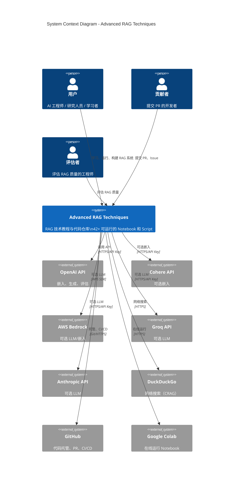
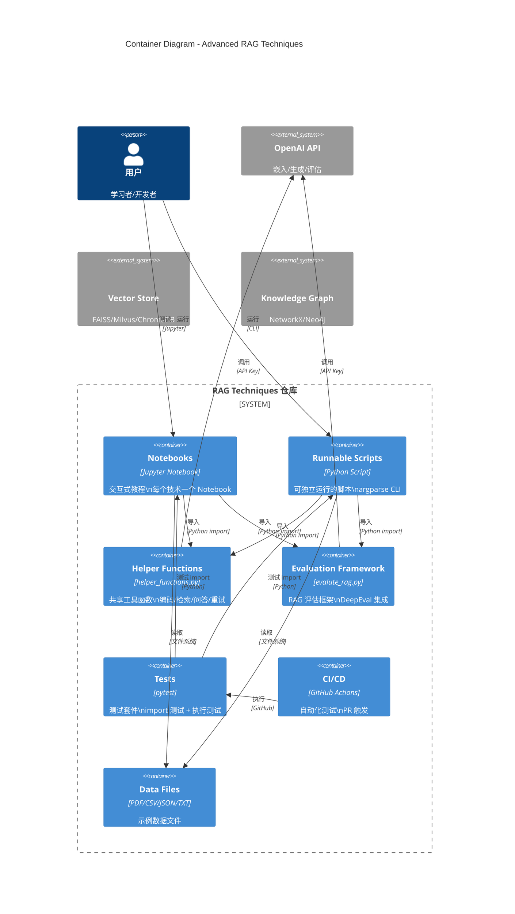
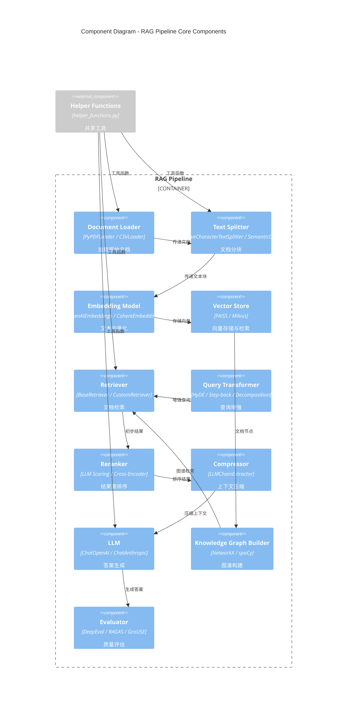
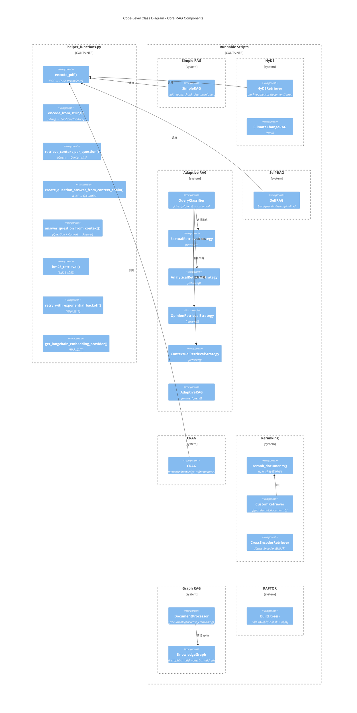

# 2. C4 架构模型 (C4 Architecture Model)

> 本章使用 C4 模型（Context、Container、Component、Code）对 Advanced RAG Techniques 项目进行四层架构描述，每层均包含 Mermaid 图表及详细文字说明。预计字数：~12000 字。

---

## 2.1 C4 模型概述

C4 模型是由 Simon Brown 提出的软件架构描述框架，包含四个抽象层级：

| 层级 | 名称 | 关注点 | 受众 |
|------|------|--------|------|
| **L1** | System Context | 系统与外部实体的关系 | 所有人 |
| **L2** | Container | 系统内部的主要容器（应用/数据库） | 开发者、运维 |
| **L3** | Component | 容器内部的组件结构 | 开发者 |
| **L4** | Code | 组件内部的类/函数结构 | 开发者 |

> **注意**：本项目是一个 **教程/代码仓库**（非在线服务），因此 C4 模型中的"系统"指的是 **RAG 技术实现框架**，"用户"指的是 **学习者/开发者/研究人员**。

---

## 2.2 L1: System Context（系统上下文）

### 2.2.1 Context 图（Mermaid）



### 2.2.2 Context 图详细解释（500+ 字）

**系统上下文图**展示了 Advanced RAG Techniques 系统与所有外部实体的交互关系。

**核心系统**：Advanced RAG Techniques 是一个 **RAG 技术教程与代码实现仓库**，包含 42+ 个可运行的 Jupyter Notebook 和 Python 脚本，覆盖从基础到前沿的 RAG 技术。系统的核心价值在于 **教育性**（每个技术配有直觉解释）和 **工程性**（生产级代码模式）。

**外部用户（Person）**：
- **用户（User）**：AI 工程师、研究人员、学习者，他们使用本项目学习 RAG 概念、运行代码、构建自己的 RAG 系统。用户通过阅读 Notebook、运行 Script、修改参数来与系统交互。
- **贡献者（Contributor）**：开发者，通过 GitHub PR 提交新的 RAG 技术实现、修复 Bug、改进文档。贡献流程在 `CONTRIBUTING.md` 中详细描述。
- **评估者（Evaluator）**：负责评估 RAG 系统质量的工程师，使用 DeepEval、GroUSE、RAGAS 等框架评估检索和生成质量。

**外部系统（System_Ext）**：
- **OpenAI API**：最核心的外部依赖，提供嵌入（`text-embedding-3`）、生成（GPT-4o/4o-mini）、评估（GPT-4-turbo）能力。所有技术默认使用 OpenAI。
- **Cohere API**：可选嵌入提供方，通过 `EmbeddingProvider.COHERE` 枚举选择。
- **AWS Bedrock**：可选 LLM/嵌入提供方，适合生产环境（企业级安全）。
- **Groq API**：可选 LLM 提供方，通过 `ModelProvider.GROQ` 枚举选择。
- **Anthropic API**：可选 LLM 提供方（Claude），通过 `ModelProvider.ANTHROPIC` 枚举选择。
- **DuckDuckGo**：CRAG 技术的网络搜索回退，当检索结果相关性低于阈值时使用。
- **GitHub**：代码托管、PR 管理、CI/CD（GitHub Actions）。
- **Google Colab**：在线运行 Notebook 的平台，降低用户本地环境配置门槛。

**设计 Rationale**：
1. **多 Provider 支持**：通过枚举 + 工厂方法模式，系统不绑定单一 LLM 提供商
2. **外部搜索回退**：CRAG 使用 DuckDuckGo 作为知识库不足时的补充
3. **Colab 支持**：降低入门门槛，用户无需本地 GPU/API Key 即可体验

**边界**：本系统 **不** 提供在线 API 服务、**不** 存储用户数据、**不** 管理用户认证。它是一个 **本地运行的代码仓库**。

---

## 2.3 L2: Container（容器视图）

### 2.3.1 Container 图（Mermaid）



### 2.3.2 Container 图详细解释（500+ 字）

**容器视图**展示了系统内部的主要可部署/可执行单元及其关系。

**容器描述**：

1. **Notebooks（Jupyter Notebook）**：系统的核心教学单元，每个 RAG 技术对应一个 `.ipynb` 文件。Notebook 包含 Markdown 解释、代码单元格、可视化图表。用户通过 Jupyter 环境交互式运行。

2. **Runnable Scripts（Python Script）**：每个 Notebook 对应的独立可运行脚本（部分技术有）。通过 `argparse` 提供 CLI 接口，支持参数化运行（如 `--path`、`--query`、`--chunk_size`）。适合生产环境和批处理。

3. **Helper Functions（helper_functions.py）**：**整个项目的核心共享模块**（362 行），提供：
   - 文档编码：`encode_pdf()`、`encode_from_string()`
   - 检索：`retrieve_context_per_question()`、`bm25_retrieval()`
   - 问答链：`create_question_answer_from_context_chain()`、`answer_question_from_context()`
   - 工具函数：`replace_t_with_space()`、`text_wrap()`、`read_pdf_to_string()`
   - 异步重试：`retry_with_exponential_backoff()`、`exponential_backoff()`
   - 模型工厂：`get_langchain_embedding_provider()`
   - 枚举定义：`EmbeddingProvider`、`ModelProvider`
   - 结构化输出模型：`QuestionAnswerFromContext`

4. **Evaluation Framework（evalute_rag.py）**：RAG 评估框架，集成 DeepEval 库，提供：
   - `create_deep_eval_test_cases()`：创建评估测试用例
   - `evaluate_rag()`：评估 RAG 系统性能
   - 指标定义：`correctness_metric`、`faithfulness_metric`、`relevance_metric`

5. **Tests（pytest）**：测试套件，包含：
   - `conftest.py`：共享 fixture（llm, embeddings, vector_store, retriever）
   - `test_imports.py`：验证所有 Notebook 和 Script 的 import 语句可执行

6. **CI/CD（GitHub Actions）**：自动化工作流：
   - `github-test.yml`：PR 触发，运行 pytest
   - `local-test.yml`：本地使用 `act` 工具运行测试

7. **Data Files**：示例数据文件（PDF、CSV、JSON、TXT），用于演示各技术。

**容器间关系**：
- Notebooks 和 Scripts **都依赖** Helper Functions 和 Evaluation Framework
- Helper Functions 是 **最底层共享模块**，被所有技术文件导入
- CI/CD 自动化测试 Notebooks 和 Scripts 的 import 可执行性

**设计 Rationale**：
1. **双轨制**：Notebook 用于教学（可视化、解释），Script 用于生产（CLI、错误处理）
2. **共享核心**：`helper_functions.py` 避免代码重复，确保一致性
3. **测试优先**：import 测试确保所有文件的基本可执行性

---

## 2.4 L3: Component（组件视图）

### 2.4.1 Component 图（Mermaid）



### 2.4.2 Component 图详细解释（500+ 字）

**组件视图**展示了 RAG 管道内部的核心组件及其交互关系。

**核心组件描述**：

1. **Document Loader（文档加载器）**：负责加载原始文档。PyPDFLoader 用于 PDF，CSVLoader 用于 CSV，SimpleDirectoryReader（LlamaIndex）用于目录。

2. **Text Splitter（文本分割器）**：将文档切分为可管理的块。支持：
   - `RecursiveCharacterTextSplitter`：递归字符切分（默认）
   - `SemanticChunker`：基于语义的切分（使用 GaussianMixture 聚类）
   - `SentenceSplitter`（LlamaIndex）：句子级切分

3. **Embedding Model（嵌入模型）**：将文本转换为向量。支持 OpenAI、Cohere、Bedrock 等多种提供方，通过 `EmbeddingProvider` 枚举选择。

4. **Vector Store（向量存储）**：存储和检索向量。默认使用 FAISS（Facebook AI Similarity Search），支持 Milvus（分布式）、ChromaDB。

5. **Retriever（检索器）**：核心检索组件，基于 LangChain 的 `BaseRetriever` 抽象。包含多种实现：
   - 基础向量检索
   - BM25 关键词检索
   - 混合检索（向量 + BM25）
   - 图谱检索（KG-based）

6. **Query Transformer（查询变换器）**：在检索前增强查询。包括：
   - HyDE：生成假设计答文档
   - Step-back：生成更宽泛的查询
   - Sub-query Decomposition：分解为子查询

7. **Reranker（重排序器）**：对初步检索结果重排序。支持：
   - LLM 评分（1-10 分）
   - Cross-Encoder（ms-marco-MiniLM-L-6-v2）

8. **Compressor（压缩器）**：压缩检索结果，保留关键信息。使用 `LLMChainExtractor`。

9. **LLM（大语言模型）**：生成最终答案。支持 OpenAI、Anthropic、Groq、Bedrock。

10. **Knowledge Graph Builder（知识图谱构建器）**：使用 NetworkX 和 spaCy 构建实体-关系图，支持多跳检索。

11. **Evaluator（评估器）**：评估 RAG 质量，集成 DeepEval、RAGAS、GroUSE 等框架。

**组件交互流程**：
```
Document → Loader → Splitter → Embedding → VectorStore
                                                  ↓
User Query → QueryTransformer → Retriever → Reranker → Compressor → LLM → Answer
                                                          ↑
                                                  KnowledgeGraph
```

**设计 Rationale**：
1. **组件化**：每个组件可独立替换（如切换 Embedding Provider）
2. **管道模式**：数据流清晰，易于调试和扩展
3. **可选组件**：Query Transformer、Reranker、Compressor 均为可选，按技术需求组合

---

## 2.5 L4: Code（代码/类视图）

### 2.5.1 Code 图 - 核心类关系（Mermaid）



### 2.5.2 Code 图详细解释（500+ 字）

**代码/类视图**展示了核心组件内部的类结构和函数关系。

**helper_functions.py 核心函数**：

| 函数 | 输入 | 输出 | 职责 |
|------|------|------|------|
| `encode_pdf(path, chunk_size, chunk_overlap)` | PDF 路径 | FAISS VectorStore | PDF → 分块 → 嵌入 → 向量存储 |
| `encode_from_string(content, chunk_size, chunk_overlap)` | 文本字符串 | FAISS VectorStore | 文本 → 分块 → 嵌入 → 向量存储 |
| `retrieve_context_per_question(question, retriever)` | 问题 + Retriever | 上下文列表 | 检索相关文档 |
| `create_question_answer_from_context_chain(llm)` | LLM | Chain | 创建问答链 |
| `answer_question_from_context(question, context, chain)` | 问题 + 上下文 + Chain | 答案字典 | 生成答案 |
| `bm25_retrieval(bm25, texts, query, k)` | BM25 索引 + 查询 | Top-k 文本 | BM25 检索 |
| `retry_with_exponential_backoff(coroutine, max_retries)` | 协程 | 结果 | 指数退避重试 |
| `get_langchain_embedding_provider(provider, model_id)` | 枚举 + 模型 ID | 嵌入模型 | 嵌入工厂 |

**核心类描述**：

1. **SimpleRAG**（`simple_rag.py`）：最简单的 RAG 实现，`__init__` 编码 PDF，`run(query)` 检索并显示上下文。

2. **HyDERetriever**（`HyDe_Hypothetical_Document_Embedding.py`）：HyDE 技术的核心类，`generate_hypothetical_document(query)` 生成假设计答文档，`retrieve(query, k)` 使用假设计答进行检索。

3. **AdaptiveRAG**（`adaptive_retrieval.py`）：自适应 RAG 的核心类，包含：
   - `QueryClassifier`：将查询分类为 Factual/Analytical/Opinion/Contextual
   - 四种检索策略：`FactualRetrievalStrategy`、`AnalyticalRetrievalStrategy`、`OpinionRetrievalStrategy`、`ContextualRetrievalStrategy`
   - `answer(query)` 方法：分类 → 选择策略 → 检索 → 生成答案

4. **SelfRAG**（`self_rag.py`）：自反思 RAG，6 步流水线：
   - 决定是否需要检索
   - 检索文档
   - 评估相关性
   - 生成答案
   - 评估支持度
   - 评估效用

5. **CRAG**（`crag.py`）：纠错 RAG，包含：
   - `evaluate_documents(query, documents)`：评估检索结果相关性
   - `knowledge_refinement(document)`：提取关键点
   - `rewrite_query(query)`：重写查询用于网络搜索

6. **CustomRetriever / CrossEncoderRetriever**（`reranking.py`）：两种重排序检索器实现。

7. **DocumentProcessor / KnowledgeGraph**（`graph_rag.py`）：
   - `DocumentProcessor`：处理文档、创建嵌入、计算相似度矩阵
   - `KnowledgeGraph`：构建知识图谱、添加节点/边、提取概念

**设计模式应用**：
- **Strategy 模式**：AdaptiveRAG 的四种检索策略
- **Template Method**：所有 RAG 类的 `run()` 方法
- **Factory 模式**：`get_langchain_embedding_provider()`
- **Chain of Responsibility**：Self-RAG 的多步评估链

---

## 2.6 架构层次总结

| 层级 | 关注点 | 核心内容 |
|------|--------|----------|
| **L1 Context** | 系统与外部关系 | 用户、贡献者、LLM API、向量存储、GitHub |
| **L2 Container** | 可执行单元 | Notebooks、Scripts、Helper、Eval、Tests、CI/CD、Data |
| **L3 Component** | 管道组件 | Loader、Splitter、Embedding、VectorStore、Retriever、LLM、Evaluator |
| **L4 Code** | 类与函数 | SimpleRAG、HyDE、AdaptiveRAG、Self-RAG、CRAG、Reranker、KnowledgeGraph |

**架构优势**：
1. **关注点分离**：教学（Notebook）与生产（Script）分离
2. **代码复用**：`helper_functions.py` 统一共享
3. **可扩展性**：新增技术只需添加文件 + 更新 README
4. **可测试性**：import 测试确保基本可执行性
5. **多 Provider 支持**：枚举 + 工厂模式支持多种 LLM/嵌入

**架构局限**：
1. **无服务层**：当前为脚本模式，无 REST API / Web 服务
2. **无持久化**：每次运行重新编码，无缓存机制
3. **无并发控制**：脚本级运行，无分布式处理
4. **测试覆盖有限**：当前仅 import 测试，缺乏单元测试

---

☕️ 制作不易，请我喝咖啡☕️关注我➕

